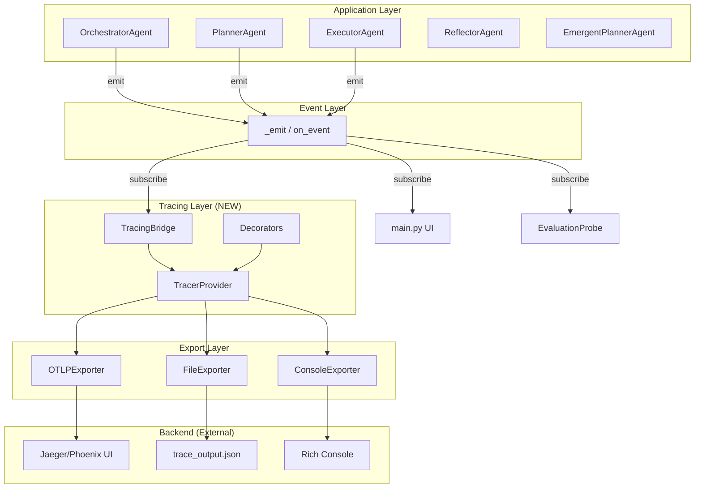

# 全链路 Tracing 模块设计与实现

## 背景与目标

当前 manus_demo 项目的可观察性依赖于轻量级的内存事件回调机制（`_emit`/`on_event`），仅支持本地控制台输出和离线评测。缺乏：
1. 持久化的追踪数据存储
2. 结构化的 Span 层级和时间线
3. LLM 调用粒度的性能分析
4. 跨组件的因果关系追踪

本模块将引入基于 **OpenTelemetry** 标准的全链路 tracing，覆盖任务的完整生命周期：分类 → 规划 → 执行 → 反思 → 持久化。

> [!IMPORTANT]
> 设计原则：**零侵入核心逻辑** —— 参照现有 `EvaluationProbe` 的成功模式，通过事件桥接 + 装饰器方式集成，不修改核心 Agent 的业务逻辑代码。

## Proposed Changes

### Tracing 核心模块

#### [NEW] [__init__.py](file:///Users/shixiangweii/PycharmProjects/manus_learn_proj/manus_demo/tracing/__init__.py)

模块入口，导出公共 API。

#### [NEW] [config.py](file:///Users/shixiangweii/PycharmProjects/manus_learn_proj/manus_demo/tracing/config.py)

Tracing 配置管理：
- `TRACING_ENABLED`: 总开关（默认 `false`，向后兼容）
- `TRACING_BACKEND`: 导出后端选择（`console` / `otlp` / `phoenix` / `file`）
- `TRACING_ENDPOINT`: OTLP 端点地址
- `TRACING_SERVICE_NAME`: 服务标识
- `TRACING_SAMPLE_RATE`: 采样率（0.0-1.0）
- `TRACING_LOG_PROMPTS`: 是否记录完整 prompt（默认 `false`，隐私保护）
- `TRACING_MAX_ATTRIBUTE_LENGTH`: 属性值最大长度（截断保护）

#### [NEW] [provider.py](file:///Users/shixiangweii/PycharmProjects/manus_learn_proj/manus_demo/tracing/provider.py)

TracerProvider 工厂，负责初始化 OpenTelemetry SDK：
- 配置 Resource（service.name, service.version, environment）
- 根据 `TRACING_BACKEND` 创建对应的 SpanExporter
- 配置采样策略（`TraceIdRatioBased`）
- 提供全局 `get_tracer(name)` 便捷方法

#### [NEW] [spans.py](file:///Users/shixiangweii/PycharmProjects/manus_learn_proj/manus_demo/tracing/spans.py)

Span 层级定义和语义常量：
- 定义标准 Span 名称常量（`SPAN_TASK_EXECUTION`, `SPAN_PLANNING`, `SPAN_DAG_SUPERSTEP`, `SPAN_REACT_LOOP`, `SPAN_LLM_CALL`, `SPAN_TOOL_CALL` 等）
- 定义标准 Attribute 键名（遵循 OTel GenAI Semantic Conventions）
- 定义标准 Event 名称

#### [NEW] [decorators.py](file:///Users/shixiangweii/PycharmProjects/manus_learn_proj/manus_demo/tracing/decorators.py)

声明式埋点装饰器：
- `@traced(span_name, attributes={})`: 通用方法追踪装饰器
- `@traced_llm_call`: 专用于 LLM 调用的装饰器（自动记录 model, tokens, latency）
- `@traced_tool_call`: 专用于工具调用的装饰器（自动记录 tool_name, params, result）
- 支持同步和异步方法

#### [NEW] [bridge.py](file:///Users/shixiangweii/PycharmProjects/manus_learn_proj/manus_demo/tracing/bridge.py)

事件桥接器 —— 将现有 `_emit` 事件流转换为 OTel Spans：
- `TracingBridge` 类：实现 `on_event(event, data)` 接口
- 维护 Span 栈（parent-child 关系）
- 事件到 Span 的映射规则表
- 支持与 `EvaluationProbe` 共存（多订阅者模式）

#### [NEW] [exporters.py](file:///Users/shixiangweii/PycharmProjects/manus_learn_proj/manus_demo/tracing/exporters.py)

自定义导出器：
- `FileSpanExporter`: 将 Trace 导出为 JSON 文件（便于离线分析）
- `RichConsoleExporter`: 将 Trace 实时渲染为 Rich Tree（开发调试用）

---

### 核心模块集成点

#### [MODIFY] [config.py](file:///Users/shixiangweii/PycharmProjects/manus_learn_proj/manus_demo/config.py)

新增 Tracing 相关环境变量读取：
```diff
+ # ======================================================================
+ # Tracing Configuration (v7)
+ # ======================================================================
+ TRACING_ENABLED: bool = os.getenv("TRACING_ENABLED", "false").lower() == "true"
+ TRACING_BACKEND: str = os.getenv("TRACING_BACKEND", "console")
+ TRACING_ENDPOINT: str = os.getenv("TRACING_ENDPOINT", "http://localhost:4318")
+ TRACING_SERVICE_NAME: str = os.getenv("TRACING_SERVICE_NAME", "manus-demo")
+ TRACING_SAMPLE_RATE: float = float(os.getenv("TRACING_SAMPLE_RATE", "1.0"))
+ TRACING_LOG_PROMPTS: bool = os.getenv("TRACING_LOG_PROMPTS", "false").lower() == "true"
+ TRACING_MAX_ATTRIBUTE_LENGTH: int = int(os.getenv("TRACING_MAX_ATTR_LENGTH", "1000"))
```

#### [MODIFY] [orchestrator.py](file:///Users/shixiangweii/PycharmProjects/manus_learn_proj/manus_demo/agents/orchestrator.py)

在 `OrchestratorAgent.__init__` 中初始化 TracingBridge，并通过多播模式与现有 `on_event` 共存：
```diff
+ from tracing import TracingBridge, init_tracing
+
  def __init__(self, ...):
      ...
+     # 初始化 Tracing（如果启用）
+     self._tracing_bridge = TracingBridge() if config.TRACING_ENABLED else None
+     # 包装 on_event 为多播：同时发送给 UI + Tracing
+     original_on_event = on_event or (lambda *_: None)
+     if self._tracing_bridge:
+         self._on_event = lambda evt, data: (
+             original_on_event(evt, data),
+             self._tracing_bridge.on_event(evt, data),
+         )
+     else:
+         self._on_event = original_on_event
```

#### [MODIFY] [client.py](file:///Users/shixiangweii/PycharmProjects/manus_learn_proj/manus_demo/llm/client.py)

在 `chat`, `chat_with_tools`, `chat_json` 方法中添加 `@traced_llm_call` 装饰器或手动 Span：
- 记录 `gen_ai.request.model`, `gen_ai.usage.input_tokens`, `gen_ai.usage.output_tokens`
- 记录 latency_ms
- 错误时记录异常信息和重试次数

#### [MODIFY] [base.py](file:///Users/shixiangweii/PycharmProjects/manus_learn_proj/manus_demo/tools/base.py)

在 `BaseTool.execute()` 添加 tracing hook：
- 记录 `tool.name`, `tool.parameters`, `tool.latency_ms`
- 错误时记录 `tool.error`

---

### 设计文档

#### [NEW] [tracing-design.md](file:///Users/shixiangweii/PycharmProjects/manus_learn_proj/manus_demo/sxw_aicoding/docs/tracing-design.md)

完整的设计文档，包含：
- 需求分析（性能、准确性、易用性）
- 架构图（Mermaid）
- Span 层级树设计
- 数据流图
- 与现有系统的集成策略
- Feature Flag 控制策略
- 隐私与安全考量

---

### 依赖与配置

#### [MODIFY] [requirements.txt](file:///Users/shixiangweii/PycharmProjects/manus_learn_proj/manus_demo/requirements.txt)

```diff
+ # Tracing (v7)
+ opentelemetry-api>=1.27.0
+ opentelemetry-sdk>=1.27.0
+ opentelemetry-exporter-otlp>=1.27.0
```

#### [MODIFY] [.env.example](file:///Users/shixiangweii/PycharmProjects/manus_learn_proj/manus_demo/.env.example)

新增 Tracing 配置示例。

---

### 测试

#### [NEW] [test_tracing.py](file:///Users/shixiangweii/PycharmProjects/manus_learn_proj/manus_demo/tests/test_tracing.py)

测试覆盖：
- TracingBridge 事件映射正确性
- Span 父子关系正确性
- 装饰器在同步/异步场景下的行为
- Feature Flag 关闭时零开销验证
- FileSpanExporter 输出格式验证

---

## 架构图



## Span 层级设计

```
Trace: task_execution/{task_id}
├── Span: orchestrator.gather_context
│   ├── Span: memory.search
│   └── Span: knowledge.retrieve
├── Span: planner.classify_task
│   └── Span: llm.chat (classification)
├── Span: planner.create_dag / planner.create_plan
│   └── Span: llm.chat_json (plan generation)
├── Span: dag.execution / simple.execution / emergent.execution
│   ├── Span: dag.super_step.{n}
│   │   ├── Span: node.execute.{node_id}
│   │   │   ├── Span: react.iteration.{i}
│   │   │   │   ├── Span: llm.chat_with_tools
│   │   │   │   └── Span: tool.execute.{tool_name}
│   │   │   └── Span: react.iteration.{i+1}
│   │   └── Span: node.execute.{node_id_2}  (并行)
│   └── Span: dag.super_step.{n+1}
├── Span: reflector.reflect
│   └── Span: llm.chat_json (reflection)
└── Span: memory.store
```

## Verification Plan

### Automated Tests

```bash
# 运行 tracing 模块单元测试
pytest tests/test_tracing.py -v

# 验证 Feature Flag 关闭时无副作用
TRACING_ENABLED=false pytest tests/ -v

# 验证 Tracing 开启时端到端流程正常
TRACING_ENABLED=true TRACING_BACKEND=console pytest tests/test_tracing.py -v
```

### Manual Verification

- 启用 `TRACING_BACKEND=file`，执行一个简单任务，检查输出的 JSON trace 文件结构是否正确
- 启用 `TRACING_BACKEND=console`，观察 Rich 控制台是否正确渲染 Span 树
- 验证 Tracing 关闭时（`TRACING_ENABLED=false`）无性能开销
- 如有条件，启动 Phoenix/Jaeger UI 查看完整 Trace 可视化


---
生成时间: 2026/5/11 10:29:12
planId: 0d3c4309-1c63-47ae-8ce0-ccf48690257d
plan_status: review