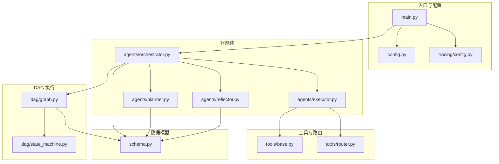
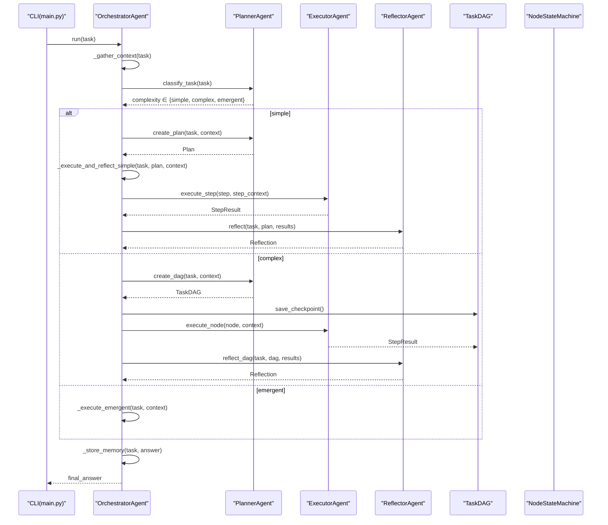
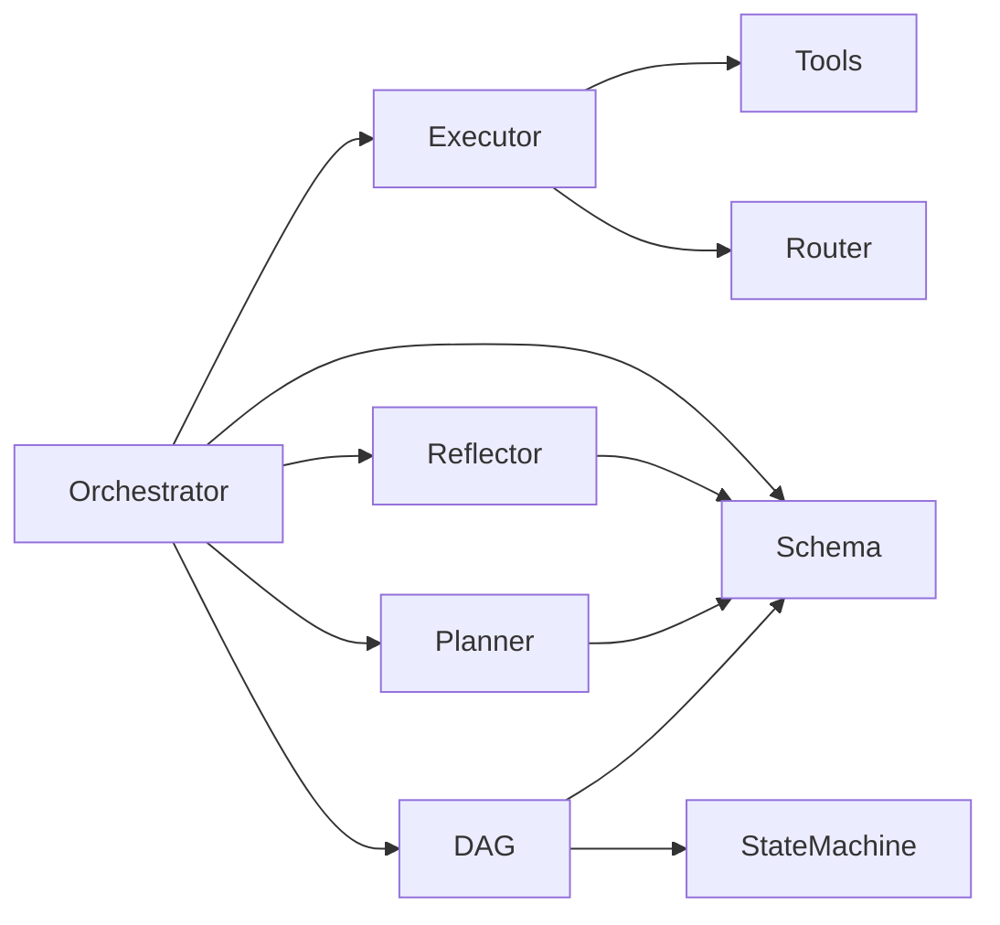

# API参考

<cite>
**本文引用的文件**
- [main.py](file://main.py)
- [config.py](file://config.py)
- [schema.py](file://schema.py)
- [agents/orchestrator.py](file://agents/orchestrator.py)
- [agents/planner.py](file://agents/planner.py)
- [agents/executor.py](file://agents/executor.py)
- [agents/reflector.py](file://agents/reflector.py)
- [dag/graph.py](file://dag/graph.py)
- [dag/state_machine.py](file://dag/state_machine.py)
- [tools/base.py](file://tools/base.py)
- [tools/router.py](file://tools/router.py)
- [tracing/config.py](file://tracing/config.py)
- [README.md](file://README.md)
</cite>

## 目录
1. [简介](#简介)
2. [项目结构](#项目结构)
3. [核心组件](#核心组件)
4. [架构总览](#架构总览)
5. [详细组件分析](#详细组件分析)
6. [依赖分析](#依赖分析)
7. [性能考量](#性能考量)
8. [故障排查指南](#故障排查指南)
9. [结论](#结论)
10. [附录](#附录)

## 简介
本文件为 manus_demo 的全面 API 参考，聚焦 OrchestratorAgent、TaskDAG、BaseTool 等核心组件的公共接口与行为，系统梳理数据模型（TaskNode、DAGState、Plan 等）的字段定义与验证规则，给出配置参数的完整说明（环境变量与配置项），记录事件系统（事件类型、回调接口、UI 映射），并提供使用示例与参数约束、错误码与异常处理说明，以及版本兼容性与迁移指南。

## 项目结构
manus_demo 采用“多智能体 + DAG 执行”的分层架构，核心模块包括：
- agents：OrchestratorAgent、PlannerAgent、ExecutorAgent、ReflectorAgent 等
- dag：TaskDAG、NodeStateMachine、DAGExecutor
- tools：BaseTool 抽象与具体工具（web_search、code_executor、file_ops、shell_tool）
- schema：Pydantic 数据模型（TaskNode、DAGState、Plan、Reflection、TokenUsage 等）
- config：环境变量与配置项
- tracing：OpenTelemetry 集成配置
- main：CLI 入口与 Rich UI 事件映射

图表来源
- [main.py:1-516](file://main.py#L1-L516)
- [config.py:1-109](file://config.py#L1-L109)
- [schema.py:1-688](file://schema.py#L1-L688)
- [agents/orchestrator.py:1-600](file://agents/orchestrator.py#L1-L600)
- [agents/planner.py:1-934](file://agents/planner.py#L1-L934)
- [agents/executor.py:1-323](file://agents/executor.py#L1-L323)
- [agents/reflector.py:1-255](file://agents/reflector.py#L1-L255)
- [dag/graph.py:1-627](file://dag/graph.py#L1-L627)
- [dag/state_machine.py:1-114](file://dag/state_machine.py#L1-L114)
- [tools/base.py:1-175](file://tools/base.py#L1-L175)
- [tools/router.py:1-168](file://tools/router.py#L1-L168)
- [tracing/config.py:1-79](file://tracing/config.py#L1-L79)

章节来源
- [README.md:1-400](file://README.md#L1-L400)

## 核心组件
本节概述主要 API 的职责与公共接口。

- OrchestratorAgent
  - 职责：混合路由（v4）任务分类、v1/v2/v5 路径编排、上下文收集、反思与记忆存储、事件广播
  - 关键方法：run(task)、_execute_and_reflect_simple()、_execute_dag_and_reflect()、_execute_emergent()、_store_memory()、_emit()
  - 关键属性：llm_client、context_manager、planner、executor_agent、reflector、emergent_planner、short_term、long_term、knowledge、_on_event、max_replan

- TaskDAG
  - 职责：DAG 图结构、节点状态、边关系、拓扑排序、就绪节点发现、动态增删改节点/边、快照检查点
  - 关键方法：get_ready_nodes()、topological_sort()、mark_subtree_skipped()、is_complete()、add_dynamic_node()、add_dynamic_edge()、remove_pending_node()、modify_node()、save_checkpoint()、to_dict()/from_dict()

- BaseTool
  - 职责：工具抽象接口、OpenAI function calling schema、traceable 执行（traced_execute）

- PlannerAgent
  - 职责：v4 两阶段分类器（规则快筛 + LLM 兜底）、v1 扁平计划、v2 DAG 规划、部分重规划（replan_subtree）、自适应规划（adapt_plan/apply_adaptations）

- ExecutorAgent
  - 职责：ReAct 循环（Thought → Tool Call → Observation）、工具调用、工具路由（ToolRouter）、可选统一 ReActEngine（v6）

- ReflectorAgent
  - 职责：逐节点 exit criteria 验证（validate_exit_criteria）、DAG 全局反思（reflect_dag）、旧版 v1 反思（reflect）

- NodeStateMachine
  - 职责：节点状态机，强制合法状态转移（PENDING→READY→RUNNING→COMPLETED/FAILED/SKIPPED/ROLLED_BACK）

章节来源
- [agents/orchestrator.py:60-600](file://agents/orchestrator.py#L60-L600)
- [dag/graph.py:43-627](file://dag/graph.py#L43-L627)
- [tools/base.py:22-175](file://tools/base.py#L22-L175)
- [agents/planner.py:147-934](file://agents/planner.py#L147-L934)
- [agents/executor.py:66-323](file://agents/executor.py#L66-L323)
- [agents/reflector.py:59-255](file://agents/reflector.py#L59-L255)
- [dag/state_machine.py:55-114](file://dag/state_machine.py#L55-L114)

## 架构总览
下图展示 OrchestratorAgent 的混合路由与核心协作关系，以及 DAG 执行的 Super-step 并行模型。

图表来源
- [agents/orchestrator.py:158-508](file://agents/orchestrator.py#L158-L508)
- [agents/planner.py:369-723](file://agents/planner.py#L369-L723)
- [agents/executor.py:131-323](file://agents/executor.py#L131-L323)
- [agents/reflector.py:90-255](file://agents/reflector.py#L90-L255)
- [dag/graph.py:521-578](file://dag/graph.py#L521-L578)

## 详细组件分析

### OrchestratorAgent
- 主入口 run(task)
  - 输入：用户任务字符串
  - 行为：收集上下文 → 任务复杂度分类（v4）→ 路由到 v1/v2/v5 → 执行与反思 → 存储记忆 → 返回最终答案
  - 事件：task_start、phase、task_complexity、plan、dag_created、token_usage_summary、task_complete
  - 参数约束：task 非空；复杂度未知时降级为 complex
  - 返回：最终答案字符串

- 简单路径执行 _execute_and_reflect_simple(task, plan, context)
  - 顺序执行 plan.steps，支持依赖检查与失败早停
  - 反思失败触发 replan，最多 MAX_REPLAN_ATTEMPTS 次
  - 事件：step_start、step_complete、step_failed、step_skipped、reflection

- DAG 路径执行 _execute_dag_and_reflect(dag)
  - 通过 DAGExecutor 并行 Super-step 执行
  - 反思失败触发局部重规划（仅重建失败子树）
  - 事件：superstep、node_running、node_completed、node_failed、node_rollback、condition_evaluated、reflection

- 隐式规划路径 _execute_emergent(task, context)
  - 支持 v8 目标驱动规划（可选）与 v5 隐式规划（默认）
  - 事件：phase、reflection（质量门控）

- 辅助方法
  - _store_memory(task, answer)：存入长期记忆
  - _finalize_token_usage()：聚合 Token 使用统计
  - _emit(event, data)：UI 事件回调（异常隔离）
  - _make_multicast(*callbacks)：多播事件（追踪桥接 + 原回调）

章节来源
- [agents/orchestrator.py:158-508](file://agents/orchestrator.py#L158-L508)
- [agents/orchestrator.py:556-600](file://agents/orchestrator.py#L556-L600)

### TaskDAG
- 核心结构
  - nodes: dict[str, TaskNode]
  - edges: list[TaskEdge]
  - state: DAGState（集中式状态）
  - _sm: NodeStateMachine（状态机）

- 关键算法与查询
  - get_ready_nodes()：运行时就绪节点发现（依赖满足即就绪）
  - topological_sort()：Kahn 算法，仅考虑 DEPENDENCY 边
  - get_downstream(node_id)：BFS 获取下游节点（失败级联跳过）
  - mark_subtree_skipped(node_id)：条件不满足时级联跳过
  - is_complete()：终态集合 {COMPLETED, SKIPPED, ROLLED_BACK}

- 动态变更（v3）
  - add_dynamic_node(node)：运行时增加节点
  - add_dynamic_edge(edge)：运行时增加边（环检测）
  - remove_pending_node(node_id)：移除 PENDING/READY 节点（级联跳过下游）
  - modify_node(node_id, description, exit_criteria_desc)：修改描述与完成判据
  - get_pending_action_nodes()、get_completed_action_count()：自适应规划评估

- 快照与序列化
  - save_checkpoint()/checkpoints：每 Super-step 快照（受 MAX_CHECKPOINTS 限制）
  - to_dict()/from_dict()：序列化/反序列化

- 校验
  - _validate_dag()：边端点存在性与环检测

章节来源
- [dag/graph.py:43-627](file://dag/graph.py#L43-L627)

### NodeStateMachine
- 状态枚举 NodeStatus：PENDING、READY、RUNNING、COMPLETED、FAILED、SKIPPED、ROLLED_BACK
- 合法转移表 VALID_TRANSITIONS：强制状态机合法性
- 方法：can_transition(node, new_status)、transition(node, new_status)
- 异常：InvalidTransitionError（非法转移）

章节来源
- [dag/state_machine.py:30-114](file://dag/state_machine.py#L30-L114)

### BaseTool
- 抽象接口
  - name、description、parameters_schema（JSON Schema）
  - execute(**kwargs) -> str
- 增强执行 traced_execute(**kwargs) -> str
  - TRACING_ENABLED=true 时自动埋点（OpenTelemetry）
  - 参数脱敏、超时、错误记录、状态码设置
- OpenAI function calling 转换 to_openai_tool()

章节来源
- [tools/base.py:22-175](file://tools/base.py#L22-L175)

### PlannerAgent
- 任务复杂度分类（v4）
  - classify_task(task)：规则快筛（关键词模式）+ LLM 兜底
  - PLAN_MODE 强制覆盖（simple/complex/emergent）
- v1 扁平计划
  - create_plan(task, context)：2-6 步序列
  - replan(task, completed_results, failed_steps, feedback)
- v2 DAG 规划
  - create_dag(task, context)：Goal/SubGoal/Action 三层
  - replan_subtree(dag, failed_node_id, feedback)：仅重建失败子树
- 自适应规划（v3）
  - adapt_plan(dag)：超步间评估中间结果，返回 AdaptationResult
  - apply_adaptations(dag, adaptations)：增删改节点/边

章节来源
- [agents/planner.py:147-934](file://agents/planner.py#L147-L934)

### ExecutorAgent
- ReAct 循环
  - execute_step(step, context)：旧版 v1 接口
  - execute_node(node, context)：DAG v2 接口
  - _react_loop(step_id, prompt, context)：核心循环（工具调用、观察、迭代）
- 工具路由（v3）
  - ToolRouter：连续失败计数、阈值触发、替代建议
- 统一 ReActEngine（v6）
  - ENABLE_REACT_ENGINE_V2=true 时委托 ReActEngine

章节来源
- [agents/executor.py:66-323](file://agents/executor.py#L66-L323)
- [tools/router.py:47-168](file://tools/router.py#L47-L168)

### ReflectorAgent
- 逐节点 exit criteria 验证（v2）
  - validate_exit_criteria(node, result)：轻量 yes/no 判断
- DAG 全局反思（v2）
  - reflect_dag(task, dag, results)：综合评估与建议
- 旧版 v1 反思
  - reflect(task, plan, results)

章节来源
- [agents/reflector.py:59-255](file://agents/reflector.py#L59-L255)

### 数据模型（Schema）
- v1 扁平计划
  - StepStatus：pending、running、completed、failed、skipped
  - Step：id、description、dependencies、status、result
  - Plan：task、steps、current_step_index

- v2 DAG 规划
  - NodeType：goal、subgoal、action
  - NodeStatus：pending、ready、running、completed、failed、skipped、rolled_back
  - EdgeType：dependency、conditional、rollback
  - ExitCriteria：description、validation_prompt、required
  - RiskAssessment：confidence、risk_level、fallback_strategy
  - TaskNode：id、node_type、description、exit_criteria、risk、status、result、parent_id、rollback_action
  - TaskEdge：source、target、edge_type、condition
  - DAGState：task、context、node_results（合并结果）
  - TokenUsage、LLMCallRecord、TokenUsageSummary：Token 消耗追踪
  - StepResult：step_id、success、output、tool_calls_log
  - Reflection：passed、score、feedback、suggestions

- v3 自适应规划
  - AdaptAction：keep、modify、remove、add
  - PlanAdaptation：action、target_node_id、reason、new_description、new_exit_criteria、parent_node_id、dependencies
  - AdaptationResult：should_adapt、reasoning、adaptations

- v5 隐式规划（Emergent）
  - TodoStatus：pending、in_progress、completed、blocked
  - TodoItem：id、description、status、dependencies、result、retry_count、created_at、updated_at
  - TodoList：task、todos、next_id，含环检测与就绪项计算

- v8 目标驱动规划（Goal-Driven）
  - Milestone、MilestonePlan、GoalDocument、GoalReflection、GoalReanchorResult

章节来源
- [schema.py:35-688](file://schema.py#L35-L688)

### 配置参数（环境变量与配置项）
- LLM API
  - LLM_BASE_URL、LLM_API_KEY、LLM_MODEL
- 执行限制
  - MAX_CONTEXT_TOKENS、MAX_REACT_ITERATIONS、MAX_REPLAN_ATTEMPTS
- 记忆与知识
  - MEMORY_DIR、SHORT_TERM_WINDOW、KNOWLEDGE_DOCS_DIR、KNOWLEDGE_CHUNK_SIZE、KNOWLEDGE_TOP_K
- 规划路由（v4）
  - PLAN_MODE：auto/simple/complex/emergent
- DAG 执行
  - MAX_PARALLEL_NODES
- 自适应规划（v3）
  - ADAPTIVE_PLANNING_ENABLED、ADAPT_PLAN_INTERVAL、ADAPT_PLAN_MIN_COMPLETED
- 工具路由（v3）
  - TOOL_FAILURE_THRESHOLD
- DAG 执行健壮性
  - NODE_EXECUTION_TIMEOUT、MAX_CHECKPOINTS
- 隐式规划（v5）
  - EMERGENT_PLANNING_ENABLED、MAX_TODO_ITEMS、MAX_TODO_RETRIES、TODO_COMPRESSION_THRESHOLD、MAX_EMERGENT_OUTER_ITERATIONS
- 工具参数
  - SANDBOX_DIR、CODE_EXEC_TIMEOUT、SHELL_EXEC_TIMEOUT、SUBPROCESS_MAX_OUTPUT_BYTES、SHELL_MAX_CONCURRENT、CODE_MAX_CONCURRENT
- v6.0 特性开关
  - ENABLE_REACT_ENGINE_V2
- LLM 重试
  - LLM_RETRY_ENABLED、LLM_RETRY_MAX_ATTEMPTS、LLM_RETRY_BACKOFF_FACTOR
- Token 追踪
  - TOKEN_TRACKING_ENABLED
- v8.0 目标驱动规划
  - ENABLE_GOAL_DRIVEN_PLANNER、GOAL_REANCHOR_INTERVAL、GOAL_REFLECTION_INTERVAL、MAX_GOAL_DRIVEN_ITERATIONS、GOAL_DRIVEN_STAGNATION_WINDOW
- v7 全链路追踪
  - TRACING_ENABLED、TRACING_BACKEND、TRACING_ENDPOINT、TRACING_SERVICE_NAME、TRACING_SAMPLE_RATE、TRACING_LOG_PROMPTS、TRACING_MAX_ATTRIBUTE_LENGTH

章节来源
- [config.py:1-109](file://config.py#L1-L109)

### 事件系统
- 事件类型（OrchestratorAgent/DAGExecutor/Reflector 等）
  - task_start、phase、memory、knowledge、task_complexity、plan、step_start、step_complete、step_failed、step_skipped、dag_created、superstep、node_running、node_completed、node_failed、node_rollback、node_transition、condition_evaluated、plan_adaptation、reflection、memory_stored、token_usage_summary、task_complete
- 回调接口
  - on_event(event: str, data: Any) -> None
  - OrchestratorAgent.__init__(..., on_event: Callable[[str, Any], None] | None = None)
- UI 映射（main.py）
  - on_event(event, data) 将事件渲染为 Rich 控制台输出，包含 DAG 树、Token 消耗汇总、反思面板、最终答案面板等

章节来源
- [agents/orchestrator.py:148-149](file://agents/orchestrator.py#L148-L149)
- [main.py:184-390](file://main.py#L184-L390)

### 使用示例与参数约束
- 示例：CLI 单任务执行
  - python main.py "计算前 10 个斐波那契数并保存到文件"
  - 强制规划路径：PLAN_MODE=simple|complex|emergent python main.py
- 示例：交互模式
  - python main.py，输入任务后多轮对话
- 参数约束
  - run(task)：task 非空；复杂度未知时降级为 complex
  - MAX_REPLAN_ATTEMPTS ≥ 0；MAX_PARALLEL_NODES ≥ 1；TOOL_FAILURE_THRESHOLD ≥ 1
  - DAGState.node_results 为 node_id -> 输出文本的字典，覆盖写入
  - ExitCriteria.required=false 时跳过 LLM 验证

章节来源
- [main.py:479-511](file://main.py#L479-L511)
- [agents/orchestrator.py:158-222](file://agents/orchestrator.py#L158-L222)
- [schema.py:192-253](file://schema.py#L192-L253)

### 错误码与异常处理
- InvalidTransitionError：状态机非法转移
- Tool 执行错误：以 "Error:" 开头的字符串标记失败，触发重规划
- LLM 输出解析失败：Reflector 返回 passed=false，建议重试或简化提示词
- UI 回调异常：_emit() 捕获并记录，不影响主流程
- 追踪埋点异常：traced_execute() 捕获并记录，导入失败时回退到直接执行

章节来源
- [dag/state_machine.py:30-114](file://dag/state_machine.py#L30-L114)
- [agents/reflector.py:124-195](file://agents/reflector.py#L124-L195)
- [agents/executor.py:288-321](file://agents/executor.py#L288-L321)
- [tools/base.py:113-124](file://tools/base.py#L113-L124)

### 版本兼容性与迁移指南
- v2 → v3
  - 执行前一次性规划 + 失败后局部重规划 → 执行前 + 每个 Super-step 后 Planner 自适应评估
  - DAG 结构冻结 → 执行期间可动态增删改节点和边
  - 工具失败策略：ReAct 循环内重试 → ToolRouter 追踪连续失败，注入替代建议
  - 新增 ToolRouter、AdaptAction、PlanAdaptation、AdaptationResult
- v4（混合路由）
  - 两阶段分类器（规则快筛 + LLM 兜底）自动选择 v1/v2/v5
- v5（隐式规划）
  - TodoList 生命周期管理，while(tool_use) 主循环
- v6（统一 ReActEngine + LLM 重试）
  - ENABLE_REACT_ENGINE_V2=true 时统一 ReAct 循环
  - LLM_RETRY_ENABLED=true 时启用指数退避重试
- v7（全链路追踪）
  - TRACING_ENABLED=true 时自动埋点，支持多种导出后端
- v8（目标驱动规划）
  - ENABLE_GOAL_DRIVEN_PLANNER=true 时启用目标驱动引擎

章节来源
- [README.md:375-400](file://README.md#L375-L400)
- [agents/planner.py:213-362](file://agents/planner.py#L213-L362)
- [agents/executor.py:112-124](file://agents/executor.py#L112-L124)
- [config.py:79-96](file://config.py#L79-L96)
- [tracing/config.py:17-43](file://tracing/config.py#L17-L43)

## 依赖分析
- 组件耦合
  - OrchestratorAgent 依赖 PlannerAgent、ExecutorAgent、ReflectorAgent、TaskDAG、LLMClient、工具集合
  - TaskDAG 依赖 NodeStateMachine、DAGState、TaskNode/TaskEdge
  - ExecutorAgent 依赖 BaseTool、ToolRouter、LLMClient
  - PlannerAgent 依赖 LLMClient、DAGState/TaskNode/TaskEdge
  - ReflectorAgent 依赖 LLMClient、Plan/StepResult/TaskNode
- 外部依赖
  - OpenAI 兼容 API（LLMClient）
  - OpenTelemetry（tracing，可选）
  - Rich（main.py UI）

图表来源
- [agents/orchestrator.py:115-141](file://agents/orchestrator.py#L115-L141)
- [dag/graph.py:65-68](file://dag/graph.py#L65-L68)
- [agents/executor.py:107-111](file://agents/executor.py#L107-L111)
- [agents/planner.py:39-54](file://agents/planner.py#L39-L54)
- [agents/reflector.py:30-31](file://agents/reflector.py#L30-L31)

## 性能考量
- 并行执行
  - DAG 执行采用 Super-step 并行（asyncio.gather），MAX_PARALLEL_NODES 控制每轮并发节点数
- 状态合并
  - DAGState 使用 node_id -> 输出文本的字典，避免冲突写入
- 快照检查点
  - 每 Super-step 保存快照，受 MAX_CHECKPOINTS 限制，避免内存泄漏
- Token 消耗追踪
  - TokenUsageSummary 聚合 per-call 记录与按引擎汇总，便于成本控制
- 工具执行超时
  - CODE_EXEC_TIMEOUT、SHELL_EXEC_TIMEOUT、NODE_EXECUTION_TIMEOUT 控制执行时长

## 故障排查指南
- 任务未完成或反复重规划
  - 检查 Reflection.passed 与 suggestions，确认 exit criteria 设置合理
  - 查看 DAG.get_blockage_report() 与 DAGState.node_results
- 工具执行失败
  - 检查工具返回是否以 "Error:" 开头，确认 ToolRouter 的连续失败计数与替代建议
- 状态机异常
  - InvalidTransitionError：检查状态转移是否符合 VALID_TRANSITIONS
- 追踪埋点
  - TRACING_ENABLED=false 时 traced_execute() 直接委托 execute()；开启时检查后端配置与采样率

章节来源
- [agents/reflector.py:135-195](file://agents/reflector.py#L135-L195)
- [dag/graph.py:277-312](file://dag/graph.py#L277-L312)
- [dag/state_machine.py:88-114](file://dag/state_machine.py#L88-L114)
- [tools/router.py:101-147](file://tools/router.py#L101-L147)
- [tools/base.py:74-124](file://tools/base.py#L74-L124)

## 结论
manus_demo 通过 OrchestratorAgent 的混合路由与多智能体协作，结合 TaskDAG 的并行执行与状态机驱动，实现了从简单到复杂的渐进式规划与执行。BaseTool 的抽象与 traced_execute 为工具扩展与可观测性提供了统一接口。Schema 的 Pydantic 模型确保了数据一致性与验证。通过丰富的配置项与事件系统，系统具备良好的可扩展性与可观测性，适用于教学演示与实际任务编排场景。

## 附录
- CLI 使用
  - 交互模式：python main.py
  - 单任务模式：python main.py "任务描述"
  - 强制规划路径：PLAN_MODE=simple|complex|emergent
  - 详细日志：-v/--verbose
- 测试运行
  - v2/v3/v4 DAG 能力测试：python -m pytest tests/test_dag_capabilities.py -v
  - v5 隐式规划测试：python -m pytest tests/test_emergent_planning.py -v
  - v5 简单测试：python tests/test_emergent_simple.py

章节来源
- [README.md:252-291](file://README.md#L252-L291)
- [main.py:495-511](file://main.py#L495-L511)