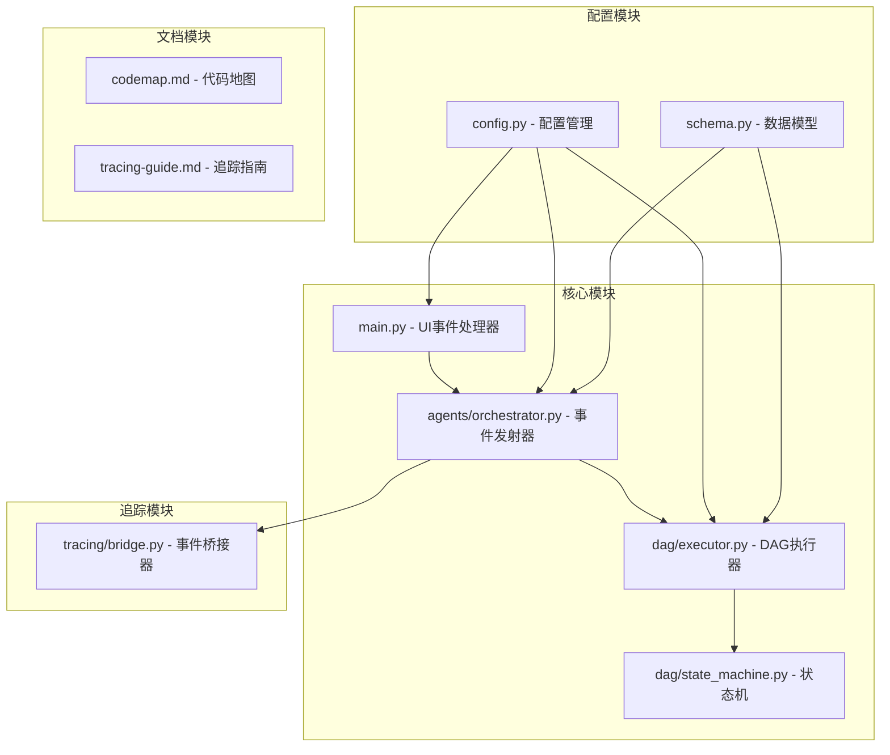
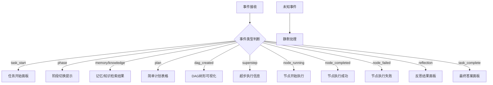
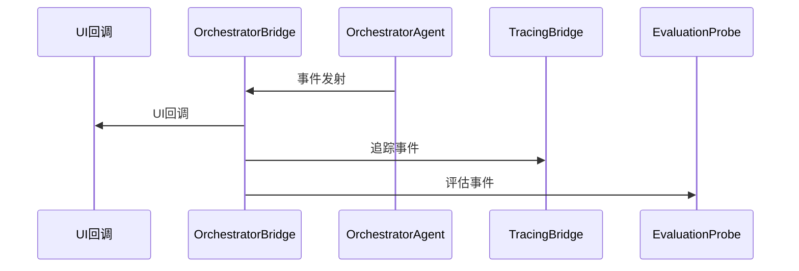
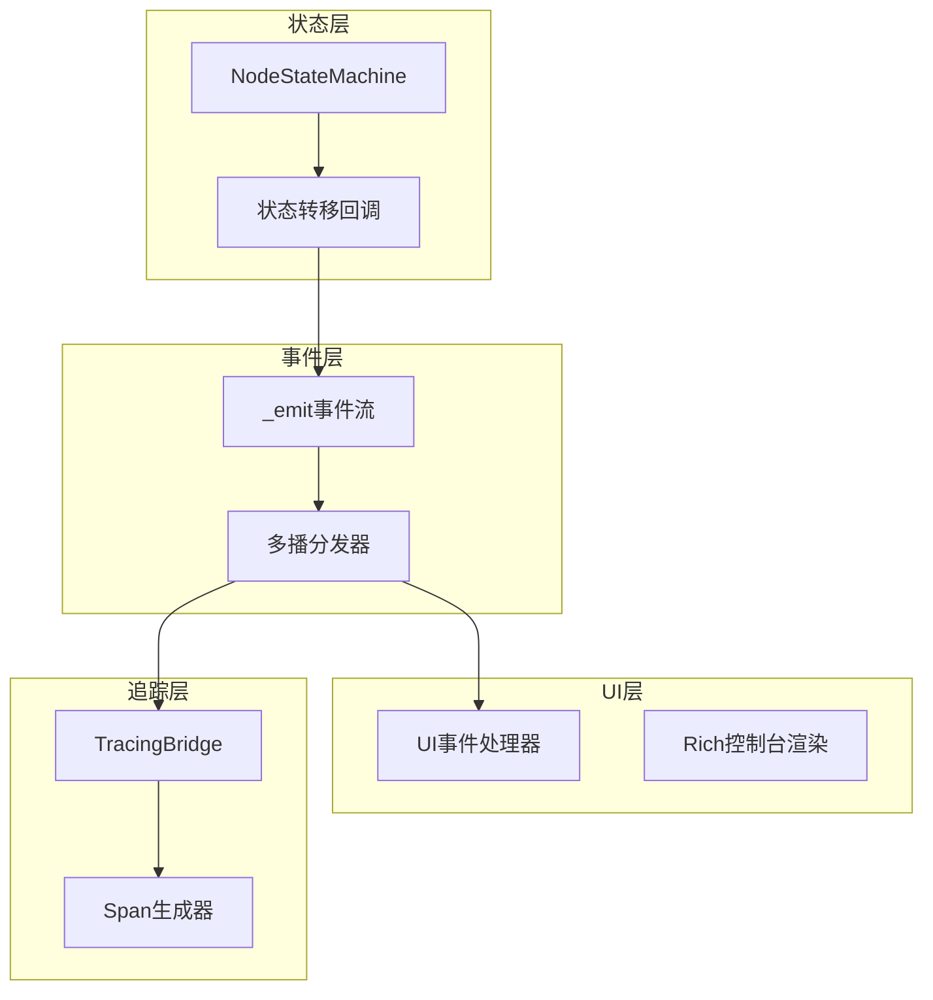
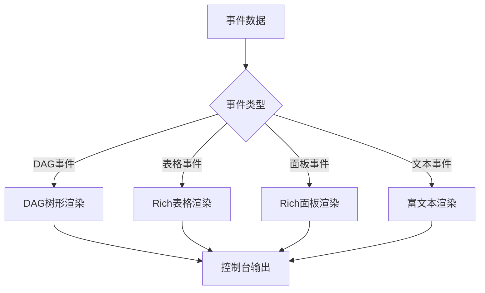
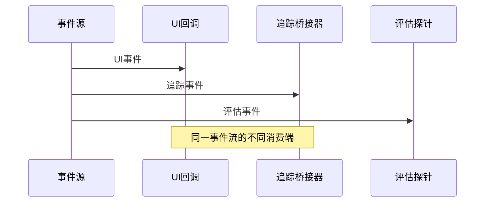
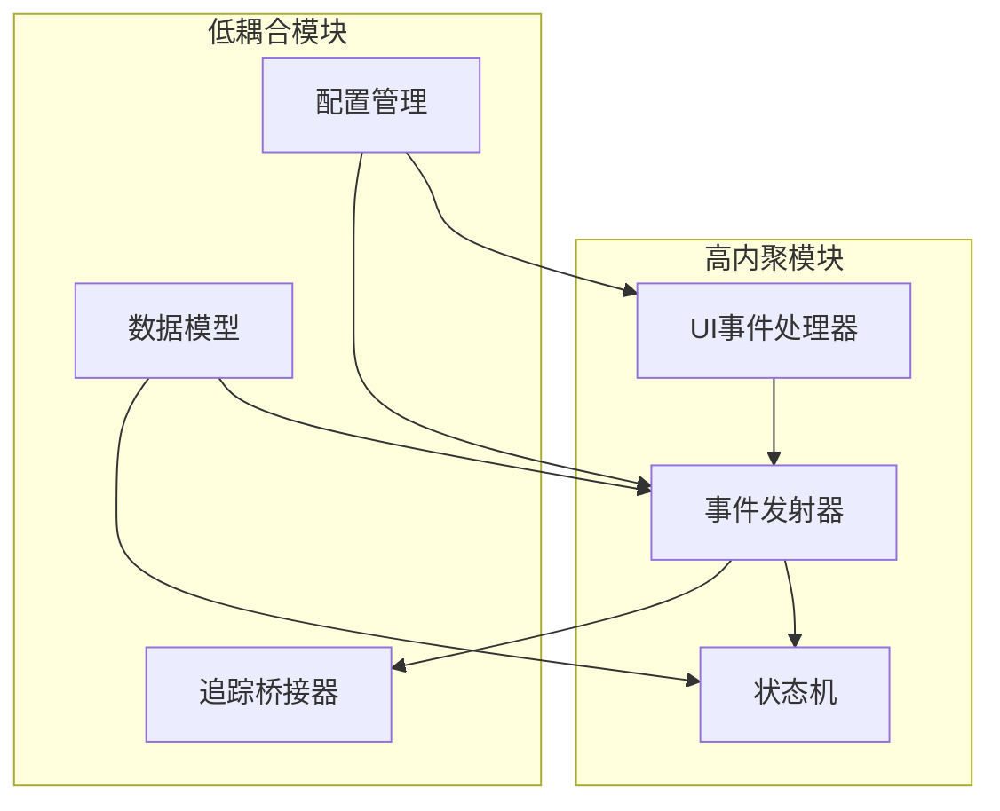

# UI事件映射

<cite>
**本文档引用的文件**
- [main.py](file://main.py)
- [schema.py](file://schema.py)
- [agents/orchestrator.py](file://agents/orchestrator.py)
- [dag/executor.py](file://dag/executor.py)
- [dag/state_machine.py](file://dag/state_machine.py)
- [config.py](file://config.py)
- [tracing/bridge.py](file://tracing/bridge.py)
- [sxw_aicoding/docs/codemap.md](file://sxw_aicoding/docs/codemap.md)
- [sxw_aicoding/docs/tracing-guide.md](file://sxw_aicoding/docs/tracing-guide.md)
- [tests/test_tracing.py](file://tests/test_tracing.py)
</cite>

## 目录
1. [简介](#简介)
2. [项目结构](#项目结构)
3. [核心组件](#核心组件)
4. [架构概览](#架构概览)
5. [详细组件分析](#详细组件分析)
6. [依赖关系分析](#依赖关系分析)
7. [性能考虑](#性能考虑)
8. [故障排除指南](#故障排除指南)
9. [结论](#结论)

## 简介

UI事件映射系统是manus_demo项目中实现事件驱动UI更新的核心机制。该系统通过统一的事件回调接口，将复杂的多智能体流水线执行过程转换为可视化的UI更新指令，实现了业务逻辑与用户界面的完全解耦。

系统采用事件驱动架构，所有组件都支持`on_event`回调，实现了真正的实时状态可视化和调试监控。通过多播模式，事件可以同时分发给UI回调、追踪桥接器和评估探针等多个订阅者，确保了系统的可扩展性和可观测性。

## 项目结构

manus_demo项目采用模块化设计，UI事件映射系统分布在多个核心模块中：

**图表来源**
- [main.py:1-516](file://main.py#L1-L516)
- [agents/orchestrator.py:1-600](file://agents/orchestrator.py#L1-L600)
- [dag/executor.py:1-648](file://dag/executor.py#L1-L648)
- [config.py:1-109](file://config.py#L1-L109)

**章节来源**
- [main.py:1-516](file://main.py#L1-L516)
- [agents/orchestrator.py:1-600](file://agents/orchestrator.py#L1-L600)
- [dag/executor.py:1-648](file://dag/executor.py#L1-L648)
- [config.py:1-109](file://config.py#L1-L109)

## 核心组件

### UI事件处理器 (on_event)

UI事件处理器是系统的核心，位于`main.py`中，负责将事件流转换为Rich格式的可视化输出。该处理器支持多种事件类型，包括任务生命周期事件、DAG执行事件、反思事件等。

**图表来源**
- [main.py:184-390](file://main.py#L184-L390)

### 事件发射器 (OrchestratorAgent)

OrchestratorAgent作为事件发射器，负责在整个多智能体流水线中产生各种事件。它使用多播模式，将事件同时发送给UI回调、追踪桥接器和评估探针。

**图表来源**
- [agents/orchestrator.py:569-599](file://agents/orchestrator.py#L569-L599)

### DAG执行器事件映射

DAG执行器通过状态机回调实现节点状态变化的事件映射，确保每个节点状态转移都能触发相应的UI更新。

**章节来源**
- [main.py:184-390](file://main.py#L184-L390)
- [agents/orchestrator.py:569-599](file://agents/orchestrator.py#L569-L599)
- [dag/executor.py:638-648](file://dag/executor.py#L638-L648)

## 架构概览

UI事件映射系统采用双通道架构，结合事件驱动和追踪机制：

**图表来源**
- [agents/orchestrator.py:105-114](file://agents/orchestrator.py#L105-L114)
- [dag/state_machine.py:71-114](file://dag/state_machine.py#L71-L114)
- [tracing/bridge.py:117-134](file://tracing/bridge.py#L117-L134)

系统的关键特性包括：

1. **零侵入集成**：通过多播模式实现事件的零改动分发
2. **异常安全**：UI回调异常不影响主执行流程
3. **实时更新**：事件驱动的实时状态可视化
4. **可观测性**：同时支持UI展示和追踪分析

**章节来源**
- [agents/orchestrator.py:105-114](file://agents/orchestrator.py#L105-L114)
- [dag/state_machine.py:71-114](file://dag/state_machine.py#L71-L114)
- [tracing/bridge.py:117-134](file://tracing/bridge.py#L117-L134)

## 详细组件分析

### 事件类型与映射关系

系统支持丰富的事件类型，每种事件都有对应的UI渲染策略：

#### 任务生命周期事件
- `task_start`: 创建任务开始面板
- `task_complexity`: 显示任务复杂度分类结果
- `phase`: 阶段切换提示，使用不同颜色标识
- `task_complete`: 显示最终答案面板

#### DAG执行事件
- `dag_created`: 生成DAG树形可视化
- `superstep`: 显示超步执行信息
- `node_running`: 节点开始执行提示
- `node_completed`: 节点执行成功，显示输出预览
- `node_failed`: 节点执行失败，显示错误信息
- `node_rollback`: 节点回滚完成

#### 反思与评估事件
- `reflection`: 反思结果面板，包含通过/失败状态和评分
- `plan_adaptation`: 自适应规划调整信息

**章节来源**
- [main.py:192-390](file://main.py#L192-L390)

### 渲染策略与更新频率控制

#### 渲染策略
系统采用Rich库进行终端渲染，每种事件类型都有专门的渲染模板：

**图表来源**
- [main.py:63-177](file://main.py#L63-L177)

#### 更新频率控制
系统通过以下机制控制更新频率：
- **事件聚合**：DAG执行中的多个节点状态变化会被聚合处理
- **节流机制**：高频事件（如节点状态变化）通过状态机回调进行去抖动
- **批量处理**：超步执行中的多个节点状态变化批量更新UI

**章节来源**
- [main.py:63-177](file://main.py#L63-L177)
- [dag/executor.py:163-167](file://dag/executor.py#L163-L167)

### 优先级与去抖动机制

#### 事件优先级
系统采用以下优先级排序：
1. **致命错误**：节点执行失败、超时等
2. **状态变化**：节点状态转移、条件边评估
3. **进度信息**：超步执行、阶段切换
4. **辅助信息**：记忆检索、知识检索结果

#### 去抖动机制
通过NodeStateMachine的回调机制实现去抖动：
- 状态转移回调确保每个状态变化只触发一次UI更新
- 条件边评估使用缓存机制避免重复计算
- 超步执行中的节点状态变化通过批量处理去抖动

**章节来源**
- [dag/state_machine.py:110-114](file://dag/state_machine.py#L110-L114)
- [dag/executor.py:420-448](file://dag/executor.py#L420-L448)

### 配置选项与自定义方法

#### 配置选项
系统提供丰富的配置选项控制UI行为：

| 配置项 | 默认值 | 说明 |
|--------|--------|------|
| `MAX_PARALLEL_NODES` | 3 | 每轮最大并行节点数 |
| `NODE_EXECUTION_TIMEOUT` | 300 | 单节点执行超时时间（秒） |
| `MAX_REACT_ITERATIONS` | 10 | 每个节点ReAct循环最大迭代次数 |
| `MAX_REPLAN_ATTEMPTS` | 3 | 反思失败后最大重规划次数 |

#### 自定义方法
支持通过以下方式自定义UI行为：
- **自定义事件处理器**：替换默认的`on_event`函数
- **事件过滤**：在事件发射前进行过滤和转换
- **样式定制**：修改Rich样式映射表

**章节来源**
- [config.py:44-67](file://config.py#L44-L67)
- [main.py:47-55](file://main.py#L47-L55)

### UI事件与追踪事件的关系

系统采用双通道模式，UI事件和追踪事件共享相同的事件源：

**图表来源**
- [agents/orchestrator.py:105-114](file://agents/orchestrator.py#L105-L114)
- [sxw_aicoding/docs/tracing-guide.md:596-606](file://sxw_aicoding/docs/tracing-guide.md#L596-L606)

**章节来源**
- [agents/orchestrator.py:105-114](file://agents/orchestrator.py#L105-L114)
- [sxw_aicoding/docs/tracing-guide.md:596-606](file://sxw_aicoding/docs/tracing-guide.md#L596-L606)

## 依赖关系分析

### 组件耦合度分析

**图表来源**
- [main.py:1-516](file://main.py#L1-L516)
- [agents/orchestrator.py:1-600](file://agents/orchestrator.py#L1-L600)
- [dag/state_machine.py:1-114](file://dag/state_machine.py#L1-L114)

### 外部依赖与集成点

系统主要依赖以下外部组件：
- **Rich库**：终端渲染和样式系统
- **OpenTelemetry**：追踪和可观测性（可选）
- **Asyncio**：异步事件处理

**章节来源**
- [main.py:28-43](file://main.py#L28-L43)
- [tracing/bridge.py:29-35](file://tracing/bridge.py#L29-L35)

## 性能考虑

### 性能优化策略

#### 事件处理优化
- **异步处理**：所有事件处理都是异步的，不阻塞主执行流程
- **批量处理**：高频事件通过批量处理减少UI更新开销
- **缓存机制**：状态机回调使用缓存避免重复计算

#### 内存管理策略
- **事件流控制**：通过配置项控制事件流的频率和数量
- **资源清理**：追踪桥接器在任务完成后自动清理资源
- **内存限制**：通过配置项限制内存中保留的检查点数量

#### 并发处理
- **并行执行**：DAG执行支持多节点并行，提高整体性能
- **超时控制**：单节点执行超时控制，防止长时间阻塞
- **异常隔离**：单节点异常不影响其他节点的执行

**章节来源**
- [config.py:58-67](file://config.py#L58-L67)
- [dag/executor.py:179-182](file://dag/executor.py#L179-L182)

## 故障排除指南

### 常见问题诊断

#### UI更新异常
- **症状**：事件发生但UI无更新
- **排查**：检查`on_event`回调是否正确绑定
- **解决方案**：确认事件发射器的回调函数配置

#### 事件丢失问题
- **症状**：某些事件没有被处理
- **排查**：检查事件分发表是否包含相应事件
- **解决方案**：添加缺失的事件处理器或修正事件名称

#### 性能问题
- **症状**：UI更新缓慢或卡顿
- **排查**：检查并行执行配置和超时设置
- **解决方案**：调整`MAX_PARALLEL_NODES`和`NODE_EXECUTION_TIMEOUT`

#### 追踪功能异常
- **症状**：追踪数据不完整或错误
- **排查**：检查`TRACING_ENABLED`配置和后端设置
- **解决方案**：验证追踪配置和导出器设置

**章节来源**
- [tests/test_tracing.py:264-281](file://tests/test_tracing.py#L264-L281)
- [tracing/bridge.py:117-134](file://tracing/bridge.py#L117-L134)

### 调试技巧

#### 事件流调试
- 使用`--verbose`参数启用详细日志
- 检查事件发射器的日志输出
- 验证事件处理器的输入数据格式

#### 性能分析
- 监控事件处理延迟
- 分析UI更新频率和负载
- 评估内存使用情况

#### 追踪数据分析
- 检查Span层级关系的正确性
- 验证事件到Span的映射准确性
- 分析追踪数据的完整性

**章节来源**
- [main.py:396-413](file://main.py#L396-L413)
- [tests/test_tracing.py:194-216](file://tests/test_tracing.py#L194-L216)

## 结论

UI事件映射系统通过事件驱动架构实现了业务逻辑与用户界面的完全解耦，提供了实时、可视化的状态更新能力。系统的设计充分考虑了性能、可扩展性和可观测性，支持多种事件类型和渲染策略。

通过多播模式，系统能够同时满足UI展示、追踪分析和评估监控等多种需求，为复杂的多智能体流水线提供了强大的可视化支持。配置灵活的特性使得系统能够适应不同的使用场景和性能要求。

未来可以在以下方面进一步改进：
- 增加更多的事件类型和渲染模板
- 优化大规模DAG执行时的UI性能
- 扩展自定义事件处理器的API
- 增强错误恢复和容错机制