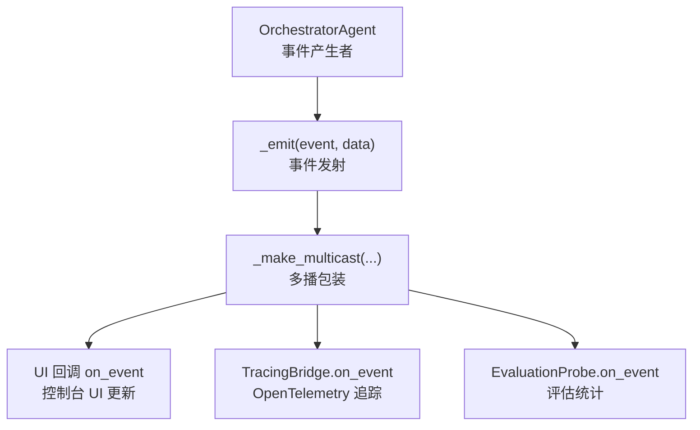
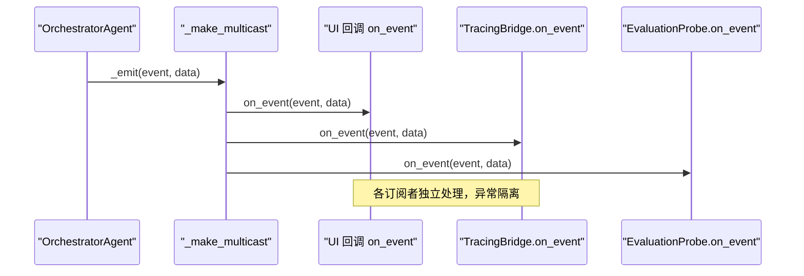
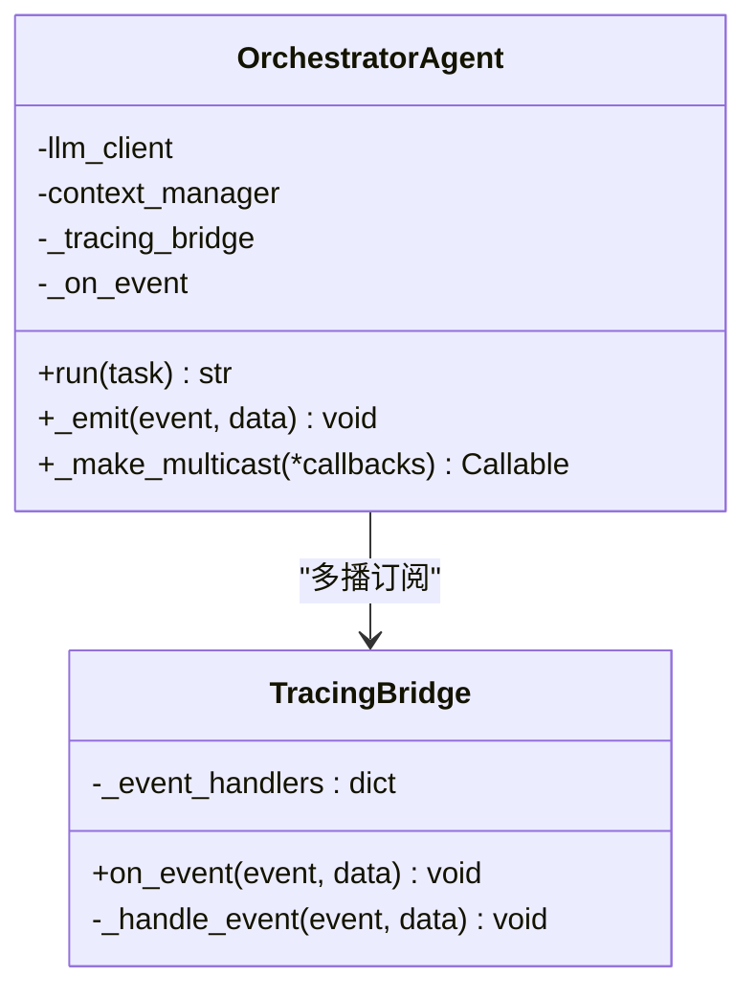
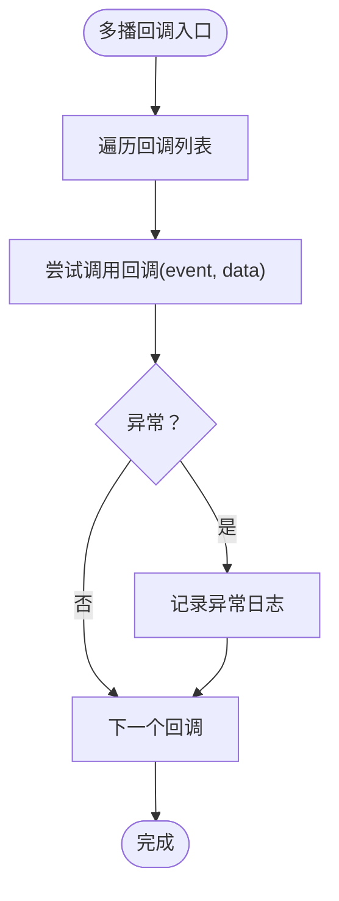
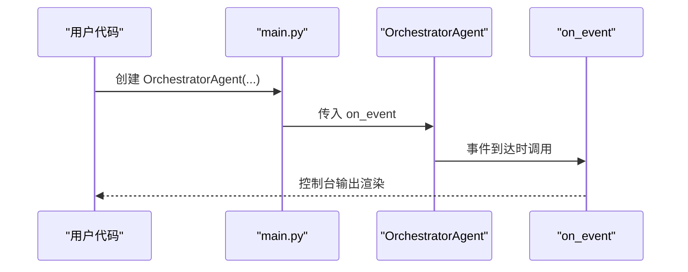
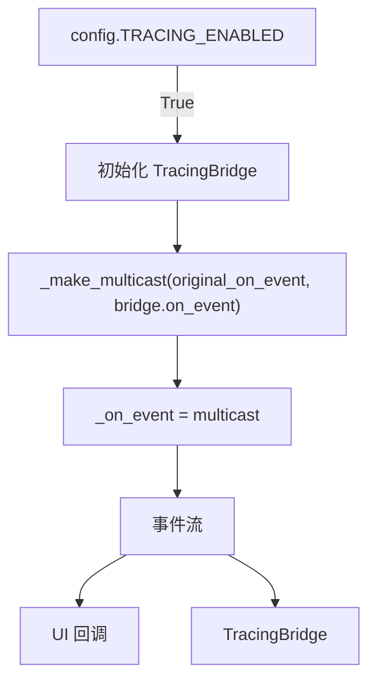
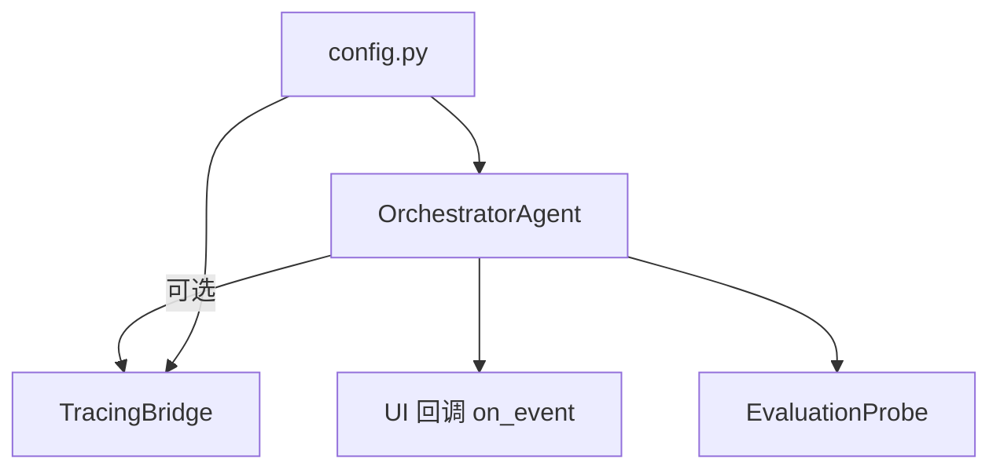

# 事件回调机制

<cite>
**本文引用的文件**
- [agents/orchestrator.py](file://agents/orchestrator.py)
- [tracing/bridge.py](file://tracing/bridge.py)
- [main.py](file://main.py)
- [schema.py](file://schema.py)
- [config.py](file://config.py)
- [tests/test_tracing.py](file://tests/test_tracing.py)
- [evaluation/runner.py](file://evaluation/runner.py)
</cite>

## 目录
1. [简介](#简介)
2. [项目结构](#项目结构)
3. [核心组件](#核心组件)
4. [架构概览](#架构概览)
5. [详细组件分析](#详细组件分析)
6. [依赖分析](#依赖分析)
7. [性能考虑](#性能考虑)
8. [故障排除指南](#故障排除指南)
9. [结论](#结论)
10. [附录](#附录)

## 简介
本文件深入解析 manus_demo 的事件回调系统，重点围绕 OrchestratorAgent 的 _on_event 回调函数设计与实现，详细说明多播模式（multicast）的使用、事件回调的注册与分发机制、异常处理策略以及与追踪系统的集成方式。文档还提供了回调函数的签名要求、性能考量、最佳实践和常见使用模式，帮助开发者在不破坏主流程的前提下，灵活扩展 UI 更新、追踪、评估等能力。

## 项目结构
事件回调系统主要分布在以下模块：
- OrchestratorAgent：事件产生者，负责在执行流程中发出各类事件
- TracingBridge：事件订阅者，将事件转换为 OpenTelemetry Span
- UI 回调 on_event：事件订阅者，负责控制台 UI 的实时更新
- EvaluationProbe：事件订阅者，用于评估和统计
- 配置模块 config.py：控制追踪功能的开关与参数

图表来源
- [agents/orchestrator.py:569-599](file://agents/orchestrator.py#L569-L599)
- [tracing/bridge.py:117-133](file://tracing/bridge.py#L117-L133)
- [main.py:184-390](file://main.py#L184-L390)
- [evaluation/runner.py:139-149](file://evaluation/runner.py#L139-L149)

章节来源
- [agents/orchestrator.py:94-149](file://agents/orchestrator.py#L94-L149)
- [config.py:102-109](file://config.py#L102-L109)

## 核心组件
- OrchestratorAgent._on_event：主事件回调，接收事件名和数据，负责将事件分发给所有订阅者
- OrchestratorAgent._make_multicast：静态方法，创建多播回调，确保各订阅者独立接收事件
- OrchestratorAgent._emit：内部事件发射器，封装 UI 回调调用，隔离异常
- TracingBridge.on_event：异常安全的事件处理器，将事件映射为 OpenTelemetry Span
- UI 回调 on_event：控制台 UI 的事件处理器，美化渲染执行过程
- EvaluationProbe.on_event：评估探针的事件处理器，用于统计与分析

章节来源
- [agents/orchestrator.py:569-599](file://agents/orchestrator.py#L569-L599)
- [tracing/bridge.py:117-133](file://tracing/bridge.py#L117-L133)
- [main.py:184-390](file://main.py#L184-L390)
- [evaluation/runner.py:139-149](file://evaluation/runner.py#L139-L149)

## 架构概览
事件回调系统采用“事件驱动”的解耦架构：
- OrchestratorAgent 在执行流程的关键节点发出事件
- 通过多播模式将事件同时分发给 UI、追踪、评估等多个订阅者
- 每个订阅者独立处理事件，互不影响
- 异常安全：任一订阅者异常不会影响其他订阅者或主流程

图表来源
- [agents/orchestrator.py:569-599](file://agents/orchestrator.py#L569-L599)
- [tracing/bridge.py:117-133](file://tracing/bridge.py#L117-L133)
- [evaluation/runner.py:139-149](file://evaluation/runner.py#L139-L149)

## 详细组件分析

### OrchestratorAgent 事件回调系统
- 事件注册：构造函数接受 on_event 参数，若启用追踪，则通过多播模式将原始回调与 TracingBridge.on_event 合并
- 事件分发：_emit 方法负责调用 _on_event，内部包裹 try-except，确保 UI 异常不影响主流程
- 多播实现：_make_multicast 创建一个回调，依次调用所有订阅者，每个订阅者的异常被捕获并记录，不传播到其他订阅者

图表来源
- [agents/orchestrator.py:94-149](file://agents/orchestrator.py#L94-L149)
- [tracing/bridge.py:38-115](file://tracing/bridge.py#L38-L115)

章节来源
- [agents/orchestrator.py:94-149](file://agents/orchestrator.py#L94-L149)
- [agents/orchestrator.py:569-599](file://agents/orchestrator.py#L569-L599)

### 多播模式（Multicast）设计与实现
- 目标：确保事件同时送达多个订阅者，且任一订阅者失败不影响其他订阅者
- 实现：遍历回调列表，逐一调用，每个回调包裹 try-except，异常被捕获并记录
- 测试验证：单元测试覆盖多播调用所有回调、异常隔离等行为

图表来源
- [agents/orchestrator.py:569-588](file://agents/orchestrator.py#L569-L588)
- [tests/test_tracing.py:654-694](file://tests/test_tracing.py#L654-L694)

章节来源
- [agents/orchestrator.py:569-588](file://agents/orchestrator.py#L569-L588)
- [tests/test_tracing.py:654-694](file://tests/test_tracing.py#L654-L694)

### 事件回调注册与使用
- 注册方式：通过 OrchestratorAgent 构造函数的 on_event 参数传入回调函数
- UI 回调示例：main.py 中的 on_event 函数，负责将事件渲染为 Rich 控制台输出
- 订阅者扩展：可通过相同模式注册其他订阅者（如评估探针、日志记录器）

图表来源
- [main.py:451-455](file://main.py#L451-L455)
- [main.py:184-390](file://main.py#L184-L390)

章节来源
- [main.py:451-455](file://main.py#L451-L455)
- [main.py:184-390](file://main.py#L184-L390)

### 事件类型与数据结构
事件类型涵盖任务生命周期、规划阶段、执行阶段、反思与结果等。典型事件包括：
- task_start：任务开始
- phase：阶段切换
- task_complexity：任务复杂度分类
- plan/dag_created/todo_list_initialized：规划产物
- step_start/step_complete/step_failed：简单路径步骤事件
- superstep/node_running/node_completed/node_failed：DAG 执行事件
- reflection：反思结果
- token_usage_summary：Token 消耗统计
- task_complete：任务完成
- memory_stored：长期记忆存储

这些事件的数据结构在 schema.py 中定义，如 Plan、TaskDAG、Reflection、TokenUsageSummary 等。

章节来源
- [tracing/bridge.py:83-115](file://tracing/bridge.py#L83-L115)
- [schema.py:59-66](file://schema.py#L59-L66)
- [schema.py:157-176](file://schema.py#L157-L176)
- [schema.py:327-335](file://schema.py#L327-L335)

### 与追踪系统的集成
- 启用条件：通过 config.TRACING_ENABLED 控制
- 集成方式：在构造 OrchestratorAgent 时，若启用追踪，则创建 TracingBridge，并通过 _make_multicast 将原始 on_event 与 TracingBridge.on_event 合并
- 事件映射：TracingBridge 维护事件到处理器的映射表，将事件转换为 OpenTelemetry Span，支持父子关系、属性与事件附加

图表来源
- [agents/orchestrator.py:107-114](file://agents/orchestrator.py#L107-L114)
- [config.py:102-109](file://config.py#L102-L109)
- [tracing/bridge.py:83-115](file://tracing/bridge.py#L83-L115)

章节来源
- [agents/orchestrator.py:107-114](file://agents/orchestrator.py#L107-L114)
- [config.py:102-109](file://config.py#L102-L109)
- [tracing/bridge.py:83-115](file://tracing/bridge.py#L83-L115)

### 异常处理策略
- UI 回调异常：_emit 包裹 try-except，记录异常但不中断主流程
- 多播异常：_make_multicast 对每个订阅者单独 try-except，确保一个订阅者失败不影响其他订阅者
- TracingBridge 异常：on_event 与内部 _handle_event 均包裹 try-except，异常被捕获并记录

章节来源
- [agents/orchestrator.py:590-599](file://agents/orchestrator.py#L590-L599)
- [agents/orchestrator.py:579-588](file://agents/orchestrator.py#L579-L588)
- [tracing/bridge.py:117-133](file://tracing/bridge.py#L117-L133)

## 依赖分析
- OrchestratorAgent 依赖 TracingBridge（可选）：仅在启用追踪时创建并参与多播
- UI 回调 on_event 与 OrchestratorAgent 解耦：通过事件回调接口通信
- EvaluationProbe 与 OrchestratorAgent 解耦：通过事件回调接口通信
- 配置模块 config.py 控制追踪功能开关与参数

图表来源
- [agents/orchestrator.py:107-114](file://agents/orchestrator.py#L107-L114)
- [config.py:102-109](file://config.py#L102-L109)

章节来源
- [agents/orchestrator.py:107-114](file://agents/orchestrator.py#L107-L114)
- [config.py:102-109](file://config.py#L102-L109)

## 性能考虑
- 多播开销：遍历回调列表并逐一调用，订阅者数量增加会线性增加调用开销
- 异常隔离：try-except 包裹带来少量额外开销，但显著提升稳定性
- UI 渲染：控制台渲染可能成为瓶颈，建议在高频事件中减少渲染复杂度
- 追踪开销：OTel Span 创建与属性设置有一定成本，可通过采样率与后端配置优化

## 故障排除指南
- UI 回调异常：检查 _emit 包裹的异常处理日志，确认 UI 回调是否抛出异常
- 多播异常：确认 _make_multicast 是否正常调用所有订阅者，异常订阅者会被隔离
- 追踪异常：检查 TracingBridge 的异常处理日志，确认事件映射与 Span 创建是否正常
- 事件缺失：确认 OrchestratorAgent 是否正确调用 _emit，以及 on_event 参数是否正确传入

章节来源
- [agents/orchestrator.py:590-599](file://agents/orchestrator.py#L590-L599)
- [agents/orchestrator.py:579-588](file://agents/orchestrator.py#L579-L588)
- [tracing/bridge.py:117-133](file://tracing/bridge.py#L117-L133)

## 结论
manus_demo 的事件回调系统通过多播模式实现了事件驱动的解耦架构，既保证了 UI 更新的实时性，又无缝集成了追踪与评估等能力。其异常安全设计确保了任一订阅者失败不会影响主流程与其他订阅者。通过合理的配置与扩展，开发者可以在不破坏主流程的前提下，灵活增强系统的可观测性与可维护性。

## 附录

### 回调函数签名要求
- 签名：on_event(event: str, data: Any) -> None
- 语义：接收事件名与数据，执行相应处理逻辑
- 异常：建议在回调内部处理异常，避免抛出到调用方

章节来源
- [main.py:184-189](file://main.py#L184-L189)
- [evaluation/runner.py:139-149](file://evaluation/runner.py#L139-L149)

### 常见使用模式
- UI 实时更新：在 main.py 中定义 on_event，将事件渲染为 Rich 输出
- 追踪集成：启用 config.TRACING_ENABLED，系统自动创建 TracingBridge 并与 UI 回调多播
- 评估统计：实现 EvaluationProbe.on_event，统计任务时长、复杂度、Token 消耗等指标

章节来源
- [main.py:184-390](file://main.py#L184-L390)
- [config.py:102-109](file://config.py#L102-L109)
- [evaluation/runner.py:139-149](file://evaluation/runner.py#L139-L149)

### 最佳实践
- 保持回调轻量：避免在回调中执行耗时操作
- 异常隔离：在回调内部处理异常，不抛出到调用方
- 事件幂等：确保重复接收相同事件不会产生副作用
- 配置开关：通过 config 控制追踪与评估功能，避免生产环境不必要的开销

章节来源
- [agents/orchestrator.py:569-599](file://agents/orchestrator.py#L569-L599)
- [config.py:102-109](file://config.py#L102-L109)