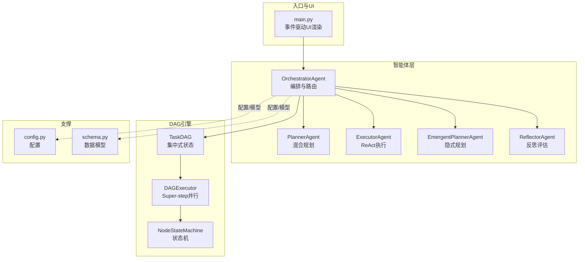
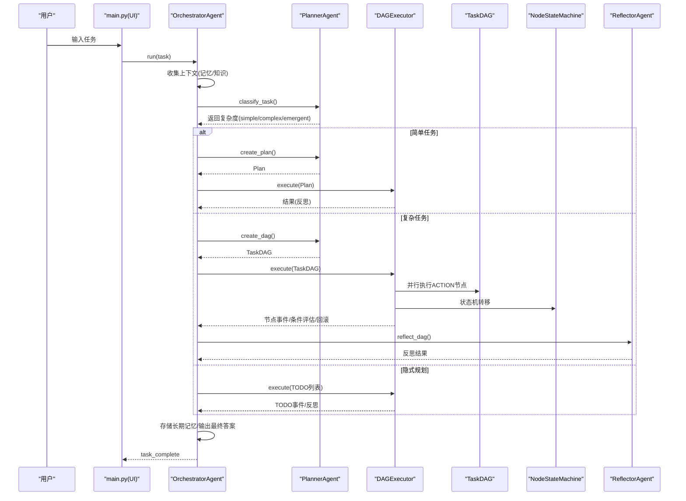
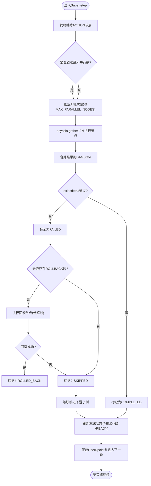
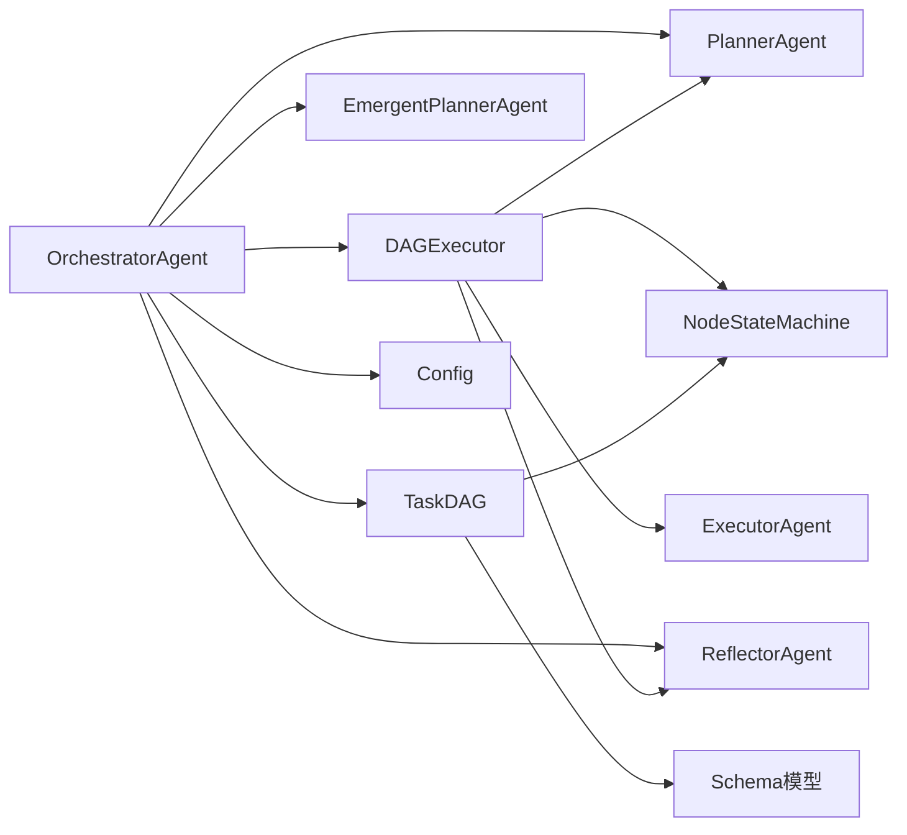

# 事件流和传播

<cite>
**本文引用的文件**
- [README.md](file://README.md)
- [main.py](file://main.py)
- [schema.py](file://schema.py)
- [config.py](file://config.py)
- [agents/orchestrator.py](file://agents/orchestrator.py)
- [agents/planner.py](file://agents/planner.py)
- [agents/emergent_planner.py](file://agents/emergent_planner.py)
- [agents/reflector.py](file://agents/reflector.py)
- [dag/graph.py](file://dag/graph.py)
- [dag/executor.py](file://dag/executor.py)
- [dag/state_machine.py](file://dag/state_machine.py)
</cite>

## 目录
1. [简介](#简介)
2. [项目结构](#项目结构)
3. [核心组件](#核心组件)
4. [架构总览](#架构总览)
5. [详细组件分析](#详细组件分析)
6. [依赖分析](#依赖分析)
7. [性能考量](#性能考量)
8. [故障排查指南](#故障排查指南)
9. [结论](#结论)
10. [附录](#附录)

## 简介
本文件围绕 manus_demo 的事件流与传播机制，系统阐述多智能体系统中事件的产生、传播与处理路径。文档覆盖从任务接收、规划路由、DAG 并行执行、逐节点验证、条件分支与回滚、自适应规划、反思评估，到最终答案汇总与长期记忆存储的完整生命周期。重点解释事件在不同智能体之间的传递与转换、异步处理与并发控制、事件去重与状态同步策略，并提供事件流图与时序图帮助理解复杂传播路径。

## 项目结构
manus_demo 采用“混合规划路由 + DAG 并行执行 + 自适应规划 + 反思评估”的多智能体流水线，核心模块包括：
- 入口与 UI：main.py 提供交互式 CLI 与事件驱动 UI 渲染
- 智能体层：Orchestrator（编排）、Planner（规划）、Executor（ReAct 执行）、EmergentPlanner（隐式规划）、Reflector（反思）
- DAG 引擎：TaskDAG（图结构与集中式状态）、DAGExecutor（Super-step 并行执行）、NodeStateMachine（状态机）
- 配置与数据模型：config.py、schema.py

图表来源
- [main.py](file://main.py)
- [agents/orchestrator.py](file://agents/orchestrator.py)
- [agents/planner.py](file://agents/planner.py)
- [agents/emergent_planner.py](file://agents/emergent_planner.py)
- [agents/reflector.py](file://agents/reflector.py)
- [dag/graph.py](file://dag/graph.py)
- [dag/executor.py](file://dag/executor.py)
- [dag/state_machine.py](file://dag/state_machine.py)
- [config.py](file://config.py)
- [schema.py](file://schema.py)

章节来源
- [README.md](file://README.md)
- [main.py](file://main.py)
- [config.py](file://config.py)
- [schema.py](file://schema.py)

## 核心组件
- OrchestratorAgent：任务生命周期编排，负责上下文收集、复杂度分类、路由到 v1/v2/v5 路径、执行与反思、结果存储与 UI 事件分发。
- PlannerAgent：混合规划路由（规则快筛 + LLM 兜底），生成 v1 扁平计划、v2 DAG、或 v5 隐式规划，并支持自适应规划与局部重规划。
- DAGExecutor：基于 Super-step 的并行执行引擎，负责就绪节点发现、并发执行、结果合并、逐节点 exit criteria 验证、条件边评估、失败处理与回滚、自适应规划触发与快照。
- TaskDAG：集中式状态 DAG，维护节点、边、上下文与结果，提供拓扑排序、就绪节点发现、条件边与回滚边处理、动态增删改节点/边、检查点。
- NodeStateMachine：严格的节点状态机，强制合法转移，防止状态不一致。
- ReflectorAgent：对 v1/v2 执行结果进行质量评估与反馈，作为质量门控触发重规划。
- EmergentPlannerAgent：Claude Code 风格的隐式规划，通过 TODO 列表管理与 while(tool_use) 主循环实现规划涌现。
- 配置与数据模型：config.py 提供运行时参数，schema.py 定义事件、状态、计划、节点、边、反思等核心数据结构。

章节来源
- [agents/orchestrator.py](file://agents/orchestrator.py)
- [agents/planner.py](file://agents/planner.py)
- [dag/executor.py](file://dag/executor.py)
- [dag/graph.py](file://dag/graph.py)
- [dag/state_machine.py](file://dag/state_machine.py)
- [agents/reflector.py](file://agents/reflector.py)
- [agents/emergent_planner.py](file://agents/emergent_planner.py)
- [config.py](file://config.py)
- [schema.py](file://schema.py)

## 架构总览
manus_demo 的事件驱动架构以 OrchestratorAgent 为核心，通过 on_event 回调将各阶段事件广播到 UI 与追踪桥（TracingBridge）。DAGExecutor 在 Super-step 循环中持续产生节点级事件（running/completed/failed/rollback/transition/condition_evaluated），并通过 NodeStateMachine 保证状态合法迁移。PlannerAgent 在适当时机介入，触发自适应规划并动态调整 DAG 结构。

图表来源
- [main.py](file://main.py)
- [agents/orchestrator.py](file://agents/orchestrator.py)
- [agents/planner.py](file://agents/planner.py)
- [dag/executor.py](file://dag/executor.py)
- [dag/graph.py](file://dag/graph.py)
- [dag/state_machine.py](file://dag/state_machine.py)
- [agents/reflector.py](file://agents/reflector.py)

## 详细组件分析

### 事件驱动 UI 与事件类型
- UI 事件类型：task_start、phase、memory、knowledge、task_complexity、plan、step_start/complete/failed/skipped、dag_created、superstep、node_running/completed/failed/rollback、condition_evaluated、plan_adaptation、reflection、memory_stored、token_usage_summary、task_complete 等。
- 事件来源：OrchestratorAgent、DAGExecutor、EmergentPlannerAgent、ReflectorAgent、PlannerAgent。
- 事件分发：_make_multicast 支持多播（UI + TracingBridge），保证 UI 异常不影响主流程。

章节来源
- [main.py](file://main.py)
- [agents/orchestrator.py](file://agents/orchestrator.py)

### 混合规划路由与事件传播
- 任务复杂度分类：规则快筛（长度、多步、条件、并行、动作动词、探索性/不确定性）+ LLM 兜底，返回 simple/complex/emergent。
- 路由到 v1/v2/v5：根据复杂度选择不同执行路径，每条路径产生不同的事件序列。
- 事件传播：OrchestratorAgent 在每个阶段发射 phase 与具体事件，UI 实时渲染。

章节来源
- [agents/planner.py](file://agents/planner.py)
- [agents/orchestrator.py](file://agents/orchestrator.py)

### DAG 并行执行与状态机
- Super-step 并行：DAGExecutor 每轮发现就绪 ACTION 节点，最多 MAX_PARALLEL_NODES 个并发执行（asyncio.gather），return_exceptions=True 防止单节点异常影响其他节点。
- 状态机强制合法转移：NodeStateMachine 校验转移表，非法转移抛出异常，确保 DAG 状态一致性。
- 结果合并：DAGState.node_results 以节点 ID 为键写入，天然避免并行写冲突。
- 逐节点 exit criteria 验证：ReflectorAgent 对节点结果进行 LLM 验证，不满足则标记 FAILED 并触发失败处理。
- 条件边评估：按源节点结果匹配关键词，决定目标节点是否激活或跳过。
- 回滚与子树跳过：失败节点执行 ROLLBACK 边（清理/撤销），并将下游子树全部标记为 SKIPPED。

图表来源
- [dag/executor.py](file://dag/executor.py)
- [dag/graph.py](file://dag/graph.py)
- [dag/state_machine.py](file://dag/state_machine.py)
- [agents/reflector.py](file://agents/reflector.py)

章节来源
- [dag/executor.py](file://dag/executor.py)
- [dag/graph.py](file://dag/graph.py)
- [dag/state_machine.py](file://dag/state_machine.py)
- [agents/reflector.py](file://agents/reflector.py)

### 自适应规划与动态 DAG 变更
- 触发条件：每隔 ADAPT_PLAN_INTERVAL 轮、至少完成 ADAPT_PLAN_MIN_COMPLETED 个 ACTION 节点、且存在待执行节点。
- 评估内容：基于已完成节点结果与待执行节点描述，判断是否需要 KEEP/MODIFY/REMOVE/ADD。
- 应用变更：支持动态添加/删除/修改节点与边，自动检测环并拒绝引入环的边；拓扑排序验证 DAG 有效性。
- 事件反馈：plan_adaptation 事件携带变更理由与列表，必要时重新渲染 DAG 视图。

章节来源
- [agents/planner.py](file://agents/planner.py)
- [dag/graph.py](file://dag/graph.py)
- [dag/executor.py](file://dag/executor.py)

### 隐式规划（TODO 列表）与事件传播
- TODO 列表管理：初始化 TODO（1-3 项），主循环 while(has_pending_todos)，选择就绪 TODO，执行 ReAct 循环，更新 TODO 状态与列表。
- 失败处理：最多 MAX_TODO_RETRIES 次重试，超过阈值标记为 BLOCKED；周期性或失败时触发 TODO 列表更新。
- 事件类型：phase、todo_start、todo_complete/todo_failed/todo_blocked、todo_list_initialized/update、todo_list_update。
- 与 v8 目标驱动规划的集成：可通过配置启用，提供更强的目标对齐与停滞检测。

章节来源
- [agents/emergent_planner.py](file://agents/emergent_planner.py)

### 反思与质量门控
- v1：reflect(task, plan, results) 评估整体结果，passed=false 触发重规划。
- v2：reflect_dag(task, dag, results) 对完整 DAG 执行进行综合评估，作为质量门控。
- 事件：reflection 事件携带通过/失败、分数、反馈与建议。

章节来源
- [agents/reflector.py](file://agents/reflector.py)
- [agents/orchestrator.py](file://agents/orchestrator.py)

### 数据模型与事件载体
- 事件数据载体：Plan、TaskDAG、TaskNode、TaskEdge、StepResult、Reflection、DAGState、TodoList/TodoItem 等。
- 事件命名约定：以语义化字符串标识事件类型，数据为对应模型实例或字典，便于 UI 渲染与追踪。

章节来源
- [schema.py](file://schema.py)

## 依赖分析
- 模块耦合
  - OrchestratorAgent 依赖 PlannerAgent、DAGExecutor、ReflectorAgent、EmergentPlannerAgent、TaskDAG、工具集合与 TracingBridge。
  - DAGExecutor 依赖 ExecutorAgent、ReflectorAgent、PlannerAgent（可选）、NodeStateMachine、TaskDAG。
  - TaskDAG 依赖 NodeStateMachine、DAGState、Schema 模型。
  - NodeStateMachine 依赖 Schema 的 NodeStatus。
- 外部依赖
  - asyncio：并发执行与超时控制。
  - config：运行时参数（并行度、超时、采样率、功能开关等）。
  - schema：事件与状态的数据契约。

图表来源
- [agents/orchestrator.py](file://agents/orchestrator.py)
- [dag/executor.py](file://dag/executor.py)
- [dag/graph.py](file://dag/graph.py)
- [dag/state_machine.py](file://dag/state_machine.py)
- [agents/planner.py](file://agents/planner.py)
- [agents/reflector.py](file://agents/reflector.py)
- [agents/emergent_planner.py](file://agents/emergent_planner.py)
- [config.py](file://config.py)
- [schema.py](file://schema.py)

章节来源
- [agents/orchestrator.py](file://agents/orchestrator.py)
- [dag/executor.py](file://dag/executor.py)
- [dag/graph.py](file://dag/graph.py)
- [dag/state_machine.py](file://dag/state_machine.py)
- [agents/planner.py](file://agents/planner.py)
- [agents/reflector.py](file://agents/reflector.py)
- [agents/emergent_planner.py](file://agents/emergent_planner.py)
- [config.py](file://config.py)
- [schema.py](file://schema.py)

## 性能考量
- 并发控制
  - MAX_PARALLEL_NODES 限制每轮并行节点数，避免资源争用。
  - NODE_EXECUTION_TIMEOUT 为单节点执行设置超时，防止卡死影响批次。
  - return_exceptions=True 防止单节点异常导致批次取消。
- 状态合并
  - DAGState.node_results 以节点 ID 为键写入，天然避免并行写冲突，降低锁竞争。
- 条件边评估缓存
  - _processed_conditions 缓存已评估的 (source,target) 对，避免每轮重复计算。
- 自适应规划频率
  - ADAPT_PLAN_INTERVAL 与 ADAPT_PLAN_MIN_COMPLETED 控制自适应检查频率，平衡规划精度与开销。
- 日志与追踪
  - 事件驱动的日志与 UI 渲染，避免阻塞主流程；可选 TracingBridge 多播。

章节来源
- [dag/executor.py](file://dag/executor.py)
- [dag/graph.py](file://dag/graph.py)
- [config.py](file://config.py)

## 故障排查指南
- 事件调试
  - 启用详细日志：-v/--verbose，查看 DEBUG 级别日志与事件流。
  - UI 事件：确认 on_event 回调是否正确接收与渲染事件。
  - 多播回调：_make_multicast 确保 UI 与追踪桥互不影响。
- DAG 执行问题
  - 无就绪节点：检查依赖是否全部完成、是否存在环、是否被条件边跳过。
  - 节点失败：查看 FAILED->ROLLED_BACK/SKIPPED 转移与回滚节点执行结果。
  - 条件边未生效：确认 condition 关键词匹配策略（CJK 子串 vs 拉丁词边界）。
- 自适应规划
  - 未触发：检查 ADAPT_PLAN_INTERVAL、ADAPT_PLAN_MIN_COMPLETED 与 pending 节点数量。
  - 变更无效：确认 DAG 动态变更是否引入环，拓扑排序是否通过。
- 隐式规划
  - TODO 列表停滞：检查停滞检测阈值与迭代上限，确认 BLOCKED TODO 的原因。
  - 工具失败：结合 ToolRouter 的失败计数与阈值，观察替代工具建议是否生效。

章节来源
- [main.py](file://main.py)
- [agents/orchestrator.py](file://agents/orchestrator.py)
- [dag/executor.py](file://dag/executor.py)
- [dag/graph.py](file://dag/graph.py)
- [agents/emergent_planner.py](file://agents/emergent_planner.py)

## 结论
manus_demo 的事件流以 OrchestratorAgent 为中心，通过混合规划路由将任务导向 v1/v2/v5 路径；DAGExecutor 以 Super-step 模型实现并行执行与状态机强制合法转移；PlannerAgent 在执行中动态调整计划；ReflectorAgent 提供质量门控；EmergentPlannerAgent 实现隐式规划与 TODO 列表管理。事件驱动的 UI 与可选追踪桥确保可观测性与调试能力。通过事件去重（状态机）、状态同步（集中式 DAGState）、并发控制（超时与并行度限制）与条件边评估缓存，系统在复杂场景下保持稳定性与可扩展性。

## 附录
- 事件类型速览（节选）
  - 任务与阶段：task_start、phase、task_complete
  - 上下文：memory、knowledge、token_usage_summary
  - 规划与路由：task_complexity、plan、dag_created
  - 执行与节点：superstep、node_running/completed/failed/rollback、node_transition、condition_evaluated
  - 自适应：plan_adaptation
  - 反思：reflection
  - 隐式规划：todo_start/complete/failed/blocked、todo_list_initialized/update
- 关键配置项（节选）
  - MAX_PARALLEL_NODES、NODE_EXECUTION_TIMEOUT、ADAPTIVE_PLANNING_ENABLED、ADAPT_PLAN_INTERVAL、MAX_TODO_ITEMS、MAX_TODO_RETRIES、TRACING_ENABLED 等

章节来源
- [main.py](file://main.py)
- [config.py](file://config.py)
- [schema.py](file://schema.py)