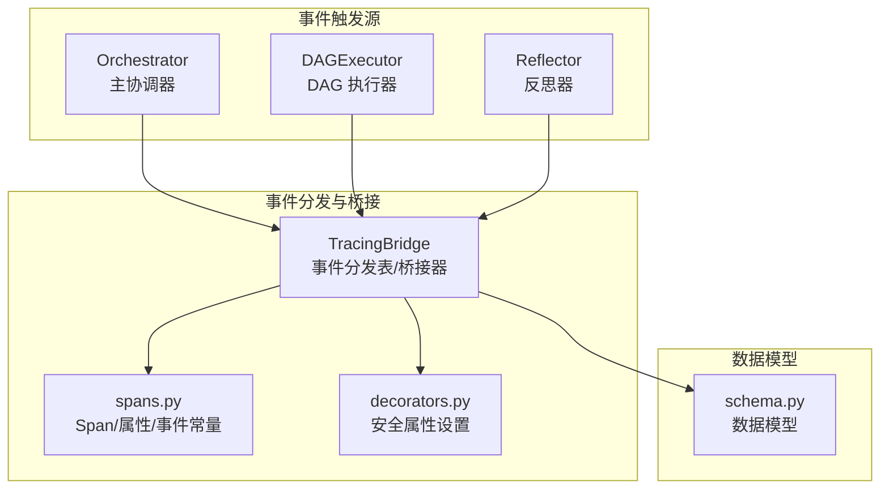
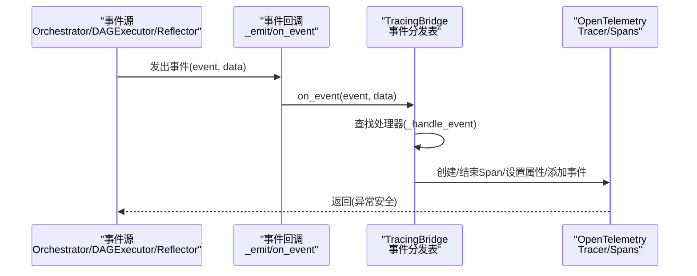
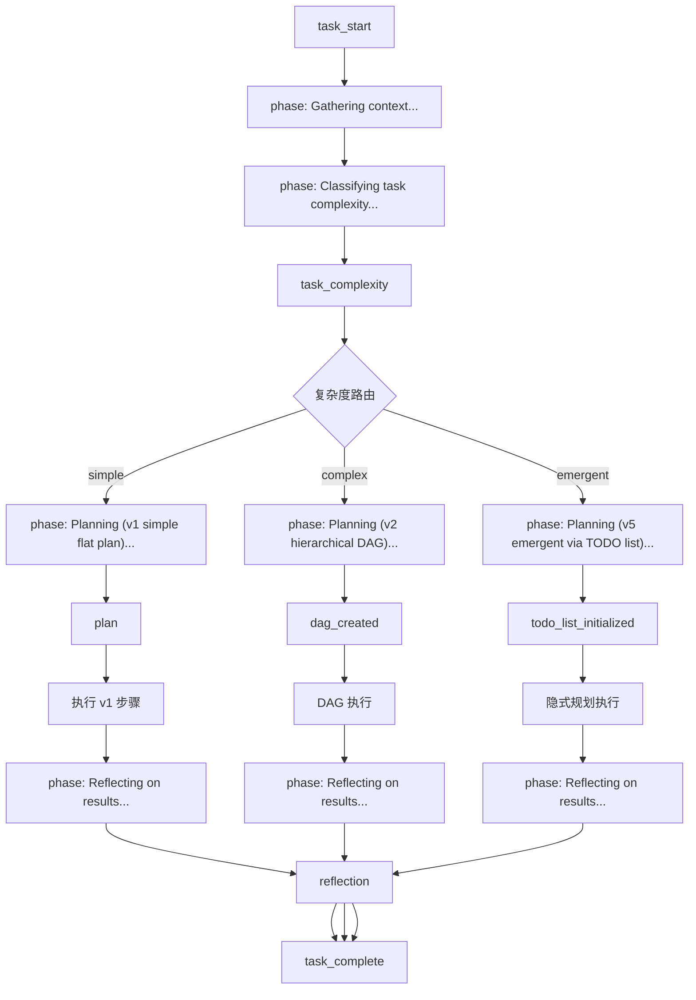
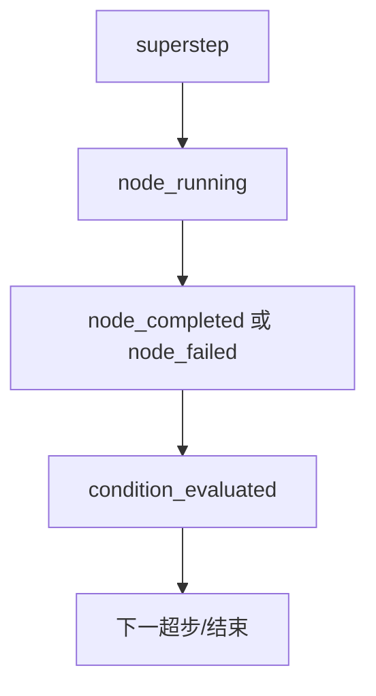
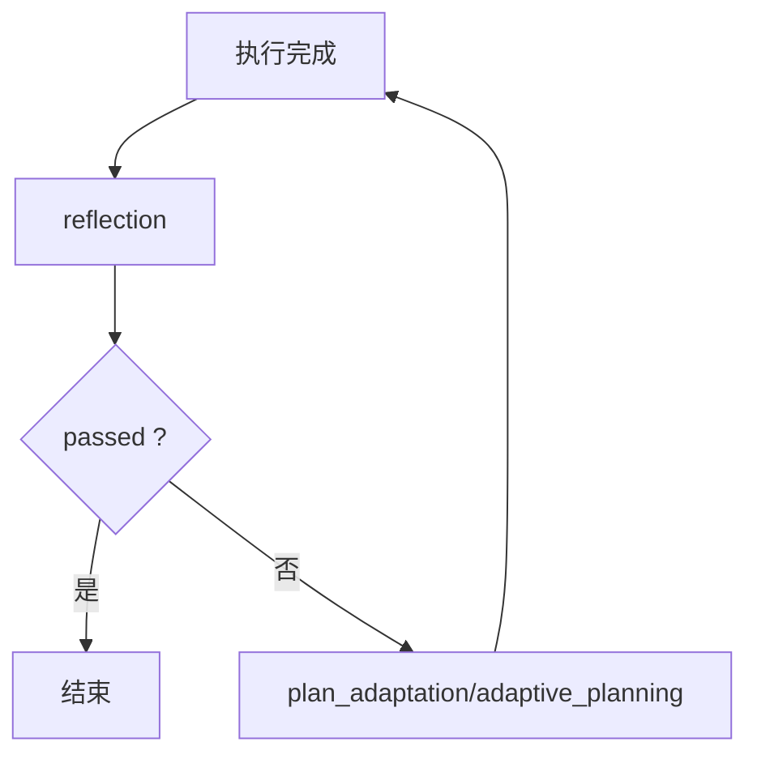
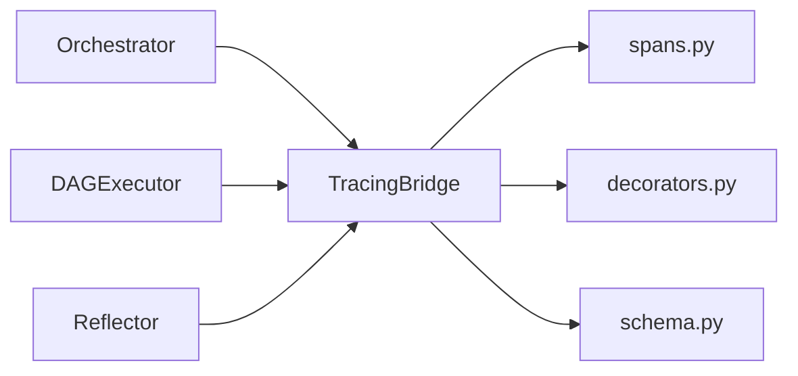

# 事件类型定义

<cite>
**本文引用的文件**
- [schema.py](file://schema.py)
- [tracing/bridge.py](file://tracing/bridge.py)
- [tracing/spans.py](file://tracing/spans.py)
- [tracing/decorators.py](file://tracing/decorators.py)
- [agents/orchestrator.py](file://agents/orchestrator.py)
- [backups/dag/executor.py](file://backups/dag/executor.py)
- [agents/reflector.py](file://agents/reflector.py)
- [evaluation/runner.py](file://evaluation/runner.py)
- [config.py](file://config.py)
</cite>

## 目录
1. [简介](#简介)
2. [项目结构](#项目结构)
3. [核心组件](#核心组件)
4. [架构总览](#架构总览)
5. [详细组件分析](#详细组件分析)
6. [依赖分析](#依赖分析)
7. [性能考虑](#性能考虑)
8. [故障排查指南](#故障排查指南)
9. [结论](#结论)
10. [附录](#附录)

## 简介
本文件系统化梳理 manus_demo 的事件类型体系，覆盖任务生命周期、规划与执行、反思与自适应、目标驱动规划、记忆与知识、Token 消耗等关键事件。文档面向开发者与产品人员，既提供事件的触发时机、数据结构与用途，也给出与系统状态变化的对应关系、生命周期与处理流程。

## 项目结构
事件系统围绕“事件名 → 处理器”的映射展开，主要分布在以下模块：
- 事件分发表与桥接：tracing/bridge.py
- 事件语义常量：tracing/spans.py
- 事件数据模型：schema.py
- 事件触发点：agents/orchestrator.py、backups/dag/executor.py、agents/reflector.py
- 事件统计与评估：evaluation/runner.py
- 配置开关：config.py

图表来源
- [tracing/bridge.py:83-115](file://tracing/bridge.py#L83-L115)
- [tracing/spans.py:18-80](file://tracing/spans.py#L18-L80)
- [tracing/decorators.py:51-68](file://tracing/decorators.py#L51-L68)
- [agents/orchestrator.py:173-222](file://agents/orchestrator.py#L173-L222)
- [backups/dag/executor.py:144-202](file://backups/dag/executor.py#L144-L202)
- [agents/reflector.py:35-56](file://agents/reflector.py#L35-L56)

章节来源
- [tracing/bridge.py:83-115](file://tracing/bridge.py#L83-L115)
- [tracing/spans.py:18-80](file://tracing/spans.py#L18-L80)
- [agents/orchestrator.py:173-222](file://agents/orchestrator.py#L173-L222)
- [backups/dag/executor.py:144-202](file://backups/dag/executor.py#L144-L202)
- [agents/reflector.py:35-56](file://agents/reflector.py#L35-L56)

## 核心组件
- 事件分发表：将事件名映射到具体处理器，确保异常安全与可扩展性。
- 事件处理器：负责将事件数据转化为 OTel Span、属性与事件，维护父子关系与阶段管理。
- 事件触发器：在 Orchestrator、DAGExecutor、Reflector 等关键节点发出事件。
- 事件数据模型：通过 schema.py 定义事件承载对象的结构与约束（如 Reflection、TokenUsageSummary 等）。
- 事件常量：通过 spans.py 统一命名与属性键，保证可观测性一致性。

章节来源
- [tracing/bridge.py:117-143](file://tracing/bridge.py#L117-L143)
- [tracing/spans.py:18-80](file://tracing/spans.py#L18-L80)
- [schema.py:368-377](file://schema.py#L368-L377)
- [schema.py:327-335](file://schema.py#L327-L335)

## 架构总览
事件系统采用“事件回调 → 桥接器 → OTel Span”的架构。事件触发器在执行流程的关键节点发出事件；TracingBridge 将事件路由到对应处理器，创建/结束 Span，设置属性与事件，形成完整的可观测性树。

图表来源
- [tracing/bridge.py:117-143](file://tracing/bridge.py#L117-L143)
- [tracing/bridge.py:149-196](file://tracing/bridge.py#L149-L196)
- [tracing/bridge.py:202-294](file://tracing/bridge.py#L202-L294)

章节来源
- [tracing/bridge.py:117-143](file://tracing/bridge.py#L117-L143)
- [tracing/bridge.py:149-196](file://tracing/bridge.py#L149-L196)
- [tracing/bridge.py:202-294](file://tracing/bridge.py#L202-L294)

## 详细组件分析

### 事件类型总览与生命周期
- 任务生命周期
  - task_start：任务开始，创建根 Span，记录输入。
  - task_complexity：任务复杂度分类结果，设置根 Span 属性。
  - task_complete：任务结束，记录总耗时、成功标志与输出，结束根 Span。
- 规划与执行阶段
  - phase：阶段切换，创建/结束阶段 Span，映射到标准 SpanName。
  - plan：v1 扁平计划创建，记录步骤数量。
  - dag_created：v2 DAG 创建，记录节点/边数量。
  - todo_list_initialized：v5 隐式规划初始化，记录 TODO 列表规模。
- DAG 执行
  - superstep：超步开始，记录步号与并行节点数。
  - node_running/node_completed/node_failed：节点执行生命周期，记录节点属性与错误信息。
  - condition_evaluated：条件边评估结果。
- 简单路径执行
  - step_start/step_complete/step_failed：v1 步骤生命周期。
- 反思与自适应
  - reflection：反思结果，记录通过/分数/反馈。
  - plan_adaptation/adaptive_planning：自适应规划触发与动作计数。
- 目标驱动规划（v8）
  - goal_anchor：锚定目标文档，记录成功标准与进度。
  - goal_reflection：目标状态对比，记录建议动作与差距分析。
  - goal_reanchor：目标重锚定，记录漂移检测与纠正。
  - goal_drift_alert：目标漂移告警，记录纠正措施与标准变更。
  - stagnation_detected：停滞检测，记录轮次与完成情况。
- 记忆与知识
  - memory：上下文收集阶段的记忆内容。
  - knowledge：上下文收集阶段的知识检索结果。
  - memory_stored：长期记忆存储事件。
- Token 消耗
  - token_usage_summary：跨引擎与全局的 Token 消耗汇总。

章节来源
- [tracing/bridge.py:83-115](file://tracing/bridge.py#L83-L115)
- [tracing/bridge.py:149-196](file://tracing/bridge.py#L149-L196)
- [tracing/bridge.py:202-294](file://tracing/bridge.py#L202-L294)
- [tracing/bridge.py:300-323](file://tracing/bridge.py#L300-L323)
- [tracing/bridge.py:425-467](file://tracing/bridge.py#L425-L467)
- [tracing/bridge.py:468-535](file://tracing/bridge.py#L468-L535)
- [tracing/bridge.py:541-589](file://tracing/bridge.py#L541-L589)
- [tracing/bridge.py:595-628](file://tracing/bridge.py#L595-L628)
- [tracing/bridge.py:634-641](file://tracing/bridge.py#L634-L641)
- [tracing/bridge.py:678-751](file://tracing/bridge.py#L678-L751)
- [tracing/bridge.py:665-671](file://tracing/bridge.py#L665-L671)
- [tracing/bridge.py:647-659](file://tracing/bridge.py#L647-L659)
- [agents/orchestrator.py:173-222](file://agents/orchestrator.py#L173-L222)
- [backups/dag/executor.py:144-202](file://backups/dag/executor.py#L144-L202)
- [agents/reflector.py:35-56](file://agents/reflector.py#L35-L56)

### 事件数据模型与验证规则
- Reflection（反思结果）
  - 字段：passed（布尔）、score（0-1）、feedback（文本）、suggestions（字符串列表）。
  - 验证：passed 与 score 必填；suggestions 可空。
  - 触发：reflection 事件。
- TokenUsageSummary（Token 消耗汇总）
  - 字段：call_records（调用明细列表）、by_engine（按引擎汇总）、total（全局总量）。
  - 触发：token_usage_summary 事件。
- StepResult（步骤执行结果）
  - 字段：step_id（步骤ID）、success（布尔）、output（文本）、tool_calls_log（工具调用记录列表）。
  - 触发：step_complete/step_failed（v1）。
- MemoryEntry（长期记忆条目）
  - 字段：task（原始任务）、summary（结果摘要）、learnings（学习点列表）、timestamp（时间戳）。
  - 触发：memory_stored 事件。
- TodoItem/TodoList（隐式规划）
  - TodoItem：id、description、status、dependencies、result、retry_count、created_at、updated_at。
  - TodoList：task、todos、next_id。
  - 触发：todo_start/todo_complete/todo_failed/todo_blocked（v5）。
- TaskNode/TaskEdge/DAGState（DAG 规划）
  - TaskNode：id、node_type、description、exit_criteria、risk、status、result、parent_id、rollback_action。
  - TaskEdge：source、target、edge_type、condition。
  - DAGState：task、context、node_results。
  - 触发：node_running/node_completed/node_failed（v2）。
- GoalDocument/GoalReflection/GoalReanchorResult（目标驱动规划）
  - GoalDocument：original_task、success_criteria、target_state_description、key_deliverables、constraints、progress_pct、completed_milestones_summary、current_focus、updated_at。
  - GoalReflection：current_state_summary、gap_analysis、next_milestone、progress_pct、suggested_action、reasoning。
  - GoalReanchorResult：updated_goal_doc、goal_drift_detected、correction_applied。
  - 触发：goal_anchor/goal_reflection/goal_reanchor/goal_drift_alert（v8）。

章节来源
- [schema.py:368-377](file://schema.py#L368-L377)
- [schema.py:327-335](file://schema.py#L327-L335)
- [schema.py:352-361](file://schema.py#L352-L361)
- [schema.py:662-671](file://schema.py#L662-L671)
- [schema.py:395-420](file://schema.py#L395-L420)
- [schema.py:422-568](file://schema.py#L422-L568)
- [schema.py:157-176](file://schema.py#L157-L176)
- [schema.py:178-187](file://schema.py#L178-L187)
- [schema.py:192-253](file://schema.py#L192-L253)
- [schema.py:596-655](file://schema.py#L596-L655)

### 事件与系统状态变化的对应关系
- 任务生命周期
  - task_start → 根 Span 创建，任务输入注入。
  - task_complexity → 设置根 Span 的任务复杂度与执行模式。
  - task_complete → 结束根 Span，记录总耗时与最终答案。
- 阶段管理
  - phase → 创建/结束阶段 Span，映射到 gather_context、classify_task、create_plan、create_dag、create_todo_list、execution_*、reflect、replan、adaptive_planning 等。
- DAG 执行
  - superstep → 创建超步 Span，记录并行节点数。
  - node_running/node_completed/node_failed → 节点级 Span 生命周期，失败时记录错误原因。
  - condition_evaluated → 记录条件边评估结果。
- 简单路径
  - step_start/step_complete/step_failed → 步骤级 Span 生命周期。
- 反思与自适应
  - reflection → 在阶段 Span 上设置通过/分数/反馈，并添加反射完成事件。
  - plan_adaptation/adaptive_planning → 记录自适应触发与动作数量。
- 目标驱动规划（v8）
  - goal_anchor → 设置目标成功标准与进度。
  - goal_reflection → 添加目标反思事件，携带进度与差距分析。
  - goal_reanchor → 添加目标重锚定事件，记录漂移与纠正。
  - goal_drift_alert → 添加目标漂移告警事件，记录纠正措施与标准变更。
  - stagnation_detected → 在根 Span 上记录停滞检测事件。
- 记忆与知识
  - memory/knowledge → 在上下文收集阶段发出，用于 UI 展示与调试。
  - memory_stored → 记录长期记忆存储事件。
- Token 消耗
  - token_usage_summary → 在任务结束时汇总并记录跨引擎与全局 Token 使用。

章节来源
- [tracing/bridge.py:149-196](file://tracing/bridge.py#L149-L196)
- [tracing/bridge.py:202-294](file://tracing/bridge.py#L202-L294)
- [tracing/bridge.py:425-467](file://tracing/bridge.py#L425-L467)
- [tracing/bridge.py:468-535](file://tracing/bridge.py#L468-L535)
- [tracing/bridge.py:541-589](file://tracing/bridge.py#L541-L589)
- [tracing/bridge.py:595-628](file://tracing/bridge.py#L595-L628)
- [tracing/bridge.py:634-641](file://tracing/bridge.py#L634-L641)
- [tracing/bridge.py:678-751](file://tracing/bridge.py#L678-L751)
- [tracing/bridge.py:665-671](file://tracing/bridge.py#L665-L671)
- [tracing/bridge.py:647-659](file://tracing/bridge.py#L647-L659)

### 事件生命周期与处理流程
- 任务生命周期流程

图表来源
- [agents/orchestrator.py:173-222](file://agents/orchestrator.py#L173-L222)
- [agents/orchestrator.py:194-212](file://agents/orchestrator.py#L194-L212)
- [backups/dag/executor.py:144-202](file://backups/dag/executor.py#L144-L202)

- DAG 执行流程

图表来源
- [backups/dag/executor.py:144-202](file://backups/dag/executor.py#L144-L202)
- [tracing/bridge.py:425-467](file://tracing/bridge.py#L425-L467)
- [tracing/bridge.py:468-535](file://tracing/bridge.py#L468-L535)
- [tracing/bridge.py:300-323](file://tracing/bridge.py#L300-L323)

- 反思与自适应流程

图表来源
- [agents/orchestrator.py:325-329](file://agents/orchestrator.py#L325-L329)
- [tracing/bridge.py:634-641](file://tracing/bridge.py#L634-L641)
- [agents/reflector.py:171-195](file://agents/reflector.py#L171-L195)

## 依赖分析
- 事件分发表依赖事件处理器方法，处理器依赖 spans 常量与安全属性设置。
- 事件触发器分布在 Orchestrator、DAGExecutor、Reflector 等模块，形成事件驱动的 UI 更新与可观测性。
- 事件数据模型通过 schema.py 统一约束，确保事件承载对象的结构一致。

图表来源
- [agents/orchestrator.py:173-222](file://agents/orchestrator.py#L173-L222)
- [backups/dag/executor.py:144-202](file://backups/dag/executor.py#L144-L202)
- [agents/reflector.py:35-56](file://agents/reflector.py#L35-L56)
- [tracing/bridge.py:83-115](file://tracing/bridge.py#L83-L115)
- [tracing/spans.py:18-80](file://tracing/spans.py#L18-L80)
- [tracing/decorators.py:51-68](file://tracing/decorators.py#L51-L68)
- [schema.py:368-377](file://schema.py#L368-L377)

章节来源
- [tracing/bridge.py:83-115](file://tracing/bridge.py#L83-L115)
- [tracing/spans.py:18-80](file://tracing/spans.py#L18-L80)
- [tracing/decorators.py:51-68](file://tracing/decorators.py#L51-L68)
- [agents/orchestrator.py:173-222](file://agents/orchestrator.py#L173-L222)
- [backups/dag/executor.py:144-202](file://backups/dag/executor.py#L144-L202)
- [agents/reflector.py:35-56](file://agents/reflector.py#L35-L56)
- [schema.py:368-377](file://schema.py#L368-L377)

## 性能考虑
- 事件处理异常安全：TracingBridge 的事件处理方法包裹在异常捕获中，避免 tracing 错误影响主执行流程。
- 属性截断与敏感数据保护：通过安全属性设置函数对属性值进行截断与敏感键过滤，避免超长或敏感信息污染可观测性。
- 并发安全：桥接器通过上下文令牌管理 Span 栈，支持 asyncio 并发场景。
- 事件聚合：TokenUsageSummary 聚合跨引擎与全局使用量，便于成本控制与监控。

章节来源
- [tracing/bridge.py:127-134](file://tracing/bridge.py#L127-L134)
- [tracing/decorators.py:51-68](file://tracing/decorators.py#L51-L68)
- [tracing/bridge.py:758-765](file://tracing/bridge.py#L758-L765)
- [schema.py:327-335](file://schema.py#L327-L335)

## 故障排查指南
- 事件未出现
  - 检查事件分发表是否包含对应事件名。
  - 确认事件触发器是否在正确阶段发出事件。
- 观测性异常
  - 检查 TracingBridge 的异常捕获日志。
  - 确认 spans 常量与属性键是否正确设置。
- 数据模型不一致
  - 核对 schema.py 中的数据模型字段与默认值。
  - 确保事件承载对象符合模型约束。
- Token 消耗异常
  - 检查 token_usage_summary 的聚合逻辑与配置开关。

章节来源
- [tracing/bridge.py:127-134](file://tracing/bridge.py#L127-L134)
- [tracing/spans.py:86-185](file://tracing/spans.py#L86-L185)
- [schema.py:327-335](file://schema.py#L327-L335)
- [config.py:87-89](file://config.py#L87-L89)

## 结论
manus_demo 的事件类型系统以“事件名 → 处理器”为核心，结合 spans 常量与安全属性设置，实现了从任务生命周期到 DAG 执行、反思与自适应、目标驱动规划、记忆与知识、Token 消耗的全链路可观测性。通过统一的数据模型与严格的异常安全机制，系统在复杂执行路径下仍能稳定输出结构化事件，支撑 UI 实时更新与性能分析。

## 附录
- 事件与 Span/属性/事件常量映射参考：见 tracing/spans.py。
- 事件触发点参考：见 agents/orchestrator.py、backups/dag/executor.py、agents/reflector.py。
- 事件统计与评估参考：见 evaluation/runner.py。