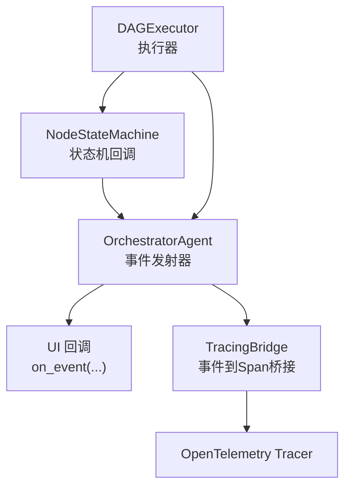
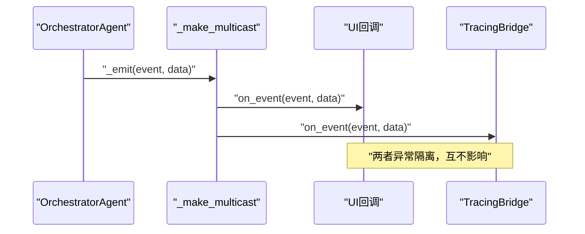
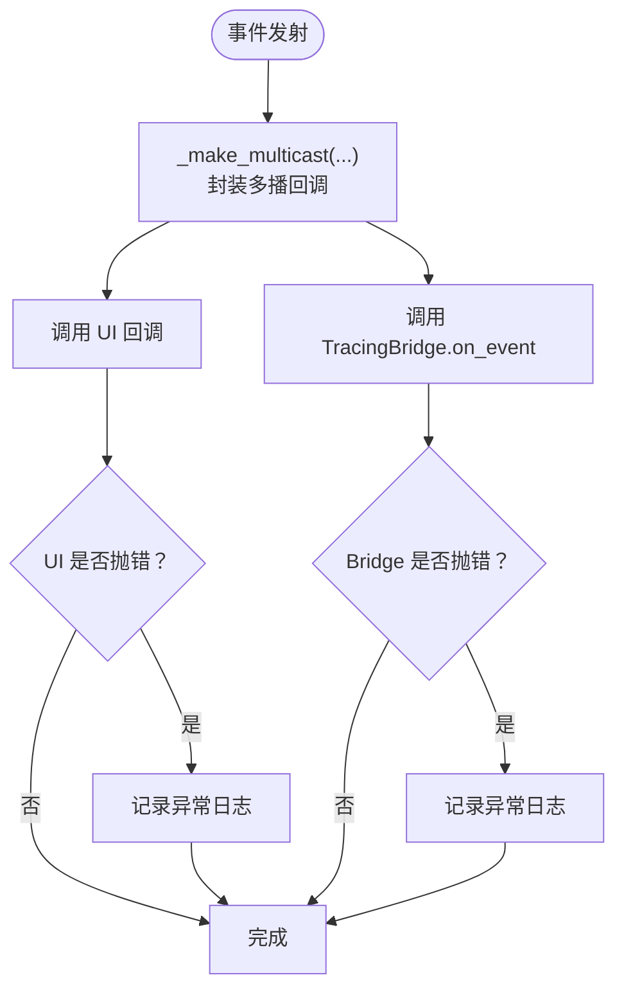
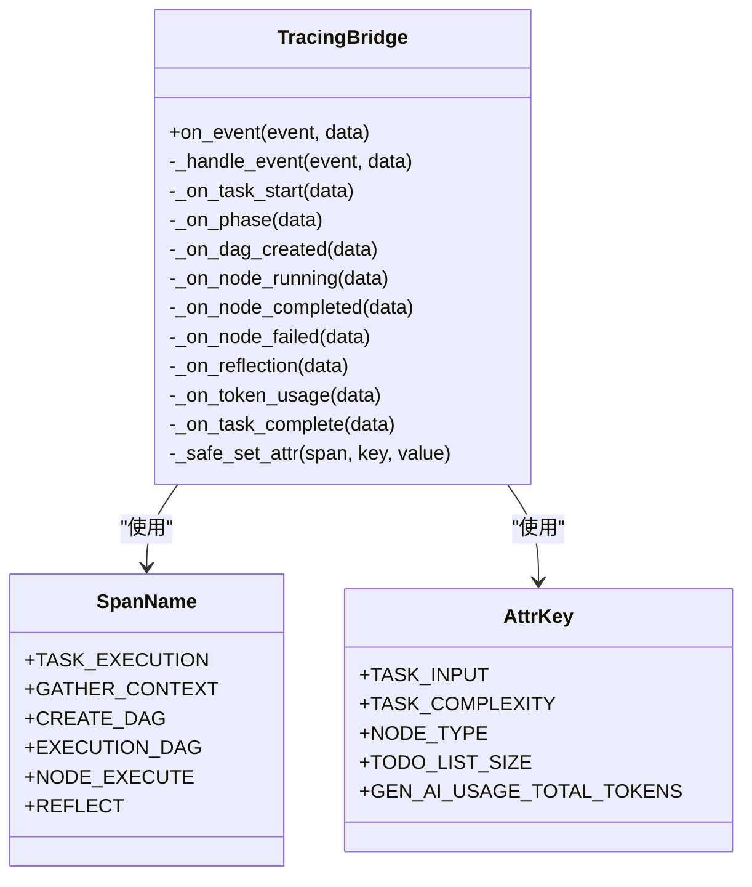
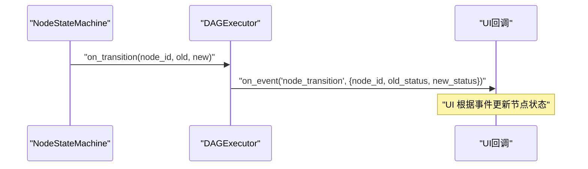
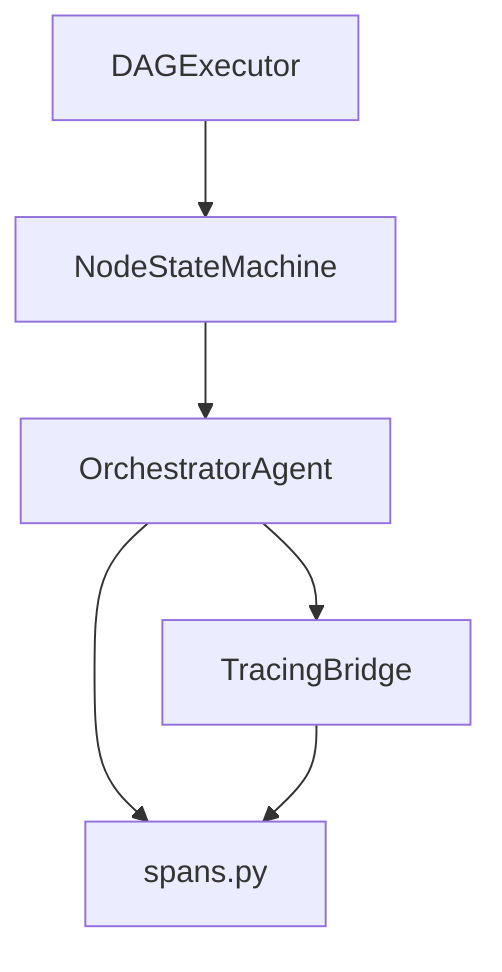

# 事件系统

<cite>
**本文引用的文件**
- [agents/orchestrator.py](file://agents/orchestrator.py)
- [tracing/bridge.py](file://tracing/bridge.py)
- [tracing/spans.py](file://tracing/spans.py)
- [dag/executor.py](file://dag/executor.py)
- [dag/state_machine.py](file://dag/state_machine.py)
- [schema.py](file://schema.py)
- [tests/test_tracing.py](file://tests/test_tracing.py)
- [sxw_aicoding/docs/tracing-guide.md](file://sxw_aicoding/docs/tracing-guide.md)
- [sxw_aicoding/docs/codemap.md](file://sxw_aicoding/docs/codemap.md)
</cite>

## 目录
1. [简介](#简介)
2. [项目结构](#项目结构)
3. [核心组件](#核心组件)
4. [架构总览](#架构总览)
5. [详细组件分析](#详细组件分析)
6. [依赖分析](#依赖分析)
7. [性能考量](#性能考量)
8. [故障排查指南](#故障排查指南)
9. [结论](#结论)
10. [附录](#附录)

## 简介
本文件为 manus_demo 的事件系统提供权威参考文档。事件系统采用“事件驱动 + 多播分发”的架构，围绕 OrchestratorAgent 的 _emit 事件发射器，将任务生命周期、规划、执行、反思、内存存储等关键节点以标准化事件形式广播。TracingBridge 订阅同一事件流，将其转换为 OpenTelemetry Span，实现“既有 UI 实时更新，又有可观测性追踪”的双重能力。文档涵盖事件类型定义、事件结构、事件传播机制、UI 事件映射、追踪事件、执行事件、生命周期管理、错误处理、扩展点与自定义事件添加方法，以及调试与监控最佳实践。

## 项目结构
事件系统主要分布在以下模块：
- OrchestratorAgent：事件发射中心，负责在任务生命周期各阶段发出标准化事件
- TracingBridge：事件到 Span 的桥接器，维护 Span 栈与父子关系
- spans.py：Span 名称、属性键、事件名称的语义常量
- DAGExecutor 与 NodeStateMachine：执行阶段的节点状态流转与事件回调
- schema.py：事件数据结构与状态枚举（如 TodoStatus、NodeStatus 等）

图表来源
- [agents/orchestrator.py](file://agents/orchestrator.py)
- [tracing/bridge.py](file://tracing/bridge.py)
- [dag/executor.py](file://dag/executor.py)
- [dag/state_machine.py](file://dag/state_machine.py)

章节来源
- [agents/orchestrator.py](file://agents/orchestrator.py)
- [tracing/bridge.py](file://tracing/bridge.py)
- [dag/executor.py](file://dag/executor.py)
- [dag/state_machine.py](file://dag/state_machine.py)

## 核心组件
- 事件发射器（OrchestratorAgent._emit）：统一的事件出口，异常隔离，确保 UI 更新不影响主流程
- 多播分发（OrchestratorAgent._make_multicast）：将事件同时投递到 UI 回调与 TracingBridge
- 事件处理器（TracingBridge.on_event/_handle_event）：基于事件名分发表路由到具体处理方法
- Span 管理（TracingBridge）：维护根 Span、阶段 Span、超步 Span、节点/TODO/步骤 Span 的父子层级
- UI 事件映射（NodeStateMachine.on_transition、DAGExecutor.on_node_transition）：将状态机事件映射为 UI 可感知的 node_transition 等事件
- 事件常量（spans.py）：统一的 SpanName、AttrKey、EventName 常量，确保可观测性一致性

章节来源
- [agents/orchestrator.py](file://agents/orchestrator.py)
- [tracing/bridge.py](file://tracing/bridge.py)
- [tracing/spans.py](file://tracing/spans.py)
- [dag/state_machine.py](file://dag/state_machine.py)
- [dag/executor.py](file://dag/executor.py)

## 架构总览
事件系统采用“发射器 + 多播 + 订阅者”的模式：
- 发射器：OrchestratorAgent 在任务生命周期关键节点发出事件
- 多播：通过 _make_multicast 将事件同时投递到 UI 回调与 TracingBridge
- 订阅者：
  - UI 回调：接收事件并驱动 UI 实时更新
  - TracingBridge：将事件转换为 OTel Span，维护层级关系与属性

图表来源
- [agents/orchestrator.py](file://agents/orchestrator.py)
- [tracing/bridge.py](file://tracing/bridge.py)

章节来源
- [agents/orchestrator.py](file://agents/orchestrator.py)
- [tracing/bridge.py](file://tracing/bridge.py)

## 详细组件分析

### 事件发射器与多播分发
- 发射器职责：在任务开始、阶段切换、规划生成、DAG 创建、节点执行、反思、内存存储、任务完成等节点发出事件
- 多播策略：将原始 UI 回调与 TracingBridge.on_event 包装为多播回调，任一订阅者异常不影响其他订阅者
- 异常安全：发射器与多播内部均捕获异常并记录日志，不向调用方传播

图表来源
- [agents/orchestrator.py](file://agents/orchestrator.py)

章节来源
- [agents/orchestrator.py](file://agents/orchestrator.py)

### TracingBridge 事件映射与 Span 生命周期
- 事件分发表：将事件名映射到具体处理方法（如 task_start、phase、node_running、node_completed、reflection 等）
- 根 Span：task_execution，承载任务输入、输出、总耗时、成功状态
- 阶段 Span：根据 phase 文本推导具体 Span 名称（如 gather_context、create_dag、execution_dag 等）
- 超步 Span：dag.super_step，记录并行节点数量
- 节点/步骤/TODO Span：node.execute.{id}、step.execute.{id}、todo.execute.{id}，记录节点/步骤/TODO 的描述、重试次数、状态
- 事件属性与事件：为 Span 设置属性（如任务复杂度、节点类型、TODO 列表大小等），并在必要时添加事件（如 reflection.complete、goal.reflection 等）

图表来源
- [tracing/bridge.py](file://tracing/bridge.py)
- [tracing/spans.py](file://tracing/spans.py)

章节来源
- [tracing/bridge.py](file://tracing/bridge.py)
- [tracing/spans.py](file://tracing/spans.py)
- [sxw_aicoding/docs/tracing-guide.md](file://sxw_aicoding/docs/tracing-guide.md)

### UI 事件映射与回调接口
- NodeStateMachine.on_transition：节点状态机在状态转移时触发回调，可用于 UI 实时更新节点状态
- DAGExecutor.on_node_transition：将状态机回调转发为 UI 事件（如 node_transition），实现 UI 与执行引擎解耦
- 事件驱动 UI 的优势：解耦业务逻辑与 UI 更新，支持实时可视化，便于调试与监控

图表来源
- [dag/state_machine.py](file://dag/state_machine.py)
- [dag/executor.py](file://dag/executor.py)
- [sxw_aicoding/docs/codemap.md](file://sxw_aicoding/docs/codemap.md)

章节来源
- [dag/state_machine.py](file://dag/state_machine.py)
- [dag/executor.py](file://dag/executor.py)
- [sxw_aicoding/docs/codemap.md](file://sxw_aicoding/docs/codemap.md)

### 事件类型定义与事件结构
- 任务生命周期事件
  - task_start：携带任务输入
  - task_complexity：携带复杂度与任务摘要
  - task_complete：携带最终答案与成功状态
- 阶段事件
  - phase：携带阶段描述文本
- 规划事件
  - plan：携带 v1 简单计划（steps）
  - dag_created：携带 v2 DAG（nodes、edges）
  - todo_list_initialized：携带 emergent TODO 列表初始信息
- 执行事件
  - superstep：携带超步索引、本轮就绪节点列表、并行节点数
  - node_running/node_completed/node_failed：携带节点对象与失败原因
  - step_start/step_complete/step_failed：携带步骤对象
  - todo_start/todo_complete/todo_failed/todo_blocked：携带 TODO 对象与重试/阻塞信息
- 反思事件
  - reflection：携带通过/分数/反馈等
- 其他事件
  - token_usage_summary：携带 Token 使用汇总
  - memory_stored：携带记忆存储摘要
  - goal-related 事件：goal_anchor、goal_reflection、goal_reanchor、goal_drift_alert、stagnation_detected

事件结构要点（示例）
- 节点事件：包含节点对象（含 id、node_type、description 等）
- TODO 事件：包含 TODO 对象（含 id、description、retry_count、status 等）
- 反思事件：包含通过标志、分数、反馈文本等
- 阶段事件：包含阶段描述文本，用于推导 Span 名称

章节来源
- [agents/orchestrator.py](file://agents/orchestrator.py)
- [tracing/bridge.py](file://tracing/bridge.py)
- [schema.py](file://schema.py)

### 事件传播机制与回调函数接口
- 回调签名：on_event(event: str, data: Any = None) -> None
- 多播回调：_make_multicast 将多个回调包装为单一回调，逐一调用并隔离异常
- 状态机回调：NodeStateMachine.on_transition(node_id, old_status, new_status)
- DAG 执行回调：DAGExecutor.on_node_transition(node_id, old_status, new_status)

章节来源
- [agents/orchestrator.py](file://agents/orchestrator.py)
- [dag/state_machine.py](file://dag/state_machine.py)
- [dag/executor.py](file://dag/executor.py)

### 事件监听与处理示例
- 监听任务生命周期：注册 on_event 回调，处理 task_start、phase、task_complete 等事件
- 监听 DAG 执行：处理 superstep、node_running、node_completed、node_failed 等事件
- 监听 TODO 列表：处理 todo_start、todo_complete、todo_failed、todo_blocked 等事件
- 监听反思：处理 reflection 事件，展示通过/分数/反馈
- 监听 Token 使用：处理 token_usage_summary 事件，统计 LLM 调用开销
- 监听内存存储：处理 memory_stored 事件，记录任务摘要

章节来源
- [agents/orchestrator.py](file://agents/orchestrator.py)
- [tracing/bridge.py](file://tracing/bridge.py)
- [sxw_aicoding/docs/tracing-guide.md](file://sxw_aicoding/docs/tracing-guide.md)

### 事件生命周期管理
- 任务级：task_start → 阶段 → 规划 → 执行 → 反思 → memory_stored → task_complete
- 阶段级：phase → plan/dag_created/todo_list_initialized → 执行事件 → 反思
- 节点级：node_running → node_completed/node_failed → 反思/重规划
- TODO 级：todo_start → todo_complete/todo_failed/todo_blocked → 反思/重规划
- Token 级：在任务开始时重置，在任务结束时汇总并上报

章节来源
- [agents/orchestrator.py](file://agents/orchestrator.py)
- [tracing/bridge.py](file://tracing/bridge.py)

### 错误处理
- 发射器与多播：捕获异常并记录日志，不向调用方传播
- TracingBridge：on_event/_handle_event 捕获异常并记录，保证追踪不影响主流程
- 状态机回调：捕获异常并记录，避免 UI 更新影响执行
- 测试验证：单元测试覆盖多播分发与未知事件的异常安全行为

章节来源
- [agents/orchestrator.py](file://agents/orchestrator.py)
- [tracing/bridge.py](file://tracing/bridge.py)
- [tests/test_tracing.py](file://tests/test_tracing.py)

### 扩展点与自定义事件
- 添加新的事件类型
  - 在 TracingBridge.__init__ 的事件分发表中添加映射
  - 实现对应的处理方法（如 _on_my_new_event），设置属性或事件
  - 在 spans.py 中添加相应的 SpanName/AttrKey/EventName 常量
- 事件数据结构
  - 使用 schema.py 中的数据模型（如 TodoItem、TaskNode、StepResult 等）作为事件数据载体
  - 或自定义字典结构，确保字段命名与 spans 常量一致

章节来源
- [tracing/bridge.py](file://tracing/bridge.py)
- [tracing/spans.py](file://tracing/spans.py)
- [schema.py](file://schema.py)
- [sxw_aicoding/docs/tracing-guide.md](file://sxw_aicoding/docs/tracing-guide.md)

### 事件调试与监控最佳实践
- 使用 TracingBridge 将事件自动转换为 Span，结合 OTel Collector/Exporter 进行可视化
- 在 UI 回调中记录关键事件的时间戳与数据摘要，便于前端调试
- 对高频事件（如 node_running/node_completed）进行采样或聚合，避免日志风暴
- 为关键事件添加属性（如任务复杂度、节点类型、TODO 列表大小），提升可观测性
- 使用单元测试验证事件分发表完整性与异常安全

章节来源
- [tracing/bridge.py](file://tracing/bridge.py)
- [tests/test_tracing.py](file://tests/test_tracing.py)
- [sxw_aicoding/docs/tracing-guide.md](file://sxw_aicoding/docs/tracing-guide.md)

## 依赖分析
- OrchestratorAgent 依赖 TracingBridge（可选）与 UI 回调
- TracingBridge 依赖 spans.py 中的常量，依赖 OpenTelemetry Tracer
- DAGExecutor 依赖 NodeStateMachine，后者通过回调触发 UI 事件
- schema.py 为事件数据结构提供统一模型

图表来源
- [agents/orchestrator.py](file://agents/orchestrator.py)
- [tracing/bridge.py](file://tracing/bridge.py)
- [tracing/spans.py](file://tracing/spans.py)
- [dag/executor.py](file://dag/executor.py)
- [dag/state_machine.py](file://dag/state_machine.py)

章节来源
- [agents/orchestrator.py](file://agents/orchestrator.py)
- [tracing/bridge.py](file://tracing/bridge.py)
- [tracing/spans.py](file://tracing/spans.py)
- [dag/executor.py](file://dag/executor.py)
- [dag/state_machine.py](file://dag/state_machine.py)

## 性能考量
- 多播分发的开销：事件被复制到多个回调，需关注回调数量与处理成本
- 并发执行与事件：DAGExecutor 在 asyncio.gather 中并行执行节点，事件回调需线程安全或异步安全
- Span 层级管理：过多层级与频繁创建/销毁 Span 会影响性能，应合理复用与清理
- 日志与采样：高频事件建议采样或聚合，避免 IO 抖动

## 故障排查指南
- 事件未到达 UI：检查多播回调是否正确包装；确认 UI 回调未抛出异常
- 追踪异常：查看 TracingBridge 的异常日志；确认事件名在分发表中存在
- 事件缺失：核对事件分发表；确认事件名拼写与大小写一致
- 并发问题：确认回调在异步环境中安全；避免共享可变状态
- 单元测试参考：通过测试用例验证多播分发与异常安全行为

章节来源
- [tests/test_tracing.py](file://tests/test_tracing.py)
- [agents/orchestrator.py](file://agents/orchestrator.py)
- [tracing/bridge.py](file://tracing/bridge.py)

## 结论
manus_demo 的事件系统通过“发射器 + 多播 + 订阅者”模式实现了任务生命周期的可观测与 UI 实时更新。TracingBridge 将事件无缝转换为 OTel Span，既满足调试与监控需求，又不干扰主流程。通过统一的事件常量与清晰的生命周期划分，系统具备良好的扩展性与稳定性。建议在新增事件时遵循现有约定，确保 UI 与追踪的一致性。

## 附录
- 事件类型清单与处理方法映射可参考 TracingBridge 的事件分发表
- UI 事件映射与回调接口可参考 NodeStateMachine 与 DAGExecutor 的回调参数
- 事件数据结构可参考 schema.py 中的模型定义