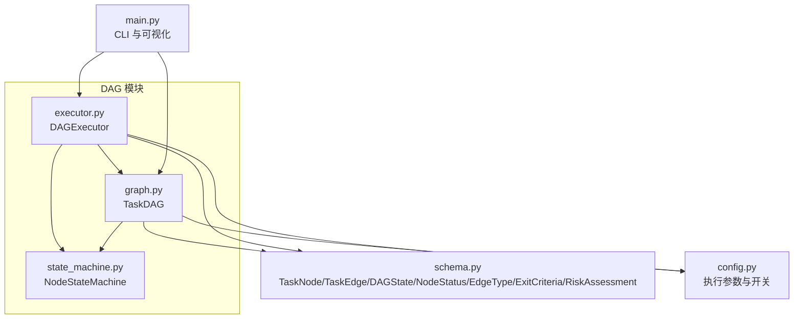
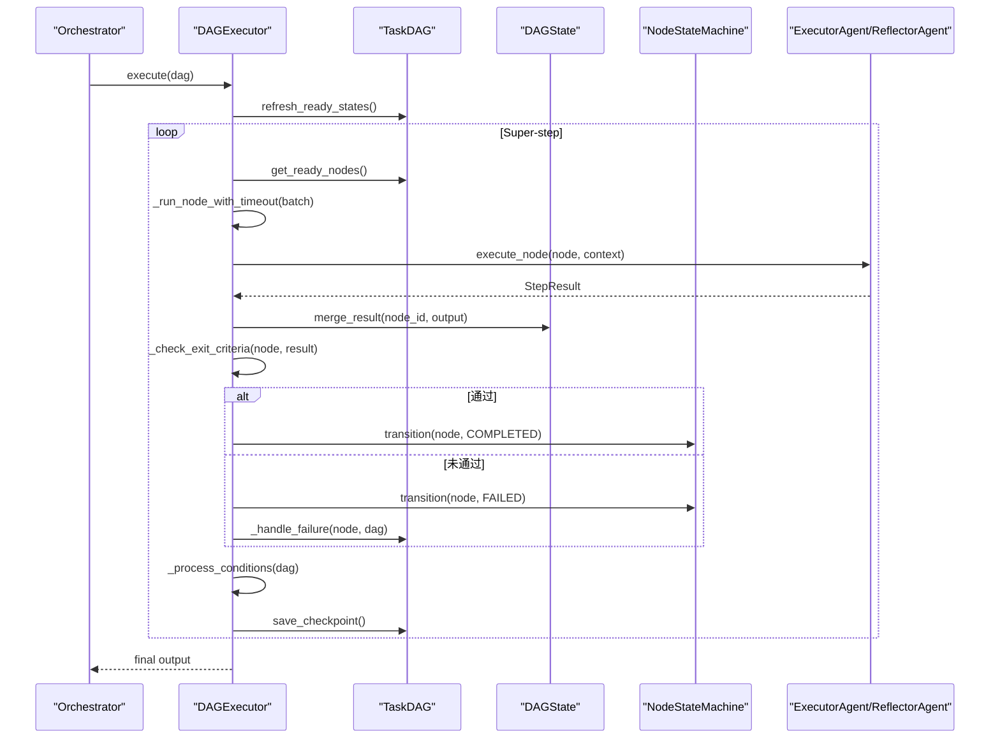
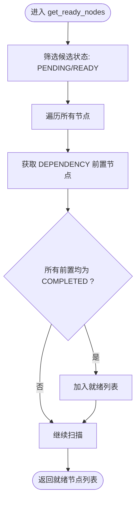
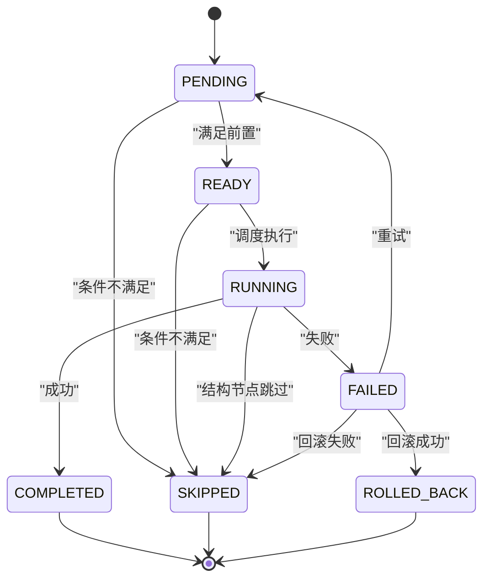
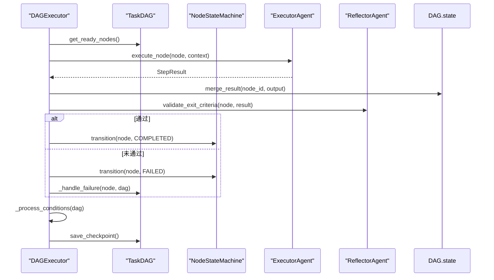
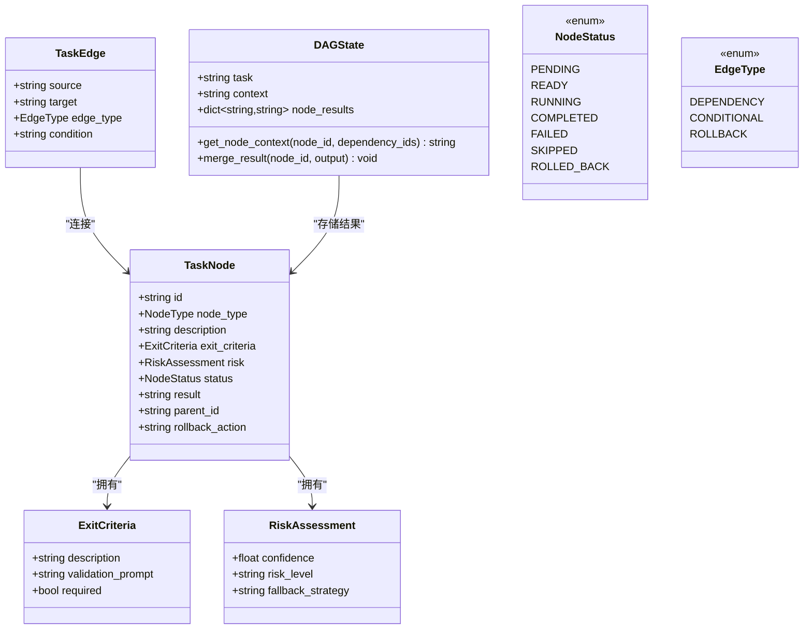
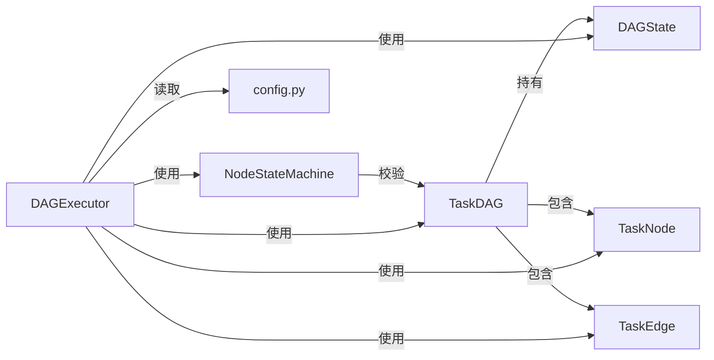

# DAG 规划模型

<cite>
**本文档引用的文件**
- [dag/graph.py](file://dag/graph.py)
- [dag/state_machine.py](file://dag/state_machine.py)
- [dag/executor.py](file://dag/executor.py)
- [schema.py](file://schema.py)
- [config.py](file://config.py)
- [main.py](file://main.py)
- [tests/test_dag_capabilities.py](file://tests/test_dag_capabilities.py)
- [dynamic-features.md](file://sxw_aicoding/docs/dynamic-features.md)
</cite>

## 目录
1. [简介](#简介)
2. [项目结构](#项目结构)
3. [核心组件](#核心组件)
4. [架构总览](#架构总览)
5. [详细组件分析](#详细组件分析)
6. [依赖关系分析](#依赖关系分析)
7. [性能考量](#性能考量)
8. [故障排查指南](#故障排查指南)
9. [结论](#结论)
10. [附录](#附录)

## 简介
本文件面向 manus_demo 的 DAG 规划模型（v2），系统性阐述分层规划的数据结构与执行引擎，重点包括：
- TaskNode、TaskEdge、DAGState 等核心结构
- NodeType（GOAL/SUBGOAL/ACTION）的层级关系
- NodeStatus 的状态机转换图
- EdgeType 的依赖关系类型
- ExitCriteria 的完成判据机制
- RiskAssessment 的风险评估模型
- DAGState 的集中式状态管理模式与 node_results 的合并策略
- 完整的代码示例路径，展示 DAG 图的构建与状态管理

## 项目结构
manus_demo 的 DAG 规划位于 dag/ 目录，配合 schema.py 中的数据模型与 config.py 的运行时配置，形成“数据模型 + 执行引擎 + 状态机”的完整体系。

图表来源
- [dag/graph.py:1-627](file://dag/graph.py#L1-L627)
- [dag/state_machine.py:1-114](file://dag/state_machine.py#L1-L114)
- [dag/executor.py:1-648](file://dag/executor.py#L1-L648)
- [schema.py:1-702](file://schema.py#L1-L702)
- [config.py:1-109](file://config.py#L1-L109)
- [main.py:1-516](file://main.py#L1-L516)

章节来源
- [dag/graph.py:1-627](file://dag/graph.py#L1-L627)
- [dag/state_machine.py:1-114](file://dag/state_machine.py#L1-L114)
- [dag/executor.py:1-648](file://dag/executor.py#L1-L648)
- [schema.py:1-702](file://schema.py#L1-L702)
- [config.py:1-109](file://config.py#L1-L109)
- [main.py:1-516](file://main.py#L1-L516)

## 核心组件
- TaskDAG：有向无环图容器，维护节点、边、集中式状态与检查点，提供就绪节点发现、拓扑排序、条件边评估、失败级联跳过、动态图变更等能力。
- NodeStateMachine：强制合法状态转移的状态机，确保节点状态变迁符合预定义转移表。
- DAGExecutor：基于 Super-step 的并行执行引擎，负责节点调度、并行执行、结果合并、完成判据验证、失败处理、条件边评估、自适应规划集成与检查点保存。
- schema.py：定义 TaskNode、TaskEdge、DAGState、NodeStatus、EdgeType、ExitCriteria、RiskAssessment 等核心数据结构与枚举。

章节来源
- [dag/graph.py:43-627](file://dag/graph.py#L43-L627)
- [dag/state_machine.py:55-114](file://dag/state_machine.py#L55-L114)
- [dag/executor.py:62-648](file://dag/executor.py#L62-L648)
- [schema.py:77-253](file://schema.py#L77-L253)

## 架构总览
DAG 执行采用 LangGraph 风格的集中式状态管理模式：DAGState 作为单一真相源，节点执行结果以 node_id 为键写入，避免并行写入冲突；NodeStateMachine 统一校验状态转移，DAGExecutor 以 Super-step 为单位驱动执行循环。

图表来源
- [dag/executor.py:110-264](file://dag/executor.py#L110-L264)
- [dag/graph.py:549-578](file://dag/graph.py#L549-L578)
- [dag/state_machine.py:88-114](file://dag/state_machine.py#L88-L114)

## 详细组件分析

### TaskDAG：分层规划与图算法
- 节点查询与就绪发现
  - get_ready_nodes()：在运行时扫描所有节点，基于 DEPENDENCY 边的前置完成状态动态发现可并行执行的节点。
  - get_dependency_ids()：通过预构建的反向邻接表 O(1) 查询依赖节点 ID。
- 图算法
  - topological_sort()：Kahn 算法，仅考虑 DEPENDENCY 边，O(V+E) 时间复杂度，保证执行顺序合法。
  - is_complete()：当所有节点进入终态（COMPLETED、SKIPPED、ROLLED_BACK）时返回 True。
  - get_downstream()：BFS 遍历 DEPENDENCY 边，返回下游节点集合，用于失败级联跳过。
- 状态变更
  - mark_subtree_skipped()：对下游节点批量标记 SKIPPED。
  - refresh_ready_states()：将满足前置的 PENDING 节点提升为 READY。
- 动态图变更（v3）
  - add_dynamic_node()/add_dynamic_edge()/remove_pending_node()/modify_node()：运行时安全地增删改节点与边，自动维护邻接表并检测环。
- 检查点与序列化
  - save_checkpoint()/checkpoints：保存状态快照，支持从快照恢复。
  - to_dict()/from_dict()：序列化/反序列化 DAG（结构+状态）。

图表来源
- [dag/graph.py:101-126](file://dag/graph.py#L101-L126)

章节来源
- [dag/graph.py:101-276](file://dag/graph.py#L101-L276)
- [dag/graph.py:219-276](file://dag/graph.py#L219-L276)
- [dag/graph.py:341-494](file://dag/graph.py#L341-L494)
- [dag/graph.py:521-578](file://dag/graph.py#L521-L578)

### NodeStateMachine：状态机与合法性校验
- 转移表 VALID_TRANSITIONS：定义合法状态转移集合，非法转移抛出 InvalidTransitionError。
- transition()/can_transition()：统一的状态变更入口，支持可选回调用于 UI 实时更新。

图表来源
- [dag/state_machine.py:42-52](file://dag/state_machine.py#L42-L52)
- [dag/state_machine.py:88-114](file://dag/state_machine.py#L88-L114)

章节来源
- [dag/state_machine.py:42-114](file://dag/state_machine.py#L42-L114)

### DAGExecutor：Super-step 并行执行引擎
- 主循环 execute()：以 Super-step 为单位，每轮发现就绪节点、并行执行、合并结果、验证完成判据、处理失败、评估条件边、保存检查点。
- 并行执行：使用 asyncio.gather 并发执行 ACTION 节点，return_exceptions=True 防止单节点异常影响其他节点。
- 完成判据验证：_check_exit_criteria() 基于 ExitCriteria 的 validation_prompt 交由 Reflector 进行 LLM 验证。
- 失败处理：_handle_failure() 执行回滚节点（若有 ROLLBACK 边）、标记 FAILED、级联跳过下游子树。
- 条件边处理：_process_conditions() 基于源节点结果匹配条件关键词，动态激活/跳过目标节点。
- 结构性节点自动完成：_complete_structural_nodes() 当子节点全部终态时，自动完成 GOAL/SUBGOAL 节点。
- 自适应规划（v3）：_should_adapt()/_adapt_plan() 在超步间触发 Planner 的自适应调整。
- 输出编译：_compile_output() 按拓扑序汇总 ACTION 节点结果。

图表来源
- [dag/executor.py:110-264](file://dag/executor.py#L110-L264)
- [dag/executor.py:350-400](file://dag/executor.py#L350-L400)
- [dag/executor.py:405-473](file://dag/executor.py#L405-L473)

章节来源
- [dag/executor.py:110-264](file://dag/executor.py#L110-L264)
- [dag/executor.py:316-331](file://dag/executor.py#L316-L331)
- [dag/executor.py:350-400](file://dag/executor.py#L350-L400)
- [dag/executor.py:405-473](file://dag/executor.py#L405-L473)
- [dag/executor.py:547-572](file://dag/executor.py#L547-L572)

### 数据模型：TaskNode、TaskEdge、DAGState、NodeStatus、EdgeType、ExitCriteria、RiskAssessment
- NodeType：GOAL（顶层目标）、SUBGOAL（子目标）、ACTION（可执行动作）。ACTION 节点由 Executor 实际运行，GOAL/SUBGOAL 为结构性分组，状态由子节点决定。
- NodeStatus：PENDING/READY/RUNNING/COMPLETED/FAILED/SKIPPED/ROLLED_BACK。状态机强制合法转移。
- EdgeType：DEPENDENCY（依赖边）、CONDITIONAL（条件边）、ROLLBACK（回滚边）。
- ExitCriteria：定义节点的完成标准，支持 required 与 validation_prompt；required=True 且 validation_prompt 非空时，通过 Reflector 进行 LLM 验证。
- RiskAssessment：confidence/risk_level/fallback_strategy，用于规划时的风险评估与备选策略。
- DAGState：集中式状态，node_results 以 node_id 为键存储节点输出；merge_result() 覆盖写入；get_node_context() 汇集依赖节点结果作为节点输入。

图表来源
- [schema.py:77-253](file://schema.py#L77-L253)

章节来源
- [schema.py:77-176](file://schema.py#L77-L176)
- [schema.py:178-187](file://schema.py#L178-L187)
- [schema.py:192-253](file://schema.py#L192-L253)

### 完成判据 ExitCriteria 机制
- required=True 且 validation_prompt 非空：通过 Reflector.validate_exit_criteria() 进行 LLM 验证。
- required=True 且 validation_prompt 为空：直接以执行成功与否为判定结果。
- required=False：跳过验证，始终返回 True。

章节来源
- [dag/executor.py:316-331](file://dag/executor.py#L316-L331)
- [schema.py:121-142](file://schema.py#L121-L142)

### 风险评估 RiskAssessment 模型
- confidence：成功概率 0~1
- risk_level：low/medium/high
- fallback_strategy：失败时的备选策略

章节来源
- [schema.py:144-152](file://schema.py#L144-L152)

### DAGState 集中式状态管理与 node_results 合并策略
- 集中式状态：DAGState 作为单一真相源，集中管理 task/context/node_results。
- 合并策略：merge_result(node_id, output) 直接覆盖写入，每个节点独享一个 key，天然避免并行写入冲突。
- 上下文构建：get_node_context() 汇集 DAGState.context 与依赖节点结果，作为节点输入。

章节来源
- [schema.py:192-253](file://schema.py#L192-L253)
- [dag/graph.py:549-578](file://dag/graph.py#L549-L578)

### 代码示例路径（不含具体代码内容）
- 构建三层 DAG（Goal/SubGoal/Action）并执行
  - 示例路径：[tests/test_dag_capabilities.py:46-127](file://tests/test_dag_capabilities.py#L46-L127)
- 并行执行 + 工具调用 + 检查点
  - 示例路径：[tests/test_dag_capabilities.py:224-340](file://tests/test_dag_capabilities.py#L224-L340)
- 条件分支 + 失败回滚
  - 示例路径：[tests/test_dag_capabilities.py:354-534](file://tests/test_dag_capabilities.py#L354-L534)
- 动态图变更（添加/移除/修改节点）
  - 示例路径：[tests/test_dag_capabilities.py:548-647](file://tests/test_dag_capabilities.py#L548-L647)
- CLI 可视化与事件驱动 UI
  - 示例路径：[main.py:184-390](file://main.py#L184-L390)

## 依赖关系分析
- TaskDAG 依赖 NodeStateMachine 进行状态转移校验，依赖 schema.py 中的 TaskNode/TaskEdge/DAGState/NodeStatus/EdgeType/ExitCriteria/RiskAssessment。
- DAGExecutor 依赖 TaskDAG、NodeStateMachine、schema.py 中的 StepResult、TaskNode，以及 config.py 的执行参数。
- schema.py 为 DAG 执行提供数据契约，main.py 提供 Rich 可视化与事件驱动 UI。

图表来源
- [dag/graph.py:57-69](file://dag/graph.py#L57-L69)
- [dag/executor.py:87-101](file://dag/executor.py#L87-L101)
- [schema.py:77-253](file://schema.py#L77-L253)
- [config.py:44-59](file://config.py#L44-L59)

章节来源
- [dag/graph.py:57-69](file://dag/graph.py#L57-L69)
- [dag/executor.py:87-101](file://dag/executor.py#L87-L101)
- [schema.py:77-253](file://schema.py#L77-L253)
- [config.py:44-59](file://config.py#L44-L59)

## 性能考量
- 就绪发现与拓扑排序：通过预构建 DEPENDENCY 边的邻接表，get_ready_nodes() 与 topological_sort() 达到 O(V+E) 复杂度。
- 并行执行：MAX_PARALLEL_NODES 限制每轮并发节点数，避免资源竞争与超时。
- 超时保护：NODE_EXECUTION_TIMEOUT 防止单节点卡死影响批次。
- 检查点：MAX_CHECKPOINTS 限制内存中快照数量，防止长时间运行内存泄漏。
- 条件边评估：缓存已评估的 (source, target) 对，避免重复计算。

章节来源
- [dag/graph.py:82-95](file://dag/graph.py#L82-L95)
- [dag/executor.py:179-182](file://dag/executor.py#L179-L182)
- [config.py:44](file://config.py#L44)
- [config.py:58-59](file://config.py#L58-L59)
- [dag/executor.py:405-439](file://dag/executor.py#L405-L439)

## 故障排查指南
- DAG stuck（阻塞）：当无就绪节点但 DAG 未完成时，检查 FAILED 节点与拓扑环；可通过 get_blockage_report() 获取阻塞报告。
- 状态机非法转移：InvalidTransitionError 表示状态转移不合法，检查 VALID_TRANSITIONS 与调用顺序。
- 条件分支未生效：确认 CONDITIONAL 边的 condition 关键词与源节点输出匹配策略（CJK 与拉丁文区分）。
- 失败未回滚：检查是否存在 ROLLBACK 边，确认回滚节点是否成功执行。
- 动态图变更失败：检查节点 ID 冲突、源/目标节点存在性与环检测。

章节来源
- [dag/graph.py:277-335](file://dag/graph.py#L277-L335)
- [dag/state_machine.py:30-36](file://dag/state_machine.py#L30-L36)
- [dag/executor.py:405-473](file://dag/executor.py#L405-L473)
- [dag/graph.py:361-399](file://dag/graph.py#L361-L399)

## 结论
manus_demo 的 DAG 规划模型以 TaskDAG 为核心，结合 NodeStateMachine 的状态机与 DAGExecutor 的 Super-step 并行执行，实现了从静态线性到动态分层的跃迁。通过 ExitCriteria 的判据机制与 RiskAssessment 的风险评估，系统在保证执行可靠性的同时具备强大的动态性与自适应能力。DAGState 的集中式状态管理模式与 node_results 的合并策略，使得并行执行与状态一致性得到良好保障。

## 附录
- v2 动态性对比与演进分析（含 v3/v4/v5 的扩展能力）
  - 参考文档路径：[dynamic-features.md](file://sxw_aicoding/docs/dynamic-features.md)
- CLI 交互与可视化事件流
  - 参考实现路径：[main.py:184-390](file://main.py#L184-L390)