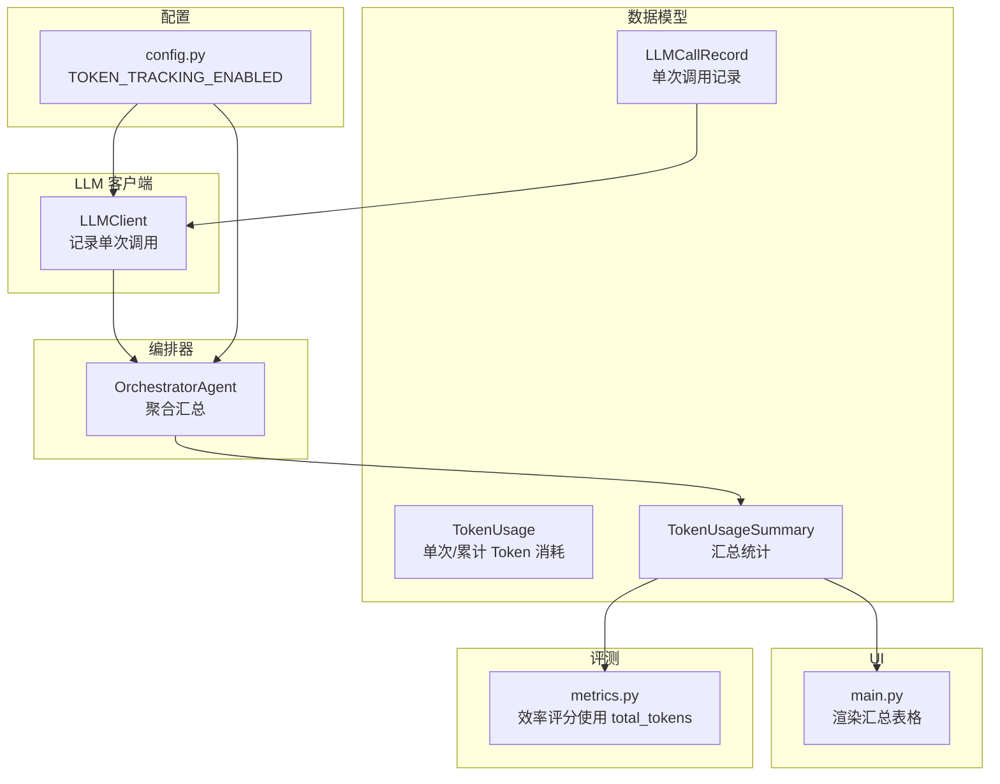
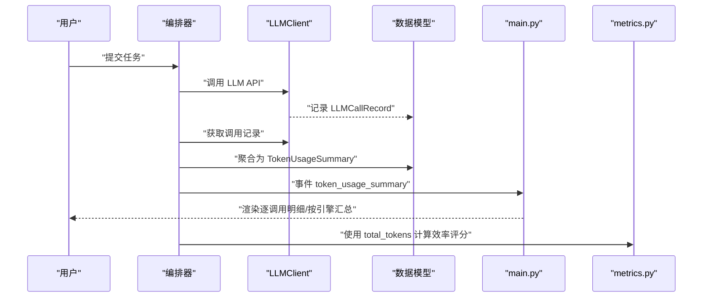
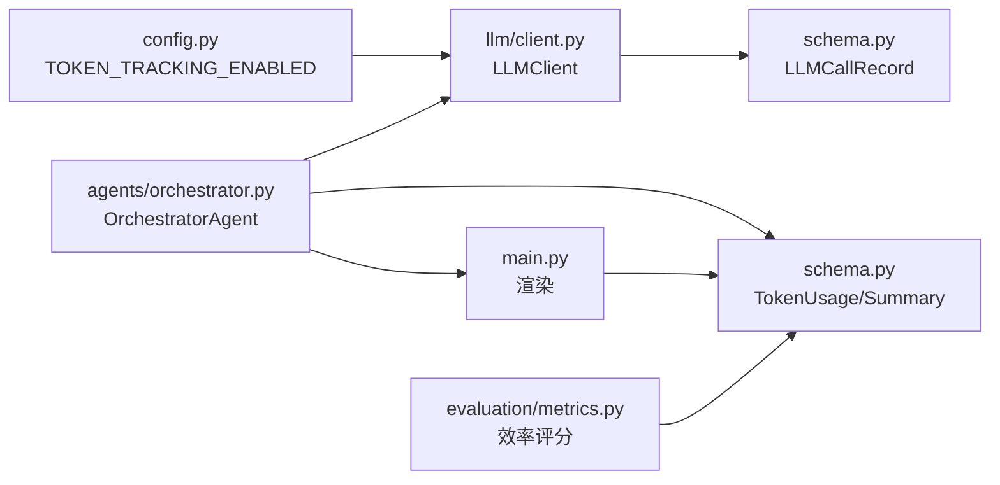

# Token 消耗追踪模型

<cite>
**本文引用的文件**
- [schema.py](file://schema.py)
- [client.py](file://llm/client.py)
- [main.py](file://main.py)
- [config.py](file://config.py)
- [metrics.py](file://evaluation/metrics.py)
- [orchestrator.py](file://agents/orchestrator.py)
</cite>

## 目录
1. [简介](#简介)
2. [项目结构](#项目结构)
3. [核心组件](#核心组件)
4. [架构概览](#架构概览)
5. [详细组件分析](#详细组件分析)
6. [依赖分析](#依赖分析)
7. [性能考量](#性能考量)
8. [故障排查指南](#故障排查指南)
9. [结论](#结论)
10. [附录](#附录)

## 简介
本文件聚焦 manus_demo 中的 Token 消耗追踪模型，系统性阐述 TokenUsage、LLMCallRecord、TokenUsageSummary 的设计目的、使用场景与实现细节，解释单次调用记录与聚合统计的区别，以及按引擎汇总的实现方式。文档还提供 prompt_tokens、completion_tokens、total_tokens 的计算逻辑与用途说明，并给出成本控制与性能优化的最佳实践、实际使用示例与监控指标。

## 项目结构
Token 消耗追踪涉及以下关键文件：
- schema.py：定义 TokenUsage、LLMCallRecord、TokenUsageSummary 等数据模型
- llm/client.py：LLM 客户端，负责记录单次调用的 Token 使用
- agents/orchestrator.py：编排器，负责将单次记录聚合为汇总统计
- main.py：UI 渲染 Token 消耗汇总，提供可视化输出
- config.py：配置开关 TOKEN_TRACKING_ENABLED
- evaluation/metrics.py：效率指标中使用 total_tokens 计算效率评分

图表来源
- [schema.py:303-335](file://schema.py#L303-L335)
- [client.py:273-302](file://llm/client.py#L273-L302)
- [orchestrator.py:532-554](file://agents/orchestrator.py#L532-L554)
- [main.py:113-177](file://main.py#L113-L177)
- [config.py:87-88](file://config.py#L87-L88)
- [metrics.py:125-130](file://evaluation/metrics.py#L125-L130)

章节来源
- [schema.py:303-335](file://schema.py#L303-L335)
- [client.py:273-302](file://llm/client.py#L273-L302)
- [orchestrator.py:532-554](file://agents/orchestrator.py#L532-L554)
- [main.py:113-177](file://main.py#L113-L177)
- [config.py:87-88](file://config.py#L87-L88)
- [metrics.py:125-130](file://evaluation/metrics.py#L125-L130)

## 核心组件
- TokenUsage：记录单次或累计的 prompt_tokens、completion_tokens、total_tokens 与 engine 标识
- LLMCallRecord：单次 LLM 调用的明细，包含调用类型、提示词摘要、Token 数与引擎
- TokenUsageSummary：汇总视图，包含 call_records 明细、按引擎汇总的 by_engine、全局 total

这些模型共同构成 Token 消耗追踪的数据基础，支撑 UI 可视化与评测指标计算。

章节来源
- [schema.py:303-335](file://schema.py#L303-L335)

## 架构概览
Token 消耗追踪的端到端流程如下：
- LLMClient 在每次 API 调用后，从响应 usage 中提取 prompt_tokens、completion_tokens、total_tokens，并记录为 LLMCallRecord
- OrchestratorAgent 在任务结束时，从 LLMClient 获取 call_records，按引擎聚合为 TokenUsageSummary
- main.py 接收 TokenUsageSummary，渲染“逐调用明细”和“按引擎汇总”的表格
- config.py 提供 TOKEN_TRACKING_ENABLED 开关，控制是否启用追踪
- evaluation/metrics.py 的效率评分使用 TokenUsageSummary.total.total_tokens 作为成本效率指标

图表来源
- [client.py:273-302](file://llm/client.py#L273-L302)
- [orchestrator.py:532-554](file://agents/orchestrator.py#L532-L554)
- [main.py:377-380](file://main.py#L377-L380)
- [metrics.py:322-367](file://evaluation/metrics.py#L322-L367)

章节来源
- [client.py:273-302](file://llm/client.py#L273-L302)
- [orchestrator.py:532-554](file://agents/orchestrator.py#L532-L554)
- [main.py:377-380](file://main.py#L377-L380)
- [metrics.py:322-367](file://evaluation/metrics.py#L322-L367)

## 详细组件分析

### TokenUsage 模型
- 字段含义
  - prompt_tokens：输入 prompt 的 Token 数
  - completion_tokens：输出 completion 的 Token 数
  - total_tokens：prompt_tokens + completion_tokens
  - engine：推理引擎标识（如模型名）
- 使用场景
  - 作为单次调用或按引擎/全局汇总的基础单位
  - 用于 UI 渲染与评测指标计算

章节来源
- [schema.py:303-312](file://schema.py#L303-L312)

### LLMCallRecord 模型
- 字段含义
  - call_type：调用类型（chat/chat_with_tools/chat_json）
  - prompt_summary：首条 user 消息的摘要（最多 200 字符）
  - prompt_tokens、completion_tokens、total_tokens：对应 Token 数
  - engine：调用使用的引擎
- 记录时机
  - LLMClient 在每次 API 调用后，从响应 usage 中提取并构造 LLMCallRecord
  - 若响应缺少 usage，记录警告并跳过

章节来源
- [schema.py:314-324](file://schema.py#L314-L324)
- [client.py:273-302](file://llm/client.py#L273-L302)

### TokenUsageSummary 模型
- 字段含义
  - call_records：逐调用明细列表
  - by_engine：按引擎聚合的 TokenUsage 映射
  - total：全局 TokenUsage 汇总
- 聚合逻辑
  - 从 LLMClient 获取 call_records
  - 遍历记录，按 engine 聚合 prompt_tokens/completion_tokens/total_tokens
  - 计算全局 total

章节来源
- [schema.py:327-335](file://schema.py#L327-L335)
- [orchestrator.py:532-554](file://agents/orchestrator.py#L532-L554)

### LLMClient 的 Token 记录实现
- _record_call：从响应 usage 中提取 prompt_tokens、completion_tokens、total_tokens，构造 LLMCallRecord 并加入 _call_records
- get_call_records/reset_usage：提供调用记录查询与重置，便于新任务开始前清空历史

章节来源
- [client.py:273-302](file://llm/client.py#L273-L302)

### OrchestratorAgent 的汇总实现
- _finalize_token_usage：将 LLMClient 的调用记录转换为 TokenUsageSummary
  - 按引擎聚合：遍历 call_records，累加各字段
  - 全局汇总：遍历 call_records，累加各字段
- 事件触发：在任务完成后发出 token_usage_summary 事件，交由 UI 渲染

章节来源
- [orchestrator.py:532-554](file://agents/orchestrator.py#L532-L554)

### UI 渲染与可视化
- _render_token_summary：渲染三部分
  - 逐调用明细表：包含调用类型、提示词摘要、prompt/completion/total
  - 按引擎汇总表：按 engine 汇总 prompt/completion/total
  - 总计面板：显示全局 total_tokens 与分项

章节来源
- [main.py:113-177](file://main.py#L113-L177)

### 配置开关
- TOKEN_TRACKING_ENABLED：控制是否启用 Token 消耗追踪（默认启用）

章节来源
- [config.py:87-88](file://config.py#L87-L88)

### 评测指标中的 Token 使用
- efficiency.score 使用 total_tokens 作为成本效率指标的一部分，结合轨迹效率、时间效率与重规划惩罚，综合评估任务效率

章节来源
- [metrics.py:125-130](file://evaluation/metrics.py#L125-L130)
- [metrics.py:322-367](file://evaluation/metrics.py#L322-L367)

## 依赖分析
- LLMClient 依赖 schema.LLMCallRecord
- OrchestratorAgent 依赖 schema.TokenUsage、schema.TokenUsageSummary，并调用 LLMClient 的记录与查询接口
- main.py 依赖 schema.TokenUsageSummary，接收事件并渲染
- config.py 提供 TOKEN_TRACKING_ENABLED，影响 LLMClient 的记录行为
- evaluation/metrics.py 依赖 EfficiencyMetrics.total_tokens，间接使用 TokenUsageSummary.total.total_tokens

图表来源
- [config.py:87-88](file://config.py#L87-L88)
- [client.py:273-302](file://llm/client.py#L273-L302)
- [schema.py:303-335](file://schema.py#L303-L335)
- [orchestrator.py:532-554](file://agents/orchestrator.py#L532-L554)
- [main.py:113-177](file://main.py#L113-L177)
- [metrics.py:125-130](file://evaluation/metrics.py#L125-L130)

章节来源
- [config.py:87-88](file://config.py#L87-L88)
- [client.py:273-302](file://llm/client.py#L273-L302)
- [schema.py:303-335](file://schema.py#L303-L335)
- [orchestrator.py:532-554](file://agents/orchestrator.py#L532-L554)
- [main.py:113-177](file://main.py#L113-L177)
- [metrics.py:125-130](file://evaluation/metrics.py#L125-L130)

## 性能考量
- 记录开销：每次 LLM 调用都会读取 usage 并构造 LLMCallRecord，属于轻量级操作
- 聚合成本：按引擎聚合与全局汇总均为 O(n) 遍历，n 为调用次数
- UI 渲染：渲染表格与面板为 UI 层面的开销，通常可忽略
- 配置控制：通过 TOKEN_TRACKING_ENABLED 可在不需要时关闭追踪，降低运行时开销

[本节为通用性能讨论，不直接分析具体文件]

## 故障排查指南
- 问题：UI 显示“Token usage: N/A”
  - 可能原因：LLM 提供商未返回 usage 数据
  - 处理：确认供应商支持 usage 返回；或在 config 中关闭 TOKEN_TRACKING_ENABLED
- 问题：usage 缺失警告频繁出现
  - 可能原因：API 响应未包含 usage
  - 处理：检查 API 配置与提供商能力；必要时降级处理
- 问题：按引擎汇总为 0
  - 可能原因：TOKEN_TRACKING_ENABLED 为 False；或调用未产生 usage
  - 处理：启用追踪；确认调用类型与提供商支持

章节来源
- [client.py:287-289](file://llm/client.py#L287-L289)
- [config.py:87-88](file://config.py#L87-L88)

## 结论
manus_demo 的 Token 消耗追踪模型以简洁的数据结构与清晰的职责划分实现了从单次调用到聚合统计的完整闭环。LLMCallRecord 提供逐调用明细，TokenUsageSummary 提供按引擎与全局的汇总视图，配合 UI 渲染与评测指标，形成可观测、可优化的成本控制体系。通过 TOKEN_TRACKING_ENABLED 的配置开关，可在功能与性能之间灵活取舍。

[本节为总结性内容，不直接分析具体文件]

## 附录

### prompt_tokens、completion_tokens、total_tokens 的计算逻辑与用途
- 计算来源：从 LLM API 响应的 usage 字段提取
- 计算逻辑：total_tokens = prompt_tokens + completion_tokens
- 用途：
  - 成本控制：用于预算与计费估算
  - 性能优化：指导提示词长度与输出长度的平衡
  - 评测指标：效率评分中作为成本效率权重

章节来源
- [client.py:291-293](file://llm/client.py#L291-L293)
- [metrics.py:348-354](file://evaluation/metrics.py#L348-L354)

### 使用示例与监控指标
- 启用追踪并运行任务：设置 TOKEN_TRACKING_ENABLED=true，执行 main.py
- 查看逐调用明细：UI 表格显示 call_type、prompt_summary、prompt/completion/total
- 查看按引擎汇总：UI 表格显示各引擎的 prompt/completion/total
- 查看全局总计：Panel 显示 total_tokens 与分项
- 评测指标：efficiency.score 使用 total_tokens 作为成本效率指标之一

章节来源
- [config.py:87-88](file://config.py#L87-L88)
- [main.py:113-177](file://main.py#L113-L177)
- [metrics.py:322-367](file://evaluation/metrics.py#L322-L367)