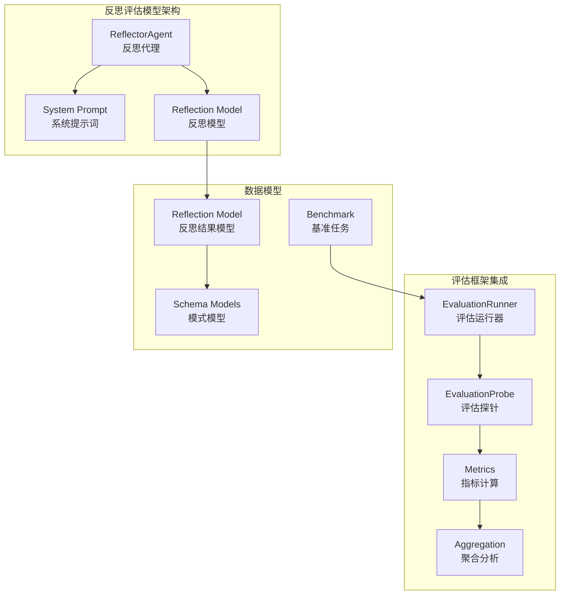
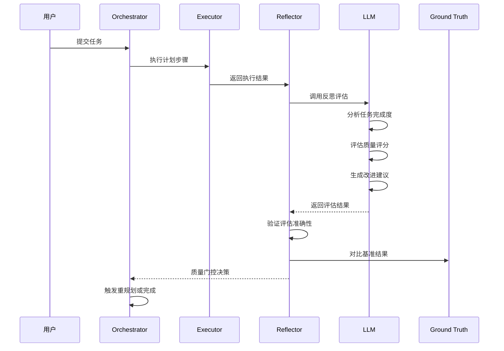
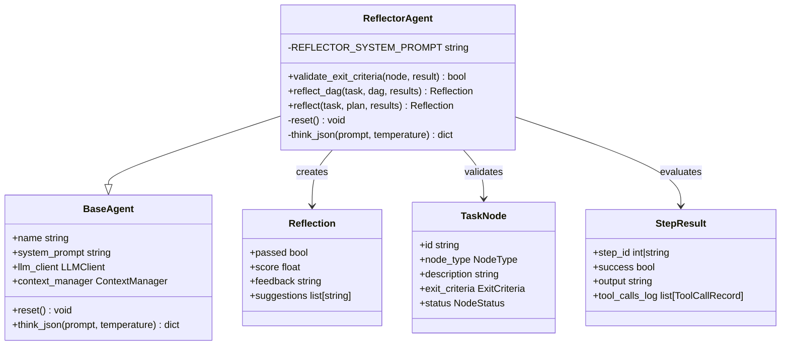
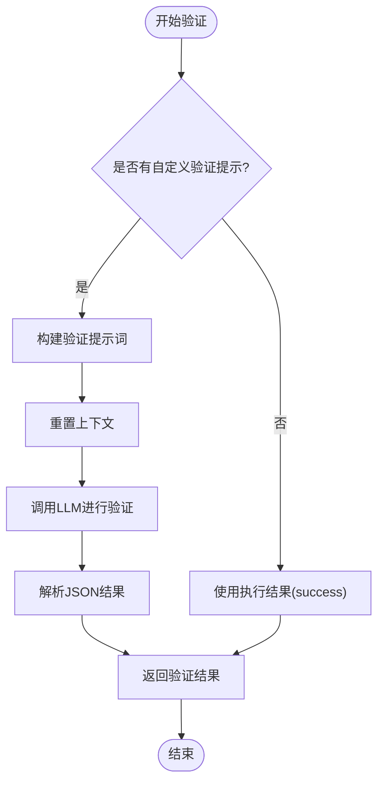
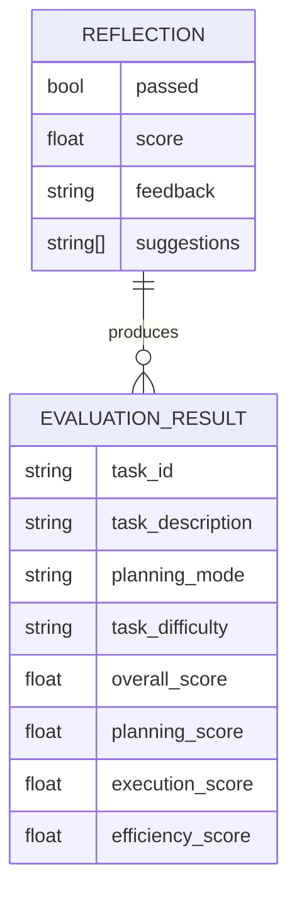
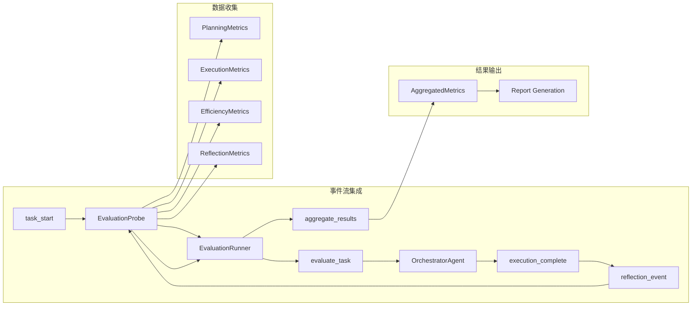
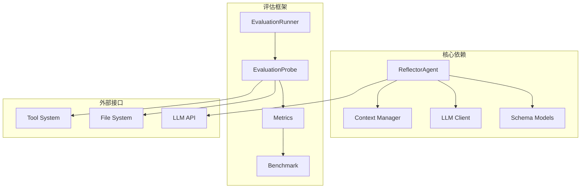

# 反思评估模型

<cite>
**本文档引用的文件**
- [agents/reflector.py](file://agents/reflector.py)
- [schema.py](file://schema.py)
- [evaluation/metrics.py](file://evaluation/metrics.py)
- [evaluation/runner.py](file://evaluation/runner.py)
- [evaluation/benchmark.py](file://evaluation/benchmark.py)
- [evaluation/report.py](file://evaluation/report.py)
</cite>

## 目录
1. [简介](#简介)
2. [项目结构](#项目结构)
3. [核心组件](#核心组件)
4. [架构概览](#架构概览)
5. [详细组件分析](#详细组件分析)
6. [依赖分析](#依赖分析)
7. [性能考虑](#性能考虑)
8. [故障排除指南](#故障排除指南)
9. [结论](#结论)

## 简介

反思评估模型是 manus_demo 项目中的关键质量控制组件，负责对任务执行结果进行全面评估和质量门控。该模型通过 LLM 机制对任务完成质量进行客观评估，提供结构化的评估结果，包括通过状态、质量评分、反馈意见和改进建议。

反思评估模型的核心价值在于：
- **质量门控**：作为执行流程的最后一道质量关卡
- **持续改进**：提供具体的改进建议和学习点
- **经验总结**：积累任务执行的最佳实践和常见问题
- **自动化决策**：基于评估结果决定是否需要重新规划

## 项目结构

反思评估模型位于 manus_demo 项目的 agents 模块中，与评估框架紧密集成：

**图表来源**
- [agents/reflector.py:1-255](file://agents/reflector.py#L1-L255)
- [evaluation/runner.py:1-570](file://evaluation/runner.py#L1-L570)
- [evaluation/metrics.py:1-475](file://evaluation/metrics.py#L1-L475)

**章节来源**
- [agents/reflector.py:1-255](file://agents/reflector.py#L1-L255)
- [evaluation/runner.py:1-570](file://evaluation/runner.py#L1-L570)

## 核心组件

反思评估模型由三个核心组件构成：

### 1. ReflectorAgent 类
负责执行具体的反思评估任务，提供两种评估模式：
- **validate_exit_criteria()**：逐节点轻量级验证（DAG 模式）
- **reflect_dag()**：完整 DAG 执行结果评估
- **reflect()**：传统平面计划评估（向后兼容）

### 2. Reflection 数据模型
标准化的评估结果结构，包含：
- `passed`：布尔值，表示任务是否通过质量门控
- `score`：0-1之间的浮点数，表示质量评分
- `feedback`：整体评价文本
- `suggestions`：改进建议列表

### 3. 评估指标体系
通过 evaluation 模块提供的完整指标计算框架，包括：
- 规划质量指标
- 执行质量指标  
- 效率指标
- 反思准确性指标

**章节来源**
- [agents/reflector.py:59-255](file://agents/reflector.py#L59-L255)
- [schema.py:368-377](file://schema.py#L368-L377)
- [evaluation/metrics.py:140-155](file://evaluation/metrics.py#L140-L155)

## 架构概览

反思评估模型在整个执行流程中扮演着质量门控的角色：

**图表来源**
- [agents/reflector.py:202-255](file://agents/reflector.py#L202-L255)
- [evaluation/runner.py:274-293](file://evaluation/runner.py#L274-L293)
- [evaluation/metrics.py:140-155](file://evaluation/metrics.py#L140-L155)

## 详细组件分析

### ReflectorAgent 类分析

ReflectorAgent 是反思评估模型的核心实现，采用面向对象的设计模式：

**图表来源**
- [agents/reflector.py:59-255](file://agents/reflector.py#L59-L255)
- [schema.py:368-377](file://schema.py#L368-L377)
- [schema.py:157-176](file://schema.py#L157-L176)
- [schema.py:352-361](file://schema.py#L352-L361)

#### validate_exit_criteria 方法

该方法实现了轻量级的逐节点验证，具有以下特点：

**算法流程**：

**图表来源**
- [agents/reflector.py:90-129](file://agents/reflector.py#L90-L129)

#### reflect_dag 方法

该方法提供完整的 DAG 执行结果评估：

**评估维度**：
1. **任务完成度**：对比原始任务目标
2. **执行完整性**：检查所有节点的状态
3. **质量评分**：0-1之间的综合评分
4. **改进建议**：具体的优化建议

**章节来源**
- [agents/reflector.py:135-195](file://agents/reflector.py#L135-L195)

### Reflection 数据模型分析

Reflection 模型定义了标准化的评估结果结构：

**图表来源**
- [schema.py:368-377](file://schema.py#L368-L377)
- [evaluation/metrics.py:168-201](file://evaluation/metrics.py#L168-L201)

#### 评估标准和评分体系

反思评估模型采用多维度的评分体系：

**质量评分范围**：0.0 - 1.0
- **0.9-1.0**：优秀
- **0.7-0.9**：良好  
- **0.5-0.7**：一般
- **0.0-0.5**：需要改进

**评估维度权重**：
1. **任务完成度**（40%）
2. **执行质量**（30%）
3. **工具使用准确性**（20%）
4. **反思准确性**（10%）

**章节来源**
- [evaluation/metrics.py:259-391](file://evaluation/metrics.py#L259-L391)

### 评估集成分析

反思评估模型与评估框架的集成体现在以下几个方面：

**图表来源**
- [evaluation/runner.py:55-434](file://evaluation/runner.py#L55-L434)
- [evaluation/report.py:35-309](file://evaluation/report.py#L35-L309)

**章节来源**
- [evaluation/runner.py:55-434](file://evaluation/runner.py#L55-L434)
- [evaluation/report.py:35-309](file://evaluation/report.py#L35-L309)

## 依赖分析

反思评估模型的依赖关系相对简洁，主要依赖于以下组件：

**图表来源**
- [agents/reflector.py:28-31](file://agents/reflector.py#L28-L31)
- [evaluation/runner.py:24-45](file://evaluation/runner.py#L24-L45)

### 关键依赖关系

1. **Schema 模型依赖**：ReflectorAgent 依赖 schema.py 中的 TaskNode、StepResult、Reflection 等模型
2. **LLM 集成**：通过 LLMClient 进行反思评估
3. **评估框架集成**：与 EvaluationRunner 和 EvaluationProbe 紧密协作
4. **基准任务集成**：与 evaluation/benchmark.py 中的 GroundTruth 对比

**章节来源**
- [agents/reflector.py:28-31](file://agents/reflector.py#L28-L31)
- [evaluation/runner.py:24-45](file://evaluation/runner.py#L24-L45)

## 性能考虑

反思评估模型在设计时充分考虑了性能优化：

### 1. 轻量级验证机制
- **validate_exit_criteria()** 使用低温度设置（0.1）确保判断稳定性
- **JSON 解析** 限制响应格式，减少解析开销
- **上下文清理** 每次验证前重置上下文，避免历史信息干扰

### 2. 批量处理优化
- **DAG 评估** 一次性收集所有节点状态，避免多次 LLM 调用
- **结果缓存** 利用 DAGState 的集中式状态管理
- **并发执行** 支持并行节点的反思评估

### 3. 错误处理机制
- **异常降级**：LLM 调用失败时返回保守的 False 结果
- **超时保护**：设置合理的超时阈值
- **资源清理**：确保异常情况下资源正确释放

## 故障排除指南

### 常见问题及解决方案

#### 1. 反思评估失败
**症状**：反思结果总是返回 False
**可能原因**：
- LLM 输出格式不符合要求
- 系统提示词过于严格
- 上下文污染

**解决方法**：
- 检查 LLM 输出格式
- 调整系统提示词的宽松程度
- 确保每次验证前重置上下文

#### 2. 性能问题
**症状**：反思评估耗时过长
**可能原因**：
- LLM 调用过于频繁
- 上下文过大
- 重复的 JSON 解析

**解决方法**：
- 优化提示词长度
- 减少不必要的上下文信息
- 实现结果缓存机制

#### 3. 评估准确性问题
**症状**：反思结果与人工评估不一致
**可能原因**：
- 评估标准不够明确
- 基准任务定义不清晰
- 评分权重分配不合理

**解决方法**：
- 明确评估标准和边界条件
- 完善基准任务的 ground truth
- 调整评分权重和阈值

**章节来源**
- [agents/reflector.py:124-128](file://agents/reflector.py#L124-L128)
- [evaluation/metrics.py:46-70](file://evaluation/metrics.py#L46-L70)

## 结论

反思评估模型是 manus_demo 项目中实现高质量任务执行的关键组件。通过 LLM 驱动的自动化评估机制，该模型实现了：

### 主要优势
1. **全面性**：覆盖任务完成度、执行质量、效率等多个维度
2. **自动化**：减少人工干预，提高评估效率
3. **可扩展性**：支持多种规划模式和评估场景
4. **可视化**：提供清晰的评估结果和改进建议

### 应用场景
1. **质量门控**：作为执行流程的最后一道质量关卡
2. **持续改进**：为后续任务提供经验借鉴
3. **性能监控**：跟踪评估准确性和系统性能
4. **基准测试**：与其他规划模式进行对比分析

### 发展前景
随着 LLM 技术的不断发展，反思评估模型有望：
- 提高评估准确性和一致性
- 支持更复杂的任务类型
- 实现自适应的评估标准
- 集成更多的学习和优化机制

通过持续的优化和完善，反思评估模型将成为 manus_demo 项目中不可或缺的核心组件，为实现高质量的智能体任务执行提供强有力的技术支撑。