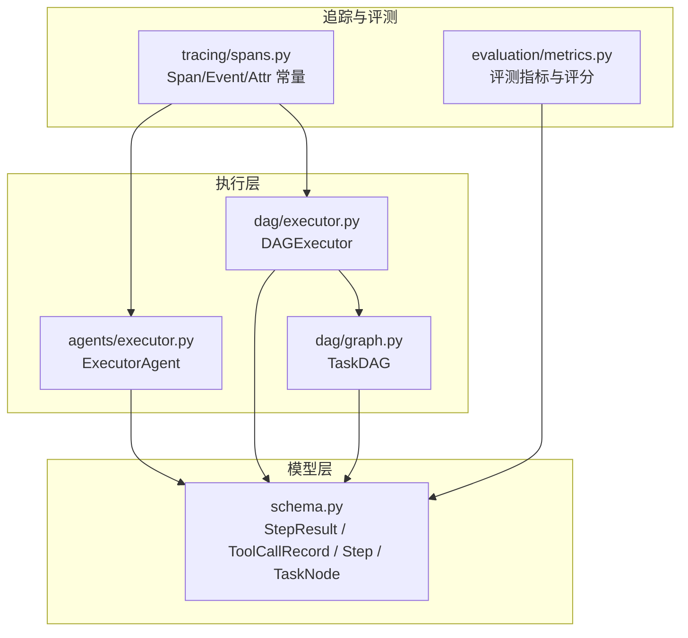
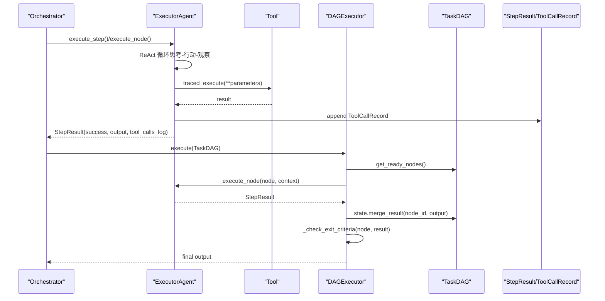
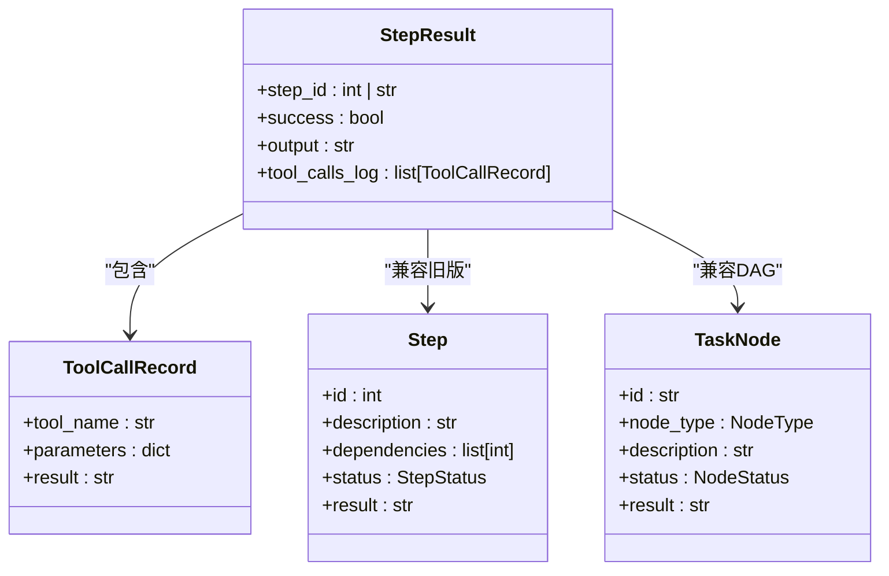
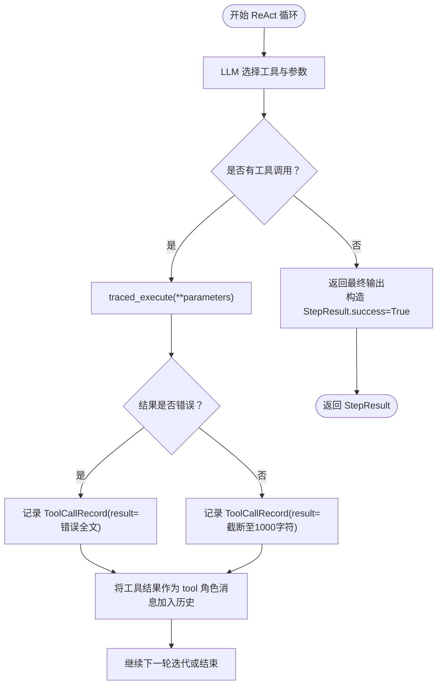
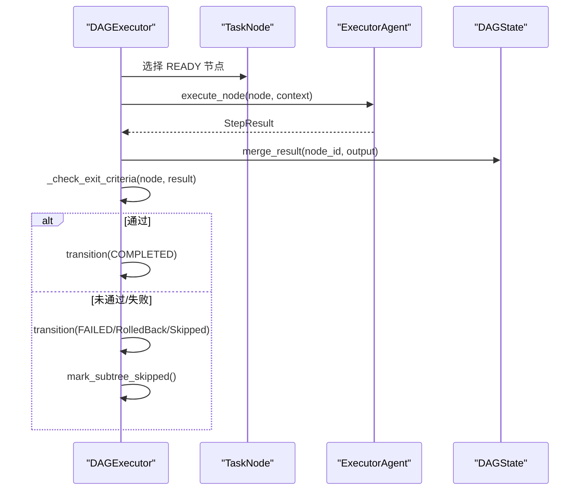
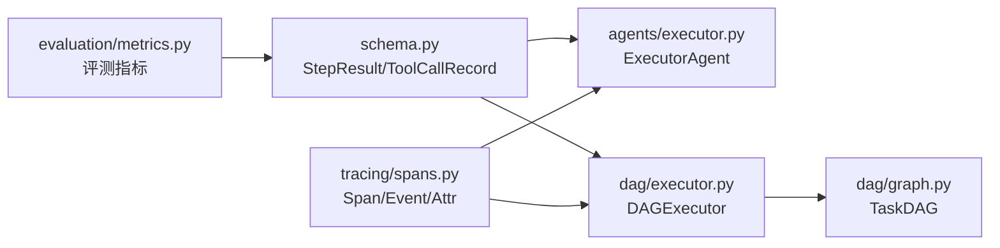

# 执行结果模型

<cite>
**本文引用的文件**
- [schema.py](file://schema.py)
- [agents/executor.py](file://agents/executor.py)
- [dag/executor.py](file://dag/executor.py)
- [dag/graph.py](file://dag/graph.py)
- [tracing/spans.py](file://tracing/spans.py)
- [evaluation/metrics.py](file://evaluation/metrics.py)
- [agents/base.py](file://agents/base.py)
</cite>

## 目录
1. [简介](#简介)
2. [项目结构](#项目结构)
3. [核心组件](#核心组件)
4. [架构总览](#架构总览)
5. [详细组件分析](#详细组件分析)
6. [依赖关系分析](#依赖关系分析)
7. [性能考量](#性能考量)
8. [故障排查指南](#故障排查指南)
9. [结论](#结论)
10. [附录](#附录)

## 简介
本文件聚焦 manus_demo 的“执行结果模型”，系统性阐述 StepResult 与 ToolCallRecord 两大核心数据结构，以及它们如何支撑旧版 Step 与 DAG TaskNode 的双路径兼容。文档还提供统一的执行结果标准化格式，便于 UI 展示与调试分析，并给出结果验证与质量评估的实践建议。

## 项目结构
围绕执行结果模型的关键文件与职责如下：
- schema.py：定义 StepResult、ToolCallRecord、Step、TaskNode 等核心数据模型，提供统一的结构化结果载体。
- agents/executor.py：ReAct 执行器，负责单步/节点的工具调用循环，产出 StepResult，并记录 ToolCallRecord。
- dag/executor.py：DAG 执行器，以 Super-step 并行执行 TaskNode，将 StepResult 写入 DAGState，并进行退出条件验证与失败处理。
- dag/graph.py：TaskDAG 图结构与状态管理，提供拓扑排序、就绪节点发现、条件边评估、回滚与跳过等能力。
- tracing/spans.py：追踪与事件命名常量，为 UI 展示与调试提供统一的 span/event/attribute 语义。
- evaluation/metrics.py：评测指标与评分体系，用于对执行结果进行质量评估与聚合分析。
- agents/base.py：基础智能体类，提供消息历史、工具调用记录等通用能力，支撑 StepResult 的构建。

图表来源
- [schema.py:352-361](file://schema.py#L352-L361)
- [agents/executor.py:131-164](file://agents/executor.py#L131-L164)
- [dag/executor.py:271-290](file://dag/executor.py#L271-L290)
- [dag/graph.py:43-81](file://dag/graph.py#L43-L81)
- [tracing/spans.py:18-81](file://tracing/spans.py#L18-L81)
- [evaluation/metrics.py:168-201](file://evaluation/metrics.py#L168-L201)

章节来源
- [schema.py:352-361](file://schema.py#L352-L361)
- [agents/executor.py:131-164](file://agents/executor.py#L131-L164)
- [dag/executor.py:271-290](file://dag/executor.py#L271-L290)
- [dag/graph.py:43-81](file://dag/graph.py#L43-L81)
- [tracing/spans.py:18-81](file://tracing/spans.py#L18-L81)
- [evaluation/metrics.py:168-201](file://evaluation/metrics.py#L168-L201)

## 核心组件
- StepResult：统一的单步/节点执行结果载体，包含步骤 ID、成功标志、最终输出文本、工具调用日志。
- ToolCallRecord：单次工具调用的记录，包含工具名称、参数、结果，用于 UI 展示与调试分析。
- Step：旧版扁平计划的步骤模型，兼容旧版执行路径。
- TaskNode：DAG 节点模型，ACTION 叶节点由执行器实际运行，GOAL/SUBGOAL 为结构性分组。

章节来源
- [schema.py:342-361](file://schema.py#L342-L361)
- [schema.py:47-67](file://schema.py#L47-L67)
- [schema.py:157-176](file://schema.py#L157-L176)

## 架构总览
StepResult 与 ToolCallRecord 在两条执行路径中被统一使用：
- 旧版路径（Step）：ExecutorAgent.execute_step() 产出 StepResult，工具调用日志记录在 ToolCallRecord 中。
- DAG 路径（TaskNode）：DAGExecutor.execute() 并行执行 ACTION 节点，每个节点通过 ExecutorAgent.execute_node() 产出 StepResult，DAGExecutor 将结果写入 DAGState，并进行退出条件验证与失败处理。

图表来源
- [agents/executor.py:171-188](file://agents/executor.py#L171-L188)
- [agents/executor.py:131-164](file://agents/executor.py#L131-L164)
- [dag/executor.py:110-131](file://dag/executor.py#L110-L131)
- [dag/executor.py:201-228](file://dag/executor.py#L201-L228)
- [dag/executor.py:271-290](file://dag/executor.py#L271-L290)
- [schema.py:342-361](file://schema.py#L342-L361)

## 详细组件分析

### StepResult 统一结果格式与双路径兼容
- 字段设计
  - step_id：兼容旧版 Step 的 int ID 与 DAG TaskNode 的 str ID。
  - success：布尔标志，表示执行是否成功。
  - output：最终输出文本，用于 UI 展示与后续节点上下文。
  - tool_calls_log：工具调用日志列表，记录本次执行中所有 ToolCallRecord。
- 双路径兼容
  - 旧版：ExecutorAgent.execute_step() 产出 StepResult，step_id 为 int。
  - DAG：DAGExecutor.execute() 并行执行 TaskNode，step_id 为 str。
- 与 DAGState 的协作
  - DAGExecutor 将 StepResult.output 写入 DAGState.node_results，供后续节点上下文拼接。

图表来源
- [schema.py:342-361](file://schema.py#L342-L361)
- [schema.py:342-349](file://schema.py#L342-L349)
- [schema.py:47-67](file://schema.py#L47-L67)
- [schema.py:157-176](file://schema.py#L157-L176)

章节来源
- [schema.py:352-361](file://schema.py#L352-L361)
- [agents/executor.py:171-188](file://agents/executor.py#L171-L188)
- [dag/executor.py:201-205](file://dag/executor.py#L201-L205)

### ToolCallRecord 工具调用日志结构
- 字段设计
  - tool_name：工具名称，用于 UI 展示与调试。
  - parameters：调用参数字典，便于回放与审计。
  - result：工具返回结果；成功时截断到 1000 字符，错误时保留全文，便于定位问题。
- 记录时机
  - ReAct 循环每完成一次工具调用，立即记录一条 ToolCallRecord。
  - 失败结果会被标记，引导 LLM 在后续迭代中停止执行或改用其他参数。
- 与 StepResult 的关系
  - StepResult.tool_calls_log 是 ToolCallRecord 的有序列表，按 ReAct 迭代顺序记录。

图表来源
- [agents/executor.py:273-321](file://agents/executor.py#L273-L321)
- [agents/executor.py:301-312](file://agents/executor.py#L301-L312)
- [schema.py:342-349](file://schema.py#L342-L349)

章节来源
- [agents/executor.py:273-321](file://agents/executor.py#L273-L321)
- [agents/executor.py:301-312](file://agents/executor.py#L301-L312)
- [schema.py:342-349](file://schema.py#L342-L349)

### 旧版 Step 与 DAG TaskNode 的双路径兼容
- 兼容策略
  - StepResult.step_id 支持 int（旧版）与 str（DAG），统一上层消费逻辑。
  - 旧版通过 ExecutorAgent.execute_step() 产出 StepResult；DAG 通过 ExecutorAgent.execute_node() 产出 StepResult。
  - DAGExecutor 在每轮 Super-step 中并行执行 ACTION 节点，将 StepResult.output 写入 DAGState，供后续节点上下文拼接。
- 退出条件验证
  - DAGExecutor._check_exit_criteria() 根据 TaskNode.exit_criteria 判断是否通过，决定节点状态转换。
- 失败处理
  - DAGExecutor._handle_failure() 支持回滚边（ROLLBACK）与子树级联跳过（SKIPPED），并记录失败原因。

图表来源
- [dag/executor.py:271-290](file://dag/executor.py#L271-L290)
- [dag/executor.py:201-228](file://dag/executor.py#L201-L228)
- [dag/executor.py:350-399](file://dag/executor.py#L350-L399)
- [dag/executor.py:416-448](file://dag/executor.py#L416-L448)

章节来源
- [dag/executor.py:271-290](file://dag/executor.py#L271-L290)
- [dag/executor.py:201-228](file://dag/executor.py#L201-L228)
- [dag/executor.py:350-399](file://dag/executor.py#L350-L399)
- [dag/executor.py:416-448](file://dag/executor.py#L416-L448)

### 执行结果的标准化格式与 UI 展示
- 统一字段
  - step_id：用于 UI 区分与排序。
  - success：用于状态颜色与图标。
  - output：用于结果展示与后续节点上下文。
  - tool_calls_log：用于“工具调用详情”面板，支持展开/折叠与复制。
- 追踪与事件
  - tracing/spans.py 定义了标准的 span 名称、事件名称与属性键，便于 UI 展示执行轨迹与性能指标。
- 拓扑输出
  - DAGExecutor._compile_output() 按拓扑序汇总 ACTION 节点结果，确保输出顺序一致且逻辑清晰。

章节来源
- [tracing/spans.py:18-81](file://tracing/spans.py#L18-L81)
- [tracing/spans.py:86-185](file://tracing/spans.py#L86-L185)
- [dag/executor.py:547-572](file://dag/executor.py#L547-L572)

### 结果验证与质量评估
- 评测指标
  - PlanningMetrics：分类准确性、计划结构有效性、步骤覆盖率等。
  - ExecutionMetrics：任务/步骤成功率、工具使用准确率、ReAct 迭代效率等。
  - EfficiencyMetrics：Token 消耗、执行耗时、轨迹效率、重规划次数等。
  - ReflectionMetrics：反思判定与 GT 的一致性、误报/漏报率等。
- 评分计算
  - compute_planning_score()、compute_execution_score()、compute_efficiency_score()、compute_overall_score() 提供可组合的评分体系。
- 聚合分析
  - aggregate_results() 将多任务结果聚合为汇总指标，支持按难度分层与失败分布统计。

章节来源
- [evaluation/metrics.py:76-155](file://evaluation/metrics.py#L76-L155)
- [evaluation/metrics.py:297-320](file://evaluation/metrics.py#L297-L320)
- [evaluation/metrics.py:322-367](file://evaluation/metrics.py#L322-L367)
- [evaluation/metrics.py:370-391](file://evaluation/metrics.py#L370-L391)
- [evaluation/metrics.py:393-475](file://evaluation/metrics.py#L393-L475)

## 依赖关系分析
- StepResult 与 ToolCallRecord 作为核心数据模型，被 ExecutorAgent 与 DAGExecutor 广泛使用。
- DAGExecutor 依赖 DAGState 进行结果合并与上下文拼接，依赖 TaskNode.exit_criteria 进行质量门控。
- tracing/spans.py 为 UI 展示与调试提供统一的语义常量，与执行路径解耦。
- evaluation/metrics.py 依赖 TaskEvaluationResult 等评测模型，对执行结果进行质量评估。

图表来源
- [schema.py:342-361](file://schema.py#L342-L361)
- [agents/executor.py:131-164](file://agents/executor.py#L131-L164)
- [dag/executor.py:110-131](file://dag/executor.py#L110-L131)
- [dag/graph.py:43-81](file://dag/graph.py#L43-L81)
- [tracing/spans.py:18-81](file://tracing/spans.py#L18-L81)
- [evaluation/metrics.py:168-201](file://evaluation/metrics.py#L168-L201)

章节来源
- [schema.py:342-361](file://schema.py#L342-L361)
- [agents/executor.py:131-164](file://agents/executor.py#L131-L164)
- [dag/executor.py:110-131](file://dag/executor.py#L110-L131)
- [dag/graph.py:43-81](file://dag/graph.py#L43-L81)
- [tracing/spans.py:18-81](file://tracing/spans.py#L18-L81)
- [evaluation/metrics.py:168-201](file://evaluation/metrics.py#L168-L201)

## 性能考量
- 工具调用结果截断：成功结果截断至 1000 字符，减少 Token 消耗与消息长度，提高 LLM 推理效率。
- 并行执行：DAGExecutor 每轮 Super-step 限制最大并行节点数，避免资源竞争与超时。
- 条件边评估缓存：DAGExecutor 缓存已评估的 (source, target) 条件边，避免重复计算。
- 检查点与拓扑排序：TaskDAG 保存检查点，拓扑排序用于输出汇总，兼顾调试与一致性。

章节来源
- [agents/executor.py:304-305](file://agents/executor.py#L304-L305)
- [dag/executor.py:98-99](file://dag/executor.py#L98-L99)
- [dag/executor.py:422-435](file://dag/executor.py#L422-L435)
- [dag/graph.py:521-542](file://dag/graph.py#L521-L542)
- [dag/graph.py:219-249](file://dag/graph.py#L219-L249)

## 故障排查指南
- 工具调用失败
  - 现象：ToolCallRecord.result 以“Error:”开头，StepResult.success=False。
  - 处理：ExecutorAgent 在消息历史中加入明确的失败标记，引导 LLM 停止执行或改参。
- 节点超时
  - 现象：DAGExecutor._run_node_with_timeout() 返回超时 StepResult。
  - 处理：记录超时原因，触发失败处理流程。
- 条件不满足
  - 现象：条件边评估失败，目标节点被跳过。
  - 处理：DAGExecutor._process_conditions() 标记 SKIPPED 并级联跳过子树。
- 反思验证失败
  - 现象：DAGExecutor._check_exit_criteria() 返回 False。
  - 处理：节点状态转为 FAILED，触发回滚与跳过。

章节来源
- [agents/executor.py:297-312](file://agents/executor.py#L297-L312)
- [dag/executor.py:296-310](file://dag/executor.py#L296-L310)
- [dag/executor.py:440-448](file://dag/executor.py#L440-L448)
- [dag/executor.py:316-331](file://dag/executor.py#L316-L331)

## 结论
StepResult 与 ToolCallRecord 为 manus_demo 的执行结果提供了统一、可扩展的数据结构，既兼容旧版 Step，又适配 DAG TaskNode 的复杂执行路径。配合 DAGExecutor 的并行执行、条件边评估与失败处理，以及 tracing/spans.py 的统一语义常量与 evaluation/metrics.py 的评分体系，形成了从执行到展示再到评估的完整闭环。建议在 UI 展示中优先使用统一字段与标准事件，结合评测指标进行质量监控与持续改进。

## 附录
- 关键字段速览
  - StepResult：step_id、success、output、tool_calls_log
  - ToolCallRecord：tool_name、parameters、result
  - TaskNode：id、node_type、description、status、result
  - Step：id、description、dependencies、status、result
- 建议的 UI 展示要点
  - 以 step_id 为行标识，success 为状态指示，output 为主内容区。
  - tool_calls_log 以折叠面板呈现，支持参数与结果的快速查看与复制。
  - DAG 输出按拓扑序排列，突出 ACTION 节点的执行顺序与依赖关系。