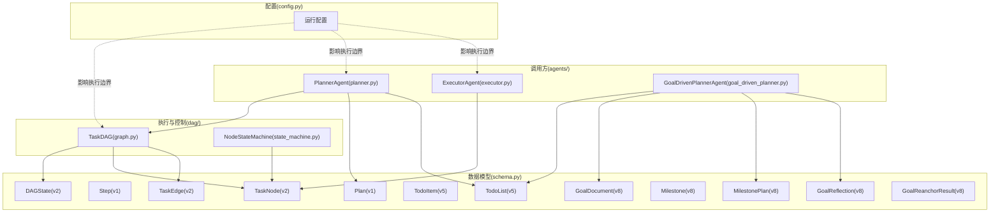
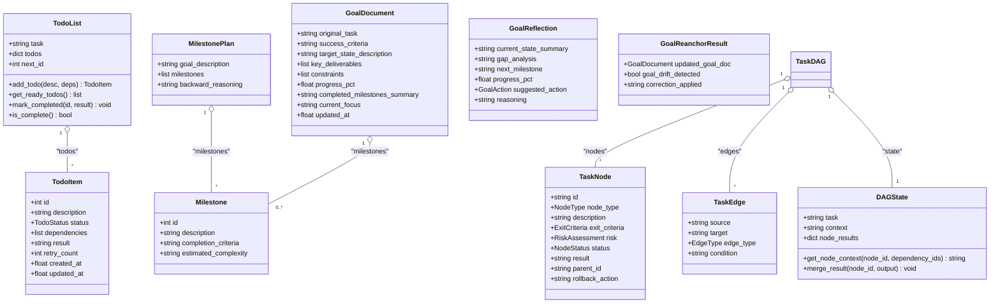
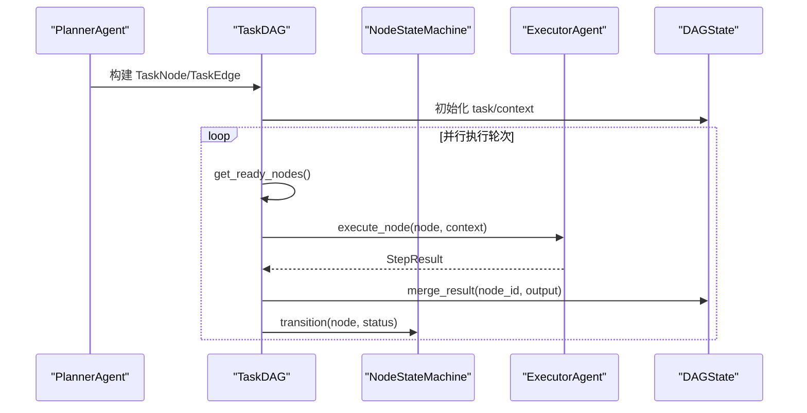
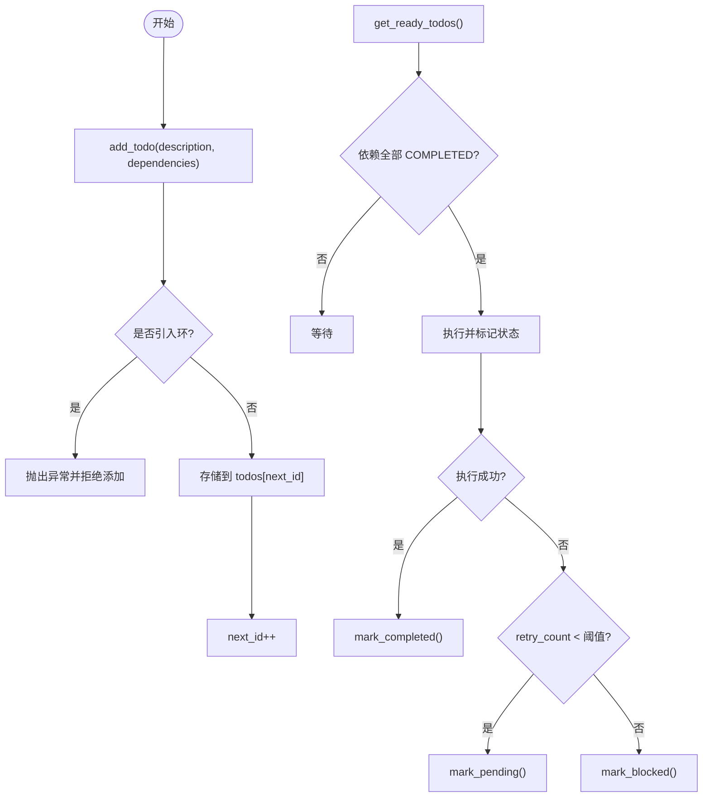
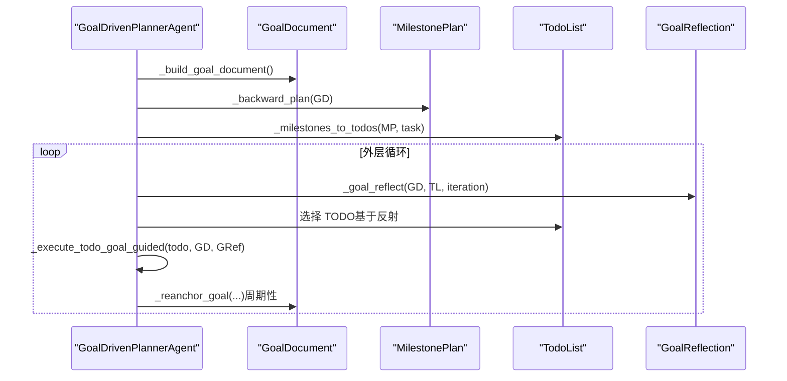
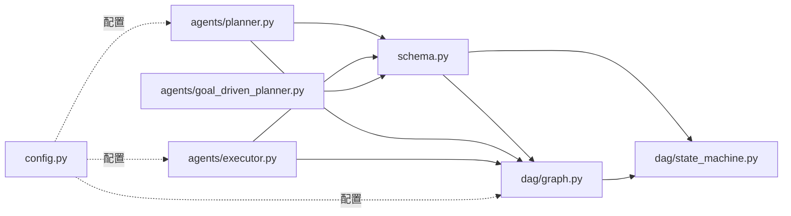

# 数据模型

<cite>
**本文引用的文件**
- [schema.py](file://schema.py)
- [graph.py](file://dag/graph.py)
- [state_machine.py](file://dag/state_machine.py)
- [config.py](file://config.py)
- [test_emergent_simple.py](file://tests/test_emergent_simple.py)
- [test_goal_driven_planner.py](file://tests/test_goal_driven_planner.py)
- [planner.py](file://agents/planner.py)
- [executor.py](file://agents/executor.py)
- [goal_driven_planner.py](file://agents/goal_driven_planner.py)
</cite>

## 目录
1. [简介](#简介)
2. [项目结构](#项目结构)
3. [核心组件](#核心组件)
4. [架构总览](#架构总览)
5. [详细组件分析](#详细组件分析)
6. [依赖分析](#依赖分析)
7. [性能考量](#性能考量)
8. [故障排查指南](#故障排查指南)
9. [结论](#结论)
10. [附录](#附录)

## 简介
本文件为 manus_demo 的数据模型参考文档，聚焦 Pydantic 模型的设计与使用，覆盖 TaskNode、DAGState、Plan、TodoItem、GoalDocument 等核心数据结构。文档逐项说明字段含义、数据类型、取值范围、约束条件与验证规则，并给出模型间的关系图与继承层次，帮助读者快速理解与正确使用这些数据结构。

## 项目结构
与数据模型相关的主要文件分布如下：
- schema.py：定义所有核心数据模型（v2/v3/v5/v8 版本演进）
- dag/graph.py：TaskDAG 图结构与执行控制（围绕 DAGState 与 TaskNode/TaskEdge）
- dag/state_machine.py：节点状态机，强制合法状态转移
- config.py：运行时配置，影响模型使用边界（如最大并行节点、最大迭代次数等）
- agents/planner.py、agents/executor.py、agents/goal_driven_planner.py：模型使用者与调用方
- tests/test_emergent_simple.py、tests/test_goal_driven_planner.py：模型使用示例与行为验证

图表来源
- [schema.py](file://schema.py)
- [graph.py](file://dag/graph.py)
- [state_machine.py](file://dag/state_machine.py)
- [planner.py](file://agents/planner.py)
- [executor.py](file://agents/executor.py)
- [goal_driven_planner.py](file://agents/goal_driven_planner.py)
- [config.py](file://config.py)

章节来源
- [schema.py](file://schema.py)
- [graph.py](file://dag/graph.py)
- [state_machine.py](file://dag/state_machine.py)
- [config.py](file://config.py)

## 核心组件
本节对关键数据模型进行深入解析，涵盖字段定义、类型、取值范围、约束与验证规则，以及典型使用场景。

- TaskNode（v2）
  - 作用：任务 DAG 中的节点，支持三层结构（Goal/SubGoal/Action），其中只有 Action 节点会被执行。
  - 关键字段与约束
    - id: 字符串，唯一标识，形如 goal_1、sub_1、act_1_1
    - node_type: NodeType（GOAL/SUBGOAL/ACTION）
    - description: 节点描述
    - exit_criteria: ExitCriteria，完成判据（见下）
    - risk: RiskAssessment，规划时的风险与置信度元数据
    - status: NodeStatus（PENDING/READY/RUNNING/COMPLETED/FAILED/SKIPPED/ROLLED_BACK）
    - result: 字符串或空，执行结果文本
    - parent_id: 字符串或空，父节点 ID（层级追踪）
    - rollback_action: 字符串或空，失败回滚操作描述
  - 使用场景
    - DAG 规划阶段生成节点
    - 执行阶段由 ExecutorAgent 调用执行 ACTION 节点
    - NodeStateMachine 控制状态转移

- TaskEdge（v2）
  - 作用：任务 DAG 中的有向边，表示节点间依赖关系
  - 关键字段与约束
    - source/target: 节点 ID
    - edge_type: EdgeType（DEPENDENCY/CONDITIONAL/ROLLBACK）
    - condition: 条件边的条件关键词（仅 CONDITIONAL）

- DAGState（v2）
  - 作用：DAG 执行状态的单一真相来源，集中存储 node_results
  - 关键字段与约束
    - task: 原始用户任务
    - context: 背景上下文（来自记忆/知识库）
    - node_results: dict[str, str]，node_id -> 输出文本
  - 方法
    - get_node_context(node_id, dependency_ids): 汇集依赖节点结果，构造节点输入上下文
    - merge_result(node_id, output): 将节点结果写入共享状态（覆盖写入）

- ExitCriteria（v2）
  - 作用：定义节点“完成”的标准，执行后由 Reflector 验证
  - 关键字段与约束
    - description: 人类可读的成功条件
    - validation_prompt: LLM 验证提示词（为空时可回退）
    - required: 是否强制验证（False 时跳过验证）
  - 行为说明
    - required=True 且 validation_prompt 非空：通过 Reflector 进行 LLM 验证
    - required=True 且 validation_prompt 为空：直接以 result.success 为准
    - required=False：跳过验证，始终返回 True

- RiskAssessment（v2）
  - 作用：规划时附加在节点上的风险与置信度元数据
  - 关键字段与约束
    - confidence: 0.0~1.0
    - risk_level: low/medium/high
    - fallback_strategy: 失败时的备选策略

- Plan（v1）
  - 作用：旧版线性执行计划（v1），包含有序步骤列表
  - 关键字段与约束
    - task: 原始用户任务
    - steps: list[Step]，有序步骤列表
    - current_step_index: int，当前执行到的步骤索引

- Step（v1）
  - 作用：旧版线性计划中的单个步骤
  - 关键字段与约束
    - id: int，唯一步骤标识
    - description: 步骤描述
    - dependencies: list[int]，前置步骤 ID 列表
    - status: StepStatus（pending/running/completed/failed/skipped）
    - result: 字符串或空，执行结果

- TodoItem（v5）
  - 作用：隐式规划系统中的单个 TODO 项
  - 关键字段与约束
    - id: int，唯一 TODO 标识
    - description: 待完成描述
    - status: TodoStatus（pending/in_progress/completed/blocked）
    - dependencies: list[int]，前置 TODO ID 列表
    - result: 字符串或空，执行结果
    - retry_count: int，失败后重试次数
    - created_at/updated_at: 时间戳

- TodoList（v5）
  - 作用：集中式 TODO 列表，支持动态增删改与依赖检测
  - 关键字段与约束
    - task: 原始用户任务
    - todos: dict[int, TodoItem]，按 ID 索引
    - next_id: int，下一个可用 TODO ID
  - 方法与约束
    - add_todo(description, dependencies): 新增 TODO，若引入环则抛出异常
    - get_ready_todos(): 依赖全部 COMPLETED 的 TODO
    - mark_completed/mark_in_progress/mark_pending/mark_blocked(): 状态变更
    - is_complete()/has_pending(): 完成状态检查
    - _has_cycle(): 使用 Kahn 算法检测依赖图是否存在环

- GoalDocument（v8）
  - 作用：持久化目标状态，锚定所有规划与执行
  - 关键字段与约束
    - original_task: 用户原始任务
    - success_criteria: 成功标准
    - target_state_description: 目标状态描述
    - key_deliverables/constraints: 预期交付物与约束
    - progress_pct: 预估进度 0~100
    - completed_milestones_summary/current_focus: 已完成工作摘要与当前工作焦点
    - updated_at: 最后更新时间戳

- Milestone/MilestonePlan（v8）
  - 作用：从目标状态逆向规划的里程碑序列
  - 关键字段与约束
    - Milestone: id/description/completion_criteria/estimated_complexity
    - MilestonePlan: goal_description/milestones/backward_reasoning

- GoalReflection（v8）
  - 作用：每次迭代的目标状态对比结果（ReflAct 风格）
  - 关键字段与约束
    - current_state_summary/gap_analysis/next_milestone/progress_pct
    - suggested_action: 枚举（execute_todo/replan/complete）
    - reasoning: 推理依据

- GoalReanchorResult（v8）
  - 作用：周期性目标重锚定结果
  - 关键字段与约束
    - updated_goal_doc: 更新后的目标文档
    - goal_drift_detected/correction_applied

章节来源
- [schema.py](file://schema.py)
- [graph.py](file://dag/graph.py)
- [state_machine.py](file://dag/state_machine.py)
- [test_emergent_simple.py](file://tests/test_emergent_simple.py)
- [test_goal_driven_planner.py](file://tests/test_goal_driven_planner.py)

## 架构总览
下图展示数据模型在系统中的位置与交互关系：

图表来源
- [schema.py](file://schema.py)
- [graph.py](file://dag/graph.py)

## 详细组件分析

### TaskNode 与 TaskEdge：DAG 节点与边
- 设计要点
  - 三层节点类型：GOAL/SUBGOAL/ACTION，ACTION 为可执行叶节点
  - 边类型：DEPENDENCY/CONDITIONAL/ROLLBACK，分别表示依赖、条件与失败回滚
  - ExitCriteria 与 RiskAssessment 为节点级质量门控与风险元数据
- 状态机约束
  - NodeStateMachine 强制合法状态转移，防止进入不一致状态
- 使用流程
  - Planner 生成 TaskNode/TaskEdge，构建 TaskDAG
  - DAGExecutor 通过 DAGState.get_node_context() 为节点构造输入上下文
  - ExecutorAgent.execute_node() 执行 ACTION 节点，结果写入 DAGState.merge_result()

图表来源
- [planner.py](file://agents/planner.py)
- [graph.py](file://dag/graph.py)
- [state_machine.py](file://dag/state_machine.py)
- [executor.py](file://agents/executor.py)
- [schema.py](file://schema.py)

章节来源
- [schema.py](file://schema.py)
- [graph.py](file://dag/graph.py)
- [state_machine.py](file://dag/state_machine.py)
- [executor.py](file://agents/executor.py)

### DAGState：集中式状态
- 设计思想
  - LangGraph 集中式状态模式：每个节点写入自己专属 key，避免并行写入冲突
  - get_node_context() 汇集依赖节点结果，形成“state-in”输入
  - merge_result() 覆盖写入，便于失败重试与结果更新
- 性能与一致性
  - 通过唯一 key 降低冲突，简化 reducer 逻辑
  - 与 NodeStateMachine 协作，确保状态合法

章节来源
- [schema.py](file://schema.py)
- [graph.py](file://dag/graph.py)

### TodoItem/TodoList：隐式规划
- 设计要点
  - 扁平结构，动态创建/更新，集中式管理
  - 使用 Kahn 算法检测依赖环，新增 TODO 前进行环检测
  - 支持状态迁移：PENDING/IN_PROGRESS/COMPLETED/BLOCKED
- 使用流程
  - GoalDrivenPlanner 将里程碑转换为 TodoList
  - 执行器选择就绪 TODO，完成后更新状态
  - 测试脚本验证依赖满足、完成状态与环检测

图表来源
- [schema.py](file://schema.py)
- [test_emergent_simple.py](file://tests/test_emergent_simple.py)

章节来源
- [schema.py](file://schema.py)
- [test_emergent_simple.py](file://tests/test_emergent_simple.py)

### GoalDocument/MilestonePlan/GoalReflection：目标驱动规划
- 设计要点
  - GoalDocument 持久化目标状态，贯穿执行全程
  - MilestonePlan 从目标状态逆向规划里程碑序列
  - GoalReflection 每轮比较当前状态与目标，指导下一步行动
  - GoalReanchorResult 支持周期性目标重锚定与纠偏
- 使用流程
  - GoalDrivenPlanner 构建 GoalDocument，逆向规划 MilestonePlan
  - 每轮执行前进行 GoalReflection，选择 TODO 并执行
  - 定期重锚定目标，必要时修正目标文档

图表来源
- [goal_driven_planner.py](file://agents/goal_driven_planner.py)
- [schema.py](file://schema.py)

章节来源
- [goal_driven_planner.py](file://agents/goal_driven_planner.py)
- [test_goal_driven_planner.py](file://tests/test_goal_driven_planner.py)

## 依赖分析
- 模型耦合与内聚
  - TaskNode/TaskEdge/DAGState 高内聚，共同构成 TaskDAG 的数据骨架
  - TodoItem/TodoList 与 GoalDocument/MilestonePlan/GoalReflection 互补，分别服务于隐式规划与目标驱动规划
- 外部依赖
  - NodeStateMachine 为 TaskNode 状态转移提供强约束
  - 配置模块 config.py 影响执行边界（如最大并行节点、最大迭代次数、目标驱动开关等）
- 潜在循环依赖
  - 模型间无直接循环导入；调用关系清晰（agents -> schema -> dag）

图表来源
- [schema.py](file://schema.py)
- [graph.py](file://dag/graph.py)
- [state_machine.py](file://dag/state_machine.py)
- [planner.py](file://agents/planner.py)
- [executor.py](file://agents/executor.py)
- [goal_driven_planner.py](file://agents/goal_driven_planner.py)
- [config.py](file://config.py)

章节来源
- [schema.py](file://schema.py)
- [graph.py](file://dag/graph.py)
- [state_machine.py](file://dag/state_machine.py)
- [planner.py](file://agents/planner.py)
- [executor.py](file://agents/executor.py)
- [goal_driven_planner.py](file://agents/goal_driven_planner.py)
- [config.py](file://config.py)

## 性能考量
- DAGState 的覆盖写入避免了复杂 reducer，降低冲突与开销
- TaskDAG 预构建依赖邻接表，加速 get_ready_nodes/topological_sort
- TodoList 的 Kahn 环检测在新增 TODO 时执行，避免运行期频繁检测
- 配置项 MAX_PARALLEL_NODES、MAX_REACT_ITERATIONS、MAX_CHECKPOINTS 等直接影响吞吐与稳定性

## 故障排查指南
- DAG 状态异常
  - 现象：节点状态无法推进或进入死锁
  - 排查：确认 NodeStateMachine.can_transition() 是否允许该转移；检查 TaskDAG.refresh_ready_states()/mark_subtree_skipped() 调用时机
- DAG 环检测失败
  - 现象：添加边/节点时报环错误
  - 排查：使用 DAG.topological_sort() 检查拓扑排序完整性；确认依赖方向与边类型
- TodoList 依赖环
  - 现象：add_todo 抛出异常
  - 排查：检查 dependencies 是否指向不存在的 ID；确认 Kahn 算法检测逻辑
- 目标驱动规划停滞
  - 现象：多轮无进展提前终止
  - 排查：检查 GOAL_DRIVEN_STAGNATION_WINDOW 与 _should_reanchor() 逻辑；确认 GoalReanchorResult 的纠偏是否生效

章节来源
- [state_machine.py](file://dag/state_machine.py)
- [graph.py](file://dag/graph.py)
- [schema.py](file://schema.py)
- [test_goal_driven_planner.py](file://tests/test_goal_driven_planner.py)

## 结论
本文梳理了 manus_demo 的核心数据模型，明确了各模型的字段、类型、约束与使用场景，并通过关系图与流程图展示了它们在系统中的协作方式。遵循本文的约束与最佳实践，可在保证正确性的同时获得更好的可维护性与性能表现。

## 附录
- 版本演进与向后兼容
  - v2：引入 DAG 规划模型（TaskNode/TaskEdge/DAGState），借鉴 LangGraph 集中式状态模式
  - v3：引入自适应规划（PlanAdaptation/AdaptationResult），支持执行中动态调整
  - v5：引入隐式规划（TodoItem/TodoList），支持探索性任务
  - v8：引入目标驱动规划（GoalDocument/MilestonePlan/GoalReflection），强调“以终为始”
  - 向后兼容：旧版 Plan/Step 仍可用于简单任务；通过配置开关控制新旧路径选择

章节来源
- [schema.py](file://schema.py)
- [config.py](file://config.py)