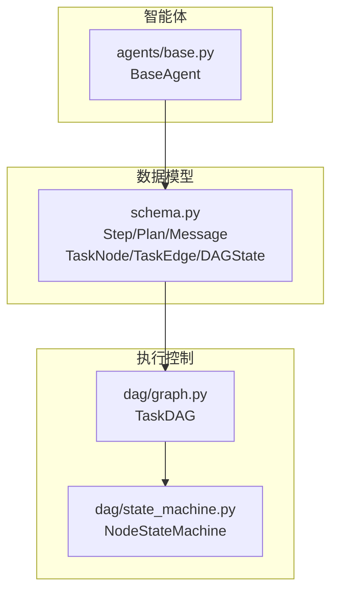
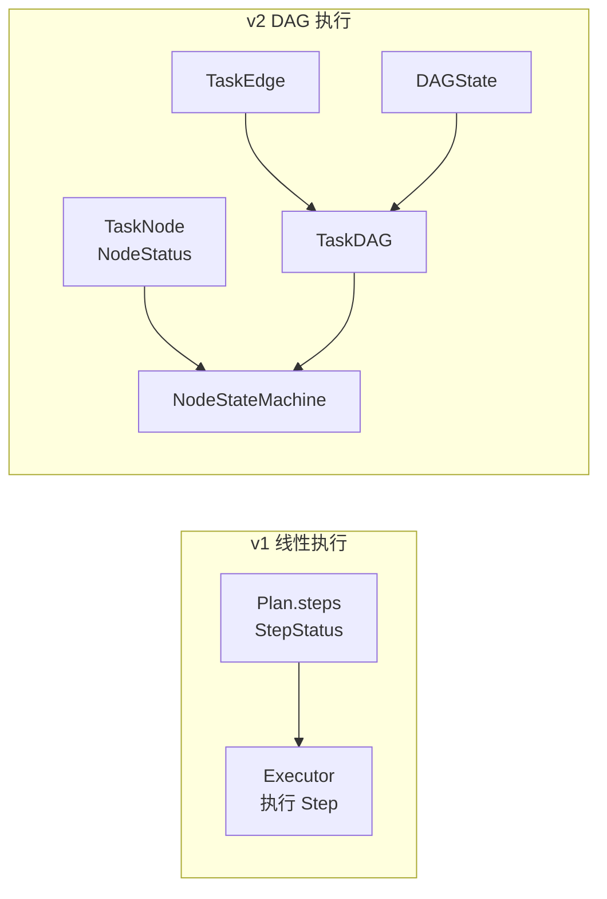
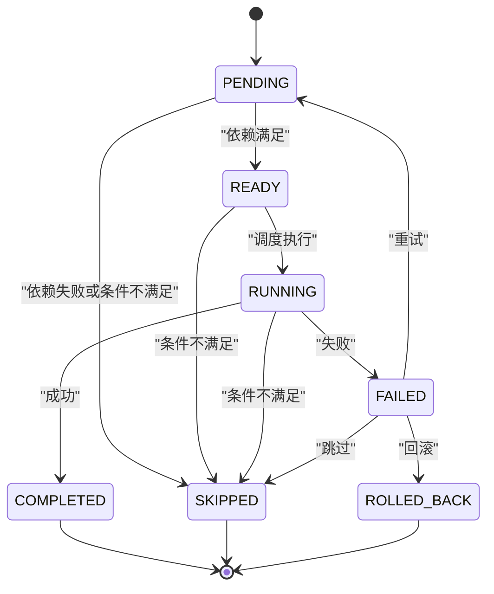
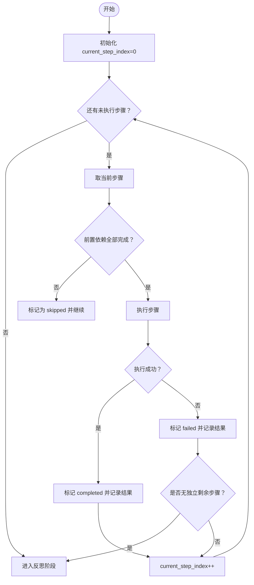
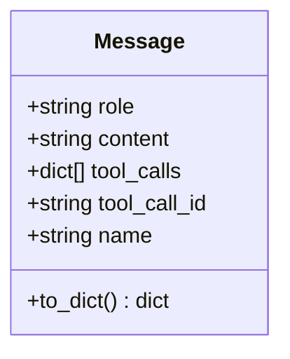
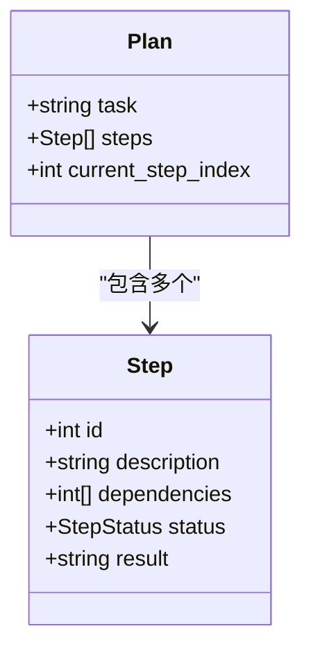
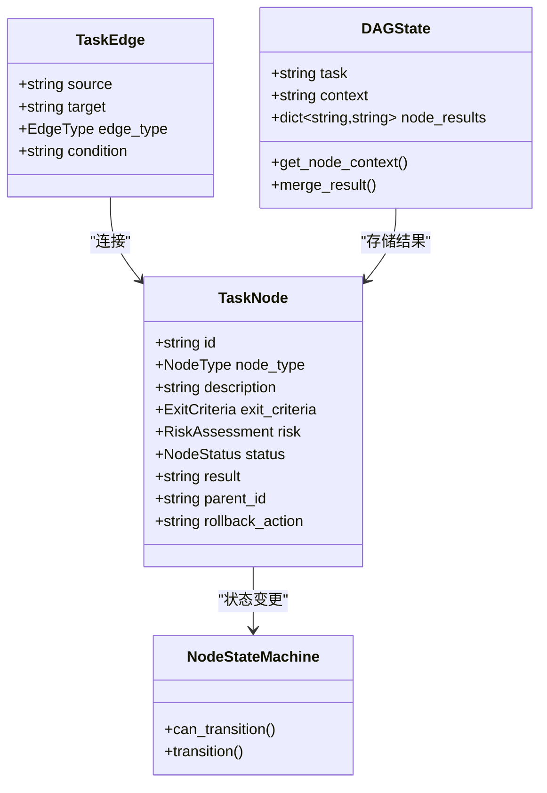
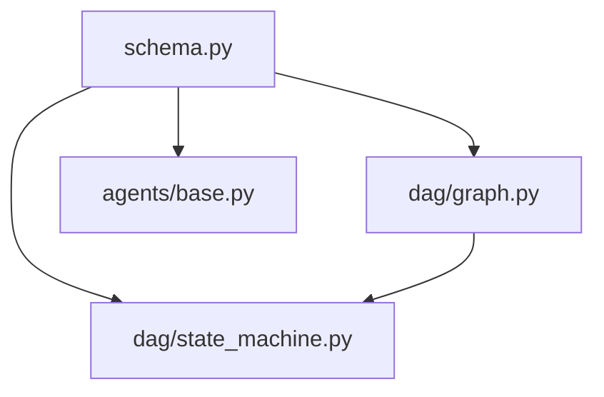

# 核心数据模型

<cite>
**本文档引用的文件**
- [schema.py](file://schema.py)
- [graph.py](file://dag/graph.py)
- [state_machine.py](file://dag/state_machine.py)
- [base.py](file://agents/base.py)
</cite>

## 目录
1. [简介](#简介)
2. [项目结构](#项目结构)
3. [核心组件](#核心组件)
4. [架构总览](#架构总览)
5. [详细组件分析](#详细组件分析)
6. [依赖关系分析](#依赖关系分析)
7. [性能考量](#性能考量)
8. [故障排查指南](#故障排查指南)
9. [结论](#结论)

## 简介
本文件聚焦 manus_demo 的核心数据模型，特别是 v1 版本的基础数据结构：Step、Plan、Message，以及它们在系统中的职责、字段定义、验证规则与使用场景。同时，文档还解释了 StepStatus 枚举的状态转换逻辑、Plan 的线性执行流程，以及 Message 的 OpenAI 兼容格式。最后，提供实际的代码示例路径，帮助读者快速上手创建与使用这些模型。

## 项目结构
围绕核心数据模型的关键文件与模块如下：
- schema.py：定义 v1 的 Step、Plan、Message，以及 v2 的 TaskNode、TaskEdge、DAGState、NodeStatus 等模型
- dag/graph.py：TaskDAG 图结构与执行控制逻辑，包含拓扑排序、就绪节点发现、动态图变更等
- dag/state_machine.py：节点状态机，强制合法状态转移
- agents/base.py：智能体基类，演示如何使用 Message 与 LLM 交互

图表来源
- [schema.py:47-67](file://schema.py#L47-L67)
- [graph.py:43-81](file://dag/graph.py#L43-L81)
- [state_machine.py:55-114](file://dag/state_machine.py#L55-L114)
- [base.py:29-183](file://agents/base.py#L29-L183)

章节来源
- [schema.py:1-702](file://schema.py#L1-L702)
- [graph.py:1-627](file://dag/graph.py#L1-L627)
- [state_machine.py:1-114](file://dag/state_machine.py#L1-L114)
- [base.py:1-183](file://agents/base.py#L1-L183)

## 核心组件
本节概述 v1 基础模型与 v2 扩展模型的关键字段、类型与用途。

- StepStatus（v1）
  - 枚举值：pending、running、completed、failed、skipped
  - 语义：表示线性计划中单步的生命周期状态
  - 适用：v1 的 Plan.steps 中的每个 Step

- Step（v1）
  - 字段
    - id: int（唯一步骤标识）
    - description: str（步骤目标描述）
    - dependencies: list[int]（前置步骤 ID 列表）
    - status: StepStatus（默认 pending）
    - result: str | None（执行结果）
  - 适用：v1 的 Plan.steps 列表

- Plan（v1）
  - 字段
    - task: str（原始用户任务）
    - steps: list[Step]（有序步骤列表）
    - current_step_index: int（当前执行到的步骤索引）
  - 适用：v1 的线性执行流程

- Message（OpenAI 兼容）
  - 字段
    - role: str（system、user、assistant、tool）
    - content: str（消息内容）
    - tool_calls: list[dict] | None（工具调用列表，assistant 专用）
    - tool_call_id: str | None（工具调用 ID，tool 专用）
    - name: str | None（工具名称，tool 专用）
  - 方法
    - to_dict()：导出为 OpenAI 兼容字典

章节来源
- [schema.py:35-45](file://schema.py#L35-L45)
- [schema.py:47-57](file://schema.py#L47-L57)
- [schema.py:59-67](file://schema.py#L59-L67)
- [schema.py:678-701](file://schema.py#L678-L701)

## 架构总览
v1 的线性执行路径与 v2 的 DAG 执行路径在数据模型层面的对应关系如下：

图表来源
- [schema.py:47-67](file://schema.py#L47-L67)
- [schema.py:157-176](file://schema.py#L157-L176)
- [schema.py:178-187](file://schema.py#L178-L187)
- [schema.py:192-253](file://schema.py#L192-L253)
- [graph.py:43-81](file://dag/graph.py#L43-L81)
- [state_machine.py:55-114](file://dag/state_machine.py#L55-L114)

## 详细组件分析

### StepStatus 状态转换逻辑（v1）
- 状态集合：pending、running、completed、failed、skipped
- 转移特点
  - 仅允许从当前状态转移到合法目标集合
  - 通过 NodeStateMachine（v2）或直接赋值（v1）进行状态变更
- 关键点
  - v1 的 Step.status 是普通枚举字段，代码可直接赋值
  - v2 引入 NodeStateMachine，强制合法转移，防止不一致状态

图表来源
- [state_machine.py:42-52](file://dag/state_machine.py#L42-L52)
- [state_machine.py:88-102](file://dag/state_machine.py#L88-L102)

章节来源
- [schema.py:35-45](file://schema.py#L35-L45)
- [state_machine.py:38-52](file://dag/state_machine.py#L38-L52)
- [state_machine.py:88-102](file://dag/state_machine.py#L88-L102)

### Plan 的线性执行流程（v1）
- 数据结构
  - Plan.task：原始任务
  - Plan.steps：有序 Step 列表
  - Plan.current_step_index：当前执行索引
- 执行流程
  - 从 current_step_index 开始，按序遍历 steps
  - 每个 Step 依赖其 dependencies 指向的前置步骤先完成
  - 执行成功则标记 Step.status 为 completed，失败则为 failed
  - 若出现无法独立继续的失败步骤，可提前结束并进入反思阶段

图表来源
- [schema.py:59-67](file://schema.py#L59-L67)
- [orchestrator.py:303-330](file://agents/orchestrator.py#L303-L330)

章节来源
- [schema.py:59-67](file://schema.py#L59-L67)
- [orchestrator.py:303-330](file://agents/orchestrator.py#L303-L330)

### Message 的 OpenAI 兼容格式（v1）
- 字段
  - role: str（system、user、assistant、tool）
  - content: str
  - tool_calls: list[dict] | None（assistant 专用）
  - tool_call_id: str | None（tool 专用）
  - name: str | None（tool 专用）
- 方法
  - to_dict()：导出为 OpenAI 兼容字典，便于与 LLM 客户端交互
- 使用场景
  - BaseAgent 的 think/think_json/think_with_tools 等方法中，将消息历史与工具调用封装为 OpenAI 兼容格式

图表来源
- [schema.py:678-701](file://schema.py#L678-L701)

章节来源
- [schema.py:678-701](file://schema.py#L678-L701)
- [base.py:60-105](file://agents/base.py#L60-L105)
- [base.py:107-121](file://agents/base.py#L107-L121)
- [base.py:123-168](file://agents/base.py#L123-L168)

### Step 与 Plan 的关系与继承层次
- Step 与 Plan 的关系
  - Plan.steps 是 Step 的有序列表
  - Step.dependencies 指向其他 Step.id，形成 v1 的线性依赖图
- 继承层次
  - v1：Step/Plan/Message 为独立 Pydantic 模型
  - v2：TaskNode/TaskEdge/DAGState 作为 DAG 执行的替代方案，提供更丰富的状态与边类型

图表来源
- [schema.py:47-57](file://schema.py#L47-L57)
- [schema.py:59-67](file://schema.py#L59-L67)

章节来源
- [schema.py:47-67](file://schema.py#L47-L67)

### DAG 模型（v2）与 v1 的对比
- TaskNode/TaskEdge/DAGState
  - TaskNode：包含节点类型、完成判据、风险评估、状态、结果、父子关系等
  - TaskEdge：包含依赖、条件、回滚等边类型
  - DAGState：集中式状态，聚合各节点结果
- NodeStateMachine
  - 强制合法状态转移，防止不一致状态
- 与 v1 的差异
  - v1：线性步骤与简单状态；v2：分层节点、条件边、回滚边、集中式状态与状态机

图表来源
- [schema.py:157-176](file://schema.py#L157-L176)
- [schema.py:178-187](file://schema.py#L178-L187)
- [schema.py:192-253](file://schema.py#L192-L253)
- [state_machine.py:55-114](file://dag/state_machine.py#L55-L114)

章节来源
- [schema.py:157-253](file://schema.py#L157-L253)
- [state_machine.py:55-114](file://dag/state_machine.py#L55-L114)

## 依赖关系分析
- schema.py 为核心数据模型定义处，被 dag/graph.py 与 agents/base.py 使用
- dag/graph.py 依赖 schema 中的 TaskNode、TaskEdge、DAGState、NodeStatus、EdgeType 等
- dag/state_machine.py 依赖 schema 中的 NodeStatus，并为 TaskNode 提供状态机
- agents/base.py 依赖 schema 中的 Message，用于与 LLM 客户端交互

图表来源
- [schema.py:1-702](file://schema.py#L1-L702)
- [graph.py:38-81](file://dag/graph.py#L38-L81)
- [state_machine.py:25-79](file://dag/state_machine.py#L25-L79)
- [base.py:23-50](file://agents/base.py#L23-L50)

章节来源
- [schema.py:1-702](file://schema.py#L1-L702)
- [graph.py:1-627](file://dag/graph.py#L1-L627)
- [state_machine.py:1-114](file://dag/state_machine.py#L1-L114)
- [base.py:1-183](file://agents/base.py#L1-L183)

## 性能考量
- v1 线性执行
  - 时间复杂度：O(N)，N 为步骤数
  - 优点：简单直观，易于调试
  - 缺点：缺乏并行与条件分支能力
- v2 DAG 执行
  - 就绪节点发现：通过预构建邻接表，降低查找成本
  - 拓扑排序：O(V+E)，保证合法执行顺序
  - 动态图变更：添加/删除节点与边时进行环检测，避免无效变更
  - 集中式状态：简化并行写入，避免冲突

章节来源
- [graph.py:101-127](file://dag/graph.py#L101-L127)
- [graph.py:219-249](file://dag/graph.py#L219-L249)
- [graph.py:341-400](file://dag/graph.py#L341-L400)
- [graph.py:549-578](file://dag/graph.py#L549-L578)

## 故障排查指南
- v1 线性执行常见问题
  - 步骤依赖未满足导致 stuck：检查 Plan.steps 中 Step.dependencies 是否正确
  - 执行失败后无法继续：确认 Orchestrator 是否提前结束并进入反思
- v2 DAG 常见问题
  - 状态转移异常：NodeStateMachine 会在非法转移时抛出异常，检查状态转移表
  - 环检测失败：动态添加边时若引入环，会被拒绝并回滚
  - 节点被跳过：检查条件边与失败回滚逻辑，确认下游节点是否被级联跳过

章节来源
- [state_machine.py:88-102](file://dag/state_machine.py#L88-L102)
- [graph.py:385-396](file://dag/graph.py#L385-L396)
- [graph.py:184-198](file://dag/graph.py#L184-L198)

## 结论
- v1 的 Step/Plan/Message 提供了简洁清晰的线性执行模型，适用于简单任务
- v2 的 TaskNode/TaskEdge/DAGState/NodeStateMachine 提供了更强的表达力与执行控制，适合复杂任务与并行/条件/回滚场景
- 通过明确的数据模型与状态机约束，系统在保证一致性的同时提升了可扩展性与可维护性