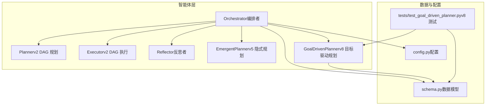
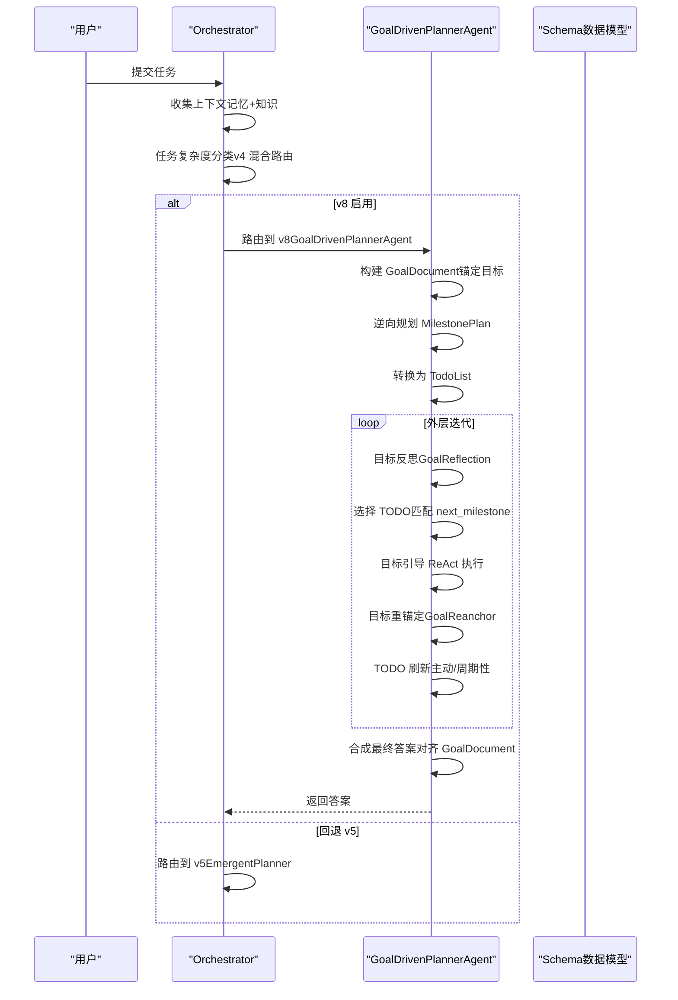
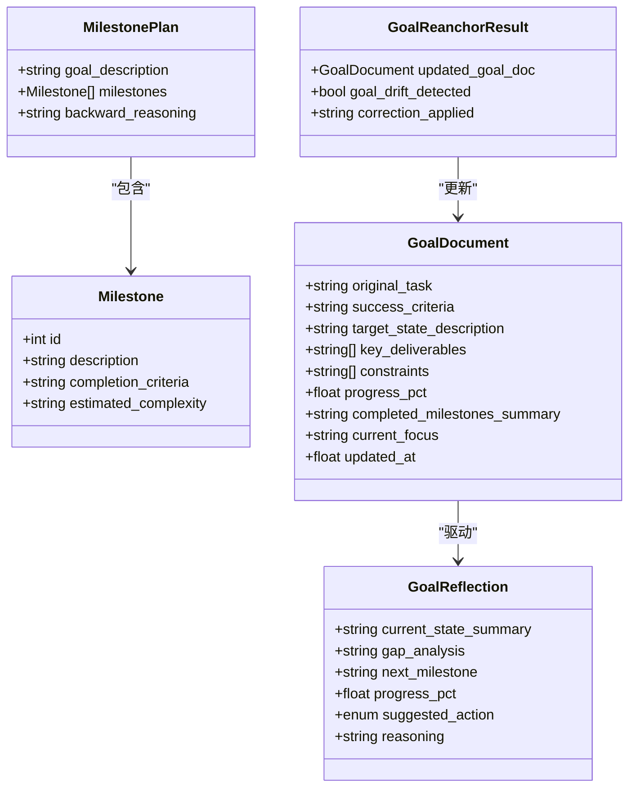
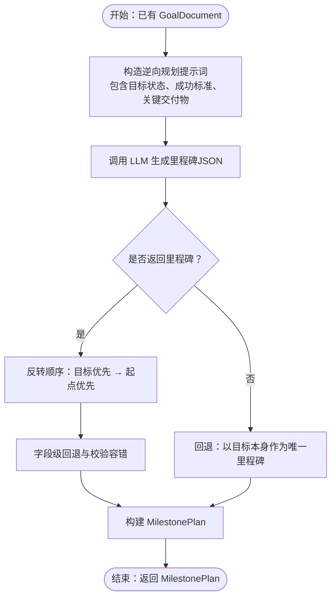
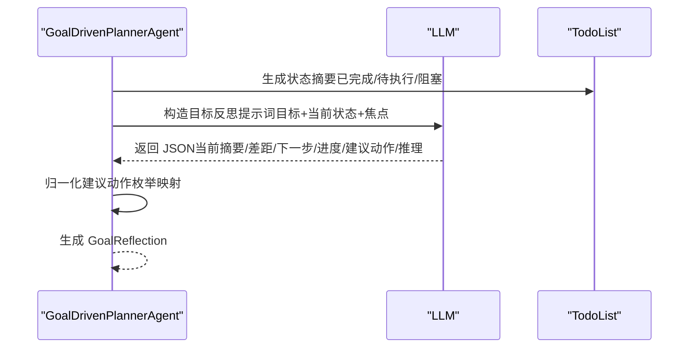
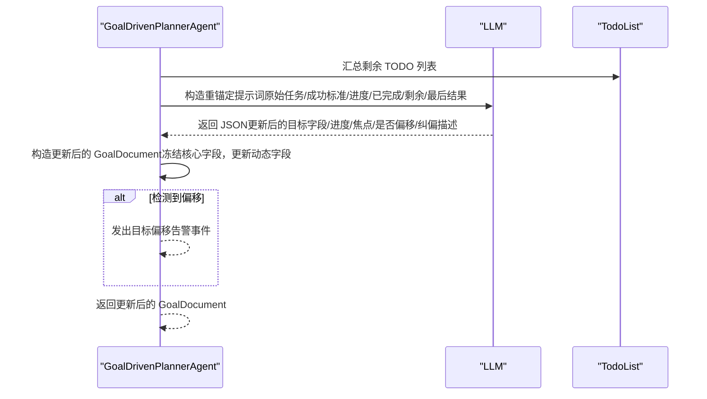
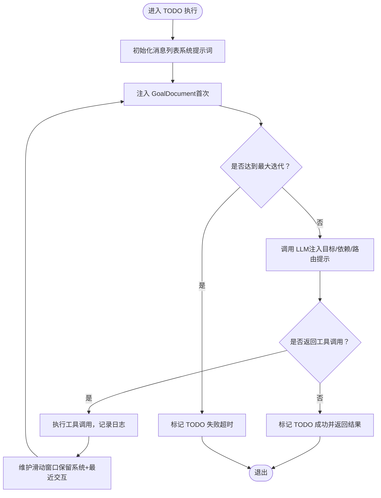
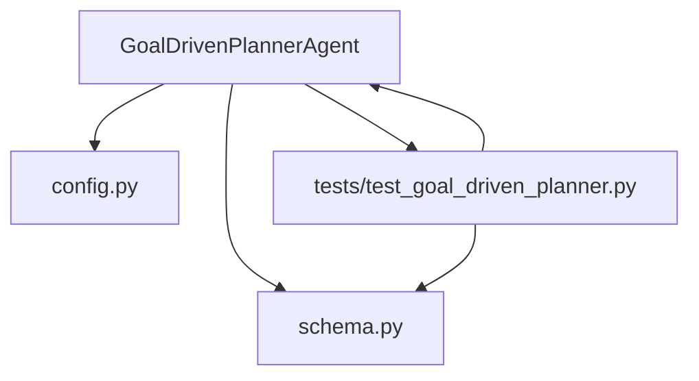

# 目标驱动规划模型

<cite>
**本文引用的文件**
- [agents/goal_driven_planner.py](file://agents/goal_driven_planner.py)
- [schema.py](file://schema.py)
- [config.py](file://config.py)
- [tests/test_goal_driven_planner.py](file://tests/test_goal_driven_planner.py)
- [README.md](file://README.md)
- [README_CN.md](file://README_CN.md)
- [tracing/bridge.py](file://tracing/bridge.py)
</cite>

## 目录
1. [简介](#简介)
2. [项目结构](#项目结构)
3. [核心组件](#核心组件)
4. [架构概览](#架构概览)
5. [详细组件分析](#详细组件分析)
6. [依赖分析](#依赖分析)
7. [性能考虑](#性能考虑)
8. [故障排查指南](#故障排查指南)
9. [结论](#结论)
10. [附录](#附录)

## 简介
本文件系统化阐述 manus_demo v8 版本的目标驱动规划模型，围绕「以终为始」的逆向规划理念，详细说明 Milestone、MilestonePlan、GoalDocument、GoalReflection 等核心数据模型，以及 GoalReanchorResult 的目标重锚定机制。文档还涵盖目标反思的周期性对比机制、里程碑规划的逆向思维、GoalDocument 的持久化目标状态管理、以及目标驱动规划的完整工作流程（里程碑分解、进度跟踪与目标对齐）。

## 项目结构
manus_demo 是一个多智能体系统，支持混合规划路由（v4）：简单任务走 v1 扁平计划，复杂任务走 v2 DAG 并行执行，探索性任务走 v5 隐式规划（TODO 列表）。v8 目标驱动规划（Goal-Driven Planner）作为可选路径，提供以终为始的逆向规划与目标对齐能力，通过配置开关启用。

**图表来源**
- [README.md:22-76](file://README.md#L22-L76)
- [README_CN.md:37-98](file://README_CN.md#L37-L98)

**章节来源**
- [README.md:22-76](file://README.md#L22-L76)
- [README_CN.md:37-98](file://README_CN.md#L37-L98)

## 核心组件
- GoalDrivenPlannerAgent：实现 v8 目标驱动规划的核心智能体，包含目标锚定、逆向里程碑规划、目标反思、目标重锚定、TODO 刷新与最终答案合成等能力。
- 数据模型（schema.py）：GoalDocument、Milestone、MilestonePlan、GoalReflection、GoalReanchorResult 等，支撑 v8 的目标状态管理与反思机制。
- 配置（config.py）：v8 相关开关与参数（如 ENABLE_GOAL_DRIVEN_PLANNER、GOAL_REANCHOR_INTERVAL、GOAL_REFLECTION_INTERVAL 等）。
- 测试（tests/test_goal_driven_planner.py）：覆盖 v8 数据模型、核心流程与事件发射的单元测试。

**章节来源**
- [agents/goal_driven_planner.py:214-400](file://agents/goal_driven_planner.py#L214-L400)
- [schema.py:570-656](file://schema.py#L570-L656)
- [config.py:90-97](file://config.py#L90-L97)
- [tests/test_goal_driven_planner.py:177-487](file://tests/test_goal_driven_planner.py#L177-L487)

## 架构概览
v8 目标驱动规划在 Orchestrator 的混合路由中作为可选路径。当 ENABLE_GOAL_DRIVEN_PLANNER 为真时，Orchestrator 将任务交由 GoalDrivenPlannerAgent 执行；否则回退到 v5 隐式规划路径。

**图表来源**
- [agents/goal_driven_planner.py:261-399](file://agents/goal_driven_planner.py#L261-L399)
- [agents/orchestrator.py:130-141](file://agents/orchestrator.py#L130-L141)
- [config.py:90-97](file://config.py#L90-L97)

**章节来源**
- [agents/orchestrator.py:130-141](file://agents/orchestrator.py#L130-L141)
- [config.py:90-97](file://config.py#L90-L97)

## 详细组件分析

### 数据模型：Milestone、MilestonePlan、GoalDocument、GoalReflection、GoalReanchorResult
- Milestone：里程碑节点，包含描述、完成判定条件与预估复杂度。
- MilestonePlan：逆向规划得到的里程碑序列，包含目标状态描述、里程碑列表与逆向推理依据。
- GoalDocument：持久化目标状态，包含原始任务、成功标准、目标状态描述、关键交付物、约束、进度百分比、已完成里程碑摘要、当前工作焦点等。
- GoalReflection：每次迭代的目标状态对比结果，包含当前完成情况摘要、差距分析、下一步里程碑、进度百分比、建议动作（执行/重规划/完成）与推理依据。
- GoalReanchorResult：周期性目标重锚定结果，包含更新后的 GoalDocument、是否检测到目标偏移、纠偏描述。

**图表来源**
- [schema.py:575-656](file://schema.py#L575-L656)

**章节来源**
- [schema.py:575-656](file://schema.py#L575-L656)

### 逆向里程碑规划（Backward Planning）
- GoalDrivenPlannerAgent 通过 _backward_plan 从目标状态出发，反向生成里程碑序列。LLM 返回的里程碑按「目标优先」顺序，随后转换为「起点优先」的执行顺序。
- 若 LLM 未返回里程碑，则回退为单一里程碑（目标本身）。

**图表来源**
- [agents/goal_driven_planner.py:425-464](file://agents/goal_driven_planner.py#L425-L464)

**章节来源**
- [agents/goal_driven_planner.py:425-464](file://agents/goal_driven_planner.py#L425-L464)

### 目标反思（Goal Reflection）与周期性对比
- 每次迭代前（或按反射间隔），GoalDrivenPlannerAgent 通过 _goal_reflect 对比当前状态与目标文档，生成 GoalReflection。
- 反射结果包含：当前完成摘要、差距分析、下一步里程碑、进度百分比、建议动作（执行/重规划/完成）与推理依据。
- 建议动作经枚举归一化，避免 LLM 输出变体导致的逻辑分支失效。

**图表来源**
- [agents/goal_driven_planner.py:486-524](file://agents/goal_driven_planner.py#L486-L524)

**章节来源**
- [agents/goal_driven_planner.py:486-524](file://agents/goal_driven_planner.py#L486-L524)

### 目标重锚定（Goal Reanchor）与目标偏移检测
- GoalReanchorResult 用于周期性地重新评估目标文档，结合执行进度、已完成里程碑、剩余 TODO 与最后结果，决定是否检测到目标偏移并应用纠偏。
- 重锚定过程会更新动态字段（进度百分比、已完成摘要、当前焦点），并发出目标偏移告警事件（如存在偏移）。

**图表来源**
- [agents/goal_driven_planner.py:759-802](file://agents/goal_driven_planner.py#L759-L802)
- [tracing/bridge.py:709-739](file://tracing/bridge.py#L709-L739)

**章节来源**
- [agents/goal_driven_planner.py:759-802](file://agents/goal_driven_planner.py#L759-L802)
- [tracing/bridge.py:709-739](file://tracing/bridge.py#L709-L739)

### 目标引导的 ReAct 执行循环
- 每个 TODO 在目标引导的有界 ReAct 循环中执行，系统提示词注入目标文档，确保每次思考都对照目标状态。
- 循环维护消息滑动窗口，保留系统消息与最近约 20 条交互，确保上下文有限且可控。
- 支持工具路由提示注入，连续失败时给出替代工具建议。

**图表来源**
- [agents/goal_driven_planner.py:575-752](file://agents/goal_driven_planner.py#L575-L752)

**章节来源**
- [agents/goal_driven_planner.py:575-752](file://agents/goal_driven_planner.py#L575-L752)

### TODO 刷新与停滞检测
- TODO 刷新策略：失败时主动刷新、反射建议重规划时刷新、或按周期性阈值刷新。
- 停滞检测：连续若干轮未观察到已完成 TODO 数量增长时提前终止，避免无效循环。

**章节来源**
- [agents/goal_driven_planner.py:304-329](file://agents/goal_driven_planner.py#L304-L329)
- [agents/goal_driven_planner.py:390-394](file://agents/goal_driven_planner.py#L390-L394)

### 完整工作流程（里程碑分解、进度跟踪与目标对齐）
- 构建目标文档：定义「完成」标准、目标状态、关键交付物与约束。
- 逆向规划里程碑：从目标状态反推前置条件，形成执行顺序。
- 转换为 TODO 列表：按里程碑顺序建立有依赖的 TODO。
- 目标驱动执行循环：周期性目标反思 → 选择 TODO → 目标引导 ReAct → 目标重锚定 → TODO 刷新。
- 合成最终答案：基于已完成结果与目标文档进行综合输出。

**章节来源**
- [agents/goal_driven_planner.py:261-399](file://agents/goal_driven_planner.py#L261-L399)

## 依赖分析
- GoalDrivenPlannerAgent 依赖 schema.py 中的数据模型（GoalDocument、Milestone、MilestonePlan、GoalReflection、GoalReanchorResult）与工具路由（ToolRouter）。
- 配置模块 config.py 提供 v8 开关与参数（如 GOAL_REANCHOR_INTERVAL、GOAL_REFLECTION_INTERVAL、GOAL_DRIVEN_STAGNATION_WINDOW 等）。
- 测试模块 tests/test_goal_driven_planner.py 验证 v8 数据模型、核心流程与事件发射。

**图表来源**
- [agents/goal_driven_planner.py:214-400](file://agents/goal_driven_planner.py#L214-L400)
- [schema.py:570-656](file://schema.py#L570-L656)
- [config.py:90-97](file://config.py#L90-L97)
- [tests/test_goal_driven_planner.py:177-487](file://tests/test_goal_driven_planner.py#L177-L487)

**章节来源**
- [agents/goal_driven_planner.py:214-400](file://agents/goal_driven_planner.py#L214-L400)
- [schema.py:570-656](file://schema.py#L570-L656)
- [config.py:90-97](file://config.py#L90-L97)
- [tests/test_goal_driven_planner.py:177-487](file://tests/test_goal_driven_planner.py#L177-L487)

## 性能考虑
- 有界消息上下文：ReAct 循环维护滑动窗口，避免历史无限累积导致的上下文膨胀。
- 工具路由提示：在连续失败时注入替代工具建议，减少无效重试与上下文浪费。
- 停滞检测：在无进展窗口期内提前终止，避免长流程陷入无效循环。
- 配置化参数：通过 config.py 控制最大迭代、重锚定间隔、反思间隔等，平衡稳定性与响应速度。

## 故障排查指南
- 目标偏移告警：当检测到目标偏移时，系统会发出告警事件（如 goal_drift_alert），可在追踪桥（TracingBridge）中查看详细属性（纠偏建议、原始/建议标准等）。
- 事件发射：v8 执行期间会发射多种事件（如 goal_anchor、todo_list_initialized、goal_reflection、todo_start、todo_complete 等），可用于调试与可视化。
- LLM 输出解析：若 LLM 返回格式异常，相关流程会降级处理并记录警告，必要时触发重规划或回退。

**章节来源**
- [tracing/bridge.py:709-739](file://tracing/bridge.py#L709-L739)
- [tests/test_goal_driven_planner.py:597-699](file://tests/test_goal_driven_planner.py#L597-L699)

## 结论
v8 目标驱动规划模型以「以终为始」为核心理念，通过 GoalDocument 的持久化锚定、MilestonePlan 的逆向规划、GoalReflection 的周期性目标对比、GoalReanchorResult 的目标重锚定与纠偏，实现了长流程任务中的目标一致性与稳健性。配合有界 ReAct 执行循环、工具路由提示与停滞检测，v8 在复杂探索性任务中提供了更强的目标对齐能力与鲁棒性。通过配置开关与测试覆盖，v8 可平滑集成到现有混合路由体系中。

## 附录
- 配置项参考：v8 相关配置包括 ENABLE_GOAL_DRIVEN_PLANNER、GOAL_REANCHOR_INTERVAL、GOAL_REFLECTION_INTERVAL、MAX_GOAL_DRIVEN_ITERATIONS、GOAL_DRIVEN_STAGNATION_WINDOW 等。
- 测试覆盖：v8 数据模型、核心流程（构建目标、逆向规划、目标反思、重锚定、TODO 刷新、事件发射）均有单元测试保障。

**章节来源**
- [config.py:90-97](file://config.py#L90-L97)
- [tests/test_goal_driven_planner.py:177-487](file://tests/test_goal_driven_planner.py#L177-L487)