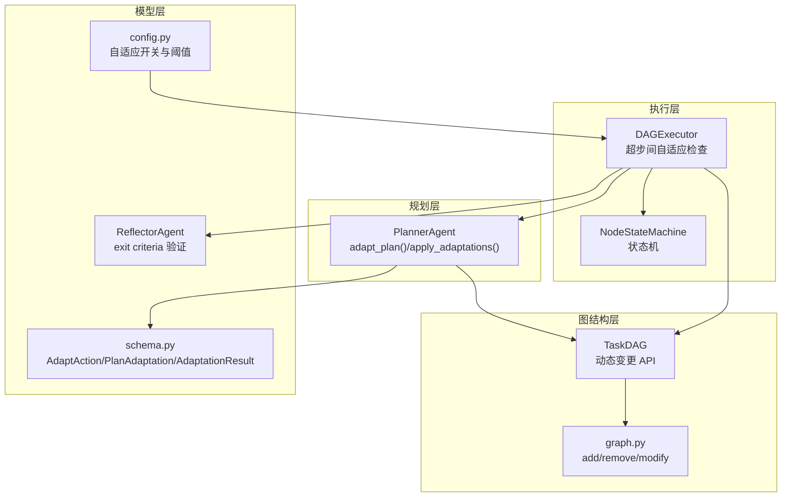
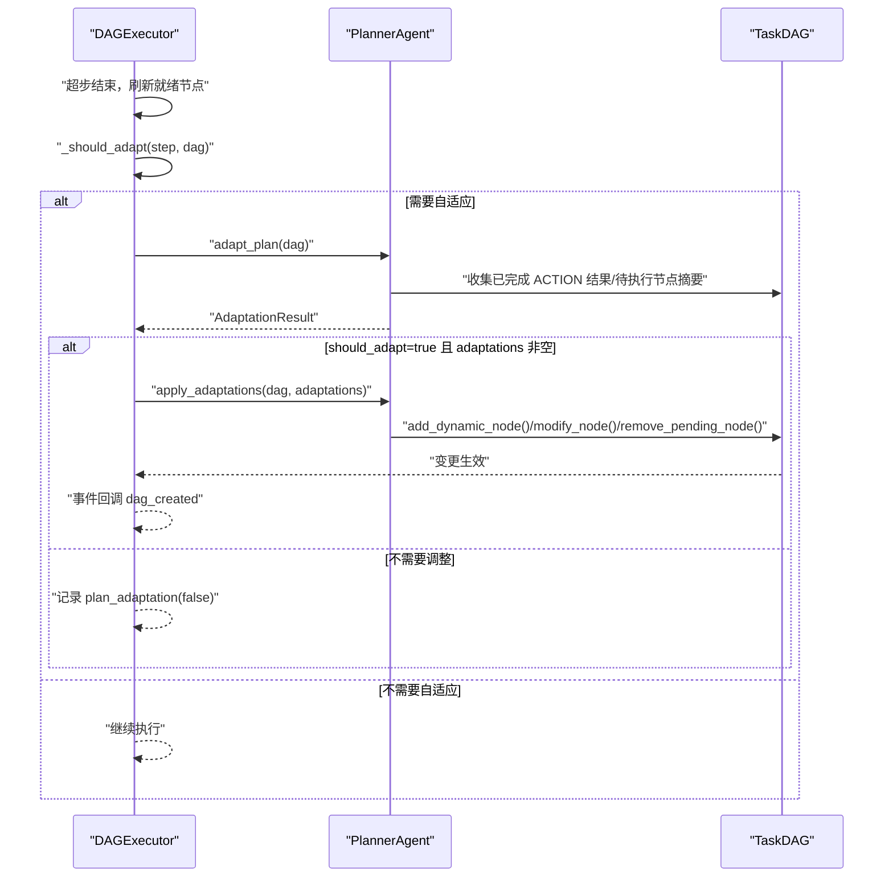
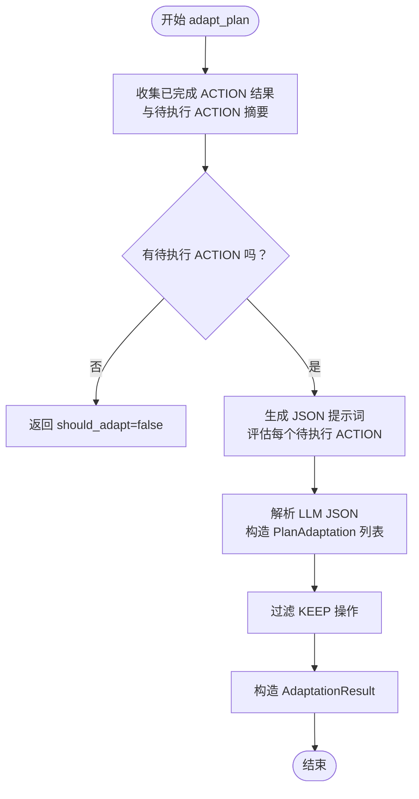
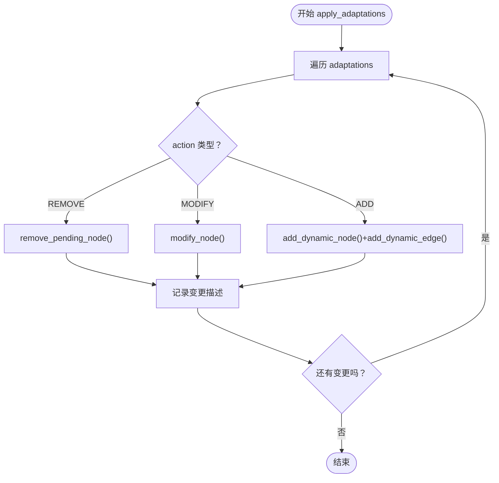
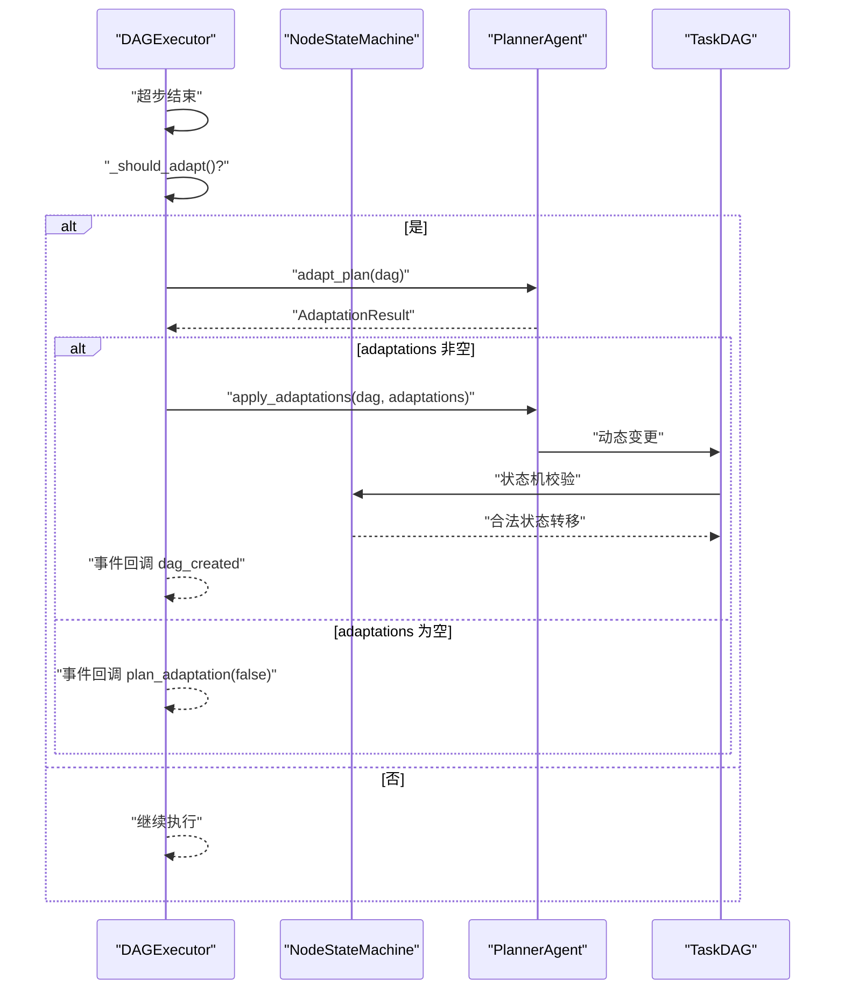
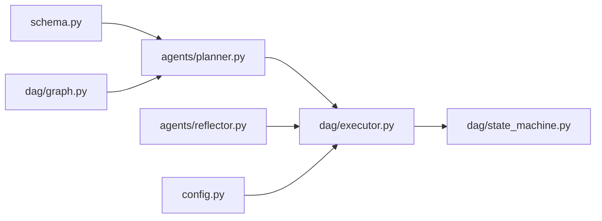

# 自适应规划模型

<cite>
**本文档引用的文件**
- [schema.py](file://schema.py)
- [planner.py](file://agents/planner.py)
- [executor.py](file://dag/executor.py)
- [graph.py](file://dag/graph.py)
- [state_machine.py](file://dag/state_machine.py)
- [config.py](file://config.py)
- [reflector.py](file://agents/reflector.py)
</cite>

## 目录
1. [简介](#简介)
2. [项目结构](#项目结构)
3. [核心组件](#核心组件)
4. [架构概览](#架构概览)
5. [详细组件分析](#详细组件分析)
6. [依赖分析](#依赖分析)
7. [性能考量](#性能考量)
8. [故障排查指南](#故障排查指南)
9. [结论](#结论)
10. [附录](#附录)

## 简介
本文件系统性阐述 manus_demo 项目中 v3 版本的自适应规划模型，重点说明以下内容：
- AdaptAction 枚举的四种操作类型（KEEP/MODIFY/REMOVE/ADD）及其语义
- PlanAdaptation 的调整提案结构与字段含义
- AdaptationResult 的评估结果模型与决策逻辑
- 自适应规划器如何在执行过程中基于中间结果动态调整任务计划
- DAG 图的动态变更能力（新增/修改/删除节点）及应用场景
- 决策逻辑与评估标准，结合实际案例展示复杂任务中的应用效果

## 项目结构
自适应规划模型位于核心执行与规划模块之间，围绕 TaskDAG 的执行循环进行“超步间”自适应调整：
- schema.py 定义了 v3 的自适应规划数据模型（AdaptAction、PlanAdaptation、AdaptationResult）
- agents/planner.py 提供 adapt_plan() 与 apply_adaptations()，负责评估与应用调整
- dag/executor.py 在 DAG 执行循环中按配置触发自适应检查，并调用 Planner 执行调整
- dag/graph.py 提供 add_dynamic_node()/add_dynamic_edge()/remove_pending_node()/modify_node() 等动态变更能力
- dag/state_machine.py 提供严格的节点状态机，保障变更后的 DAG 状态一致性
- config.py 提供 ADAPTIVE_PLANNING_ENABLED、ADAPT_PLAN_INTERVAL、ADAPT_PLAN_MIN_COMPLETED 等关键开关与阈值
- agents/reflector.py 提供 exit criteria 验证，作为自适应规划的重要输入来源之一

图表来源
- [planner.py](file://agents/planner.py)
- [executor.py](file://dag/executor.py)
- [graph.py](file://dag/graph.py)
- [state_machine.py](file://dag/state_machine.py)
- [schema.py](file://schema.py)
- [config.py](file://config.py)
- [reflector.py](file://agents/reflector.py)

章节来源
- [schema.py](file://schema.py)
- [planner.py](file://agents/planner.py)
- [executor.py](file://dag/executor.py)
- [graph.py](file://dag/graph.py)
- [state_machine.py](file://dag/state_machine.py)
- [config.py](file://config.py)
- [reflector.py](file://agents/reflector.py)

## 核心组件
- AdaptAction（操作类型枚举）
  - KEEP：保持不变
  - MODIFY：修改节点描述/完成判据
  - REMOVE：移除待执行节点
  - ADD：新增节点（动态发现的新子任务）

- PlanAdaptation（调整提案）
  - action：操作类型（AdaptAction）
  - target_node_id：目标节点 ID（既有或新节点 ID）
  - reason：调整原因
  - new_description/new_exit_criteria：MODIFY/ADD 时使用
  - parent_node_id/dependencies：ADD 时使用（父节点与依赖）

- AdaptationResult（评估结果）
  - should_adapt：是否需要调整
  - reasoning：决策理由
  - adaptations：具体调整操作列表（过滤掉 KEEP）

章节来源
- [schema.py](file://schema.py)

## 架构概览
自适应规划在 DAG 执行的“超步”之间进行，DAGExecutor 按配置周期性触发 adapt_plan()，Planner 基于已完成 ACTION 节点的结果与待执行节点的描述，生成 PlanAdaptation 列表，再由 Planner.apply_adaptations() 将变更应用到 TaskDAG。

图表来源
- [executor.py](file://dag/executor.py)
- [planner.py](file://agents/planner.py)
- [graph.py](file://dag/graph.py)

## 详细组件分析

### AdaptAction 与 PlanAdaptation
- AdaptAction 的四种操作类型分别对应不同的 DAG 变更策略：
  - KEEP：不改变任何节点，仅用于表达“无需调整”的提案
  - MODIFY：修改现有节点的描述或完成判据，适用于执行后发现目标表述不够精确或需要细化
  - REMOVE：移除 PENDING/READY 的待执行节点，适用于执行后确认不再需要
  - ADD：新增节点，适用于执行中发现遗漏的子任务或需要补充的前置条件

- PlanAdaptation 的字段设计确保了提案的可执行性与可追溯性：
  - target_node_id：既有节点 ID 或新节点建议 ID
  - reason：清晰的调整动机，便于审计与可视化
  - new_* 字段：仅在 MODIFY/ADD 时使用，ADD 还需 parent_node_id 与 dependencies

章节来源
- [schema.py](file://schema.py)

### AdaptationResult 的决策模型
- should_adapt：综合“间隔检查”“最少完成数”“有待执行节点”三个条件后得出
- reasoning：对“为何需要/不需要调整”的解释
- adaptations：过滤掉 KEEP 后的实际变更清单，便于执行层直接应用

章节来源
- [schema.py](file://schema.py)

### PlannerAgent 的 adapt_plan() 评估流程
- 输入：已完成 ACTION 节点的结果摘要 + 待执行 ACTION 节点摘要
- 输出：AdaptationResult（包含 should_adapt、reasoning、adaptations）
- 关键点：
  - 仅对 ACTION 节点进行评估（结构化节点不参与）
  - 通过 JSON 结构化输出，确保 LLM 的可预测性
  - 对异常进行稳健处理，失败时返回 should_adapt=false 并记录原因

图表来源
- [planner.py](file://agents/planner.py)

章节来源
- [planner.py](file://agents/planner.py)

### PlannerAgent 的 apply_adaptations() 应用流程
- REMOVE：仅允许移除 PENDING/READY 节点，移除后级联跳过下游依赖该节点的节点
- MODIFY：仅允许修改 PENDING 节点的描述与完成判据，必要时自动更新 validation_prompt
- ADD：新增节点并建立依赖边，自动维护邻接表与环检测；失败时回滚并记录警告

图表来源
- [planner.py](file://agents/planner.py)
- [graph.py](file://dag/graph.py)

章节来源
- [planner.py](file://agents/planner.py)
- [graph.py](file://dag/graph.py)

### DAGExecutor 的自适应触发与集成
- _should_adapt(step, dag)：按配置的间隔与最小完成数进行节流，避免过度频繁的自适应
- _adapt_plan(step, dag)：调用 Planner.adapt_plan()，接收 AdaptationResult 后调用 Planner.apply_adaptations()，并在变更发生时发出事件
- NodeStateMachine：在变更前后确保状态机的合法性，防止无效状态转移

图表来源
- [executor.py](file://dag/executor.py)
- [state_machine.py](file://dag/state_machine.py)
- [planner.py](file://agents/planner.py)
- [graph.py](file://dag/graph.py)

章节来源
- [executor.py](file://dag/executor.py)
- [state_machine.py](file://dag/state_machine.py)
- [planner.py](file://agents/planner.py)
- [graph.py](file://dag/graph.py)

### 决策逻辑与评估标准
- 何时触发自适应：
  - 配置开关开启
  - 超步间隔满足（ADAPT_PLAN_INTERVAL）
  - 至少完成一定数量的 ACTION（ADAPT_PLAN_MIN_COMPLETED）
  - 存在待执行 ACTION
- 评估标准：
  - 基于已完成 ACTION 的结果，判断待执行 ACTION 是否“不再需要”（REMOVE）
  - 是否需要“更精确的目标表述”（MODIFY）
  - 是否“遗漏了新的子任务”（ADD）
  - 保持现状（KEEP）作为默认选项
- Reflector 的 exit criteria 验证：
  - 作为自适应输入的一部分，帮助 Planner 更准确地判断节点是否真正完成，从而影响 REMOVE/MODIFY 的决策

章节来源
- [executor.py](file://dag/executor.py)
- [config.py](file://config.py)
- [reflector.py](file://agents/reflector.py)

### 实际案例：复杂任务中的应用效果
以下为三种典型场景的应用要点（不展示具体代码，仅说明决策与变更策略）：

- 案例一：数据分析任务
  - 场景：执行中发现数据源不可用，原计划的“数据清洗”节点不再需要
  - 决策：REMOVE 该节点，级联跳过下游“特征工程”等依赖节点
  - 结果：缩短执行路径，避免无效工作

- 案例二：代码审查任务
  - 场景：初步审查发现安全漏洞，需要新增“修复建议”和“回归测试”
  - 决策：ADD 新节点，设置 parent_node_id 指向“代码分析”，dependencies 指向“修复建议”
  - 结果：动态扩展计划，覆盖遗漏环节

- 案例三：文档生成任务
  - 场景：生成初稿后发现缺少“术语表”，需要细化完成判据
  - 决策：MODIFY 原节点的完成判据，增加“术语表”校验
  - 结果：提升输出质量，减少返工

章节来源
- [planner.py](file://agents/planner.py)
- [graph.py](file://dag/graph.py)

## 依赖分析
- PlannerAgent 依赖 schema.py 中的数据模型，以及 dag/graph.py 的动态变更 API
- DAGExecutor 依赖 PlannerAgent 的 adapt_plan() 与 apply_adaptations()，并通过 NodeStateMachine 保证状态一致性
- Reflector 的 exit criteria 验证为自适应评估提供输入，间接影响 REMOVE/MODIFY 决策

图表来源
- [schema.py](file://schema.py)
- [planner.py](file://agents/planner.py)
- [graph.py](file://dag/graph.py)
- [executor.py](file://dag/executor.py)
- [state_machine.py](file://dag/state_machine.py)
- [reflector.py](file://agents/reflector.py)
- [config.py](file://config.py)

章节来源
- [schema.py](file://schema.py)
- [planner.py](file://agents/planner.py)
- [graph.py](file://dag/graph.py)
- [executor.py](file://dag/executor.py)
- [state_machine.py](file://dag/state_machine.py)
- [reflector.py](file://agents/reflector.py)
- [config.py](file://config.py)

## 性能考量
- 自适应检查的节流：通过 ADAPT_PLAN_INTERVAL 与 ADAPT_PLAN_MIN_COMPLETED 控制频率，避免频繁 LLM 调用
- 动态变更的开销：ADD/MODIFY/REMOVE 操作涉及邻接表维护与环检测，建议在变更较少的场景下使用
- 状态机校验：apply_adaptations() 会触发状态机校验，确保 DAG 的合法性，避免无效状态导致的执行停滞

## 故障排查指南
- 自适应未触发
  - 检查 ADAPTIVE_PLANNING_ENABLED 是否开启
  - 检查 ADAPT_PLAN_INTERVAL 与 ADAPT_PLAN_MIN_COMPLETED 是否合理
  - 确认是否存在待执行 ACTION 节点
- 自适应触发但无变更
  - 查看 AdaptationResult.reasoning，确认 Planner 的评估逻辑
  - 检查已完成 ACTION 的结果是否充分支持 REMOVE/MODIFY
- 变更失败
  - ADD 时检查 parent_node_id 与 dependencies 是否有效
  - REMOVE 时确认节点状态为 PENDING/READY
  - 环检测失败时，查看日志中的“cycle”相关警告
- 状态异常
  - 检查 NodeStateMachine 的转移日志，定位非法状态转移

章节来源
- [executor.py](file://dag/executor.py)
- [graph.py](file://dag/graph.py)
- [state_machine.py](file://dag/state_machine.py)
- [config.py](file://config.py)

## 结论
v3 自适应规划模型通过“超步间评估 + 动态变更”的机制，使 TaskDAG 能够在执行过程中根据中间结果进行自我修正与扩展。AdaptAction/PlanAdaptation/AdaptationResult 三元模型提供了清晰的决策与执行契约，配合 DAGExecutor 的节流策略与 NodeStateMachine 的状态约束，既保证了灵活性，又维持了执行的稳定性与可预测性。在复杂任务中，该模型能够有效减少无效工作、及时补充遗漏环节，并提升最终输出质量。

## 附录
- 配置项参考
  - ADAPTIVE_PLANNING_ENABLED：是否启用自适应规划
  - ADAPT_PLAN_INTERVAL：自适应检查间隔（超步数）
  - ADAPT_PLAN_MIN_COMPLETED：至少完成的 ACTION 数量阈值
- 相关文件
  - [schema.py](file://schema.py)
  - [planner.py](file://agents/planner.py)
  - [executor.py](file://dag/executor.py)
  - [graph.py](file://dag/graph.py)
  - [state_machine.py](file://dag/state_machine.py)
  - [config.py](file://config.py)
  - [reflector.py](file://agents/reflector.py)