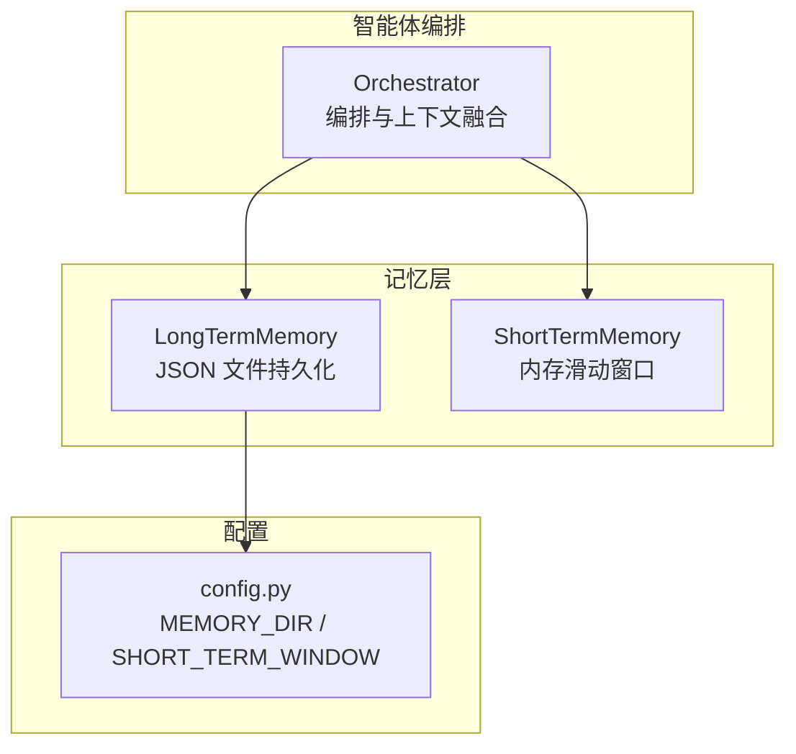
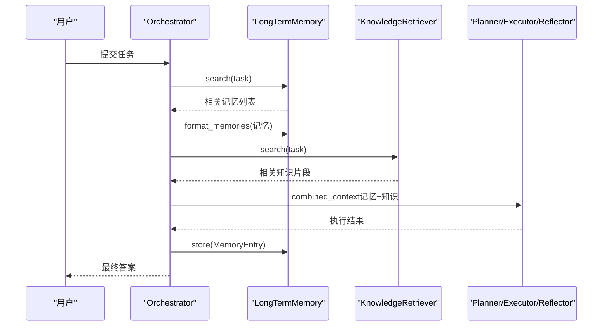
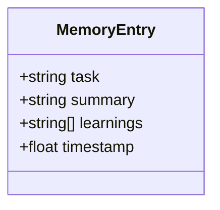
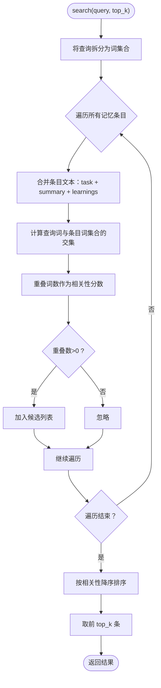
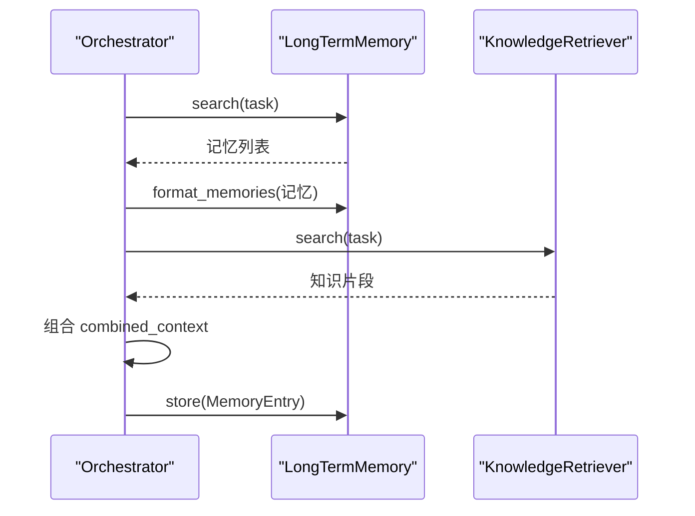
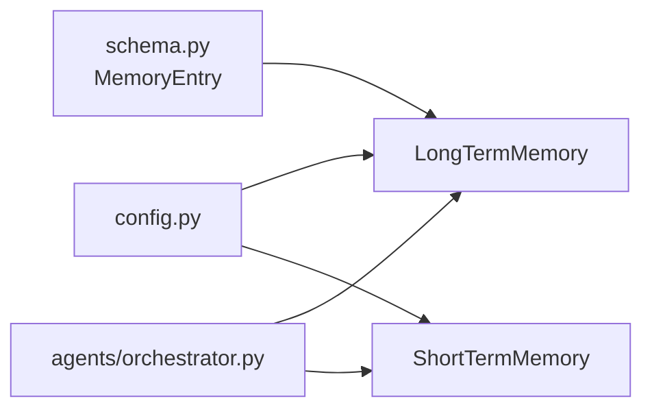

# 记忆模型

<cite>
**本文引用的文件**
- [memory/long_term.py](file://memory/long_term.py)
- [memory/short_term.py](file://memory/short_term.py)
- [schema.py](file://schema.py)
- [config.py](file://config.py)
- [agents/orchestrator.py](file://agents/orchestrator.py)
- [README_CN.md](file://README_CN.md)
</cite>

## 目录
1. [简介](#简介)
2. [项目结构](#项目结构)
3. [核心组件](#核心组件)
4. [架构总览](#架构总览)
5. [详细组件分析](#详细组件分析)
6. [依赖分析](#依赖分析)
7. [性能考量](#性能考量)
8. [故障排查指南](#故障排查指南)
9. [结论](#结论)
10. [附录](#附录)

## 简介
本文件聚焦 manus_demo 的记忆模型，系统性阐述长期记忆结构 MemoryEntry 的设计与持久化机制，解释记忆系统在智能体协作中的作用，以及如何通过历史经验优化未来的任务规划与执行。文档还提供记忆查询与检索的最佳实践，涵盖相似任务匹配与经验迁移的应用场景。

## 项目结构
记忆系统位于 memory 目录，包含两类记忆：
- 长期记忆：基于 JSON 文件持久化，跨会话保存已完成任务的经验。
- 短期记忆：基于内存的滑动窗口，保留最近对话消息，避免上下文越界。

图表来源
- [memory/long_term.py:1-142](file://memory/long_term.py#L1-L142)
- [memory/short_term.py:1-91](file://memory/short_term.py#L1-L91)
- [config.py:27-31](file://config.py#L27-L31)
- [agents/orchestrator.py:140-251](file://agents/orchestrator.py#L140-L251)

章节来源
- [README_CN.md:100-174](file://README_CN.md#L100-L174)
- [config.py:27-31](file://config.py#L27-L31)

## 核心组件
- MemoryEntry：长期记忆的最小数据单元，包含任务描述、执行摘要、学习要点列表与时间戳。
- LongTermMemory：基于 JSON 的持久化存储，提供关键词检索、格式化注入、全量导出与清空。
- ShortTermMemory：内存滑动窗口，按配置保留最近消息，支持快速获取与序列化输出。
- Orchestrator：在任务执行前后收集上下文，将长期记忆与知识库检索结果注入规划与执行流程。

章节来源
- [schema.py:662-671](file://schema.py#L662-L671)
- [memory/long_term.py:24-142](file://memory/long_term.py#L24-L142)
- [memory/short_term.py:20-91](file://memory/short_term.py#L20-L91)
- [agents/orchestrator.py:140-251](file://agents/orchestrator.py#L140-L251)

## 架构总览
长期记忆在编排阶段被检索并格式化，与知识库检索结果一起注入到后续规划与执行流程中，形成“历史经验 + 现有知识”的综合上下文。

图表来源
- [agents/orchestrator.py:229-251](file://agents/orchestrator.py#L229-L251)
- [memory/long_term.py:79-101](file://memory/long_term.py#L79-L101)
- [memory/long_term.py:123-138](file://memory/long_term.py#L123-L138)

## 详细组件分析

### MemoryEntry 数据模型
MemoryEntry 是长期记忆的原子记录，承载任务摘要、学习要点与时间戳，用于后续检索与经验复用。

图表来源
- [schema.py:662-671](file://schema.py#L662-L671)

章节来源
- [schema.py:662-671](file://schema.py#L662-L671)

### LongTermMemory：持久化与检索
- 初始化与持久化
  - 从配置读取存储目录，确保目录存在，定位唯一 JSON 文件。
  - 启动时从磁盘加载历史记忆条目，异常时返回空列表并记录警告。
  - 每次新增条目后立即写回磁盘，保证重启可恢复。
- 检索策略
  - 基于关键词重叠度评分：将查询词与每条记忆的 task、summary、learnings 合并文本求交集，重叠词数即相关性分数。
  - 返回 top_k 条相关记忆，按重叠数降序。
- 上下文注入
  - 将检索到的记忆格式化为可读字符串，注入到智能体 prompt 的“Past Experience”部分。
- 其他能力
  - get_all：导出全部记忆。
  - clear：清空并持久化。
  - __len__：返回记忆总数。

图表来源
- [memory/long_term.py:79-101](file://memory/long_term.py#L79-L101)

章节来源
- [memory/long_term.py:31-64](file://memory/long_term.py#L31-L64)
- [memory/long_term.py:70-78](file://memory/long_term.py#L70-L78)
- [memory/long_term.py:79-101](file://memory/long_term.py#L79-L101)
- [memory/long_term.py:103-108](file://memory/long_term.py#L103-L108)
- [memory/long_term.py:110-117](file://memory/long_term.py#L110-L117)
- [memory/long_term.py:123-138](file://memory/long_term.py#L123-L138)
- [memory/long_term.py:140-141](file://memory/long_term.py#L140-L141)

### ShortTermMemory：近期上下文缓存
- 窗口大小由配置决定，超出容量时按 FIFO 淘汰最旧消息。
- 提供获取全部消息、获取最近 N 条、清空与序列化为文本的能力。
- 用于避免上下文长度超过 LLM 上限，同时保留关键对话痕迹。

章节来源
- [memory/short_term.py:27-46](file://memory/short_term.py#L27-L46)
- [memory/short_term.py:47-59](file://memory/short_term.py#L47-L59)
- [memory/short_term.py:61-67](file://memory/short_term.py#L61-L67)
- [memory/short_term.py:74-84](file://memory/short_term.py#L74-L84)
- [memory/short_term.py:86-91](file://memory/short_term.py#L86-L91)

### Orchestrator 中的记忆使用
- 上下文收集：检索长期记忆与知识库，格式化为 combined_context 注入后续流程。
- 任务完成存储：将最终答案与任务摘要封装为 MemoryEntry，写入长期记忆。
- 短期记忆：在任务开始与结束时分别记录用户输入与最终答案，维持会话上下文。

图表来源
- [agents/orchestrator.py:229-251](file://agents/orchestrator.py#L229-L251)
- [agents/orchestrator.py:556-567](file://agents/orchestrator.py#L556-L567)

章节来源
- [agents/orchestrator.py:140-147](file://agents/orchestrator.py#L140-L147)
- [agents/orchestrator.py:229-251](file://agents/orchestrator.py#L229-L251)
- [agents/orchestrator.py:556-567](file://agents/orchestrator.py#L556-L567)

## 依赖分析
- 配置依赖
  - MEMORY_DIR：长期记忆 JSON 文件所在目录。
  - SHORT_TERM_WINDOW：短期记忆窗口大小。
- 类型依赖
  - MemoryEntry：被 LongTermMemory 存储与检索。
  - ShortTermMemory：被 Orchestrator 用于会话上下文。
- 运行时依赖
  - Orchestrator 在任务执行前后调用记忆与知识检索，形成闭环。

图表来源
- [config.py:27-31](file://config.py#L27-L31)
- [schema.py:662-671](file://schema.py#L662-L671)
- [memory/long_term.py:31-35](file://memory/long_term.py#L31-L35)
- [memory/short_term.py:27-29](file://memory/short_term.py#L27-L29)
- [agents/orchestrator.py:140-147](file://agents/orchestrator.py#L140-L147)

章节来源
- [config.py:27-31](file://config.py#L27-L31)
- [schema.py:662-671](file://schema.py#L662-L671)
- [memory/long_term.py:31-35](file://memory/long_term.py#L31-L35)
- [memory/short_term.py:27-29](file://memory/short_term.py#L27-L29)
- [agents/orchestrator.py:140-147](file://agents/orchestrator.py#L140-L147)

## 性能考量
- 检索复杂度
  - 关键词重叠评分对每条记忆进行集合交集计算，整体复杂度约为 O(N·M)，其中 N 为记忆条目数，M 为平均条目词数。
- I/O 开销
  - 每次 store() 后立即写盘，写入成本与条目数量线性相关；建议定期清理冗余记忆以控制文件大小。
- 上下文长度
  - format_memories() 会将检索到的记忆注入 prompt，需结合 MAX_CONTEXT_TOKENS 控制注入量，避免越界。
- 窗口管理
  - SHORT_TERM_WINDOW 控制短期记忆容量，避免频繁淘汰与丢失关键上下文。

## 故障排查指南
- 长期记忆文件损坏或格式错误
  - 现象：启动时无法加载历史记忆，返回空列表并记录警告。
  - 处理：检查 JSON 文件完整性；必要时删除文件以重建。
- 检索结果为空
  - 现象：search() 返回空列表。
  - 处理：确认查询关键词与记忆条目文本的重叠；适当放宽 top_k 或调整查询词。
- 记忆未持久化
  - 现象：重启后记忆丢失。
  - 处理：确认 MEMORY_DIR 权限与磁盘空间；检查异常日志。
- 上下文过长
  - 现象：注入记忆后导致上下文越界。
  - 处理：降低 top_k 或缩短摘要长度；结合 ContextManager 的摘要压缩能力。

章节来源
- [memory/long_term.py:42-55](file://memory/long_term.py#L42-L55)
- [memory/long_term.py:70-78](file://memory/long_term.py#L70-L78)
- [config.py:23-24](file://config.py#L23-L24)

## 结论
manus_demo 的记忆模型以简洁高效的关键词检索为核心，结合 JSON 持久化与短期记忆滑动窗口，实现了“历史经验 + 现有知识”的上下文融合。通过 Orchestrator 的统一编排，长期记忆在任务规划与执行中发挥着持续优化的作用。未来可在保持易用性的前提下，引入分类检索与语义精排，进一步提升相似任务匹配与经验迁移的效果。

## 附录

### 记忆查询与检索最佳实践
- 查询词构造
  - 使用与任务高度相关的关键词组合，避免过长句子导致噪声干扰。
- 结果筛选
  - 适度提高 top_k 以扩大候选范围，再结合业务规则二次过滤。
- 经验迁移
  - 将相似任务的 learnings 作为参考，快速生成执行策略或规避潜在陷阱。
- 上下文注入
  - 控制注入的记忆条目数量与长度，避免影响当前任务的上下文权重。

### 记忆在智能体协作中的作用
- 任务规划优化
  - 借助历史经验减少重复尝试，提升规划质量与成功率。
- 执行稳定性
  - 通过学习要点与失败教训，指导工具选择与参数调优。
- 知识与经验融合
  - 将知识库的结构化知识与长期记忆的非结构化经验结合，形成更丰富的上下文。