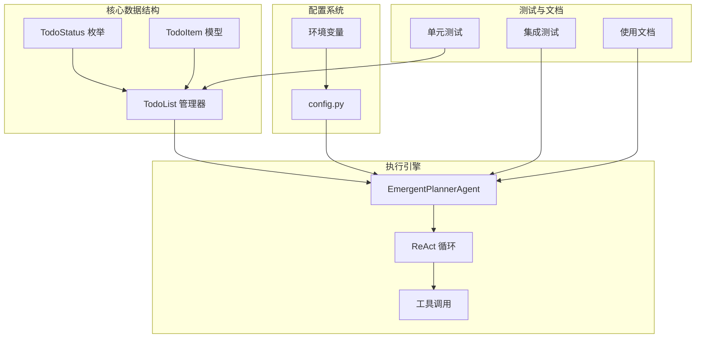
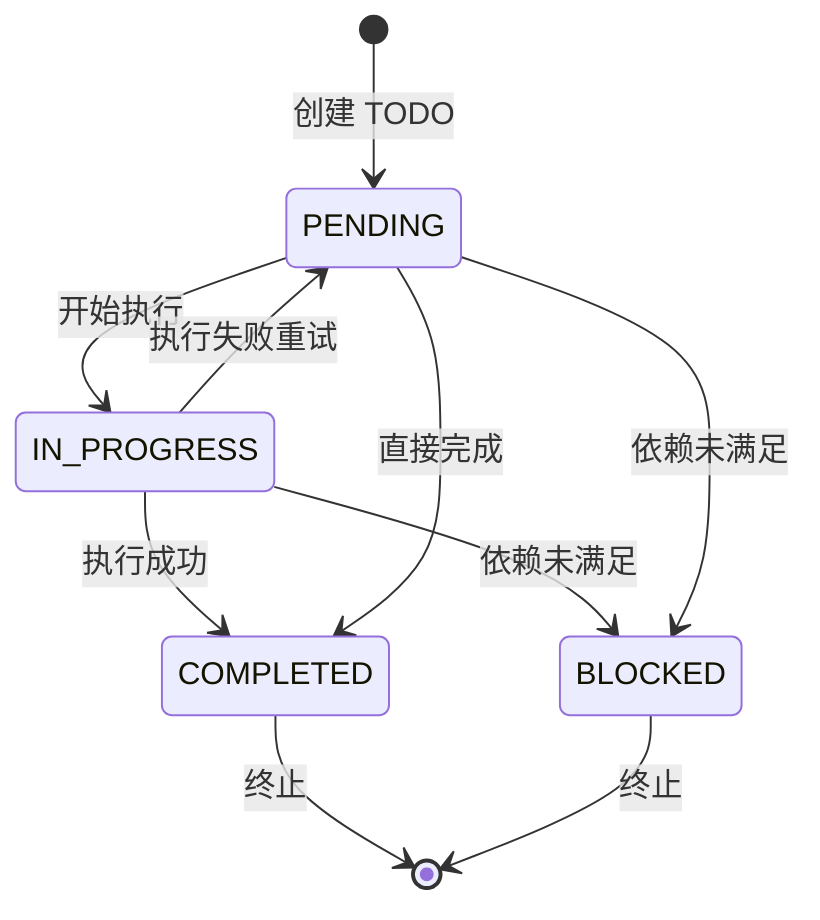
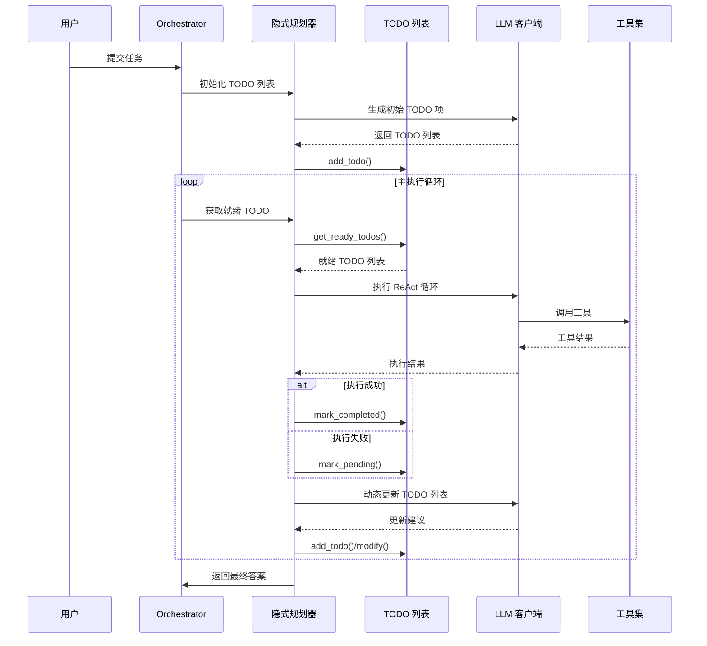
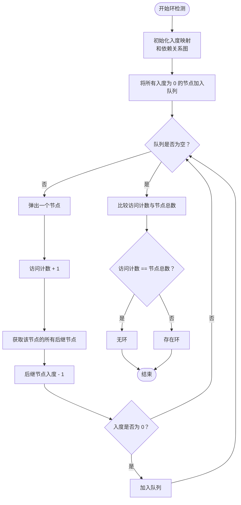
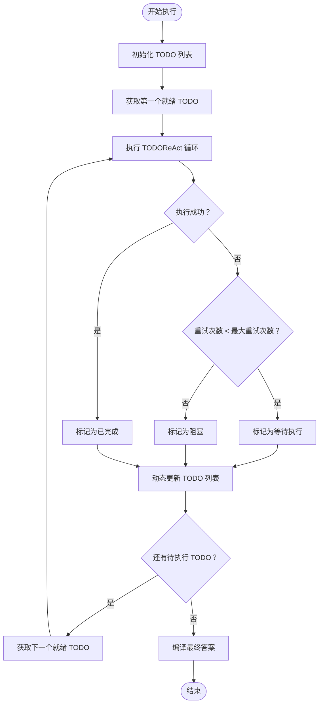
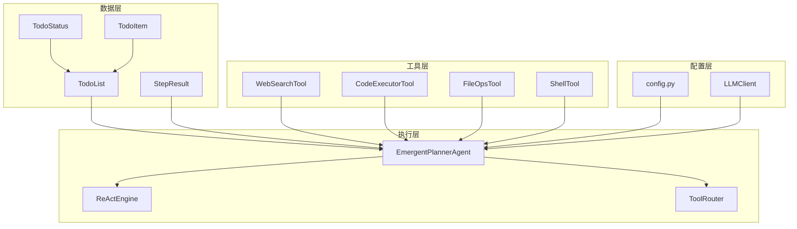

# 隐式规划模型

<cite>
**本文档引用的文件**
- [schema.py](file://schema.py)
- [emergent_planner.py](file://agents/emergent_planner.py)
- [config.py](file://config.py)
- [test_emergent_planning.py](file://tests/test_emergent_planning.py)
- [main.py](file://main.py)
- [emergent-planning.md](file://sxw_aicoding/docs/emergent-planning.md)
- [emergent-planning-test-scenarios.md](file://sxw_aicoding/docs/emergent-planning-test-scenarios.md)
</cite>

## 目录
1. [简介](#简介)
2. [项目结构](#项目结构)
3. [核心组件](#核心组件)
4. [架构概览](#架构概览)
5. [详细组件分析](#详细组件分析)
6. [依赖关系分析](#依赖关系分析)
7. [性能考量](#性能考量)
8. [故障排除指南](#故障排除指南)
9. [结论](#结论)
10. [附录](#附录)

## 简介

manus_demo 的隐式规划模型是基于 Claude Code 风格设计的创新性任务执行系统。该系统采用"规划在执行中涌现"的理念，通过集中式的 TODO 列表管理实现灵活的任务组织和执行。

### 核心特性

- **无预定义结构**：不预先生成完整的任务计划，规划在执行过程中自然形成
- **扁平 TODO 列表**：采用简单的扁平结构而非复杂的层次化 DAG
- **动态自组织**：LLM 通过自然语言推理自主决定任务分解和组织方式
- **实时更新**：执行过程中动态添加、修改和完成 TODO 项
- **失败重试**：智能的失败处理和重试机制，支持 mark_pending 重试

### v5 版本的关键创新

v5 版本引入了 TodoStatus 状态枚举、TodoItem 结构和 TodoList 集中式管理，实现了真正的 Claude Code 风格隐式规划：

- **TodoStatus**：定义了 PENDING、IN_PROGRESS、COMPLETED、BLOCKED 四种状态
- **TodoItem**：扁平结构的 TODO 项，支持动态创建和更新
- **TodoList**：集中式管理所有 TODO 项，内置环检测算法

## 项目结构



**图表来源**
- [schema.py:384-558](file://schema.py#L384-L558)
- [emergent_planner.py:72-685](file://agents/emergent_planner.py#L72-L685)
- [config.py:61-67](file://config.py#L61-L67)

**章节来源**
- [schema.py:384-558](file://schema.py#L384-L558)
- [emergent_planner.py:72-128](file://agents/emergent_planner.py#L72-L128)
- [config.py:61-67](file://config.py#L61-L67)

## 核心组件

### TodoStatus 状态枚举

TodoStatus 定义了 TODO 项的四种生命周期状态：



**图表来源**
- [schema.py:384-393](file://schema.py#L384-L393)

### TodoItem 数据模型

TodoItem 是隐式规划系统的核心数据结构，具有以下特点：

- **扁平结构**：无层级关系，简化了依赖管理
- **动态属性**：支持在执行过程中更新描述和依赖关系
- **时间戳管理**：自动跟踪创建和更新时间
- **重试机制**：内置 retry_count 字段支持失败重试

### TodoList 集中式管理

TodoList 作为 TodoItem 的集中式管理器，提供了完整的生命周期管理：

- **环检测算法**：使用 Kahn 算法检测依赖关系中的环
- **状态转换**：提供 mark_completed、mark_in_progress、mark_pending、mark_blocked 方法
- **就绪节点发现**：动态发现可执行的 TODO 项
- **批量操作**：支持获取待执行和就绪 TODO 项

**章节来源**
- [schema.py:384-558](file://schema.py#L384-L558)

## 架构概览



**图表来源**
- [emergent_planner.py:134-276](file://agents/emergent_planner.py#L134-L276)
- [schema.py:422-558](file://schema.py#L422-L558)

## 详细组件分析

### TodoList 环检测算法（Kahn 算法）

TodoList 实现了基于 Kahn 算法的环检测机制，确保依赖关系的有效性：



**图表来源**
- [schema.py:441-462](file://schema.py#L441-L462)

#### 算法复杂度分析

- **时间复杂度**：O(V + E)，其中 V 为节点数，E 为边数
- **空间复杂度**：O(V + E)，用于存储邻接表和入度映射
- **优势**：相比 DFS 环检测，Kahn 算法更直观且易于实现

### TodoItem 动态创建和更新机制

TodoList 提供了完整的动态管理能力：

#### 添加 TODO 项
```python
def add_todo(self, description: str, dependencies: list[int] | None = None) -> TodoItem:
    """
    添加新 TODO 项，自动检测环并返回创建的 TODO
    """
    # 1. 创建 TODO 对象
    todo = TodoItem(
        id=self.next_id,
        description=description,
        dependencies=dependencies or [],
    )
    
    # 2. 预添加到字典
    self.todos[self.next_id] = todo
    
    # 3. 检测环
    if self._has_cycle():
        # 4. 如果存在环，删除刚添加的 TODO
        del self.todos[self.next_id]
        raise ValueError("创建环")
    
    # 5. 更新下一个 ID
    self.next_id += 1
    return todo
```

#### 就绪节点发现
```python
def get_ready_todos(self) -> list[TodoItem]:
    """
    获取所有依赖已满足的 TODO 项
    """
    ready = []
    for todo in self.todos.values():
        if todo.status != TodoStatus.PENDING:
            continue
            
        # 检查所有依赖是否已完成
        deps_completed = all(
            self.todos[dep_id].status == TodoStatus.COMPLETED
            for dep_id in todo.dependencies
        )
        
        if deps_completed:
            ready.append(todo)
    return ready
```

**章节来源**
- [schema.py:464-513](file://schema.py#L464-L513)

### 状态转换方法详解

TodoList 提供了四种核心状态转换方法：

#### 标记完成
```python
def mark_completed(self, todo_id: int, result: str) -> None:
    """
    将 TODO 标记为已完成并记录结果
    """
    if todo_id in self.todos:
        self.todos[todo_id].status = TodoStatus.COMPLETED
        self.todos[todo_id].result = result
        self.todos[todo_id].updated_at = time.time()
```

#### 标记进行中
```python
def mark_in_progress(self, todo_id: int) -> None:
    """
    将 TODO 标记为正在执行
    """
    if todo_id in self.todos:
        self.todos[todo_id].status = TodoStatus.IN_PROGRESS
        self.todos[todo_id].updated_at = time.time()
```

#### 标记等待执行
```python
def mark_pending(self, todo_id: int) -> None:
    """
    将 TODO 标记为等待执行（用于失败后重试）
    """
    if todo_id in self.todos:
        self.todos[todo_id].status = TodoStatus.PENDING
        self.todos[todo_id].updated_at = time.time()
```

#### 标记阻塞
```python
def mark_blocked(self, todo_id: int) -> None:
    """
    将 TODO 标记为阻塞（超过最大重试次数后永久失败）
    """
    if todo_id in self.todos:
        self.todos[todo_id].status = TodoStatus.BLOCKED
        self.todos[todo_id].updated_at = time.time()
```

**章节来源**
- [schema.py:515-551](file://schema.py#L515-L551)

### EmergentPlannerAgent 执行流程

EmergentPlannerAgent 是隐式规划的核心执行引擎，实现了 Claude Code 风格的 while(tool_use) 主循环：



**图表来源**
- [emergent_planner.py:167-276](file://agents/emergent_planner.py#L167-L276)

#### 关键执行特性

1. **停滞检测**：连续多轮无进展时自动提前退出
2. **阻塞处理**：无就绪 TODO 时强制选择 PENDING 项
3. **动态更新**：基于执行结果实时调整 TODO 列表
4. **重试机制**：失败 TODO 自动回退为 PENDING 状态

**章节来源**
- [emergent_planner.py:167-276](file://agents/emergent_planner.py#L167-L276)

## 依赖关系分析



**图表来源**
- [schema.py:384-558](file://schema.py#L384-L558)
- [emergent_planner.py:72-128](file://agents/emergent_planner.py#L72-L128)
- [config.py:17-19](file://config.py#L17-L19)

### 组件耦合度分析

- **低耦合设计**：各组件职责明确，通过接口通信
- **配置驱动**：通过 config.py 控制行为，便于测试和调试
- **工具抽象**：BaseTool 抽象确保工具替换的透明性

**章节来源**
- [schema.py:384-558](file://schema.py#L384-L558)
- [emergent_planner.py:72-128](file://agents/emergent_planner.py#L72-L128)

## 性能考量

### 时间复杂度分析

| 操作 | 复杂度 | 说明 |
|------|--------|------|
| TODO 初始化 | O(1) | 创建 1-3 个初始 TODO |
| 就绪节点发现 | O(N) | 遍历所有 TODO 检查依赖 |
| 环检测 | O(V+E) | Kahn 算法实现 |
| 状态转换 | O(1) | 字典查找和更新 |
| 整体执行 | O(N×M) | N 为 TODO 数量，M 为平均迭代次数 |

### 内存使用优化

- **字典存储**：使用字典存储 TODO 项，提供 O(1) 查找性能
- **时间戳管理**：自动更新 updated_at 字段，便于状态追踪
- **配置控制**：通过 config.py 控制 TODO 数量上限，防止内存泄漏

### 并发执行支持

当前实现采用顺序执行模式，未来可扩展为：

- **并发 TODO 执行**：支持多个独立 TODO 并行执行
- **依赖管理优化**：重新设计依赖关系以支持并发
- **状态同步机制**：确保并发执行时的状态一致性

## 故障排除指南

### 常见问题及解决方案

#### 1. TODO 列表增长过快

**现象**：TODO 数量迅速达到 MAX_TODO_ITEMS 限制

**可能原因**：
- LLM 过度拆分任务
- 每个 TODO 粒度过细
- 缺乏有效的 TODO 合并机制

**解决方案**：
- 调整 MAX_TODO_ITEMS 配置
- 实施 TODO 压缩机制
- 优化初始 TODO 生成策略

#### 2. 环检测失败

**现象**：添加 TODO 时抛出 ValueError："创建环"

**可能原因**：
- 依赖关系形成环状结构
- 手动编辑导致依赖关系不一致
- 动态更新时的循环依赖

**解决方案**：
- 检查依赖关系的合理性
- 使用 _has_cycle() 方法预检
- 实施环检测和回滚机制

#### 3. 执行停滞

**现象**：任务长时间无进展

**可能原因**：
- 依赖项无法满足
- 工具调用失败
- LLM 无法生成有效行动

**解决方案**：
- 检查阻塞 TODO 的依赖关系
- 实施停滞检测和自动退出
- 提供人工干预机制

**章节来源**
- [test_emergent_planning.py:281-310](file://tests/test_emergent_planning.py#L281-L310)
- [config.py:61-67](file://config.py#L61-L67)

## 结论

manus_demo 的隐式规划模型代表了任务执行系统的一个重要发展方向。通过 TodoStatus、TodoItem 和 TodoList 的有机结合，实现了真正意义上的"规划在执行中涌现"。

### 主要优势

1. **高度灵活性**：能够适应不确定和探索性任务
2. **自然语言驱动**：LLM 通过自然语言推理自组织任务
3. **实时响应**：执行过程中动态调整计划
4. **容错能力强**：智能的失败处理和重试机制

### 应用场景

- **探索性研究**：如代码库分析、技术调研
- **需求模糊任务**：需要先分析后确定的具体工作
-. **创意性任务**：需要发散思维的创造性工作
- **快速原型开发**：简单的、不需要详细规划的任务

### 未来发展方向

1. **并发执行支持**：扩展为支持多个 TODO 并行执行
2. **智能优先级**：基于任务重要性和紧急性排序
3. **TODO 压缩**：自动合并相似的 TODO 项
4. **增强结果汇总**：使用 LLM 生成智能摘要
5. **循环检测**：防止无限重试和循环依赖

## 附录

### 配置参数说明

| 参数名 | 默认值 | 说明 |
|--------|--------|------|
| EMERGENT_PLANNING_ENABLED | true | 是否启用隐式规划 |
| MAX_TODO_ITEMS | 20 | TODO 列表最大项数 |
| MAX_TODO_RETRIES | 3 | 单个 TODO 最大重试次数 |
| MAX_EMERGENT_OUTER_ITERATIONS | 60 | 主循环最大迭代数 |
| MAX_REACT_ITERATIONS | 10 | 单个 TODO 最大 ReAct 迭代次数 |
| TODO_COMPRESSION_THRESHOLD | 0.8 | 上下文压缩阈值 |

### 使用示例

#### 基本使用
```bash
# 启用隐式规划模式
PLAN_MODE=emergent python main.py "分析 manus_demo 项目的代码结构"

# 启用 LLM 重试机制
LLM_RETRY_ENABLED=true PLAN_MODE=emergent python main.py "优化系统性能"
```

#### 配置调整
```bash
# 增加 TODO 数量上限
MAX_TODO_ITEMS=50 PLAN_MODE=emergent python main.py "全面分析项目"

# 调整重试次数
MAX_TODO_RETRIES=5 PLAN_MODE=emergent python main.py "复杂任务"
```

**章节来源**
- [config.py:61-67](file://config.py#L61-L67)
- [emergent-planning-test-scenarios.md:163-195](file://sxw_aicoding/docs/emergent-planning-test-scenarios.md#L163-L195)