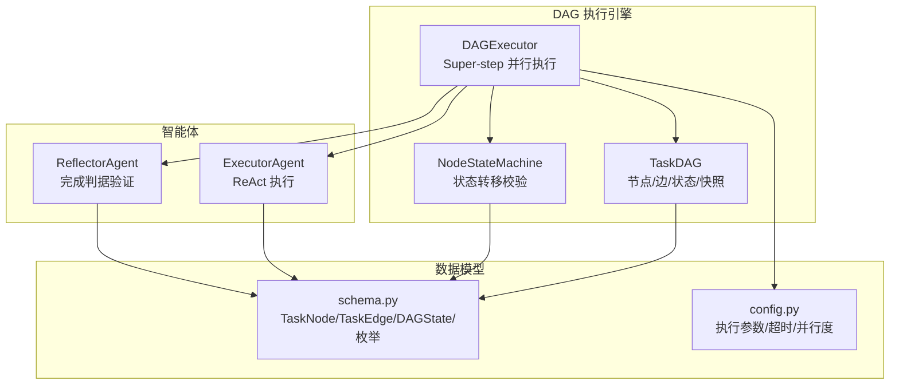
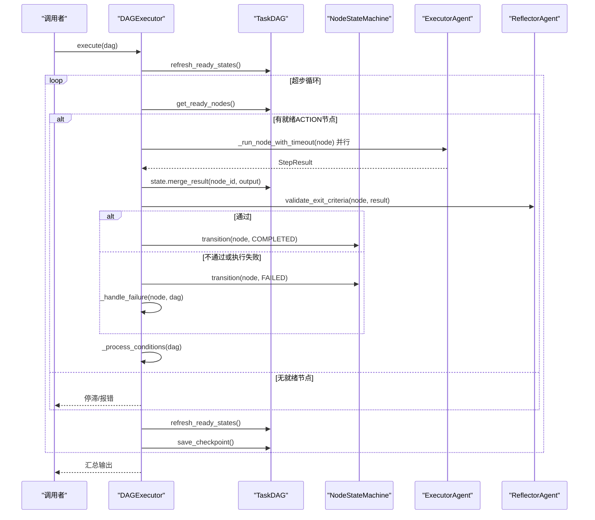
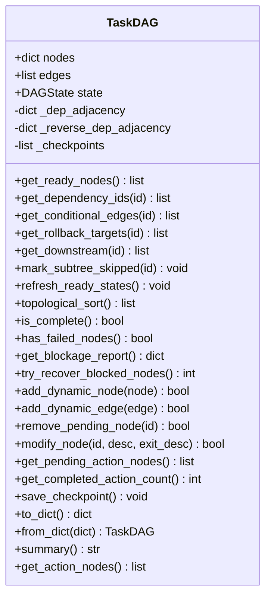
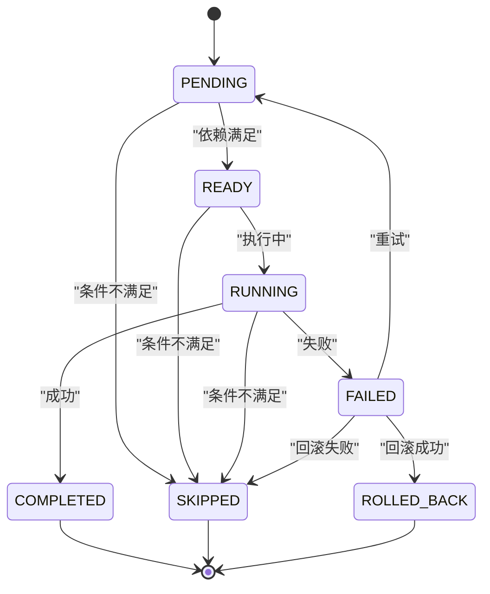
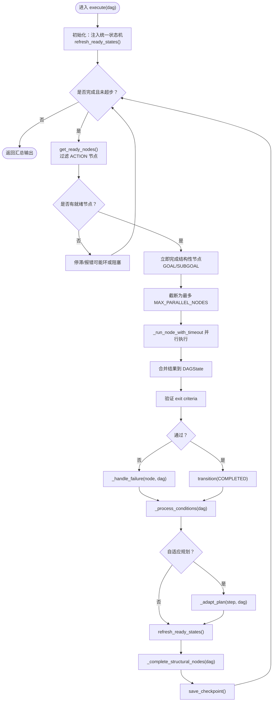
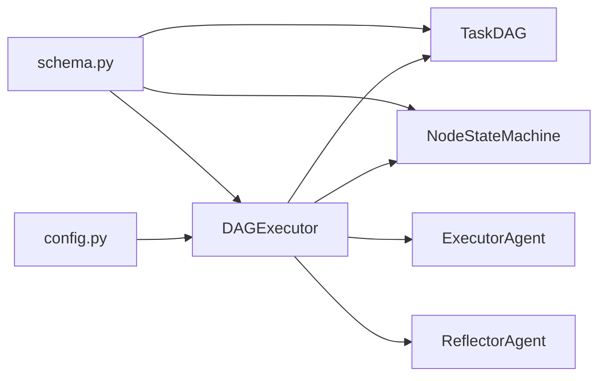

# DAG执行器API

<cite>
**本文引用的文件**
- [dag/__init__.py](file://dag/__init__.py)
- [dag/graph.py](file://dag/graph.py)
- [dag/executor.py](file://dag/executor.py)
- [dag/state_machine.py](file://dag/state_machine.py)
- [schema.py](file://schema.py)
- [config.py](file://config.py)
- [agents/executor.py](file://agents/executor.py)
- [agents/reflector.py](file://agents/reflector.py)
- [tests/test_dag_capabilities.py](file://tests/test_dag_capabilities.py)
</cite>

## 目录
1. [简介](#简介)
2. [项目结构](#项目结构)
3. [核心组件](#核心组件)
4. [架构总览](#架构总览)
5. [详细组件分析](#详细组件分析)
6. [依赖关系分析](#依赖关系分析)
7. [性能考量](#性能考量)
8. [故障排查指南](#故障排查指南)
9. [结论](#结论)
10. [附录](#附录)

## 简介
本文件为 DAG 执行系统（DAGExecutor）的详细API参考文档，聚焦以下目标：
- TaskDAG 的节点管理、边连接、状态查询等核心接口
- DAGExecutor 的执行流程控制、并行执行管理、状态机驱动机制
- TaskNode、TaskEdge 等数据结构的属性与方法
- DAG 图构建、修改、查询的API说明
- 动态图变更与局部重规划的实现细节
- 并行执行的调度策略与资源管理
- 状态机的状态转换与事件触发机制
- DAG 可视化与调试的辅助工具API

## 项目结构
DAG 执行系统位于 dag/ 目录，核心模块包括：
- graph.py：TaskDAG 数据结构与图算法（拓扑排序、就绪检测等）
- state_machine.py：节点生命周期状态机（强制合法状态转移）
- executor.py：DAG 执行引擎（Super-step 并行执行模型）

图表来源
- [dag/graph.py:43-627](file://dag/graph.py#L43-L627)
- [dag/state_machine.py:55-114](file://dag/state_machine.py#L55-L114)
- [dag/executor.py:62-648](file://dag/executor.py#L62-L648)
- [schema.py:157-253](file://schema.py#L157-L253)
- [config.py:42-60](file://config.py#L42-L60)

章节来源
- [dag/__init__.py:1-19](file://dag/__init__.py#L1-L19)

## 核心组件
- TaskDAG：集中式状态的有向无环图，维护节点、边、共享状态与检查点，提供就绪节点发现、拓扑排序、条件边与回滚边查询、子树跳过、动态增删改节点/边等能力。
- NodeStateMachine：严格的节点状态机，提供状态合法性校验与事件回调，确保状态转移符合预定义转移表。
- DAGExecutor：基于 Super-step 的并行执行引擎，负责每轮就绪节点的并行执行、结果合并、完成判据验证、失败处理（回滚/跳过子树）、条件边评估、自适应规划、检查点保存与输出汇总。

章节来源
- [dag/graph.py:43-627](file://dag/graph.py#L43-L627)
- [dag/state_machine.py:55-114](file://dag/state_machine.py#L55-L114)
- [dag/executor.py:62-648](file://dag/executor.py#L62-L648)

## 架构总览
DAGExecutor 的执行循环以“超步”为单位，每轮：
1) 发现就绪节点（依赖全部完成的 PENDING/READY）
2) 并行执行（最多 MAX_PARALLEL_NODES 个）
3) 合并结果到 DAGState
4) 验证完成判据（可调用 ReflectorAgent）
5) 处理失败（回滚/跳过子树）
6) 评估条件边（动态启用/跳过下游）
7) 保存检查点，准备下一轮

图表来源
- [dag/executor.py:110-264](file://dag/executor.py#L110-L264)
- [dag/graph.py:199-213](file://dag/graph.py#L199-L213)
- [agents/executor.py:131-164](file://agents/executor.py#L131-L164)
- [agents/reflector.py:90-128](file://agents/reflector.py#L90-L128)

## 详细组件分析

### TaskDAG（节点管理与图操作）
- 节点查询
  - get_ready_nodes()：返回当前可并行执行的节点（PENDING/READY 且依赖全部 COMPLETED）
  - get_dependency_ids(node_id)：返回依赖节点ID列表（仅 DEPENDENCY 边）
  - get_conditional_edges(source_id)：返回从某节点出发的 CONDITIONAL 条件边
  - get_rollback_targets(node_id)：返回通过 ROLLBACK 边连接的目标节点ID列表
  - get_downstream(node_id)：通过 BFS 返回下游所有节点ID（用于失败时级联跳过）
- 状态变更
  - mark_subtree_skipped(node_id)：将下游所有 PENDING/READY 节点标记为 SKIPPED
  - refresh_ready_states()：将满足依赖的 PENDING 节点提升为 READY
- 图算法
  - topological_sort()：Kahn 算法，仅考虑 DEPENDENCY 边，返回合法执行顺序
  - is_complete()：判断是否所有节点到达终态（COMPLETED/SKIPPED/ROLLED_BACK）
  - has_failed_nodes()：是否存在 FAILED 节点
  - get_blockage_report()：生成阻塞/卡住节点的诊断报告
  - try_recover_blocked_nodes()：恢复被阻塞但依赖已终态的 PENDING 节点
- 动态图变更（v3）
  - add_dynamic_node(node)：运行时动态添加节点（ID冲突则拒绝）
  - add_dynamic_edge(edge)：运行时动态添加边（校验端点存在，DEP 边引入环则拒绝）
  - remove_pending_node(node_id)：删除 PENDING/READY 节点及其所有关联边，并级联跳过下游
  - modify_node(node_id, description, exit_criteria_desc)：修改 PENDING 节点描述与完成判据
  - get_pending_action_nodes()：返回仍在 PENDING/READY 的 ACTION 节点
  - get_completed_action_count()：统计已完成的 ACTION 节点数量
- 检查点与序列化
  - save_checkpoint()：保存当前 DAG 状态快照（受 MAX_CHECKPOINTS 限制）
  - checkpoints：只读快照列表
  - to_dict()/from_dict()：序列化/反序列化，用于持久化与恢复
- 校验
  - _validate_dag()：构造时校验边端点存在与无环
- 展示辅助
  - summary()：生成单行状态摘要
  - get_action_nodes()：返回所有 ACTION 节点

图表来源
- [dag/graph.py:43-627](file://dag/graph.py#L43-L627)

章节来源
- [dag/graph.py:101-126](file://dag/graph.py#L101-L126)
- [dag/graph.py:128-154](file://dag/graph.py#L128-L154)
- [dag/graph.py:184-213](file://dag/graph.py#L184-L213)
- [dag/graph.py:219-249](file://dag/graph.py#L219-L249)
- [dag/graph.py:251-275](file://dag/graph.py#L251-L275)
- [dag/graph.py:277-334](file://dag/graph.py#L277-L334)
- [dag/graph.py:341-494](file://dag/graph.py#L341-L494)
- [dag/graph.py:521-578](file://dag/graph.py#L521-L578)
- [dag/graph.py:611-627](file://dag/graph.py#L611-L627)

### NodeStateMachine（状态机）
- 转移表（合法状态变化）
  - PENDING → READY/SKIPPED
  - READY → RUNNING/SKIPPED
  - RUNNING → COMPLETED/FAILED/SKIPPED
  - FAILED → ROLLED_BACK/SKIPPED/PENDING（重试）
  - 终态：COMPLETED/SKIPPED/ROLLED_BACK（不可再转移）
- 方法
  - can_transition(node, new_status)：检查是否合法
  - transition(node, new_status)：应用状态变更并触发回调
- 回调
  - on_transition(node_id, old, new)：转发为 UI 事件

图表来源
- [dag/state_machine.py:42-52](file://dag/state_machine.py#L42-L52)
- [dag/state_machine.py:88-114](file://dag/state_machine.py#L88-L114)

章节来源
- [dag/state_machine.py:81-114](file://dag/state_machine.py#L81-L114)

### DAGExecutor（执行引擎）
- 初始化
  - 接收 ExecutorAgent、ReflectorAgent、可选 PlannerAgent
  - 读取 MAX_PARALLEL_NODES、NODE_EXECUTION_TIMEOUT、ADAPTIVE_* 等配置
  - 注入统一 NodeStateMachine，确保 DAG 内部状态变更与 UI 事件一致
- 主循环 execute(dag)
  - 将 DAG._sm 指向自身，统一状态机
  - refresh_ready_states() 初始化
  - while not is_complete() 且不超过 max_steps：
    - get_ready_nodes() → 过滤 ACTION 节点
    - 结构性节点（GOAL/SUBGOAL）立即自动完成（避免浪费超步）
    - 并行执行 batch（最多 MAX_PARALLEL_NODES），return_exceptions=True
    - 合并结果到 DAGState，验证 exit criteria，处理失败（回滚/跳过子树）
    - 评估条件边（缓存已评估对，避免重复计算）
    - 自适应规划（按间隔与最小完成数检查，调用 Planner.apply_adaptations）
    - refresh_ready_states()，自动完成结构性父节点
    - save_checkpoint()
  - 返回 _compile_output(dag)
- 节点执行
  - _run_node(node, dag)：从 DAGState 构建上下文，状态迁移 PENDING→READY→RUNNING，调用 ExecutorAgent.execute_node
  - _run_node_with_timeout(node, dag)：带超时保护，捕获异常并转为 FAILED
- 完成判据验证
  - _check_exit_criteria(node, result)：若无验证 prompt 则直接以 success 判定；否则调用 Reflector.validate_exit_criteria
- 失败处理
  - _track_node_attempt(node)：统计失败次数，检测重试循环
  - _handle_failure(node, dag)：执行 ROLLBACK 边（若有），根据回滚结果决定 ROLLED_BACK/SKIPPED，随后 mark_subtree_skipped
- 条件边处理
  - _process_conditions(dag)：遍历 COMPLETED 节点，评估 CONDITIONAL 边，命中则激活目标节点，否则跳过并级联
  - _evaluate_condition(edge, dag)：智能匹配策略（CJK 子串 vs 拉丁词边界）
- 结构性节点自动完成
  - _complete_structural_nodes(dag)：当子节点全部终态时，按是否成功完成决定结构节点状态
- 输出汇总
  - _compile_output(dag)：按拓扑序汇总 ACTION 节点结果
- 自适应规划（v3）
  - _should_adapt(step, dag)：间隔检查、最少完成数、有待执行节点
  - _adapt_plan(step, dag)：调用 Planner.adapt_plan + apply_adaptations，触发 DAG 变更事件
- 事件回调
  - _on_node_transition(node_id, old, new)：转发为 UI 事件

图表来源
- [dag/executor.py:110-264](file://dag/executor.py#L110-L264)
- [dag/executor.py:271-310](file://dag/executor.py#L271-L310)
- [dag/executor.py:350-399](file://dag/executor.py#L350-L399)
- [dag/executor.py:405-473](file://dag/executor.py#L405-L473)
- [dag/executor.py:479-541](file://dag/executor.py#L479-L541)
- [dag/executor.py:578-632](file://dag/executor.py#L578-L632)

章节来源
- [dag/executor.py:110-264](file://dag/executor.py#L110-L264)
- [dag/executor.py:271-310](file://dag/executor.py#L271-L310)
- [dag/executor.py:350-399](file://dag/executor.py#L350-L399)
- [dag/executor.py:405-473](file://dag/executor.py#L405-L473)
- [dag/executor.py:479-541](file://dag/executor.py#L479-L541)
- [dag/executor.py:578-632](file://dag/executor.py#L578-L632)

### 数据结构与API

#### TaskNode（节点）
- 关键属性
  - id、node_type、description、exit_criteria、risk、status、result、parent_id、rollback_action
- 用途
  - DAG 中的节点实体，ACTION 节点由 ExecutorAgent 实际执行，GOAL/SUBGOAL 为结构性分组

章节来源
- [schema.py:157-176](file://schema.py#L157-L176)

#### TaskEdge（边）
- 关键属性
  - source、target、edge_type（DEPENDENCY/CONDITIONAL/ROLLBACK）、condition
- 用途
  - 表达节点间的依赖、条件分支与回滚关系

章节来源
- [schema.py:178-187](file://schema.py#L178-L187)

#### DAGState（集中式状态）
- 关键属性
  - task、context、node_results（dict[str, str]）
- 关键方法
  - get_node_context(node_id, dependency_ids)：拼接上下文
  - merge_result(node_id, output)：写入节点结果（覆盖）

章节来源
- [schema.py:192-253](file://schema.py#L192-L253)

#### NodeStatus/EdgeType/NodeType（枚举）
- NodeStatus：PENDING/READY/RUNNING/COMPLETED/FAILED/SKIPPED/ROLLED_BACK
- EdgeType：DEPENDENCY/CONDITIONAL/ROLLBACK
- NodeType：GOAL/SUBGOAL/ACTION

章节来源
- [schema.py:87-116](file://schema.py#L87-L116)

#### 配置项（执行参数）
- MAX_PARALLEL_NODES：每轮最大并行节点数
- NODE_EXECUTION_TIMEOUT：单节点执行超时
- MAX_CHECKPOINTS：检查点上限
- ADAPTIVE_PLANNING_ENABLED、ADAPT_PLAN_INTERVAL、ADAPT_PLAN_MIN_COMPLETED：自适应规划开关与间隔/最小完成数

章节来源
- [config.py:44-60](file://config.py#L44-L60)
- [config.py:48-50](file://config.py#L48-L50)

### DAG 图构建、修改、查询API说明
- 构建
  - TaskDAG(task, nodes: dict[str, TaskNode], edges: list[TaskEdge], context: str, state_machine: NodeStateMachine)
  - _validate_dag()：构造时校验边端点与无环
- 查询
  - get_ready_nodes()、get_dependency_ids()、get_conditional_edges()、get_rollback_targets()、get_downstream()
  - topological_sort()、is_complete()、has_failed_nodes()、get_blockage_report()、try_recover_blocked_nodes()
  - get_pending_action_nodes()、get_completed_action_count()、get_action_nodes()、summary()
- 修改（v3）
  - add_dynamic_node(node)、add_dynamic_edge(edge)、remove_pending_node(node_id)、modify_node(node_id, description, exit_criteria_desc)
  - mark_subtree_skipped(node_id)、refresh_ready_states()
- 序列化/恢复
  - to_dict()/from_dict()、save_checkpoint()/checkpoints

章节来源
- [dag/graph.py:57-80](file://dag/graph.py#L57-L80)
- [dag/graph.py:101-126](file://dag/graph.py#L101-L126)
- [dag/graph.py:128-154](file://dag/graph.py#L128-L154)
- [dag/graph.py:184-213](file://dag/graph.py#L184-L213)
- [dag/graph.py:219-249](file://dag/graph.py#L219-L249)
- [dag/graph.py:251-275](file://dag/graph.py#L251-L275)
- [dag/graph.py:277-334](file://dag/graph.py#L277-L334)
- [dag/graph.py:341-494](file://dag/graph.py#L341-L494)
- [dag/graph.py:521-578](file://dag/graph.py#L521-L578)

### 动态图变更与局部重规划
- 动态变更
  - add_dynamic_node：运行时增加节点，维护邻接表与冲突检测
  - add_dynamic_edge：运行时增加边，DEP 边引入环则拒绝并回滚
  - remove_pending_node：删除节点及其边，维护邻接表，级联跳过下游
  - modify_node：修改 PENDING 节点描述与完成判据
- 局部重规划（v3）
  - _should_adapt(step, dag)：按间隔与完成数检查
  - _adapt_plan(step, dag)：调用 Planner.adapt_plan + apply_adaptations，触发 DAG 变更事件
  - _process_conditions(dag)：条件边评估，命中激活，否则跳过并级联

章节来源
- [dag/executor.py:578-632](file://dag/executor.py#L578-L632)
- [dag/executor.py:405-473](file://dag/executor.py#L405-L473)

### 并行执行调度策略与资源管理
- 并行度控制
  - MAX_PARALLEL_NODES：每轮最多并行节点数
  - asyncio.gather(return_exceptions=True)：并行执行，单节点异常不影响其他节点
- 超时保护
  - NODE_EXECUTION_TIMEOUT：单节点执行超时，返回 StepResult(success=False, output=超时信息)
- 结构性节点处理
  - GOAL/SUBGOAL 节点在就绪时立即自动完成，避免浪费超步
- 资源隔离
  - DAGState.node_results 以节点ID为键，天然避免并行写入冲突

章节来源
- [config.py:44-59](file://config.py#L44-L59)
- [dag/executor.py:161-182](file://dag/executor.py#L161-L182)
- [dag/executor.py:291-310](file://dag/executor.py#L291-L310)
- [dag/executor.py:149-157](file://dag/executor.py#L149-L157)
- [schema.py:217-253](file://schema.py#L217-L253)

### 状态机驱动与事件触发
- NodeStateMachine
  - 严格校验状态转移，非法转移抛出 InvalidTransitionError
  - transition(node, new_status) 后触发 on_transition 回调
- DAGExecutor
  - 注入统一状态机，确保 DAG 内部状态变更与 UI 事件一致
  - _on_node_transition(node_id, old, new)：转发为 UI 事件 node_transition

章节来源
- [dag/state_machine.py:88-114](file://dag/state_machine.py#L88-L114)
- [dag/executor.py:638-647](file://dag/executor.py#L638-L647)

### DAG 可视化与调试辅助工具API
- DAGState.get_node_context(node_id, dependency_ids)：构建节点输入上下文
- DAGState.merge_result(node_id, output)：写入节点结果
- DAG.save_checkpoint()/checkpoints：保存/读取检查点快照
- DAG.summary()：生成单行状态摘要
- DAG.get_blockage_report()：生成阻塞诊断报告
- DAGExecutor._compile_output(dag)：按拓扑序汇总 ACTION 节点结果
- DAGExecutor.on_event 回调：节点状态变化、条件评估、自适应规划等事件

章节来源
- [schema.py:217-253](file://schema.py#L217-L253)
- [dag/graph.py:521-542](file://dag/graph.py#L521-L542)
- [dag/graph.py:611-627](file://dag/graph.py#L611-L627)
- [dag/graph.py:277-312](file://dag/graph.py#L277-L312)
- [dag/executor.py:547-571](file://dag/executor.py#L547-L571)
- [dag/executor.py:163-167](file://dag/executor.py#L163-L167)
- [dag/executor.py:436-447](file://dag/executor.py#L436-L447)
- [dag/executor.py:609-631](file://dag/executor.py#L609-L631)

## 依赖关系分析
- TaskDAG 依赖 NodeStateMachine 进行状态转移校验
- DAGExecutor 依赖 TaskDAG 进行节点查询与状态变更，依赖 NodeStateMachine 统一状态机，依赖 ExecutorAgent 执行节点，依赖 ReflectorAgent 验证完成判据
- schema.py 定义 TaskNode/TaskEdge/DAGState/枚举等核心数据结构
- config.py 提供执行参数与超时控制

图表来源
- [dag/graph.py:36-38](file://dag/graph.py#L36-L38)
- [dag/state_machine.py](file://dag/state_machine.py#L25)
- [dag/executor.py:49-52](file://dag/executor.py#L49-L52)
- [schema.py:157-253](file://schema.py#L157-L253)
- [config.py:44-60](file://config.py#L44-L60)

章节来源
- [dag/graph.py:36-38](file://dag/graph.py#L36-L38)
- [dag/state_machine.py](file://dag/state_machine.py#L25)
- [dag/executor.py:49-52](file://dag/executor.py#L49-L52)

## 性能考量
- 就绪检测与拓扑排序
  - 预构建 DEPENDENCY 边邻接表，get_ready_nodes/topological_sort 时间复杂度降为 O(V+E)
- 并行执行
  - 每轮最多 MAX_PARALLEL_NODES 个节点并行，避免资源争用
  - return_exceptions=True，单节点异常不影响其他节点
- 条件边评估
  - 缓存已评估 (source, target) 对，避免每步 O(N_completed × E) 重复计算
- 检查点
  - 限制 MAX_CHECKPOINTS，防止长时间运行内存泄漏
- 超时控制
  - NODE_EXECUTION_TIMEOUT 防止单节点卡死阻塞整个批次

章节来源
- [dag/graph.py:82-95](file://dag/graph.py#L82-L95)
- [dag/executor.py:161-182](file://dag/executor.py#L161-L182)
- [dag/executor.py:420-435](file://dag/executor.py#L420-L435)
- [config.py:58-59](file://config.py#L58-L59)

## 故障排查指南
- DAGExecutor 停滞
  - 现象：无就绪节点但 DAG 未完成
  - 排查：检查 has_failed_nodes() 与 get_blockage_report()，确认是否存在 FAILED 节点或依赖未满足
- 超步过多
  - 现象：超过 max_steps（默认 len(nodes)*3 或 100）被终止
  - 排查：查看 DAG.summary()，确认是否存在状态机循环或条件边未生效
- 节点失败
  - 现象：FAILED 节点触发回滚/跳过子树
  - 排查：检查 ROLLBACK 边是否存在，回滚节点是否成功；确认 mark_subtree_skipped 是否正确级联
- 条件分支未生效
  - 现象：目标节点未被激活
  - 排查：确认 _evaluate_condition 的匹配策略（CJK 子串 vs 拉丁词边界），检查 DAGState.node_results 中的 source 结果
- 动态变更失败
  - 现象：add_dynamic_edge 引入环被拒绝
  - 排查：确认拓扑排序结果长度是否等于节点数；移除后再次尝试

章节来源
- [dag/executor.py:131-141](file://dag/executor.py#L131-L141)
- [dag/executor.py:253-262](file://dag/executor.py#L253-L262)
- [dag/executor.py:350-399](file://dag/executor.py#L350-L399)
- [dag/executor.py:405-473](file://dag/executor.py#L405-L473)
- [dag/graph.py:388-396](file://dag/graph.py#L388-L396)

## 结论
DAG 执行系统通过 TaskDAG 的集中式状态与 NodeStateMachine 的严格状态转移，结合 DAGExecutor 的 Super-step 并行执行模型，实现了高动态性、强鲁棒性的任务图执行。v3 的自适应规划与动态图变更进一步增强了系统在复杂场景下的灵活性与容错能力。配合完善的检查点、事件回调与诊断工具，系统具备良好的可观测性与可调试性。

## 附录
- 测试用例参考
  - 分层规划、并行执行、条件分支与回滚、动态图变更、工具路由、自适应规划集成等测试覆盖
- 相关实现参考
  - ExecutorAgent.execute_node：ReAct 执行入口
  - ReflectorAgent.validate_exit_criteria：逐节点完成判据验证

章节来源
- [tests/test_dag_capabilities.py:1-200](file://tests/test_dag_capabilities.py#L1-L200)
- [agents/executor.py:131-164](file://agents/executor.py#L131-L164)
- [agents/reflector.py:90-128](file://agents/reflector.py#L90-L128)