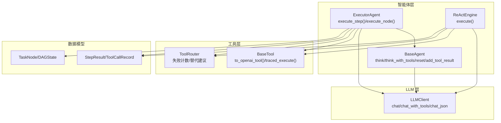
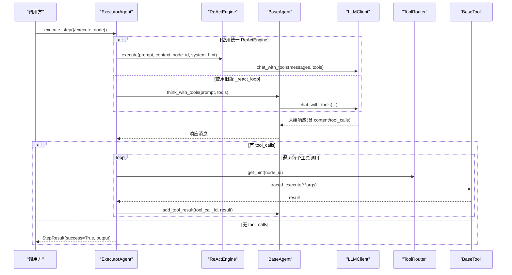
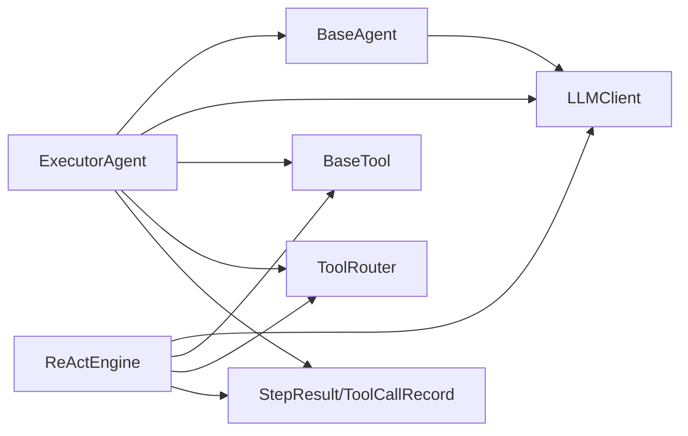

# ExecutorAgent API

<cite>
**本文引用的文件**
- [agents/executor.py](file://agents/executor.py)
- [react/engine.py](file://react/engine.py)
- [agents/base.py](file://agents/base.py)
- [tools/base.py](file://tools/base.py)
- [llm/client.py](file://llm/client.py)
- [schema.py](file://schema.py)
- [tools/router.py](file://tools/router.py)
- [config.py](file://config.py)
- [main.py](file://main.py)
- [tests/test_real_tools.py](file://tests/test_real_tools.py)
</cite>

## 目录
1. [简介](#简介)
2. [项目结构](#项目结构)
3. [核心组件](#核心组件)
4. [架构总览](#架构总览)
5. [详细组件分析](#详细组件分析)
6. [依赖分析](#依赖分析)
7. [性能考量](#性能考量)
8. [故障排查指南](#故障排查指南)
9. [结论](#结论)
10. [附录](#附录)

## 简介
本文件为 ExecutorAgent 与 ReAct 执行引擎的详细 API 参考文档，聚焦以下主题：
- 核心接口：execute_step()、execute_node()、execute_action()（注：execute_action 为内部工具调用封装，详见“工具调用方法”）
- ReAct 循环实现细节：思考（Thought）、行动（Action）、观察（Observe）三阶段
- 工具系统交互：工具参数校验、执行结果处理、错误与重试机制
- 执行状态管理与进度报告：StepResult、ToolCallRecord、DAGState
- LLM 客户端集成与上下文传递：LLMClient、BaseAgent、上下文压缩
- 完整执行流程示例与调试技巧

## 项目结构
围绕 ExecutorAgent 与 ReAct 引擎的关键模块与职责概览：
- agents/executor.py：ExecutorAgent 实现，提供 execute_step()/execute_node() 以及内部 ReAct 循环
- react/engine.py：统一 ReActEngine，抽取公共 ReAct 循环逻辑，支持可选集成
- agents/base.py：BaseAgent 抽象，封装 LLM 交互、消息历史、上下文压缩
- llm/client.py：LLMClient，统一 OpenAI 兼容 API，支持重试与追踪
- tools/base.py：BaseTool 抽象与 traced_execute() 追踪包装
- tools/router.py：ToolRouter，失败计数与替代工具建议
- schema.py：StepResult、ToolCallRecord、TaskNode、DAGState 等数据模型
- config.py：全局配置，含 ReAct 引擎开关、最大迭代、工具失败阈值、LLM 重试等
- main.py：入口程序，注册工具、创建 Orchestrator 并驱动执行
- tests/test_real_tools.py：工具真实调用测试，验证工具执行与错误处理

图表来源
- [agents/executor.py:66-323](file://agents/executor.py#L66-L323)
- [react/engine.py:43-246](file://react/engine.py#L43-L246)
- [agents/base.py:29-183](file://agents/base.py#L29-L183)
- [llm/client.py:32-420](file://llm/client.py#L32-L420)
- [tools/base.py:22-175](file://tools/base.py#L22-L175)
- [tools/router.py:47-168](file://tools/router.py#L47-L168)
- [schema.py:352-361](file://schema.py#L352-L361)
- [schema.py:157-176](file://schema.py#L157-L176)
- [schema.py:217-232](file://schema.py#L217-L232)

章节来源
- [agents/executor.py:66-323](file://agents/executor.py#L66-L323)
- [react/engine.py:43-246](file://react/engine.py#L43-L246)
- [agents/base.py:29-183](file://agents/base.py#L29-L183)
- [llm/client.py:32-420](file://llm/client.py#L32-L420)
- [tools/base.py:22-175](file://tools/base.py#L22-L175)
- [tools/router.py:47-168](file://tools/router.py#L47-L168)
- [schema.py:352-361](file://schema.py#L352-L361)
- [schema.py:157-176](file://schema.py#L157-L176)
- [schema.py:217-232](file://schema.py#L217-L232)

## 核心组件
- ExecutorAgent
  - execute_step(step, context): 旧版 v1 入口，执行 Step 对应的 ReAct 循环
  - execute_node(node, context): v2 入口，执行 TaskNode（ACTION 类型）的 ReAct 循环
  - _react_loop(step_id, prompt, context): 旧版核心循环（当未启用统一 ReActEngine）
- ReActEngine（可选 v2 引擎）
  - execute(prompt, context, node_id, system_hint): 统一 ReAct 循环，支持 ToolRouter、迭代限制、工具调用记录
- BaseAgent
  - think()/think_json(): 文本/JSON 输出的 LLM 交互
  - think_with_tools(): 带工具调用的 LLM 交互，返回原始消息对象
  - add_tool_result(): 将工具结果注入消息历史（Observe 阶段）
  - reset(): 清空历史，保留 system prompt
- LLMClient
  - chat()/chat_with_tools()/chat_json(): 统一封装，支持重试与追踪
- BaseTool
  - to_openai_tool(): 生成 OpenAI function schema
  - traced_execute(): 带追踪的工具执行入口（受 TRACING_ENABLED 控制）
- ToolRouter
  - record_success()/record_failure(): 统计工具调用成功/失败与连续失败
  - get_hint(): 生成失败提示，建议替代工具
- 数据模型
  - StepResult/ToolCallRecord：单步执行结果与工具调用记录
  - TaskNode/DAGState：DAG 节点与集中式状态

章节来源
- [agents/executor.py:171-188](file://agents/executor.py#L171-L188)
- [agents/executor.py:131-164](file://agents/executor.py#L131-L164)
- [agents/executor.py:195-321](file://agents/executor.py#L195-L321)
- [react/engine.py:84-241](file://react/engine.py#L84-L241)
- [agents/base.py:87-168](file://agents/base.py#L87-L168)
- [llm/client.py:73-177](file://llm/client.py#L73-L177)
- [tools/base.py:153-175](file://tools/base.py#L153-L175)
- [tools/base.py:60-124](file://tools/base.py#L60-L124)
- [tools/router.py:82-147](file://tools/router.py#L82-L147)
- [schema.py:352-361](file://schema.py#L352-L361)
- [schema.py:342-350](file://schema.py#L342-L350)
- [schema.py:157-176](file://schema.py#L157-L176)
- [schema.py:217-232](file://schema.py#L217-L232)

## 架构总览
ExecutorAgent 与 ReAct 引擎的协作关系与数据流：

图表来源
- [agents/executor.py:171-188](file://agents/executor.py#L171-L188)
- [agents/executor.py:131-164](file://agents/executor.py#L131-L164)
- [agents/executor.py:195-321](file://agents/executor.py#L195-L321)
- [react/engine.py:84-241](file://react/engine.py#L84-L241)
- [agents/base.py:123-168](file://agents/base.py#L123-L168)
- [llm/client.py:125-177](file://llm/client.py#L125-L177)
- [tools/base.py:60-124](file://tools/base.py#L60-L124)
- [tools/router.py:123-147](file://tools/router.py#L123-L147)

## 详细组件分析

### ExecutorAgent API
- execute_step(step, context="")
  - 功能：执行单个 Step 的 ReAct 循环（旧版 v1 接口）
  - 输入：
    - step: Step 对象（包含 id/description/dependencies/status/result）
    - context: 由上游步骤结果拼接的上下文字符串
  - 行为：
    - 若启用统一 ReActEngine，则委托给 ReActEngine.execute()
    - 否则调用内部 _react_loop(step.id, prompt, context)
  - 返回：StepResult（包含 success、output、tool_calls_log）

- execute_node(node, context="")
  - 功能：执行单个 TaskNode（ACTION 类型）的 ReAct 循环（v2 入口）
  - 输入：
    - node: TaskNode（包含 id、node_type、description、exit_criteria、parent_id 等）
    - context: DAGState.get_node_context() 生成的上下文字符串
  - 行为：
    - 构造 prompt（包含节点描述与 exit_criteria）
    - 若启用统一 ReActEngine，则委托给 ReActEngine.execute()
    - 否则调用内部 _react_loop(node.id, prompt, context)
  - 返回：StepResult

- _react_loop(step_id, prompt, context="")
  - 功能：核心 ReAct 循环（旧版实现）
  - 关键步骤：
    - reset() 清空历史，避免上一步历史污染
    - tool_router.reset_node(node_id) 清理节点统计
    - 若 context 非空，追加到 prompt
    - 迭代上限由 MAX_REACT_ITERATIONS 控制
    - 每轮：
      - think_with_tools(prompt 或 continue_msg, tools, temperature=0.5)
      - 若无 tool_calls：返回最终答案（success=True）
      - 若有 tool_calls：
        - 解析参数（JSON），记录 ToolCallRecord
        - 查找工具并执行 traced_execute()，统计成功/失败
        - 将结果以 tool 角色注入消息历史（add_tool_result）
        - 若检测到错误，附加明确标记以便 LLM 停止或重试
  - 返回：StepResult（成功或失败）

- execute_action()（内部封装）
  - 功能：在 ReAct 循环中执行工具调用的内部封装
  - 实现：在 _react_loop 中遍历 tool_calls，调用 traced_execute() 并记录结果
  - 错误处理：捕获异常、标记 has_error、记录 ToolCallRecord、注入消息历史

章节来源
- [agents/executor.py:171-188](file://agents/executor.py#L171-L188)
- [agents/executor.py:131-164](file://agents/executor.py#L131-L164)
- [agents/executor.py:195-321](file://agents/executor.py#L195-L321)

### ReActEngine API（可选 v2 引擎）
- execute(prompt, context="", node_id=None, system_hint="")
  - 功能：统一 ReAct 循环，替代 ExecutorAgent 内部 _react_loop
  - 输入：
    - prompt：主任务提示
    - context：来自依赖/上一步的上下文
    - node_id：节点标识，用于 ToolRouter 统计
    - system_hint：系统级提示
  - 行为：
    - 若 context 非空，拼接到 prompt
    - 迭代上限由 MAX_REACT_ITERATIONS 控制
    - 每轮：
      - chat_with_tools(messages, tools, temperature=0.5)
      - 记录 assistant 消息（含 tool_calls）
      - 遍历 tool_calls：
        - 解析参数（JSON）
        - 查找工具并执行 traced_execute()
        - 记录 ToolCallRecord（成功截断、错误保留全文）
        - 以 tool 角色注入消息历史
  - 返回：StepResult

- get_node_summary(node_id)
  - 功能：返回节点工具使用摘要（用于可观测性）

章节来源
- [react/engine.py:84-241](file://react/engine.py#L84-L241)
- [react/engine.py:243-246](file://react/engine.py#L243-L246)

### BaseAgent 与 LLM 客户端集成
- think(user_input, **kwargs)
  - 功能：发送 user_input 与完整历史到 LLM，自动上下文压缩
  - 返回：文本响应

- think_json(user_input, **kwargs)
  - 功能：要求 LLM 返回 JSON，支持降级解析

- think_with_tools(user_input, tools, **kwargs)
  - 功能：发送 user_input + 工具定义，返回原始响应消息对象
  - 作用：ReAct 循环的核心，LLM 选择工具

- add_tool_result(tool_call_id, result)
  - 功能：将工具执行结果注入消息历史（Observe 阶段）

- reset()
  - 功能：清空历史，仅保留 system prompt

- LLMClient
  - chat()/chat_with_tools()/chat_json()：统一封装 OpenAI 兼容 API
  - 重试机制：LLM_RETRY_ENABLED=true 时启用指数退避重试
  - 追踪：TRACING_ENABLED=true 时创建 spans 并记录属性

章节来源
- [agents/base.py:87-168](file://agents/base.py#L87-L168)
- [llm/client.py:73-177](file://llm/client.py#L73-L177)
- [llm/client.py:317-420](file://llm/client.py#L317-L420)

### 工具系统与参数校验
- BaseTool
  - name/description/parameters_schema：供 LLM 理解与参数校验
  - to_openai_tool()：生成 OpenAI function schema
  - traced_execute(**kwargs)：带追踪的执行入口（TRACING_ENABLED 控制）

- 工具参数验证与执行
  - 参数解析：JSON 字符串解析失败时回退为空参数
  - 工具查找：未知工具名返回错误字符串并记录失败
  - 执行异常：捕获异常并记录失败，返回错误字符串
  - 结果截断：成功结果最多保留 1000 字符，错误保留全文

- 工具路由与失败切换
  - ToolRouter：统计每个节点的工具调用次数、失败次数、连续失败
  - 建议提示：连续失败超过阈值（TOOL_FAILURE_THRESHOLD）时，向 LLM 注入替代工具建议

章节来源
- [tools/base.py:22-175](file://tools/base.py#L22-L175)
- [tools/base.py:60-124](file://tools/base.py#L60-L124)
- [tools/router.py:82-147](file://tools/router.py#L82-L147)
- [config.py:54](file://config.py#L54)

### 执行状态管理与进度报告
- StepResult
  - 字段：step_id、success、output、tool_calls_log
  - 用途：统一表示单步/节点执行结果

- ToolCallRecord
  - 字段：tool_name、parameters、result
  - 用途：UI 展示与调试

- DAGState
  - get_node_context(node_id, dependency_ids)：构建节点输入上下文
  - merge_result(node_id, output)：写入共享状态（覆盖式）

章节来源
- [schema.py:352-361](file://schema.py#L352-L361)
- [schema.py:342-350](file://schema.py#L342-L350)
- [schema.py:217-232](file://schema.py#L217-L232)

### ReAct 循环实现细节
- 三阶段流程
  - 思考（Thought）：LLM 基于上下文与工具定义推理下一步
  - 行动（Action）：LLM 通过 function calling 选择工具并提供参数
  - 观察（Observe）：工具执行结果注入消息历史，供下一轮思考使用

- 迭代控制与超时
  - 迭代上限：MAX_REACT_ITERATIONS
  - 超时：工具执行受各自超时限制（如 CODE_EXEC_TIMEOUT、SHELL_EXEC_TIMEOUT）

- 错误处理与恢复
  - LLM 调用失败：返回 StepResult(success=False)
  - 工具执行错误：标记失败并注入明确错误提示，引导 LLM 决策
  - ToolRouter：连续失败触发替代建议，避免死循环

章节来源
- [agents/executor.py:195-321](file://agents/executor.py#L195-L321)
- [react/engine.py:118-241](file://react/engine.py#L118-L241)
- [config.py:24](file://config.py#L24)
- [config.py:72-76](file://config.py#L72-L76)

### 与 LLM 客户端的集成与上下文传递
- 上下文压缩
  - BaseAgent 在每次 LLM 调用前检查消息长度，必要时通过 ContextManager 压缩
- 消息历史
  - BaseAgent 维护 _messages，think_with_tools() 将 assistant 响应（含 tool_calls）记录
  - add_tool_result() 以 tool 角色追加工具结果
- 统一 LLMClient
  - chat()/chat_with_tools()/chat_json() 统一封装，支持重试与追踪

章节来源
- [agents/base.py:87-168](file://agents/base.py#L87-L168)
- [llm/client.py:73-177](file://llm/client.py#L73-L177)
- [llm/client.py:317-420](file://llm/client.py#L317-L420)

### 执行流程示例与调试技巧
- 示例流程（DAG ACTION 节点）
  1) DAGState.get_node_context() 构建上下文
  2) ExecutorAgent.execute_node() 构造 prompt 并调用 ReActEngine 或 _react_loop
  3) think_with_tools() 请求 LLM，得到 tool_calls
  4) 遍历 tool_calls，调用 traced_execute() 执行工具
  5) add_tool_result() 注入结果，继续下一轮思考
  6) 无 tool_calls 时返回 StepResult(success=True, output)

- 调试技巧
  - 启用详细日志：python main.py -v
  - 启用 LLM 重试：设置 LLM_RETRY_ENABLED=true
  - 启用追踪：设置 TRACING_ENABLED=true，查看 spans 与属性
  - 工具测试：运行真实工具测试脚本，验证工具执行与错误处理

章节来源
- [main.py:415-477](file://main.py#L415-L477)
- [tests/test_real_tools.py:13-110](file://tests/test_real_tools.py#L13-L110)

## 依赖分析
- 组件耦合与内聚
  - ExecutorAgent 与 ReActEngine：通过统一接口（execute）解耦，旧版仍保留 _react_loop
  - BaseAgent 与 LLMClient：高内聚，消息管理与上下文压缩集中在 BaseAgent
  - 工具系统：BaseTool 抽象 + ToolRouter 失败路由，降低 LLM 与工具耦合
- 外部依赖
  - OpenAI 兼容 API：LLMClient 统一封装
  - OpenTelemetry：traced_execute 与 LLMClient 的可选追踪

图表来源
- [agents/executor.py:66-323](file://agents/executor.py#L66-L323)
- [react/engine.py:43-246](file://react/engine.py#L43-L246)
- [agents/base.py:29-183](file://agents/base.py#L29-L183)
- [llm/client.py:32-420](file://llm/client.py#L32-L420)
- [tools/base.py:22-175](file://tools/base.py#L22-L175)
- [tools/router.py:47-168](file://tools/router.py#L47-L168)
- [schema.py:352-361](file://schema.py#L352-L361)

## 性能考量
- 迭代上限与吞吐
  - MAX_REACT_ITERATIONS 控制 ReAct 循环次数，避免长尾执行
- 工具并发与资源
  - 工具执行受 CODE_MAX_CONCURRENT/SHELL_MAX_CONCURRENT 限制
  - 工具输出最大字节 SUBPROCESS_MAX_OUTPUT_BYTES，防止内存膨胀
- LLM 调用重试
  - LLM_RETRY_ENABLED=true 时启用指数退避重试，提升鲁棒性
- 追踪与开销
  - TRACING_ENABLED=true 时增加 spans 与属性记录，注意性能影响

章节来源
- [config.py:24](file://config.py#L24)
- [config.py:72-76](file://config.py#L72-L76)
- [config.py:83-85](file://config.py#L83-L85)
- [config.py:102-109](file://config.py#L102-L109)

## 故障排查指南
- LLM 调用失败
  - 现象：StepResult(success=False, output 包含错误信息)
  - 排查：检查 LLM_BASE_URL/API_KEY/模型配置；开启 LLM_RETRY_ENABLED 观察重试
- 工具执行错误
  - 现象：工具返回 "Error:" 前缀或异常
  - 排查：查看 ToolCallRecord.result；检查工具参数 schema；确认 SANDBOX_DIR 权限
- 工具失败频繁
  - 现象：ToolRouter 连续失败计数上升
  - 排查：关注 get_hint() 注入的替代建议；调整 TOOL_FAILURE_THRESHOLD
- 上下文过长导致截断
  - 现象：消息被压缩
  - 排查：增大 MAX_CONTEXT_TOKENS 或优化 prompt 设计
- 追踪未生效
  - 现象：无 spans 输出
  - 排查：确认 TRACING_ENABLED=true 且后端配置正确

章节来源
- [agents/executor.py:251-258](file://agents/executor.py#L251-L258)
- [agents/executor.py:288-294](file://agents/executor.py#L288-L294)
- [react/engine.py:160-167](file://react/engine.py#L160-L167)
- [react/engine.py:198-204](file://react/engine.py#L198-L204)
- [tools/router.py:91-99](file://tools/router.py#L91-L99)
- [llm/client.py:63-67](file://llm/client.py#L63-L67)

## 结论
ExecutorAgent 与 ReActEngine 提供了统一、可扩展的 ReAct 执行框架：
- 通过可选的 ReActEngine，实现旧版与新版路径的统一
- 工具系统与 ToolRouter 提升了工具选择与失败恢复能力
- LLMClient 的重试与追踪增强了鲁棒性与可观测性
- 数据模型（StepResult、ToolCallRecord、DAGState）支撑了状态管理与进度报告
结合本文 API 参考与调试技巧，可在复杂任务中稳定落地 ReAct 执行。

## 附录
- 配置项参考（关键）
  - ENABLE_REACT_ENGINE_V2：是否启用统一 ReActEngine
  - MAX_REACT_ITERATIONS：ReAct 循环最大迭代
  - TOOL_FAILURE_THRESHOLD：工具连续失败阈值
  - LLM_RETRY_ENABLED/LLM_RETRY_MAX_ATTEMPTS/LLM_RETRY_BACKOFF_FACTOR：LLM 重试策略
  - TRACING_ENABLED/TRACING_BACKEND/TRACING_ENDPOINT：追踪配置
- 工具清单
  - web_search、execute_python、file_ops、shell_tool（通过 BaseTool 抽象与 OpenAI schema）

章节来源
- [config.py:80](file://config.py#L80)
- [config.py:24](file://config.py#L24)
- [config.py:54](file://config.py#L54)
- [config.py:83-85](file://config.py#L83-L85)
- [config.py:102-109](file://config.py#L102-L109)