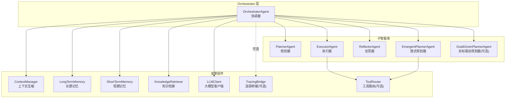
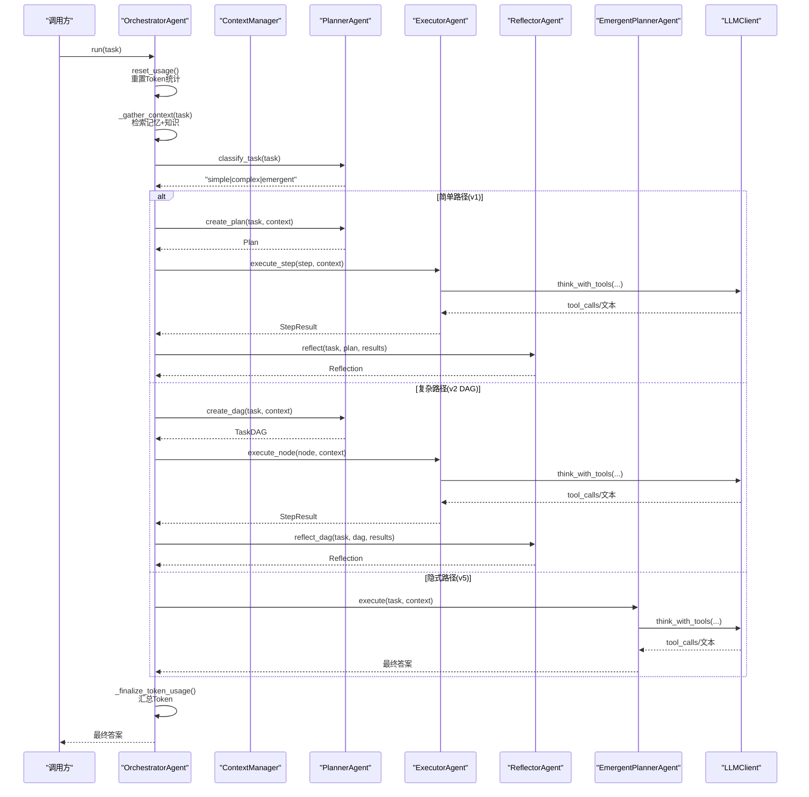
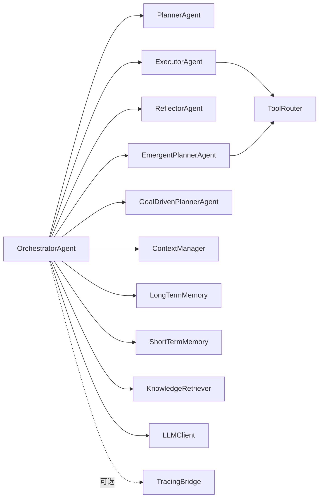

# OrchestratorAgent API

<cite>
**本文引用的文件**
- [agents/orchestrator.py](file://agents/orchestrator.py)
- [agents/base.py](file://agents/base.py)
- [agents/planner.py](file://agents/planner.py)
- [agents/executor.py](file://agents/executor.py)
- [agents/reflector.py](file://agents/reflector.py)
- [agents/emergent_planner.py](file://agents/emergent_planner.py)
- [schema.py](file://schema.py)
- [config.py](file://config.py)
- [tracing/bridge.py](file://tracing/bridge.py)
- [tools/router.py](file://tools/router.py)
- [main.py](file://main.py)
</cite>

## 目录
1. [简介](#简介)
2. [项目结构](#项目结构)
3. [核心组件](#核心组件)
4. [架构总览](#架构总览)
5. [详细组件分析](#详细组件分析)
6. [依赖分析](#依赖分析)
7. [性能考虑](#性能考虑)
8. [故障排查指南](#故障排查指南)
9. [结论](#结论)
10. [附录](#附录)

## 简介
本文件为 OrchestratorAgent 类的详细API参考文档，聚焦以下方面：
- 构造函数参数与初始化流程
- run() 主执行方法的完整生命周期
- 上下文收集方法与任务路由策略
- 事件回调系统与全链路追踪集成
- Token使用追踪与汇总
- 与子智能体（Planner、Executor、Reflector、EmergentPlanner、GoalDrivenPlanner）的交互接口
- 配置参数对行为的影响（如重规划限制、追踪开关、目标驱动规划开关等）
- 错误处理最佳实践与性能优化建议
- 完整初始化示例与异步调用示例

## 项目结构
OrchestratorAgent 位于 agents/orchestrator.py，是多智能体流水线的中央协调者，负责：
- 收集上下文（历史记忆 + 知识库）
- 任务复杂度分类与路由（v1/v2/v5 路径）
- 规划与执行（顺序/并行）
- 反思与重规划（局部/整体重规划）
- 结果存储与Token追踪

图表来源
- [agents/orchestrator.py:60-150](file://agents/orchestrator.py#L60-L150)
- [agents/planner.py:147-206](file://agents/planner.py#L147-L206)
- [agents/executor.py:66-125](file://agents/executor.py#L66-L125)
- [agents/reflector.py:59-83](file://agents/reflector.py#L59-L83)
- [agents/emergent_planner.py:72-128](file://agents/emergent_planner.py#L72-L128)
- [tracing/bridge.py:38-116](file://tracing/bridge.py#L38-L116)
- [tools/router.py:47-168](file://tools/router.py#L47-L168)

章节来源
- [agents/orchestrator.py:60-150](file://agents/orchestrator.py#L60-L150)

## 核心组件
- OrchestratorAgent：顶层协调器，编排混合「规划-执行-反思」流水线
- PlannerAgent：两阶段混合分类器，自动路由到 v1/v2/v5 路径
- ExecutorAgent：ReAct 循环执行器，支持 DAG 与 v1 步骤
- ReflectorAgent：质量门控与反思评估
- EmergentPlannerAgent：隐式规划（TODO 列表）执行器
- GoalDrivenPlannerAgent：目标驱动规划（v8，可选）
- TracingBridge：事件到 OpenTelemetry Span 的桥接（可选）

章节来源
- [agents/orchestrator.py:60-150](file://agents/orchestrator.py#L60-L150)
- [agents/planner.py:147-206](file://agents/planner.py#L147-L206)
- [agents/executor.py:66-125](file://agents/executor.py#L66-L125)
- [agents/reflector.py:59-83](file://agents/reflector.py#L59-L83)
- [agents/emergent_planner.py:72-128](file://agents/emergent_planner.py#L72-L128)
- [tracing/bridge.py:38-116](file://tracing/bridge.py#L38-L116)

## 架构总览
OrchestratorAgent 的运行时架构与事件流如下：

图表来源
- [agents/orchestrator.py:158-222](file://agents/orchestrator.py#L158-L222)
- [agents/orchestrator.py:229-250](file://agents/orchestrator.py#L229-L250)
- [agents/planner.py:213-259](file://agents/planner.py#L213-L259)
- [agents/executor.py:131-188](file://agents/executor.py#L131-L188)
- [agents/reflector.py:135-195](file://agents/reflector.py#L135-L195)
- [agents/emergent_planner.py:134-276](file://agents/emergent_planner.py#L134-L276)

## 详细组件分析

### 构造函数与初始化
- 参数
  - llm_client: LLMClient | None（可选，未提供时内部创建）
  - tools: list[BaseTool] | None（可选，传递给子执行器）
  - on_event: Callable[[str, Any], None] | None（可选，UI事件回调）
- 初始化要点
  - 创建 ContextManager 与 LLMClient（共享）
  - 可选追踪集成：当 config.TRACING_ENABLED 为真时，初始化 TracingBridge，并通过多播将事件同时发送给 on_event 与 TracingBridge
  - 初始化子智能体：PlannerAgent、ExecutorAgent、ReflectorAgent、EmergentPlannerAgent
  - 可选 v8 目标驱动规划器：当 ENABLE_GOAL_DRIVEN_PLANNER 为真时启用
  - 初始化记忆与知识检索：ShortTermMemory、LongTermMemory、KnowledgeRetriever
  - 读取配置：MAX_REPLAN_ATTEMPTS（最大重规划次数）

章节来源
- [agents/orchestrator.py:94-152](file://agents/orchestrator.py#L94-L152)
- [config.py:21-25](file://config.py#L21-L25)
- [config.py:102-108](file://config.py#L102-L108)
- [config.py:90-96](file://config.py#L90-L96)

### run() 主执行方法
- 输入
  - task: str（用户任务）
- 输出
  - str（最终答案）
- 行为
  - 发出 task_start 事件
  - 重置 LLM Token 使用统计
  - 收集上下文：_gather_context
  - 任务复杂度分类：PlannerAgent.classify_task
  - 路由到对应路径：
    - simple：v1 扁平计划 → 顺序执行 → reflect
    - complex：v2 DAG → 并行 Super-step 执行 → reflect_dag
    - emergent：v5 隐式规划（TODO 列表）→ 执行完成后 compile 结果
  - 存储结果：_store_memory，更新短期记忆
  - Token 汇总：_finalize_token_usage，发出 token_usage_summary
  - 发出 task_complete 事件

章节来源
- [agents/orchestrator.py:158-222](file://agents/orchestrator.py#L158-L222)

### 上下文收集方法
- _gather_context(task: str) -> str
  - 从 LongTermMemory 检索历史经验并格式化
  - 从 KnowledgeRetriever 检索相关知识并格式化
  - 将 user 与 assistant 的消息写入 ShortTermMemory
  - 合并为单一上下文字符串返回

章节来源
- [agents/orchestrator.py:229-250](file://agents/orchestrator.py#L229-L250)

### 任务路由与执行路径

#### v1 路径（简单）
- 步骤
  - PlannerAgent.create_plan
  - ExecutorAgent.execute_step 顺序执行
  - ReflectorAgent.reflect 进行反思
  - 若失败且未达最大重规划次数，则 PlannerAgent.replan 生成新计划并保留最近一次失败结果
- 依赖
  - PlannerAgent、ExecutorAgent、ReflectorAgent

章节来源
- [agents/orchestrator.py:194-222](file://agents/orchestrator.py#L194-L222)
- [agents/orchestrator.py:257-352](file://agents/orchestrator.py#L257-L352)
- [agents/planner.py:369-431](file://agents/planner.py#L369-L431)
- [agents/executor.py:171-188](file://agents/executor.py#L171-L188)
- [agents/reflector.py:202-254](file://agents/reflector.py#L202-L254)

#### v2 路径（复杂，DAG）
- 步骤
  - PlannerAgent.create_dag
  - DAGExecutor 并行 Super-step 执行
  - ReflectorAgent.reflect_dag
  - 若失败且未达最大重规划次数，则 PlannerAgent.replan_subtree 仅重建失败子树
- 依赖
  - PlannerAgent、ExecutorAgent、ReflectorAgent、DAGExecutor（在 Orchestrator 内部创建）

章节来源
- [agents/orchestrator.py:199-222](file://agents/orchestrator.py#L199-L222)
- [agents/orchestrator.py:439-508](file://agents/orchestrator.py#L439-L508)
- [agents/planner.py:481-566](file://agents/planner.py#L481-L566)
- [agents/reflector.py:135-195](file://agents/reflector.py#L135-L195)

#### v5 路径（隐式规划）
- 步骤
  - 若启用 v8 目标驱动规划器：GoalDrivenPlannerAgent.execute
  - 否则：EmergentPlannerAgent.execute（TODO 列表驱动）
  - 轻量级质量门控：检查 TODO 列表中 BLOCKED 项
- 依赖
  - EmergentPlannerAgent（或 GoalDrivenPlannerAgent，取决于配置）

章节来源
- [agents/orchestrator.py:204-222](file://agents/orchestrator.py#L204-L222)
- [agents/orchestrator.py:370-432](file://agents/orchestrator.py#L370-L432)
- [agents/emergent_planner.py:134-276](file://agents/emergent_planner.py#L134-L276)

### 事件回调系统
- _emit(event: str, data: Any = None)：向 UI 回调发送事件，异常被隔离记录，不影响主流程
- 多播：当启用追踪时，Orchestrator 将 on_event 与 TracingBridge.on_event 组合成多播回调，确保 UI 与追踪同时收到事件
- TracingBridge：将事件映射为 OpenTelemetry Span，维护阶段、节点、TODO、DAG 等层次关系，异常安全

章节来源
- [agents/orchestrator.py:590-600](file://agents/orchestrator.py#L590-L600)
- [agents/orchestrator.py:112-114](file://agents/orchestrator.py#L112-L114)
- [tracing/bridge.py:117-134](file://tracing/bridge.py#L117-L134)
- [tracing/bridge.py:254-294](file://tracing/bridge.py#L254-L294)

### Token 使用追踪
- _finalize_token_usage()：从 LLMClient 获取调用记录，按引擎与全局汇总，生成 TokenUsageSummary
- Orchestrator.run 在执行结束后发出 token_usage_summary 事件
- 配置开关：config.TOKEN_TRACKING_ENABLED 控制是否启用追踪

章节来源
- [agents/orchestrator.py:532-554](file://agents/orchestrator.py#L532-L554)
- [config.py:87-88](file://config.py#L87-L88)

### 与子智能体的交互接口
- PlannerAgent
  - classify_task(task)：两阶段混合分类
  - create_plan(task, context) / create_dag(task, context)：生成 v1/v2 计划
  - replan(...) / replan_subtree(...)：重规划
  - adapt_plan(...) / apply_adaptations(...)：自适应规划
- ExecutorAgent
  - execute_step(step, context)：v1 步骤执行
  - execute_node(node, context)：DAG 节点执行
- ReflectorAgent
  - reflect(...) / reflect_dag(...)：反思评估
  - validate_exit_criteria(node, result)：逐节点完成判据验证
- EmergentPlannerAgent
  - execute(task, context)：隐式规划执行
- GoalDrivenPlannerAgent
  - execute(task, context)：目标驱动规划执行（可选）

章节来源
- [agents/planner.py:213-259](file://agents/planner.py#L213-L259)
- [agents/planner.py:369-431](file://agents/planner.py#L369-L431)
- [agents/planner.py:481-566](file://agents/planner.py#L481-L566)
- [agents/planner.py:573-722](file://agents/planner.py#L573-L722)
- [agents/executor.py:171-188](file://agents/executor.py#L171-L188)
- [agents/executor.py:131-164](file://agents/executor.py#L131-L164)
- [agents/reflector.py:90-128](file://agents/reflector.py#L90-L128)
- [agents/reflector.py:202-254](file://agents/reflector.py#L202-L254)
- [agents/reflector.py:135-195](file://agents/reflector.py#L135-L195)
- [agents/emergent_planner.py:134-276](file://agents/emergent_planner.py#L134-L276)

### 配置参数对行为的影响
- 任务路由
  - PLAN_MODE：强制路由到 simple/complex/emergent（默认 auto）
  - EMERGENT_PLANNING_ENABLED：控制 v5 隐式规划开关
- 执行限制
  - MAX_REPLAN_ATTEMPTS：最大重规划次数
  - MAX_REACT_ITERATIONS：ReAct 循环最大迭代次数
- DAG 执行
  - MAX_PARALLEL_NODES：每轮 Super-step 最大并行节点数
  - NODE_EXECUTION_TIMEOUT：节点执行超时
- 工具与路由
  - TOOL_FAILURE_THRESHOLD：工具连续失败阈值，触发 ToolRouter 建议
- 目标驱动规划（v8）
  - ENABLE_GOAL_DRIVEN_PLANNER：启用 v8 目标驱动规划器
  - GOAL_REANCHOR_INTERVAL / GOAL_REFLECTION_INTERVAL / GOAL_DRIVEN_STAGNATION_WINDOW：目标锚定与停滞检测
- 追踪
  - TRACING_ENABLED：开启全链路追踪
  - TRACING_BACKEND / TRACING_ENDPOINT / TRACING_SAMPLE_RATE / TRACING_LOG_PROMPTS：追踪导出与采样
- Token 追踪
  - TOKEN_TRACKING_ENABLED：开启 Token 消耗追踪

章节来源
- [config.py:40](file://config.py#L40)
- [config.py:63](file://config.py#L63)
- [config.py:25](file://config.py#L25)
- [config.py:44](file://config.py#L44)
- [config.py:58](file://config.py#L58)
- [config.py:54](file://config.py#L54)
- [config.py:92](file://config.py#L92)
- [config.py:102-108](file://config.py#L102-L108)
- [config.py:87](file://config.py#L87)

### 错误处理最佳实践
- UI 回调异常隔离：_emit 内部 try-except，避免 UI 异常影响主流程
- 多播回调：原始 on_event 与 TracingBridge.on_event 各自异常互不影响
- 反思失败兜底：Reflector 在解析失败时返回 passed=False，触发重规划
- 任务超时与异常：EmergentPlanner 对 TODO 执行设置超时，异常转为失败 StepResult
- 工具失败切换：ToolRouter 在连续失败超过阈值时向 LLM 提供替代工具建议

章节来源
- [agents/orchestrator.py:590-600](file://agents/orchestrator.py#L590-L600)
- [tracing/bridge.py:117-134](file://tracing/bridge.py#L117-L134)
- [agents/reflector.py:179-195](file://agents/reflector.py#L179-L195)
- [agents/reflector.py:240-254](file://agents/reflector.py#L240-L254)
- [agents/emergent_planner.py:213-237](file://agents/emergent_planner.py#L213-L237)
- [tools/router.py:101-147](file://tools/router.py#L101-L147)

### 性能优化建议
- 合理设置 MAX_REPLAN_ATTEMPTS，避免过度重规划
- 使用 MAX_PARALLEL_NODES 控制 DAG 并行度，平衡吞吐与资源占用
- 启用 TOOL_FAILURE_THRESHOLD 与 ToolRouter，减少工具失败导致的无效循环
- 适当降低 TRACING_SAMPLE_RATE 或关闭 TRACING_LOG_PROMPTS 以减少追踪开销
- 使用 ContextManager 压缩上下文，避免超出 LLM 上下文长度限制

[本节为通用指导，不直接分析具体文件]

## 依赖分析

图表来源
- [agents/orchestrator.py:115-141](file://agents/orchestrator.py#L115-L141)
- [agents/executor.py:107-124](file://agents/executor.py#L107-L124)
- [agents/emergent_planner.py:107-127](file://agents/emergent_planner.py#L107-L127)

章节来源
- [agents/orchestrator.py:115-141](file://agents/orchestrator.py#L115-L141)

## 性能考虑
- 事件驱动 UI：通过 on_event 事件流渲染，避免阻塞主执行
- 并行执行：DAG 路径采用 Super-step 并行，提升吞吐
- 上下文压缩：ContextManager 在消息过长时自动压缩，降低 Token 消耗
- 工具失败切换：ToolRouter 减少无效工具调用，提高成功率
- 追踪采样：通过 TRACING_SAMPLE_RATE 控制追踪开销

[本节为通用指导，不直接分析具体文件]

## 故障排查指南
- 任务长时间无响应
  - 检查 MAX_REACT_ITERATIONS 与 NODE_EXECUTION_TIMEOUT 设置
  - 查看是否卡在某个工具调用或 LLM 输出解析
- 反思失败导致无限重规划
  - 检查 MAX_REPLAN_ATTEMPTS 设置
  - 确认 Reflector 的 JSON 解析是否稳定
- 追踪异常影响主流程
  - TracingBridge 为异常安全设计，确认是否启用了追踪
- Token 消耗异常
  - 确认 TOKEN_TRACKING_ENABLED 开关
  - 检查 LLMClient 的调用记录是否正确上报

章节来源
- [config.py:25](file://config.py#L25)
- [config.py:58](file://config.py#L58)
- [config.py:87](file://config.py#L87)
- [tracing/bridge.py:117-134](file://tracing/bridge.py#L117-L134)
- [agents/reflector.py:179-195](file://agents/reflector.py#L179-L195)

## 结论
OrchestratorAgent 通过清晰的事件驱动与模块化设计，实现了从任务复杂度分类到多路径执行与反思的完整闭环。结合 TracingBridge、ToolRouter、自适应规划与目标驱动规划等特性，能够在不同任务场景下自动选择最优路径，并提供可观测性与高鲁棒性。合理配置相关参数可显著提升稳定性与性能。

[本节为总结性内容，不直接分析具体文件]

## 附录

### API 参考速览

- 构造函数
  - 参数
    - llm_client: LLMClient | None
    - tools: list[BaseTool] | None
    - on_event: Callable[[str, Any], None] | None
  - 返回：无（初始化内部组件）
  - 异常：初始化期间异常会被隔离记录，不影响主流程
  - 示例：参见“初始化示例”

- run(task: str) -> str
  - 参数：task: str
  - 返回：最终答案（str）
  - 异常：主流程异常被捕获并记录，UI 回调异常被隔离
  - 示例：参见“异步调用示例”

- _gather_context(task: str) -> str
  - 功能：检索记忆与知识，合并为上下文字符串
  - 返回：上下文字符串
  - 异常：内部异常被隔离记录

- _execute_and_reflect_simple(task: str, plan: Plan, context: str) -> str
  - 功能：顺序执行 v1 计划并反思，支持重规划
  - 返回：最终答案（str）
  - 异常：失败步骤会被记录并触发重规划

- _execute_dag_and_reflect(dag: TaskDAG) -> str
  - 功能：并行执行 DAG 并反思，支持局部重规划
  - 返回：最终答案（str）
  - 异常：失败节点触发 replan_subtree

- _execute_emergent(task: str, context: str) -> str
  - 功能：执行 v5 隐式规划（TODO 列表）
  - 返回：最终答案（str）
  - 异常：TODO 列表阻塞时触发轻量级反思

- _finalize_token_usage() -> TokenUsageSummary
  - 功能：汇总 Token 使用情况
  - 返回：TokenUsageSummary
  - 异常：内部异常被隔离记录

- _store_memory(task: str, answer: str) -> None
  - 功能：将任务完成情况存入长期记忆
  - 异常：内部异常被隔离记录

- _emit(event: str, data: Any = None) -> None
  - 功能：向 UI 回调发送事件
  - 异常：异常被隔离记录，不影响主流程

- _make_multicast(*callbacks) -> Callable
  - 功能：创建多播回调，将事件分发给多个订阅者
  - 异常：各订阅者异常相互隔离

章节来源
- [agents/orchestrator.py:94-152](file://agents/orchestrator.py#L94-L152)
- [agents/orchestrator.py:158-222](file://agents/orchestrator.py#L158-L222)
- [agents/orchestrator.py:229-250](file://agents/orchestrator.py#L229-L250)
- [agents/orchestrator.py:257-352](file://agents/orchestrator.py#L257-L352)
- [agents/orchestrator.py:439-508](file://agents/orchestrator.py#L439-L508)
- [agents/orchestrator.py:370-432](file://agents/orchestrator.py#L370-L432)
- [agents/orchestrator.py:532-554](file://agents/orchestrator.py#L532-L554)
- [agents/orchestrator.py:556-567](file://agents/orchestrator.py#L556-L567)
- [agents/orchestrator.py:590-600](file://agents/orchestrator.py#L590-L600)
- [agents/orchestrator.py:570-588](file://agents/orchestrator.py#L570-L588)

### 初始化示例
- 基础初始化（CLI/交互模式）
  - 参考 main.py 中的 run_interactive/run_single，创建 LLMClient、工具列表与 OrchestratorAgent，并绑定 on_event
  - 示例路径：[main.py:451-455](file://main.py#L451-L455)、[main.py:487-492](file://main.py#L487-L492)

章节来源
- [main.py:451-455](file://main.py#L451-L455)
- [main.py:487-492](file://main.py#L487-L492)

### 异步调用示例
- 单任务异步执行
  - 参考 main.py 中的 run_single，创建 OrchestratorAgent 后 await run(task)
  - 示例路径：[main.py:479-492](file://main.py#L479-L492)

章节来源
- [main.py:479-492](file://main.py#L479-L492)