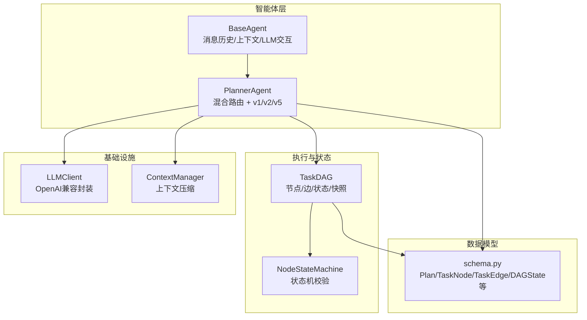
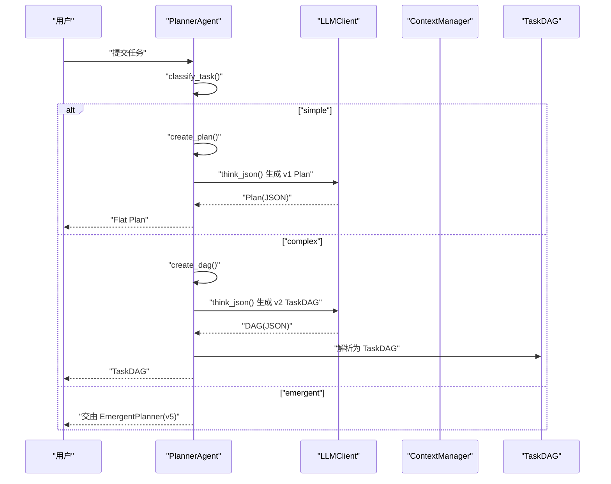
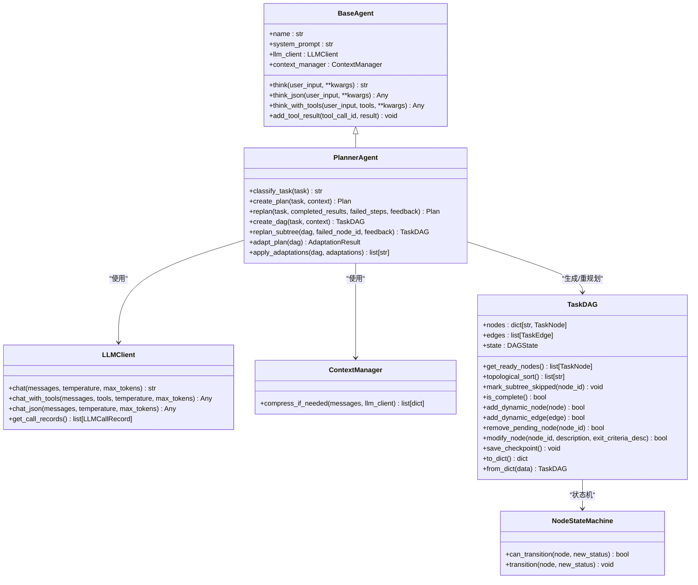

# PlannerAgent API

<cite>
**本文引用的文件**
- [agents/planner.py](file://agents/planner.py)
- [agents/base.py](file://agents/base.py)
- [dag/graph.py](file://dag/graph.py)
- [dag/state_machine.py](file://dag/state_machine.py)
- [llm/client.py](file://llm/client.py)
- [context/manager.py](file://context/manager.py)
- [schema.py](file://schema.py)
- [sxw_aicoding/docs/hybrid-plan-routing.md](file://sxw_aicoding/docs/hybrid-plan-routing.md)
- [sxw_aicoding/docs/emergent-planning.md](file://sxw_aicoding/docs/emergent-planning.md)
- [README.md](file://README.md)
</cite>

## 目录
1. [简介](#简介)
2. [项目结构](#项目结构)
3. [核心组件](#核心组件)
4. [架构总览](#架构总览)
5. [详细组件分析](#详细组件分析)
6. [依赖关系分析](#依赖关系分析)
7. [性能考量](#性能考量)
8. [故障排查指南](#故障排查指南)
9. [结论](#结论)
10. [附录](#附录)

## 简介
本文件为 PlannerAgent 及相关规划器类的详细 API 参考，聚焦以下核心接口与能力：
- 任务复杂度分类方法：classify_task()
- v1 规划生成：create_plan()
- v2 DAG 创建：create_dag()
- v1 重规划：replan()
- v2 子树重规划：replan_subtree()
- v3 自适应规划：adapt_plan()、apply_adaptations()
- v5 隐式规划路由（与 v1/v2 的差异与适用场景）
- 规划结果数据结构：Plan、TaskDAG、Step、TaskNode、TaskEdge、DAGState 等
- 与 LLM 客户端的交互方式与上下文管理
- 规划质量评估与反馈机制

## 项目结构
PlannerAgent 位于 agents/planner.py，继承自 BaseAgent，依赖 LLMClient、ContextManager、TaskDAG 与 schema 数据模型。混合路由机制在 classify_task() 中实现，自动在 v1、v2、v5 之间选择最优路径。

图表来源
- [agents/planner.py:147-934](file://agents/planner.py#L147-L934)
- [agents/base.py:29-183](file://agents/base.py#L29-L183)
- [dag/graph.py:43-627](file://dag/graph.py#L43-L627)
- [dag/state_machine.py:55-114](file://dag/state_machine.py#L55-L114)
- [llm/client.py:32-420](file://llm/client.py#L32-L420)
- [context/manager.py:22-187](file://context/manager.py#L22-L187)
- [schema.py:47-253](file://schema.py#L47-L253)

章节来源
- [README.md:22-76](file://README.md#L22-L76)
- [agents/planner.py:147-934](file://agents/planner.py#L147-L934)

## 核心组件
- PlannerAgent：混合规划路由与 v1/v2/v5 规划生成、重规划与自适应规划的核心实现。
- BaseAgent：统一的 LLM 交互、消息历史与上下文压缩能力。
- LLMClient：OpenAI 兼容 API 封装，支持重试、追踪与令牌统计。
- ContextManager：Token 估算与上下文压缩，避免超限。
- TaskDAG：DAG 规划的图结构、状态、拓扑排序、就绪节点发现、动态变更与快照。
- NodeStateMachine：节点状态机，强制合法状态转移。
- schema 数据模型：Plan、Step、TaskNode、TaskEdge、DAGState、AdaptAction、PlanAdaptation、AdaptationResult 等。

章节来源
- [agents/planner.py:147-934](file://agents/planner.py#L147-L934)
- [agents/base.py:29-183](file://agents/base.py#L29-L183)
- [dag/graph.py:43-627](file://dag/graph.py#L43-L627)
- [dag/state_machine.py:55-114](file://dag/state_machine.py#L55-L114)
- [llm/client.py:32-420](file://llm/client.py#L32-L420)
- [context/manager.py:22-187](file://context/manager.py#L22-L187)
- [schema.py:47-253](file://schema.py#L47-L253)

## 架构总览
PlannerAgent 的工作流由“任务复杂度分类”驱动，自动选择 v1（扁平计划）、v2（分层 DAG）、或 v5（隐式规划）。v1 与 v2 通过 PlannerAgent 的 create_plan()/create_dag() 生成计划；v1 的 replan() 与 v2 的 replan_subtree() 支持局部重规划；v3 的 adapt_plan()/apply_adaptations() 支持执行中自适应调整。

图表来源
- [agents/planner.py:213-506](file://agents/planner.py#L213-L506)
- [agents/base.py:87-121](file://agents/base.py#L87-L121)
- [context/manager.py:82-136](file://context/manager.py#L82-L136)
- [dag/graph.py:74-177](file://dag/graph.py#L74-L177)

章节来源
- [sxw_aicoding/docs/hybrid-plan-routing.md:30-46](file://sxw_aicoding/docs/hybrid-plan-routing.md#L30-L46)
- [agents/planner.py:213-506](file://agents/planner.py#L213-L506)

## 详细组件分析

### PlannerAgent 类与方法

#### classify_task(task: str) -> str
- 功能：三阶段混合分类器，自动选择 v1、v2 或 v5。
- 参数：
  - task: str — 用户任务描述
- 返回：字符串，取值为 "simple"、"complex" 或 "emergent"
- 路由逻辑：
  1) 配置覆盖：config.PLAN_MODE 可强制 "simple"/"complex"（v5 无法通过配置强制启用）
  2) 规则快筛：基于文本特征的启发式评分，快速判断类别
  3) LLM 兜底：对模糊任务调用 LLM，返回确定性分类
- 适用场景：
  - 简单任务（如“搜索并总结”）：走 v1
  - 复杂任务（多阶段、并行、条件分支）：走 v2
  - 探索性/不确定性任务：走 v5
- 关键实现要点：
  - 规则分类器阈值优化，避免单点波动导致类别突变
  - v5 探索性/不确定性模式优先级最高
  - LLM 分类器使用极简 prompt，temperature=0.0 保证确定性输出

章节来源
- [agents/planner.py:213-259](file://agents/planner.py#L213-L259)
- [agents/planner.py:261-327](file://agents/planner.py#L261-L327)
- [agents/planner.py:329-362](file://agents/planner.py#L329-L362)
- [sxw_aicoding/docs/hybrid-plan-routing.md:55-160](file://sxw_aicoding/docs/hybrid-plan-routing.md#L55-L160)

#### create_plan(task: str, context: str = "") -> Plan
- 功能：为简单任务生成扁平步骤计划（v1）。
- 参数：
  - task: str — 任务描述
  - context: str — 可选上下文（如检索到的知识）
- 返回：Plan 对象（包含有序步骤列表）
- 处理流程：
  - 切换到 SIMPLE_PLANNER_SYSTEM_PROMPT
  - 构造提示词，调用 think_json() 生成 JSON
  - 解析为 Plan，填充 Step 列表
  - 恢复 PLANNER_SYSTEM_PROMPT
- 适用场景：1-2 步线性任务，无需并行/条件逻辑

章节来源
- [agents/planner.py:369-389](file://agents/planner.py#L369-L389)
- [agents/planner.py:433-474](file://agents/planner.py#L433-L474)

#### replan(task: str, completed_results: list[StepResult], failed_steps: list[Step] | None = None, feedback: str = "") -> Plan
- 功能：基于执行进度与反馈修订 v1 扁平计划。
- 参数：
  - task: str
  - completed_results: list[StepResult] — 已完成步骤结果
  - failed_steps: list[Step] | None — 失败步骤（可选）
  - feedback: str — 用户/系统反馈
- 返回：新的 Plan
- 处理流程：
  - 切换 SIMPLE_PLANNER_SYSTEM_PROMPT
  - 汇总已完成步骤与失败步骤，构造提示词
  - 调用 think_json() 生成新计划
  - 解析为 Plan
  - 恢复 PLANNER_SYSTEM_PROMPT
- 适用场景：v1 执行中需要整体重规划

章节来源
- [agents/planner.py:391-431](file://agents/planner.py#L391-L431)

#### create_dag(task: str, context: str = "") -> TaskDAG
- 功能：为复杂任务生成分层 DAG（v2）。
- 参数：
  - task: str
  - context: str — 可选上下文
- 返回：TaskDAG 对象（Goal/SubGoals/Actions 三层结构）
- 处理流程：
  - 调用 think_json() 生成嵌套 JSON（Goal -> SubGoals -> Actions）
  - 解析为 TaskNode/TaskEdge，构建 TaskDAG
- 适用场景：多阶段、并行、条件分支、风险评估与回滚需求的任务

章节来源
- [agents/planner.py:481-506](file://agents/planner.py#L481-L506)
- [agents/planner.py:729-738](file://agents/planner.py#L729-L738)

#### replan_subtree(dag: TaskDAG, failed_node_id: str, feedback: str = "") -> TaskDAG
- 功能：仅重规划失败节点父节点下的子树，保留已完成节点。
- 参数：
  - dag: TaskDAG
  - failed_node_id: str — 失败节点 ID
  - feedback: str — 反馈
- 返回：新的 TaskDAG（子树已更新）
- 处理流程：
  - 定位失败节点与其父节点
  - 汇总已完成节点结果，构造提示词
  - 调用 think_json() 生成新子树 JSON
  - 解析为新子树并合并回原 DAG
- 适用场景：v2 执行中局部重规划，避免整体重规划

章节来源
- [agents/planner.py:513-566](file://agents/planner.py#L513-L566)

#### adapt_plan(dag: TaskDAG) -> AdaptationResult
- 功能：在超步之间评估中间结果，决定是否对待执行节点进行调整。
- 参数：dag: TaskDAG
- 返回：AdaptationResult（包含 should_adapt、reasoning、adaptations）
- 处理流程：
  - 汇总已完成 ACTION 节点结果与待执行节点
  - 构造提示词，要求 LLM 评估是否需要 keep/modify/remove/add
  - 解析为 PlanAdaptation 列表
- 适用场景：执行中动态调整计划，提高鲁棒性

章节来源
- [agents/planner.py:573-672](file://agents/planner.py#L573-L672)

#### apply_adaptations(dag: TaskDAG, adaptations: list[PlanAdaptation]) -> list[str]
- 功能：将自适应调整应用到 DAG。
- 参数：
  - dag: TaskDAG
  - adaptations: list[PlanAdaptation]
- 返回：变更描述列表（用于日志/UI）
- 处理流程：
  - 针对每条 PlanAdaptation 执行 remove/modify/add
  - 返回变更描述

章节来源
- [agents/planner.py:674-722](file://agents/planner.py#L674-L722)

### 数据结构与对象

#### Plan 与 Step（v1）
- Plan
  - task: str
  - steps: list[Step]
  - current_step_index: int
- Step
  - id: int
  - description: str
  - dependencies: list[int]
  - status: StepStatus
  - result: str | None

章节来源
- [schema.py:59-67](file://schema.py#L59-L67)
- [schema.py:47-57](file://schema.py#L47-L57)

#### TaskDAG、TaskNode、TaskEdge、DAGState（v2）
- TaskDAG
  - nodes: dict[str, TaskNode]
  - edges: list[TaskEdge]
  - state: DAGState
  - 提供：get_ready_nodes()、topological_sort()、mark_subtree_skipped()、is_complete()、add_dynamic_node/edge/remove_pending_node/modify_node、save_checkpoint()、to_dict/from_dict 等
- TaskNode
  - id: str
  - node_type: NodeType（GOAL/SUBGOAL/ACTION）
  - description: str
  - exit_criteria: ExitCriteria
  - risk: RiskAssessment
  - status: NodeStatus
  - result: str | None
  - parent_id: str | None
  - rollback_action: str | None
- TaskEdge
  - source: str
  - target: str
  - edge_type: EdgeType（DEPENDENCY/CONDITIONAL/ROLLBACK）
  - condition: str | None
- DAGState
  - task: str
  - context: str
  - node_results: dict[str, str]
  - get_node_context()、merge_result()

章节来源
- [schema.py:157-187](file://schema.py#L157-L187)
- [schema.py:192-253](file://schema.py#L192-L253)
- [dag/graph.py:43-627](file://dag/graph.py#L43-L627)

#### 自适应规划模型（v3）
- AdaptAction：KEEP/MODIFY/REMOVE/ADD
- PlanAdaptation：action、target_node_id、reason、new_description、new_exit_criteria、parent_node_id、dependencies
- AdaptationResult：should_adapt、reasoning、adaptations

章节来源
- [schema.py:260-296](file://schema.py#L260-L296)

#### v5 隐式规划（Emergent）概览
- TodoStatus、TodoItem、TodoList：扁平 TODO 列表，执行中动态生成与更新
- 与 v1/v2 的差异：无预设计划结构，通过 ReAct 循环与 TODO 列表实现规划涌现

章节来源
- [schema.py:384-558](file://schema.py#L384-L558)
- [sxw_aicoding/docs/emergent-planning.md:50-742](file://sxw_aicoding/docs/emergent-planning.md#L50-L742)

### v1、v2、v5 规划路径对比与适用场景
- v1（扁平计划）：简单任务（1-2 步），顺序执行，token 消耗低、延迟低、灵活性低
- v2（分层 DAG）：复杂任务（多阶段、并行、条件/回滚），可并行执行、局部重规划、灵活性中等
- v5（隐式规划）：探索性/不确定性任务，无预设结构，执行中动态生成 TODO，灵活性高、延迟中等、token 持续消耗

章节来源
- [sxw_aicoding/docs/hybrid-plan-routing.md:237-267](file://sxw_aicoding/docs/hybrid-plan-routing.md#L237-L267)
- [sxw_aicoding/docs/emergent-planning.md:481-560](file://sxw_aicoding/docs/emergent-planning.md#L481-L560)

### 与 LLM 客户端的交互与上下文管理
- BaseAgent.think()/think_json()/think_with_tools() 统一封装 LLM 调用，自动处理消息历史与上下文压缩
- ContextManager 基于 Token 估算与 LLM 摘要压缩，避免上下文超限
- LLMClient 支持重试（指数退避）、追踪（OpenTelemetry）、令牌统计

章节来源
- [agents/base.py:87-168](file://agents/base.py#L87-L168)
- [context/manager.py:82-136](file://context/manager.py#L82-L136)
- [llm/client.py:73-228](file://llm/client.py#L73-L228)

### 规划质量评估与反馈机制
- v2：Reflector 对节点 exit criteria 进行验证，不通过时触发局部重规划（replan_subtree）
- v3：Planner.adapt_plan() 在超步间评估中间结果，动态增删改节点
- v5：TODO 列表动态更新，根据执行结果决定是否新增/修改 TODO
- 反馈输入：completed_results、failed_steps、feedback、tool 调用记录等

章节来源
- [agents/planner.py:391-431](file://agents/planner.py#L391-L431)
- [agents/planner.py:513-566](file://agents/planner.py#L513-L566)
- [agents/planner.py:573-672](file://agents/planner.py#L573-L672)
- [schema.py:352-361](file://schema.py#L352-L361)

## 依赖关系分析

图表来源
- [agents/base.py:29-183](file://agents/base.py#L29-L183)
- [agents/planner.py:147-934](file://agents/planner.py#L147-L934)
- [dag/graph.py:43-627](file://dag/graph.py#L43-L627)
- [dag/state_machine.py:55-114](file://dag/state_machine.py#L55-L114)
- [llm/client.py:32-420](file://llm/client.py#L32-L420)
- [context/manager.py:22-187](file://context/manager.py#L22-L187)

章节来源
- [agents/planner.py:147-934](file://agents/planner.py#L147-L934)
- [dag/graph.py:43-627](file://dag/graph.py#L43-L627)

## 性能考量
- 分类延迟：规则快筛 <1ms；LLM 分类 ~0.3s；平均 60-70% 任务零成本
- Token 节省：v1 相比 v2 平均节省 ~64%，复杂任务 token 消耗显著下降
- v2 DAG 并行：Super-step 并行执行，提升吞吐；拓扑排序与就绪检测为 O(V+E)
- v5 TODO 列表：动态生成，适合探索性任务，但顺序执行导致延迟较高

章节来源
- [sxw_aicoding/docs/hybrid-plan-routing.md:268-305](file://sxw_aicoding/docs/hybrid-plan-routing.md#L268-L305)
- [dag/graph.py:219-249](file://dag/graph.py#L219-L249)

## 故障排查指南
- LLM 调用失败：
  - LLMClient 支持重试（指数退避），异常时记录并返回降级结果
  - 检查 TRACING_ENABLED、TOKEN_TRACKING_ENABLED 配置
- 上下文超限：
  - ContextManager 自动压缩旧消息；必要时调整 MAX_CONTEXT_TOKENS
- DAG 状态异常：
  - NodeStateMachine 强制合法状态转移，非法转移会抛出异常
  - 使用 DAGState.merge_result() 时注意覆盖行为
- v1/v2/v5 路由不生效：
  - 检查 PLAN_MODE（仅支持 "simple"/"complex"），v5 无法通过配置强制启用
  - 确认 EMERGENT_PLANNING_ENABLED 开关

章节来源
- [llm/client.py:93-118](file://llm/client.py#L93-L118)
- [context/manager.py:82-136](file://context/manager.py#L82-L136)
- [dag/state_machine.py:88-102](file://dag/state_machine.py#L88-L102)
- [agents/planner.py:231-237](file://agents/planner.py#L231-L237)

## 结论
PlannerAgent 通过两阶段混合分类器实现了“按需路由”的规划策略：简单任务走 v1、复杂任务走 v2、探索性任务走 v5。v1/v2 提供确定性的结构化计划与执行模型，v3 的自适应规划进一步提升了鲁棒性；v5 则以“规划涌现”的方式灵活应对不确定性。结合 LLMClient、ContextManager 与 TaskDAG 的状态机与动态变更能力，系统在可预测性、灵活性与效率之间取得了良好平衡。

## 附录
- 配置项参考（节选）：
  - PLAN_MODE：auto/simple/complex/emergent（v5 仅支持自动触发）
  - EMERGENT_PLANNING_ENABLED：是否启用 v5
  - MAX_TODO_ITEMS、MAX_TODO_RETRIES、MAX_EMERGENT_OUTER_ITERATIONS：v5 相关上限
  - ADAPTIVE_PLANNING_ENABLED、ADAPT_PLAN_INTERVAL、ADAPT_PLAN_MIN_COMPLETED：v3 自适应规划
  - TOOL_FAILURE_THRESHOLD：v3 工具失败阈值

章节来源
- [README.md:304-329](file://README.md#L304-L329)
- [sxw_aicoding/docs/hybrid-plan-routing.md:319-337](file://sxw_aicoding/docs/hybrid-plan-routing.md#L319-L337)
- [sxw_aicoding/docs/emergent-planning.md:662-673](file://sxw_aicoding/docs/emergent-planning.md#L662-L673)