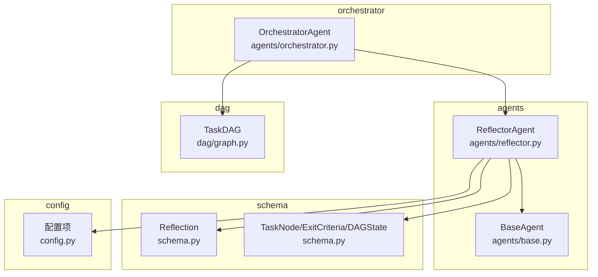
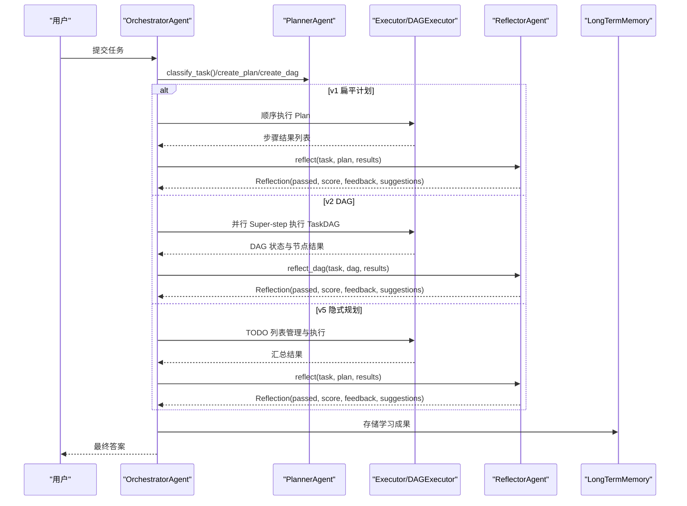
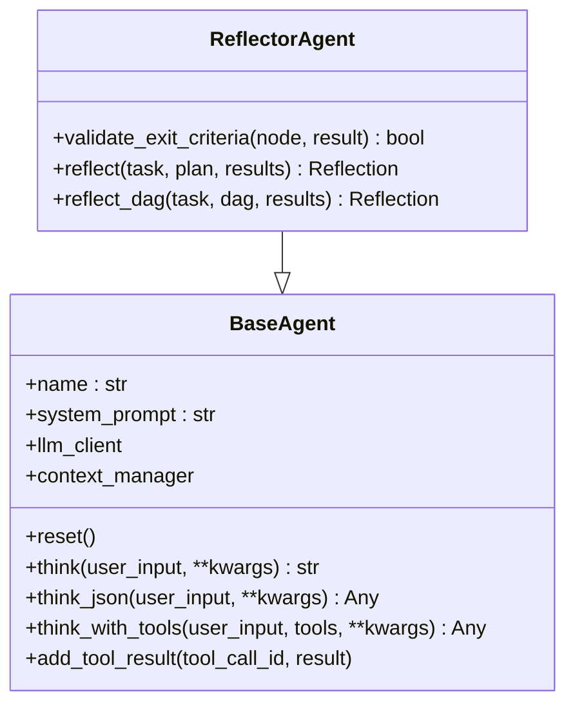
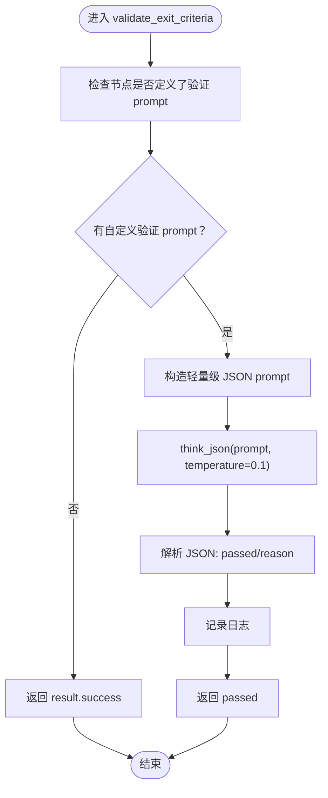
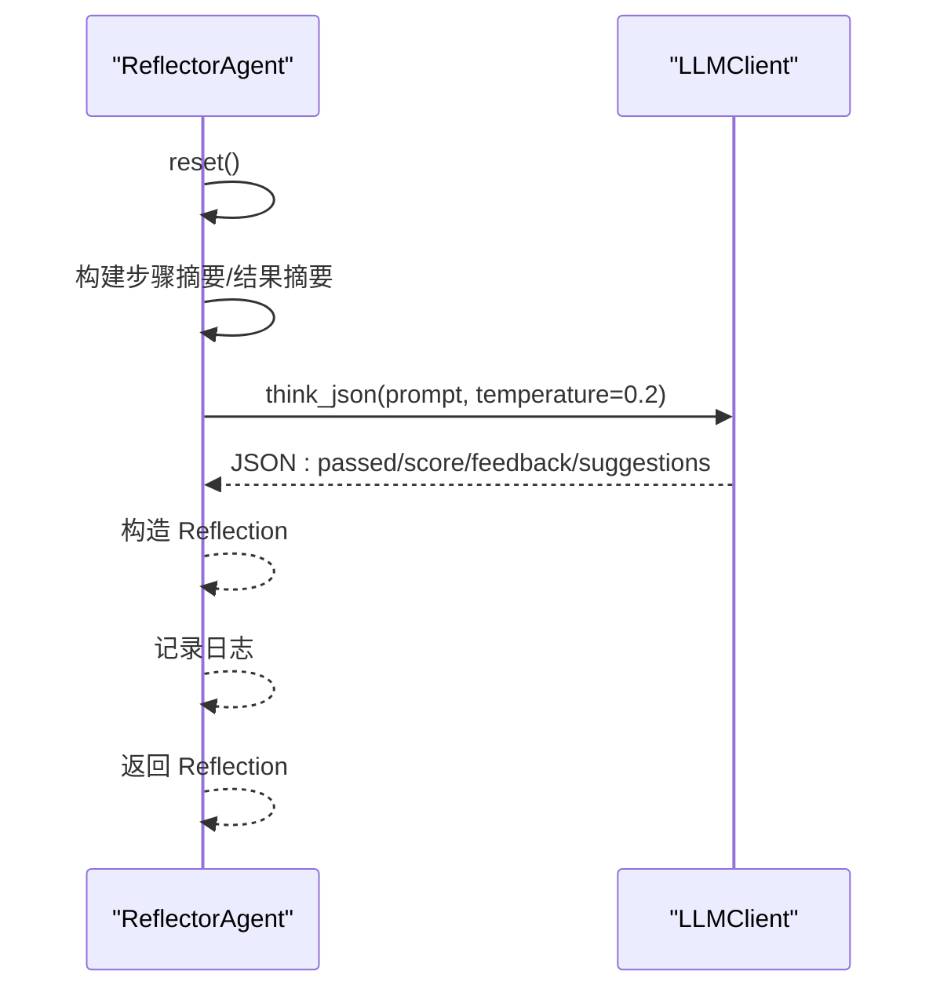
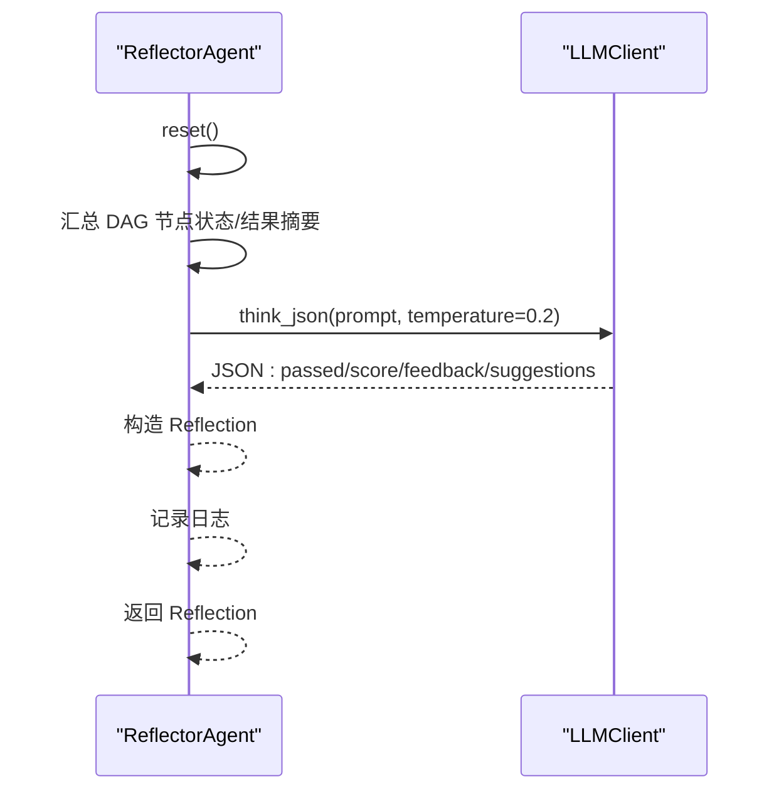
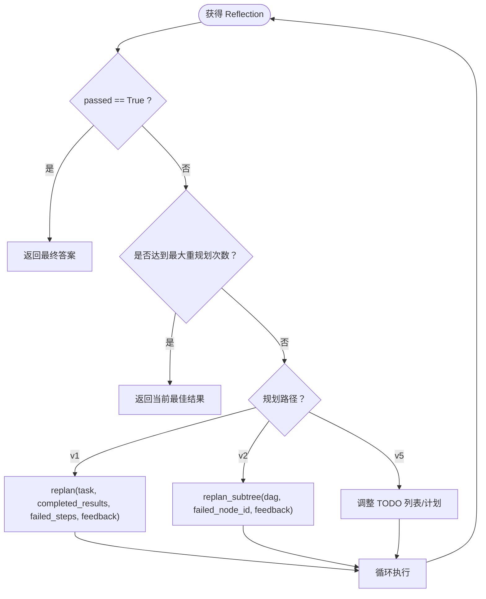
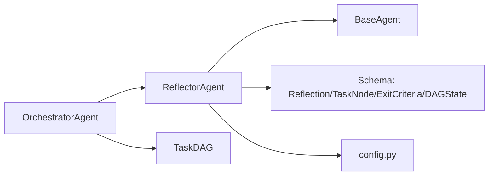

# ReflectorAgent API

<cite>
**本文引用的文件**
- [reflector.py](file://agents/reflector.py)
- [base.py](file://agents/base.py)
- [schema.py](file://schema.py)
- [graph.py](file://dag/graph.py)
- [config.py](file://config.py)
- [orchestrator.py](file://agents/orchestrator.py)
</cite>

## 目录
1. [简介](#简介)
2. [项目结构](#项目结构)
3. [核心组件](#核心组件)
4. [架构总览](#架构总览)
5. [详细组件分析](#详细组件分析)
6. [依赖分析](#依赖分析)
7. [性能考量](#性能考量)
8. [故障排查指南](#故障排查指南)
9. [结论](#结论)
10. [附录](#附录)

## 简介
本文件为 ReflectorAgent 的详细API参考文档，聚焦于反思方法的接口规范与行为约定，包括：
- 反思方法：reflect()、reflect_dag()、validate_exit_criteria()
- 质量评估标准：passed、score、feedback、suggestions 字段语义与用途
- 反馈生成机制与改进建议生成
- 不同规划路径下的反思策略差异
- 质量门控机制与阈值配置
- 反思结果对重规划的影响与决策逻辑
- 反思过程的调试与优化建议

## 项目结构
ReflectorAgent 位于 agents 子模块，继承自 BaseAgent，负责对任务执行结果进行质量评估与反馈，并作为质量门控决定是否触发重规划。其核心数据结构由 schema 模块提供，DAG 执行路径由 dag.graph 提供 TaskDAG 支撑，Orchestrator 在不同规划路径上调度反射。

图表来源
- [reflector.py:59-255](file://agents/reflector.py#L59-L255)
- [base.py:29-183](file://agents/base.py#L29-L183)
- [schema.py:368-377](file://schema.py#L368-L377)
- [schema.py:157-176](file://schema.py#L157-L176)
- [graph.py:43-627](file://dag/graph.py#L43-L627)
- [config.py:1-109](file://config.py#L1-L109)
- [orchestrator.py:60-200](file://agents/orchestrator.py#L60-L200)

章节来源
- [reflector.py:1-255](file://agents/reflector.py#L1-L255)
- [base.py:1-183](file://agents/base.py#L1-L183)
- [schema.py:1-702](file://schema.py#L1-L702)
- [graph.py:1-627](file://dag/graph.py#L1-L627)
- [config.py:1-109](file://config.py#L1-L109)
- [orchestrator.py:1-200](file://agents/orchestrator.py#L1-L200)

## 核心组件
- ReflectorAgent：继承 BaseAgent，提供 validate_exit_criteria()、reflect()、reflect_dag() 三个反思接口，作为质量门控，决定是否需要重规划。
- BaseAgent：提供系统提示词管理、消息历史、上下文压缩、LLM 交互（think/think_json/think_with_tools）等通用能力。
- Reflection：反思结果数据结构，包含 passed、score、feedback、suggestions 四个字段。
- TaskNode/ExitCriteria/DAGState：DAG 规划中的节点、完成判据与集中式状态，支撑 validate_exit_criteria() 与 reflect_dag() 的输入。
- OrchestratorAgent：在不同规划路径（v1 扁平计划、v2 DAG、v5 隐式规划）中调用反射接口，并根据 passed 决策是否重规划。

章节来源
- [reflector.py:59-255](file://agents/reflector.py#L59-L255)
- [base.py:29-183](file://agents/base.py#L29-L183)
- [schema.py:368-377](file://schema.py#L368-L377)
- [schema.py:157-176](file://schema.py#L157-L176)
- [orchestrator.py:60-200](file://agents/orchestrator.py#L60-L200)

## 架构总览
ReflectorAgent 在不同规划路径上的调用关系如下：

图表来源
- [orchestrator.py:158-200](file://agents/orchestrator.py#L158-L200)
- [reflector.py:202-255](file://agents/reflector.py#L202-L255)
- [reflector.py:135-195](file://agents/reflector.py#L135-L195)

## 详细组件分析

### ReflectorAgent 类与方法
- 继承关系：ReflectorAgent(BaseAgent)
- 关键方法：
  - validate_exit_criteria(node, result) -> bool：逐节点轻量级 LLM 验证，判断节点执行结果是否满足其 exit criteria。
  - reflect(task, plan, results) -> Reflection：对 v1 扁平计划执行结果进行反思。
  - reflect_dag(task, dag, results) -> Reflection：对 v2 DAG 执行结果进行反思。

图表来源
- [base.py:29-183](file://agents/base.py#L29-L183)
- [reflector.py:59-255](file://agents/reflector.py#L59-L255)

章节来源
- [reflector.py:59-255](file://agents/reflector.py#L59-L255)
- [base.py:29-183](file://agents/base.py#L29-L183)

### validate_exit_criteria(node, result) 接口规范
- 输入
  - node: TaskNode，包含节点描述、类型、状态、完成判据等。
  - result: StepResult，包含 step_id、success、output、tool_calls_log。
- 行为
  - 若 node.exit_criteria.validation_prompt 为空，则直接返回 result.success。
  - 否则构造轻量级 JSON prompt，要求 LLM 判定 passed/failed，并记录 reason。
  - 异常处理：若 LLM 验证失败，返回 False，触发重规划。
- 输出
  - bool：passed=True 表示满足完成判据，否则失败。

图表来源
- [reflector.py:90-129](file://agents/reflector.py#L90-L129)

章节来源
- [reflector.py:90-129](file://agents/reflector.py#L90-L129)
- [schema.py:121-142](file://schema.py#L121-L142)

### reflect(task, plan, results) 接口规范
- 输入
  - task: 原始用户任务字符串。
  - plan: Plan（v1 扁平计划），包含步骤列表。
  - results: StepResult 列表，对应每个步骤的执行结果。
- 行为
  - 构建步骤摘要与结果摘要（限制长度避免 prompt 过长）。
  - 调用 think_json 生成 JSON 结构的反思结果。
  - 异常处理：解析失败时返回 passed=False，score=0.3，并给出建议。
- 输出
  - Reflection：包含 passed、score、feedback、suggestions。

图表来源
- [reflector.py:202-255](file://agents/reflector.py#L202-L255)

章节来源
- [reflector.py:202-255](file://agents/reflector.py#L202-L255)
- [schema.py:368-377](file://schema.py#L368-L377)

### reflect_dag(task, dag, results) 接口规范
- 输入
  - task: 原始用户任务字符串。
  - dag: TaskDAG，包含节点、边、集中式状态。
  - results: StepResult 列表（或 DAGState.node_results）。
- 行为
  - 构建节点状态摘要与结果摘要。
  - 调用 think_json 生成 JSON 结果。
  - 异常处理：解析失败时返回 passed=False，score=0.3，并给出建议。
- 输出
  - Reflection：包含 passed、score、feedback、suggestions。

图表来源
- [reflector.py:135-195](file://agents/reflector.py#L135-L195)

章节来源
- [reflector.py:135-195](file://agents/reflector.py#L135-L195)
- [schema.py:368-377](file://schema.py#L368-L377)

### 反思结果数据结构：Reflection
- 字段
  - passed: bool，是否通过质量门控。
  - score: float(0.0~1.0)，整体质量评分。
  - feedback: str，总体评价与观察。
  - suggestions: list[str]，改进建议清单。
- 用途
  - passed 决定是否触发重规划。
  - score 用于评估与比较不同执行路径/尝试的质量。
  - feedback 与 suggestions 为后续 Planner/Adaptive Planning 提供改进方向。

章节来源
- [schema.py:368-377](file://schema.py#L368-L377)

### 不同规划路径下的反思策略差异
- v1 扁平计划（reflect）
  - 输入：Plan（步骤顺序）、StepResult 列表。
  - 侧重点：步骤顺序正确性、每个步骤的完成情况。
- v2 DAG（reflect_dag）
  - 输入：TaskDAG（节点状态、集中式状态）、节点结果。
  - 侧重点：节点状态一致性、并行执行的完整性、回滚/跳过策略是否合理。
- v5 隐式规划（reflect）
  - 输入：任务与步骤结果（隐式规划以 TODO 列表管理，最终汇总为步骤结果）。
  - 侧重点：目标对齐、阶段性里程碑达成情况。

章节来源
- [orchestrator.py:194-200](file://agents/orchestrator.py#L194-L200)
- [reflector.py:202-255](file://agents/reflector.py#L202-L255)
- [reflector.py:135-195](file://agents/reflector.py#L135-L195)

### 质量门控机制与阈值配置
- 门控逻辑
  - passed=False：触发重规划；passed=True：认为结果可接受。
  - 异常兜底：当 LLM 输出解析失败时，Reflector 默认返回 passed=False（v2 实现），以避免静默失败导致重规划被抑制。
- 配置项
  - MAX_REPLAN_ATTEMPTS：最大重规划尝试次数（config.py）。
  - MAX_PARALLEL_NODES：DAG 每轮并行节点数（config.py）。
  - NODE_EXECUTION_TIMEOUT：节点执行超时（config.py）。
  - MAX_CHECKPOINTS：DAG 快照上限（config.py）。
- 温度系数
  - reflect/reflect_dag 使用 temperature=0.2，validate_exit_criteria 使用 temperature=0.1，以降低随机性，提高 JSON 输出稳定性。

章节来源
- [reflector.py:171-188](file://agents/reflector.py#L171-L188)
- [reflector.py:115-128](file://agents/reflector.py#L115-L128)
- [config.py:25-59](file://config.py#L25-L59)

### 反思结果对重规划的影响与决策逻辑
- v1 扁平计划
  - 若 Reflection.passed=False，Orchestrator 根据 feedback 与失败步骤进行 replan，并保留最近一次失败结果以便参考。
- v2 DAG
  - 若 Reflection.passed=False，Orchestrator 仅对失败子树进行局部重规划（replan_subtree），保留已完成工作，减少重算成本。
- v5 隐式规划
  - 类似 v1，根据反馈与失败 TODO 进行局部调整。

图表来源
- [orchestrator.py:329-351](file://agents/orchestrator.py#L329-L351)
- [orchestrator.py:471-508](file://agents/orchestrator.py#L471-L508)

章节来源
- [orchestrator.py:329-351](file://agents/orchestrator.py#L329-L351)
- [orchestrator.py:471-508](file://agents/orchestrator.py#L471-L508)

## 依赖分析
- ReflectorAgent 依赖
  - BaseAgent：消息历史、上下文压缩、think/think_json。
  - LLMClient：与 LLM 交互，生成结构化 JSON。
  - ContextManager：在消息过多时压缩历史。
  - Schema：Reflection、TaskNode、ExitCriteria、DAGState。
  - Orchestrator：在不同规划路径上调度反射。
- DAG 执行依赖
  - TaskDAG：提供节点状态、集中式状态、拓扑排序、失败处理等能力。

图表来源
- [reflector.py:28-31](file://agents/reflector.py#L28-L31)
- [base.py:23-26](file://agents/base.py#L23-L26)
- [schema.py:368-377](file://schema.py#L368-L377)
- [graph.py:43-69](file://dag/graph.py#L43-L69)
- [config.py:1-109](file://config.py#L1-L109)
- [orchestrator.py:60-128](file://agents/orchestrator.py#L60-L128)

章节来源
- [reflector.py:28-31](file://agents/reflector.py#L28-L31)
- [base.py:23-26](file://agents/base.py#L23-L26)
- [schema.py:368-377](file://schema.py#L368-L377)
- [graph.py:43-69](file://dag/graph.py#L43-L69)
- [config.py:1-109](file://config.py#L1-L109)
- [orchestrator.py:60-128](file://agents/orchestrator.py#L60-L128)

## 性能考量
- prompt 长度控制：对步骤/节点摘要进行截断，避免 LLM 上下文溢出。
- 温度系数：0.1~0.2 的较低温度有助于 JSON 输出稳定，减少解析失败。
- 上下文压缩：通过 ContextManager 在消息过多时压缩历史，降低 token 消耗。
- DAG 并行：MAX_PARALLEL_NODES 控制每轮并行节点数，平衡吞吐与资源占用。
- 超时与快照：NODE_EXECUTION_TIMEOUT 与 MAX_CHECKPOINTS 保障执行健壮性与调试能力。

## 故障排查指南
- 反思解析失败
  - 现象：think_json 抛出异常，Reflector 返回 passed=False，score=0.3，并给出“检查 LLM 输出格式”等建议。
  - 处理：检查系统提示词格式、LLM 输出稳定性、temperature 设置。
- 节点验证失败
  - 现象：validate_exit_criteria 返回 False，触发节点失败处理。
  - 处理：检查 ExitCriteria.validation_prompt 是否合理，必要时将 required=False 或提供更明确的 prompt。
- 重规划无效
  - 现象：多次重规划后仍 passed=False。
  - 处理：查看 Reflection.feedback 与 suggestions，调整任务描述、分解粒度或工具链；适当提高 MAX_REPLAN_ATTEMPTS。
- DAG 执行卡住
  - 现象：部分节点长期处于 PENDING/READY。
  - 处理：使用 DAG.get_blockage_report() 诊断阻塞节点，必要时调用 try_recover_blocked_nodes() 或手动干预。

章节来源
- [reflector.py:171-188](file://agents/reflector.py#L171-L188)
- [reflector.py:115-128](file://agents/reflector.py#L115-L128)
- [graph.py:277-334](file://dag/graph.py#L277-L334)

## 结论
ReflectorAgent 通过 validate_exit_criteria()、reflect()、reflect_dag() 三类反思接口，为不同规划路径提供一致的质量门控与反馈机制。其基于 Reflection 的结构化输出，配合 Orchestrator 的重规划策略，形成闭环的质量保障体系。通过合理的温度控制、prompt 设计与配置项调优，可显著提升反思稳定性与重规划效果。

## 附录
- 关键配置项
  - MAX_REPLAN_ATTEMPTS：最大重规划次数
  - MAX_PARALLEL_NODES：DAG 每轮并行节点数
  - NODE_EXECUTION_TIMEOUT：节点执行超时
  - MAX_CHECKPOINTS：DAG 快照上限
- 相关数据结构
  - Reflection：passed/score/feedback/suggestions
  - TaskNode/ExitCriteria/DAGState：DAG 节点与状态
- 调试建议
  - 优先关注 validate_exit_criteria 的验证 prompt 合理性
  - 逐步降低 temperature，确保 think_json 输出稳定
  - 使用 DAG 快照与阻塞报告定位执行瓶颈