# 工具系统API

<cite>
**本文引用的文件**
- [tools/base.py](file://tools/base.py)
- [tools/__init__.py](file://tools/__init__.py)
- [tools/router.py](file://tools/router.py)
- [tools/web_search.py](file://tools/web_search.py)
- [tools/code_executor.py](file://tools/code_executor.py)
- [tools/file_ops.py](file://tools/file_ops.py)
- [tools/shell_tool.py](file://tools/shell_tool.py)
- [tools/subprocess_utils.py](file://tools/subprocess_utils.py)
- [config.py](file://config.py)
- [schema.py](file://schema.py)
- [main.py](file://main.py)
- [tests/test_real_tools.py](file://tests/test_real_tools.py)
- [tests/test_shell_tool.py](file://tests/test_shell_tool.py)
</cite>

## 目录
1. [简介](#简介)
2. [项目结构](#项目结构)
3. [核心组件](#核心组件)
4. [架构总览](#架构总览)
5. [详细组件分析](#详细组件分析)
6. [依赖分析](#依赖分析)
7. [性能考量](#性能考量)
8. [故障排查指南](#故障排查指南)
9. [结论](#结论)
10. [附录](#附录)

## 简介
本文件为工具系统API参考文档，聚焦于 BaseTool 抽象基类的接口规范与实现约定，涵盖参数Schema定义、异步执行、结果格式、错误处理、安全与权限控制、工具路由与故障切换、以及自定义工具开发的最佳实践。同时梳理内置工具 WebSearchTool、CodeExecutorTool、FileOpsTool、ShellTool 的接口差异与使用要点。

## 项目结构
工具系统位于 tools 目录，核心抽象与内置工具如下：
- 抽象基类：BaseTool（定义工具统一接口与OpenAI function-calling导出）
- 内置工具：WebSearchTool、CodeExecutorTool、FileOpsTool、ShellTool
- 工具路由：ToolRouter（失败计数、阈值切换、提示生成）
- 子进程工具：subprocess_utils（安全环境、超时、输出截断、进程清理）
- 配置：config（超时、并发、沙箱目录、追踪开关等）
- 数据模型：schema（工具调用记录、执行结果等）

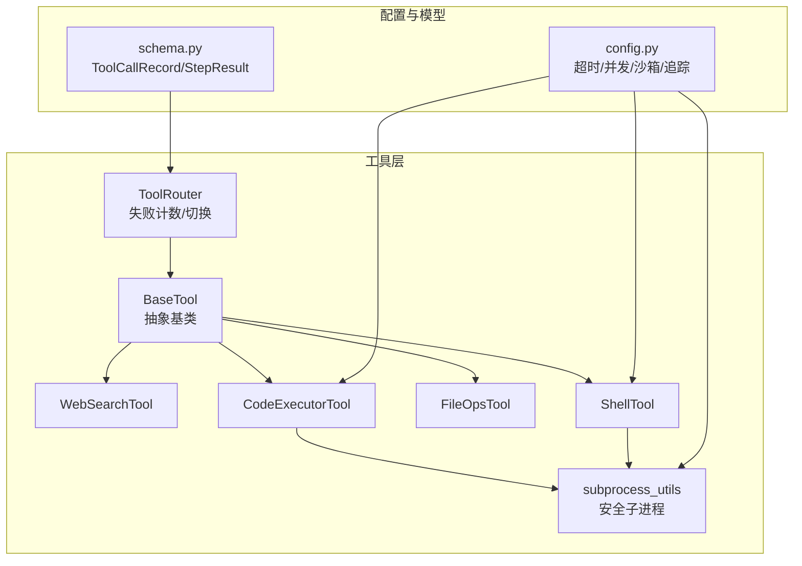

图表来源
- [tools/base.py:22-175](file://tools/base.py#L22-L175)
- [tools/web_search.py:56-113](file://tools/web_search.py#L56-L113)
- [tools/code_executor.py:25-102](file://tools/code_executor.py#L25-L102)
- [tools/file_ops.py:23-138](file://tools/file_ops.py#L23-L138)
- [tools/shell_tool.py:25-152](file://tools/shell_tool.py#L25-L152)
- [tools/router.py:47-168](file://tools/router.py#L47-L168)
- [tools/subprocess_utils.py:1-156](file://tools/subprocess_utils.py#L1-L156)
- [config.py:69-109](file://config.py#L69-L109)
- [schema.py:342-361](file://schema.py#L342-L361)

章节来源
- [tools/__init__.py:1-8](file://tools/__init__.py#L1-L8)
- [main.py:449-455](file://main.py#L449-L455)

## 核心组件
- BaseTool 抽象基类
  - 必需属性：name、description、parameters_schema
  - 必需方法：execute(**kwargs) -> str（异步）
  - 可选方法：to_openai_tool() -> dict（导出OpenAI function-calling格式）
  - 增强执行：traced_execute(**kwargs) -> str（带追踪埋点，零开销降级）
  - 参数清洗：_sanitize_params(params)（敏感字段脱敏）
- ToolRouter 工具路由
  - 统计：calls、failures、consecutive_failures
  - 阈值：failure_threshold（来自配置）
  - 功能：record_success/failure、should_suggest_alternative、get_alternative_tools、get_hint、get_node_summary、reset_node
- subprocess_utils 子进程工具
  - 环境：build_safe_env（移除敏感键）
  - 执行：run_with_limits（超时、输出上限、保证清理）
  - 结果：SubprocessResult（stdout、stderr、returncode）

章节来源
- [tools/base.py:22-175](file://tools/base.py#L22-L175)
- [tools/router.py:47-168](file://tools/router.py#L47-L168)
- [tools/subprocess_utils.py:1-156](file://tools/subprocess_utils.py#L1-L156)

## 架构总览
工具系统围绕 BaseTool 提供统一接口，结合 ToolRouter 实现失败后的替代建议与统计；子进程工具提供安全隔离与资源限制；配置模块集中管理超时、并发、沙箱与追踪参数；数据模型承载工具调用记录与执行结果。

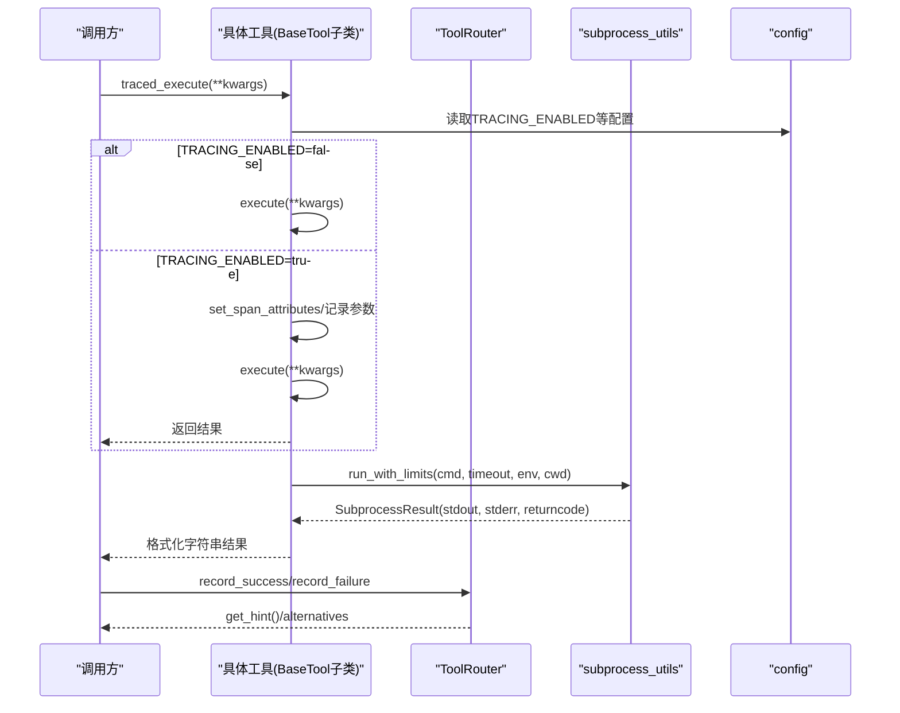

图表来源
- [tools/base.py:60-124](file://tools/base.py#L60-L124)
- [tools/subprocess_utils.py:62-101](file://tools/subprocess_utils.py#L62-L101)
- [tools/router.py:82-147](file://tools/router.py#L82-L147)
- [config.py:69-109](file://config.py#L69-L109)

## 详细组件分析

### BaseTool 抽象基类
- 接口职责
  - name：工具唯一标识，用于函数调用与追踪
  - description：工具用途描述，帮助LLM决策是否调用
  - parameters_schema：JSON Schema，约束参数类型与必填字段
  - execute(**kwargs)：异步执行，返回字符串结果
  - traced_execute(**kwargs)：带追踪的执行入口，支持零开销降级
  - to_openai_tool()：导出OpenAI function-calling格式
- 参数验证与安全
  - traced_execute 内部对参数进行脱敏与长度截断，避免敏感信息泄露
  - 执行异常会被记录到Span并抛出
- 结果格式
  - 统一返回str，便于LLM处理与UI展示
- OpenAI集成
  - to_openai_tool() 输出符合OpenAI tools格式的对象

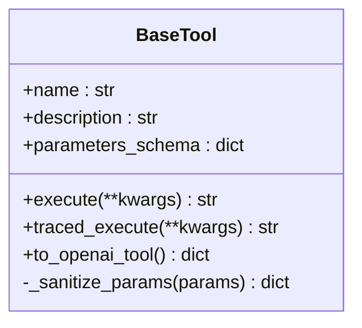

图表来源
- [tools/base.py:22-175](file://tools/base.py#L22-L175)

章节来源
- [tools/base.py:22-175](file://tools/base.py#L22-L175)

### WebSearchTool（网络搜索）
- 名称与描述
  - name: "web_search"
  - description: 搜索网络信息并返回标题与摘要列表
- 参数Schema
  - 必填：query（string）
- 执行逻辑
  - 默认返回预设mock结果；可通过覆写内部方法接入真实搜索API
  - 结果格式化为易读文本
- 错误处理
  - 无显式异常抛出，返回错误信息字符串

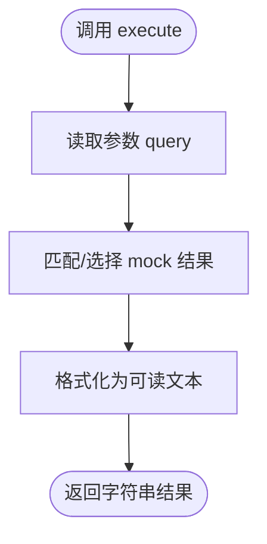

图表来源
- [tools/web_search.py:87-113](file://tools/web_search.py#L87-L113)

章节来源
- [tools/web_search.py:56-113](file://tools/web_search.py#L56-L113)

### CodeExecutorTool（代码执行）
- 名称与描述
  - name: "execute_python"
  - description: 在子进程中执行Python代码，捕获stdout/stderr
- 参数Schema
  - 必填：code（string）
- 并发与超时
  - 使用信号量限制最大并发
  - 超时时间来自配置
- 安全与隔离
  - 子进程工作目录为沙箱目录
  - 环境变量经清洗，移除敏感键
  - 输出大小受上限限制，超限截断
- 错误处理
  - 超时：返回超时错误信息
  - 异常：返回错误信息
  - 无代码：返回错误信息

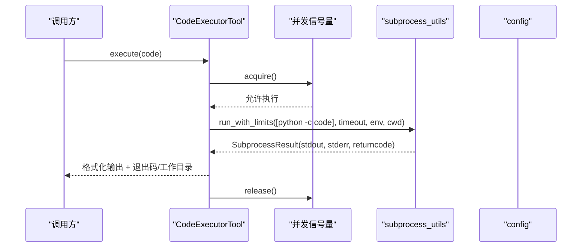

图表来源
- [tools/code_executor.py:64-102](file://tools/code_executor.py#L64-L102)
- [tools/subprocess_utils.py:62-101](file://tools/subprocess_utils.py#L62-L101)
- [config.py:69-76](file://config.py#L69-L76)

章节来源
- [tools/code_executor.py:25-102](file://tools/code_executor.py#L25-L102)
- [tools/subprocess_utils.py:1-156](file://tools/subprocess_utils.py#L1-L156)
- [config.py:69-76](file://config.py#L69-L76)

### FileOpsTool（文件操作）
- 名称与描述
  - name: "file_ops"
  - description: 在沙箱目录内执行读取、写入、列出文件
- 参数Schema
  - 必填：action（"read"|"write"|"list"）
  - 读/写：filename（string）
  - 写：content（string）
- 路径安全
  - 使用 realpath 与前缀校验，防止路径穿越
- 执行逻辑
  - list：列出沙箱内文件
  - read：读取指定文件内容
  - write：在沙箱内创建/覆盖文件
- 错误处理
  - 未知action：返回错误信息
  - 路径逃逸：返回访问拒绝
  - 文件不存在：返回错误信息
  - IO异常：返回错误信息

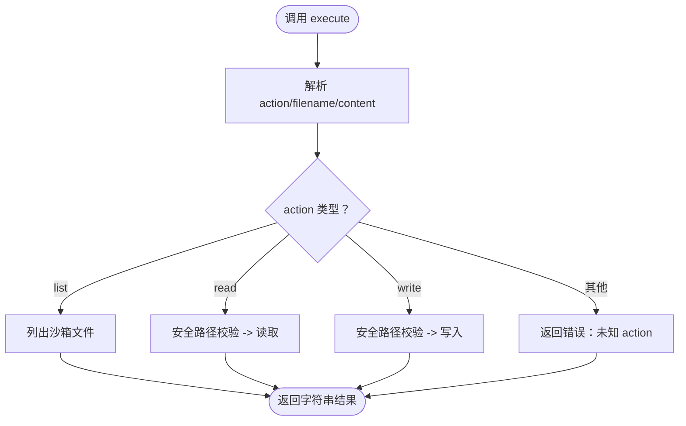

图表来源
- [tools/file_ops.py:73-138](file://tools/file_ops.py#L73-L138)

章节来源
- [tools/file_ops.py:23-138](file://tools/file_ops.py#L23-L138)

### ShellTool（Shell命令执行）
- 名称与描述
  - name: "execute_shell"
  - description: 在子进程中执行shell命令，支持超时与黑名单
- 参数Schema
  - 必填：command（string）
  - 可选：timeout（integer，秒）
- 黑名单安全
  - 针对破坏性命令、提权、远程执行、系统修改、凭据访问等进行匹配拦截
- 并发与超时
  - 信号量限制并发
  - 超时来自参数或配置
- 安全与隔离
  - 沙箱工作目录
  - 环境变量清洗
  - 输出上限与截断
- 错误处理
  - 命令为空：返回错误
  - 命中黑名单：返回错误
  - 超时：返回超时错误
  - 异常：返回错误

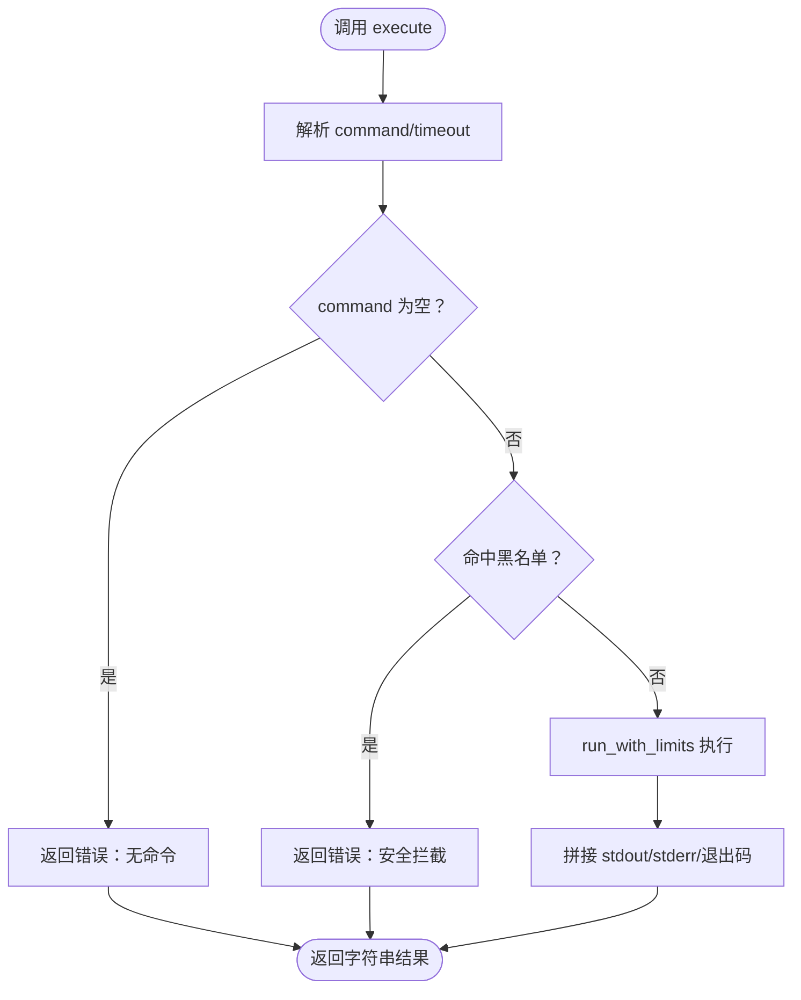

图表来源
- [tools/shell_tool.py:99-152](file://tools/shell_tool.py#L99-L152)
- [tools/subprocess_utils.py:62-101](file://tools/subprocess_utils.py#L62-L101)
- [config.py:69-76](file://config.py#L69-L76)

章节来源
- [tools/shell_tool.py:25-152](file://tools/shell_tool.py#L25-L152)
- [tools/subprocess_utils.py:1-156](file://tools/subprocess_utils.py#L1-L156)
- [config.py:69-76](file://config.py#L69-L76)

### ToolRouter（工具路由与故障切换）
- 统计维度
  - calls：总调用次数
  - failures：失败次数
  - consecutive_failures：连续失败次数（成功后清零）
- 关键方法
  - record_success/record_failure：更新统计
  - should_suggest_alternative：是否超过阈值
  - get_alternative_tools：返回可用替代工具
  - get_hint：生成提示文本（含替代建议）
  - get_node_summary/reset_node：可观测性与重试清理
- 阈值来源
  - 来自配置项 TOOL_FAILURE_THRESHOLD

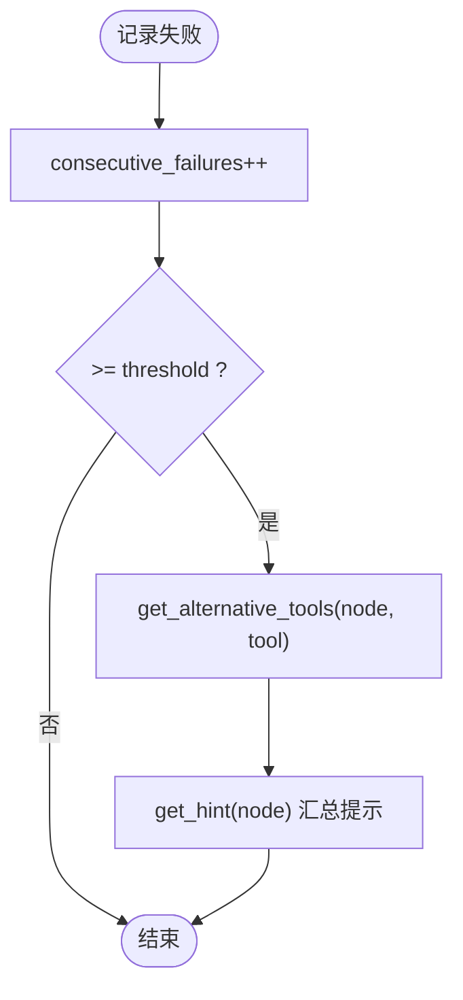

图表来源
- [tools/router.py:82-147](file://tools/router.py#L82-L147)
- [config.py:54](file://config.py#L54)

章节来源
- [tools/router.py:47-168](file://tools/router.py#L47-L168)
- [config.py:52-54](file://config.py#L52-L54)

### 子进程工具 subprocess_utils
- 环境变量清洗
  - 移除匹配敏感模式的键（如API Key、Secret、Token、Password、Credential）
- 安全执行
  - 使用 asyncio.create_subprocess_exec
  - 超时：kill并wait，保证无孤儿进程
  - 输出：并发读取stdout/stderr，达到上限截断并标记
- 结果对象
  - SubprocessResult：stdout、stderr、returncode

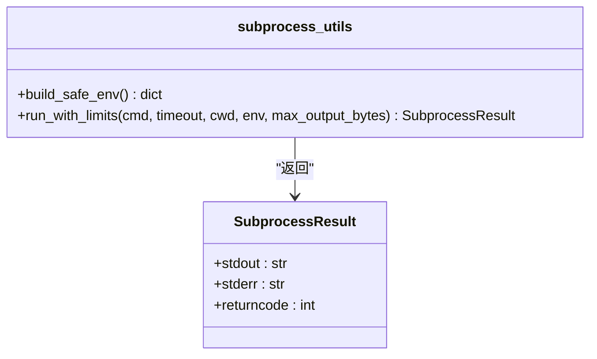

图表来源
- [tools/subprocess_utils.py:38-101](file://tools/subprocess_utils.py#L38-L101)

章节来源
- [tools/subprocess_utils.py:1-156](file://tools/subprocess_utils.py#L1-L156)

### 配置与数据模型
- 配置项（关键）
  - SANDBOX_DIR：沙箱目录
  - CODE_EXEC_TIMEOUT/SHELL_EXEC_TIMEOUT：执行超时
  - SUBPROCESS_MAX_OUTPUT_BYTES：输出上限
  - SHELL_MAX_CONCURRENT/CODE_MAX_CONCURRENT：并发限制
  - TOOL_FAILURE_THRESHOLD：工具失败阈值
  - TRACING_ENABLED/SAMPLE_RATE/BACKEND/ENDPOINT/ATTR_LENGTH：追踪配置
- 数据模型（与工具调用相关）
  - ToolCallRecord：单次工具调用记录（工具名、参数、结果）
  - StepResult：单步执行结果（成功标志、输出、工具调用日志）

章节来源
- [config.py:69-109](file://config.py#L69-L109)
- [schema.py:342-361](file://schema.py#L342-L361)

## 依赖分析
- 工具到基类
  - WebSearchTool、CodeExecutorTool、FileOpsTool、ShellTool 均继承 BaseTool
- 工具到子进程
  - CodeExecutorTool、ShellTool 依赖 subprocess_utils
- 工具到配置
  - 所有工具读取 config 中的超时、并发、沙箱目录等参数
- 工具到路由
  - 调用方在执行前后记录统计，ToolRouter提供提示与替代
- 路由到模型
  - ToolRouter统计结构与 schema 中的 StepResult/ToolCallRecord 互补

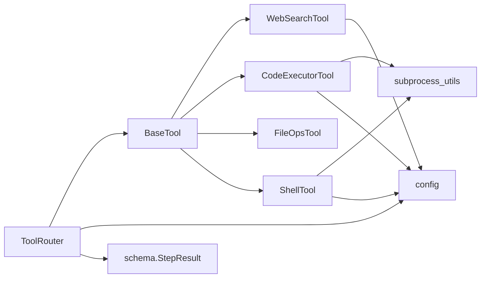

图表来源
- [tools/base.py:22-175](file://tools/base.py#L22-L175)
- [tools/code_executor.py:18-21](file://tools/code_executor.py#L18-L21)
- [tools/shell_tool.py:18-21](file://tools/shell_tool.py#L18-L21)
- [tools/router.py:70-74](file://tools/router.py#L70-L74)
- [schema.py:352-361](file://schema.py#L352-L361)

章节来源
- [tools/__init__.py:1-8](file://tools/__init__.py#L1-L8)
- [main.py:449-455](file://main.py#L449-L455)

## 性能考量
- 并发控制
  - 通过信号量限制Shell与代码执行的最大并发，避免资源争用
- 超时与输出上限
  - 子进程统一超时与输出上限，防止长时间阻塞与内存膨胀
- 追踪开销
  - traced_execute 在追踪关闭时零开销，开启时仅增加Span与少量参数记录成本
- I/O与路径校验
  - FileOpsTool 的路径解析与前缀校验为O(1)额外开销，有效防止路径穿越

## 故障排查指南
- 代码执行超时
  - 现象：返回超时错误信息
  - 排查：检查 CODE_EXEC_TIMEOUT 配置、是否长时间阻塞、是否使用IO
- Shell命令被拦截
  - 现象：返回“命令被拦截”错误
  - 排查：确认命令是否命中黑名单规则
- Shell命令孤儿进程
  - 现象：系统残留长时间运行的子进程
  - 排查：确认超时路径是否正确kill并wait（subprocess_utils已保证）
- 文件读写失败
  - 现象：返回“文件不存在/访问拒绝/IO错误”
  - 排查：确认 filename 是否在沙箱内、路径是否穿越、权限是否正确
- 工具路由提示无效
  - 现象：未出现替代工具建议
  - 排查：确认连续失败次数是否达到 TOOL_FAILURE_THRESHOLD

章节来源
- [tests/test_shell_tool.py:137-197](file://tests/test_shell_tool.py#L137-L197)
- [tests/test_real_tools.py:13-84](file://tests/test_real_tools.py#L13-L84)
- [config.py:52-54](file://config.py#L52-L54)

## 结论
工具系统通过 BaseTool 抽象统一了接口与Schema，结合 ToolRouter 的失败切换与 subprocess_utils 的安全隔离，提供了可扩展、可观测、可审计的工具生态。内置工具覆盖搜索、代码执行、文件操作与Shell命令执行，满足常见Agent场景需求。通过配置中心化管理超时、并发与追踪，配合数据模型记录工具调用与执行结果，便于调试与优化。

## 附录

### 工具注册与调用流程（概览）
- 注册：在主程序中实例化各工具并传入 OrchestratorAgent
- 调用：LLM生成函数调用请求，OrchestratorAgent选择工具并调用 traced_execute
- 路由：执行后记录统计，必要时生成替代建议

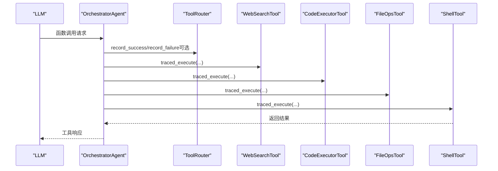

图表来源
- [main.py:449-455](file://main.py#L449-L455)
- [tools/router.py:82-147](file://tools/router.py#L82-L147)
- [tools/base.py:60-124](file://tools/base.py#L60-L124)

### 自定义工具开发规范与最佳实践
- 继承 BaseTool，实现 name/description/parameters_schema/execute
- 参数Schema
  - 使用 type:"object"，明确 properties 与 required
  - 对敏感字段在 traced_execute 中避免直接记录
- 异步执行
  - 使用 asyncio 编写异步逻辑，避免阻塞
  - 如涉及外部进程，复用 subprocess_utils 的 run_with_limits
- 安全与权限
  - 严格限制工作目录（沙箱）
  - 清洗环境变量，避免泄露
  - 对输入参数进行白名单/黑名单校验
- 错误处理
  - 将异常转为可读字符串，避免泄露内部细节
  - 记录必要的上下文信息（如命令、文件名、参数片段）
- 追踪与可观测性
  - 优先使用 traced_execute，确保Span与参数记录
  - 对敏感参数进行脱敏与截断
- 路由与切换
  - 在调用方记录 success/failure，以便 ToolRouter 提供替代建议

章节来源
- [tools/base.py:22-175](file://tools/base.py#L22-L175)
- [tools/subprocess_utils.py:38-101](file://tools/subprocess_utils.py#L38-L101)
- [tools/router.py:82-147](file://tools/router.py#L82-L147)