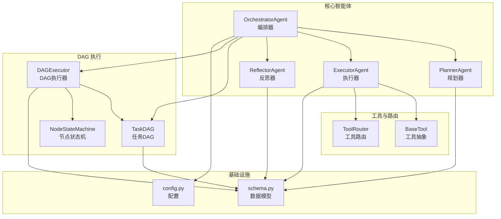
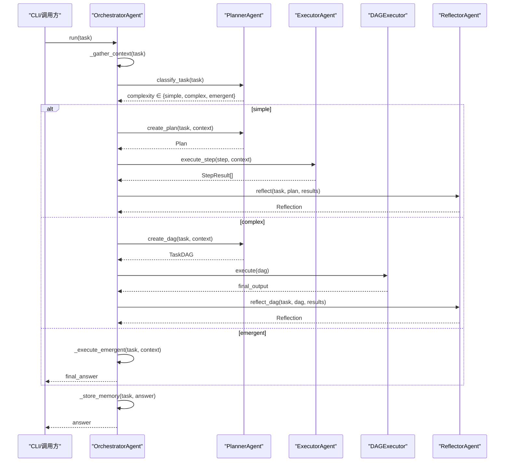
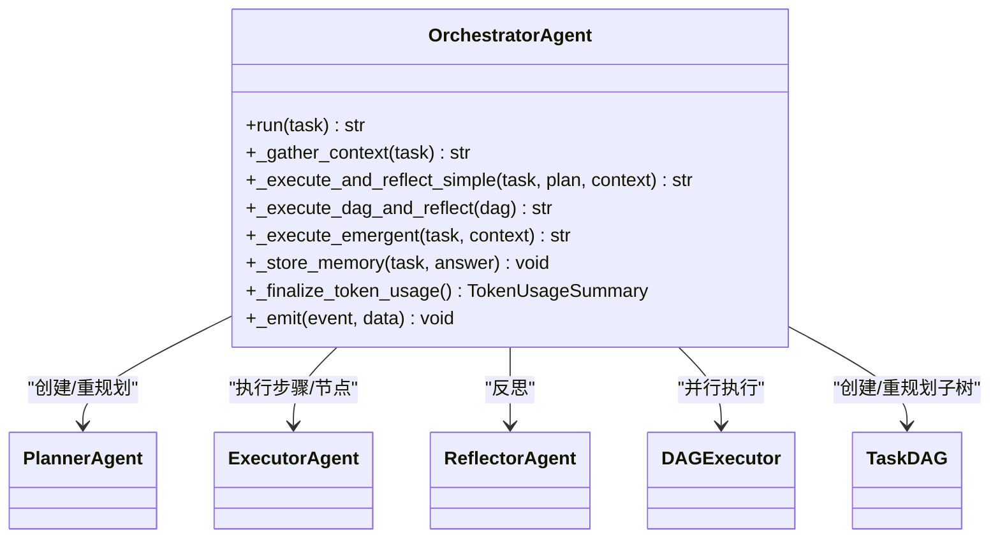
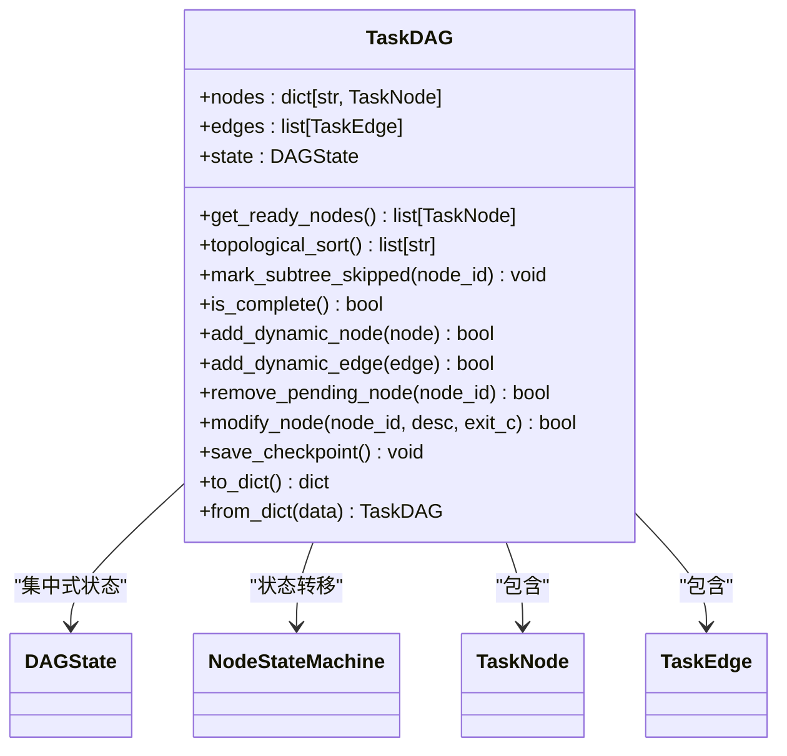
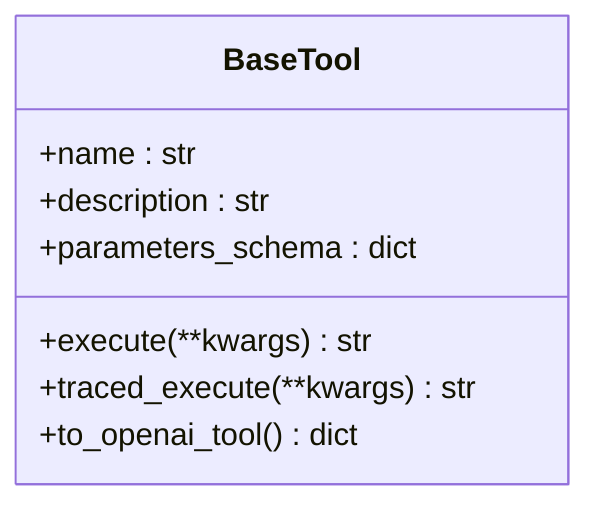
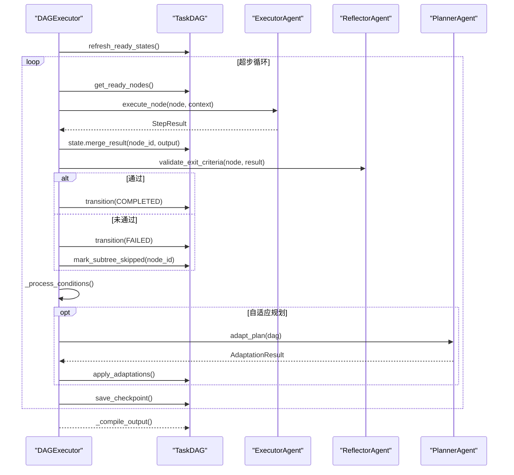
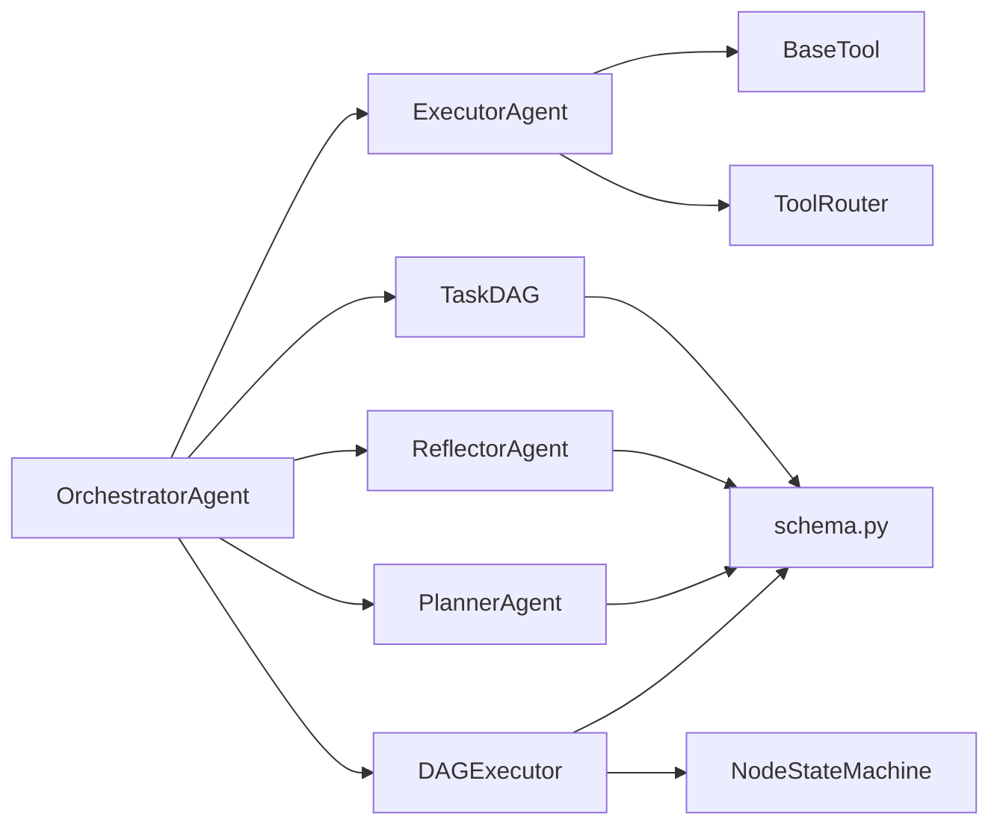

# 核心API

<cite>
**本文引用的文件**
- [agents/orchestrator.py](file://agents/orchestrator.py)
- [dag/graph.py](file://dag/graph.py)
- [tools/base.py](file://tools/base.py)
- [agents/base.py](file://agents/base.py)
- [dag/executor.py](file://dag/executor.py)
- [schema.py](file://schema.py)
- [agents/executor.py](file://agents/executor.py)
- [agents/planner.py](file://agents/planner.py)
- [agents/reflector.py](file://agents/reflector.py)
- [config.py](file://config.py)
- [dag/state_machine.py](file://dag/state_machine.py)
- [tools/router.py](file://tools/router.py)
- [main.py](file://main.py)
</cite>

## 目录
1. [简介](#简介)
2. [项目结构](#项目结构)
3. [核心组件](#核心组件)
4. [架构总览](#架构总览)
5. [详细组件分析](#详细组件分析)
6. [依赖分析](#依赖分析)
7. [性能考量](#性能考量)
8. [故障排查指南](#故障排查指南)
9. [结论](#结论)
10. [附录](#附录)

## 简介
本文件为 manus_demo 的核心API参考文档，聚焦 OrchestratorAgent、TaskDAG、BaseTool 等关键组件，系统梳理其主要类与方法、方法签名、参数类型、返回值、使用示例、组件间调用关系与依赖关系、错误处理与异常情况、最佳实践与性能优化建议。文档旨在帮助开发者快速理解并正确使用多智能体混合规划-执行-反思流水线。

## 项目结构
manus_demo 采用“按职责分层”的模块化组织方式：
- agents：多智能体（Orchestrator、Planner、Executor、Reflector、EmergentPlanner、GoalDrivenPlanner、Reflector 等）
- dag：DAG 规划与执行（TaskDAG、DAGExecutor、NodeStateMachine）
- tools：工具抽象与实现（BaseTool、ToolRouter、各类具体工具）
- schema：统一的数据模型（Plan/TaskDAG/StepResult/Reflection 等）
- config：运行时配置（路由、执行、追踪、工具等）
- main：CLI 入口与 Rich UI 事件渲染

图表来源
- [agents/orchestrator.py:60-600](file://agents/orchestrator.py#L60-L600)
- [dag/graph.py:43-627](file://dag/graph.py#L43-L627)
- [dag/executor.py:62-648](file://dag/executor.py#L62-L648)
- [tools/base.py:22-175](file://tools/base.py#L22-L175)
- [tools/router.py:47-168](file://tools/router.py#L47-L168)
- [schema.py:35-702](file://schema.py#L35-L702)
- [config.py:1-109](file://config.py#L1-L109)

章节来源
- [agents/orchestrator.py:1-600](file://agents/orchestrator.py#L1-L600)
- [dag/graph.py:1-627](file://dag/graph.py#L1-L627)
- [dag/executor.py:1-648](file://dag/executor.py#L1-L648)
- [tools/base.py:1-175](file://tools/base.py#L1-L175)
- [tools/router.py:1-168](file://tools/router.py#L1-L168)
- [schema.py:1-702](file://schema.py#L1-L702)
- [config.py:1-109](file://config.py#L1-L109)

## 核心组件
- OrchestratorAgent：多智能体流水线的中央编排者，负责上下文收集、任务复杂度分类、路由到 v1/v2/v5 路径、执行与反思、记忆存储与事件广播。
- TaskDAG：分层任务规划的有向无环图，承载节点、边、集中式状态与检查点，支持动态变更与并行超步执行。
- BaseTool：工具抽象接口，统一工具命名、描述、参数Schema与执行入口，并提供带追踪的执行包装。
- ExecutorAgent：ReAct 执行器，支持 v1 扁平步骤与 v2 DAG 节点执行，内置工具路由与可选统一 ReActEngine。
- PlannerAgent：混合路由规划器，两阶段分类器自动选择 v1/v2/v5 路径，支持局部重规划与自适应规划。
- ReflectorAgent：反思器，对 v1/v2 执行结果进行质量评估与反馈，提供通过/失败判定与改进建议。
- NodeStateMachine：节点状态机，强制合法状态转移，防止 DAG 进入不一致状态。
- ToolRouter：工具路由，基于失败统计给出替代工具建议，避免死循环。

章节来源
- [agents/orchestrator.py:60-600](file://agents/orchestrator.py#L60-L600)
- [dag/graph.py:43-627](file://dag/graph.py#L43-L627)
- [tools/base.py:22-175](file://tools/base.py#L22-L175)
- [agents/executor.py:66-323](file://agents/executor.py#L66-L323)
- [agents/planner.py:147-934](file://agents/planner.py#L147-L934)
- [agents/reflector.py:59-255](file://agents/reflector.py#L59-L255)
- [dag/state_machine.py:55-114](file://dag/state_machine.py#L55-L114)
- [tools/router.py:47-168](file://tools/router.py#L47-L168)

## 架构总览
manus_demo 的核心执行流遵循“混合路由 + 分层规划 + 并行执行 + 质量门控”的设计：
- 任务进入 Orchestrator 后，先检索长期记忆与知识，再通过两阶段分类器决定路由（v1 扁平计划、v2 DAG、v5 隐式规划）。
- v1 路径顺序执行步骤，支持重规划；v2 路径通过 DAGExecutor 并行超步执行，支持条件分支、回滚、失败局部重规划与自适应规划；v5 路径以 TODO 列表为中心，迭代式推进。
- 每轮执行后由 Reflector 进行质量评估，必要时触发重规划或局部重规划。
- 执行结果与 Token 使用被记录，最终答案写入长期记忆。

图表来源
- [agents/orchestrator.py:158-222](file://agents/orchestrator.py#L158-L222)
- [agents/planner.py:213-259](file://agents/planner.py#L213-L259)
- [agents/executor.py:171-188](file://agents/executor.py#L171-L188)
- [dag/executor.py:110-264](file://dag/executor.py#L110-L264)
- [agents/reflector.py:135-195](file://agents/reflector.py#L135-L195)

章节来源
- [agents/orchestrator.py:158-222](file://agents/orchestrator.py#L158-L222)
- [agents/planner.py:213-259](file://agents/planner.py#L213-L259)
- [agents/executor.py:171-188](file://agents/executor.py#L171-L188)
- [dag/executor.py:110-264](file://dag/executor.py#L110-L264)
- [agents/reflector.py:135-195](file://agents/reflector.py#L135-L195)

## 详细组件分析

### OrchestratorAgent（编排器）
- 职责
  - 收集上下文（长期记忆 + 知识库）
  - 任务复杂度分类（规则快筛 + LLM 兜底）
  - 路由到 v1/v2/v5 执行路径
  - 执行与反思（v1：顺序执行；v2：并行超步；v5：TODO 列表）
  - 记忆存储与事件广播（UI 更新）
- 关键方法
  - run(task: str) -> str：主入口，返回最终答案
  - _gather_context(task: str) -> str：合并记忆与知识
  - _execute_and_reflect_simple(task, plan, context) -> str：v1 路径
  - _execute_dag_and_reflect(dag: TaskDAG) -> str：v2 路径
  - _execute_emergent(task, context) -> str：v5 路径
  - _store_memory(task: str, answer: str) -> None：存储长期记忆
  - _finalize_token_usage() -> TokenUsageSummary：统计 Token 使用
  - _emit(event, data) -> None：事件广播
- 参数与返回
  - run(task)：接收用户任务字符串，返回最终答案字符串
  - _gather_context：返回合并后的上下文字符串
  - _execute_and_reflect_simple/_execute_dag_and_reflect/_execute_emergent：返回最终答案或阶段性结果
  - _store_memory/_finalize_token_usage：无返回或返回聚合统计
- 使用示例（路径）
  - [agents/orchestrator.py:158-222](file://agents/orchestrator.py#L158-L222)
  - [agents/orchestrator.py:229-250](file://agents/orchestrator.py#L229-L250)
  - [agents/orchestrator.py:257-352](file://agents/orchestrator.py#L257-L352)
  - [agents/orchestrator.py:439-508](file://agents/orchestrator.py#L439-L508)
  - [agents/orchestrator.py:556-567](file://agents/orchestrator.py#L556-L567)
  - [agents/orchestrator.py:532-554](file://agents/orchestrator.py#L532-L554)
  - [agents/orchestrator.py:590-600](file://agents/orchestrator.py#L590-L600)
- 错误处理
  - 未知复杂度时降级为复杂路径
  - v1 重规划上限控制
  - v2 局部重规划（失败子树）
  - Token 使用统计异常时安全回退
- 依赖关系
  - PlannerAgent、ExecutorAgent、ReflectorAgent、EmergentPlannerAgent、GoalDrivenPlannerAgent
  - DAGExecutor、TaskDAG
  - LLMClient、ContextManager、ShortTermMemory、LongTermMemory、KnowledgeRetriever
  - TracingBridge（可选）

图表来源
- [agents/orchestrator.py:60-600](file://agents/orchestrator.py#L60-L600)
- [dag/executor.py:62-648](file://dag/executor.py#L62-L648)
- [dag/graph.py:43-627](file://dag/graph.py#L43-L627)

章节来源
- [agents/orchestrator.py:60-600](file://agents/orchestrator.py#L60-L600)

### TaskDAG（任务DAG）
- 职责
  - 以 TaskNode/TaskEdge 表达分层任务（Goal/SubGoal/Action）
  - 集中式 DAGState 管理执行状态与结果
  - 提供就绪节点发现、拓扑排序、条件边评估、回滚与跳过、动态变更（增删改节点/边）、检查点
- 关键方法
  - get_ready_nodes() -> list[TaskNode]：发现当前可并行执行节点
  - topological_sort() -> list[str]：拓扑排序
  - mark_subtree_skipped(node_id) -> None：级联跳过下游
  - is_complete() -> bool：是否全部终态
  - add_dynamic_node(node)/add_dynamic_edge(edge)/remove_pending_node(node_id)/modify_node(...)：动态变更
  - save_checkpoint()/checkpoints：检查点
  - to_dict()/from_dict()：序列化/反序列化
- 参数与返回
  - get_ready_nodes/topological_sort：返回节点集合或ID序列
  - mark_subtree_skipped/is_complete：无返回
  - 动态变更：返回布尔表示是否成功
  - 序列化：返回/接收字典
- 使用示例（路径）
  - [dag/graph.py:101-126](file://dag/graph.py#L101-L126)
  - [dag/graph.py:219-249](file://dag/graph.py#L219-L249)
  - [dag/graph.py:184-198](file://dag/graph.py#L184-L198)
  - [dag/graph.py:341-399](file://dag/graph.py#L341-L399)
  - [dag/graph.py:521-578](file://dag/graph.py#L521-L578)
- 错误处理
  - 环检测与报错
  - 动态变更时的冲突回滚
  - 空依赖/无效ID的安全检查
- 依赖关系
  - NodeStateMachine（状态机）
  - schema 中的 TaskNode/TaskEdge/DAGState/NodeStatus/EdgeType

图表来源
- [dag/graph.py:43-627](file://dag/graph.py#L43-L627)
- [dag/state_machine.py:55-114](file://dag/state_machine.py#L55-L114)
- [schema.py:157-253](file://schema.py#L157-L253)

章节来源
- [dag/graph.py:43-627](file://dag/graph.py#L43-L627)
- [dag/state_machine.py:55-114](file://dag/state_machine.py#L55-L114)
- [schema.py:157-253](file://schema.py#L157-L253)

### BaseTool（工具抽象）
- 职责
  - 统一工具接口：name/description/parameters_schema/execute
  - traced_execute：带追踪埋点的执行入口（可选）
  - to_openai_tool：转为 OpenAI function calling 格式
- 关键方法
  - execute(**kwargs) -> str：异步执行并返回字符串
  - traced_execute(**kwargs) -> str：带追踪包装
  - to_openai_tool() -> dict：OpenAI tools 格式
- 参数与返回
  - execute/traced_execute：接收关键字参数，返回字符串结果
  - to_openai_tool：返回 function schema 字典
- 使用示例（路径）
  - [tools/base.py:54-58](file://tools/base.py#L54-L58)
  - [tools/base.py:60-124](file://tools/base.py#L60-L124)
  - [tools/base.py:153-175](file://tools/base.py#L153-L175)
- 错误处理
  - traced_execute 捕获异常并上报状态
  - 参数属性清洗与长度截断
- 依赖关系
  - config（追踪开关）
  - tracing（可选）

图表来源
- [tools/base.py:22-175](file://tools/base.py#L22-L175)

章节来源
- [tools/base.py:22-175](file://tools/base.py#L22-L175)

### DAGExecutor（DAG执行器）
- 职责
  - 以超步模型并行执行 TaskDAG
  - 节点结果合并、完成判据验证、失败处理（回滚/跳过）、条件边评估、自适应规划、检查点
- 关键方法
  - execute(dag: TaskDAG) -> str：主执行循环
  - _run_node(node, dag) -> StepResult：单节点执行
  - _check_exit_criteria(node, result) -> bool：逐节点验证
  - _handle_failure(node, dag) -> None：失败处理（回滚/跳过）
  - _process_conditions(dag) -> None：条件边评估
  - _compile_output(dag) -> str：输出汇总
  - adapt_plan/_adapt_plan：自适应规划
- 参数与返回
  - execute：接收 TaskDAG，返回最终答案字符串
  - _run_node/_check_exit_criteria/_handle_failure/_process_conditions/_compile_output：内部协作
- 使用示例（路径）
  - [dag/executor.py:110-264](file://dag/executor.py#L110-L264)
  - [dag/executor.py:271-289](file://dag/executor.py#L271-L289)
  - [dag/executor.py:316-330](file://dag/executor.py#L316-L330)
  - [dag/executor.py:350-399](file://dag/executor.py#L350-L399)
  - [dag/executor.py:405-473](file://dag/executor.py#L405-L473)
  - [dag/executor.py:547-571](file://dag/executor.py#L547-L571)
  - [dag/executor.py:601-632](file://dag/executor.py#L601-L632)
- 错误处理
  - 节点超时保护
  - 异常捕获与状态迁移
  - 条件边重复评估去重
- 依赖关系
  - ExecutorAgent（执行节点）
  - ReflectorAgent（验证完成判据）
  - PlannerAgent（自适应规划）
  - NodeStateMachine（状态机）

图表来源
- [dag/executor.py:110-264](file://dag/executor.py#L110-L264)
- [dag/executor.py:350-399](file://dag/executor.py#L350-L399)
- [dag/executor.py:405-473](file://dag/executor.py#L405-L473)
- [dag/executor.py:601-632](file://dag/executor.py#L601-L632)

章节来源
- [dag/executor.py:62-648](file://dag/executor.py#L62-L648)

### PlannerAgent（规划器）
- 职责
  - 两阶段任务复杂度分类（规则快筛 + LLM 兜底）
  - v1：扁平计划（Plan）
  - v2：分层 DAG（Goal/SubGoal/Action）
  - 局部重规划（失败子树）
  - 自适应规划（mid-flight 调整）
- 关键方法
  - classify_task(task) -> str：返回 simple/complex/emergent
  - create_plan(task, context) -> Plan：v1
  - create_dag(task, context) -> TaskDAG：v2
  - replan/replan_subtree：重规划
  - adapt_plan/apply_adaptations：自适应规划
- 参数与返回
  - classify_task：返回字符串类别
  - create_plan/create_dag：返回 Plan/TaskDAG
  - replan/replan_subtree：返回 Plan/TaskDAG
  - adapt_plan：返回 AdaptationResult
- 使用示例（路径）
  - [agents/planner.py:213-259](file://agents/planner.py#L213-L259)
  - [agents/planner.py:369-389](file://agents/planner.py#L369-L389)
  - [agents/planner.py:481-506](file://agents/planner.py#L481-L506)
  - [agents/planner.py:513-566](file://agents/planner.py#L513-L566)
  - [agents/planner.py:573-672](file://agents/planner.py#L573-L672)
  - [agents/planner.py:674-722](file://agents/planner.py#L674-L722)
- 错误处理
  - LLM 分类失败时降级为 complex
  - JSON 解析失败时安全回退
- 依赖关系
  - schema（Plan/TaskDAG/AdaptationResult 等）
  - LLMClient（分类与生成）

章节来源
- [agents/planner.py:147-934](file://agents/planner.py#L147-L934)
- [schema.py:59-702](file://schema.py#L59-L702)

### ExecutorAgent（执行器）
- 职责
  - ReAct 循环：Think -> Act(tool) -> Observe -> Repeat
  - 支持 v1 扁平步骤与 v2 DAG 节点执行
  - 工具路由：失败统计与替代建议
  - 可选统一 ReActEngine（v6.0）
- 关键方法
  - execute_step(step, context) -> StepResult：v1
  - execute_node(node, context) -> StepResult：v2
  - _react_loop：核心 ReAct 循环
- 参数与返回
  - execute_step/execute_node：返回 StepResult
  - _react_loop：内部循环，返回 StepResult
- 使用示例（路径）
  - [agents/executor.py:171-188](file://agents/executor.py#L171-L188)
  - [agents/executor.py:131-164](file://agents/executor.py#L131-L164)
  - [agents/executor.py:195-321](file://agents/executor.py#L195-L321)
- 错误处理
  - LLM 调用失败回退
  - 工具执行错误标记与记录
  - 超过最大迭代次数回退
- 依赖关系
  - BaseTool（工具集合）
  - ToolRouter（失败统计与建议）
  - LLMClient（推理）
  - schema（Step/TaskNode/StepResult）

章节来源
- [agents/executor.py:66-323](file://agents/executor.py#L66-L323)
- [tools/router.py:47-168](file://tools/router.py#L47-L168)
- [schema.py:47-361](file://schema.py#L47-L361)

### ReflectorAgent（反思器）
- 职责
  - v1：对 Plan+StepResults 进行反思
  - v2：对 TaskDAG 执行结果进行反思
  - 节点完成判据验证（轻量 LLM）
- 关键方法
  - reflect(task, plan, results) -> Reflection：v1
  - reflect_dag(task, dag, results) -> Reflection：v2
  - validate_exit_criteria(node, result) -> bool：逐节点验证
- 参数与返回
  - reflect/reflect_dag：返回 Reflection
  - validate_exit_criteria：返回布尔
- 使用示例（路径）
  - [agents/reflector.py:202-254](file://agents/reflector.py#L202-L254)
  - [agents/reflector.py:135-195](file://agents/reflector.py#L135-L195)
  - [agents/reflector.py:90-129](file://agents/reflector.py#L90-L129)
- 错误处理
  - JSON 解析失败时回退为失败并通过重规划
- 依赖关系
  - schema（Reflection/StepResult）

章节来源
- [agents/reflector.py:59-255](file://agents/reflector.py#L59-L255)
- [schema.py:368-377](file://schema.py#L368-L377)

### NodeStateMachine（节点状态机）
- 职责
  - 强制合法状态转移（PENDING/READY/RUNNING/COMPLETED/FAILED/SKIPPED/ROLLED_BACK）
  - 提供回调用于 UI 更新
- 关键方法
  - can_transition(node, new_status) -> bool
  - transition(node, new_status) -> None
- 参数与返回
  - can_transition：返回布尔
  - transition：无返回，非法转移抛出异常
- 使用示例（路径）
  - [dag/state_machine.py:81-102](file://dag/state_machine.py#L81-L102)
- 错误处理
  - 非法转移抛出 InvalidTransitionError
- 依赖关系
  - schema（NodeStatus/TaskNode）

章节来源
- [dag/state_machine.py:55-114](file://dag/state_machine.py#L55-L114)
- [schema.py:87-106](file://schema.py#L87-L106)

### ToolRouter（工具路由）
- 职责
  - 记录每个节点的工具使用统计（成功/失败/连续失败）
  - 连续失败超过阈值时建议替代工具
  - 提供使用摘要与重置节点统计
- 关键方法
  - record_success/record_failure：记录统计
  - get_hint：生成提示
  - get_alternative_tools/get_failing_tools：建议替代工具
  - reset_node：清空统计
- 参数与返回
  - record_success/record_failure：无返回
  - get_hint：返回提示字符串
  - get_alternative_tools/get_failing_tools：返回工具名列表
  - reset_node：无返回
- 使用示例（路径）
  - [tools/router.py:82-98](file://tools/router.py#L82-L98)
  - [tools/router.py:123-147](file://tools/router.py#L123-L147)
  - [tools/router.py:164-167](file://tools/router.py#L164-L167)
- 错误处理
  - 无显式异常，统计为空时返回空列表
- 依赖关系
  - config（失败阈值）

章节来源
- [tools/router.py:47-168](file://tools/router.py#L47-L168)

## 依赖分析
- 组件耦合
  - OrchestratorAgent 作为中枢，耦合 Planner、Executor、Reflector、DAGExecutor、TaskDAG、TracingBridge（可选）
  - DAGExecutor 强依赖 NodeStateMachine 与 DAGState
  - ExecutorAgent 依赖 BaseTool 与 ToolRouter
  - PlannerAgent/ReflectorAgent 依赖 schema 数据模型
- 外部依赖
  - LLMClient（推理与函数调用）
  - ContextManager（上下文压缩）
  - config（运行时配置）
- 循环依赖
  - 无直接循环依赖；状态机与 DAG 通过组合关系协作

图表来源
- [agents/orchestrator.py:115-141](file://agents/orchestrator.py#L115-L141)
- [dag/executor.py:87-104](file://dag/executor.py#L87-L104)
- [agents/executor.py:92-111](file://agents/executor.py#L92-L111)
- [schema.py:157-253](file://schema.py#L157-L253)

章节来源
- [agents/orchestrator.py:115-141](file://agents/orchestrator.py#L115-L141)
- [dag/executor.py:87-104](file://dag/executor.py#L87-L104)
- [agents/executor.py:92-111](file://agents/executor.py#L92-L111)
- [schema.py:157-253](file://schema.py#L157-L253)

## 性能考量
- 并行执行
  - DAGExecutor 每轮最多 MAX_PARALLEL_NODES 个节点并行，避免资源争用
  - 节点超时 NODE_EXECUTION_TIMEOUT，防止卡死影响整体
- 状态与图算法
  - TaskDAG 预构建依赖邻接表，拓扑排序与就绪节点发现复杂度降至 O(V+E)
  - 条件边评估使用去重缓存，避免重复计算
- Token 与上下文
  - BaseAgent/ContextManager 自动压缩消息历史，避免超出 MAX_CONTEXT_TOKENS
  - Orchestrator 统计 TokenUsage 并按引擎汇总
- 自适应规划
  - 间隔检查 ADAPT_PLAN_INTERVAL 与最小完成数 ADAPT_PLAN_MIN_COMPLETED，降低频繁调整开销
- 工具路由
  - TOOL_FAILURE_THRESHOLD 控制失败阈值，避免频繁切换工具

章节来源
- [config.py:44-59](file://config.py#L44-L59)
- [dag/graph.py:82-95](file://dag/graph.py#L82-L95)
- [dag/executor.py:161-182](file://dag/executor.py#L161-L182)
- [agents/executor.py:234-250](file://agents/executor.py#L234-L250)
- [agents/orchestrator.py:532-554](file://agents/orchestrator.py#L532-L554)
- [tools/router.py:65-73](file://tools/router.py#L65-L73)

## 故障排查指南
- 常见异常与定位
  - InvalidTransitionError：节点状态转移非法，检查状态机调用顺序与 DAG 逻辑
  - DAG 环检测失败：动态添加边时触发，需回滚并修正依赖
  - LLM 分类失败：自动降级为 complex；或检查 API Key/URL/温度设置
  - 工具执行错误：traced_execute 记录错误属性，检查参数与权限
  - 节点超时：提高 NODE_EXECUTION_TIMEOUT 或优化工具实现
- 日志与追踪
  - 启用 TRACING_ENABLED 记录工具与节点执行细节
  - 使用 on_event UI 回调观察执行阶段与节点状态
- 重规划与自适应
  - v1：通过 Reflection.feedback/suggestions 指导 replan
  - v2：失败子树局部重规划，保留已完成工作
  - v3：自适应规划按间隔与完成数触发，避免过度调整

章节来源
- [dag/state_machine.py:98-102](file://dag/state_machine.py#L98-L102)
- [dag/graph.py:389-396](file://dag/graph.py#L389-L396)
- [agents/planner.py:360-362](file://agents/planner.py#L360-L362)
- [tools/base.py:113-120](file://tools/base.py#L113-L120)
- [dag/executor.py:296-310](file://dag/executor.py#L296-L310)
- [main.py:184-390](file://main.py#L184-L390)

## 结论
manus_demo 的核心API围绕“混合路由 + 分层规划 + 并行执行 + 质量门控”构建，通过 OrchestratorAgent 统一编排，TaskDAG 与 DAGExecutor 提供强大的并行与动态能力，BaseTool 抽象与 ToolRouter 提升工具使用的鲁棒性，PlannerAgent/ReflectorAgent 实现高质量的规划与反思闭环。配合完善的错误处理、性能优化与可观测性，为复杂任务自动化提供了高扩展性与稳定性。

## 附录

### API 速查（方法签名与用途）
- OrchestratorAgent.run(task: str) -> str
  - 用途：执行用户任务，返回最终答案
  - 示例路径：[agents/orchestrator.py:158-222](file://agents/orchestrator.py#L158-L222)
- TaskDAG.get_ready_nodes() -> list[TaskNode]
  - 用途：发现当前可并行执行的节点
  - 示例路径：[dag/graph.py:101-126](file://dag/graph.py#L101-L126)
- DAGExecutor.execute(dag: TaskDAG) -> str
  - 用途：并行执行 DAG，返回最终答案
  - 示例路径：[dag/executor.py:110-264](file://dag/executor.py#L110-L264)
- BaseTool.traced_execute(**kwargs) -> str
  - 用途：带追踪的工具执行入口
  - 示例路径：[tools/base.py:60-124](file://tools/base.py#L60-L124)
- PlannerAgent.classify_task(task: str) -> str
  - 用途：任务复杂度分类
  - 示例路径：[agents/planner.py:213-259](file://agents/planner.py#L213-L259)
- ExecutorAgent.execute_node(node: TaskNode, context: str) -> StepResult
  - 用途：执行 DAG 节点
  - 示例路径：[agents/executor.py:131-164](file://agents/executor.py#L131-L164)
- ReflectorAgent.validate_exit_criteria(node: TaskNode, result: StepResult) -> bool
  - 用途：逐节点完成判据验证
  - 示例路径：[agents/reflector.py:90-129](file://agents/reflector.py#L90-L129)

### 初始化与使用示例（路径）
- CLI 交互入口与事件渲染
  - [main.py:415-493](file://main.py#L415-L493)
- OrchestratorAgent 初始化与 run 调用
  - [main.py:448-455](file://main.py#L448-L455)
  - [agents/orchestrator.py:94-151](file://agents/orchestrator.py#L94-L151)
- 工具注册与执行
  - [main.py:449-450](file://main.py#L449-L450)
  - [agents/executor.py:107-111](file://agents/executor.py#L107-L111)