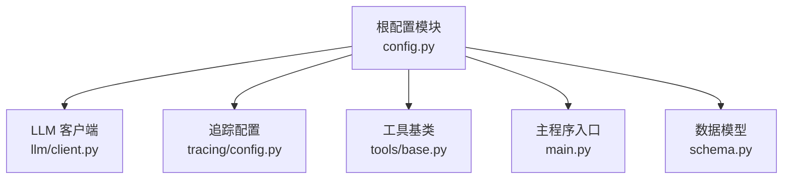
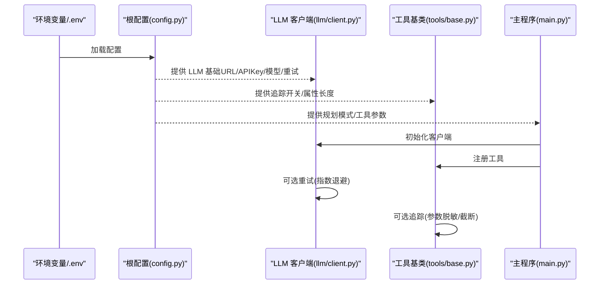

# 配置参数

<cite>
**本文引用的文件**
- [config.py](file://config.py)
- [main.py](file://main.py)
- [llm/client.py](file://llm/client.py)
- [tracing/config.py](file://tracing/config.py)
- [schema.py](file://schema.py)
- [tools/base.py](file://tools/base.py)
- [requirements.txt](file://requirements.txt)
- [tests/test_llm_integration.py](file://tests/test_llm_integration.py)
</cite>

## 目录
1. [简介](#简介)
2. [项目结构与配置来源](#项目结构与配置来源)
3. [核心配置类别与参数](#核心配置类别与参数)
4. [架构概览与配置交互](#架构概览与配置交互)
5. [详细配置项说明](#详细配置项说明)
6. [依赖关系与冲突处理](#依赖关系与冲突处理)
7. [性能与资源参数](#性能与资源参数)
8. [环境与部署建议](#环境与部署建议)
9. [配置验证与故障排查](#配置验证与故障排查)
10. [结论](#结论)

## 简介
本文件为 manus_demo 的配置参数参考文档，覆盖环境变量、配置选项与参数设置，说明每个配置项的作用、默认值、取值范围与影响范围，并提供 LLM API 配置、工具配置、追踪配置、性能参数等的完整清单。同时包含配置示例、最佳实践、依赖关系与冲突处理、生产与开发环境差异建议，以及验证与故障排查指南。

## 项目结构与配置来源
- 配置集中于根配置模块，通过环境变量或 .env 文件加载，优先级为：系统环境变量 > .env 文件。
- 根配置模块导出所有配置项，其他模块按需导入使用。
- 追踪配置通过独立模块集中读取根配置项，确保一致性与可维护性。
- LLM 客户端、工具基类、主程序等模块均以配置项为运行依据。

图表来源
- [config.py:1-109](file://config.py#L1-L109)
- [llm/client.py:41-67](file://llm/client.py#L41-L67)
- [tracing/config.py:17-43](file://tracing/config.py#L17-L43)
- [tools/base.py:74-76](file://tools/base.py#L74-L76)
- [main.py:448-455](file://main.py#L448-L455)

章节来源
- [config.py:1-11](file://config.py#L1-L11)
- [requirements.txt:1-19](file://requirements.txt#L1-L19)

## 核心配置类别与参数
- LLM API 配置：基础 URL、API Key、模型名称、重试机制
- 智能体与执行限制：上下文 Token 上限、ReAct 循环迭代上限、最大重规划尝试次数
- 记忆系统：长期记忆目录、短期记忆窗口
- 知识库：知识文档目录、切片大小、Top-K 检索数量
- 规划路由：规划模式（auto/simple/complex/emergent）
- DAG 执行：每超步最大并行节点数、执行超时、Checkpoint 数量
- 自适应规划（v3）：启用开关、检查间隔、最小完成节点数
- 工具路由（v3）：连续失败阈值
- 隐式规划（v5）：启用开关、TODO 最大项数、单项最大重试、上下文压缩阈值、主循环最大迭代
- 工具参数：沙箱目录、代码/Shell 执行超时、子进程最大并发、单次子进程最大输出字节
- 功能开关（v6/v8）：ReActEngine v2、目标驱动规划、反射间隔、停滞窗口等
- 追踪配置（v7）：总开关、后端、端点、服务名、采样率、是否记录 prompt、属性最大长度

章节来源
- [config.py:13-109](file://config.py#L13-L109)

## 架构概览与配置交互
- 根配置模块负责加载环境变量与提供默认值。
- LLM 客户端读取 LLM 基础 URL、API Key、模型与重试配置，按需创建追踪 Span。
- 工具基类在追踪开启时包装执行过程，记录参数与结果。
- 主程序根据配置选择规划模式、注册工具并运行 Orchestrator。
- 追踪配置模块从根配置读取，统一导出追踪相关常量。

图表来源
- [config.py:13-109](file://config.py#L13-L109)
- [llm/client.py:41-67](file://llm/client.py#L41-L67)
- [tools/base.py:74-146](file://tools/base.py#L74-L146)
- [main.py:448-455](file://main.py#L448-L455)

## 详细配置项说明

### LLM API 配置
- LLM_BASE_URL
  - 类型：字符串
  - 默认值：兼容 DeepSeek 的 API 地址
  - 作用：LLM 基础 API 地址，支持 OpenAI 兼容接口
  - 影响范围：所有 LLM 调用
  - 示例：https://api.deepseek.com/v1
- LLM_API_KEY
  - 类型：字符串
  - 默认值：空字符串
  - 作用：LLM 访问凭证
  - 影响范围：所有 LLM 调用
  - 示例：sk-xxxxxxxxxxxx
- LLM_MODEL
  - 类型：字符串
  - 默认值：deepseek-chat
  - 作用：使用的模型名称
  - 影响范围：所有 LLM 调用
  - 示例：deepseek-chat、gpt-4o、qwen-plus
- LLM_RETRY_ENABLED
  - 类型：布尔
  - 默认值：false
  - 作用：是否启用 LLM 调用重试
  - 影响范围：LLM 客户端调用流程
  - 示例：true/false
- LLM_RETRY_MAX_ATTEMPTS
  - 类型：整数
  - 默认值：3
  - 作用：最大重试次数
  - 影响范围：LLM 客户端重试逻辑
  - 示例：1/3/5
- LLM_RETRY_BACKOFF_FACTOR
  - 类型：浮点数
  - 默认值：2.0
  - 作用：指数退避因子（秒）
  - 影响范围：LLM 客户端重试等待时间
  - 示例：1.5/2.0/3.0

章节来源
- [config.py:17-19](file://config.py#L17-L19)
- [config.py:83-85](file://config.py#L83-L85)
- [llm/client.py:41-67](file://llm/client.py#L41-L67)
- [tests/test_llm_integration.py:127-138](file://tests/test_llm_integration.py#L127-L138)

### 智能体与执行限制
- MAX_CONTEXT_TOKENS
  - 类型：整数
  - 默认值：8000
  - 作用：上下文 Token 上限，超过后触发摘要压缩
  - 影响范围：上下文管理器与消息历史
  - 示例：4000/8000/16000
- MAX_REACT_ITERATIONS
  - 类型：整数
  - 默认值：10
  - 作用：每个 Action 节点 ReAct 循环最大迭代次数
  - 影响范围：ReAct 执行循环
  - 示例：5/10/20
- MAX_REPLAN_ATTEMPTS
  - 类型：整数
  - 默认值：3
  - 作用：反思失败后最大重规划尝试次数
  - 影响范围：反思与部分重规划
  - 示例：1/3/5

章节来源
- [config.py:23-25](file://config.py#L23-L25)

### 记忆系统
- MEMORY_DIR
  - 类型：字符串
  - 默认值：~/.manus_demo
  - 作用：长期记忆存储目录（JSON 文件）
  - 影响范围：长期记忆持久化
  - 示例：~/.manus_demo 或绝对路径
- SHORT_TERM_WINDOW
  - 类型：整数
  - 默认值：20
  - 作用：短期记忆滑动窗口大小（条数）
  - 影响范围：短期记忆管理
  - 示例：10/20/50

章节来源
- [config.py:29-30](file://config.py#L29-L30)

### 知识库
- KNOWLEDGE_DOCS_DIR
  - 类型：字符串
  - 默认值：项目根/knowledge/docs
  - 作用：知识文档目录（相对路径）
  - 影响范围：知识检索与切片
  - 示例：./knowledge/docs 或绝对路径
- KNOWLEDGE_CHUNK_SIZE
  - 类型：整数
  - 默认值：500
  - 作用：文档切片大小（字符数）
  - 影响范围：知识切片与检索
  - 示例：250/500/1000
- KNOWLEDGE_TOP_K
  - 类型：整数
  - 默认值：3
  - 作用：知识检索返回的最大条数
  - 影响范围：知识检索结果数量
  - 示例：1/3/5

章节来源
- [config.py:34-36](file://config.py#L34-L36)

### 规划路由
- PLAN_MODE
  - 类型：字符串
  - 默认值：auto
  - 作用：规划模式选择
  - 取值：auto | simple | complex | emergent
  - 影响范围：规划路径选择（v4 新增）
  - 示例：auto（自动）、simple（v1 扁平）、complex（v2 DAG）、emergent（v5 TODO）

章节来源
- [config.py](file://config.py#L40)

### DAG 执行
- MAX_PARALLEL_NODES
  - 类型：整数
  - 默认值：3
  - 作用：每个超步最多并行执行的节点数
  - 影响范围：DAG 并行执行
  - 示例：1/3/5
- NODE_EXECUTION_TIMEOUT
  - 类型：整数
  - 默认值：300
  - 作用：单个节点执行超时时间（秒）
  - 影响范围：DAG 节点执行
  - 示例：60/300/600
- MAX_CHECKPOINTS
  - 类型：整数
  - 默认值：10
  - 作用：内存中保留的最大 Checkpoint 数量
  - 影响范围：DAG 执行健壮性
  - 示例：5/10/20

章节来源
- [config.py](file://config.py#L44)
- [config.py:58-59](file://config.py#L58-L59)

### 自适应规划（v3）
- ADAPTIVE_PLANNING_ENABLED
  - 类型：布尔
  - 默认值：true
  - 作用：是否启用超步间自适应规划
  - 影响范围：自适应检查与变更应用
  - 示例：true/false
- ADAPT_PLAN_INTERVAL
  - 类型：整数
  - 默认值：1
  - 作用：每隔几个超步执行一次自适应检查
  - 影响范围：自适应检查频率
  - 示例：1/2/5
- ADAPT_PLAN_MIN_COMPLETED
  - 类型：整数
  - 默认值：1
  - 作用：至少完成多少个 ACTION 节点后才启动自适应
  - 影响范围：自适应触发条件
  - 示例：1/2/3

章节来源
- [config.py:48-50](file://config.py#L48-L50)

### 工具路由（v3）
- TOOL_FAILURE_THRESHOLD
  - 类型：整数
  - 默认值：2
  - 作用：连续失败多少次后建议切换工具
  - 影响范围：工具切换提示
  - 示例：1/2/3

章节来源
- [config.py](file://config.py#L54)

### 隐式规划（v5）
- EMERGENT_PLANNING_ENABLED
  - 类型：布尔
  - 默认值：true
  - 作用：是否启用隐式规划模式
  - 影响范围：TODO 列表生命周期与执行
  - 示例：true/false
- MAX_TODO_ITEMS
  - 类型：整数
  - 默认值：20
  - 作用：TODO 列表最大项数
  - 影响范围：TODO 列表容量
  - 示例：10/20/50
- MAX_TODO_RETRIES
  - 类型：整数
  - 默认值：3
  - 作用：单个 TODO 最大重试次数
  - 影响范围：TODO 重试策略
  - 示例：1/3/5
- TODO_COMPRESSION_THRESHOLD
  - 类型：浮点数
  - 默认值：0.8
  - 作用：上下文窗口使用率达到阈值时压缩 TODO
  - 影响范围：TODO 上下文压缩
  - 示例：0.6/0.8/0.9
- MAX_EMERGENT_OUTER_ITERATIONS
  - 类型：整数
  - 默认值：TODO 最大项数 × TODO 最大重试
  - 作用：Emergent 主循环最大迭代数（TODO 调度层）
  - 影响范围：隐式规划主循环上限
  - 示例：60/100/200

章节来源
- [config.py:63-67](file://config.py#L63-L67)

### 工具参数
- SANDBOX_DIR
  - 类型：字符串
  - 默认值：~/.manus_demo/sandbox
  - 作用：沙箱目录（文件操作和 Shell 命令的工作目录）
  - 影响范围：工具执行安全边界
  - 示例：~/.manus_demo/sandbox 或绝对路径
- CODE_EXEC_TIMEOUT
  - 类型：整数
  - 默认值：30
  - 作用：Python 代码执行超时时间（秒）
  - 影响范围：代码执行工具
  - 示例：10/30/60
- SHELL_EXEC_TIMEOUT
  - 类型：整数
  - 默认值：30
  - 作用：Shell 命令执行超时时间（秒）
  - 影响范围：Shell 工具
  - 示例：10/30/60
- SUBPROCESS_MAX_OUTPUT_BYTES
  - 类型：整数
  - 默认值：512KB
  - 作用：单次子进程最大输出字节数
  - 影响范围：子进程输出保护
  - 示例：128KB/512KB/1MB
- SHELL_MAX_CONCURRENT
  - 类型：整数
  - 默认值：3
  - 作用：最大并发 Shell 子进程数
  - 影响范围：并发执行控制
  - 示例：1/3/5
- CODE_MAX_CONCURRENT
  - 类型：整数
  - 默认值：3
  - 作用：最大并发代码执行子进程数
  - 影响范围：并发执行控制
  - 示例：1/3/5

章节来源
- [config.py:71-76](file://config.py#L71-L76)

### 功能开关（v6/v8）
- ENABLE_REACT_ENGINE_V2
  - 类型：布尔
  - 默认值：false
  - 作用：是否启用抽取后的统一 ReActEngine
  - 影响范围：ReAct 执行引擎
  - 示例：true/false
- TOKEN_TRACKING_ENABLED
  - 类型：布尔
  - 默认值：true
  - 作用：是否启用 Token 消耗追踪
  - 影响范围：LLM 调用 Token 记录
  - 示例：true/false
- ENABLE_GOAL_DRIVEN_PLANNER
  - 类型：布尔
  - 默认值：false
  - 作用：是否启用 v8 目标驱动规划引擎
  - 影响范围：目标驱动规划
  - 示例：true/false
- GOAL_REANCHOR_INTERVAL
  - 类型：整数
  - 默认值：5
  - 作用：每隔多少次外层迭代重新锚定目标文档
  - 影响范围：目标驱动规划周期
  - 示例：1/5/10
- GOAL_REFLECTION_INTERVAL
  - 类型：整数
  - 默认值：1
  - 作用：每隔多少次外层迭代执行目标反思
  - 影响范围：目标反思频率
  - 示例：1/2/5
- MAX_GOAL_DRIVEN_ITERATIONS
  - 类型：整数
  - 默认值：TODO 最大项数 × TODO 最大重试
  - 作用：v8 主循环最大迭代数
  - 影响范围：目标驱动规划主循环上限
  - 示例：60/100/200
- GOAL_DRIVEN_STAGNATION_WINDOW
  - 类型：整数
  - 默认值：3
  - 作用：连续多少轮无进度突破则提前终止
  - 影响范围：目标驱动规划早停
  - 示例：1/3/5

章节来源
- [config.py:80-85](file://config.py#L80-L85)
- [config.py](file://config.py#L88)
- [config.py:92-96](file://config.py#L92-L96)
- [config.py](file://config.py#L97)

### 追踪配置（v7）
- TRACING_ENABLED
  - 类型：布尔
  - 默认值：false
  - 作用：总开关（默认关闭）
  - 影响范围：全链路追踪
  - 示例：true/false
- TRACING_BACKEND
  - 类型：字符串
  - 默认值：console
  - 作用：导出后端
  - 取值：console | file | rich | otlp | phoenix
  - 影响范围：追踪导出方式
  - 示例：console/file/otlp
- TRACING_ENDPOINT
  - 类型：字符串
  - 默认值：http://localhost:4318
  - 作用：OTLP HTTP 端点地址
  - 影响范围：OTLP 导出
  - 示例：http://localhost:4318
- TRACING_SERVICE_NAME
  - 类型：字符串
  - 默认值：manus-demo
  - 作用：服务标识
  - 影响范围：追踪资源标识
  - 示例：manus-demo/prod-demo
- TRACING_SAMPLE_RATE
  - 类型：浮点数
  - 默认值：1.0
  - 作用：采样率（0.0–1.0）
  - 影响范围：追踪采样
  - 示例：0.1/0.5/1.0
- TRACING_LOG_PROMPTS
  - 类型：布尔
  - 默认值：false
  - 作用：是否记录完整 prompt（隐私保护）
  - 影响范围：追踪 Span 内容
  - 示例：true/false
- TRACING_MAX_ATTRIBUTE_LENGTH
  - 类型：整数
  - 默认值：1000
  - 作用：属性值最大字符数（截断保护）
  - 影响范围：追踪属性长度
  - 示例：500/1000/2000

章节来源
- [config.py:102-109](file://config.py#L102-L109)
- [tracing/config.py:17-43](file://tracing/config.py#L17-L43)

## 依赖关系与冲突处理
- 环境变量加载顺序：系统环境变量 > .env 文件（根目录）
- LLM 客户端与配置耦合：模型、基础 URL、API Key、重试参数均由根配置注入
- 追踪配置与根配置耦合：追踪模块从根配置读取，确保一致性
- 工具参数与安全：沙箱目录与子进程输出限制共同保障执行安全
- 规划模式与执行路径：PLAN_MODE 控制 v1/v2/v5 路径选择，避免冲突
- 自适应规划与隐式规划：两者互斥或可叠加，需注意检查间隔与迭代上限的协调
- 目标驱动规划与隐式规划：二者为不同范式，需明确启用策略

章节来源
- [config.py](file://config.py#L11)
- [llm/client.py:50-54](file://llm/client.py#L50-L54)
- [tracing/config.py:17-43](file://tracing/config.py#L17-L43)
- [tools/base.py:74-76](file://tools/base.py#L74-L76)

## 性能与资源参数
- 上下文 Token 上限（MAX_CONTEXT_TOKENS）：影响上下文压缩频率与成本
- 并行度（MAX_PARALLEL_NODES）：影响吞吐与资源占用
- 超时与重试（NODE_EXECUTION_TIMEOUT、LLM_RETRY_*）：平衡稳定性与响应时间
- 子进程并发与输出限制（SHELL_MAX_CONCURRENT、CODE_MAX_CONCURRENT、SUBPROCESS_MAX_OUTPUT_BYTES）：防止资源耗尽
- 追踪采样率（TRACING_SAMPLE_RATE）：降低追踪开销
- 目标驱动与隐式规划的迭代上限：控制主循环成本

章节来源
- [config.py](file://config.py#L23)
- [config.py](file://config.py#L44)
- [config.py:58-59](file://config.py#L58-L59)
- [config.py:71-76](file://config.py#L71-L76)
- [config.py:83-85](file://config.py#L83-L85)
- [config.py](file://config.py#L106)

## 环境与部署建议
- 开发环境
  - 关闭追踪（TRACING_ENABLED=false），提高性能
  - 启用 Token 追踪（TOKEN_TRACKING_ENABLED=true）以便成本分析
  - 设置较小的 MAX_CONTEXT_TOKENS 与 MAX_PARALLEL_NODES
  - 使用本地或测试 LLM 服务，适当降低超时
- 生产环境
  - 启用追踪（TRACING_ENABLED=true），选择 OTLP 后端并配置端点
  - 合理设置采样率（TRACING_SAMPLE_RATE）与属性长度（TRACING_MAX_ATTRIBUTE_LENGTH）
  - 配置 LLM 重试（LLM_RETRY_ENABLED=true，LLM_RETRY_MAX_ATTEMPTS≥2）
  - 严格设置沙箱目录与子进程并发限制，防止越权与资源滥用
  - 明确 PLAN_MODE，结合业务复杂度选择 auto/simple/complex/emergent
  - 目标驱动规划与隐式规划按需启用，避免过度复杂化

章节来源
- [config.py:102-109](file://config.py#L102-L109)
- [config.py:83-85](file://config.py#L83-L85)
- [config.py:71-76](file://config.py#L71-L76)
- [config.py](file://config.py#L40)

## 配置验证与故障排查
- 环境变量加载验证
  - 确认 .env 文件位于项目根目录，系统环境变量优先级更高
  - 使用测试用例验证 .env 加载与变量存在性
- LLM 重试验证
  - 设置 LLM_RETRY_ENABLED=true，观察重试日志与退避时间
  - 检查 LLM_RETRY_MAX_ATTEMPTS 与 LLM_RETRY_BACKOFF_FACTOR 的组合
- 追踪验证
  - TRACING_ENABLED=true 时，确认后端可用（console/file/otlp/phoenix）
  - OTLP 端点可达，服务名与采样率符合预期
- 工具安全验证
  - 沙箱目录权限正确，子进程输出未超过限制
  - 子进程环境变量中敏感键被清理
- 规划模式验证
  - PLAN_MODE 与期望的执行路径一致
  - 隐式规划与目标驱动规划不同时启用导致的冲突

章节来源
- [tests/test_llm_integration.py:127-138](file://tests/test_llm_integration.py#L127-L138)
- [llm/client.py:93-115](file://llm/client.py#L93-L115)
- [tracing/config.py:17-43](file://tracing/config.py#L17-L43)
- [tools/subprocess_utils.py:38-52](file://tools/subprocess_utils.py#L38-L52)

## 结论
本文提供了 manus_demo 的完整配置参数参考，涵盖 LLM API、工具、追踪、性能与规划等关键配置项。通过明确默认值、取值范围与影响范围，并结合依赖关系与冲突处理、验证与故障排查指南，可帮助开发者在不同环境下高效、稳定地部署与优化系统。