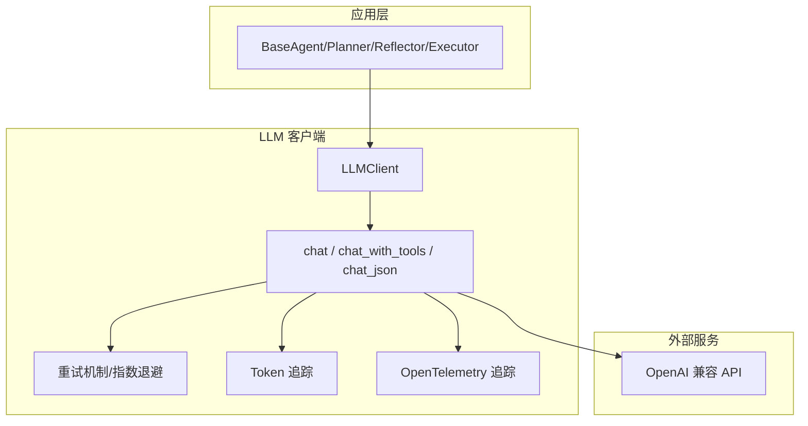
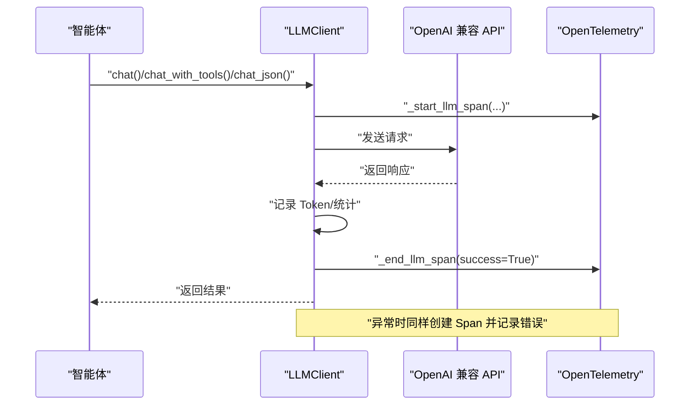
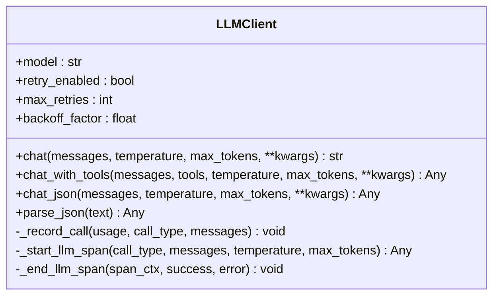
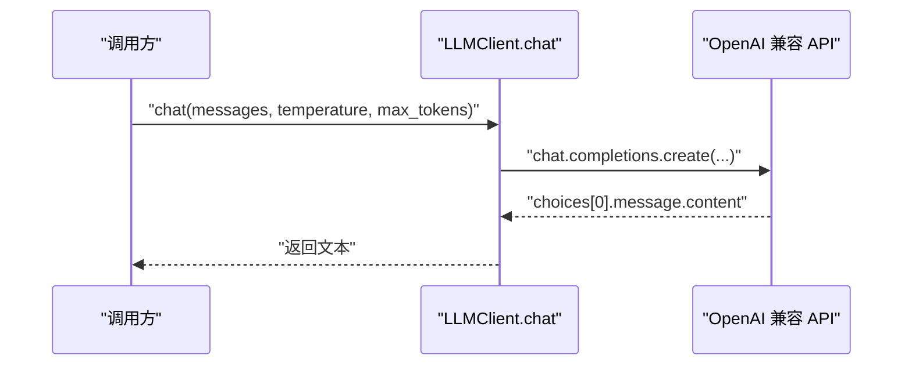
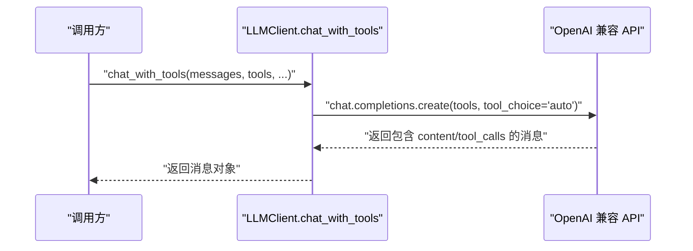
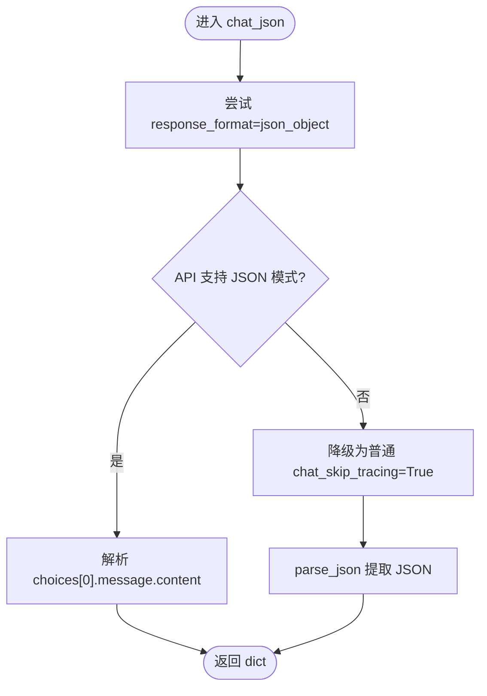
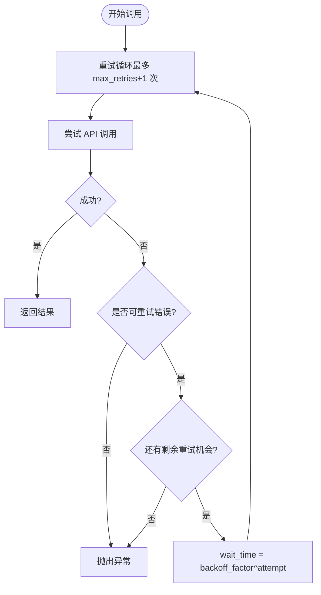
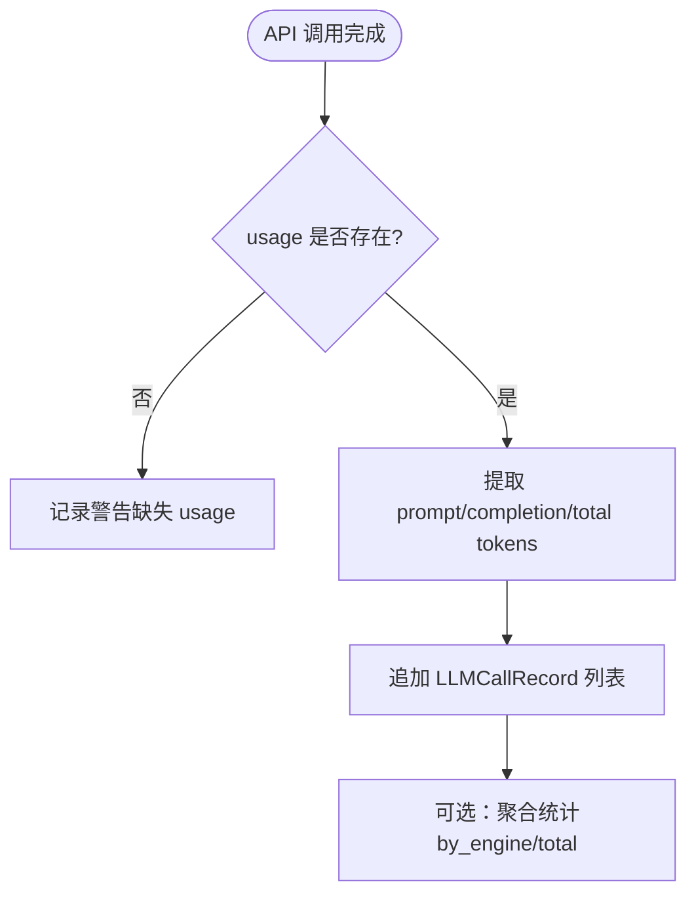
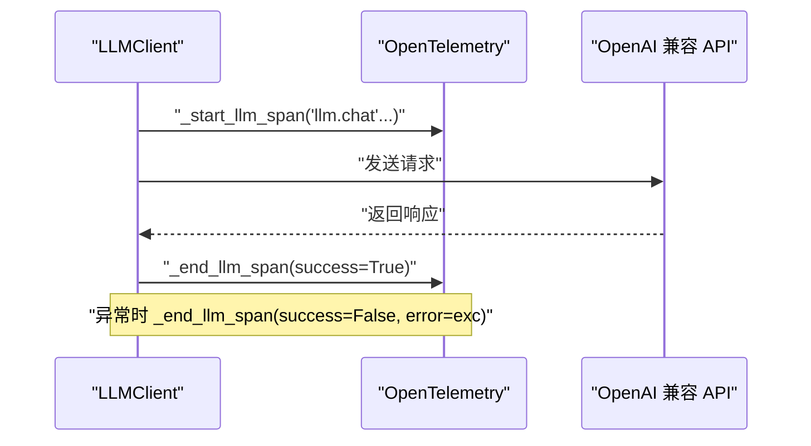
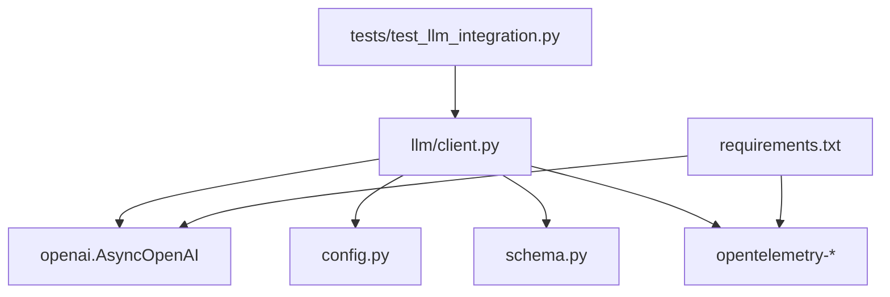

# LLM客户端

<cite>
**本文引用的文件**
- [llm/client.py](file://llm/client.py)
- [config.py](file://config.py)
- [schema.py](file://schema.py)
- [tests/test_llm_integration.py](file://tests/test_llm_integration.py)
- [sxw_aicoding/docs/llm-integration.md](file://sxw_aicoding/docs/llm-integration.md)
- [sxw_aicoding/docs/tracing-design.md](file://sxw_aicoding/docs/tracing-design.md)
- [README_CN.md](file://README_CN.md)
- [README.md](file://README.md)
- [requirements.txt](file://requirements.txt)
</cite>

## 目录
1. [简介](#简介)
2. [项目结构](#项目结构)
3. [核心组件](#核心组件)
4. [架构总览](#架构总览)
5. [详细组件分析](#详细组件分析)
6. [依赖分析](#依赖分析)
7. [性能考量](#性能考量)
8. [故障排查指南](#故障排查指南)
9. [结论](#结论)
10. [附录](#附录)

## 简介
本文件为 LLM 客户端（LLMClient）的深入技术文档，聚焦于其统一封装 OpenAI 兼容 API 的设计与实现，涵盖三大调用模式（chat、chat_with_tools、chat_json）、可选重试机制（指数退避）、JSON 模式降级策略、Token 使用追踪与成本控制、以及 v7 全链路追踪（OpenTelemetry）集成。文档同时提供使用示例、最佳实践与性能优化建议，帮助开发者在多智能体系统中稳定、高效地使用 LLM。

## 项目结构
- LLM 客户端位于 llm/client.py，提供对 OpenAI 兼容 API 的轻量异步封装，统一管理凭证、模型与可选特性（重试、追踪、Token 追踪）。
- 配置项集中在 config.py，支持通过 .env 或环境变量注入（如 LLM_BASE_URL、LLM_API_KEY、LLM_MODEL、LLM_RETRY_*、TRACING_*、TOKEN_TRACKING_ENABLED 等）。
- 数据模型 schema.py 定义了 LLMCallRecord、TokenUsage、TokenUsageSummary 等，支撑 Token 追踪与统计。
- 测试 tests/test_llm_integration.py 验证 chat/chat_with_tools/chat_json、错误处理与重试机制、ReAct 集成等。
- 文档 sxw_aicoding/docs/llm-integration.md 与 sxw_aicoding/docs/tracing-design.md 提供使用指南与追踪设计说明。
- README_CN.md/README.md 描述系统整体架构与设计理念，便于理解 LLMClient 在多智能体系统中的定位。

图表来源
- [llm/client.py:32-420](file://llm/client.py#L32-L420)
- [config.py:17-109](file://config.py#L17-L109)
- [schema.py:314-335](file://schema.py#L314-L335)

章节来源
- [README_CN.md:122-174](file://README_CN.md#L122-L174)
- [README.md:97-154](file://README.md#L97-L154)

## 核心组件
- LLMClient：统一的异步封装，负责与 OpenAI 兼容 API 通信，提供 chat、chat_with_tools、chat_json 三种调用模式，并支持可选重试、Token 追踪与 OpenTelemetry 追踪。
- 配置模块 config：集中管理 LLM 与系统特性开关（重试、追踪、Token 追踪、模型与端点等）。
- 数据模型 schema：定义 LLMCallRecord、TokenUsage、TokenUsageSummary 等，支撑 Token 使用记录与统计。
- 测试用例 tests/test_llm_integration.py：覆盖三大调用模式、错误处理与重试、ReAct 集成等。
- 文档 sxw_aicoding/docs/llm-integration.md：提供使用示例、最佳实践与性能优化建议。
- 文档 sxw_aicoding/docs/tracing-design.md：说明 v7 全链路追踪的设计与实现要点。

章节来源
- [llm/client.py:32-420](file://llm/client.py#L32-L420)
- [config.py:17-109](file://config.py#L17-L109)
- [schema.py:314-335](file://schema.py#L314-L335)
- [tests/test_llm_integration.py:105-535](file://tests/test_llm_integration.py#L105-L535)
- [sxw_aicoding/docs/llm-integration.md:1-800](file://sxw_aicoding/docs/llm-integration.md#L1-L800)
- [sxw_aicoding/docs/tracing-design.md:474-513](file://sxw_aicoding/docs/tracing-design.md#L474-L513)

## 架构总览
LLMClient 作为多智能体系统的统一 LLM 适配层，向上为 BaseAgent/Planner/Reflector/Executor 提供一致的调用接口，向下对接 OpenAI 兼容 API。其核心特性包括：
- 三种调用模式：chat（自由文本）、chat_with_tools（函数调用/工具调用）、chat_json（结构化 JSON 输出）。
- 可选重试机制：指数退避，自动处理速率限制、超时与通用 API 错误。
- Token 使用追踪：记录每次调用的 prompt/completion/total token，并支持统计与成本控制。
- 全链路追踪：v7 引入 OpenTelemetry 集成，自动创建 llm.chat、llm.chat_with_tools、llm.chat_json 等 Span，记录属性与异常。

图表来源
- [llm/client.py:73-118](file://llm/client.py#L73-L118)
- [llm/client.py:125-176](file://llm/client.py#L125-L176)
- [llm/client.py:183-228](file://llm/client.py#L183-L228)
- [llm/client.py:317-419](file://llm/client.py#L317-L419)

## 详细组件分析

### LLMClient 类设计与职责
- 统一管理 AsyncOpenAI 客户端、模型、凭证与可选特性（重试、追踪、Token 追踪）。
- 提供三种调用模式：chat、chat_with_tools、chat_json。
- 内置指数退避重试逻辑与可重试错误类型过滤。
- 支持 Token 使用追踪与统计，以及 OpenTelemetry 全链路追踪。

图表来源
- [llm/client.py:32-420](file://llm/client.py#L32-L420)

章节来源
- [llm/client.py:41-67](file://llm/client.py#L41-L67)
- [llm/client.py:32-420](file://llm/client.py#L32-L420)

### 三种调用模式

#### chat（基础文本对话）
- 用途：需要自由文本输出的场景（如 Reflector 的反馈、ContextManager 的摘要）。
- 行为：发送消息到 LLM，返回 assistant 的文本响应；支持可选重试与 Token 追踪；v7 支持 OpenTelemetry 追踪。
- 参数：messages、temperature、max_tokens、**kwargs。
- 返回：str。

图表来源
- [llm/client.py:73-118](file://llm/client.py#L73-L118)

章节来源
- [llm/client.py:73-118](file://llm/client.py#L73-L118)
- [tests/test_llm_integration.py:148-203](file://tests/test_llm_integration.py#L148-L203)

#### chat_with_tools（带工具调用的对话）
- 用途：ReAct 循环的核心，让 LLM 自主决定是否调用工具以及调用哪个工具（tool_choice="auto"）。
- 行为：发送消息与工具定义，返回原始响应消息对象（包含 content 与 tool_calls），支持可选重试与 Token 追踪；v7 支持 OpenTelemetry 追踪。
- 参数：messages、tools（OpenAI function calling 格式）、temperature、max_tokens、**kwargs。
- 返回：原始响应消息对象。

图表来源
- [llm/client.py:125-176](file://llm/client.py#L125-L176)

章节来源
- [llm/client.py:125-176](file://llm/client.py#L125-L176)
- [tests/test_llm_integration.py:205-272](file://tests/test_llm_integration.py#L205-L272)

#### chat_json（结构化 JSON 输出）
- 用途：需要结构化输出的场景（如 Planner 生成计划、Reflector 生成评估结果）。
- 行为：优先使用 response_format={"type": "json_object"} 强制 JSON 输出；若模型/服务不支持，则降级为普通文本模式并通过 parse_json 提取 JSON。
- 参数：messages、temperature（建议较低温度以提升结构稳定性）、max_tokens、**kwargs。
- 返回：dict（解析后的 JSON 对象）。

图表来源
- [llm/client.py:183-228](file://llm/client.py#L183-L228)
- [llm/client.py:235-266](file://llm/client.py#L235-L266)

章节来源
- [llm/client.py:183-228](file://llm/client.py#L183-L228)
- [llm/client.py:235-266](file://llm/client.py#L235-L266)
- [tests/test_llm_integration.py:274-303](file://tests/test_llm_integration.py#L274-L303)

### 请求重试机制（指数退避）
- 设计动机：应对速率限制、超时与临时错误，提高系统鲁棒性。
- 可重试错误类型：RateLimitError、APITimeoutError、APIError。
- 退避策略：wait_time = backoff_factor ** attempt，逐次指数增长。
- 配置项：LLM_RETRY_ENABLED、LLM_RETRY_MAX_ATTEMPTS、LLM_RETRY_BACKOFF_FACTOR。
- 行为：在每个调用模式内部循环执行，遇到可重试错误时等待后重试，直至成功或达到最大重试次数。

图表来源
- [llm/client.py:93-115](file://llm/client.py#L93-L115)
- [config.py:82-85](file://config.py#L82-L85)

章节来源
- [llm/client.py:93-115](file://llm/client.py#L93-L115)
- [config.py:82-85](file://config.py#L82-L85)
- [tests/test_llm_integration.py:305-334](file://tests/test_llm_integration.py#L305-L334)

### JSON 模式降级机制
- 优先使用 response_format=json_object 强制 JSON 输出。
- 若 API 不支持 response_format（如部分本地模型/服务），捕获异常后降级为普通 chat，并通过 parse_json 提取 JSON。
- parse_json 支持两种策略：直接解析与 Markdown 代码块提取，失败时抛出 ValueError 并附带原始输出片段，便于调试。

章节来源
- [llm/client.py:203-228](file://llm/client.py#L203-L228)
- [llm/client.py:235-266](file://llm/client.py#L235-L266)
- [tests/test_llm_integration.py:274-303](file://tests/test_llm_integration.py#L274-L303)

### Token 使用追踪与成本控制
- 记录维度：prompt_tokens、completion_tokens、total_tokens、engine、call_type、prompt_summary。
- 记录位置：在每次 API 调用后调用 _record_call，将 LLMCallRecord 追加到内部列表。
- 统计聚合：通过 schema 中的 TokenUsage 与 TokenUsageSummary 支撑全局统计。
- 成本控制：结合 total_tokens 与模型单价估算成本，配合 max_tokens 限制输出长度，降低费用。

图表来源
- [llm/client.py:273-311](file://llm/client.py#L273-L311)
- [schema.py:314-335](file://schema.py#L314-L335)

章节来源
- [llm/client.py:273-311](file://llm/client.py#L273-L311)
- [schema.py:314-335](file://schema.py#L314-L335)

### 全链路追踪集成（OpenTelemetry）
- v7 新增：在每次 LLM 调用前后创建/结束 Span，命名规范为 llm.chat、llm.chat_with_tools、llm.chat_json。
- 属性设置：gen_ai.system、gen_ai.request.model、gen_ai.call_type、gen_ai.request.temperature、gen_ai.request.max_tokens、latency_ms、gen_ai.usage.* 等。
- 上下文管理：使用 OpenTelemetry 上下文，确保嵌套 Span（如工具调用）成为 LLM Span 的子级。
- 错误处理：异常时记录 error.type、error.message，并设置状态为 ERROR。
- 配置项：TRACING_ENABLED、TRACING_BACKEND、TRACING_ENDPOINT、TRACING_SERVICE_NAME、TRACING_SAMPLE_RATE、TRACING_LOG_PROMPTS、TRACING_MAX_ATTRIBUTE_LENGTH。

图表来源
- [llm/client.py:317-419](file://llm/client.py#L317-L419)
- [config.py:102-109](file://config.py#L102-L109)

章节来源
- [llm/client.py:317-419](file://llm/client.py#L317-L419)
- [config.py:102-109](file://config.py#L102-L109)
- [sxw_aicoding/docs/tracing-design.md:474-513](file://sxw_aicoding/docs/tracing-design.md#L474-L513)

## 依赖分析
- LLMClient 依赖 OpenAI SDK（AsyncOpenAI）进行异步调用。
- 追踪依赖 OpenTelemetry（opentelemetry-api/sdk/exporter-otlp）。
- 配置依赖 python-dotenv 加载 .env。
- 测试依赖 pytest 与 pytest-asyncio。

图表来源
- [llm/client.py:22-25](file://llm/client.py#L22-L25)
- [requirements.txt:1-19](file://requirements.txt#L1-L19)

章节来源
- [requirements.txt:1-19](file://requirements.txt#L1-L19)
- [llm/client.py:22-25](file://llm/client.py#L22-L25)

## 性能考量
- 重试与退避：合理设置 LLM_RETRY_MAX_ATTEMPTS 与 LLM_RETRY_BACKOFF_FACTOR，避免过度重试导致延迟放大。
- Token 控制：通过 max_tokens 限制输出长度，结合系统提示词与上下文压缩减少输入 token。
- 并发与批处理：在任务层面并发调用多个独立 LLM 请求，减少总体等待时间。
- 模型选择：根据任务复杂度选择合适模型，平衡性能与成本。
- 追踪开销：TRACING_ENABLED 默认关闭，生产环境可根据需要开启并设置采样率。

[本节为通用指导，不直接分析具体文件]

## 故障排查指南
- 重试机制未生效：确认 LLM_RETRY_ENABLED=true，且请求抛出的是可重试错误类型（RateLimitError、APITimeoutError、APIError）。
- JSON 解析失败：捕获 ValueError，查看错误消息中的原始输出片段，调整 prompt 引导 LLM 输出正确格式。
- 追踪异常：检查 TRACING_ENABLED、TRACING_BACKEND、TRACING_ENDPOINT 等配置，确保 OpenTelemetry SDK 正常加载。
- Token 追踪缺失：确认 TOKEN_TRACKING_ENABLED=true，且 API 返回 usage 字段；若缺失需在调用后记录警告。

章节来源
- [tests/test_llm_integration.py:305-334](file://tests/test_llm_integration.py#L305-L334)
- [config.py:82-85](file://config.py#L82-L85)
- [config.py:102-109](file://config.py#L102-L109)
- [config.py:87-88](file://config.py#L87-L88)

## 结论
LLMClient 通过统一的 OpenAI 兼容封装，提供了灵活稳定的 LLM 调用能力。其三大调用模式覆盖从自由文本到结构化输出再到工具调用的完整场景；可选重试机制与指数退避显著提升了鲁棒性；Token 追踪与 OpenTelemetry 追踪为成本控制与可观测性提供了坚实基础。结合合理的配置与最佳实践，可在多智能体系统中实现高性能、可维护的 LLM 集成。

[本节为总结性内容，不直接分析具体文件]

## 附录

### 使用示例与最佳实践
- chat：适用于反思、摘要等自由文本输出场景，建议使用较低 temperature 以获得更一致的风格。
- chat_with_tools：ReAct 循环的核心，工具定义需遵循 OpenAI function calling 格式，tool_choice="auto" 让 LLM 自主决策。
- chat_json：结构化输出首选，建议使用较低 temperature（如 0.3），并在 system prompt 中明确 JSON 结构要求；若模型不支持 response_format，将自动降级。
- 重试：生产环境建议启用 LLM_RETRY_ENABLED，合理设置最大重试次数与退避因子。
- 追踪：v7 开启 TRACING_ENABLED，结合 TRACING_SAMPLE_RATE 控制采样；谨慎开启 TRACING_LOG_PROMPTS 以保护隐私。
- Token 追踪：开启 TOKEN_TRACKING_ENABLED，定期导出 LLMCallRecord 并进行统计分析，制定成本控制策略。

章节来源
- [sxw_aicoding/docs/llm-integration.md:123-555](file://sxw_aicoding/docs/llm-integration.md#L123-L555)
- [config.py:82-109](file://config.py#L82-L109)
- [schema.py:314-335](file://schema.py#L314-L335)