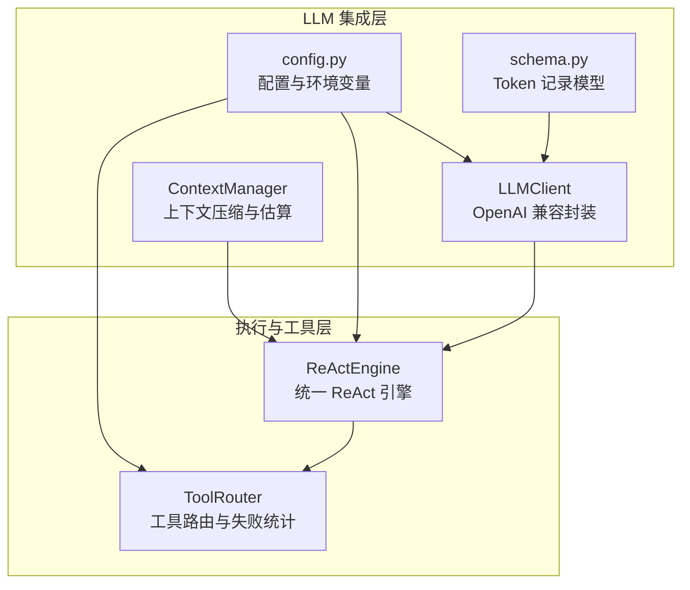
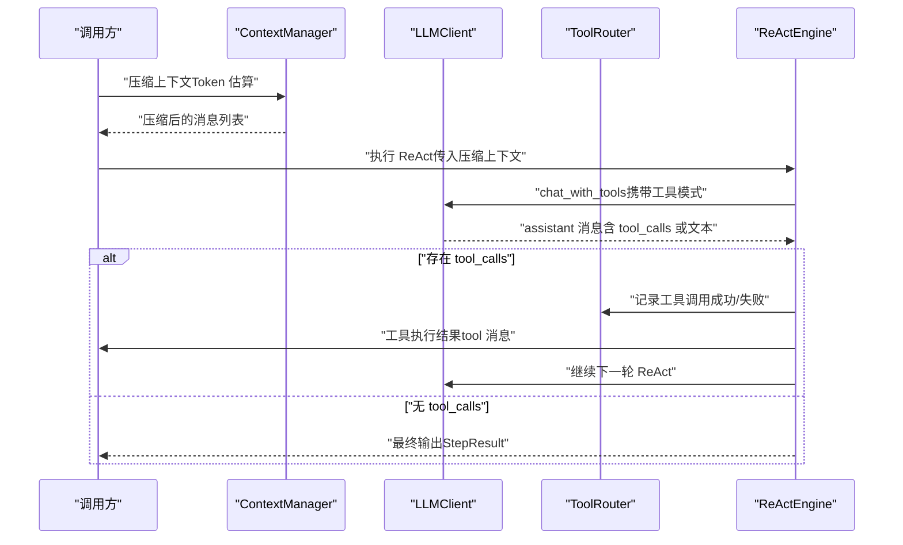
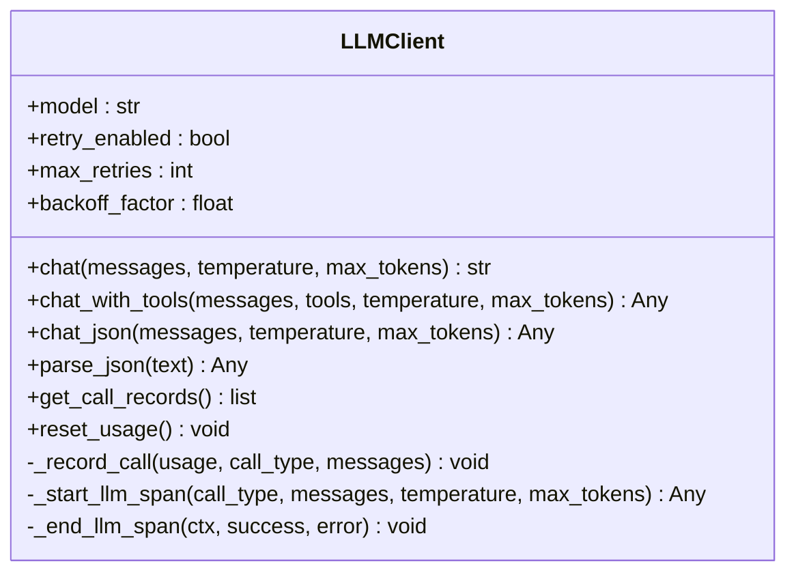
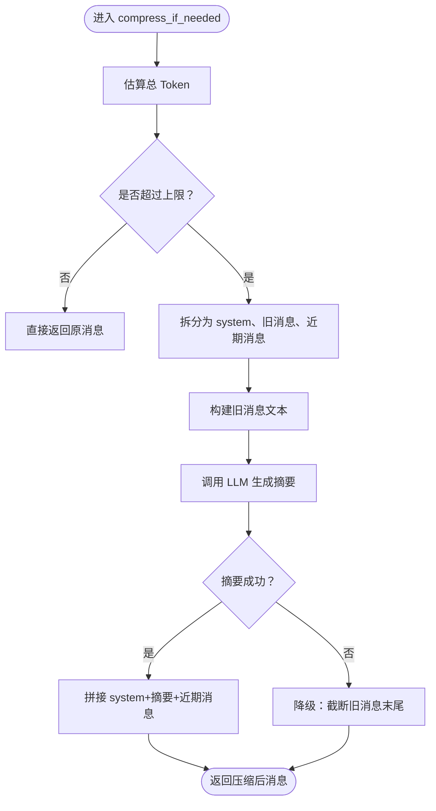
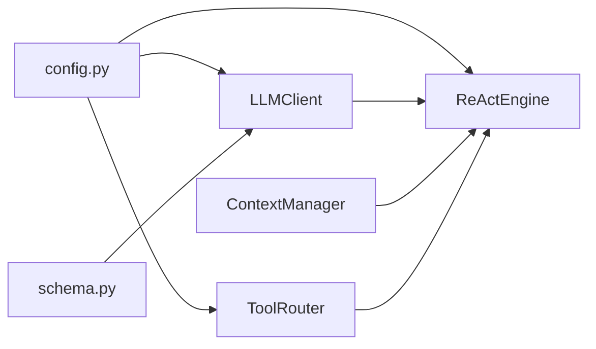

# LLM集成

<cite>
**本文引用的文件**
- [llm/client.py](file://llm/client.py)
- [context/manager.py](file://context/manager.py)
- [config.py](file://config.py)
- [schema.py](file://schema.py)
- [react/engine.py](file://react/engine.py)
- [tools/router.py](file://tools/router.py)
- [tests/test_llm_integration.py](file://tests/test_llm_integration.py)
</cite>

## 目录
1. [简介](#简介)
2. [项目结构](#项目结构)
3. [核心组件](#核心组件)
4. [架构总览](#架构总览)
5. [详细组件分析](#详细组件分析)
6. [依赖分析](#依赖分析)
7. [性能考虑](#性能考虑)
8. [故障排除指南](#故障排除指南)
9. [结论](#结论)
10. [附录](#附录)

## 简介
本文件面向 manus_demo 的 LLM 集成，系统性阐述 LLM 客户端（LLMClient）的 API 封装与请求重试机制、上下文管理（ContextManager）的上下文压缩与 Token 估算、LLM API 的配置选项与环境变量、不同 LLM 提供商支持情况（DeepSeek、OpenAI、通义千问、Ollama 等）、配置示例与最佳实践、错误处理与重试策略、性能优化与成本控制、故障排除与调试技巧，以及如何扩展支持新的 LLM 提供商。

## 项目结构
LLM 集成相关的关键模块与职责如下：
- llm/client.py：统一的 OpenAI 兼容 API 封装，提供基础对话、函数调用、结构化 JSON 输出、重试、追踪与 Token 消耗记录。
- context/manager.py：基于 Token 估算的上下文压缩与摘要，保留 system 提示与近期消息，必要时通过 LLM 压缩历史。
- config.py：集中式配置加载与环境变量映射，涵盖 LLM API、上下文限制、重试、追踪、工具路由等。
- schema.py：数据模型，包含 Token 消耗记录与聚合模型，支撑追踪与成本统计。
- react/engine.py：统一 ReAct 执行引擎，整合 LLM 调用、工具路由、迭代控制与错误处理。
- tools/router.py：工具路由与失败统计，提供基于失败次数的替代工具建议。
- tests/test_llm_integration.py：LLM 集成验证测试，覆盖初始化、聊天、函数调用、JSON 输出、重试与端到端流程。

图表来源
- [llm/client.py:32-420](file://llm/client.py#L32-L420)
- [context/manager.py:22-187](file://context/manager.py#L22-L187)
- [config.py:13-109](file://config.py#L13-L109)
- [schema.py:314-335](file://schema.py#L314-L335)
- [react/engine.py:43-246](file://react/engine.py#L43-L246)
- [tools/router.py:47-168](file://tools/router.py#L47-L168)

章节来源
- [llm/client.py:1-420](file://llm/client.py#L1-L420)
- [context/manager.py:1-187](file://context/manager.py#L1-L187)
- [config.py:1-109](file://config.py#L1-L109)
- [schema.py:1-688](file://schema.py#L1-L688)
- [react/engine.py:1-246](file://react/engine.py#L1-L246)
- [tools/router.py:1-168](file://tools/router.py#L1-L168)
- [tests/test_llm_integration.py:1-535](file://tests/test_llm_integration.py#L1-L535)

## 核心组件
- LLMClient：统一的异步 OpenAI 兼容客户端，支持基础聊天、函数调用、结构化 JSON 输出、可选重试、追踪与 Token 消耗记录。
- ContextManager：基于 Token 估算的上下文压缩，保留 system 与近期消息，必要时通过 LLM 生成摘要。
- ReActEngine：统一的 ReAct 执行引擎，整合 LLM 调用、工具路由、迭代控制与错误处理。
- ToolRouter：工具路由与失败统计，提供替代工具建议，避免工具失败导致的死循环。
- 配置系统：集中式环境变量加载与默认值，支持 LLM API、上下文限制、重试、追踪、工具路由等。

章节来源
- [llm/client.py:32-420](file://llm/client.py#L32-L420)
- [context/manager.py:22-187](file://context/manager.py#L22-L187)
- [react/engine.py:43-246](file://react/engine.py#L43-L246)
- [tools/router.py:47-168](file://tools/router.py#L47-L168)
- [config.py:13-109](file://config.py#L13-L109)

## 架构总览
LLM 集成采用“客户端 + 上下文管理 + 执行引擎 + 工具路由”的分层设计，通过统一的配置中心与数据模型支撑追踪与成本统计。

图表来源
- [context/manager.py:82-136](file://context/manager.py#L82-L136)
- [react/engine.py:84-241](file://react/engine.py#L84-L241)
- [llm/client.py:125-176](file://llm/client.py#L125-L176)
- [tools/router.py:82-105](file://tools/router.py#L82-L105)

## 详细组件分析

### LLM 客户端（LLMClient）API 封装与重试机制
- 统一封装：基于 AsyncOpenAI，支持基础聊天、函数调用（tool_choice="auto"）、结构化 JSON 输出（response_format=json_object 降级为文本解析）。
- 可选重试：通过配置开关启用指数退避重试，支持最大重试次数与退避因子；对速率限制、超时与 API 错误进行捕获与重试。
- 追踪集成：在 v7 引入 OpenTelemetry 追踪，记录请求属性、延迟与 Token 使用，支持可选记录完整 prompt。
- Token 消耗记录：在启用追踪时记录每次调用的 prompt/completion/total tokens，并提供查询与重置接口。
- 错误处理：统一捕获可重试错误并在禁用重试时直接抛出；在追踪 span 中记录错误类型与消息。

图表来源
- [llm/client.py:32-420](file://llm/client.py#L32-L420)
- [schema.py:314-335](file://schema.py#L314-L335)

章节来源
- [llm/client.py:32-420](file://llm/client.py#L32-L420)
- [schema.py:314-335](file://schema.py#L314-L335)

### 上下文管理（ContextManager）的上下文压缩与 Token 估算
- Token 估算：按字符粗略估算（英文约每 3 字符 1 Token，CJK 约每 2 字符 1 Token），并为每条消息增加固定开销，避免依赖 tiktoken。
- 压缩策略：将消息拆分为 system、旧消息、近期消息三部分；保留 system 与近期消息，旧消息通过 LLM 生成摘要并替换为单条摘要消息；若摘要失败则降级为截断。
- 交互流程：在 ReAct 循环前调用 compress_if_needed，确保上下文不超过配置上限。

图表来源
- [context/manager.py:82-186](file://context/manager.py#L82-L186)

章节来源
- [context/manager.py:22-187](file://context/manager.py#L22-L187)

### LLM API 配置选项与环境变量
- LLM 基础配置：LLM_BASE_URL、LLM_API_KEY、LLM_MODEL。
- 上下文与执行限制：MAX_CONTEXT_TOKENS、MAX_REACT_ITERATIONS、MAX_REPLAN_ATTEMPTS。
- 记忆与知识：MEMORY_DIR、SHORT_TERM_WINDOW、KNOWLEDGE_DOCS_DIR、KNOWLEDGE_CHUNK_SIZE、KNOWLEDGE_TOP_K。
- DAG 执行与健壮性：MAX_PARALLEL_NODES、NODE_EXECUTION_TIMEOUT、MAX_CHECKPOINTS。
- 自适应规划与工具路由：ADAPTIVE_PLANNING_ENABLED、ADAPT_PLAN_INTERVAL、ADAPT_PLAN_MIN_COMPLETED、TOOL_FAILURE_THRESHOLD。
- ReAct 引擎与 LLM 重试：ENABLE_REACT_ENGINE_V2、LLM_RETRY_ENABLED、LLM_RETRY_MAX_ATTEMPTS、LLM_RETRY_BACKOFF_FACTOR。
- Token 跟踪：TOKEN_TRACKING_ENABLED。
- 目标驱动规划：ENABLE_GOAL_DRIVEN_PLANNER、GOAL_REANCHOR_INTERVAL、GOAL_REFLECTION_INTERVAL、MAX_GOAL_DRIVEN_ITERATIONS、GOAL_DRIVEN_STAGNATION_WINDOW。
- 追踪配置（v7）：TRACING_ENABLED、TRACING_BACKEND、TRACING_ENDPOINT、TRACING_SERVICE_NAME、TRACING_SAMPLE_RATE、TRACING_LOG_PROMPTS、TRACING_MAX_ATTRIBUTE_LENGTH。

章节来源
- [config.py:13-109](file://config.py#L13-L109)

### 不同 LLM 提供商支持情况
- OpenAI 兼容：LLMClient 基于 AsyncOpenAI，理论上支持任何暴露 OpenAI 兼容 chat completions 接口的服务商。
- DeepSeek：默认基地址与模型已在配置中体现，可直接使用。
- 通义千问（DashScope/Qwen）：可通过设置 LLM_BASE_URL 指向 DashScope API，LLM_MODEL 设置为对应模型名。
- Ollama：可通过设置 LLM_BASE_URL 为本地 Ollama 服务地址，LLM_MODEL 设置为本地模型名；对于不支持 response_format 的模型，LLMClient 会自动降级为文本解析。
- vLLM：作为 OpenAI 兼容服务，可直接通过 LLM_BASE_URL 与 LLM_MODEL 配置接入。

章节来源
- [llm/client.py:5-8](file://llm/client.py#L5-L8)
- [config.py:17-19](file://config.py#L17-L19)

### 配置示例与最佳实践
- 基础配置（.env 示例）：
  - LLM_BASE_URL=https://api.deepseek.com/v1
  - LLM_API_KEY=your_deepseek_api_key
  - LLM_MODEL=deepseek-chat
  - MAX_CONTEXT_TOKENS=8000
  - MAX_REACT_ITERATIONS=10
  - LLM_RETRY_ENABLED=true
  - LLM_RETRY_MAX_ATTEMPTS=3
  - LLM_RETRY_BACKOFF_FACTOR=2.0
  - TOKEN_TRACKING_ENABLED=true
  - TRACING_ENABLED=false
- 最佳实践：
  - 生产环境务必通过 .env 或环境变量设置 LLM_API_KEY。
  - 启用 LLM_RETRY_ENABLED 并合理设置 LLM_RETRY_MAX_ATTEMPTS 与 LLM_RETRY_BACKOFF_FACTOR。
  - 启用 TOKEN_TRACKING_ENABLED 以便统计成本与优化上下文。
  - 在需要记录完整 prompt 的调试场景开启 TRACING_LOG_PROMPTS，注意隐私与属性长度限制。
  - 对于 Ollama 等不支持 response_format 的模型，依赖 LLMClient 的降级逻辑。

章节来源
- [config.py:17-19](file://config.py#L17-L19)
- [llm/client.py:202-228](file://llm/client.py#L202-L228)

### 错误处理与重试策略
- 可重试错误：速率限制、超时、API 错误；LLMClient 在启用重试时捕获这些异常并按指数退避等待后重试。
- 重试参数：最大重试次数与退避因子可由构造函数或配置覆盖。
- 追踪与日志：在追踪开启时记录 span、延迟与 Token 使用；在异常时记录错误类型与消息。
- JSON 解析降级：当 response_format 不受支持时，自动降级为文本模式并从文本中提取 JSON。

章节来源
- [llm/client.py:29-118](file://llm/client.py#L29-L118)
- [llm/client.py:202-228](file://llm/client.py#L202-L228)

### 性能优化与成本控制
- 上下文压缩：通过 ContextManager 的 Token 估算与摘要，降低长对话带来的 Token 消耗。
- 重试退避：指数退避减少瞬时峰值压力，提高成功率。
- 追踪与统计：启用 TOKEN_TRACKING_ENABLED 与 TRACING_ENABLED，结合 schema 中的 TokenUsage 与 LLMCallRecord，实现成本与性能可视化。
- 工具路由：ToolRouter 通过失败统计与替代建议，减少无效工具调用，提升整体吞吐。

章节来源
- [context/manager.py:53-75](file://context/manager.py#L53-L75)
- [llm/client.py:63-66](file://llm/client.py#L63-L66)
- [schema.py:314-335](file://schema.py#L314-L335)
- [tools/router.py:101-147](file://tools/router.py#L101-L147)

### 故障排除指南与调试技巧
- 初始化与环境变量：确认 .env 文件正确加载，LLM_BASE_URL、LLM_API_KEY、LLM_MODEL 均已设置。
- 重试机制：检查 LLM_RETRY_ENABLED、LLM_RETRY_MAX_ATTEMPTS、LLM_RETRY_BACKOFF_FACTOR；观察日志中的重试警告。
- 追踪问题：检查 TRACING_ENABLED、TRACING_BACKEND、TRACING_ENDPOINT；在 TRACING_LOG_PROMPTS 开启时注意属性长度限制。
- JSON 输出：当 response_format 不受支持时，LLMClient 会降级为文本解析；若解析失败，检查 LLM 输出格式与降级逻辑。
- ReAct 循环：通过 ReActEngine 的 StepResult 与 ToolCallRecord 查看工具调用链路与错误信息。

章节来源
- [tests/test_llm_integration.py:105-138](file://tests/test_llm_integration.py#L105-L138)
- [llm/client.py:107-118](file://llm/client.py#L107-L118)
- [react/engine.py:160-167](file://react/engine.py#L160-L167)

### 如何扩展支持新的 LLM 提供商
- 基于 OpenAI 兼容：只需设置 LLM_BASE_URL 指向新提供商的 chat completions 端点，LLM_MODEL 设置为目标模型名。
- 处理不兼容特性：若新提供商不支持 response_format，则依赖 LLMClient 的降级逻辑；若不支持工具调用，需在上层适配或改用基础 chat 接口。
- 配置与测试：在 config.py 中新增必要的环境变量键，编写单元测试覆盖初始化、聊天、工具调用与 JSON 输出等场景。

章节来源
- [llm/client.py:5-8](file://llm/client.py#L5-L8)
- [config.py:17-19](file://config.py#L17-L19)

## 依赖分析
- LLMClient 依赖 AsyncOpenAI 与配置模块，内部记录 Token 使用并通过 schema 的 LLMCallRecord 与 TokenUsage 模型进行统计。
- ContextManager 依赖 config 的上下文 Token 限制与 LLMClient 的 chat 接口进行摘要生成。
- ReActEngine 依赖 LLMClient 的 chat_with_tools、ToolRouter 的失败统计与建议、config 的迭代限制。
- ToolRouter 依赖 config 的失败阈值，提供 per-node 工具使用统计与替代建议。
- 测试模块覆盖初始化、聊天、工具调用、JSON 输出、重试与端到端流程。

图表来源
- [config.py:13-109](file://config.py#L13-L109)
- [llm/client.py:32-420](file://llm/client.py#L32-L420)
- [react/engine.py:43-246](file://react/engine.py#L43-L246)
- [tools/router.py:47-168](file://tools/router.py#L47-L168)
- [context/manager.py:22-187](file://context/manager.py#L22-L187)
- [schema.py:314-335](file://schema.py#L314-L335)

章节来源
- [config.py:13-109](file://config.py#L13-L109)
- [llm/client.py:32-420](file://llm/client.py#L32-L420)
- [react/engine.py:43-246](file://react/engine.py#L43-L246)
- [tools/router.py:47-168](file://tools/router.py#L47-L168)
- [context/manager.py:22-187](file://context/manager.py#L22-L187)
- [schema.py:314-335](file://schema.py#L314-L335)

## 性能考虑
- 上下文窗口：合理设置 MAX_CONTEXT_TOKENS，避免频繁压缩；在需要保留最新上下文时，适当减少保留的近期消息数量。
- 重试策略：适度增加 LLM_RETRY_MAX_ATTEMPTS 与 LLM_RETRY_BACKOFF_FACTOR，平衡成功率与延迟。
- 追踪开销：在生产环境中谨慎开启 TRACING_LOG_PROMPTS，避免记录完整 prompt 带来的性能与隐私问题。
- 工具路由：通过 ToolRouter 的失败统计减少无效工具调用，提升整体吞吐。

[本节为通用指导，无需列出具体文件来源]

## 故障排除指南
- 无法连接 LLM：检查 LLM_BASE_URL 与 LLM_API_KEY；确认网络可达与密钥有效。
- 响应为空或异常：查看 LLMClient 的重试日志与异常栈；检查 TRACING_ENABLED 下的 span 状态。
- JSON 解析失败：确认 LLM 输出是否符合 JSON 格式；检查 response_format 支持情况与降级逻辑。
- 上下文过长：调整 MAX_CONTEXT_TOKENS 或减少保留的近期消息数量；检查 ContextManager 的压缩日志。

章节来源
- [llm/client.py:107-118](file://llm/client.py#L107-L118)
- [context/manager.py:100-103](file://context/manager.py#L100-L103)
- [tests/test_llm_integration.py:308-334](file://tests/test_llm_integration.py#L308-L334)

## 结论
manus_demo 的 LLM 集成通过 LLMClient 的统一封装、ContextManager 的上下文压缩、ReActEngine 的执行编排与 ToolRouter 的工具路由，形成了一套可扩展、可观测、可重试的 LLM 能力体系。配合完善的配置与测试，能够在多种 LLM 提供商之间灵活切换，并通过追踪与 Token 统计实现成本控制与性能优化。

[本节为总结性内容，无需列出具体文件来源]

## 附录
- 配置清单与默认值参考：见 config.py 中各键的默认值与注释。
- 数据模型参考：LLMCallRecord、TokenUsage、TokenUsageSummary 等，见 schema.py。
- 测试用例参考：tests/test_llm_integration.py 覆盖初始化、聊天、工具调用、JSON 输出、重试与端到端流程。

章节来源
- [config.py:13-109](file://config.py#L13-L109)
- [schema.py:314-335](file://schema.py#L314-L335)
- [tests/test_llm_integration.py:1-535](file://tests/test_llm_integration.py#L1-L535)