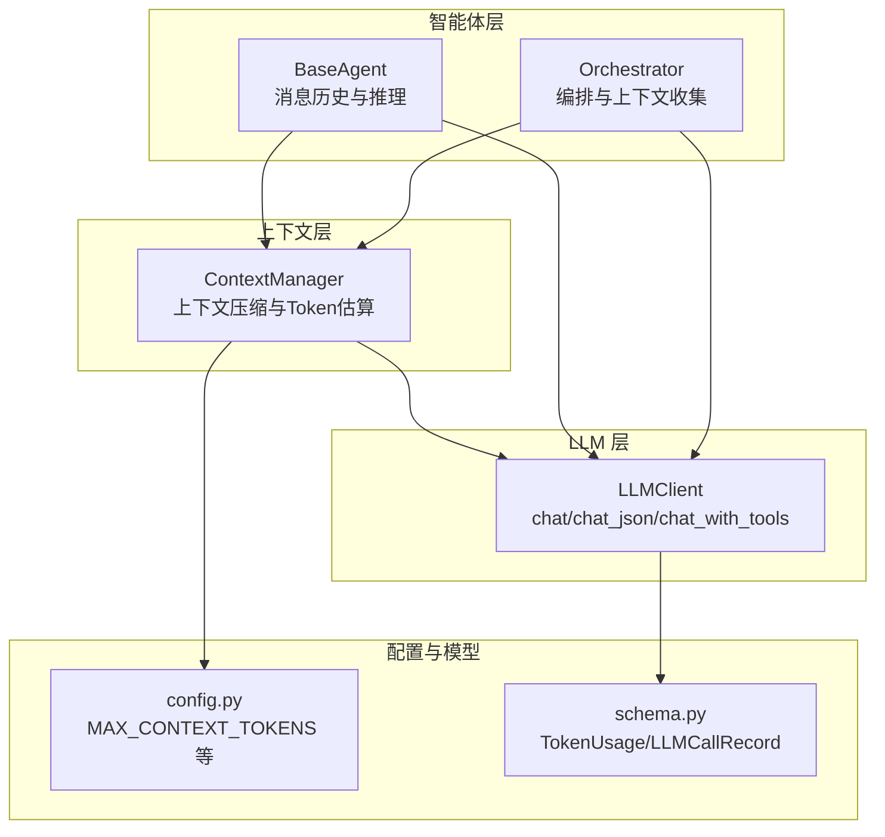
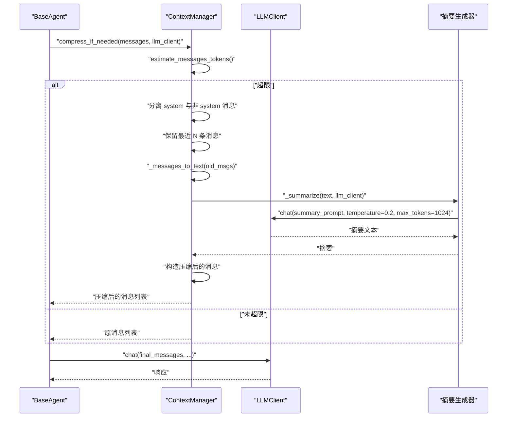
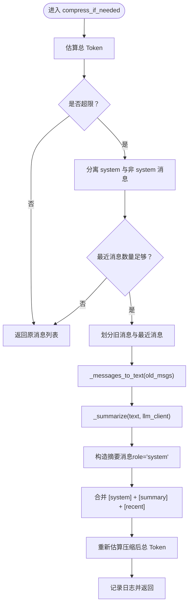
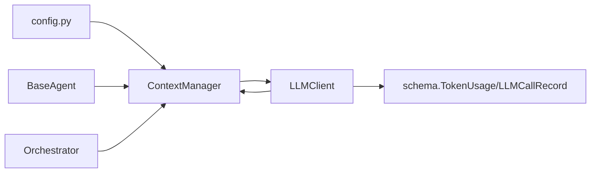

# 上下文管理

<cite>
**本文引用的文件**
- [context/manager.py](file://context/manager.py)
- [context/__init__.py](file://context/__init__.py)
- [config.py](file://config.py)
- [llm/client.py](file://llm/client.py)
- [agents/base.py](file://agents/base.py)
- [agents/orchestrator.py](file://agents/orchestrator.py)
- [schema.py](file://schema.py)
</cite>

## 目录
1. [简介](#简介)
2. [项目结构](#项目结构)
3. [核心组件](#核心组件)
4. [架构总览](#架构总览)
5. [详细组件分析](#详细组件分析)
6. [依赖关系分析](#依赖关系分析)
7. [性能考量](#性能考量)
8. [故障排除指南](#故障排除指南)
9. [结论](#结论)
10. [附录](#附录)

## 简介
本文件面向“上下文管理系统”的技术文档，聚焦 ContextManager 的设计与实现，涵盖：
- 上下文压缩算法与策略
- Token 估算机制与窗口管理
- 动态裁剪与摘要生成
- 与 LLM 客户端的集成方式（自动注入与动态调整）
- 配置示例与典型使用场景
- 性能优化建议与故障排除

## 项目结构
围绕上下文管理的关键文件与职责如下：
- context/manager.py：上下文管理器，负责 Token 估算、上下文拆分、摘要生成与压缩
- context/__init__.py：导出 ContextManager
- config.py：全局配置，包含 MAX_CONTEXT_TOKENS 等上下文窗口相关参数
- llm/client.py：LLM 客户端，提供 chat/chat_json/chat_with_tools 等方法，支持重试与追踪
- agents/base.py：基础智能体，持有消息历史与 ContextManager，负责在每次推理前进行上下文压缩
- agents/orchestrator.py：编排器，协调 Planner/Executor/Reflector 等子智能体，统一管理 ContextManager
- schema.py：包含 TokenUsage/LLMCallRecord 等与 Token 追踪相关的数据模型

图表来源
- [context/manager.py:22-187](file://context/manager.py#L22-L187)
- [agents/base.py:29-183](file://agents/base.py#L29-L183)
- [agents/orchestrator.py:94-141](file://agents/orchestrator.py#L94-L141)
- [llm/client.py:32-420](file://llm/client.py#L32-L420)
- [config.py:21-26](file://config.py#L21-L26)
- [schema.py:303-335](file://schema.py#L303-L335)

章节来源
- [context/manager.py:1-187](file://context/manager.py#L1-L187)
- [agents/base.py:1-183](file://agents/base.py#L1-L183)
- [agents/orchestrator.py:90-141](file://agents/orchestrator.py#L90-L141)
- [llm/client.py:1-420](file://llm/client.py#L1-L420)
- [config.py:1-109](file://config.py#L1-L109)
- [schema.py:1-702](file://schema.py#L1-L702)

## 核心组件
- ContextManager：负责在消息总量接近或超过配置上限时，将历史消息压缩为摘要，同时保留 system prompt 与最近若干条消息，确保上下文窗口稳定可控。
- LLMClient：提供统一的 LLM 调用接口，支持重试、追踪与 Token 使用记录，为 ContextManager 的摘要生成提供底层能力。
- BaseAgent/Orchestrator：在每次推理前调用 ContextManager 压缩上下文，保证 Token 不超限。

章节来源
- [context/manager.py:22-187](file://context/manager.py#L22-L187)
- [llm/client.py:32-420](file://llm/client.py#L32-L420)
- [agents/base.py:29-183](file://agents/base.py#L29-L183)
- [agents/orchestrator.py:94-141](file://agents/orchestrator.py#L94-L141)

## 架构总览
上下文管理在“智能体推理”与“LLM 调用”之间形成一条关键链路：智能体每次发起请求前，先通过 ContextManager 估算并压缩上下文，再将最终消息列表交给 LLMClient。

图表来源
- [agents/base.py:87-105](file://agents/base.py#L87-L105)
- [context/manager.py:82-136](file://context/manager.py#L82-L136)
- [llm/client.py:73-118](file://llm/client.py#L73-L118)

## 详细组件分析

### ContextManager 设计与实现
- 角色定位
  - 在消息总量接近或超过配置上限时，自动压缩历史消息，保留 system prompt 与最近若干条消息，确保后续 LLM 推理稳定。
- 关键策略
  - Token 估算：对每条消息内容进行粗略估算，并叠加每条消息的固定开销，得到总 Token 预估值。
  - 分割策略：将消息分为 system 提示词、旧消息、最近消息三部分；旧消息经 LLM 摘要后替换为单条摘要消息。
  - 保留策略：通过 reserve_recent 控制最近消息条数，避免最新上下文丢失。
- 压缩流程
  - 估算总 Token
  - 若未超限，直接返回
  - 若超限：分离 system 与非 system；保留最近消息；将旧消息拼接为文本；调用 LLM 生成摘要；用摘要消息替换旧消息；再次估算并记录日志
- 错误降级
  - 摘要生成失败时，回退为对旧文本进行截断，避免中断推理流程

图表来源
- [context/manager.py:82-136](file://context/manager.py#L82-L136)
- [context/manager.py:143-187](file://context/manager.py#L143-L187)

章节来源
- [context/manager.py:22-187](file://context/manager.py#L22-L187)

### Token 估算机制
- 文本估算
  - 对英文文本采用“每 3 个字符约 1 个 Token”的经验公式；对中文/日文/韩文等 CJK 文本采用“每 2 个字符约 1 个 Token”的经验公式，避免引入外部依赖。
- 消息开销
  - 每条消息额外增加约 4 个 Token 的固定开销，用于补偿消息结构本身的 token 成本。
- 总量计算
  - 对消息列表逐条估算并累加，得到总 Token 预估值，作为是否压缩的判断依据。

章节来源
- [context/manager.py:53-75](file://context/manager.py#L53-L75)

### 上下文压缩与摘要生成
- 旧消息拼接
  - 将旧消息转换为可读文本块，便于 LLM 摘要。
- 摘要提示词
  - 使用明确的摘要指令，强调保留关键事实、决策、工具结果与行动项，兼顾信息密度与完整性。
- 生成参数
  - temperature 设置为较低值以提升稳定性；max_tokens 限制摘要长度，避免过度膨胀。
- 降级策略
  - 摘要生成异常时，回退为对旧文本末尾进行截断，并标注截断提示，确保流程继续。

章节来源
- [context/manager.py:143-187](file://context/manager.py#L143-L187)

### 与 LLM 客户端的集成
- 自动注入
  - BaseAgent/Orchestrator 在每次推理前调用 ContextManager 压缩上下文，随后将压缩后的消息列表传给 LLMClient。
- 动态调整
  - 通过配置 MAX_CONTEXT_TOKENS 控制压缩触发阈值；通过 reserve_recent 控制最近消息保留数量，平衡上下文新鲜度与窗口容量。
- 重试与追踪
  - LLMClient 支持可选重试与全链路追踪，有助于定位压缩失败或 LLM 调用异常问题。

章节来源
- [agents/base.py:87-105](file://agents/base.py#L87-L105)
- [agents/orchestrator.py:94-141](file://agents/orchestrator.py#L94-L141)
- [llm/client.py:32-118](file://llm/client.py#L32-L118)

### 配置与使用示例
- 配置项
  - MAX_CONTEXT_TOKENS：上下文窗口上限，超过即触发压缩
  - MAX_REACT_ITERATIONS/MAX_REPLAN_ATTEMPTS：与上下文管理协同的执行限制
  - LLM_RETRY_ENABLED/LLM_RETRY_MAX_ATTEMPTS/LLM_RETRY_BACKOFF_FACTOR：LLM 调用重试策略
- 使用场景
  - 长对话处理：通过压缩旧消息，维持稳定的上下文长度
  - 多轮交互：保留最近若干条消息，确保最新上下文不丢失
  - 资源优化：降低 Token 消耗，提高吞吐与成本效率

章节来源
- [config.py:21-26](file://config.py#L21-L26)
- [config.py:82-86](file://config.py#L82-L86)

### 与 Token 追踪的关系
- LLMClient 提供 Token 使用记录（prompt_tokens/completion_tokens/total_tokens），可用于统计与优化。
- Orchestrator 在任务开始与结束时重置与汇总 Token 使用，结合 ContextManager 的压缩效果进行评估。

章节来源
- [llm/client.py:273-311](file://llm/client.py#L273-L311)
- [agents/orchestrator.py:175-221](file://agents/orchestrator.py#L175-L221)
- [schema.py:314-335](file://schema.py#L314-L335)

## 依赖关系分析
- ContextManager 依赖
  - config：读取 MAX_CONTEXT_TOKENS
  - LLMClient：用于摘要生成
- BaseAgent/Orchestrator 依赖
  - ContextManager：在推理前进行上下文压缩
  - LLMClient：执行实际的 LLM 调用
- Token 追踪
  - LLMClient 记录每次调用的 Token 使用，schema 中的数据模型支撑统计与展示

图表来源
- [context/manager.py:17-46](file://context/manager.py#L17-L46)
- [agents/base.py:23-50](file://agents/base.py#L23-L50)
- [agents/orchestrator.py:94-141](file://agents/orchestrator.py#L94-L141)
- [llm/client.py:273-311](file://llm/client.py#L273-L311)
- [schema.py:303-335](file://schema.py#L303-L335)

章节来源
- [context/manager.py:1-187](file://context/manager.py#L1-L187)
- [agents/base.py:1-183](file://agents/base.py#L1-L183)
- [agents/orchestrator.py:1-289](file://agents/orchestrator.py#L1-L289)
- [llm/client.py:1-420](file://llm/client.py#L1-L420)
- [schema.py:1-702](file://schema.py#L1-L702)

## 性能考量
- Token 估算的准确性
  - 采用经验公式估算，速度快、依赖少，适合实时判断；若对精度敏感，可考虑引入更精确的分词器并在必要时进行校准。
- 压缩频率与收益
  - 合理设置 MAX_CONTEXT_TOKENS 与 reserve_recent，避免频繁压缩导致上下文碎片化。
- 摘要生成的成本
  - 摘要生成会带来额外的 LLM 调用与 Token 消耗，建议在高负载场景下评估是否启用重试与降级策略。
- 日志与可观测性
  - 压缩前后 Token 数变化应纳入日志与追踪，便于定位异常与优化阈值。

[本节为通用指导，无需具体文件引用]

## 故障排除指南
- 摘要生成失败
  - 现象：压缩阶段抛出异常或返回截断文本
  - 处理：检查 LLM 服务连通性与凭据；确认 temperature 与 max_tokens 参数；启用 LLMClient 重试
- 上下文仍超限
  - 现象：压缩后仍超出阈值
  - 处理：适当降低 MAX_CONTEXT_TOKENS；减少 reserve_recent；检查消息结构是否包含大量冗余内容
- Token 使用异常
  - 现象：Token 追踪缺失或数值异常
  - 处理：确认 TOKEN_TRACKING_ENABLED；检查 LLM 返回是否包含 usage；核对模型与 API 版本

章节来源
- [context/manager.py:180-187](file://context/manager.py#L180-L187)
- [llm/client.py:273-311](file://llm/client.py#L273-L311)
- [config.py:87-89](file://config.py#L87-L89)

## 结论
ContextManager 通过“粗略 Token 估算 + LLM 摘要压缩 + 最近消息保留”的组合策略，在有限的 Token 限制内实现了上下文窗口的稳定管理。它与 LLMClient 的紧密协作，以及与智能体层的无缝集成，使得长对话、多轮交互与资源优化成为可能。配合配置与追踪机制，系统可在实践中不断优化阈值与参数，获得更好的稳定性与成本效益。

[本节为总结，无需具体文件引用]

## 附录
- 配置参考
  - MAX_CONTEXT_TOKENS：上下文窗口上限
  - LLM_RETRY_ENABLED/LLM_RETRY_MAX_ATTEMPTS/LLM_RETRY_BACKOFF_FACTOR：LLM 调用重试策略
- 使用建议
  - 长对话：适度降低 reserve_recent，提高压缩频率
  - 高并发：开启 LLMClient 重试，合理设置退避因子
  - 成本敏感：关注摘要生成的 Token 消耗，必要时降低 max_tokens

[本节为补充说明，无需具体文件引用]