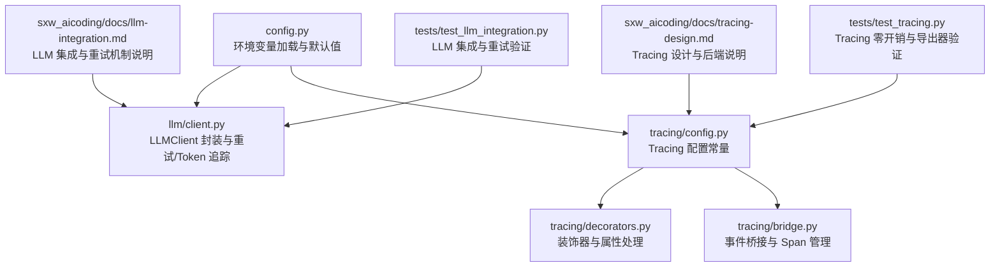
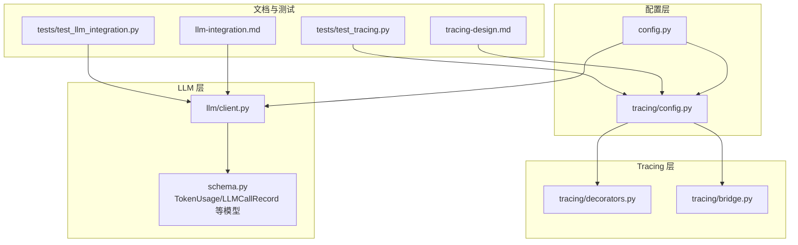
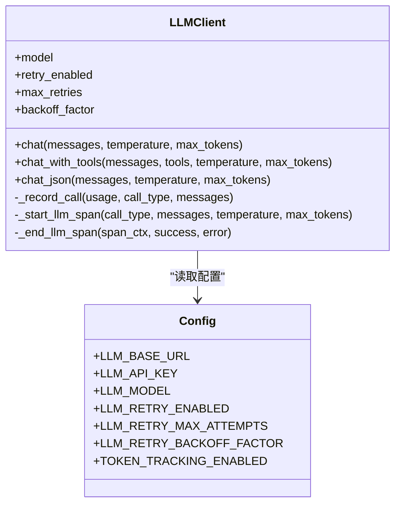
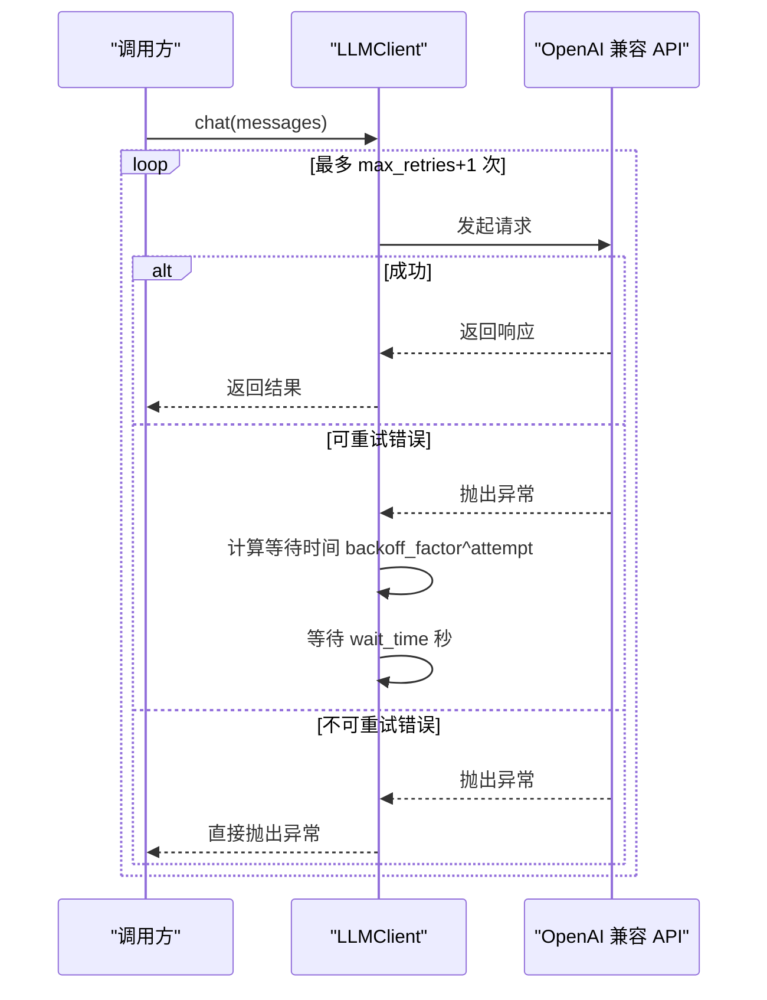
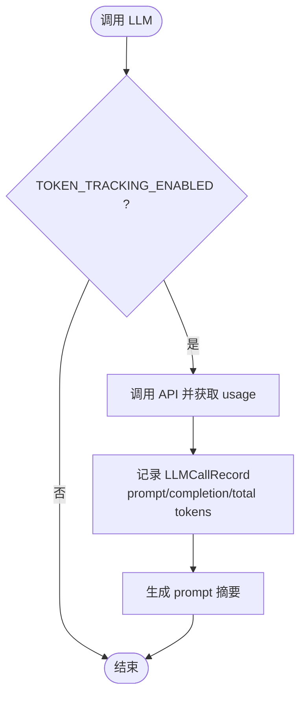
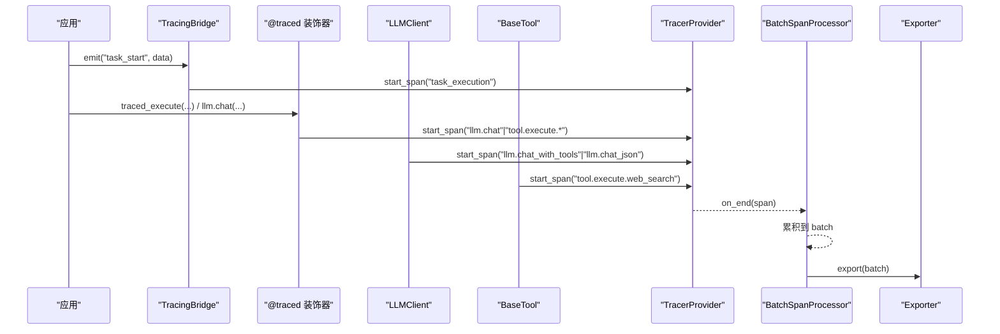

# 配置和设置

<cite>
**本文引用的文件**
- [config.py](file://config.py)
- [llm/client.py](file://llm/client.py)
- [tracing/config.py](file://tracing/config.py)
- [tracing/decorators.py](file://tracing/decorators.py)
- [tracing/bridge.py](file://tracing/bridge.py)
- [sxw_aicoding/docs/llm-integration.md](file://sxw_aicoding/docs/llm-integration.md)
- [sxw_aicoding/docs/tracing-design.md](file://sxw_aicoding/docs/tracing-design.md)
- [tests/test_llm_integration.py](file://tests/test_llm_integration.py)
- [tests/test_tracing.py](file://tests/test_tracing.py)
- [requirements.txt](file://requirements.txt)
- [schema.py](file://schema.py)
</cite>

## 目录
1. [简介](#简介)
2. [项目结构](#项目结构)
3. [核心组件](#核心组件)
4. [架构总览](#架构总览)
5. [详细组件分析](#详细组件分析)
6. [依赖分析](#依赖分析)
7. [性能考量](#性能考量)
8. [故障排查指南](#故障排查指南)
9. [结论](#结论)
10. [附录](#附录)

## 简介
本文件面向 LLM 集成的配置与设置，系统性梳理环境变量、重试机制、Token 追踪与成本控制、全链路追踪（Tracing）等关键主题。文档结合代码实现与测试用例，提供可操作的配置建议、部署最佳实践以及常见问题的诊断与解决思路，帮助开发者在不同环境（开发、测试、生产）中稳定、可观测地运行 LLM 驱动的应用。

## 项目结构
围绕 LLM 集成与可观测性的配置，项目的关键文件与职责如下：
- 配置中心：config.py 从环境变量或 .env 加载所有配置项，包括 LLM 基础 URL、API Key、模型名、重试机制、Token 追踪、Tracing 等。
- LLM 客户端：llm/client.py 封装 OpenAI 兼容 API，提供 chat/chat_with_tools/chat_json 三类调用方式，并集成重试与 Token 追踪。
- Tracing 配置：tracing/config.py、tracing/decorators.py、tracing/bridge.py 提供追踪开关、后端、属性截断、敏感信息脱敏、事件桥接与 Span 生命周期管理。
- 文档与规范：sxw_aicoding/docs/llm-integration.md 与 tracing-design.md 提供详细的配置参考、行为说明与设计原理。
- 测试与验证：tests/test_llm_integration.py 与 tests/test_tracing.py 提供配置验证、零开销特性、导出器格式等测试用例。

图表来源
- [config.py:1-109](file://config.py#L1-L109)
- [llm/client.py:1-420](file://llm/client.py#L1-L420)
- [tracing/config.py:1-79](file://tracing/config.py#L1-L79)
- [tracing/decorators.py:1-146](file://tracing/decorators.py#L1-L146)
- [tracing/bridge.py:1-765](file://tracing/bridge.py#L1-L765)
- [sxw_aicoding/docs/llm-integration.md:1-804](file://sxw_aicoding/docs/llm-integration.md#L1-L804)
- [sxw_aicoding/docs/tracing-design.md:1-643](file://sxw_aicoding/docs/tracing-design.md#L1-L643)
- [tests/test_llm_integration.py:1-535](file://tests/test_llm_integration.py#L1-L535)
- [tests/test_tracing.py:1-948](file://tests/test_tracing.py#L1-L948)

章节来源
- [config.py:1-109](file://config.py#L1-L109)
- [llm/client.py:1-420](file://llm/client.py#L1-L420)
- [tracing/config.py:1-79](file://tracing/config.py#L1-L79)
- [tracing/decorators.py:1-146](file://tracing/decorators.py#L1-L146)
- [tracing/bridge.py:1-765](file://tracing/bridge.py#L1-L765)
- [sxw_aicoding/docs/llm-integration.md:1-804](file://sxw_aicoding/docs/llm-integration.md#L1-L804)
- [sxw_aicoding/docs/tracing-design.md:1-643](file://sxw_aicoding/docs/tracing-design.md#L1-L643)
- [tests/test_llm_integration.py:1-535](file://tests/test_llm_integration.py#L1-L535)
- [tests/test_tracing.py:1-948](file://tests/test_tracing.py#L1-L948)

## 核心组件
- LLM 配置项
  - LLM_BASE_URL：OpenAI 兼容 API 基础地址，默认指向 DeepSeek。
  - LLM_API_KEY：API 密钥，必须配置。
  - LLM_MODEL：模型名称，默认 deepseek-chat。
  - 重试机制：LLM_RETRY_ENABLED、LLM_RETRY_MAX_ATTEMPTS、LLM_RETRY_BACKOFF_FACTOR。
  - Token 追踪：TOKEN_TRACKING_ENABLED。
- Tracing 配置项
  - TRACING_ENABLED：总开关，默认关闭。
  - TRACING_BACKEND：导出后端（console/file/rich/otlp/phoenix）。
  - TRACING_ENDPOINT：OTLP HTTP 端点。
  - TRACING_SERVICE_NAME：服务标识。
  - TRACING_SAMPLE_RATE：采样率（0.0-1.0）。
  - TRACING_LOG_PROMPTS：是否记录完整 prompt（默认关闭）。
  - TRACING_MAX_ATTRIBUTE_LENGTH：属性最大字符数（默认 1000）。

章节来源
- [config.py:17-19](file://config.py#L17-L19)
- [config.py:82-88](file://config.py#L82-L88)
- [config.py:102-109](file://config.py#L102-L109)
- [sxw_aicoding/docs/llm-integration.md:615-648](file://sxw_aicoding/docs/llm-integration.md#L615-L648)
- [sxw_aicoding/docs/tracing-design.md:568-596](file://sxw_aicoding/docs/tracing-design.md#L568-L596)

## 架构总览
LLM 集成与可观测性在系统中的位置如下：
- LLMClient 通过 config.py 读取 LLM_BASE_URL、LLM_API_KEY、LLM_MODEL 等配置，按需启用重试与 Token 追踪。
- Tracing 通过 tracing/config.py 读取 TRACING_* 配置，按后端类型选择导出器；事件桥接器 TracingBridge 将现有事件流转换为 Span，LLMClient 与工具调用通过内联方法创建 LLM/Tool Span。
- 测试用例覆盖配置加载、零开销行为、导出器格式与属性处理。

图表来源
- [config.py:1-109](file://config.py#L1-L109)
- [tracing/config.py:1-79](file://tracing/config.py#L1-L79)
- [llm/client.py:1-420](file://llm/client.py#L1-L420)
- [tracing/decorators.py:1-146](file://tracing/decorators.py#L1-L146)
- [tracing/bridge.py:1-765](file://tracing/bridge.py#L1-L765)
- [schema.py:303-335](file://schema.py#L303-L335)
- [sxw_aicoding/docs/llm-integration.md:1-804](file://sxw_aicoding/docs/llm-integration.md#L1-L804)
- [sxw_aicoding/docs/tracing-design.md:1-643](file://sxw_aicoding/docs/tracing-design.md#L1-L643)
- [tests/test_llm_integration.py:1-535](file://tests/test_llm_integration.py#L1-L535)
- [tests/test_tracing.py:1-948](file://tests/test_tracing.py#L1-L948)

## 详细组件分析

### LLM 配置与客户端
- 环境变量加载与默认值
  - LLM_BASE_URL 默认指向 DeepSeek，可通过环境变量覆盖。
  - LLM_API_KEY 必须配置，否则 LLM 调用会失败。
  - LLM_MODEL 默认 deepseek-chat，可切换为其他兼容模型。
- 重试机制
  - 可选启用，支持指数退避；默认关闭以保持向后兼容。
  - 可重试错误类型：速率限制、超时、通用 API 错误。
  - 重试参数：最大次数、退避因子。
- Token 追踪
  - 可选启用，记录每次调用的 prompt/completion/total tokens，并保存摘要。
- 调用模式
  - chat：纯文本对话。
  - chat_with_tools：OpenAI 风格 function calling。
  - chat_json：强制 JSON 输出，支持降级解析策略。

图表来源
- [llm/client.py:32-420](file://llm/client.py#L32-L420)
- [config.py:17-19](file://config.py#L17-L19)
- [config.py:82-88](file://config.py#L82-L88)

章节来源
- [config.py:17-19](file://config.py#L17-L19)
- [config.py:82-88](file://config.py#L82-L88)
- [llm/client.py:73-118](file://llm/client.py#L73-L118)
- [llm/client.py:125-176](file://llm/client.py#L125-L176)
- [llm/client.py:183-228](file://llm/client.py#L183-L228)
- [llm/client.py:273-311](file://llm/client.py#L273-L311)
- [sxw_aicoding/docs/llm-integration.md:210-293](file://sxw_aicoding/docs/llm-integration.md#L210-L293)

### 重试机制时序

图表来源
- [llm/client.py:93-115](file://llm/client.py#L93-L115)
- [llm/client.py:149-173](file://llm/client.py#L149-L173)
- [llm/client.py:204-228](file://llm/client.py#L204-L228)

章节来源
- [llm/client.py:29-29](file://llm/client.py#L29-L29)
- [llm/client.py:93-115](file://llm/client.py#L93-L115)
- [llm/client.py:149-173](file://llm/client.py#L149-L173)
- [llm/client.py:204-228](file://llm/client.py#L204-L228)
- [sxw_aicoding/docs/llm-integration.md:223-293](file://sxw_aicoding/docs/llm-integration.md#L223-L293)

### Token 追踪与成本控制
- Token 追踪
  - 通过 TOKEN_TRACKING_ENABLED 控制是否记录。
  - 记录 prompt/completion/total tokens，并保存首条 user 消息摘要。
  - LLMCallRecord 与 TokenUsage/TokenUsageSummary 用于聚合统计。
- 成本控制建议
  - 选择合适模型与 max_tokens。
  - 使用上下文压缩与滑动窗口减少输入长度。
  - 通过采样与阈值控制（如 TODO 压缩阈值）降低上下文压力。

图表来源
- [llm/client.py:102-104](file://llm/client.py#L102-L104)
- [llm/client.py:160-162](file://llm/client.py#L160-L162)
- [llm/client.py:213-215](file://llm/client.py#L213-L215)
- [llm/client.py:273-311](file://llm/client.py#L273-L311)
- [schema.py:303-335](file://schema.py#L303-L335)

章节来源
- [config.py:88-88](file://config.py#L88-L88)
- [llm/client.py:102-104](file://llm/client.py#L102-L104)
- [llm/client.py:160-162](file://llm/client.py#L160-L162)
- [llm/client.py:213-215](file://llm/client.py#L213-L215)
- [llm/client.py:273-311](file://llm/client.py#L273-L311)
- [schema.py:303-335](file://schema.py#L303-L335)

### 全链路追踪（Tracing）
- 配置与后端
  - TRACING_ENABLED：总开关，默认关闭，零开销。
  - TRACING_BACKEND：console/file/rich/otlp/phoenix。
  - TRACING_ENDPOINT：OTLP HTTP 端点。
  - TRACING_SAMPLE_RATE：采样率（0.0-1.0）。
  - TRACING_LOG_PROMPTS：是否记录完整 prompt（默认关闭）。
  - TRACING_MAX_ATTRIBUTE_LENGTH：属性最大字符数（默认 1000）。
- 事件桥接与 Span 层级
  - TracingBridge 将现有事件流转换为 Span，维护父子关系。
  - LLM 调用通过内联方法创建 llm.chat/llm.chat_with_tools/llm.chat_json 等 Span。
  - 工具调用通过 BaseTool.traced_execute 包装执行。
- 属性与隐私
  - 属性截断与敏感键脱敏（如 api_key/password/token）。
  - 采样与零开销：TRACING_ENABLED=false 时，装饰器与桥接器退化为 no-op。

图表来源
- [tracing/bridge.py:117-143](file://tracing/bridge.py#L117-L143)
- [tracing/decorators.py:70-146](file://tracing/decorators.py#L70-L146)
- [llm/client.py:317-420](file://llm/client.py#L317-L420)
- [tracing/config.py:17-43](file://tracing/config.py#L17-L43)

章节来源
- [config.py:102-109](file://config.py#L102-L109)
- [tracing/config.py:17-43](file://tracing/config.py#L17-L43)
- [tracing/bridge.py:117-143](file://tracing/bridge.py#L117-L143)
- [tracing/decorators.py:70-146](file://tracing/decorators.py#L70-L146)
- [llm/client.py:317-420](file://llm/client.py#L317-L420)
- [sxw_aicoding/docs/tracing-design.md:382-422](file://sxw_aicoding/docs/tracing-design.md#L382-L422)

## 依赖分析
- OpenTelemetry 依赖
  - opentelemetry-api、opentelemetry-sdk、opentelemetry-exporter-otlp。
- 其他依赖
  - openai、pydantic、rich、python-dotenv、fastapi、uvicorn、jinja2、pytest、pytest-asyncio。

章节来源
- [requirements.txt:1-19](file://requirements.txt#L1-L19)

## 性能考量
- 零开销原则
  - TRACING_ENABLED=false 时，TracingBridge、装饰器与导出器均不引入性能损耗。
- 异步批量导出
  - BatchSpanProcessor 异步批量导出，避免阻塞主执行路径。
- 内存与采样
  - 通过采样率与队列/批大小限制内存占用。
- LLM 侧
  - 合理设置 max_tokens、温度与上下文压缩，减少不必要的 Token 消耗。

章节来源
- [sxw_aicoding/docs/tracing-design.md:25-29](file://sxw_aicoding/docs/tracing-design.md#L25-L29)
- [tracing/config.py:57-67](file://tracing/config.py#L57-L67)
- [config.py:88-88](file://config.py#L88-L88)

## 故障排查指南
- 配置加载与验证
  - 确认 .env 或环境变量已正确加载，LLM_API_KEY 必填。
  - 使用测试用例验证配置：tests/test_llm_integration.py 与 tests/test_tracing.py。
- 重试机制
  - 检查 LLM_RETRY_ENABLED、LLM_RETRY_MAX_ATTEMPTS、LLM_RETRY_BACKOFF_FACTOR 设置。
  - 可重试错误类型：速率限制、超时、通用 API 错误。
- Tracing 零开销
  - TRACING_ENABLED=false 时，TracingBridge 与装饰器应无副作用。
  - 导出器格式：FileSpanExporter 输出 JSON，RichConsoleExporter 渲染树形结构。
- 属性与隐私
  - 检查敏感键脱敏与属性截断是否生效。
  - TRACING_LOG_PROMPTS=false 时，不记录完整 prompt。

章节来源
- [tests/test_llm_integration.py:127-139](file://tests/test_llm_integration.py#L127-L139)
- [tests/test_tracing.py:35-72](file://tests/test_tracing.py#L35-L72)
- [tests/test_tracing.py:308-355](file://tests/test_tracing.py#L308-L355)
- [tests/test_tracing.py:466-500](file://tests/test_tracing.py#L466-L500)
- [tracing/decorators.py:30-68](file://tracing/decorators.py#L30-L68)
- [tracing/config.py:73-79](file://tracing/config.py#L73-L79)

## 结论
通过统一的配置中心与可插拔的可观测性模块，系统在开发、测试与生产环境中均可灵活切换 LLM 提供商、启用/禁用重试与追踪，并以零开销与采样策略控制成本与性能。建议在生产环境启用 Tracing 并配合采样，同时合理配置重试与 Token 追踪，以获得稳定、可观测且经济高效的 LLM 集成体验。

## 附录
- 部署环境配置示例
  - 开发环境：启用 TRACING_ENABLED=false（零开销），LLM_RETRY_ENABLED=false（简化调试）。
  - 测试环境：启用 TRACING_ENABLED=true（console/file），LLM_RETRY_ENABLED=true（验证重试）。
  - 生产环境：启用 TRACING_ENABLED=true（otlp/phoenix），TRACING_SAMPLE_RATE=0.1~0.3，LLM_RETRY_ENABLED=true（谨慎设置退避因子）。
- 常见问题
  - API Key 未配置：LLM 调用会失败，请在 .env 或环境变量中设置 LLM_API_KEY。
  - 重试未生效：确认 LLM_RETRY_ENABLED=true 且网络/服务端确实返回可重试错误。
  - Tracing 无输出：检查 TRACING_BACKEND 与 TRACING_ENDPOINT，或 TRACING_ENABLED=false 导致零开销。
  - prompt 泄露：TRACING_LOG_PROMPTS 默认关闭，生产环境建议保持关闭。

章节来源
- [config.py:102-109](file://config.py#L102-L109)
- [config.py:82-88](file://config.py#L82-L88)
- [sxw_aicoding/docs/tracing-design.md:582-596](file://sxw_aicoding/docs/tracing-design.md#L582-L596)
- [sxw_aicoding/docs/llm-integration.md:789-799](file://sxw_aicoding/docs/llm-integration.md#L789-L799)