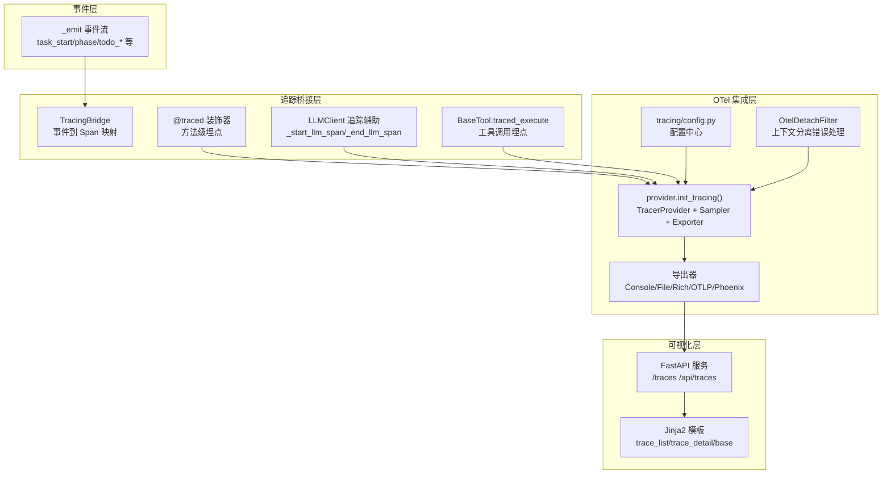
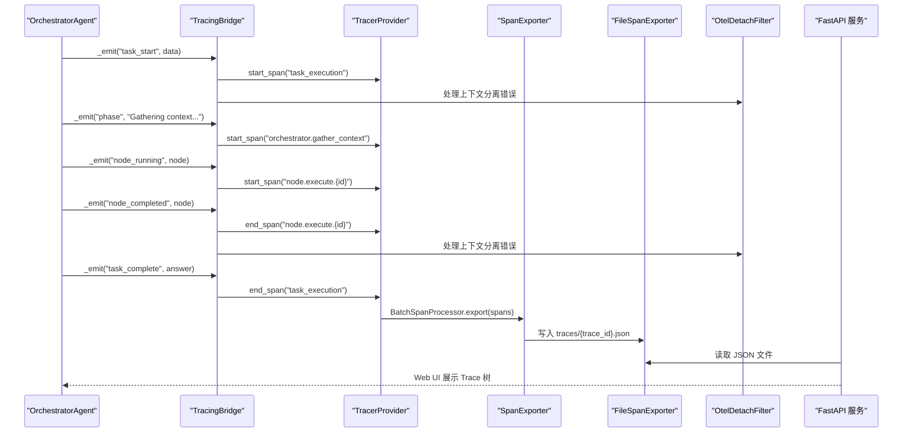
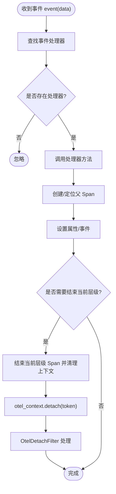
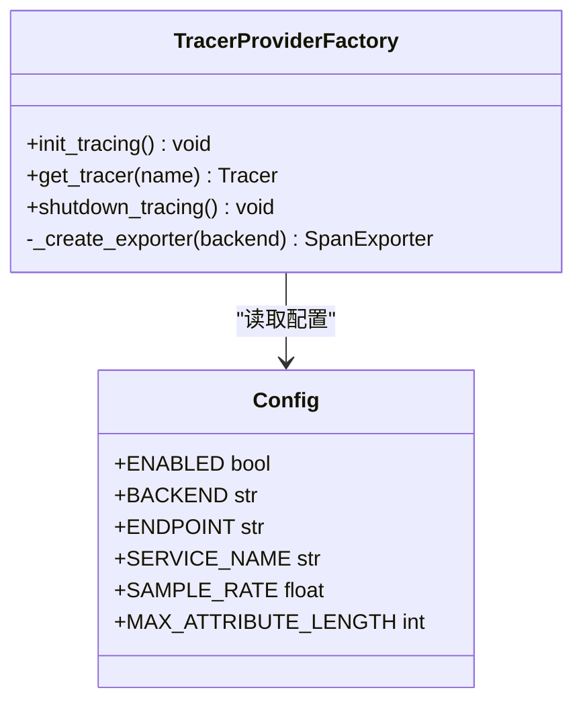
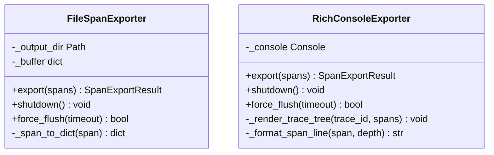
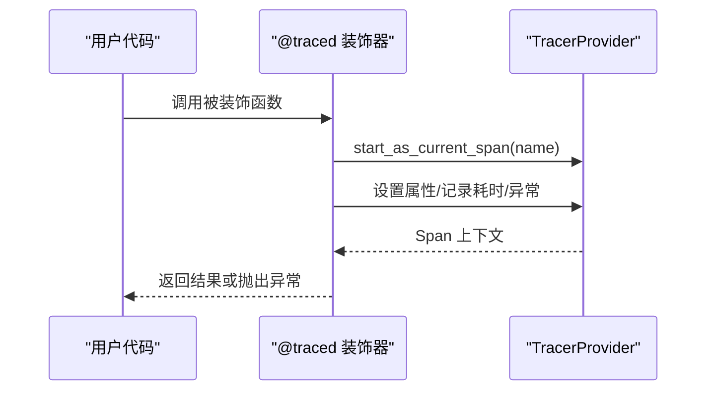
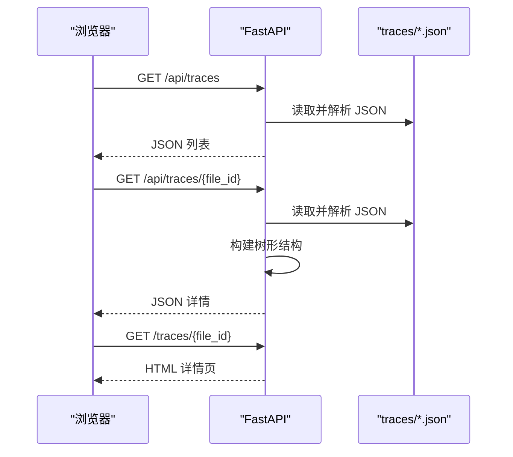
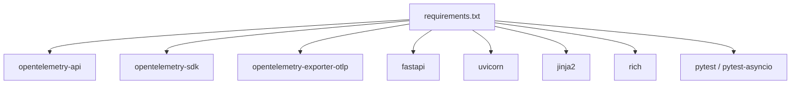

# 全链路追踪系统

<cite>
**本文引用的文件**
- [tracing/__init__.py](file://tracing/__init__.py)
- [tracing/provider.py](file://tracing/provider.py)
- [tracing/config.py](file://tracing/config.py)
- [tracing/bridge.py](file://tracing/bridge.py)
- [tracing/spans.py](file://tracing/spans.py)
- [tracing/decorators.py](file://tracing/decorators.py)
- [tracing/exporters.py](file://tracing/exporters.py)
- [tracing/server.py](file://tracing/server.py)
- [tracing/templates/base.html](file://tracing/templates/base.html)
- [tracing/templates/trace_detail.html](file://tracing/templates/trace_detail.html)
- [main.py](file://main.py)
- [config.py](file://config.py)
- [requirements.txt](file://requirements.txt)
- [tests/test_tracing.py](file://tests/test_tracing.py)
- [tools/base.py](file://tools/base.py)
- [llm/client.py](file://llm/client.py)
- [sxw_aicoding/docs/tracing-design.md](file://sxw_aicoding/docs/tracing-design.md)
- [sxw_aicoding/docs/tracing-guide.md](file://sxw_aicoding/docs/tracing-guide.md)
- [CLAUDE.md](file://CLAUDE.md)
</cite>

## 更新摘要
**变更内容**
- 新增OtelDetachFilter上下文分离处理机制，改善OpenTelemetry错误日志
- 更新TracingBridge中上下文分离处理的实现细节
- 增强并发asyncio任务执行场景下的追踪稳定性
- 优化错误日志输出，避免误导性堆栈信息

## 目录
1. [简介](#简介)
2. [项目结构](#项目结构)
3. [核心组件](#核心组件)
4. [架构总览](#架构总览)
5. [详细组件分析](#详细组件分析)
6. [依赖分析](#依赖分析)
7. [性能考量](#性能考量)
8. [故障排除指南](#故障排除指南)
9. [结论](#结论)
10. [附录](#附录)

## 简介
本文件为 manus_demo 的全链路追踪系统技术文档，围绕基于 OpenTelemetry 的 v7.0 追踪模块进行深入解析。内容涵盖：
- TracingBridge 的事件到 Span 映射机制与父子关系管理
- OpenTelemetry 集成配置与导出器设置
- 追踪服务器与 UI 可视化
- 装饰器系统在追踪中的应用与 Span 生命周期管理
- 追踪配置最佳实践与性能优化
- 追踪数据采集、存储与查询机制
- 故障排除与调试工具使用
- 扩展自定义导出器与 UI 模板的方法

**更新** 新增OtelDetachFilter上下文分离处理机制，专门处理并发asyncio任务执行场景中的OpenTelemetry上下文分离错误，提供更清晰的日志输出。

## 项目结构
追踪模块位于 tracing/ 目录，采用"事件驱动 + OpenTelemetry"的双层架构：
- 事件层：通过 OrchestratorAgent 的 _emit 事件系统传递任务生命周期、规划、执行、反思等事件
- 追踪层：TracingBridge 将事件映射为 OTel Spans，配合 Provider/Exporters 完成配置与导出
- 可视化层：FastAPI 服务读取 traces/ 目录下的 JSON 文件，提供 Web UI 查看 Trace 树
- 日志处理层：OtelDetachFilter 专门处理OpenTelemetry上下文分离错误，提供简洁的信息性日志

**图表来源**
- [tracing/bridge.py](file://tracing/bridge.py)
- [tracing/decorators.py](file://tracing/decorators.py)
- [tracing/exporters.py](file://tracing/exporters.py)
- [tracing/provider.py](file://tracing/provider.py)
- [tracing/server.py](file://tracing/server.py)
- [main.py](file://main.py)

**章节来源**
- [tracing/__init__.py](file://tracing/__init__.py)
- [tracing/provider.py](file://tracing/provider.py)
- [tracing/config.py](file://tracing/config.py)
- [tracing/bridge.py](file://tracing/bridge.py)
- [tracing/exporters.py](file://tracing/exporters.py)
- [tracing/server.py](file://tracing/server.py)
- [main.py](file://main.py)

## 核心组件
- TracingBridge：订阅 OrchestratorAgent 的 _emit 事件，将任务生命周期、阶段、计划、DAG 执行、TODO 列表、反思、目标驱动等事件映射为 OTel Spans，并维护父子关系与上下文
- Provider：负责初始化 TracerProvider、资源标识、采样策略、导出器选择与批处理配置
- Exporters：提供控制台、文件、Rich、OTLP、Phoenix 等多种导出器
- Decorators：提供 @traced 装饰器，支持同步与异步函数的声明式埋点
- Server：基于 FastAPI 的 Web 服务，提供 Trace 列表与详情页，支持 JSON API
- Spans：统一的 Span 名称、属性键与事件名称常量，遵循 OpenTelemetry GenAI 语义约定
- OtelDetachFilter：专门处理OpenTelemetry上下文分离错误，提供简洁的信息性日志输出

**更新** 新增OtelDetachFilter组件，专门处理并发asyncio任务执行场景中的OpenTelemetry上下文分离错误，避免误导性的ERROR堆栈信息。

**章节来源**
- [tracing/bridge.py](file://tracing/bridge.py)
- [tracing/provider.py](file://tracing/provider.py)
- [tracing/exporters.py](file://tracing/exporters.py)
- [tracing/decorators.py](file://tracing/decorators.py)
- [tracing/server.py](file://tracing/server.py)
- [tracing/spans.py](file://tracing/spans.py)
- [main.py](file://main.py)

## 架构总览
下图展示了从事件到可视化的完整链路，以及 OpenTelemetry SDK 的配置与导出过程，包括新增的上下文分离错误处理机制。

**图表来源**
- [tracing/bridge.py](file://tracing/bridge.py)
- [tracing/provider.py](file://tracing/provider.py)
- [tracing/exporters.py](file://tracing/exporters.py)
- [tracing/server.py](file://tracing/server.py)
- [main.py](file://main.py)

## 详细组件分析

### TracingBridge：事件到 Span 的映射机制
- 事件分发表：将事件名映射到处理方法，支持任务生命周期、阶段、计划、DAG 执行、TODO 列表、反思、目标驱动、Token 使用、内存存储等事件
- 父子关系管理：通过当前根 Span、阶段 Span、超步 Span、节点/步骤/TODO Span 的栈式管理，确保正确的层级关系
- 异常安全：事件处理包裹在 try-except 中，避免追踪错误影响主流程
- 上下文管理：使用 OpenTelemetry 的 context.attach/detach 与 set_span_in_context 维护异步安全的追踪上下文
- 属性与事件：对属性进行敏感键脱敏与长度截断；对关键事件（如反射、自适应规划）记录为 Span 事件
- **上下文分离处理**：在Span结束时调用otel_context.detach()，内部ValueError由OtelDetachFilter统一处理

**更新** 在所有otel_context.detach()调用处增加了统一的错误处理机制，通过OtelDetachFilter将ERROR级别的"Failed to detach context"日志降级为INFO级别，提供简洁的说明性消息。

**图表来源**
- [tracing/bridge.py](file://tracing/bridge.py)

**章节来源**
- [tracing/bridge.py](file://tracing/bridge.py)

### Provider：OpenTelemetry 初始化与导出器配置
- 资源标识：service.name、service.version、deployment.environment
- 采样策略：基于 TRACING_SAMPLE_RATE 的 TraceIdRatioBased 或 ALWAYS_ON
- 导出器选择：根据 TRACING_BACKEND 选择 Console/File/Rich/OTLP/Phoenix
- 处理器类型：console/rich 使用 SimpleSpanProcessor，file/otlp/phoenix 使用 BatchSpanProcessor（支持队列大小、批量大小、调度延迟）

**图表来源**
- [tracing/provider.py](file://tracing/provider.py)
- [tracing/config.py](file://tracing/config.py)

**章节来源**
- [tracing/provider.py](file://tracing/provider.py)
- [tracing/config.py](file://tracing/config.py)

### Exporters：文件与 Rich 控制台导出
- FileSpanExporter：按 trace_id 聚合批量 Span，写入 traces/{trace_id}.json，支持多批次合并
- RichConsoleExporter：将完成的 Span 按 trace 聚合，重建树形结构并在终端渲染，便于开发调试

**图表来源**
- [tracing/exporters.py](file://tracing/exporters.py)

**章节来源**
- [tracing/exporters.py](file://tracing/exporters.py)

### Decorators：@traced 装饰器与属性安全处理
- 支持同步与异步函数，自动记录开始时间、耗时、状态与异常
- 属性安全：敏感键脱敏、长文本截断、类型安全设置
- 与 TracingBridge 协同：方法级埋点与事件级埋点互补

**图表来源**
- [tracing/decorators.py](file://tracing/decorators.py)

**章节来源**
- [tracing/decorators.py](file://tracing/decorators.py)

### Server：Web 可视化与数据查询
- 路由：/traces（Trace 列表）、/traces/{file_id}（Trace 详情树）、/api/traces（JSON 列表）、/api/traces/{file_id}（JSON 详情）
- 数据加载：扫描 traces/ 目录，解析 JSON，构建树形结构，处理缺失/重复/自引用等边界情况
- 模板：Jinja2 模板渲染，前端 JS 渲染树形与详情面板，支持展开/折叠、复制长文本等

**图表来源**
- [tracing/server.py](file://tracing/server.py)
- [tracing/templates/trace_detail.html](file://tracing/templates/trace_detail.html)
- [tracing/templates/base.html](file://tracing/templates/base.html)

**章节来源**
- [tracing/server.py](file://tracing/server.py)
- [tracing/templates/trace_detail.html](file://tracing/templates/trace_detail.html)
- [tracing/templates/base.html](file://tracing/templates/base.html)

### Span 常量与语义约定
- SpanName：统一的任务执行、上下文收集、规划、执行、DAG、简单路径、TODO、目标驱动、LLM、工具、反思、内存等 Span 名称
- AttrKey：遵循 OpenTelemetry GenAI 语义约定的属性键，如 gen_ai.*、tool.*、dag.*、node.*、step.*、todo.*、goal.* 等
- EventName：统一的 Span 事件名称，如 llm.request.*、tool.call.*、node.state_transition、plan.generated 等
- SPAN_ICONS：Span 名称到图标映射，用于 UI 渲染

**章节来源**
- [tracing/spans.py](file://tracing/spans.py)

### LLM 与工具调用的追踪集成
- LLMClient：在 chat/chat_with_tools/chat_json 中通过 _start_llm_span/_end_llm_span 创建 LLM 调用 Span，并记录请求参数、响应与 Token 使用
- BaseTool：通过 traced_execute 包裹工具执行，自动记录工具名、参数、结果、耗时与错误，支持敏感参数脱敏

**章节来源**
- [llm/client.py](file://llm/client.py)
- [tools/base.py](file://tools/base.py)

### OtelDetachFilter：上下文分离错误处理
- **新增功能**：专门处理OpenTelemetry在并发asyncio任务执行场景中的上下文分离错误
- **错误类型**：ValueError from cross-Task context detach（OTel库内部捕获）
- **处理机制**：将ERROR级别的"Failed to detach context"日志降级为INFO级别，提供简洁的说明性消息
- **应用场景**：在DAG执行的并行任务中，token在forked Task context中创建，在main Task context中分离时发生
- **日志优化**：避免误导性堆栈信息，提供"Context detach skipped (asyncio concurrent Task — harmless, span already ended)"的清晰说明

**新增** OtelDetachFilter是本次更新的核心改进，专门解决并发asyncio任务执行场景中的OpenTelemetry上下文分离问题。

**章节来源**
- [main.py](file://main.py)

## 依赖分析
- OpenTelemetry SDK：opentelemetry-api、opentelemetry-sdk、opentelemetry-exporter-otlp
- Web 服务：fastapi、uvicorn、jinja2
- 开发工具：rich（用于 RichConsoleExporter）
- 测试：pytest、pytest-asyncio

**图表来源**
- [requirements.txt](file://requirements.txt)

**章节来源**
- [requirements.txt](file://requirements.txt)

## 性能考量
- 采样率：通过 TRACING_SAMPLE_RATE 控制 TraceIdRatioBased 采样，降低高负载下的开销
- 批处理：file/otlp/phoenix 使用 BatchSpanProcessor，合理设置队列大小、批量大小与调度延迟
- 属性截断与脱敏：避免超长属性与敏感信息进入 Span，减少存储与网络传输压力
- 导出器选择：开发调试推荐 console/rich，生产推荐 file/otlp；OTLP 需安装 opentelemetry-exporter-otlp
- 异步与上下文：TracingBridge 使用 contextvars 保证 asyncio 安全，避免阻塞主流程
- **上下文分离优化**：OtelDetachFilter避免重复的ERROR日志输出，减少日志噪声

**更新** 新增上下文分离优化，通过OtelDetachFilter统一处理并发任务执行中的上下文分离错误，提升日志质量和系统稳定性。

## 故障排除指南
- 追踪未生效
  - 检查 TRACING_ENABLED 是否开启
  - 确认 TRACING_BACKEND 配置有效
  - 核对 OTLP 端点与网络连通性
- 导出失败
  - FileSpanExporter：检查 traces/ 目录权限与磁盘空间
  - OTLP：确认 opentelemetry-exporter-otlp 已安装，端点可达
- UI 无法显示 Trace
  - 确认 traces/ 目录存在且包含 JSON 文件
  - 检查文件名与路径遍历保护（_get_traces_dir 与路径解析）
- 装饰器无效
  - 确认 TRACING_ENABLED 为 True
  - 检查 @traced 的 span_name 与属性是否正确设置
- LLM/工具调用未记录
  - 确认调用的是 traced_execute 或 LLMClient 的受追踪方法
  - 检查 TRACING_LOG_PROMPTS 与敏感键脱敏策略
- **上下文分离错误**
  - **新增** 检查日志中是否出现"Failed to detach context"错误
  - 确认OtelDetachFilter已正确添加到opentelemetry.context logger
  - 在并发DAG执行场景中，此类错误通常是无害的，会被OtelDetachFilter降级处理

**更新** 新增上下文分离错误的故障排除指南，专门针对并发asyncio任务执行场景中的OpenTelemetry上下文分离问题。

**章节来源**
- [tracing/provider.py](file://tracing/provider.py)
- [tracing/exporters.py](file://tracing/exporters.py)
- [tracing/server.py](file://tracing/server.py)
- [tests/test_tracing.py](file://tests/test_tracing.py)
- [main.py](file://main.py)

## 结论
manus_demo 的 v7.0 全链路追踪系统以事件驱动为核心，结合 OpenTelemetry 的标准化能力，实现了从任务生命周期到 DAG 执行、工具调用与 LLM 交互的完整可观测性闭环。通过 TracingBridge 的事件映射、Provider 的灵活配置、多样导出器与 Web 可视化，开发者可以在不同环境下高效地采集、存储与分析 Trace 数据，同时保持低开销与高扩展性。

**更新** 本次更新通过OtelDetachFilter机制显著改善了并发asyncio任务执行场景下的追踪稳定性，提供了更清晰的日志输出，避免了误导性的ERROR堆栈信息，提升了系统的整体可靠性。

## 附录

### 追踪配置最佳实践
- 开发环境：TRACING_BACKEND=console 或 rich，便于即时查看
- 生产环境：TRACING_BACKEND=file 或 otlp，结合外部观测平台
- 采样策略：高流量场景适当降低 TRACING_SAMPLE_RATE
- 属性与隐私：开启 TRACING_LOG_PROMPTS 仅限调试；敏感键会自动脱敏
- 导出器选择：OTLP 需安装 opentelemetry-exporter-otlp；Phoenix 需确保端点以 /v1/traces 结尾
- **并发任务处理**：在DAG执行中使用asyncio.gather时，OtelDetachFilter会自动处理上下文分离错误

**更新** 新增并发任务处理的最佳实践建议，特别适用于DAG执行场景。

**章节来源**
- [config.py](file://config.py)
- [tracing/config.py](file://tracing/config.py)
- [tracing/provider.py](file://tracing/provider.py)
- [main.py](file://main.py)

### 追踪数据采集、存储与查询机制
- 采集：事件驱动（_emit）与装饰器埋点（@traced）共同产生 Spans
- 存储：FileSpanExporter 将每个 Trace 写入独立 JSON 文件，支持多批次合并
- 查询：FastAPI 服务扫描 traces/ 目录，提供 JSON API 与 HTML 页面

**章节来源**
- [tracing/exporters.py](file://tracing/exporters.py)
- [tracing/server.py](file://tracing/server.py)

### 扩展自定义导出器与 UI 模板
- 自定义导出器：实现 SpanExporter 接口，参考 FileSpanExporter/RichConsoleExporter 的实现模式
- UI 模板：基于 Jinja2 模板扩展，参考 base.html 与 trace_detail.html 的结构与样式
- **上下文分离处理**：在自定义导出器中，如需处理并发任务场景，可参考OtelDetachFilter的设计思路

**更新** 新增上下文分离处理的扩展指导，帮助开发者在自定义组件中处理类似的并发任务问题。

**章节来源**
- [tracing/exporters.py](file://tracing/exporters.py)
- [tracing/templates/base.html](file://tracing/templates/base.html)
- [tracing/templates/trace_detail.html](file://tracing/templates/trace_detail.html)
- [main.py](file://main.py)

### 上下文分离处理设计原理
- **问题背景**：在asyncio.gather并行执行中，token在forked Task context中创建，在main Task context中分离时可能触发ValueError
- **解决方案**：OtelDetachFilter在main.py中统一处理，将ERROR降级为INFO，提供简洁说明
- **设计原则**：无害错误不应影响日志质量，应该提供清晰的解释而非复杂的堆栈
- **实现细节**：通过logging.Filter拦截opentelemetry.context logger的消息，修改日志级别和内容

**新增** 详细说明上下文分离处理的设计原理和实现细节，帮助开发者理解并发任务执行中的追踪挑战。

**章节来源**
- [main.py](file://main.py)
- [CLAUDE.md](file://CLAUDE.md)
- [sxw_aicoding/docs/tracing-design.md](file://sxw_aicoding/docs/tracing-design.md)
- [sxw_aicoding/docs/tracing-guide.md](file://sxw_aicoding/docs/tracing-guide.md)