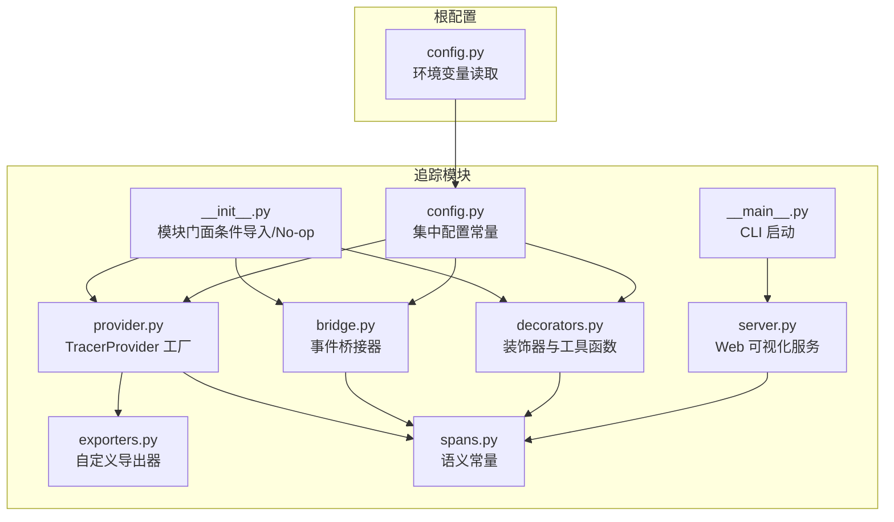
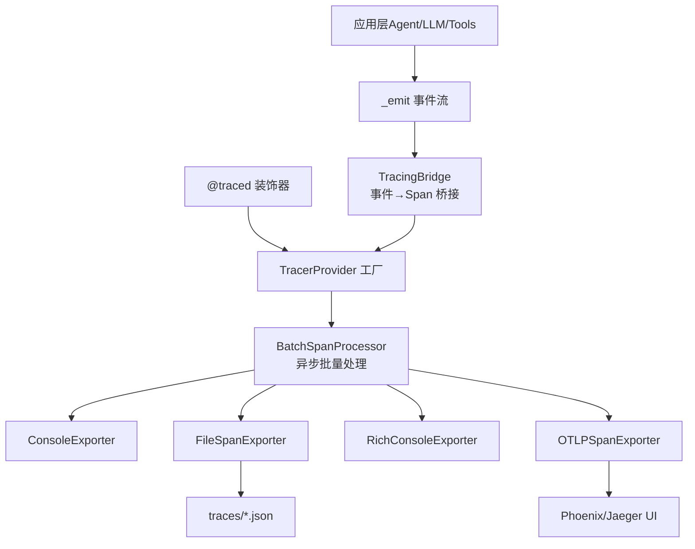
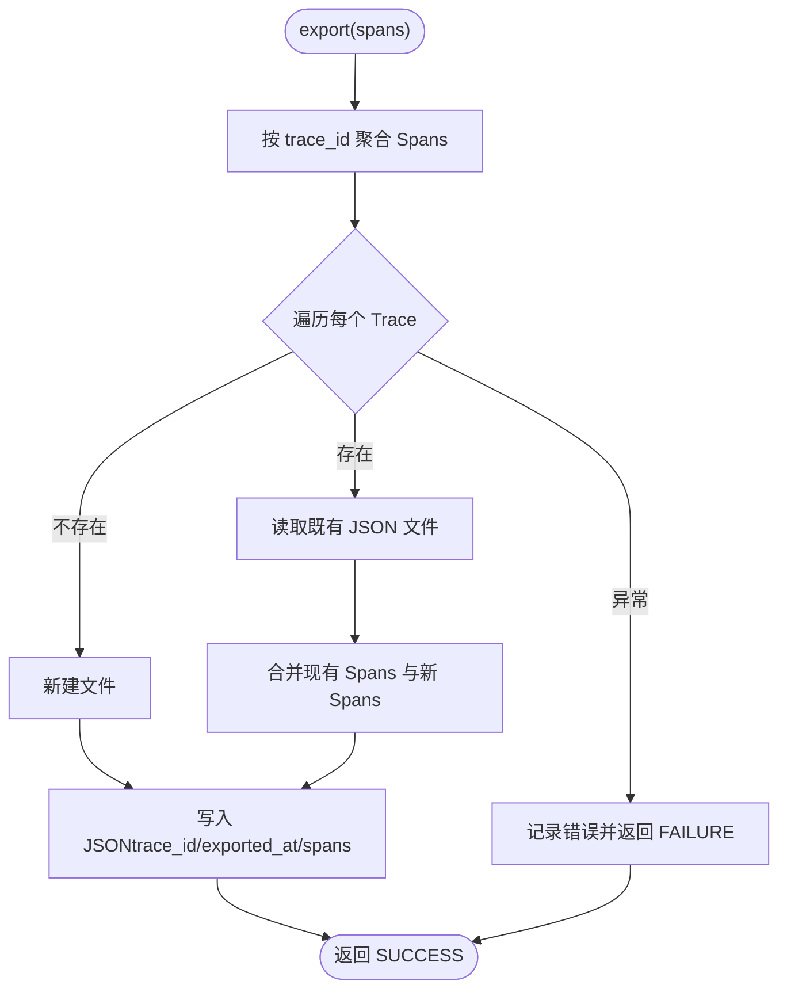
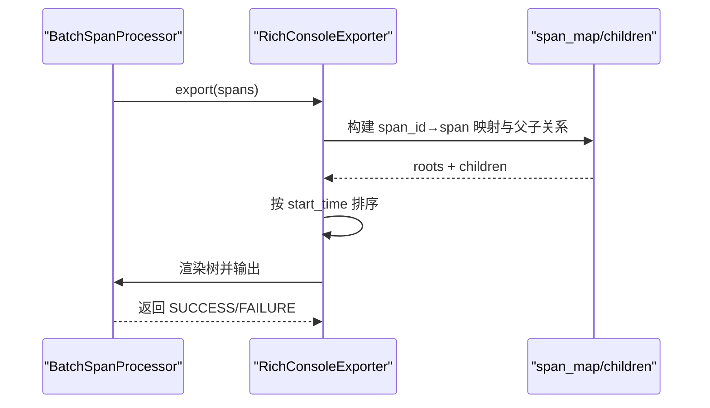
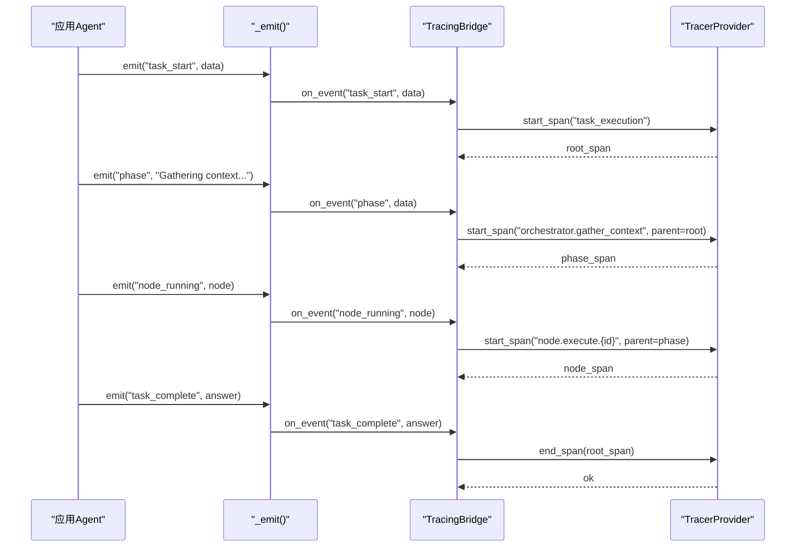
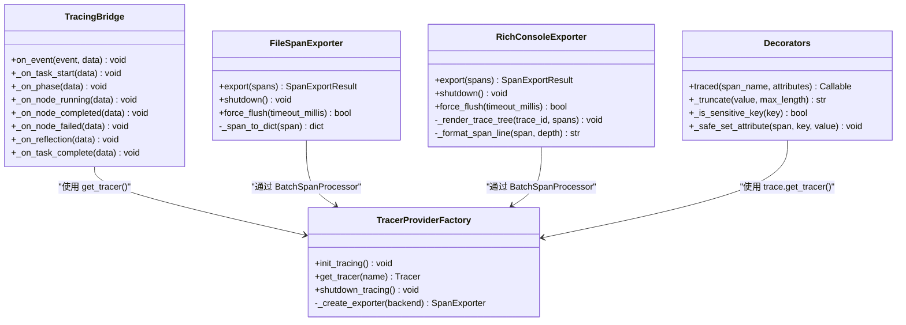
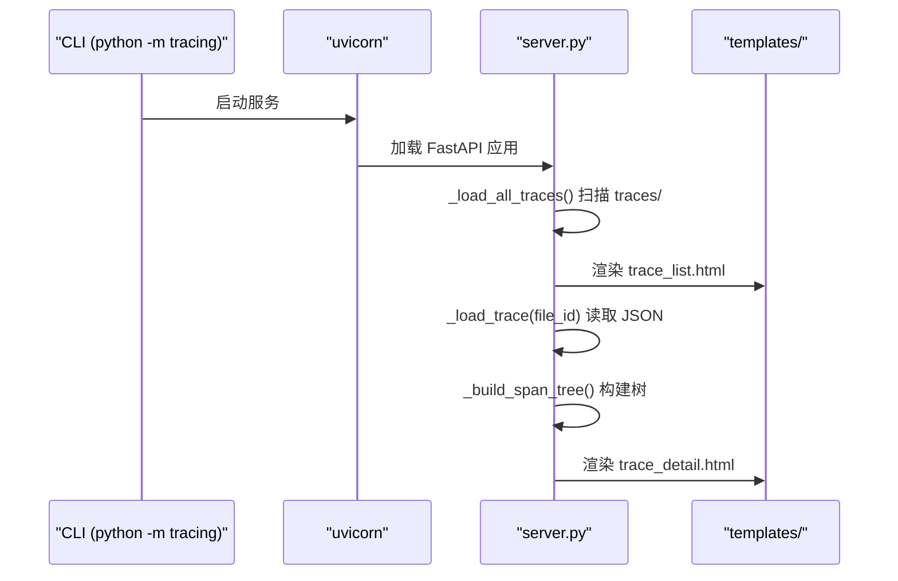
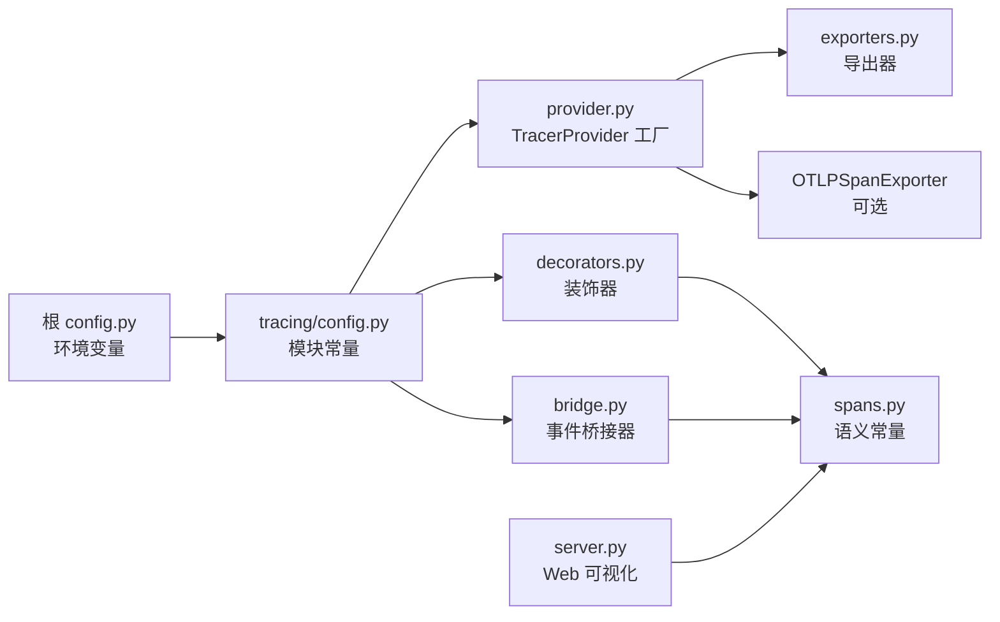

# 追踪导出器系统

<cite>
**本文引用的文件**
- [tracing/__init__.py](file://tracing/__init__.py)
- [tracing/provider.py](file://tracing/provider.py)
- [tracing/config.py](file://tracing/config.py)
- [tracing/exporters.py](file://tracing/exporters.py)
- [tracing/bridge.py](file://tracing/bridge.py)
- [tracing/decorators.py](file://tracing/decorators.py)
- [tracing/spans.py](file://tracing/spans.py)
- [tracing/server.py](file://tracing/server.py)
- [tracing/__main__.py](file://tracing/__main__.py)
- [config.py](file://config.py)
- [tests/test_tracing.py](file://tests/test_tracing.py)
- [sxw_aicoding/docs/tracing-design.md](file://sxw_aicoding/docs/tracing-design.md)
- [sxw_aicoding/docs/tracing-guide.md](file://sxw_aicoding/docs/tracing-guide.md)
- [README.md](file://README.md)
</cite>

## 目录
1. [简介](#简介)
2. [项目结构](#项目结构)
3. [核心组件](#核心组件)
4. [架构总览](#架构总览)
5. [详细组件分析](#详细组件分析)
6. [依赖关系分析](#依赖关系分析)
7. [性能考虑](#性能考虑)
8. [故障排除指南](#故障排除指南)
9. [结论](#结论)
10. [附录](#附录)

## 简介
本文件为 Manus Demo 项目的追踪导出器系统技术文档，围绕基于 OpenTelemetry 的全链路可观察性展开，重点说明：
- 内置导出器（文件导出、Rich 控制台导出）的实现原理与使用方法
- 如何扩展自定义导出器以支持新的追踪后端
- 导出器的注册机制与生命周期管理
- 批量导出与异步处理策略
- 错误处理与重试机制
- 配置与性能调优指南
- 与 Jaeger、Zipkin、OTLP 等平台的集成示例
- 监控与健康检查机制
- 故障排除与调试技巧

## 项目结构
追踪模块位于 tracing/ 目录，采用“模块门面 + 配置 + 工厂 + 导出器 + 桥接 + 装饰器”的分层设计，配合根配置模块集中管理环境变量。

图表来源
- [tracing/__init__.py:1-67](file://tracing/__init__.py#L1-L67)
- [tracing/provider.py:1-197](file://tracing/provider.py#L1-L197)
- [tracing/config.py:1-79](file://tracing/config.py#L1-L79)
- [tracing/exporters.py:1-304](file://tracing/exporters.py#L1-L304)
- [tracing/bridge.py:1-765](file://tracing/bridge.py#L1-L765)
- [tracing/decorators.py:1-146](file://tracing/decorators.py#L1-L146)
- [tracing/spans.py:1-249](file://tracing/spans.py#L1-L249)
- [tracing/server.py:1-276](file://tracing/server.py#L1-L276)
- [tracing/__main__.py:1-108](file://tracing/__main__.py#L1-L108)
- [config.py:102-109](file://config.py#L102-L109)

章节来源
- [tracing/__init__.py:1-67](file://tracing/__init__.py#L1-L67)
- [tracing/provider.py:1-197](file://tracing/provider.py#L1-L197)
- [tracing/config.py:1-79](file://tracing/config.py#L1-L79)
- [tracing/exporters.py:1-304](file://tracing/exporters.py#L1-L304)
- [tracing/bridge.py:1-765](file://tracing/bridge.py#L1-L765)
- [tracing/decorators.py:1-146](file://tracing/decorators.py#L1-L146)
- [tracing/spans.py:1-249](file://tracing/spans.py#L1-L249)
- [tracing/server.py:1-276](file://tracing/server.py#L1-L276)
- [tracing/__main__.py:1-108](file://tracing/__main__.py#L1-L108)
- [config.py:102-109](file://config.py#L102-L109)

## 核心组件
- 模块门面与特性开关：通过 TRACING_ENABLED 控制是否加载 OpenTelemetry 与追踪功能，关闭时提供 no-op 桩，实现零开销。
- TracerProvider 工厂：负责 Resource、Sampler、Exporter 与 SpanProcessor 的装配，支持多种后端（console/file/rich/otlp/phoenix）。
- 自定义导出器：FileSpanExporter（JSON 文件）、RichConsoleExporter（Rich 树渲染）。
- 事件桥接器：将现有事件回调系统转换为 OpenTelemetry Spans，维护父子关系与阶段管理。
- 装饰器系统：@traced 提供方法级声明式埋点，支持同步/异步，具备异常记录与延迟统计。
- 语义常量：统一 Span 名称、属性键与事件名，遵循 OpenTelemetry GenAI 语义规范。
- Web 可视化：内置 FastAPI 服务，提供 Trace 列表与详情页，支持树形视图与 JSON API。

章节来源
- [tracing/__init__.py:29-58](file://tracing/__init__.py#L29-L58)
- [tracing/provider.py:45-118](file://tracing/provider.py#L45-L118)
- [tracing/exporters.py:28-157](file://tracing/exporters.py#L28-L157)
- [tracing/exporters.py:159-304](file://tracing/exporters.py#L159-L304)
- [tracing/bridge.py:38-116](file://tracing/bridge.py#L38-L116)
- [tracing/decorators.py:70-146](file://tracing/decorators.py#L70-L146)
- [tracing/spans.py:18-249](file://tracing/spans.py#L18-L249)
- [tracing/server.py:29-276](file://tracing/server.py#L29-L276)

## 架构总览
追踪系统采用“双通道”模式：事件桥接（TracingBridge）自动采集高层生命周期事件；装饰器与内联埋点（LLM/工具）记录底层细节。二者通过 OpenTelemetry 上下文自动建立父子关系，最终由 BatchSpanProcessor 异步批量导出至不同后端。

图表来源
- [tracing/provider.py:154-197](file://tracing/provider.py#L154-L197)
- [tracing/exporters.py:28-157](file://tracing/exporters.py#L28-L157)
- [tracing/exporters.py:159-304](file://tracing/exporters.py#L159-L304)
- [tracing/bridge.py:117-134](file://tracing/bridge.py#L117-L134)
- [tracing/decorators.py:70-146](file://tracing/decorators.py#L70-L146)

章节来源
- [sxw_aicoding/docs/tracing-design.md:56-115](file://sxw_aicoding/docs/tracing-design.md#L56-L115)
- [sxw_aicoding/docs/tracing-guide.md:555-626](file://sxw_aicoding/docs/tracing-guide.md#L555-L626)

## 详细组件分析

### FileSpanExporter（文件导出器）
- 功能：将完成的 Spans 按 Trace 聚合写入 JSON 文件，每个 Trace 一个文件，支持多次导出合并。
- 批量策略：使用 BatchSpanProcessor，异步批量导出，避免阻塞主流程。
- 数据结构：文件包含 trace_id、exported_at、spans（数组）等字段，每个 Span 包含 id、parent_id、name、时间戳、属性、事件、状态等。
- 错误处理：捕获异常并返回 FAILURE，不影响导出器生命周期。

图表来源
- [tracing/exporters.py:46-88](file://tracing/exporters.py#L46-L88)

章节来源
- [tracing/exporters.py:28-157](file://tracing/exporters.py#L28-L157)

### RichConsoleExporter（Rich 控制台导出器）
- 功能：将 Spans 按 Trace 渲染为 Rich 树，便于开发调试。
- 渲染策略：基于 parent_span_id 重建树，按 start_time 排序，支持图标映射与关键属性摘要。
- 依赖：可选 rich 包，未安装时回退到 print。

图表来源
- [tracing/exporters.py:176-193](file://tracing/exporters.py#L176-L193)
- [tracing/exporters.py:201-257](file://tracing/exporters.py#L201-L257)

章节来源
- [tracing/exporters.py:159-304](file://tracing/exporters.py#L159-L304)

### TracingBridge（事件桥接器）
- 功能：订阅事件回调，将高层生命周期事件转换为 Spans，维护阶段、DAG 超步、节点与 TODO 的父子关系。
- 事件映射：通过事件分发表将 task_start/phase/node_running/reflection 等映射为标准 Span 名称。
- 异常安全：on_event 内部 try-catch，确保追踪异常不影响主流程。
- 上下文传播：通过 trace.set_span_in_context 与 context.attach/detach 管理当前 Span 上下文。

图表来源
- [tracing/bridge.py:117-134](file://tracing/bridge.py#L117-L134)
- [tracing/bridge.py:149-196](file://tracing/bridge.py#L149-L196)
- [tracing/bridge.py:425-534](file://tracing/bridge.py#L425-L534)

章节来源
- [tracing/bridge.py:38-116](file://tracing/bridge.py#L38-L116)
- [tracing/bridge.py:117-134](file://tracing/bridge.py#L117-L134)
- [tracing/bridge.py:149-196](file://tracing/bridge.py#L149-L196)
- [tracing/bridge.py:425-534](file://tracing/bridge.py#L425-L534)

### 装饰器系统与内联埋点
- @traced：支持同步/异步函数，自动记录延迟、异常与静态属性；TRACING_ENABLED=false 时退化为透传。
- 共享工具：_truncate、_is_sensitive_key、_safe_set_attribute，统一属性截断与敏感信息脱敏。
- 内联埋点：LLMClient 与 BaseTool 的 traced_execute 提供细粒度埋点入口，复用共享工具。

图表来源
- [tracing/bridge.py:38-116](file://tracing/bridge.py#L38-L116)
- [tracing/exporters.py:28-157](file://tracing/exporters.py#L28-L157)
- [tracing/exporters.py:159-304](file://tracing/exporters.py#L159-L304)
- [tracing/provider.py:45-118](file://tracing/provider.py#L45-L118)
- [tracing/decorators.py:70-146](file://tracing/decorators.py#L70-L146)

章节来源
- [tracing/decorators.py:70-146](file://tracing/decorators.py#L70-L146)
- [tracing/decorators.py:30-68](file://tracing/decorators.py#L30-L68)

### Web 可视化服务（内置 Trace Viewer）
- 功能：扫描 traces/ 目录，提供 Trace 列表页与详情页（树形视图），支持 JSON API。
- 安全：路径穿越防护，仅允许合法文件名；解析失败时忽略。
- 图标：与 spans.py 中图标映射一致，提升可读性。

图表来源
- [tracing/__main__.py:21-104](file://tracing/__main__.py#L21-L104)
- [tracing/server.py:65-122](file://tracing/server.py#L65-L122)
- [tracing/server.py:124-207](file://tracing/server.py#L124-L207)

章节来源
- [tracing/server.py:1-276](file://tracing/server.py#L1-L276)
- [tracing/__main__.py:1-108](file://tracing/__main__.py#L1-L108)

## 依赖关系分析
- 模块耦合：TracingBridge、@traced、FileSpanExporter、RichConsoleExporter 均依赖 TracerProvider 工厂提供的全局 Tracer；导出器通过 BatchSpanProcessor 与 OTel SDK 解耦。
- 外部依赖：OTLP 导出器需安装 opentelemetry-exporter-otlp；Phoenix 需安装 arize-phoenix；Web Viewer 需安装 fastapi/uvicorn/jinja2。
- 配置来源：根 config.py 读取环境变量，tracing/config.py 将其映射为模块级常量，provider/bridge/decorators 读取这些常量。

图表来源
- [config.py:102-109](file://config.py#L102-L109)
- [tracing/config.py:14-79](file://tracing/config.py#L14-L79)
- [tracing/provider.py:154-197](file://tracing/provider.py#L154-L197)
- [tracing/exporters.py:176-193](file://tracing/exporters.py#L176-L193)

章节来源
- [config.py:102-109](file://config.py#L102-L109)
- [tracing/config.py:14-79](file://tracing/config.py#L14-L79)
- [tracing/provider.py:154-197](file://tracing/provider.py#L154-L197)

## 性能考虑
- 零开销原则：TRACING_ENABLED=false 时，模块门面提供 no-op 桩，不导入 OTel，不创建 Span。
- 异步导出：BatchSpanProcessor 后台批量导出，不阻塞主执行路径。
- 内存控制：通过 max_queue_size、max_export_batch_size、schedule_delay_millis 控制队列与批大小。
- 采样策略：TraceIdRatioBased 采样，确保完整 Trace 的一致性。
- 属性截断与脱敏：避免超长属性与敏感信息带来的性能与安全问题。

章节来源
- [tracing/__init__.py:29-58](file://tracing/__init__.py#L29-L58)
- [tracing/provider.py:100-105](file://tracing/provider.py#L100-L105)
- [tracing/decorators.py:30-68](file://tracing/decorators.py#L30-L68)

## 故障排除指南
- 启用与验证
  - 开发：TRACING_ENABLED=true TRACING_BACKEND=rich/file/console
  - 生产：TRACING_ENABLED=true TRACING_BACKEND=otlp/phoenix
- 常见问题
  - OTLP 导出器缺失：安装 opentelemetry-exporter-otlp；Phoenix 需安装 arize-phoenix。
  - Web Viewer 无文件：确认 traces/ 目录存在且包含 JSON 文件；使用 CLI 启动服务。
  - 导出未触发：短时任务可能在程序退出前未导出，确保正常退出或手动调用 shutdown_tracing()。
  - 导出器异常：FileSpanExporter/RichConsoleExporter 捕获异常并返回 FAILURE，不影响主流程。
- 调试技巧
  - 使用 @traced 标注关键函数，记录延迟与异常。
  - 使用 TRACING_LOG_PROMPTS=true（开发）记录 prompt/response，注意隐私。
  - 使用 Web Viewer 树形视图定位异常 Span 与事件。

章节来源
- [sxw_aicoding/docs/tracing-guide.md:131-184](file://sxw_aicoding/docs/tracing-guide.md#L131-L184)
- [tracing/exporters.py:86-88](file://tracing/exporters.py#L86-L88)
- [tracing/server.py:52-63](file://tracing/server.py#L52-L63)

## 结论
追踪导出器系统通过模块门面、工厂与导出器的清晰分层，结合双通道采集与异步批量导出，实现了从开发调试到生产可观测性的全场景覆盖。内置 FileSpanExporter 与 RichConsoleExporter 满足离线分析与终端可视化的双重需求；通过 OTLP/Phoenix 可无缝对接 Jaeger 等平台。配套的装饰器、语义常量与 Web Viewer 进一步提升了可用性与可维护性。

## 附录

### 扩展自定义导出器
- 实现步骤
  - 继承 SpanExporter，实现 export、shutdown、force_flush 三个方法。
  - 在 provider.py 的 _create_exporter 中注册新后端（如 "custom"），返回自定义导出器实例。
  - 根据需要选择 SimpleSpanProcessor（即时输出）或 BatchSpanProcessor（异步批量）。
- 注意事项
  - 保持异常安全，捕获并记录错误，返回 SpanExportResult.FAILURE。
  - 遵循 OpenTelemetry 规范，正确处理时间戳、状态码与属性。

章节来源
- [tracing/provider.py:154-197](file://tracing/provider.py#L154-L197)
- [tracing/exporters.py:28-157](file://tracing/exporters.py#L28-L157)

### 配置与性能调优
- 关键配置项
  - TRACING_ENABLED：总开关
  - TRACING_BACKEND：console/file/rich/otlp/phoenix
  - TRACING_ENDPOINT：OTLP 端点
  - TRACING_SAMPLE_RATE：采样率（0.0~1.0）
  - TRACING_LOG_PROMPTS：是否记录完整 prompt
  - TRACING_MAX_ATTRIBUTE_LENGTH：属性最大长度
- 性能建议
  - 生产环境设置采样率（如 0.1），降低开销。
  - 调整 BatchSpanProcessor 参数（队列大小、批大小、调度间隔）。
  - 使用 RichConsoleExporter 进行开发调试，使用 FileSpanExporter 进行离线分析。

章节来源
- [config.py:102-109](file://config.py#L102-L109)
- [tracing/config.py:17-79](file://tracing/config.py#L17-L79)
- [tracing/provider.py:100-105](file://tracing/provider.py#L100-L105)

### 与 Jaeger、Zipkin、OTLP 的集成示例
- Jaeger
  - 使用 TRACING_BACKEND=otlp，TRACING_ENDPOINT 指向 Jaeger Collector 的 OTLP HTTP 端点。
- Zipkin
  - OTLP 协议可经由支持 OTLP 的网关或代理转发至 Zipkin（需第三方适配）。
- Phoenix（Arize）
  - TRACING_BACKEND=phoenix，自动追加 /v1/traces；Phoenix UI 提供 GenAI 友好的可视化。

章节来源
- [sxw_aicoding/docs/tracing-guide.md:318-340](file://sxw_aicoding/docs/tracing-guide.md#L318-L340)

### 监控与健康检查
- Web Viewer
  - 提供 /api/traces 与 /api/traces/{file_id} JSON API，便于程序化监控。
- 日志与告警
  - 导出器异常会记录错误日志；建议在 CI/CD 中监控 traces/ 目录增长与导出失败率。
- 上下文与状态
  - 通过 Span 状态码与事件（如 reflection.complete、node.state_transition）进行健康检查。

章节来源
- [tracing/server.py:253-276](file://tracing/server.py#L253-L276)
- [tracing/exporters.py:86-88](file://tracing/exporters.py#L86-L88)