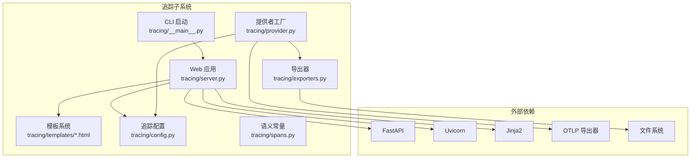
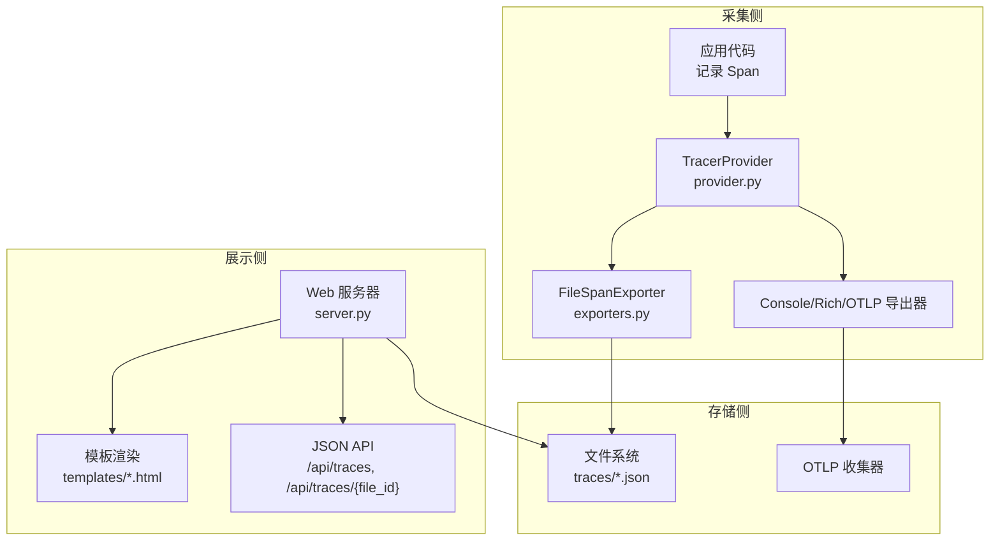
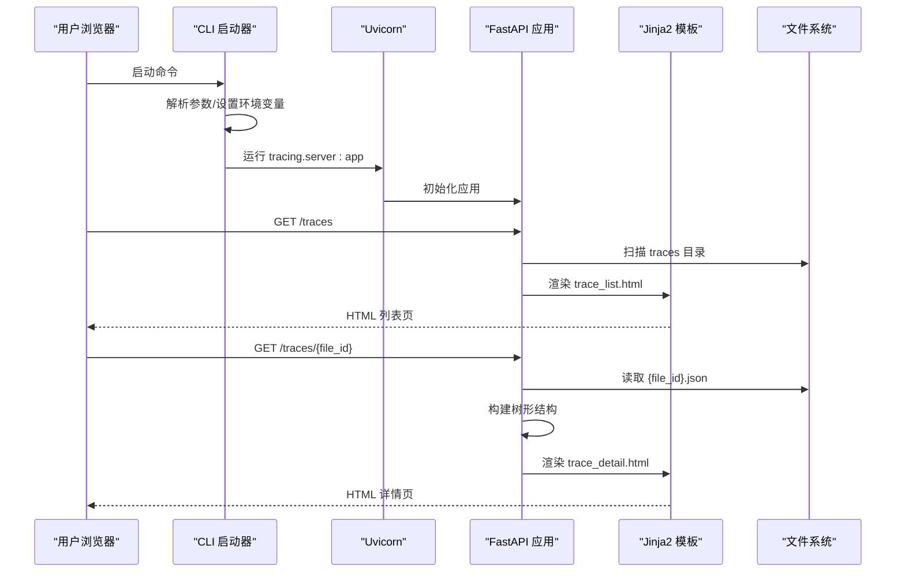
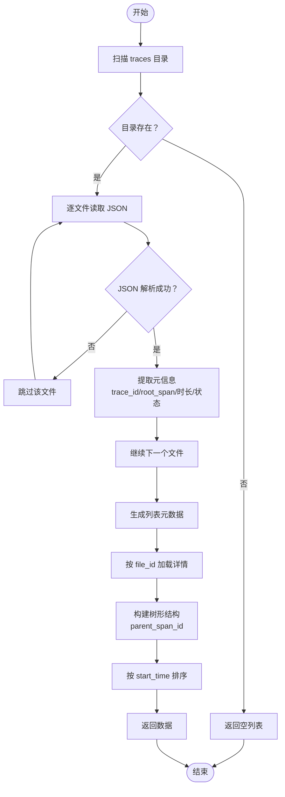
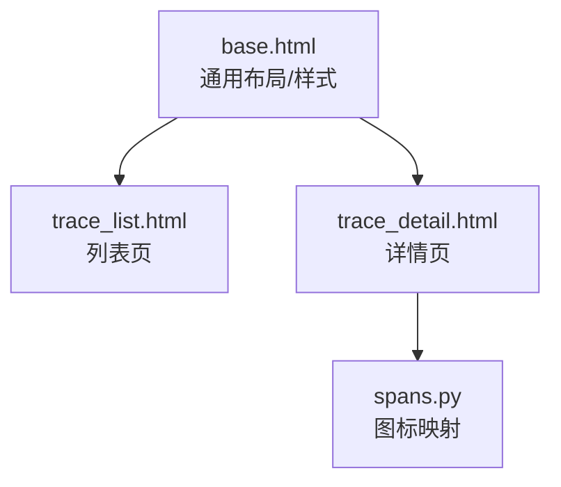
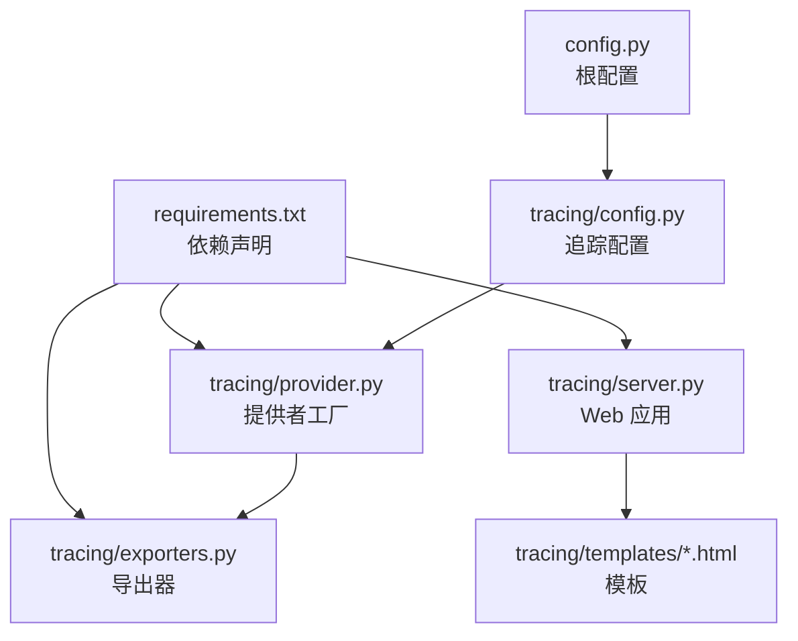

# 追踪服务器实现

<cite>
**本文引用的文件**
- [README.md](file://README.md)
- [requirements.txt](file://requirements.txt)
- [config.py](file://config.py)
- [tracing/__main__.py](file://tracing/__main__.py)
- [tracing/server.py](file://tracing/server.py)
- [tracing/provider.py](file://tracing/provider.py)
- [tracing/config.py](file://tracing/config.py)
- [tracing/exporters.py](file://tracing/exporters.py)
- [tracing/spans.py](file://tracing/spans.py)
- [tracing/templates/base.html](file://tracing/templates/base.html)
- [tracing/templates/trace_list.html](file://tracing/templates/trace_list.html)
- [tracing/templates/trace_detail.html](file://tracing/templates/trace_detail.html)
</cite>

## 目录
1. [简介](#简介)
2. [项目结构](#项目结构)
3. [核心组件](#核心组件)
4. [架构总览](#架构总览)
5. [详细组件分析](#详细组件分析)
6. [依赖关系分析](#依赖关系分析)
7. [性能考虑](#性能考虑)
8. [故障排除指南](#故障排除指南)
9. [结论](#结论)
10. [附录](#附录)

## 简介
本文件为“追踪服务器”的技术文档，聚焦于基于 OpenTelemetry 的全链路追踪数据采集、存储与 Web 可视化展示。内容涵盖：
- HTTP 服务器的启动与路由配置
- 追踪数据的存储与查询机制
- UI 模板系统的设计与渲染逻辑
- 追踪列表页与详情页的功能特性
- 实时数据更新与缓存策略
- 服务器部署与运维指南
- 性能监控与日志记录配置
- 如何扩展新的 UI 页面与数据展示功能
- 故障排除与调试工具使用方法

## 项目结构
追踪子系统位于 tracing 包中，包含 Web 服务器、模板、导出器、追踪配置与常量定义等模块。主要文件如下：
- CLI 启动入口：tracing/__main__.py
- Web 服务器：tracing/server.py（FastAPI 应用、路由、模板渲染、数据访问）
- 追踪提供者工厂：tracing/provider.py（初始化 OpenTelemetry TracerProvider，按配置选择导出器）
- 追踪配置：tracing/config.py（从根配置读取环境变量）
- 自定义导出器：tracing/exporters.py（文件导出、Rich 控制台导出）
- 语义常量：tracing/spans.py（Span 名称、属性键、事件名、图标映射）
- 模板：tracing/templates/*.html（基础布局、列表页、详情页）

图表来源
- [tracing/__main__.py:1-108](file://tracing/__main__.py#L1-L108)
- [tracing/server.py:1-276](file://tracing/server.py#L1-L276)
- [tracing/provider.py:1-197](file://tracing/provider.py#L1-L197)
- [tracing/exporters.py:1-304](file://tracing/exporters.py#L1-L304)
- [tracing/config.py:1-79](file://tracing/config.py#L1-L79)
- [tracing/spans.py:1-249](file://tracing/spans.py#L1-L249)

章节来源
- [README.md:97-154](file://README.md#L97-L154)
- [requirements.txt:1-19](file://requirements.txt#L1-L19)

## 核心组件
- CLI 启动器：解析命令行参数，设置追踪目录环境变量，启动 Uvicorn 服务器。
- Web 服务器：FastAPI 应用，提供 HTML 页面与 JSON API；负责模板渲染与数据访问。
- 追踪提供者工厂：根据配置创建 TracerProvider，选择导出器（控制台、文件、Rich、OTLP、Phoenix）。
- 自定义导出器：FileSpanExporter 将完成的 Span 写入 JSON 文件；RichConsoleExporter 在终端渲染树形结构。
- 模板系统：Jinja2 模板，提供基础布局、列表页与详情页，支持树形渲染与详情面板。
- 语义常量：统一的 Span 名称、属性键、事件名与图标映射，确保跨模块一致性。

章节来源
- [tracing/__main__.py:21-108](file://tracing/__main__.py#L21-L108)
- [tracing/server.py:29-276](file://tracing/server.py#L29-L276)
- [tracing/provider.py:45-197](file://tracing/provider.py#L45-L197)
- [tracing/exporters.py:28-304](file://tracing/exporters.py#L28-L304)
- [tracing/config.py:14-79](file://tracing/config.py#L14-L79)
- [tracing/spans.py:14-249](file://tracing/spans.py#L14-L249)

## 架构总览
追踪系统分为“采集侧”和“展示侧”：
- 采集侧：应用通过 OpenTelemetry SDK 记录 Span，TracerProvider 根据配置选择导出器。文件导出器将数据持久化到 traces 目录；OTLP 导出器发送至远端收集器。
- 展示侧：Web 服务器扫描 traces 目录，加载 JSON 文件，构建树形结构，通过模板渲染列表页与详情页；同时提供 JSON API 供前端或外部系统消费。

图表来源
- [tracing/provider.py:45-197](file://tracing/provider.py#L45-L197)
- [tracing/exporters.py:28-304](file://tracing/exporters.py#L28-L304)
- [tracing/server.py:65-276](file://tracing/server.py#L65-L276)

## 详细组件分析

### HTTP 服务器启动与路由配置
- 启动流程：CLI 解析 --port/--dir/--host/--no-open 参数，设置环境变量 _TRACING_VIEWER_DIR，调用 Uvicorn 运行 tracing.server:app。
- 应用初始化：FastAPI 实例创建，模板目录指向 tracing/templates，注册路由与错误处理。
- 路由设计：
  - 页面路由：GET / 重定向至 /traces；GET /traces 渲染列表页；GET /traces/{file_id} 渲染详情页。
  - API 路由：GET /api/traces 返回所有追踪元数据；GET /api/traces/{file_id} 返回树形结构的完整追踪数据。
- 安全与健壮性：路径遍历防护（拒绝包含路径分隔符或 .. 的 file_id），解析路径必须位于 traces 目录内；JSON 解析异常与文件不存在均返回安全响应。

图表来源
- [tracing/__main__.py:21-108](file://tracing/__main__.py#L21-L108)
- [tracing/server.py:213-276](file://tracing/server.py#L213-L276)

章节来源
- [tracing/__main__.py:21-108](file://tracing/__main__.py#L21-L108)
- [tracing/server.py:29-276](file://tracing/server.py#L29-L276)

### 追踪数据的存储与查询机制
- 存储格式：FileSpanExporter 将每个 trace_id 对应的 Span 写入独立 JSON 文件，文件名形如 {trace_id}.json，包含 trace_id、exported_at、spans 等字段。
- 查询策略：
  - 列表页：扫描 traces 目录，按文件修改时间倒序读取 JSON，提取根 Span、总时长、状态等元信息。
  - 详情页：按 file_id 定位文件，读取完整 spans，构建树形结构（基于 parent_span_id），并对节点进行排序与去重处理。
- 数据完整性与容错：对 JSON 解析错误、文件缺失、非法路径进行捕获与降级处理；树构建过程中处理缺失 ID、重复 ID、自引用父节点等边界情况。

图表来源
- [tracing/server.py:65-207](file://tracing/server.py#L65-L207)

章节来源
- [tracing/server.py:65-207](file://tracing/server.py#L65-L207)
- [tracing/exporters.py:46-157](file://tracing/exporters.py#L46-L157)

### UI 模板系统设计与渲染逻辑
- 基础布局：base.html 定义暗色主题样式、导航、面包屑、表格与状态徽标等通用结构。
- 列表页：trace_list.html 展示 trace 列表，点击行跳转详情页；当无文件时显示空状态提示。
- 详情页：trace_detail.html 采用树形视图，JavaScript 递归渲染节点，支持展开/折叠、选中高亮、详情面板展示属性与事件；长文本属性支持折叠与复制。
- 模板继承与块：通过 extends base.html 继承布局，使用 block 注入标题、导航状态与额外 CSS/JS。
- 图标映射：基于 spans.py 中的 SPAN_ICONS 为不同 Span 名称分配图标，提升可读性。

图表来源
- [tracing/templates/base.html:1-229](file://tracing/templates/base.html#L1-L229)
- [tracing/templates/trace_list.html:1-63](file://tracing/templates/trace_list.html#L1-L63)
- [tracing/templates/trace_detail.html:1-644](file://tracing/templates/trace_detail.html#L1-L644)
- [tracing/spans.py:231-249](file://tracing/spans.py#L231-L249)

章节来源
- [tracing/templates/base.html:1-229](file://tracing/templates/base.html#L1-L229)
- [tracing/templates/trace_list.html:1-63](file://tracing/templates/trace_list.html#L1-L63)
- [tracing/templates/trace_detail.html:1-644](file://tracing/templates/trace_detail.html#L1-L644)
- [tracing/spans.py:231-249](file://tracing/spans.py#L231-L249)

### 追踪列表页面与详情页面功能特性
- 列表页面：
  - 展示状态（OK/ERROR）、Trace ID（截断显示）、根 Span 名称、Span 数量、总时长（自动单位转换）、导出时间、文件大小。
  - 行点击跳转详情页；无文件时提示如何生成文件。
- 详情页面：
  - 面包屑导航与基础信息区；树形视图支持展开/折叠；选中节点弹出详情面板，展示基本属性、长文本属性（可折叠/复制）、事件列表。
  - 响应式交互：JavaScript 渲染树节点、格式化时长与状态、复制长文本块。

章节来源
- [tracing/templates/trace_list.html:6-62](file://tracing/templates/trace_list.html#L6-L62)
- [tracing/templates/trace_detail.html:347-644](file://tracing/templates/trace_detail.html#L347-L644)

### 实时数据更新与缓存策略
- 实时性：Web 服务器每次请求均扫描 traces 目录并读取最新 JSON 文件，确保展示最新数据。
- 缓存策略：当前实现未引入内存缓存或文件系统缓存；若 traces 目录频繁变化，建议在部署层面对文件系统与网络共享进行优化。
- 性能建议：对于大量文件场景，可在模板层增加分页或懒加载；对树构建过程进行去重与排序优化。

章节来源
- [tracing/server.py:74-121](file://tracing/server.py#L74-L121)
- [tracing/server.py:151-207](file://tracing/server.py#L151-L207)

### 服务器部署与运维指南
- 环境准备：安装依赖（FastAPI、Uvicorn、Jinja2、OpenTelemetry），确保 Python 3.11+。
- 启动方式：
  - 默认：python -m tracing
  - 自定义端口与目录：python -m tracing --port 9000 --dir ./my_traces --host 0.0.0.0
  - 不自动打开浏览器：添加 --no-open
- 部署建议：
  - 将 traces 目录置于持久化存储；在容器环境中挂载卷。
  - 使用反向代理（如 Nginx）暴露服务，开启 gzip 压缩与静态资源缓存。
  - 限制并发与请求大小，避免目录扫描风暴。
- 日志与可观测性：通过 uvicorn 的 log_level 控制日志级别；OTLP 导出器可将追踪数据上报至集中式收集器。

章节来源
- [requirements.txt:1-19](file://requirements.txt#L1-L19)
- [tracing/__main__.py:21-108](file://tracing/__main__.py#L21-L108)

### 性能监控与日志记录配置
- OpenTelemetry 配置：采样率、服务名、批处理队列大小、导出批次大小与调度间隔等参数由 tracing/config.py 提供。
- 导出器选择：
  - 控制台/Rich：适用于开发调试，立即输出。
  - 文件：适用于离线分析，按 trace_id 写入独立 JSON 文件。
  - OTLP/Phoenix：适用于生产环境，发送至集中式收集器。
- 日志记录：提供者工厂与导出器均记录关键信息与错误；可通过日志系统聚合与告警。

章节来源
- [tracing/config.py:14-79](file://tracing/config.py#L14-L79)
- [tracing/provider.py:45-197](file://tracing/provider.py#L45-L197)
- [tracing/exporters.py:28-304](file://tracing/exporters.py#L28-L304)

### 扩展新的 UI 页面与数据展示功能
- 新增页面步骤：
  1) 在 tracing/templates 下创建新模板（继承 base.html）。
  2) 在 tracing/server.py 中添加路由函数，渲染模板并传入所需数据。
  3) 在 base.html 的导航中添加链接，或在现有页面中增加面包屑。
- 数据展示建议：
  - 使用现有树构建逻辑（基于 parent_span_id）组织层级数据。
  - 对长文本属性采用折叠展示与一键复制，提升可读性。
  - 为新页面增加分页或搜索过滤，降低大数据量下的渲染压力。

章节来源
- [tracing/server.py:219-247](file://tracing/server.py#L219-L247)
- [tracing/templates/base.html:214-229](file://tracing/templates/base.html#L214-L229)

## 依赖关系分析
- 运行时依赖：FastAPI、Uvicorn、Jinja2、OpenTelemetry SDK 与 OTLP 导出器。
- 追踪配置依赖：tracing/config.py 从根配置模块读取环境变量，确保与主应用一致。
- 模板与 UI：Jinja2 模板与自定义图标映射解耦，便于维护与扩展。

图表来源
- [requirements.txt:1-19](file://requirements.txt#L1-L19)
- [config.py:102-109](file://config.py#L102-L109)
- [tracing/config.py:14-79](file://tracing/config.py#L14-L79)
- [tracing/server.py:29-37](file://tracing/server.py#L29-L37)
- [tracing/provider.py:33-36](file://tracing/provider.py#L33-L36)

章节来源
- [requirements.txt:1-19](file://requirements.txt#L1-L19)
- [config.py:102-109](file://config.py#L102-L109)
- [tracing/config.py:14-79](file://tracing/config.py#L14-L79)
- [tracing/server.py:29-37](file://tracing/server.py#L29-L37)
- [tracing/provider.py:33-36](file://tracing/provider.py#L33-L36)

## 性能考虑
- I/O 优化：文件读取与 JSON 解析为热点路径，建议在高并发场景下：
  - 对 traces 目录启用 SSD 或高性能存储；
  - 限制扫描范围（例如按时间窗口筛选）；
  - 对模板渲染结果进行静态缓存（如 Nginx 缓存）。
- 渲染优化：树形视图在大数据量下可能影响首屏渲染，建议：
  - 模板层分页或懒加载；
  - 前端仅渲染可见区域节点；
  - 对属性值进行截断与延迟加载。
- 导出器选择：生产环境优先使用 OTLP 批量导出，减少磁盘 I/O 与文件碎片。

## 故障排除指南
- 启动失败（缺少依赖）：
  - 现象：提示 uvicorn 未安装或 OTLP 导出器不可用。
  - 处理：安装 uvicorn[standard] 与 opentelemetry-exporter-otlp。
- 目录不存在或无文件：
  - 现象：CLI 提示 traces 目录不存在或无文件。
  - 处理：确认 TRACING_ENABLED=true 且 TRACING_BACKEND=file，确保应用已导出数据。
- 路径遍历与权限问题：
  - 现象：访问 /traces/{file_id} 返回 404 或安全拦截。
  - 处理：确保 file_id 不包含路径分隔符或 ..，并位于 traces 目录内。
- JSON 解析错误：
  - 现象：列表页或详情页部分数据缺失。
  - 处理：检查对应 JSON 文件完整性，修复后重试。
- OTLP 导出失败：
  - 现象：日志警告 OTLP 不可用，回退控制台导出。
  - 处理：安装 OTLP 导出器或调整导出后端。

章节来源
- [tracing/__main__.py:52-63](file://tracing/__main__.py#L52-L63)
- [tracing/__main__.py:88-92](file://tracing/__main__.py#L88-L92)
- [tracing/server.py:129-148](file://tracing/server.py#L129-L148)
- [tracing/provider.py:185-190](file://tracing/provider.py#L185-L190)

## 结论
追踪服务器通过简洁的 FastAPI 应用与 Jinja2 模板，实现了对 OpenTelemetry 追踪数据的高效采集、存储与可视化展示。其模块化设计便于扩展新的 UI 页面与数据展示功能；结合 OTLP 导出器，可无缝对接集中式观测平台。建议在生产环境中关注 I/O 与渲染性能，并通过合理的缓存与分页策略提升用户体验。

## 附录
- 环境变量与配置项参考：见根配置模块与追踪配置模块中的注释说明。
- 示例命令：CLI 启动、自定义端口与目录、禁用自动打开浏览器。

章节来源
- [config.py:102-109](file://config.py#L102-L109)
- [tracing/config.py:14-79](file://tracing/config.py#L14-L79)
- [tracing/__main__.py:21-108](file://tracing/__main__.py#L21-L108)