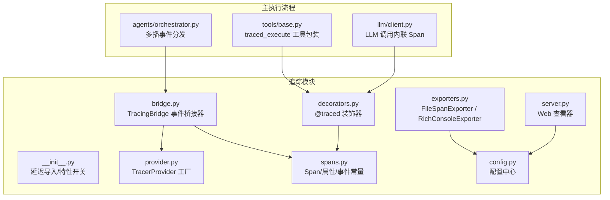
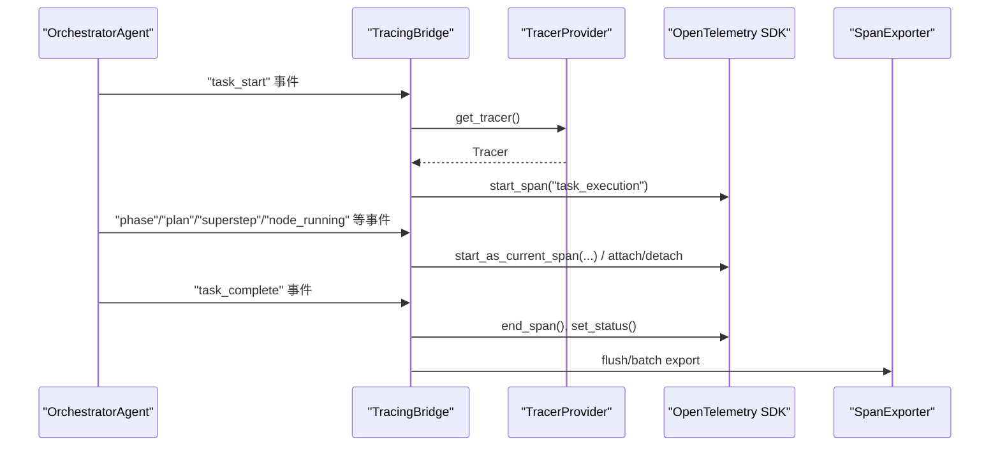
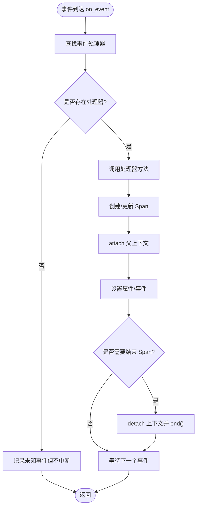
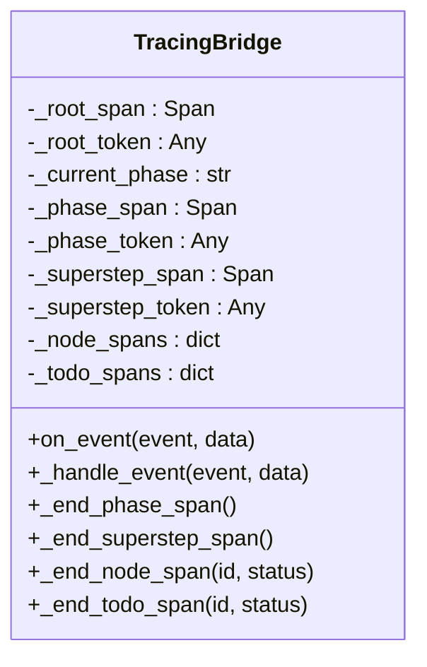
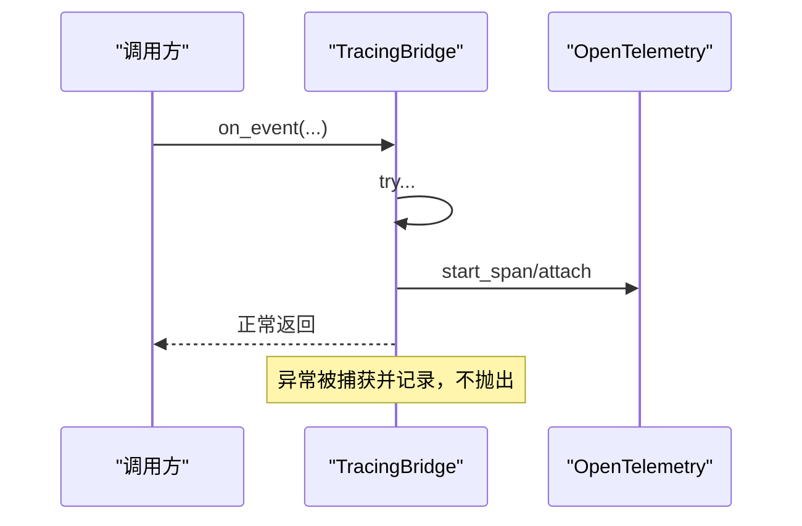
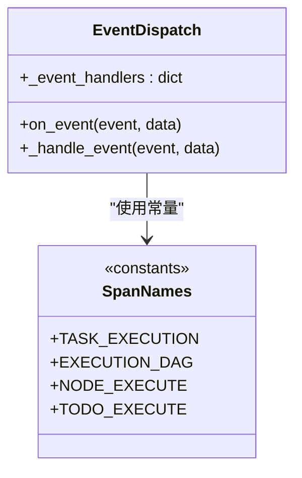
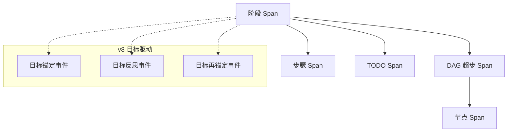
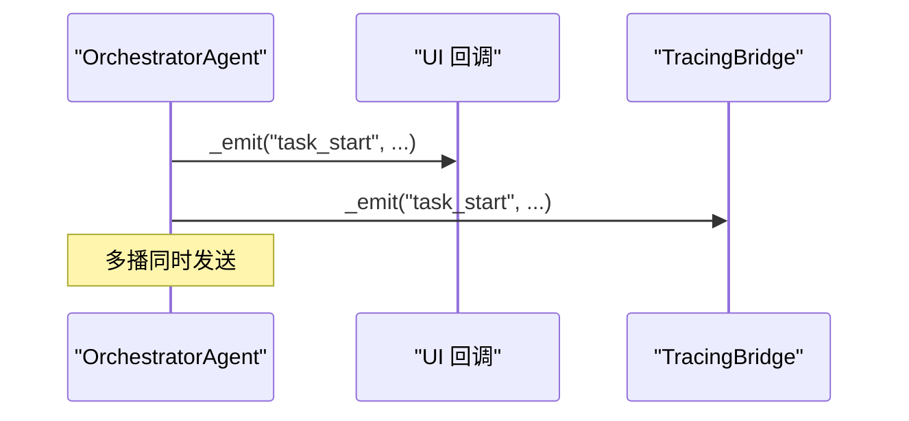
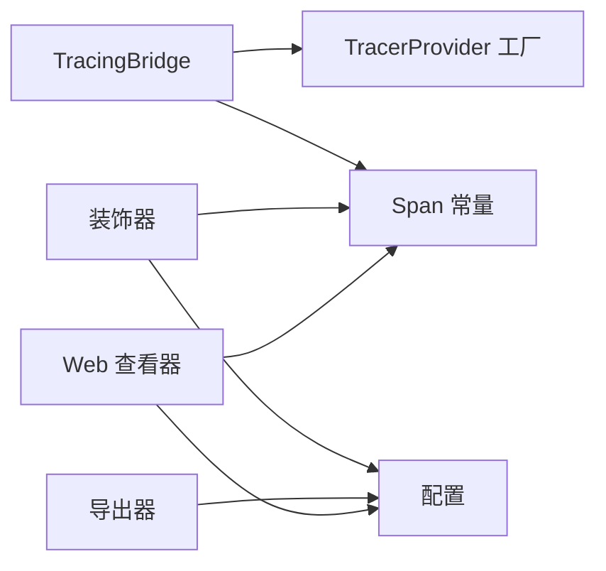

# 追踪架构设计

<cite>
**本文引用的文件**
- [tracing/__init__.py](file://tracing/__init__.py)
- [tracing/bridge.py](file://tracing/bridge.py)
- [tracing/spans.py](file://tracing/spans.py)
- [tracing/provider.py](file://tracing/provider.py)
- [tracing/decorators.py](file://tracing/decorators.py)
- [tracing/exporters.py](file://tracing/exporters.py)
- [tracing/config.py](file://tracing/config.py)
- [tracing/server.py](file://tracing/server.py)
- [agents/orchestrator.py](file://agents/orchestrator.py)
- [tools/base.py](file://tools/base.py)
- [llm/client.py](file://llm/client.py)
- [tests/test_tracing.py](file://tests/test_tracing.py)
</cite>

## 目录
1. [引言](#引言)
2. [项目结构](#项目结构)
3. [核心组件](#核心组件)
4. [架构总览](#架构总览)
5. [详细组件分析](#详细组件分析)
6. [依赖分析](#依赖分析)
7. [性能考量](#性能考量)
8. [故障排查指南](#故障排查指南)
9. [结论](#结论)
10. [附录](#附录)

## 引言
本文件面向 TracingBridge 的架构设计，系统阐述事件到 Span 的映射机制、父子关系管理策略、Span 栈维护与上下文传递原理、异常安全与并发支持（asyncio-safe）、事件分发表的设计与可扩展性、不同执行模式（简单路径、DAG、涌现模式）下的追踪策略差异，并提供与主执行流程解耦的架构图与代码示例路径，最后总结性能优化与最佳实践。

## 项目结构
追踪模块围绕 OpenTelemetry SDK 构建，采用“事件驱动 + 桥接器”的方式，将现有事件系统无缝接入 OTel 生态。核心文件包括：
- 桥接器：负责订阅事件并创建/管理 Span，维护 Span 栈与上下文
- Provider：集中初始化 TracerProvider、资源、采样与导出器
- 常量与模板：统一 Span 名称、属性键、事件名与图标
- 装饰器：方法级声明式埋点，支持同步/异步与敏感数据保护
- 导出器：文件与 Rich 控制台导出器
- Web 查看器：基于 FastAPI 的 Trace 可视化服务
- 集成点：OrchestratorAgent 通过多播将事件同时发送给 UI 回调与 TracingBridge；工具与 LLM 客户端内联注入 Span

**图表来源**
- [tracing/__init__.py:29-57](file://tracing/__init__.py#L29-L57)
- [tracing/bridge.py:38-114](file://tracing/bridge.py#L38-L114)
- [tracing/provider.py:45-118](file://tracing/provider.py#L45-L118)
- [tracing/spans.py:18-249](file://tracing/spans.py#L18-L249)
- [tracing/decorators.py:70-146](file://tracing/decorators.py#L70-L146)
- [tracing/exporters.py:28-304](file://tracing/exporters.py#L28-L304)
- [tracing/config.py:17-79](file://tracing/config.py#L17-L79)
- [tracing/server.py:29-50](file://tracing/server.py#L29-L50)
- [agents/orchestrator.py:94-114](file://agents/orchestrator.py#L94-L114)
- [tools/base.py:60-146](file://tools/base.py#L60-L146)
- [llm/client.py:88-118](file://llm/client.py#L88-L118)

**章节来源**
- [tracing/__init__.py:29-67](file://tracing/__init__.py#L29-L67)
- [tracing/bridge.py:38-114](file://tracing/bridge.py#L38-L114)
- [tracing/provider.py:45-118](file://tracing/provider.py#L45-L118)
- [tracing/spans.py:18-249](file://tracing/spans.py#L18-L249)
- [tracing/decorators.py:70-146](file://tracing/decorators.py#L70-L146)
- [tracing/exporters.py:28-304](file://tracing/exporters.py#L28-L304)
- [tracing/config.py:17-79](file://tracing/config.py#L17-L79)
- [tracing/server.py:29-50](file://tracing/server.py#L29-L50)
- [agents/orchestrator.py:94-114](file://agents/orchestrator.py#L94-L114)
- [tools/base.py:60-146](file://tools/base.py#L60-L146)
- [llm/client.py:88-118](file://llm/client.py#L88-L118)

## 核心组件
- TracingBridge：事件到 Span 的桥接器，维护根 Span、阶段 Span、超步 Span、节点/步骤/TODO Span 等栈，负责异常安全与上下文传递
- Provider：集中初始化 TracerProvider、资源、采样策略与导出器（支持批处理/简单处理器）
- Span 常量：统一的 Span 名称、属性键、事件名与图标映射
- 装饰器：@traced 支持同步/异步方法埋点，内置截断与敏感数据保护
- 导出器：文件导出（JSON）与 Rich 控制台树形渲染
- Web 查看器：扫描 traces 目录，构建树形结构并可视化
- 集成点：OrchestratorAgent 多播事件；工具与 LLM 客户端内联 Span

**章节来源**
- [tracing/bridge.py:38-114](file://tracing/bridge.py#L38-L114)
- [tracing/provider.py:45-118](file://tracing/provider.py#L45-L118)
- [tracing/spans.py:18-249](file://tracing/spans.py#L18-L249)
- [tracing/decorators.py:70-146](file://tracing/decorators.py#L70-L146)
- [tracing/exporters.py:28-304](file://tracing/exporters.py#L28-L304)
- [tracing/server.py:65-206](file://tracing/server.py#L65-L206)
- [agents/orchestrator.py:94-114](file://agents/orchestrator.py#L94-L114)
- [tools/base.py:60-146](file://tools/base.py#L60-L146)
- [llm/client.py:88-118](file://llm/client.py#L88-L118)

## 架构总览
TracingBridge 通过事件分发表将事件映射到处理方法，动态创建/结束 Span，并通过 OpenTelemetry 上下文（contextvars）进行父子关系与上下文传递。Provider 负责资源与导出策略配置，导出器与 Web 查看器提供离线与在线可视化能力。主执行流程通过多播将事件同时送达 UI 回调与 TracingBridge，实现完全解耦。

**图表来源**
- [agents/orchestrator.py:173-200](file://agents/orchestrator.py#L173-L200)
- [tracing/bridge.py:115-141](file://tracing/bridge.py#L115-L141)
- [tracing/provider.py:121-136](file://tracing/provider.py#L121-L136)
- [tracing/exporters.py:46-88](file://tracing/exporters.py#L46-L88)

**章节来源**
- [agents/orchestrator.py:173-200](file://agents/orchestrator.py#L173-L200)
- [tracing/bridge.py:115-141](file://tracing/bridge.py#L115-L141)
- [tracing/provider.py:121-136](file://tracing/provider.py#L121-L136)
- [tracing/exporters.py:46-88](file://tracing/exporters.py#L46-L88)

## 详细组件分析

### 事件到 Span 的映射与父子关系
- 事件分发表：TracingBridge 内部维护事件名到处理方法的映射表，确保扩展性与可维护性
- 父子关系：通过 OTel 上下文传递与 attach/detach 管理，确保子 Span 的父上下文正确
- 阶段与执行模式：阶段 Span 作为根级子树，DAG 模式下超步 Span 作为 DAG 子树根，节点/步骤/TODO 作为叶级节点

**图表来源**
- [tracing/bridge.py:115-141](file://tracing/bridge.py#L115-L141)
- [tracing/bridge.py:147-194](file://tracing/bridge.py#L147-L194)
- [tracing/bridge.py:200-250](file://tracing/bridge.py#L200-L250)
- [tracing/bridge.py:423-465](file://tracing/bridge.py#L423-L465)
- [tracing/bridge.py:466-533](file://tracing/bridge.py#L466-L533)

**章节来源**
- [tracing/bridge.py:85-114](file://tracing/bridge.py#L85-L114)
- [tracing/bridge.py:115-141](file://tracing/bridge.py#L115-L141)
- [tracing/bridge.py:147-194](file://tracing/bridge.py#L147-L194)
- [tracing/bridge.py:200-250](file://tracing/bridge.py#L200-L250)
- [tracing/bridge.py:423-465](file://tracing/bridge.py#L423-L465)
- [tracing/bridge.py:466-533](file://tracing/bridge.py#L466-L533)

### Span 栈维护与上下文传递
- 栈结构：根 Span、阶段 Span、超步 Span、节点/步骤/TODO Span 各自独立维护，互不干扰
- 上下文传递：使用 OTel context.attach/attach_span_in_context/detach，确保并发安全
- 生命周期：每个层级在进入新阶段或新超步时结束上一个活跃 Span，保证树形结构清晰

**图表来源**
- [tracing/bridge.py:54-82](file://tracing/bridge.py#L54-L82)
- [tracing/bridge.py:234-250](file://tracing/bridge.py#L234-L250)
- [tracing/bridge.py:452-465](file://tracing/bridge.py#L452-L465)
- [tracing/bridge.py:526-533](file://tracing/bridge.py#L526-L533)
- [tracing/bridge.py:410-417](file://tracing/bridge.py#L410-L417)

**章节来源**
- [tracing/bridge.py:54-82](file://tracing/bridge.py#L54-L82)
- [tracing/bridge.py:234-250](file://tracing/bridge.py#L234-L250)
- [tracing/bridge.py:452-465](file://tracing/bridge.py#L452-L465)
- [tracing/bridge.py:526-533](file://tracing/bridge.py#L526-L533)
- [tracing/bridge.py:410-417](file://tracing/bridge.py#L410-L417)

### 异常安全设计与并发支持（asyncio-safe）
- 异常安全：on_event 对内部处理进行 try/except 包裹，捕获错误仅记录，不向调用方传播
- 并发安全：通过 OTel contextvars 与 attach/detach 管理当前 Span 上下文，确保多协程隔离
- 装饰器：@traced 支持同步/异步，自动记录异常与延迟

**图表来源**
- [tracing/bridge.py:115-132](file://tracing/bridge.py#L115-L132)
- [tracing/decorators.py:92-143](file://tracing/decorators.py#L92-L143)

**章节来源**
- [tracing/bridge.py:115-132](file://tracing/bridge.py#L115-L132)
- [tracing/decorators.py:92-143](file://tracing/decorators.py#L92-L143)

### 事件分发表的设计与可扩展性
- 设计：事件名到处理方法的字典映射，新增事件只需扩展映射表与对应处理方法
- 可扩展性：通过常量模块统一管理事件名与属性键，避免硬编码；导出器与 Web 查看器基于 OTel 规范，易于替换

**图表来源**
- [tracing/bridge.py:85-114](file://tracing/bridge.py#L85-L114)
- [tracing/spans.py:18-81](file://tracing/spans.py#L18-L81)

**章节来源**
- [tracing/bridge.py:85-114](file://tracing/bridge.py#L85-L114)
- [tracing/spans.py:18-81](file://tracing/spans.py#L18-L81)

### 不同执行模式下的追踪策略差异
- 简单路径：以步骤为单位创建 Span，父子关系为阶段 → 步骤
- DAG：以超步为单位创建超步 Span，节点为叶级 Span，父子关系为阶段 → 超步 → 节点
- 涌现模式：以 TODO 为单位创建 Span，父子关系为阶段 → TODO
- v8 目标驱动：在阶段内记录目标锚定、反思与再锚定事件，作为阶段事件

**图表来源**
- [tracing/bridge.py:298-321](file://tracing/bridge.py#L298-L321)
- [tracing/bridge.py:423-465](file://tracing/bridge.py#L423-L465)
- [tracing/bridge.py:466-533](file://tracing/bridge.py#L466-L533)
- [tracing/bridge.py:707-720](file://tracing/bridge.py#L707-L720)

**章节来源**
- [tracing/bridge.py:298-321](file://tracing/bridge.py#L298-L321)
- [tracing/bridge.py:423-465](file://tracing/bridge.py#L423-L465)
- [tracing/bridge.py:466-533](file://tracing/bridge.py#L466-L533)
- [tracing/bridge.py:707-720](file://tracing/bridge.py#L707-L720)

### 与主执行流程解耦的集成点
- OrchestratorAgent 通过多播将事件同时发送给 UI 回调与 TracingBridge，无需修改业务逻辑
- 工具与 LLM 客户端在启用追踪时内联创建 Span，禁用时直接透传，零开销

**图表来源**
- [agents/orchestrator.py:106-114](file://agents/orchestrator.py#L106-L114)
- [agents/orchestrator.py:173-200](file://agents/orchestrator.py#L173-L200)

**章节来源**
- [agents/orchestrator.py:106-114](file://agents/orchestrator.py#L106-L114)
- [agents/orchestrator.py:173-200](file://agents/orchestrator.py#L173-L200)

## 依赖分析
- 模块耦合：TracingBridge 依赖 Provider 与 Span 常量；装饰器与导出器依赖配置；Web 查看器依赖 Span 常量与 traces 目录
- 外部依赖：OpenTelemetry SDK、FastAPI、Rich（可选）

**图表来源**
- [tracing/bridge.py:38-114](file://tracing/bridge.py#L38-L114)
- [tracing/provider.py:45-118](file://tracing/provider.py#L45-L118)
- [tracing/spans.py:18-249](file://tracing/spans.py#L18-L249)
- [tracing/decorators.py:70-146](file://tracing/decorators.py#L70-L146)
- [tracing/exporters.py:28-304](file://tracing/exporters.py#L28-L304)
- [tracing/server.py:65-206](file://tracing/server.py#L65-L206)
- [tracing/config.py:17-79](file://tracing/config.py#L17-L79)

**章节来源**
- [tracing/bridge.py:38-114](file://tracing/bridge.py#L38-L114)
- [tracing/provider.py:45-118](file://tracing/provider.py#L45-L118)
- [tracing/spans.py:18-249](file://tracing/spans.py#L18-L249)
- [tracing/decorators.py:70-146](file://tracing/decorators.py#L70-L146)
- [tracing/exporters.py:28-304](file://tracing/exporters.py#L28-L304)
- [tracing/server.py:65-206](file://tracing/server.py#L65-L206)
- [tracing/config.py:17-79](file://tracing/config.py#L17-L79)

## 性能考量
- 零开销：当 TRACING_ENABLED=false 时，__init__.py 提供 no-op 实现，导入即无成本
- 批量导出：Provider 默认使用 BatchSpanProcessor，降低 I/O 压力
- 属性截断与敏感数据保护：减少超长属性与敏感信息带来的存储与传输成本
- 上下文隔离：通过 contextvars 管理，避免锁竞争，提升并发性能

[本节为通用指导，无需列出具体文件来源]

## 故障排查指南
- 事件未产生 Span：确认事件名是否在分发表中注册；检查 on_event 是否被调用
- 父子关系异常：检查 attach/detach 是否成对出现；确认阶段/超步切换逻辑
- 导出失败：检查导出器配置与权限；查看日志输出
- Web 查看器无法显示：确认 traces 目录存在且 JSON 文件格式正确

**章节来源**
- [tests/test_tracing.py:264-281](file://tests/test_tracing.py#L264-L281)
- [tracing/exporters.py:86-88](file://tracing/exporters.py#L86-L88)
- [tracing/server.py:124-149](file://tracing/server.py#L124-L149)

## 结论
TracingBridge 通过事件驱动与桥接器模式，将复杂的主执行流程与 OTel 追踪解耦，实现了对简单路径、DAG 与涌现模式的统一追踪支持。其异常安全与并发安全设计确保了生产可用性，而零开销与批量导出策略兼顾了性能与可观测性。

## 附录
- 代码示例路径（不展示具体代码内容）：
  - 事件到 Span 映射：[tracing/bridge.py:85-114](file://tracing/bridge.py#L85-L114)
  - 阶段到 Span 名称映射：[tracing/bridge.py:252-292](file://tracing/bridge.py#L252-L292)
  - DAG 超步与节点生命周期：[tracing/bridge.py:423-533](file://tracing/bridge.py#L423-L533)
  - 工具执行追踪：[tools/base.py:60-146](file://tools/base.py#L60-L146)
  - LLM 调用内联追踪：[llm/client.py:88-118](file://llm/client.py#L88-L118)
  - @traced 装饰器：[tracing/decorators.py:70-146](file://tracing/decorators.py#L70-L146)
  - Provider 初始化与导出器选择：[tracing/provider.py:45-118](file://tracing/provider.py#L45-L118)
  - 文件导出器 JSON 结构：[tracing/exporters.py:98-156](file://tracing/exporters.py#L98-L156)
  - Web 查看器树形渲染：[tracing/server.py:151-206](file://tracing/server.py#L151-L206)
  - 特性开关与零开销：[tracing/__init__.py:29-57](file://tracing/__init__.py#L29-L57)