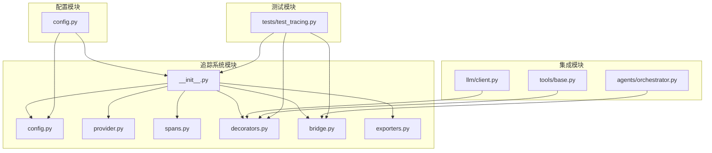
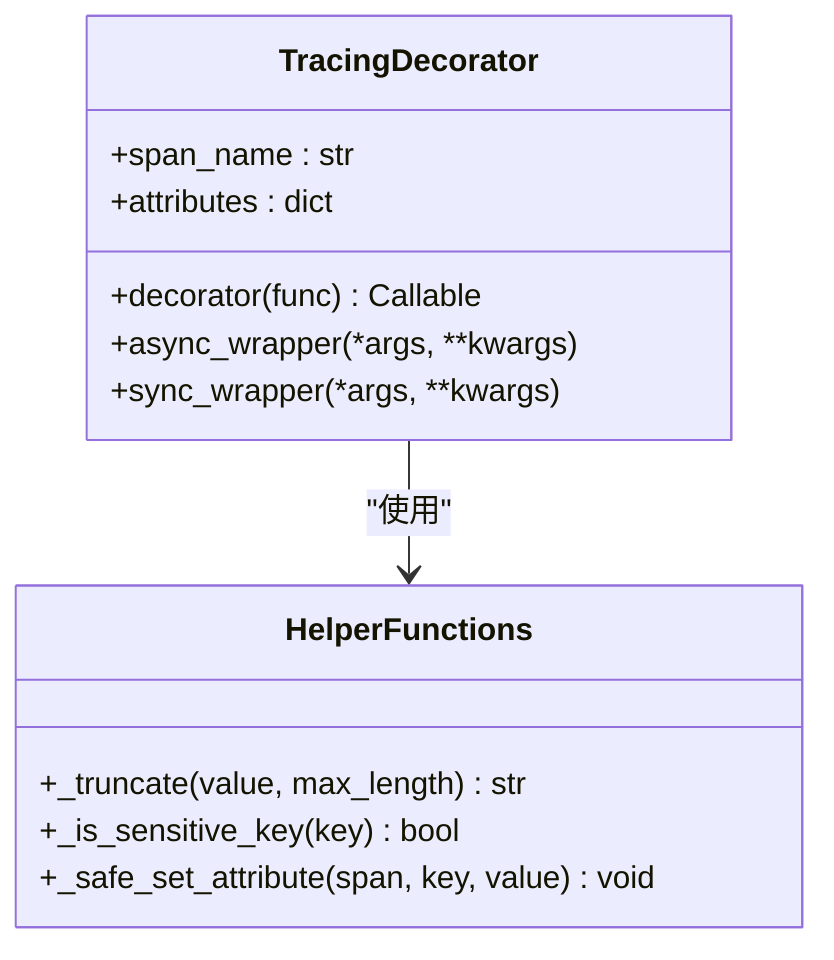
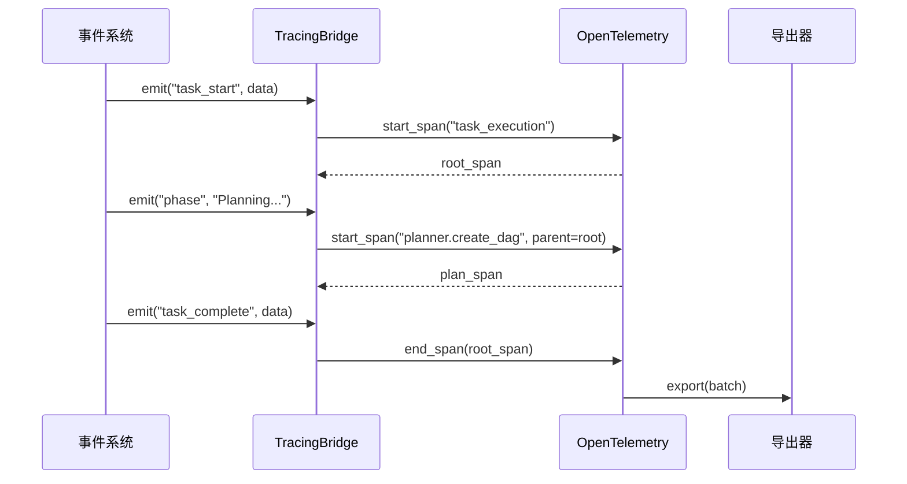
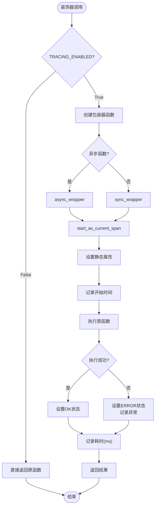
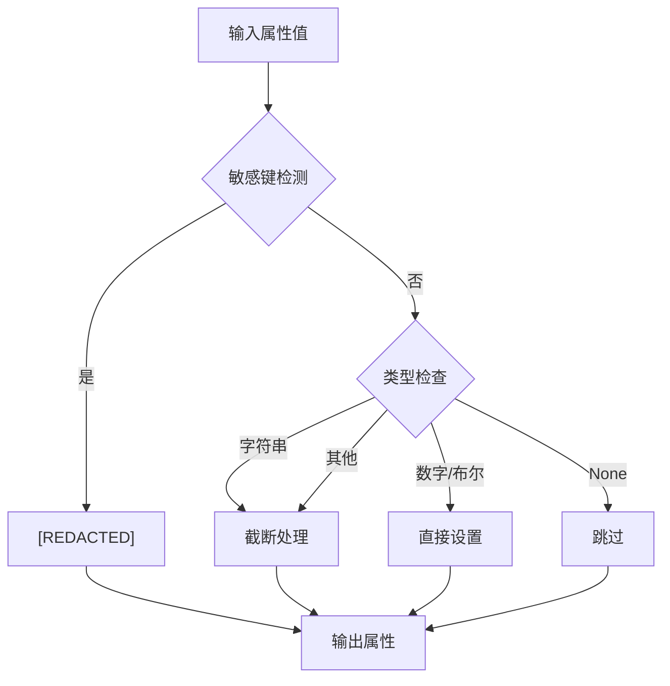
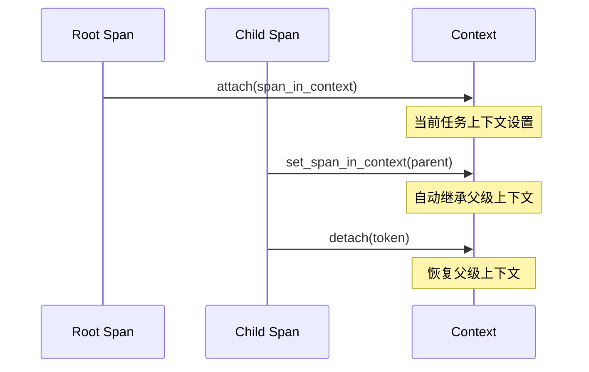
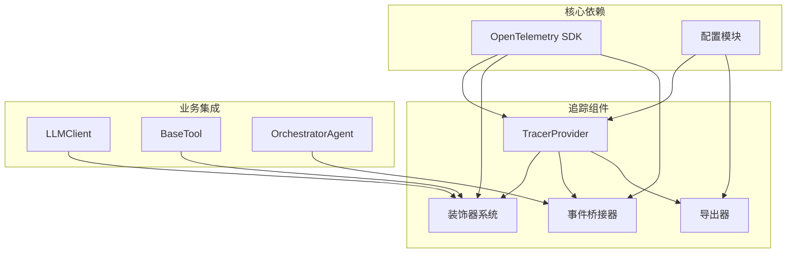
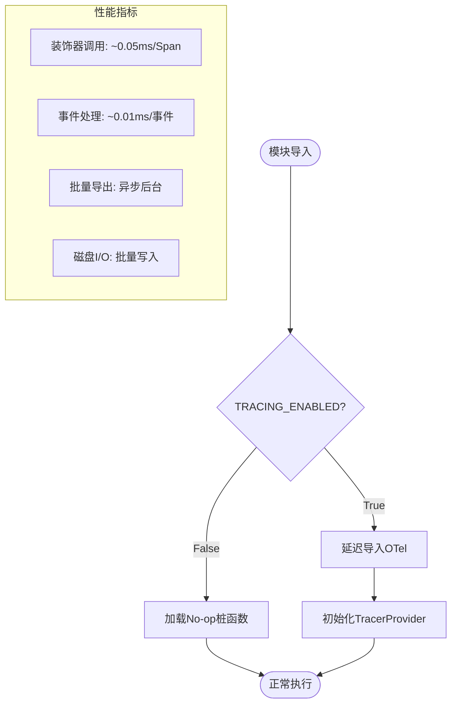

# 追踪装饰器系统

<cite>
**本文档引用的文件**
- [tracing/decorators.py](file://tracing/decorators.py)
- [tracing/__init__.py](file://tracing/__init__.py)
- [tracing/config.py](file://tracing/config.py)
- [tracing/provider.py](file://tracing/provider.py)
- [tracing/spans.py](file://tracing/spans.py)
- [tracing/bridge.py](file://tracing/bridge.py)
- [tracing/exporters.py](file://tracing/exporters.py)
- [config.py](file://config.py)
- [tests/test_tracing.py](file://tests/test_tracing.py)
- [sxw_aicoding/docs/tracing-design.md](file://sxw_aicoding/docs/tracing-design.md)
- [sxw_aicoding/docs/tracing-guide.md](file://sxw_aicoding/docs/tracing-guide.md)
- [llm/client.py](file://llm/client.py)
- [tools/base.py](file://tools/base.py)
</cite>

## 目录
1. [简介](#简介)
2. [项目结构](#项目结构)
3. [核心组件](#核心组件)
4. [架构概览](#架构概览)
5. [详细组件分析](#详细组件分析)
6. [依赖分析](#依赖分析)
7. [性能考虑](#性能考虑)
8. [故障排除指南](#故障排除指南)
9. [结论](#结论)
10. [附录](#附录)

## 简介

追踪装饰器系统是基于 OpenTelemetry 标准构建的全链路可观察性解决方案，专为 Manus Demo 多智能体系统设计。该系统提供了声明式的装饰器追踪、事件桥接、内联埋点等多种追踪方式，实现了从任务生命周期到具体方法调用的全方位监控。

系统的核心特点包括：
- **零开销设计**：通过 Feature Flag 控制，关闭时完全不引入性能损耗
- **多通道架构**：事件桥接 + 装饰器 + 内联埋点的互补追踪体系
- **隐私保护**：默认不记录敏感信息，支持属性截断和脱敏
- **灵活导出**：支持控制台、文件、Rich、OTLP、Phoenix 多种后端
- **语义标准化**：遵循 OpenTelemetry GenAI 语义规范

## 项目结构

追踪系统位于 `tracing/` 目录下，采用模块化设计：



**图表来源**
- [tracing/__init__.py:1-67](file://tracing/__init__.py#L1-L67)
- [tracing/config.py:1-79](file://tracing/config.py#L1-L79)
- [tracing/provider.py:1-197](file://tracing/provider.py#L1-L197)

**章节来源**
- [tracing/__init__.py:1-67](file://tracing/__init__.py#L1-L67)
- [tracing/config.py:1-79](file://tracing/config.py#L1-L79)

## 核心组件

### 装饰器系统 (@traced)

装饰器系统是追踪系统的核心组件，提供了声明式的函数追踪能力：



**图表来源**
- [tracing/decorators.py:70-146](file://tracing/decorators.py#L70-L146)

装饰器的主要功能：
- **自动 Span 创建**：支持同步和异步函数的自动追踪
- **属性安全设置**：自动处理敏感数据保护和属性截断
- **异常处理**：自动记录异常信息和错误状态
- **性能监控**：自动记录执行耗时（latency_ms）

### 事件桥接器 (TracingBridge)

事件桥接器负责将现有的事件系统转换为 OpenTelemetry Span：



**图表来源**
- [tracing/bridge.py:117-196](file://tracing/bridge.py#L117-L196)
- [tracing/provider.py:45-118](file://tracing/provider.py#L45-L118)

### 配置管理系统

配置系统提供了集中化的追踪配置管理：

| 配置项 | 类型 | 默认值 | 说明 |
|--------|------|--------|------|
| TRACING_ENABLED | bool | false | 总开关，关闭时零开销 |
| TRACING_BACKEND | str | "console" | 导出后端选择 |
| TRACING_SAMPLE_RATE | float | 1.0 | 采样率 (0.0-1.0) |
| TRACING_MAX_ATTRIBUTE_LENGTH | int | 1000 | 属性值最大长度 |
| TRACING_LOG_PROMPTS | bool | false | 是否记录完整提示词 |

**章节来源**
- [tracing/config.py:14-79](file://tracing/config.py#L14-L79)
- [config.py:102-109](file://config.py#L102-L109)

## 架构概览

追踪系统采用双通道架构，结合事件桥接和装饰器追踪：

```mermaid
graph TB
subgraph "应用层"
OA[OrchestratorAgent]
PA[PlannerAgent]
EA[ExecutorAgent]
RA[ReflectorAgent]
LC[LLMClient]
BT[BaseTool]
end
subgraph "事件层"
EMIT["_emit(event, data)"]
end
subgraph "追踪层"
TB[TracingBridge]
DEC[@traced装饰器]
TP[TracerProvider]
SPANS[语义常量]
end
subgraph "导出层"
BSP[BatchSpanProcessor]
CE[ConsoleExporter]
FE[FileSpanExporter]
RE[RichConsoleExporter]
OE[OTLPExporter]
end
OA --> |emit| EMIT
PA --> |emit| EMIT
EA --> |emit| EMIT
LC -.->|内联埋点| DEC
BT -.->|traced_execute| DEC
EMIT --> |事件桥接| TB
DEC --> TP
TB --> TP
TP --> BSP
BSP --> CE
BSP --> FE
BSP --> RE
BSP --> OE
```

**图表来源**
- [sxw_aicoding/docs/tracing-design.md:56-115](file://sxw_aicoding/docs/tracing-design.md#L56-L115)
- [tracing/bridge.py:38-116](file://tracing/bridge.py#L38-L116)

## 详细组件分析

### 装饰器系统深度分析

#### @traced 装饰器实现

装饰器系统提供了强大的方法级追踪能力：



**图表来源**
- [tracing/decorators.py:88-146](file://tracing/decorators.py#L88-L146)

#### 属性安全处理机制

系统实现了多层次的属性安全保护：



**图表来源**
- [tracing/decorators.py:30-68](file://tracing/decorators.py#L30-L68)

#### 内联埋点集成

系统还提供了针对特定组件的内联埋点：

**LLMClient 内联埋点**：
- `_start_llm_span()`：在 LLM 调用前创建 Span
- `_end_llm_span()`：在 LLM 调用后结束 Span
- 自动记录模型、温度、Token 使用量等属性

**BaseTool 内联埋点**：
- `traced_execute()`：工具执行的追踪入口
- 自动记录工具名称、参数、结果等信息

**章节来源**
- [tracing/decorators.py:70-146](file://tracing/decorators.py#L70-L146)
- [llm/client.py:317-420](file://llm/client.py#L317-L420)
- [tools/base.py:60-175](file://tools/base.py#L60-L175)

### 事件桥接器详细分析

#### 事件映射机制

事件桥接器实现了事件到 Span 的精确映射：

| 事件类型 | 目标 Span 名称 | 触发条件 |
|----------|----------------|----------|
| task_start | task_execution | 任务开始 |
| phase | orchestrator.gather_context | 上下文收集阶段 |
| phase | planner.classify_task | 任务分类阶段 |
| phase | planner.create_dag | DAG 规划阶段 |
| phase | execution.dag | DAG 执行阶段 |
| node_running | node.execute.{id} | 节点开始执行 |
| node_completed | 结束节点 Span | 节点执行完成 |
| reflection | 反思结果事件 | 反思完成 |

#### 上下文管理

桥接器通过 OpenTelemetry 的上下文传播机制维护正确的父子关系：



**图表来源**
- [tracing/bridge.py:154-196](file://tracing/bridge.py#L154-L196)

**章节来源**
- [tracing/bridge.py:84-116](file://tracing/bridge.py#L84-L116)
- [tracing/bridge.py:149-196](file://tracing/bridge.py#L149-L196)

### 导出器系统分析

#### 多后端支持

系统支持多种导出后端，满足不同场景需求：

**FileSpanExporter**：
- 将 Trace 保存为 JSON 文件
- 每个 Trace 一个文件，文件名为 `{trace_id}.json`
- 支持批量导出的文件合并

**RichConsoleExporter**：
- 实时渲染 Span 树到终端
- 使用 Rich 库提供彩色图标显示
- 适合开发调试场景

**OTLPExporter**：
- 标准 OTLP 协议导出
- 支持 Jaeger、Grafana、Phoenix 等后端
- 生产环境推荐使用

**章节来源**
- [tracing/exporters.py:28-304](file://tracing/exporters.py#L28-L304)
- [tracing/provider.py:154-197](file://tracing/provider.py#L154-L197)

## 依赖分析

### 组件耦合关系

追踪系统采用了松耦合的设计原则：



**图表来源**
- [tracing/provider.py:23-33](file://tracing/provider.py#L23-L33)
- [tracing/__init__.py:29-32](file://tracing/__init__.py#L29-L32)

### 外部依赖管理

系统通过延迟导入机制避免不必要的依赖：

| 依赖包 | 用途 | 导入时机 |
|--------|------|----------|
| opentelemetry-api | OpenTelemetry API | 按需导入 |
| opentelemetry-sdk | OpenTelemetry SDK | 按需导入 |
| opentelemetry-exporter-otlp | OTLP 导出器 | 按需导入 |
| rich | Rich 控制台渲染 | 按需导入 |

**章节来源**
- [tracing/__init__.py:27-57](file://tracing/__init__.py#L27-L57)

## 性能考虑

### 零开销设计

系统实现了真正的零开销追踪：



**图表来源**
- [tracing/__init__.py:36-57](file://tracing/__init__.py#L36-L57)

### 采样策略

系统支持基于 TraceId 的采样策略：

- **采样率配置**：0.0-1.0 范围内的任意值
- **一致性保证**：被采样的 Trace 包含完整的 Span 树
- **生产环境建议**：0.1-0.3 的采样率平衡性能和覆盖率

### 内存管理

系统通过批处理器控制内存使用：

- **队列大小**：最大 2048 个 Span
- **批量大小**：最大 256 个 Span
- **导出间隔**：5000ms
- **优雅关闭**：自动刷新待导出的 Span

**章节来源**
- [tracing/provider.py:57-105](file://tracing/provider.py#L57-L105)
- [sxw_aicoding/docs/tracing-guide.md:661-694](file://sxw_aicoding/docs/tracing-guide.md#L661-L694)

## 故障排除指南

### 常见问题诊断

#### 追踪数据缺失

**症状**：期望的 Span 没有出现

**排查步骤**：
1. 检查 `TRACING_ENABLED` 配置
2. 验证装饰器是否正确应用
3. 确认事件桥接器是否正常工作
4. 检查导出器配置

#### 性能问题

**症状**：系统运行缓慢

**排查步骤**：
1. 检查采样率设置
2. 验证导出器后端性能
3. 监控批量处理器队列
4. 检查磁盘空间和权限

#### 敏感信息泄露

**症状**：日志中出现敏感数据

**排查步骤**：
1. 检查 `_is_sensitive_key()` 检测规则
2. 验证属性截断配置
3. 确认 `TRACING_LOG_PROMPTS` 设置
4. 检查自定义参数清理逻辑

### 调试技巧

#### 开发环境调试

使用 Rich 控制台导出器进行实时调试：

```bash
TRACING_ENABLED=true TRACING_BACKEND=rich python main.py
```

#### 离线分析

使用 File 导出器进行离线分析：

```bash
TRACING_ENABLED=true TRACING_BACKEND=file python main.py
```

#### Web 查看器

启动内置 Web 查看器：

```bash
python -m tracing
```

**章节来源**
- [tests/test_tracing.py:35-72](file://tests/test_tracing.py#L35-L72)
- [sxw_aicoding/docs/tracing-guide.md:149-184](file://sxw_aicoding/docs/tracing-guide.md#L149-L184)

## 结论

追踪装饰器系统为 Manus Demo 提供了全面、灵活且高性能的可观察性解决方案。系统通过零开销设计、多通道架构和严格的隐私保护，在不影响系统性能的前提下提供了丰富的监控能力。

关键优势：
- **零侵入集成**：通过事件桥接和装饰器实现无缝集成
- **高性能**：零开销设计确保生产环境的稳定性
- **隐私保护**：多层次的安全保护机制
- **灵活配置**：支持多种导出后端和配置选项
- **标准化**：遵循 OpenTelemetry 标准，便于生态系统集成

该系统为复杂的多智能体系统提供了可靠的运行时监控基础，支持从开发调试到生产监控的全生命周期需求。

## 附录

### 最佳实践

#### 装饰器使用建议

1. **合理使用装饰器**：仅对关键业务方法使用 `@traced`
2. **自定义属性**：使用 `attributes` 参数传递必要的上下文信息
3. **异步函数**：确保异步函数正确处理异常和状态

#### 配置优化建议

1. **开发环境**：启用完整追踪，记录提示词
2. **生产环境**：启用采样，禁用提示词记录
3. **性能监控**：定期检查导出器性能和队列状态

#### 故障排除清单

- [ ] 检查 `TRACING_ENABLED` 配置
- [ ] 验证 OpenTelemetry 依赖安装
- [ ] 确认导出器后端可达
- [ ] 检查磁盘空间和权限
- [ ] 监控批量处理器状态