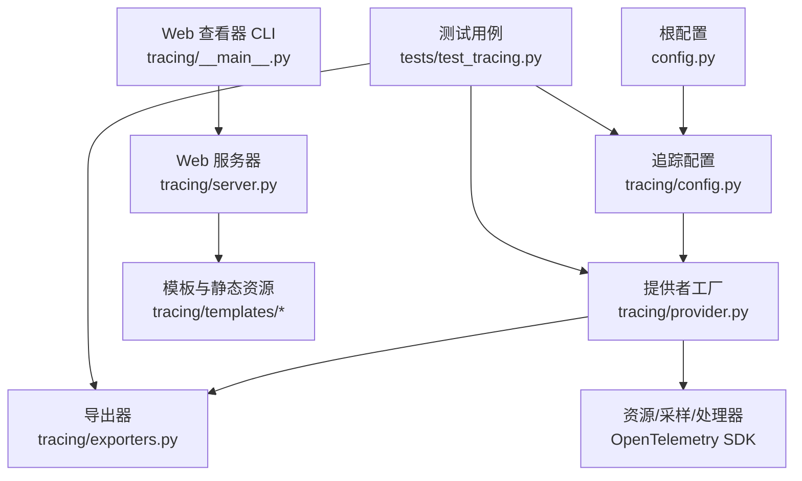
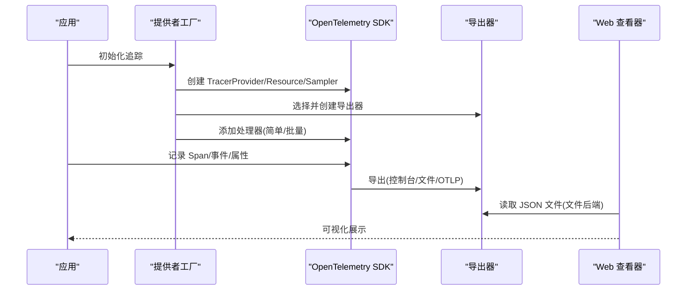
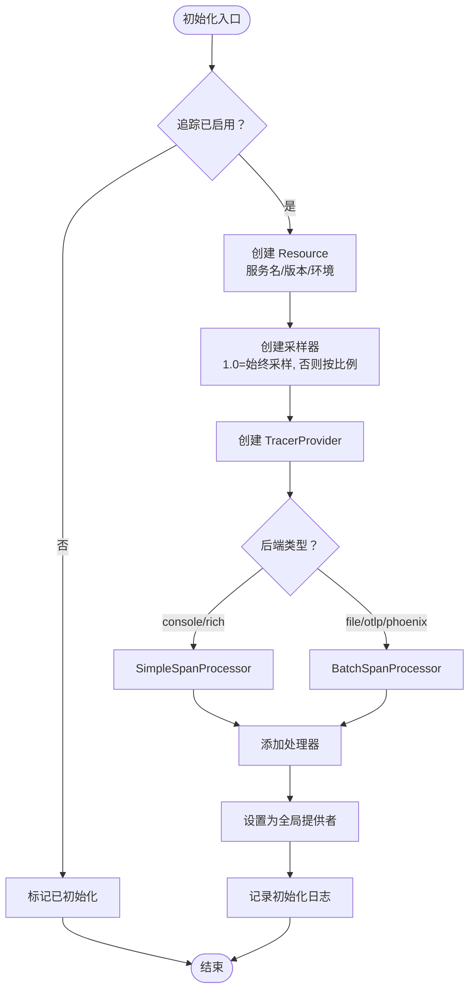
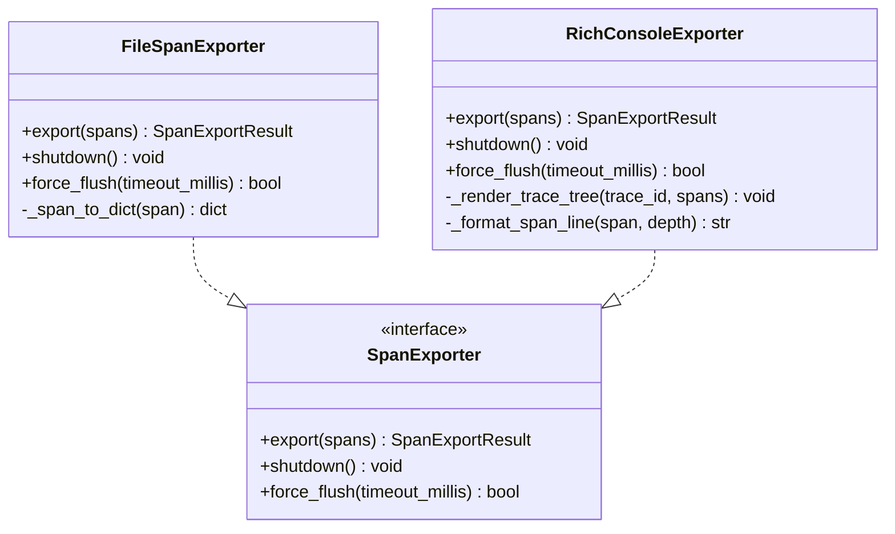
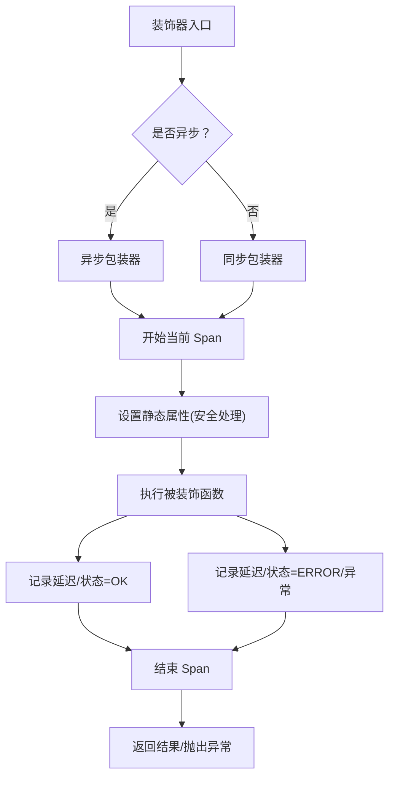
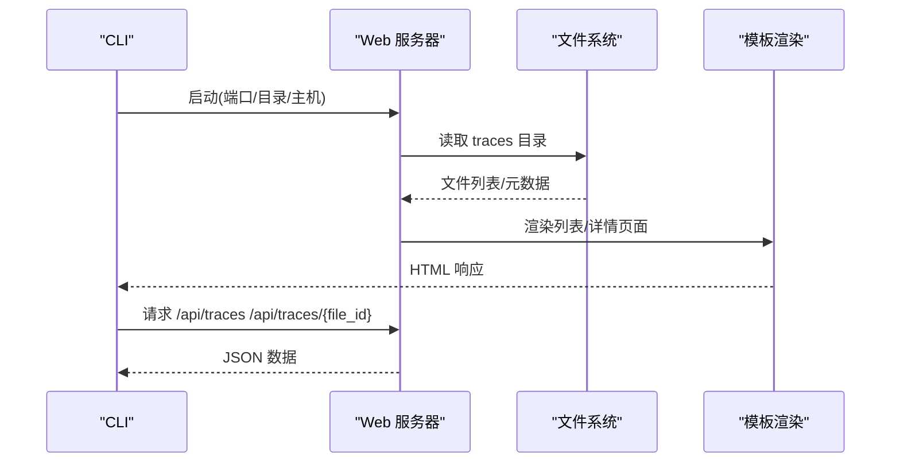
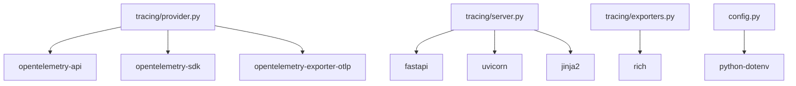

# 追踪配置管理

<cite>
**本文档引用的文件**
- [config.py](file://config.py)
- [tracing/config.py](file://tracing/config.py)
- [tracing/provider.py](file://tracing/provider.py)
- [tracing/exporters.py](file://tracing/exporters.py)
- [tracing/decorators.py](file://tracing/decorators.py)
- [tracing/spans.py](file://tracing/spans.py)
- [tracing/server.py](file://tracing/server.py)
- [tracing/__main__.py](file://tracing/__main__.py)
- [requirements.txt](file://requirements.txt)
- [tests/test_tracing.py](file://tests/test_tracing.py)
</cite>

## 目录
1. [简介](#简介)
2. [项目结构](#项目结构)
3. [核心组件](#核心组件)
4. [架构概览](#架构概览)
5. [详细组件分析](#详细组件分析)
6. [依赖分析](#依赖分析)
7. [性能考虑](#性能考虑)
8. [故障排除指南](#故障排除指南)
9. [结论](#结论)
10. [附录](#附录)

## 简介
本文件面向追踪系统的配置管理，围绕 OpenTelemetry 提供者初始化、采样策略与导出器配置、环境变量与配置文件优先级、不同部署环境的最佳实践、功能启停控制、配置示例与故障排除、追踪数据生命周期与清理策略，以及生产环境安全与性能调优进行系统化说明。内容基于仓库中 tracing 模块的实现与测试用例，确保与实际代码一致。

## 项目结构
追踪相关代码集中在 tracing 包内，配合根配置模块与测试用例共同构成完整的追踪体系：
- 根配置模块负责从环境变量与 .env 文件加载追踪相关参数
- tracing.provider 负责初始化 OpenTelemetry 提供者与处理器
- tracing.exporters 提供文件与 Rich 控制台导出器
- tracing.config 将根配置映射为追踪专用常量
- tracing.server 与 tracing/__main__.py 提供 Web 查看器
- tests/test_tracing.py 覆盖关键行为与边界条件

图表来源
- [config.py:102-109](file://config.py#L102-L109)
- [tracing/config.py:17-39](file://tracing/config.py#L17-L39)
- [tracing/provider.py:45-118](file://tracing/provider.py#L45-L118)
- [tracing/exporters.py:28-97](file://tracing/exporters.py#L28-L97)
- [tracing/server.py:29-38](file://tracing/server.py#L29-L38)
- [tracing/__main__.py:21-104](file://tracing/__main__.py#L21-L104)

章节来源
- [config.py:102-109](file://config.py#L102-L109)
- [tracing/config.py:17-39](file://tracing/config.py#L17-L39)
- [tracing/provider.py:45-118](file://tracing/provider.py#L45-L118)
- [tracing/exporters.py:28-97](file://tracing/exporters.py#L28-L97)
- [tracing/server.py:29-38](file://tracing/server.py#L29-L38)
- [tracing/__main__.py:21-104](file://tracing/__main__.py#L21-L104)

## 核心组件
- 根配置模块：从环境变量与 .env 文件加载追踪参数，并提供类型校验与默认值
- 追踪配置模块：将根配置映射为追踪专用常量，供其他模块直接导入
- 提供者工厂：初始化 TracerProvider、Resource、采样器与处理器，按后端选择导出器
- 自定义导出器：文件导出器与 Rich 控制台导出器，分别用于离线分析与开发调试
- 装饰器与常量：提供统一的装饰器与 Span/属性/事件常量，保障追踪语义一致性
- Web 查看器：基于 FastAPI 的可视化服务，支持树形浏览与属性/事件查看

章节来源
- [config.py:102-109](file://config.py#L102-L109)
- [tracing/config.py:17-39](file://tracing/config.py#L17-L39)
- [tracing/provider.py:45-118](file://tracing/provider.py#L45-L118)
- [tracing/exporters.py:28-97](file://tracing/exporters.py#L28-L97)
- [tracing/decorators.py:70-146](file://tracing/decorators.py#L70-L146)
- [tracing/spans.py:18-249](file://tracing/spans.py#L18-L249)
- [tracing/server.py:29-38](file://tracing/server.py#L29-L38)
- [tracing/__main__.py:21-104](file://tracing/__main__.py#L21-L104)

## 架构概览
追踪系统采用 OpenTelemetry SDK，通过提供者工厂集中初始化，结合后端导出器实现不同场景的数据输出。Web 查看器独立运行，读取文件导出器生成的 JSON 文件进行可视化。

图表来源
- [tracing/provider.py:45-118](file://tracing/provider.py#L45-L118)
- [tracing/exporters.py:28-97](file://tracing/exporters.py#L28-L97)
- [tracing/server.py:65-122](file://tracing/server.py#L65-L122)
- [tracing/__main__.py:87-104](file://tracing/__main__.py#L87-L104)

## 详细组件分析

### 提供者工厂（TracerProvider 工厂）
职责
- 配置 Resource（服务名、版本、环境）
- 基于采样率配置采样策略
- 根据后端选择导出器
- 为控制台/富文本后端使用简单处理器，为文件/OTLP 使用批量处理器
- 提供全局获取 Tracer 的便捷方法

初始化流程
- 幂等初始化：重复调用不会重复创建
- 功能开关：当追踪禁用时，跳过初始化
- 资源标识：包含服务名、版本与环境
- 采样策略：采样率为 1.0 时使用始终采样，否则使用按比例采样
- 导出器选择：控制台、文件、Rich、OTLP、Phoenix
- 处理器选择：控制台/Rich 使用简单处理器，文件/OTLP 使用批量处理器

图表来源
- [tracing/provider.py:45-118](file://tracing/provider.py#L45-L118)
- [tracing/provider.py:154-196](file://tracing/provider.py#L154-L196)

章节来源
- [tracing/provider.py:45-118](file://tracing/provider.py#L45-L118)
- [tracing/provider.py:154-196](file://tracing/provider.py#L154-L196)

### 自定义导出器（文件与 Rich 控制台）
文件导出器
- 将完成的 Span 写入 JSON 文件，按 trace_id 分割
- 支持合并同 trace_id 的多次导出
- 输出包含时间戳、持续时间、属性、事件与状态

Rich 控制台导出器
- 将完成的 Span 以 Rich 树形结构渲染到终端
- 支持按父 Span ID 重建树并排序
- 提供图标、耗时、状态与关键属性摘要

图表来源
- [tracing/exporters.py:28-97](file://tracing/exporters.py#L28-L97)
- [tracing/exporters.py:159-304](file://tracing/exporters.py#L159-L304)

章节来源
- [tracing/exporters.py:28-97](file://tracing/exporters.py#L28-L97)
- [tracing/exporters.py:159-304](file://tracing/exporters.py#L159-L304)

### 装饰器与属性常量
装饰器
- 支持同步与异步函数
- 自动设置状态码、异常记录与延迟属性
- 属性安全处理：截断与敏感键脱敏

属性常量
- Span 名称、属性键、事件名称与图标映射
- 遵循 OpenTelemetry GenAI 语义规范

图表来源
- [tracing/decorators.py:70-146](file://tracing/decorators.py#L70-L146)
- [tracing/decorators.py:30-68](file://tracing/decorators.py#L30-L68)

章节来源
- [tracing/decorators.py:70-146](file://tracing/decorators.py#L70-L146)
- [tracing/decorators.py:30-68](file://tracing/decorators.py#L30-L68)
- [tracing/spans.py:18-249](file://tracing/spans.py#L18-L249)

### Web 查看器（FastAPI 服务）
功能
- 列表页：展示 trace_id、根 Span 名称、Span 数、总时长、导出时间与文件大小
- 详情页：树形视图展示 Span 层级，支持展开/折叠、复制长文本属性
- API：提供 JSON 接口获取 trace 列表与详情

实现要点
- 从环境变量读取 traces 目录
- 路径遍历防护与相对路径校验
- 树构建：基于 parent_span_id 重建父子关系并按开始时间排序

图表来源
- [tracing/__main__.py:21-104](file://tracing/__main__.py#L21-L104)
- [tracing/server.py:65-122](file://tracing/server.py#L65-L122)
- [tracing/server.py:124-276](file://tracing/server.py#L124-L276)

章节来源
- [tracing/__main__.py:21-104](file://tracing/__main__.py#L21-L104)
- [tracing/server.py:65-122](file://tracing/server.py#L65-L122)
- [tracing/server.py:124-276](file://tracing/server.py#L124-L276)

## 依赖分析
追踪系统对外部依赖的使用情况如下：
- OpenTelemetry API/SDK：提供 TracerProvider、Resource、采样器与处理器
- OTLP 导出器：用于 OTLP/Phoenix 后端
- FastAPI/Uvicorn/Jinja2：用于 Web 查看器
- Rich：用于 Rich 控制台导出器
- python-dotenv：用于加载 .env 文件

图表来源
- [requirements.txt:6-14](file://requirements.txt#L6-L14)
- [tracing/provider.py:23-31](file://tracing/provider.py#L23-L31)
- [tracing/server.py:21-24](file://tracing/server.py#L21-L24)
- [tracing/exporters.py:169-175](file://tracing/exporters.py#L169-L175)
- [config.py:9](file://config.py#L9)

章节来源
- [requirements.txt:6-14](file://requirements.txt#L6-L14)
- [tracing/provider.py:23-31](file://tracing/provider.py#L23-L31)
- [tracing/server.py:21-24](file://tracing/server.py#L21-L24)
- [tracing/exporters.py:169-175](file://tracing/exporters.py#L169-L175)
- [config.py:9](file://config.py#L9)

## 性能考虑
- 采样率：通过采样率降低全量追踪带来的开销，生产环境建议根据流量与成本设定合理采样
- 处理器选择：控制台/Rich 使用简单处理器即时输出，文件/OTLP 使用批量处理器异步导出，平衡延迟与吞吐
- 批量导出参数：队列大小、批量大小与调度延迟影响内存占用与网络压力
- 属性截断与敏感数据脱敏：避免过长属性与敏感信息造成存储与传输负担
- Web 查看器：仅在需要时开启文件导出后端，避免大量 JSON 文件写入磁盘

## 故障排除指南
常见问题与定位思路
- OTLP 导出器不可用：安装 OTLP 导出器依赖后重试
- Phoenix 端点格式：自动补全 /v1/traces 路径
- 后端未知：回退到控制台导出器
- 导出失败：检查文件权限与磁盘空间
- Web 查看器无文件：确认已启用文件后端并生成 trace 文件
- 路径遍历防护：确保 file_id 不包含路径分隔符或上级目录引用

章节来源
- [tracing/provider.py:176-196](file://tracing/provider.py#L176-L196)
- [tracing/server.py:129-149](file://tracing/server.py#L129-L149)
- [tracing/__main__.py:52-63](file://tracing/__main__.py#L52-L63)

## 结论
本追踪配置管理文档基于仓库实现，覆盖了 OpenTelemetry 提供者的初始化与配置、采样策略与导出器选择、环境变量与配置文件优先级、不同部署环境的最佳实践、功能启停控制、配置示例与故障排除、追踪数据生命周期与清理策略，以及生产环境安全与性能调优建议。通过统一的配置常量、提供者工厂与自定义导出器，系统实现了灵活、可扩展且易于维护的追踪能力。

## 附录

### 环境变量与配置文件优先级
- 加载顺序：.env 文件内容会被系统环境变量覆盖
- 追踪相关参数：TRACING_ENABLED、TRACING_BACKEND、TRACING_ENDPOINT、TRACING_SERVICE_NAME、TRACING_SAMPLE_RATE、TRACING_LOG_PROMPTS、TRACING_MAX_ATTRIBUTE_LENGTH
- 默认值：提供者工厂与配置模块均提供默认值，确保最小可用配置

章节来源
- [config.py:11](file://config.py#L11)
- [config.py:102-109](file://config.py#L102-L109)
- [tracing/config.py:17-39](file://tracing/config.py#L17-L39)

### 不同部署环境下的配置最佳实践
- 开发环境
  - 后端：console 或 rich，便于即时查看
  - 采样率：1.0，保证全量追踪
  - 日志：开启详细日志以便调试
- 测试环境
  - 后端：console 或 file，便于自动化分析
  - 采样率：可适度降低以降低成本
- 生产环境
  - 后端：otlp 或 phoenix，对接集中式可观测性平台
  - 采样率：根据业务负载与成本目标设定
  - 安全：启用敏感数据脱敏与属性截断
  - 性能：使用批量处理器并调整队列与批量参数

章节来源
- [tracing/provider.py:90-106](file://tracing/provider.py#L90-L106)
- [tracing/config.py:33-39](file://tracing/config.py#L33-L39)
- [tracing/decorators.py:30-68](file://tracing/decorators.py#L30-L68)

### 启用/禁用特定追踪功能
- 总开关：TRACING_ENABLED=false 时，追踪组件为空操作
- 后端切换：TRACING_BACKEND 控制导出后端
- OTLP 端点：TRACING_ENDPOINT 指定 OTLP/Phoenix 地址
- 提示词记录：TRACING_LOG_PROMPTS 控制是否记录完整提示词
- 属性长度：TRACING_MAX_ATTRIBUTE_LENGTH 控制属性截断阈值

章节来源
- [config.py:102-109](file://config.py#L102-L109)
- [tracing/config.py:17-39](file://tracing/config.py#L17-L39)

### 配置示例与故障排除
- 启用文件导出并查看：TRACING_ENABLED=true TRACING_BACKEND=file，运行 Web 查看器
- OTLP 导出器缺失：安装 opentelemetry-exporter-otlp 依赖
- Phoenix 端点：确保端点以 /v1/traces 结尾或自动补全
- Web 查看器无文件：确认 traces 目录存在且包含 JSON 文件

章节来源
- [tracing/__main__.py:52-63](file://tracing/__main__.py#L52-L63)
- [tracing/provider.py:176-196](file://tracing/provider.py#L176-L196)
- [requirements.txt:9](file://requirements.txt#L9)

### 追踪数据生命周期管理与清理策略
- 文件导出器：按 trace_id 写入独立 JSON 文件，支持合并多次导出
- Web 查看器：扫描 traces 目录，按修改时间排序列出
- 清理策略：定期归档旧文件、删除超过保留期限的文件、监控磁盘空间

章节来源
- [tracing/exporters.py:46-88](file://tracing/exporters.py#L46-L88)
- [tracing/server.py:65-122](file://tracing/server.py#L65-L122)

### 生产环境安全考虑与性能调优建议
- 安全
  - 敏感数据脱敏：内置敏感键集合，自动替换敏感属性值
  - 属性截断：避免过长属性导致存储与传输问题
  - 路径遍历防护：Web 查看器对 file_id 进行严格校验
- 性能
  - 采样率：根据业务负载与成本目标设定
  - 批量参数：调整队列大小、批量大小与调度延迟
  - 处理器选择：生产环境优先使用批量处理器

章节来源
- [tracing/decorators.py:42-68](file://tracing/decorators.py#L42-L68)
- [tracing/server.py:129-149](file://tracing/server.py#L129-L149)
- [tracing/provider.py:90-106](file://tracing/provider.py#L90-L106)