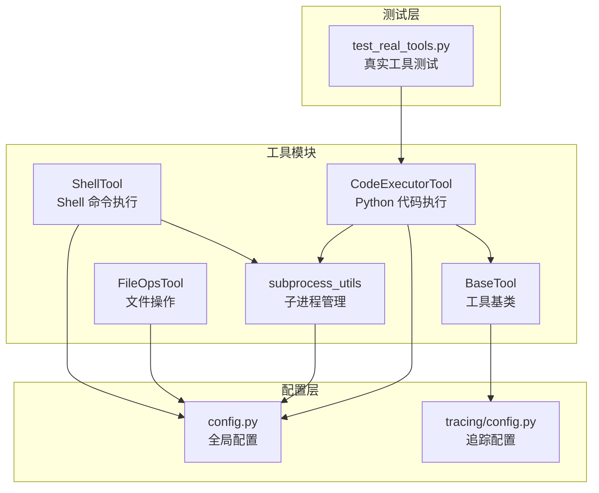
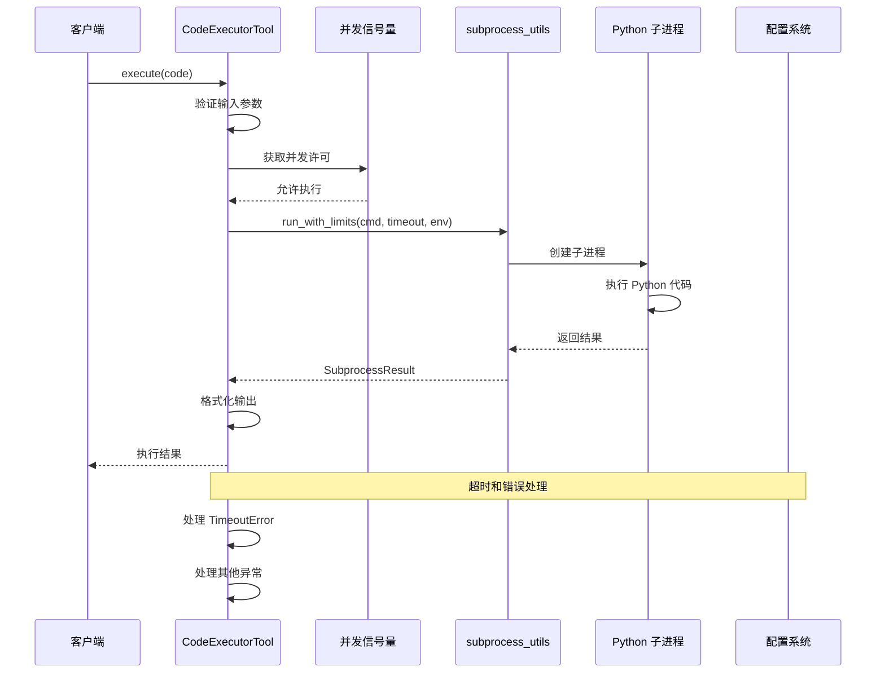
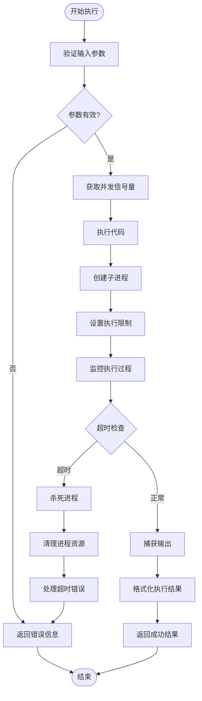
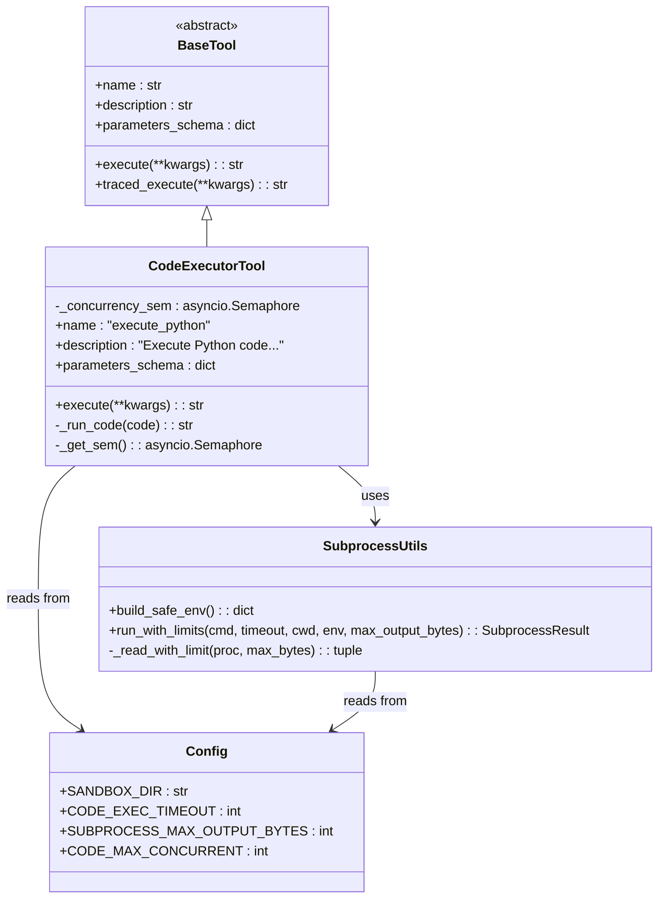

# CodeExecutorTool 代码执行工具

<cite>
**本文档引用的文件**
- [tools/code_executor.py](file://tools/code_executor.py)
- [tools/subprocess_utils.py](file://tools/subprocess_utils.py)
- [tools/base.py](file://tools/base.py)
- [config.py](file://config.py)
- [tools/file_ops.py](file://tools/file_ops.py)
- [tools/shell_tool.py](file://tools/shell_tool.py)
- [tests/test_real_tools.py](file://tests/test_real_tools.py)
- [tracing/config.py](file://tracing/config.py)
</cite>

## 目录
1. [简介](#简介)
2. [项目结构](#项目结构)
3. [核心组件](#核心组件)
4. [架构概览](#架构概览)
5. [详细组件分析](#详细组件分析)
6. [依赖关系分析](#依赖关系分析)
7. [性能考虑](#性能考虑)
8. [故障排除指南](#故障排除指南)
9. [结论](#结论)
10. [附录](#附录)

## 简介

CodeExecutorTool 是一个专为 LLM 生成代码设计的沙箱化代码执行工具。它允许在受控环境中安全地执行 Python 代码，提供超时保护、输出捕获和错误报告机制。该工具采用多层安全策略，包括进程隔离、环境变量清理、输出大小限制和并发控制，确保代码执行的安全性和稳定性。

## 项目结构

CodeExecutorTool 位于工具模块的中心位置，与相关的基础设施组件协同工作：

**图表来源**
- [tools/code_executor.py:1-102](file://tools/code_executor.py#L1-L102)
- [tools/subprocess_utils.py:1-156](file://tools/subprocess_utils.py#L1-L156)
- [config.py:1-109](file://config.py#L1-L109)

**章节来源**
- [tools/code_executor.py:1-102](file://tools/code_executor.py#L1-L102)
- [config.py:69-77](file://config.py#L69-L77)

## 核心组件

### CodeExecutorTool 类

CodeExecutorTool 是一个继承自 BaseTool 的具体工具实现，专门负责在沙箱环境中执行 Python 代码。

**主要特性：**
- 异步执行模型，支持非阻塞操作
- 超时保护机制，防止无限执行
- 并发控制，限制同时执行的代码实例数量
- 输出捕获和格式化，提供清晰的结果反馈

**关键属性：**
- `name`: "execute_python" - 工具的唯一标识符
- `description`: 详细的工具功能描述
- `parameters_schema`: JSON Schema 定义的参数规范

**章节来源**
- [tools/code_executor.py:25-63](file://tools/code_executor.py#L25-L63)

### subprocess_utils 模块

提供共享的子进程管理功能，是 CodeExecutorTool 的核心支撑组件。

**主要功能：**
- 环境变量安全清理
- 输出大小限制和截断
- 超时处理和进程清理
- 并发读取 stdout 和 stderr

**核心函数：**
- `build_safe_env()`: 创建安全的环境变量副本
- `run_with_limits()`: 执行带限制的子进程
- `_read_with_limit()`: 并发读取并限制输出大小

**章节来源**
- [tools/subprocess_utils.py:38-156](file://tools/subprocess_utils.py#L38-L156)

### BaseTool 抽象基类

定义了所有工具的标准接口和通用功能。

**核心接口：**
- `name`: 工具名称属性
- `description`: 工具描述属性  
- `parameters_schema`: 参数 JSON Schema
- `execute()`: 异步执行方法
- `traced_execute()`: 带追踪的执行方法

**章节来源**
- [tools/base.py:22-175](file://tools/base.py#L22-L175)

## 架构概览

CodeExecutorTool 采用分层架构设计，确保安全性和可扩展性：

**图表来源**
- [tools/code_executor.py:64-101](file://tools/code_executor.py#L64-L101)
- [tools/subprocess_utils.py:62-101](file://tools/subprocess_utils.py#L62-L101)

## 详细组件分析

### 安全机制和隔离策略

CodeExecutorTool 实现了多层次的安全防护机制：

#### 1. 进程隔离
- 使用独立的 Python 解释器进程执行代码
- 避免恶意代码影响主进程
- 支持进程清理和资源回收

#### 2. 环境变量清理
- 自动检测并移除敏感环境变量
- 支持的敏感键模式：API Key、Secret、Token、Password、Credential
- 防止敏感信息泄露到执行环境中

#### 3. 输出大小限制
- 默认最大输出字节数：512KB
- 超限时自动截断并添加截断标记
- 防止内存耗尽攻击

#### 4. 超时控制
- 默认执行超时：30秒
- 精确的超时处理和进程清理
- 防止僵尸进程产生

**章节来源**
- [tools/subprocess_utils.py:28-52](file://tools/subprocess_utils.py#L28-L52)
- [tools/subprocess_utils.py:62-101](file://tools/subprocess_utils.py#L62-L101)
- [config.py:71-76](file://config.py#L71-L76)

### 编程语言支持和执行环境

#### 支持的编程语言
- **Python**: 作为主要支持的语言
- **通过子进程执行**: 使用当前 Python 解释器
- **动态代码执行**: 支持任意 Python 语法

#### 执行环境配置
- **工作目录**: 沙箱目录 (`~/.manus_demo/sandbox`)
- **并发限制**: 默认最多 3 个并发执行实例
- **超时设置**: 30 秒执行超时
- **输出限制**: 512KB 最大输出

**章节来源**
- [tools/code_executor.py:80-87](file://tools/code_executor.py#L80-L87)
- [config.py:71-76](file://config.py#L71-L76)

### 代码验证、编译和执行流程

**图表来源**
- [tools/code_executor.py:64-101](file://tools/code_executor.py#L64-L101)
- [tools/subprocess_utils.py:62-101](file://tools/subprocess_utils.py#L62-L101)

### 结果捕获、输出处理和错误报告

#### 输出捕获机制
- **标准输出**: 捕获并返回 stdout 内容
- **标准错误**: 捕获并返回 stderr 内容
- **退出码**: 记录并报告进程退出状态

#### 输出格式化
- **结构化输出**: 将不同类型的输出分别格式化
- **工作目录信息**: 显示当前执行的工作目录
- **截断标记**: 当输出被截断时添加标记

#### 错误报告
- **超时错误**: 明确的超时信息
- **执行错误**: 详细的异常信息
- **参数错误**: 输入验证失败的提示

**章节来源**
- [tools/code_executor.py:89-101](file://tools/code_executor.py#L89-L101)
- [tools/subprocess_utils.py:151-155](file://tools/subprocess_utils.py#L151-L155)

### 并发控制和资源配额

#### 并发控制机制
- **信号量管理**: 使用 asyncio.Semaphore 控制并发
- **类级缓存**: 缓存并发信号量实例
- **动态配置**: 通过配置文件调整并发限制

#### 资源配额
- **最大并发数**: 默认 3 个执行实例
- **执行超时**: 30 秒限制
- **输出大小**: 512KB 限制
- **工作目录**: 沙箱目录隔离

**章节来源**
- [tools/code_executor.py:31-37](file://tools/code_executor.py#L31-L37)
- [config.py:75-76](file://config.py#L75-L76)

### 文件系统交互和临时文件管理

虽然 CodeExecutorTool 主要执行 Python 代码，但与文件系统的交互通过沙箱机制实现：

#### 沙箱隔离
- **工作目录**: 使用配置的沙箱目录
- **路径验证**: 防止路径穿越攻击
- **权限控制**: 限制文件访问范围

#### 临时文件管理
- **自动创建**: 沙箱目录自动创建
- **安全删除**: 通过 FileOpsTool 管理文件
- **隔离访问**: 仅允许沙箱内文件访问

**章节来源**
- [tools/file_ops.py:29-31](file://tools/file_ops.py#L29-L31)
- [tools/file_ops.py:87-96](file://tools/file_ops.py#L87-L96)

## 依赖关系分析

**图表来源**
- [tools/base.py:22-58](file://tools/base.py#L22-L58)
- [tools/code_executor.py:25-101](file://tools/code_executor.py#L25-L101)
- [tools/subprocess_utils.py:38-156](file://tools/subprocess_utils.py#L38-L156)
- [config.py:71-76](file://config.py#L71-L76)

**章节来源**
- [tools/base.py:22-58](file://tools/base.py#L22-L58)
- [tools/code_executor.py:18-20](file://tools/code_executor.py#L18-L20)

## 性能考虑

### 异步执行模型
- **非阻塞设计**: 使用 asyncio 实现异步执行
- **事件循环**: 避免线程池开销
- **资源效率**: 更好的并发性能

### 内存管理
- **输出限制**: 防止内存溢出
- **流式读取**: 并发读取 stdout 和 stderr
- **及时清理**: 超时后立即清理资源

### 并发优化
- **信号量缓存**: 避免重复创建信号量
- **连接复用**: 复用子进程连接
- **负载均衡**: 合理的并发控制

## 故障排除指南

### 常见问题和解决方案

#### 1. 代码执行超时
**症状**: 返回超时错误信息
**原因**: 代码执行时间超过配置的超时限制
**解决方案**: 
- 增加 CODE_EXEC_TIMEOUT 配置值
- 优化代码执行效率
- 分割复杂的计算任务

#### 2. 输出被截断
**症状**: 输出末尾显示截断标记
**原因**: 输出大小超过 SUBPROCESS_MAX_OUTPUT_BYTES 限制
**解决方案**:
- 减少代码输出量
- 增加 SUBPROCESS_MAX_OUTPUT_BYTES 配置值
- 使用文件输出而非标准输出

#### 3. 并发限制错误
**症状**: 代码执行被拒绝或等待
**原因**: 达到 CODE_MAX_CONCURRENT 并发限制
**解决方案**:
- 增加 CODE_MAX_CONCURRENT 配置值
- 优化任务调度
- 实现任务队列管理

#### 4. 环境变量安全问题
**症状**: 敏感信息泄露或访问被拒绝
**原因**: 环境变量中包含敏感信息
**解决方案**:
- 清理环境变量中的敏感信息
- 使用安全的环境变量配置
- 定期审查环境变量设置

**章节来源**
- [tools/subprocess_utils.py:151-155](file://tools/subprocess_utils.py#L151-L155)
- [config.py:71-76](file://config.py#L71-L76)

### 调试技巧

#### 启用详细日志
- 检查代码执行日志
- 监控并发执行状态
- 追踪异常发生位置

#### 性能监控
- 监控执行时间分布
- 分析输出大小统计
- 评估资源使用情况

## 结论

CodeExecutorTool 提供了一个安全、可靠的代码执行平台，特别适用于 LLM 生成代码的验证和执行场景。其多层安全机制、完善的错误处理和灵活的配置选项，使其成为构建智能代理系统的重要组件。

通过进程隔离、环境变量清理、输出限制和并发控制等安全措施，CodeExecutorTool 能够有效防止恶意代码对系统造成损害。同时，其异步执行模型和资源管理机制确保了良好的性能表现。

## 附录

### 配置参数参考

| 配置项 | 默认值 | 说明 |
|--------|--------|------|
| SANDBOX_DIR | ~/.manus_demo/sandbox | 沙箱工作目录 |
| CODE_EXEC_TIMEOUT | 30 | 代码执行超时（秒） |
| SUBPROCESS_MAX_OUTPUT_BYTES | 524288 | 最大输出字节数（512KB） |
| CODE_MAX_CONCURRENT | 3 | 最大并发执行数 |

### 最佳实践

#### 安全编码实践
- 始终验证用户输入
- 使用最小权限原则
- 定期更新安全配置
- 监控异常活动

#### 性能优化建议
- 合理设置超时时间
- 控制输出大小
- 优化并发配置
- 监控资源使用

#### 错误处理策略
- 实现重试机制
- 提供清晰的错误信息
- 记录详细的日志
- 建立监控告警

**章节来源**
- [config.py:71-76](file://config.py#L71-L76)
- [tests/test_real_tools.py:13-40](file://tests/test_real_tools.py#L13-L40)