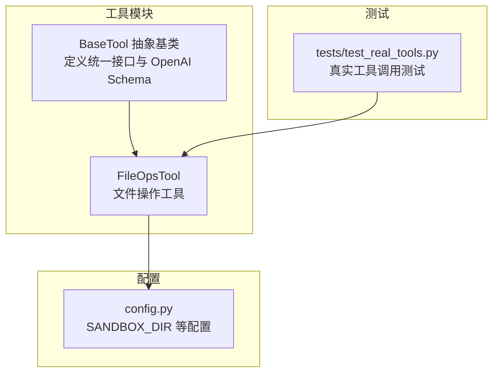
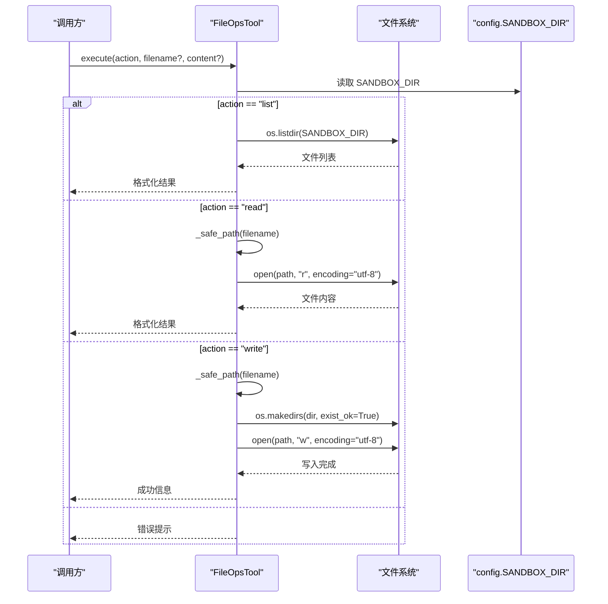
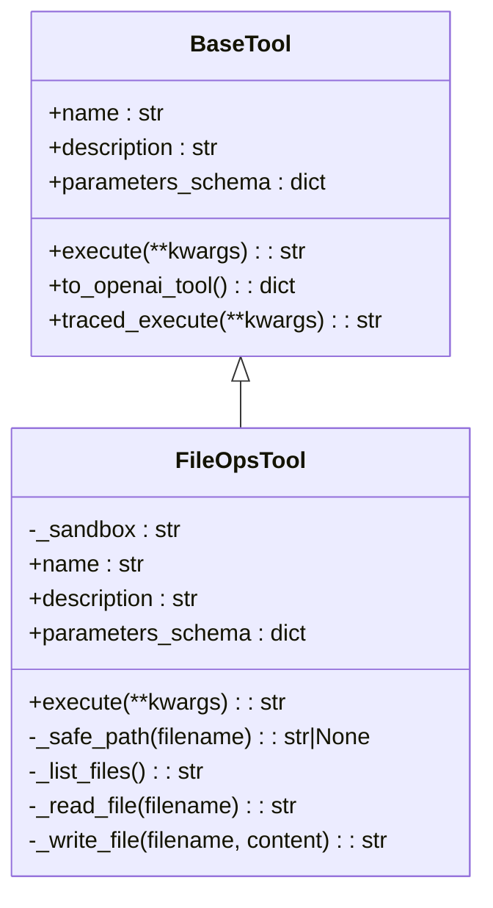
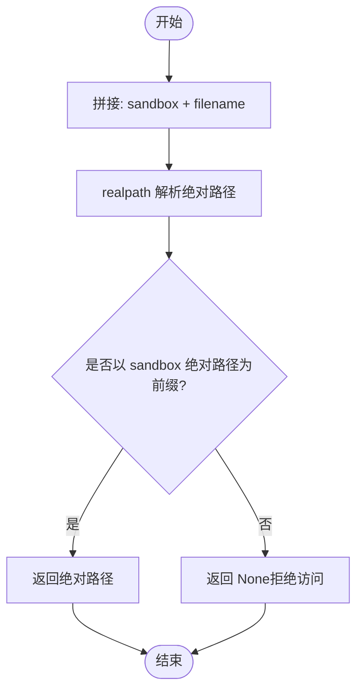
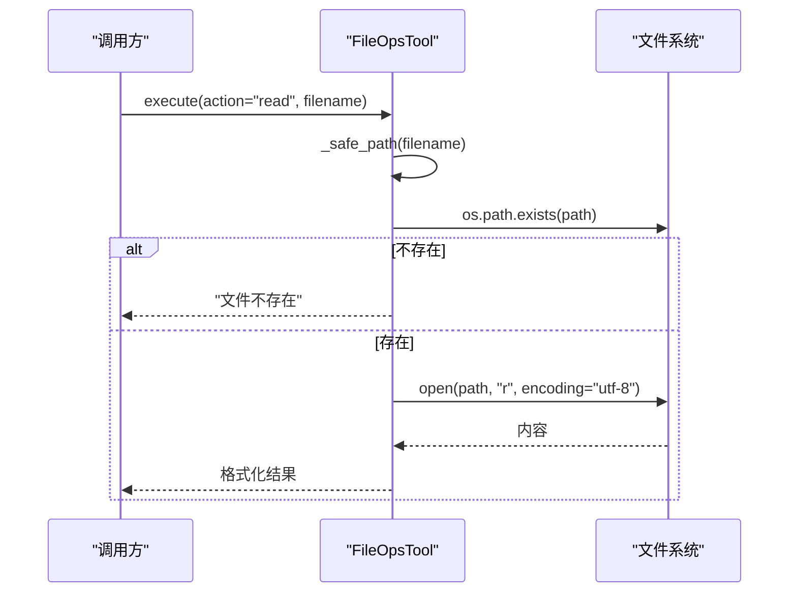
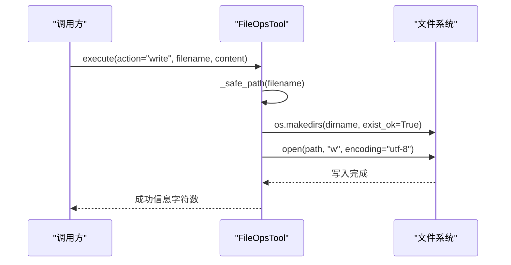
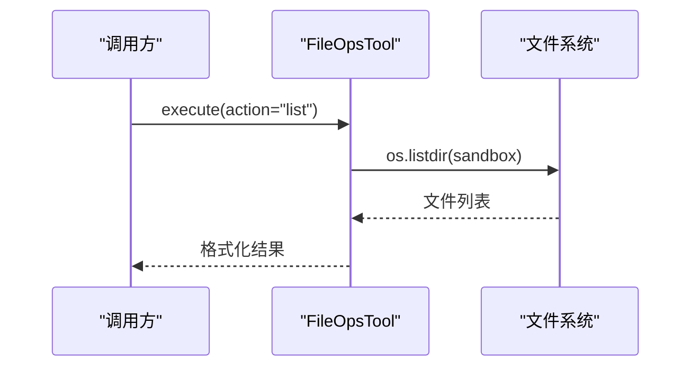
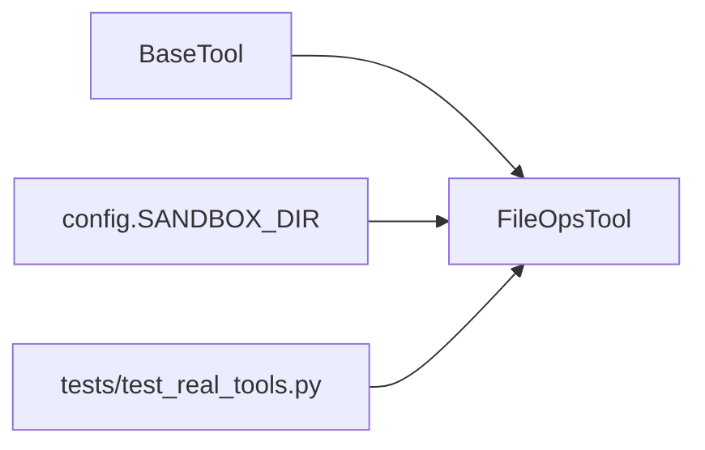

# FileOpsTool 文件操作工具

<cite>
**本文引用的文件**
- [tools/file_ops.py](file://tools/file_ops.py)
- [backups/tools/file_ops.py](file://backups/tools/file_ops.py)
- [tools/base.py](file://tools/base.py)
- [backups/tools/base.py](file://backups/tools/base.py)
- [config.py](file://config.py)
- [tests/test_real_tools.py](file://tests/test_real_tools.py)
- [README.md](file://README.md)
</cite>

## 目录
1. [简介](#简介)
2. [项目结构](#项目结构)
3. [核心组件](#核心组件)
4. [架构总览](#架构总览)
5. [详细组件分析](#详细组件分析)
6. [依赖分析](#依赖分析)
7. [性能考虑](#性能考虑)
8. [故障排查指南](#故障排查指南)
9. [结论](#结论)
10. [附录](#附录)

## 简介
FileOpsTool 是 Manus Demo 中的一个文件操作工具，提供在沙箱目录内的文件读取、写入和列出能力。它通过严格的路径校验防止越权访问，确保只对沙箱目录内的文件进行操作。该工具遵循统一的 BaseTool 接口，支持 OpenAI 函数调用格式，并在启用追踪时提供性能指标与错误记录。

## 项目结构
FileOpsTool 位于 tools 目录中，与其它工具（如代码执行、网络搜索）同级，共同构成系统的外部工具集合。其核心实现与基类接口分离，便于扩展与维护。

图表来源
- [tools/file_ops.py:1-138](file://tools/file_ops.py#L1-L138)
- [tools/base.py:1-175](file://tools/base.py#L1-L175)
- [config.py:1-109](file://config.py#L1-L109)
- [tests/test_real_tools.py:1-110](file://tests/test_real_tools.py#L1-L110)

章节来源
- [README.md:97-154](file://README.md#L97-L154)
- [tools/file_ops.py:1-138](file://tools/file_ops.py#L1-L138)
- [tools/base.py:1-175](file://tools/base.py#L1-L175)
- [config.py:69-76](file://config.py#L69-L76)

## 核心组件
- FileOpsTool：实现文件读取、写入、列出等操作，严格限制在 SANDBOX_DIR 沙箱目录内。
- BaseTool：定义统一的工具接口（名称、描述、参数 Schema、执行方法），并提供 OpenAI 函数调用格式转换与可选的追踪执行入口。
- 配置：通过 config.SANDBOX_DIR 指定沙箱目录，确保工具在受控工作空间内运行。

章节来源
- [tools/file_ops.py:23-138](file://tools/file_ops.py#L23-L138)
- [tools/base.py:22-175](file://tools/base.py#L22-L175)
- [config.py:71](file://config.py#L71)

## 架构总览
FileOpsTool 采用“沙箱 + 路径校验”的安全模型，所有文件操作均基于统一的 BaseTool 接口，支持 OpenAI 函数调用与可选的追踪执行。

图表来源
- [tools/file_ops.py:73-138](file://tools/file_ops.py#L73-L138)
- [config.py:71](file://config.py#L71)

## 详细组件分析

### FileOpsTool 类结构与职责
- 名称与描述：对外暴露 name 与 description，便于 LLM 识别与调用。
- 参数 Schema：定义 action（枚举 read/write/list）、filename（可选）、content（可选）。
- 执行流程：根据 action 分派至 _list_files/_read_file/_write_file。
- 路径校验：_safe_path 使用 realpath 与前缀匹配，防止路径穿越。
- 编码处理：读写均使用 UTF-8 编码，不支持二进制文件的原生读写。

图表来源
- [tools/base.py:22-175](file://tools/base.py#L22-L175)
- [tools/file_ops.py:23-138](file://tools/file_ops.py#L23-L138)

章节来源
- [tools/file_ops.py:23-138](file://tools/file_ops.py#L23-L138)
- [tools/base.py:22-175](file://tools/base.py#L22-L175)

### 路径验证与安全限制
- _safe_path：将用户提供的相对路径与沙箱根目录拼接后，使用 realpath 获取绝对路径，并检查是否以沙箱绝对路径为前缀。若逃逸则返回 None，阻止访问。
- 目录遍历防护：通过 realpath 解析符号链接与 .. 等相对路径，有效抵御路径穿越攻击。
- 恶意路径检测：若解析后的路径不在沙箱范围内，立即拒绝访问。

图表来源
- [tools/file_ops.py:87-96](file://tools/file_ops.py#L87-L96)

章节来源
- [tools/file_ops.py:87-96](file://tools/file_ops.py#L87-L96)

### 文件读取流程
- 参数校验：要求 filename 存在。
- 路径校验：调用 _safe_path，逃逸则拒绝。
- 存在性检查：若文件不存在，返回错误信息。
- 读取与返回：以 UTF-8 打开文件并读取内容，返回格式化结果。

图表来源
- [tools/file_ops.py:108-121](file://tools/file_ops.py#L108-L121)

章节来源
- [tools/file_ops.py:108-121](file://tools/file_ops.py#L108-L121)

### 文件写入流程
- 参数校验：要求 filename 存在。
- 路径校验：调用 _safe_path，逃逸则拒绝。
- 目录创建：若目标路径包含子目录且非沙箱根目录，则自动创建父目录。
- 写入与返回：以 UTF-8 写入内容，返回写入字符数与文件名。

图表来源
- [tools/file_ops.py:123-137](file://tools/file_ops.py#L123-L137)

章节来源
- [tools/file_ops.py:123-137](file://tools/file_ops.py#L123-L137)

### 文件列表流程
- 列出沙箱目录下的所有文件，若为空则返回提示信息。
- 对文件名进行排序输出，便于阅读。

图表来源
- [tools/file_ops.py:98-106](file://tools/file_ops.py#L98-L106)

章节来源
- [tools/file_ops.py:98-106](file://tools/file_ops.py#L98-L106)

### 与工作目录与相对路径的关系
- 工作目录：FileOpsTool 的工作根目录由 config.SANDBOX_DIR 提供，所有操作均基于此目录。
- 相对路径：用户传入的 filename 会被视为相对路径，最终通过 _safe_path 解析为绝对路径，确保不会逃逸沙箱。

章节来源
- [config.py:71](file://config.py#L71)
- [tools/file_ops.py:29-31](file://tools/file_ops.py#L29-L31)
- [tools/file_ops.py:87-96](file://tools/file_ops.py#L87-L96)

### 二进制文件支持与内容编码
- 当前实现：读写均使用 UTF-8 编码，适用于文本文件。
- 二进制文件：不支持二进制文件的原生读写；若需处理二进制，请在上层逻辑中进行编码转换或改用支持二进制的工具。

章节来源
- [tools/file_ops.py:118](file://tools/file_ops.py#L118)
- [tools/file_ops.py:133](file://tools/file_ops.py#L133)

### 批量操作、递归处理与错误恢复
- 批量操作：当前未提供批量操作接口；可通过多次调用实现批量效果。
- 递归处理：当前未提供递归目录遍历；可通过上层逻辑组合 list 与路径拼接实现。
- 错误恢复：读取失败、写入失败、路径逃逸等均返回错误信息；建议上层逻辑在失败时进行重试或回滚。

章节来源
- [tools/file_ops.py:73-85](file://tools/file_ops.py#L73-L85)
- [tools/file_ops.py:108-137](file://tools/file_ops.py#L108-L137)

### 权限控制系统与安全限制
- 沙箱限制：所有文件操作必须在 SANDBOX_DIR 内进行。
- 路径穿越防护：通过 realpath 与前缀检查，拒绝逃逸路径。
- 访问控制：未提供细粒度权限控制；默认仅允许读写沙箱内文件。

章节来源
- [config.py:71](file://config.py#L71)
- [tools/file_ops.py:87-96](file://tools/file_ops.py#L87-L96)

### 并发访问控制与事务性操作
- 并发控制：当前未实现文件级锁或并发控制；建议在上层通过工具路由或队列控制并发。
- 事务性：当前未提供事务性操作；写入为原子写（单次 open/w 写入），但不保证跨多个文件的事务一致性。

章节来源
- [tools/file_ops.py:123-137](file://tools/file_ops.py#L123-L137)

## 依赖分析
- FileOpsTool 依赖 BaseTool 提供的统一接口与 OpenAI Schema 转换能力。
- FileOpsTool 依赖 config.SANDBOX_DIR 作为工作根目录。
- 测试文件 tests/test_real_tools.py 验证了写入、读取、列出、错误处理与路径穿越防护。

图表来源
- [tools/base.py:22-175](file://tools/base.py#L22-L175)
- [tools/file_ops.py:29-31](file://tools/file_ops.py#L29-L31)
- [config.py:71](file://config.py#L71)
- [tests/test_real_tools.py:42-84](file://tests/test_real_tools.py#L42-L84)

章节来源
- [tools/base.py:22-175](file://tools/base.py#L22-L175)
- [tools/file_ops.py:29-31](file://tools/file_ops.py#L29-L31)
- [config.py:71](file://config.py#L71)
- [tests/test_real_tools.py:42-84](file://tests/test_real_tools.py#L42-L84)

## 性能考虑
- I/O 模式：读写均为同步阻塞操作，适合小文件与轻量级场景。
- 编码开销：UTF-8 读写在小文件上开销可忽略；大文件建议分块处理。
- 目录遍历：list 操作会扫描整个沙箱目录，文件数量较多时可能影响性能。
- 并发：未内置并发控制，建议在上层通过工具路由或队列限制并发。

## 故障排查指南
- “未知操作”错误：确认 action 为 read、write 或 list。
- “缺少文件名”错误：读取与写入操作需提供 filename。
- “访问被拒绝”错误：filename 逃逸沙箱或路径非法。
- “文件不存在”错误：确认文件存在于沙箱目录内。
- 路径穿越测试：使用 ../../../etc/passwd 等路径应被拒绝。

章节来源
- [tools/file_ops.py:73-85](file://tools/file_ops.py#L73-L85)
- [tools/file_ops.py:110-116](file://tools/file_ops.py#L110-L116)
- [tests/test_real_tools.py:66-75](file://tests/test_real_tools.py#L66-L75)

## 结论
FileOpsTool 通过沙箱与路径校验提供了安全可控的文件操作能力，满足文本文件的读写与列举需求。当前实现简洁明确，未包含二进制支持、批量/递归处理、并发控制与事务性保障。对于需要更高安全与性能要求的场景，可在上层通过工具路由、队列与额外封装进行增强。

## 附录

### 使用示例与参数配置
- 写入文件
  - action: write
  - filename: 目标文件名（相对沙箱根目录）
  - content: 要写入的文本内容
- 读取文件
  - action: read
  - filename: 目标文件名
- 列出文件
  - action: list
- 沙箱目录
  - 通过环境变量或 .env 设置 SANDBOX_DIR

章节来源
- [tools/file_ops.py:52-71](file://tools/file_ops.py#L52-L71)
- [config.py:71](file://config.py#L71)
- [tests/test_real_tools.py:42-84](file://tests/test_real_tools.py#L42-L84)