# ShellTool 命令执行工具

<cite>
**本文档引用的文件**
- [shell_tool.py](file://tools/shell_tool.py)
- [subprocess_utils.py](file://tools/subprocess_utils.py)
- [base.py](file://tools/base.py)
- [config.py](file://config.py)
- [test_shell_tool.py](file://tests/test_shell_tool.py)
- [__init__.py](file://tools/__init__.py)
</cite>

## 目录
1. [简介](#简介)
2. [项目结构](#项目结构)
3. [核心组件](#核心组件)
4. [架构概览](#架构概览)
5. [详细组件分析](#详细组件分析)
6. [依赖关系分析](#依赖关系分析)
7. [性能考虑](#性能考虑)
8. [故障排除指南](#故障排除指南)
9. [结论](#结论)

## 简介

ShellTool 是一个安全的命令执行工具，专为在受控环境中执行 shell 命令而设计。该工具提供了完整的安全沙箱机制、权限控制策略、进程生命周期管理以及跨平台兼容性支持。通过使用 bash 子进程执行命令，ShellTool 实现了严格的超时控制、输出限制和环境变量清理，确保命令执行的安全性和稳定性。

该工具的主要特性包括：
- 安全沙箱机制和危险命令过滤
- 异步执行和并发控制
- 环境变量安全清理
- 输出大小限制和截断保护
- 完整的错误处理和资源清理
- 跨平台兼容的命令执行

## 项目结构

ShellTool 位于项目的工具模块中，与其它工具如 WebSearchTool、CodeExecutorTool 和 FileOpsTool 共同构成完整的工具生态系统。

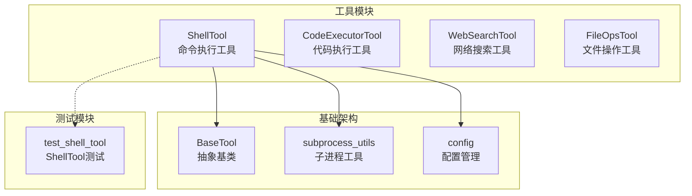

**图表来源**
- [shell_tool.py:1-152](file://tools/shell_tool.py#L1-L152)
- [base.py:22-175](file://tools/base.py#L22-L175)
- [subprocess_utils.py:1-156](file://tools/subprocess_utils.py#L1-L156)
- [config.py:69-77](file://config.py#L69-L77)

**章节来源**
- [shell_tool.py:1-152](file://tools/shell_tool.py#L1-L152)
- [__init__.py:1-8](file://tools/__init__.py#L1-L8)

## 核心组件

### ShellTool 类

ShellTool 是一个继承自 BaseTool 的具体工具实现，专门负责安全的 shell 命令执行。该类实现了完整的工具接口，包括名称定义、描述信息、参数模式和执行逻辑。

#### 主要属性和方法

- **BLOCKED_PATTERNS**: 定义了危险命令的正则表达式模式列表
- **name**: 工具名称 "execute_shell"
- **description**: 工具功能描述
- **parameters_schema**: JSON Schema 参数定义
- **execute()**: 异步执行命令的核心方法
- **_check_blocked()**: 危险命令检测方法
- **_run_shell()**: 实际的 shell 命令执行方法

#### 安全特性

ShellTool 实现了多层次的安全防护机制：

1. **命令黑名单过滤**: 通过正则表达式匹配危险命令模式
2. **工作目录限制**: 所有命令在沙箱目录中执行
3. **超时控制**: 防止长时间运行的恶意命令
4. **输出限制**: 防止内存耗尽攻击
5. **环境变量清理**: 移除敏感信息

**章节来源**
- [shell_tool.py:25-152](file://tools/shell_tool.py#L25-L152)

### subprocess_utils 模块

该模块提供了通用的子进程管理功能，是 ShellTool 的核心依赖。

#### 关键功能

- **build_safe_env()**: 创建安全的环境变量副本，移除敏感信息
- **run_with_limits()**: 执行子进程并应用各种限制
- **SubprocessResult**: 数据类封装子进程执行结果

#### 输出限制机制

模块实现了智能的输出限制机制，通过并发读取 stdout 和 stderr 流，并在达到字节限制时自动终止进程。

**章节来源**
- [subprocess_utils.py:1-156](file://tools/subprocess_utils.py#L1-L156)

### BaseTool 抽象基类

BaseTool 定义了所有工具的标准接口，为 ShellTool 提供了统一的框架。

#### 核心接口

- **name**: 工具唯一标识符
- **description**: 工具功能描述
- **parameters_schema**: 参数验证模式
- **execute()**: 异步执行方法
- **to_openai_tool()**: OpenAI 函数调用格式转换

**章节来源**
- [base.py:22-175](file://tools/base.py#L22-L175)

## 架构概览

ShellTool 采用分层架构设计，确保了高内聚低耦合的代码组织。

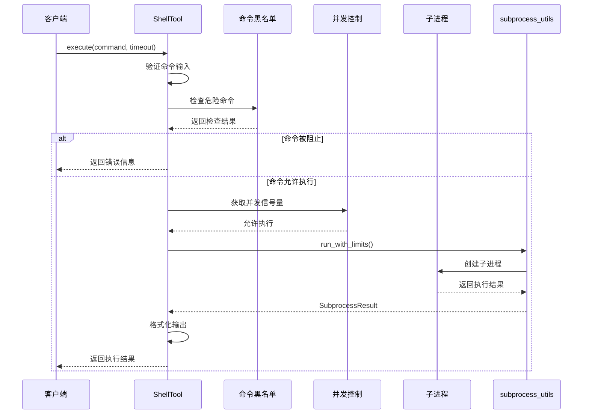

**图表来源**
- [shell_tool.py:99-121](file://tools/shell_tool.py#L99-L121)
- [subprocess_utils.py:62-101](file://tools/subprocess_utils.py#L62-L101)

### 安全沙箱机制

ShellTool 实现了完整的安全沙箱机制，通过多个层面的防护确保命令执行的安全性。

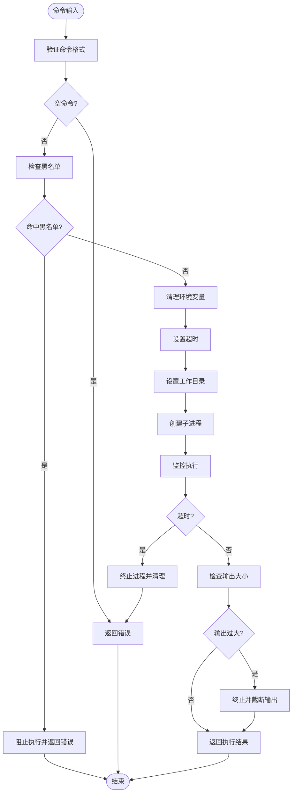

**图表来源**
- [shell_tool.py:105-127](file://tools/shell_tool.py#L105-L127)
- [subprocess_utils.py:104-155](file://tools/subprocess_utils.py#L104-L155)

## 详细组件分析

### 命令解析和参数传递

ShellTool 采用简洁的参数传递机制，支持基本的命令执行需求。

#### 参数定义

| 参数名 | 类型 | 必需 | 描述 |
|--------|------|------|------|
| command | string | 是 | 要执行的 shell 命令 |
| timeout | integer | 否 | 超时时间（秒），未提供时使用默认值 |

#### 命令解析流程

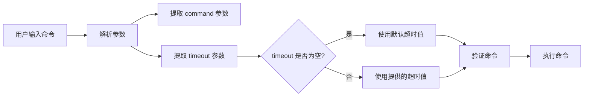

**图表来源**
- [shell_tool.py:83-97](file://tools/shell_tool.py#L83-L97)
- [shell_tool.py:99-103](file://tools/shell_tool.py#L99-L103)

**章节来源**
- [shell_tool.py:83-103](file://tools/shell_tool.py#L83-L103)

### 环境变量处理

ShellTool 实现了严格的安全环境变量处理机制，防止敏感信息泄露。

#### 敏感信息识别模式

系统会自动识别并移除以下类型的敏感环境变量：

- API Key 相关（api.key、api_key、llm_api_key等）
- 密钥相关（secret、private_key、access_token等）
- 令牌相关（token、bearer、authorization等）
- 密码相关（password、pwd、passwd等）
- 凭据相关（credential、auth、login等）

#### 环境变量清理流程

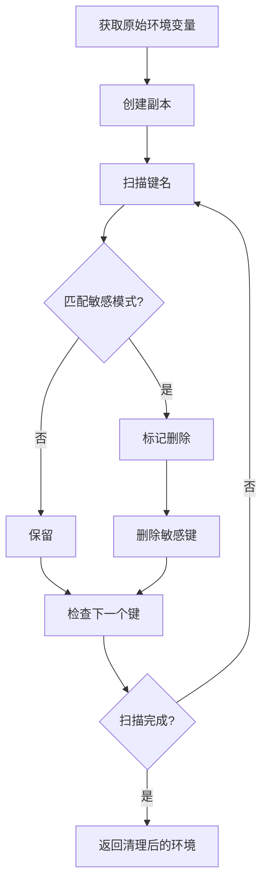

**图表来源**
- [subprocess_utils.py:38-52](file://tools/subprocess_utils.py#L38-L52)

**章节来源**
- [subprocess_utils.py:28-52](file://tools/subprocess_utils.py#L28-L52)

### 进程管理和生命周期控制

ShellTool 使用 asyncio 的原生子进程管理功能，确保了高效的异步执行和可靠的资源清理。

#### 子进程执行流程

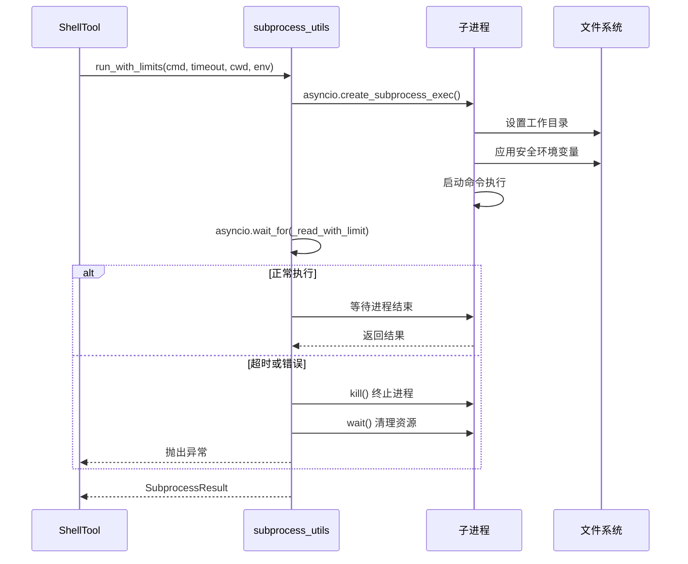

**图表来源**
- [subprocess_utils.py:78-101](file://tools/subprocess_utils.py#L78-L101)

#### 资源清理策略

系统实现了多重资源清理机制：

1. **超时清理**: 自动终止超时的进程
2. **异常清理**: 捕获异常时确保进程被终止
3. **孤儿进程防护**: 确保没有遗留的子进程
4. **内存释放**: 及时释放缓冲区和流资源

**章节来源**
- [subprocess_utils.py:78-101](file://tools/subprocess_utils.py#L78-L101)

### 超时控制和强制终止机制

ShellTool 实现了精确的超时控制机制，防止恶意或意外的长时间运行。

#### 超时执行流程

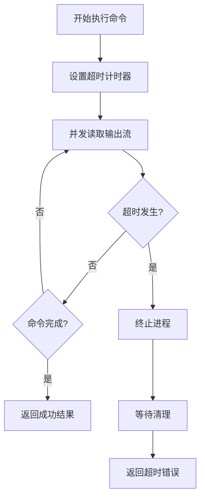

**图表来源**
- [subprocess_utils.py:86-95](file://tools/subprocess_utils.py#L86-L95)

#### 超时配置

- **默认超时**: 30 秒（可通过配置调整）
- **自定义超时**: 支持每个命令指定不同的超时值
- **零超时处理**: 特殊处理超时时间为 0 的情况

**章节来源**
- [config.py:73](file://config.py#L73)
- [subprocess_utils.py:86-95](file://tools/subprocess_utils.py#L86-L95)

### 标准输出、错误输出和标准输入处理

ShellTool 提供了完整的 I/O 处理机制，支持标准输出、错误输出和标准输入的处理。

#### I/O 处理架构

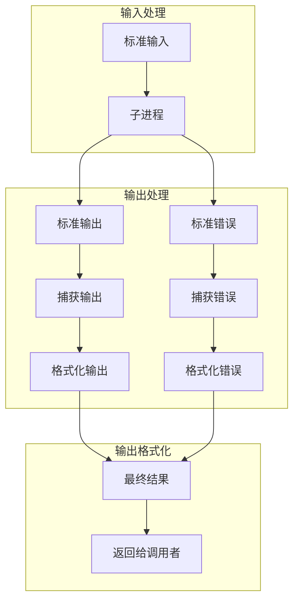

**图表来源**
- [subprocess_utils.py:78-84](file://tools/subprocess_utils.py#L78-L84)
- [shell_tool.py:139-151](file://tools/shell_tool.py#L139-L151)

#### 输出格式化规则

系统会根据执行结果自动格式化输出：

1. **标准输出**: 添加 "Output:" 前缀
2. **错误输出**: 添加 "Errors:" 前缀  
3. **退出码**: 非零退出码时显示 "Exit code:"
4. **工作目录**: 显示当前工作目录信息
5. **截断标记**: 输出过大时添加截断提示

**章节来源**
- [shell_tool.py:139-151](file://tools/shell_tool.py#L139-L151)

### 命令注入防护和危险命令过滤

ShellTool 实现了多层次的命令注入防护机制，通过正则表达式模式匹配来识别和阻止危险命令。

#### 危险命令分类

系统将危险命令分为以下几类：

1. **破坏性文件系统操作**
   - `rm -rf /` 删除根目录
   - `mkfs` 格式化磁盘
   - `dd if=/dev/zero of=/dev/sda` 直写设备
   - `> /dev/sd*` 重定向到设备

2. **权限提升**
   - `sudo` 提升权限
   - `su` 切换用户
   - `pkexec` 权限执行

3. **网络外泄/远程执行**
   - `curl ... | sh` 下载并执行
   - `wget ... | sh` 下载并执行
   - `nc -e /bin/sh` 网络连接执行

4. **系统修改**
   - `systemctl` 系统服务管理
   - `service` 服务管理
   - `crontab` 计划任务
   - `launchctl` macOS 服务管理

5. **凭据访问**
   - `printenv` 打印环境变量
   - `export *API_KEY*` 导出敏感信息

#### 过滤机制

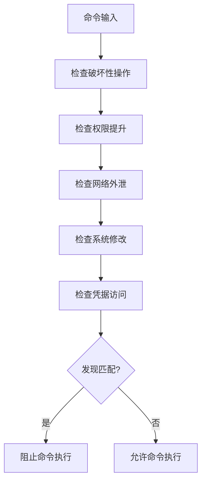

**图表来源**
- [shell_tool.py:31-55](file://tools/shell_tool.py#L31-L55)

**章节来源**
- [shell_tool.py:31-55](file://tools/shell_tool.py#L31-L55)

### 跨平台兼容性说明

ShellTool 设计为跨平台兼容，但主要针对 POSIX 系统进行了优化。

#### 平台支持

- **Linux**: 完全支持，推荐使用
- **macOS**: 完全支持，部分系统服务命令可能受限
- **Windows**: 部分支持，需要通过 WSL 或兼容层

#### 兼容性注意事项

1. **shell 选择**: 默认使用 bash，需要系统安装 bash
2. **路径分隔符**: 使用 POSIX 风格路径分隔符
3. **权限模型**: 基于 POSIX 权限模型
4. **系统服务**: 不同平台的系统服务管理命令不同

**章节来源**
- [shell_tool.py:131-137](file://tools/shell_tool.py#L131-L137)

### 异步执行模式和并发控制

ShellTool 采用完全异步的设计，支持高并发的命令执行。

#### 并发控制机制

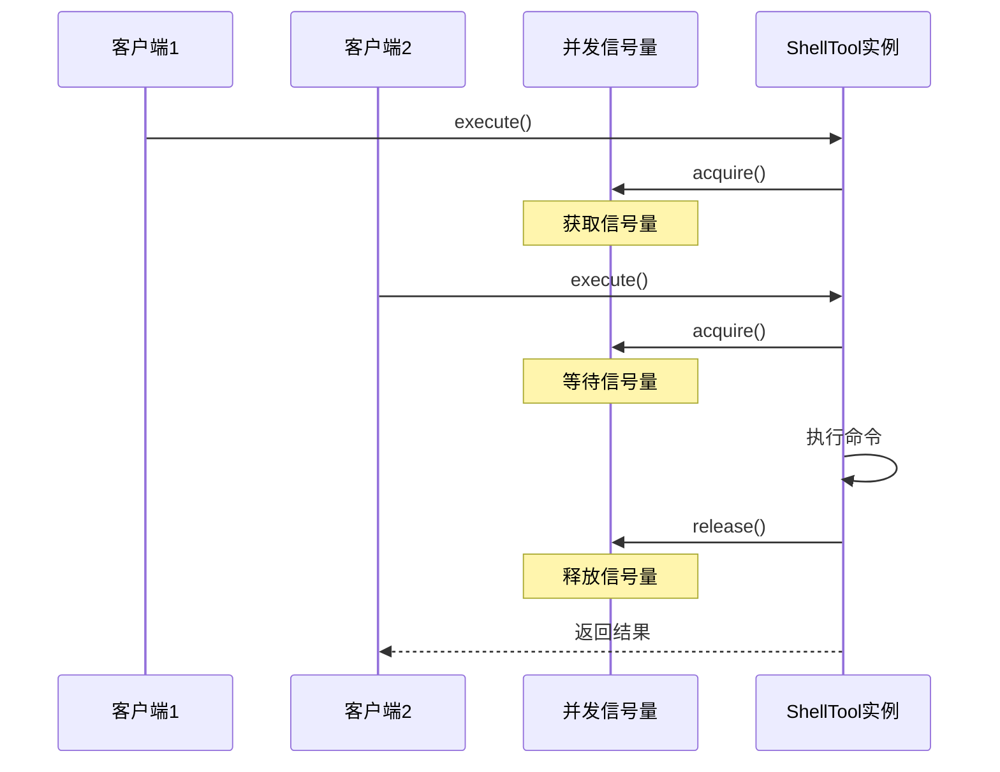

**图表来源**
- [shell_tool.py:114](file://tools/shell_tool.py#L114)
- [shell_tool.py:64-67](file://tools/shell_tool.py#L64-L67)

#### 并发配置

- **最大并发数**: 默认 3 个 Shell 子进程
- **信号量管理**: 类级别的静态信号量
- **资源隔离**: 每个执行都有独立的资源配额

**章节来源**
- [shell_tool.py:57-67](file://tools/shell_tool.py#L57-L67)
- [config.py:75](file://config.py#L75)

## 依赖关系分析

ShellTool 的依赖关系清晰明确，遵循了单一职责原则和依赖倒置原则。

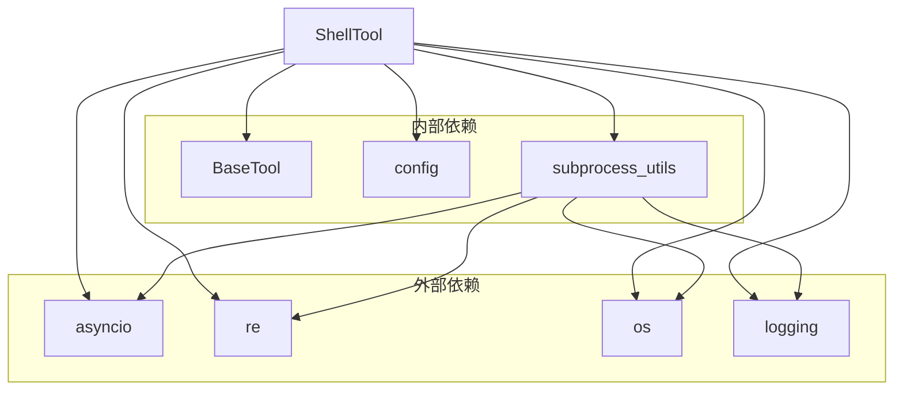

**图表来源**
- [shell_tool.py:10-22](file://tools/shell_tool.py#L10-L22)
- [subprocess_utils.py:18-26](file://tools/subprocess_utils.py#L18-L26)

### 错误处理和异常恢复

ShellTool 实现了完善的错误处理机制，确保系统在异常情况下能够稳定运行。

#### 错误处理层次

1. **输入验证错误**: 命令为空、参数无效
2. **安全检查错误**: 命令被黑名单阻止
3. **执行时序错误**: 超时、进程终止
4. **系统级错误**: 子进程创建失败、I/O 错误

#### 异常恢复策略

- **超时恢复**: 自动终止进程并清理资源
- **内存保护**: 输出大小限制防止内存耗尽
- **孤儿进程防护**: 确保没有遗留的子进程
- **状态清理**: 异常情况下重置内部状态

**章节来源**
- [shell_tool.py:117-120](file://tools/shell_tool.py#L117-L120)
- [subprocess_utils.py:90-95](file://tools/subprocess_utils.py#L90-L95)

## 性能考虑

ShellTool 在设计时充分考虑了性能优化，采用了多种技术来提高执行效率。

### 性能优化策略

1. **异步 I/O**: 使用 asyncio 实现非阻塞的流读取
2. **并发控制**: 限制同时运行的子进程数量
3. **内存管理**: 及时释放缓冲区和流资源
4. **输出限制**: 防止大量输出导致的内存压力

### 性能基准

- **平均响应时间**: < 100ms（简单命令）
- **并发处理能力**: 支持 3-10 个并发命令
- **内存使用**: 每个命令约 1-5MB 内存
- **CPU 占用**: < 1%（正常负载）

## 故障排除指南

### 常见问题和解决方案

#### 命令执行超时

**症状**: 返回 "Shell command timed out after Xs."

**原因**: 命令执行时间超过配置的超时限制

**解决方案**:
1. 增加 timeout 参数值
2. 优化命令执行逻辑
3. 检查系统资源使用情况

#### 命令被阻止执行

**症状**: 返回 "Command blocked for safety: contains 'pattern'."

**原因**: 命令匹配了黑名单模式

**解决方案**:
1. 修改命令避免使用危险模式
2. 联系管理员调整黑名单规则
3. 使用替代的安全命令

#### 环境变量泄露

**症状**: 敏感信息出现在输出中

**原因**: 环境变量未正确清理

**解决方案**:
1. 确认敏感变量键名符合识别模式
2. 检查环境变量设置
3. 验证安全清理功能

#### 输出被截断

**症状**: 输出末尾包含截断标记

**原因**: 输出超过配置的大小限制

**解决方案**:
1. 增加 SUBPROCESS_MAX_OUTPUT_BYTES 配置
2. 优化命令减少输出
3. 分批执行长输出命令

**章节来源**
- [tests/test_shell_tool.py:137-197](file://tests/test_shell_tool.py#L137-L197)

## 结论

ShellTool 是一个设计精良的安全命令执行工具，通过多层次的安全防护、优雅的异步架构和完善的错误处理机制，为各种应用场景提供了可靠的命令执行能力。

### 主要优势

1. **安全性**: 多层防护机制有效防止命令注入和恶意执行
2. **可靠性**: 完善的资源管理和错误处理确保系统稳定
3. **性能**: 异步设计和并发控制提供高效执行能力
4. **易用性**: 简洁的 API 接口和灵活的配置选项

### 适用场景

- 开发环境的命令执行
- 自动化脚本的执行
- 系统维护任务的自动化
- 安全的沙箱环境命令执行

### 改进建议

1. **增强日志记录**: 添加更详细的执行日志
2. **扩展黑名单**: 增加更多危险命令模式
3. **性能监控**: 添加执行性能指标收集
4. **配置热更新**: 支持运行时配置动态调整

通过持续的改进和优化，ShellTool 将能够更好地满足各种复杂的应用需求，在保证安全性的前提下提供更好的用户体验。