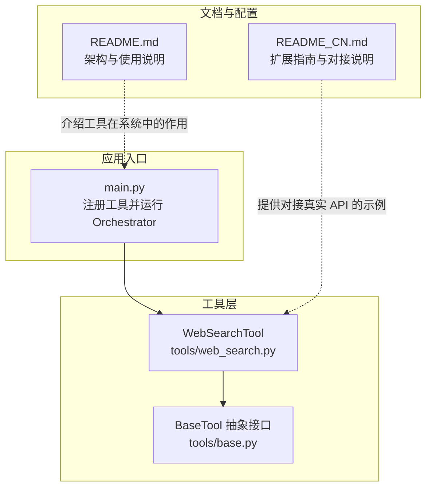
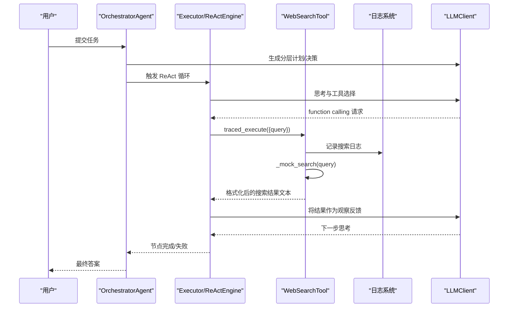
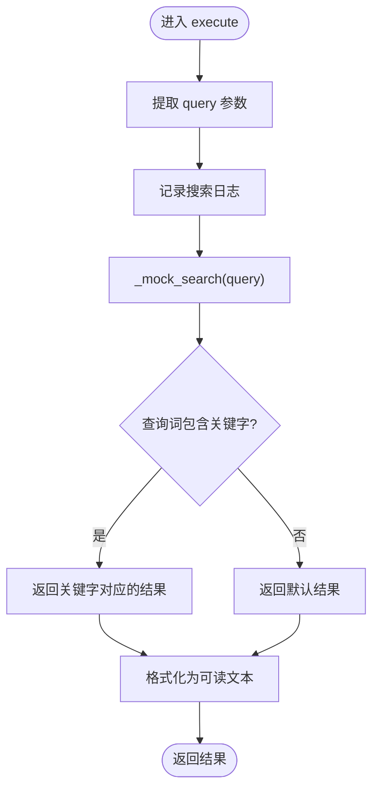
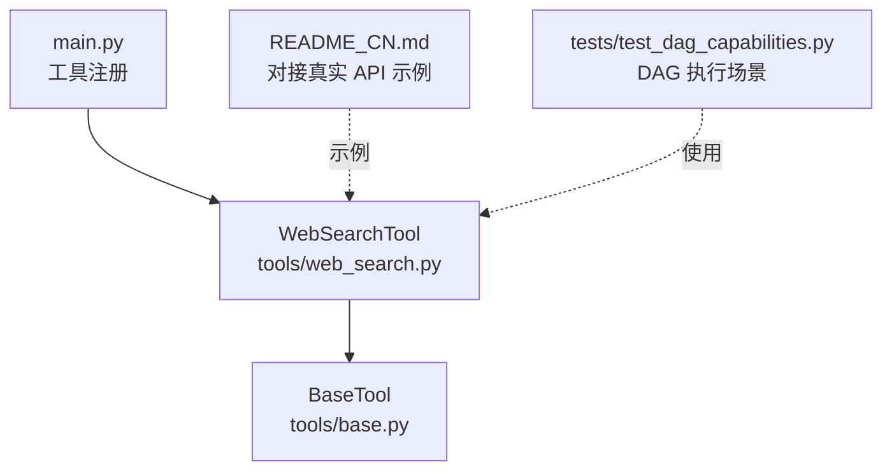

# WebSearchTool 搜索工具

<cite>
**本文引用的文件**
- [tools/web_search.py](file://tools/web_search.py)
- [tools/base.py](file://tools/base.py)
- [main.py](file://main.py)
- [README_CN.md](file://README_CN.md)
- [README.md](file://README.md)
- [tests/test_dag_capabilities.py](file://tests/test_dag_capabilities.py)
</cite>

## 目录
1. [简介](#简介)
2. [项目结构](#项目结构)
3. [核心组件](#核心组件)
4. [架构概览](#架构概览)
5. [详细组件分析](#详细组件分析)
6. [依赖分析](#依赖分析)
7. [性能考虑](#性能考虑)
8. [故障排查指南](#故障排查指南)
9. [结论](#结论)
10. [附录](#附录)

## 简介
WebSearchTool 是 Manus Demo 中的网络搜索工具，提供模拟搜索引擎实现。它默认返回预定义的 mock 搜索结果，同时通过可替换的 _mock_search 方法无缝对接真实搜索 API（如 SerpAPI、Tavily、DuckDuckGo）。该工具在智能体系统中扮演“信息获取”的关键角色，为 ReAct 循环提供外部知识来源，支撑多智能体系统的自主规划与执行。

## 项目结构
WebSearchTool 位于 tools/web_search.py，遵循 BaseTool 抽象接口，与工具注册、日志记录、OpenAI function calling schema 转换等基础设施协同工作。



**图表来源**
- [tools/web_search.py:1-113](file://tools/web_search.py#L1-L113)
- [tools/base.py:22-175](file://tools/base.py#L22-L175)
- [main.py:415-493](file://main.py#L415-L493)
- [README_CN.md:434-450](file://README_CN.md#L434-L450)
- [README.md:62-64](file://README.md#L62-L64)

**章节来源**
- [tools/web_search.py:1-113](file://tools/web_search.py#L1-L113)
- [tools/base.py:22-175](file://tools/base.py#L22-L175)
- [main.py:415-493](file://main.py#L415-L493)
- [README_CN.md:434-450](file://README_CN.md#L434-L450)
- [README.md:62-64](file://README.md#L62-L64)

## 核心组件
- WebSearchTool：模拟网络搜索工具，提供名称、描述、参数 Schema 和异步执行方法。默认通过 _mock_search 返回 mock 结果，支持替换为真实搜索 API。
- BaseTool：所有工具的抽象基类，定义统一的接口规范、OpenAI function calling schema 转换以及可选的追踪执行入口 traced_execute。
- 主程序入口 main.py：注册 WebSearchTool 等工具，交由 OrchestratorAgent 在 ReAct 循环中调用。

**章节来源**
- [tools/web_search.py:56-113](file://tools/web_search.py#L56-L113)
- [tools/base.py:22-175](file://tools/base.py#L22-L175)
- [main.py:448-455](file://main.py#L448-L455)

## 架构概览
WebSearchTool 在智能体系统中的作用与协作模式如下：



**图表来源**
- [main.py:448-455](file://main.py#L448-L455)
- [tools/web_search.py:87-99](file://tools/web_search.py#L87-L99)
- [tools/base.py:60-124](file://tools/base.py#L60-L124)

## 详细组件分析

### WebSearchTool 类结构与职责
- 名称与描述：用于 LLM 识别工具用途与调用时机。
- 参数 Schema：定义 query 字段（必需）。
- 执行流程：记录日志 → 调用 _mock_search → 格式化结果为可读文本。
- 结果格式化：按编号列出标题、摘要与 URL，便于 LLM 后续处理。

```mermaid
classDiagram
class BaseTool {
<<abstract>>
+name : str
+description : str
+parameters_schema : dict
+execute(**kwargs) : str
+traced_execute(**kwargs) : str
+to_openai_tool() : dict
}
class WebSearchTool {
+name : "web_search"
+description : "根据查询词搜索网络信息，返回标题和摘要列表"
+parameters_schema : {"type" : "object","properties" : {"query" : {"type" : "string"}},"required" : ["query"]}
+execute(**kwargs) : str
+_mock_search(query) : list[dict[str,str]]
}
BaseTool <|-- WebSearchTool
```

**图表来源**
- [tools/base.py:22-175](file://tools/base.py#L22-L175)
- [tools/web_search.py:56-113](file://tools/web_search.py#L56-L113)

**章节来源**
- [tools/web_search.py:62-85](file://tools/web_search.py#L62-L85)
- [tools/web_search.py:87-99](file://tools/web_search.py#L87-L99)
- [tools/web_search.py:101-113](file://tools/web_search.py#L101-L113)

### 模拟搜索引擎实现机制
- 预定义 mock 数据库：MOCK_RESULTS 以关键词为键，映射到包含标题、摘要、URL 的结果列表。
- 匹配算法：将查询词转为小写，遍历关键字，若查询包含某关键字则返回对应结果，否则返回默认结果。
- 执行流程：接收 query → 记录日志 → 调用 _mock_search → 格式化输出。



**图表来源**
- [tools/web_search.py:87-113](file://tools/web_search.py#L87-L113)

**章节来源**
- [tools/web_search.py:23-53](file://tools/web_search.py#L23-L53)
- [tools/web_search.py:101-113](file://tools/web_search.py#L101-L113)

### 参数 Schema 与 OpenAI Function Calling
- Schema 定义：包含必需的 query 字段，描述为“搜索查询字符串”。
- 转换为 OpenAI 工具格式：to_openai_tool 返回符合 OpenAI tools 格式的字典，供 chat completions API 使用。

**章节来源**
- [tools/web_search.py:74-85](file://tools/web_search.py#L74-L85)
- [tools/base.py:153-175](file://tools/base.py#L153-L175)

### 执行流程与结果格式化
- 日志记录：使用标准库 logging 记录搜索查询。
- 结果格式化：以“Search results for: 'query'”开头，逐条输出编号、标题、摘要、URL，便于 LLM 后续推理。

**章节来源**
- [tools/web_search.py:19](file://tools/web_search.py#L19)
- [tools/web_search.py:87-99](file://tools/web_search.py#L87-L99)

### 集成真实搜索 API 的替换策略
- 替换点：重写 _mock_search 方法，使其调用真实搜索 API（如 Tavily、SerpAPI、DuckDuckGo）。
- 示例参考：README_CN.md 中提供了以 Tavily API 为例的替换方法示例。

**章节来源**
- [tools/web_search.py:101-113](file://tools/web_search.py#L101-L113)
- [README_CN.md:434-450](file://README_CN.md#L434-L450)

### 在智能体系统中的作用与协作
- 工具注册：main.py 中将 WebSearchTool 注册为可用工具之一。
- ReAct 协作：在 Executor 的 ReAct 循环中，LLM 通过 function calling 选择 web_search 工具，传入 query 参数，得到格式化结果作为观察。
- 可观测性：traced_execute 提供可选的追踪埋点，记录工具执行时间、参数与结果大小等指标。

**章节来源**
- [main.py:448-455](file://main.py#L448-L455)
- [tools/base.py:60-124](file://tools/base.py#L60-L124)
- [README.md:62-64](file://README.md#L62-L64)

## 依赖分析
- 直接依赖：BaseTool 抽象接口、logging 标准库。
- 间接依赖：main.py 注册工具；README_CN.md 提供真实 API 对接示例；tests/test_dag_capabilities.py 展示工具在 DAG 执行中的使用场景。



**图表来源**
- [tools/web_search.py:17-19](file://tools/web_search.py#L17-L19)
- [tools/base.py:22-175](file://tools/base.py#L22-L175)
- [main.py:448-455](file://main.py#L448-L455)
- [README_CN.md:434-450](file://README_CN.md#L434-L450)
- [tests/test_dag_capabilities.py:46-126](file://tests/test_dag_capabilities.py#L46-L126)

**章节来源**
- [tools/web_search.py:17-19](file://tools/web_search.py#L17-L19)
- [tools/base.py:22-175](file://tools/base.py#L22-L175)
- [main.py:448-455](file://main.py#L448-L455)
- [README_CN.md:434-450](file://README_CN.md#L434-L450)
- [tests/test_dag_capabilities.py:46-126](file://tests/test_dag_capabilities.py#L46-L126)

## 性能考虑
- 模拟搜索性能：MOCK_RESULTS 为内存中的字典查找，时间复杂度近似 O(k)，k 为关键字数量。
- 格式化输出：线性遍历结果列表进行拼接，时间复杂度 O(n)，n 为结果数量。
- 日志与追踪：日志记录为常数开销；traced_execute 在开启追踪时引入少量额外开销（参数清洗、Span 记录、异常记录）。

[本节为通用性能讨论，不直接分析具体文件]

## 故障排查指南
- 日志级别：通过 main.py 的 -v/--verbose 参数启用 DEBUG 级别日志，查看 WebSearchTool 的执行日志与参数。
- 工具注册：确认 main.py 中已将 WebSearchTool 加入 tools 列表。
- 追踪埋点：当 TRACING_ENABLED=true 时，traced_execute 会记录工具执行时间、参数与结果大小；若未安装 OpenTelemetry，将自动降级为直接执行。
- 结果为空或不符合预期：检查 _mock_search 的替换实现是否正确返回包含 title/snippet/url 的结构；或确认 MOCK_RESULTS 中是否存在匹配关键字。

**章节来源**
- [main.py:396-413](file://main.py#L396-L413)
- [tools/base.py:60-124](file://tools/base.py#L60-L124)
- [tools/web_search.py:101-113](file://tools/web_search.py#L101-L113)

## 结论
WebSearchTool 通过简洁的抽象接口与可替换的搜索实现，为 Manus Demo 的智能体系统提供了标准化的网络搜索能力。其 mock 实现便于教学演示与离线测试，而通过 _mock_search 的替换即可无缝对接真实搜索 API。配合主程序的工具注册与 ReAct 协作机制，WebSearchTool 在 DAG 并行执行与工具路由中发挥着关键作用。

[本节为总结性内容，不直接分析具体文件]

## 附录

### 使用示例与场景
- 基本使用：在 ReAct 循环中，LLM 通过 function calling 选择 web_search 工具，传入 query 参数，得到格式化的搜索结果文本。
- DAG 执行场景：在 tests/test_dag_capabilities.py 中构建的三层 DAG（Goal → SubGoal → Action）中，act_1_1 节点可并行执行 web_search 工具，随后由 act_2_1 节点整合结果。

**章节来源**
- [tests/test_dag_capabilities.py:46-126](file://tests/test_dag_capabilities.py#L46-L126)
- [README_CN.md:434-450](file://README_CN.md#L434-L450)

### 错误处理与日志记录机制
- 日志记录：使用标准库 logging 记录搜索查询，便于调试与审计。
- 追踪埋点：traced_execute 在开启追踪时记录工具执行时间、参数与结果大小；异常时记录错误信息并传播。
- 结果格式化：始终返回字符串，确保 LLM 可读性与一致性。

**章节来源**
- [tools/web_search.py:19](file://tools/web_search.py#L19)
- [tools/base.py:60-124](file://tools/base.py#L60-L124)
- [tools/web_search.py:93-99](file://tools/web_search.py#L93-L99)