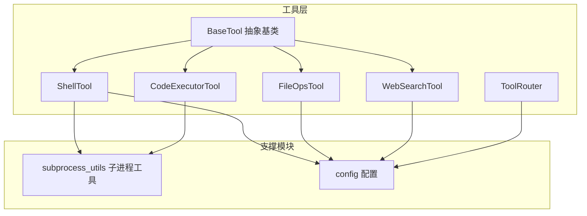
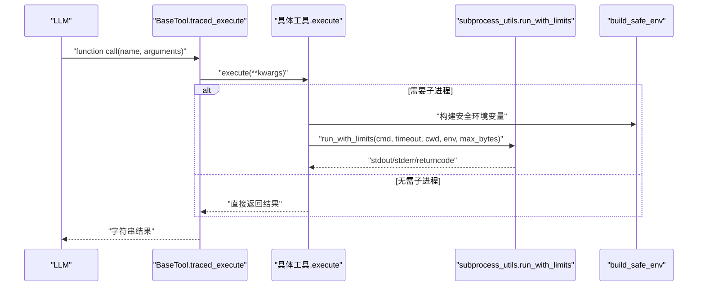
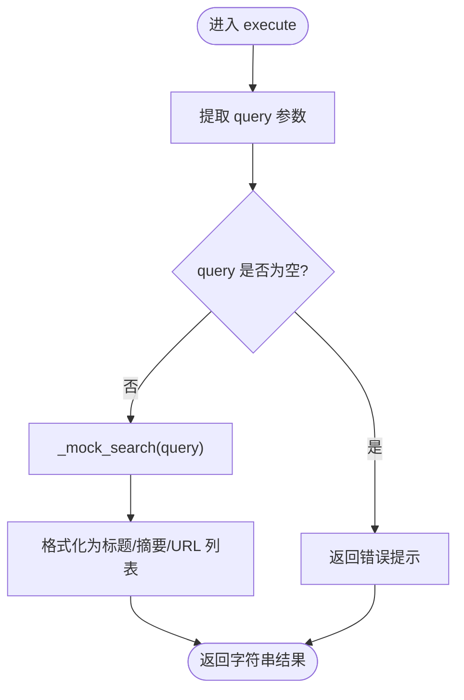
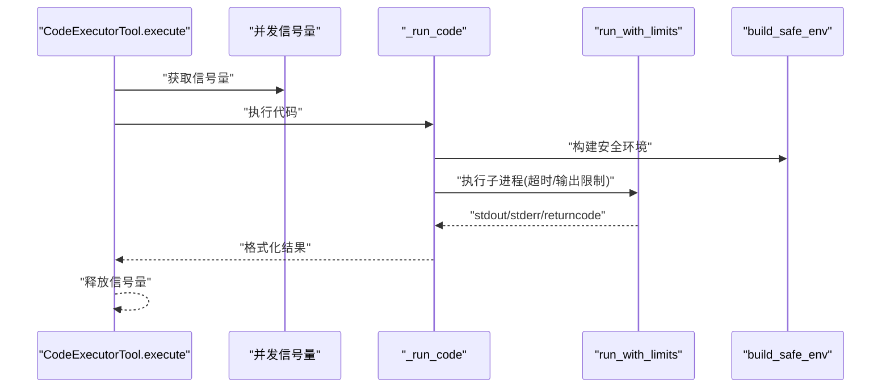
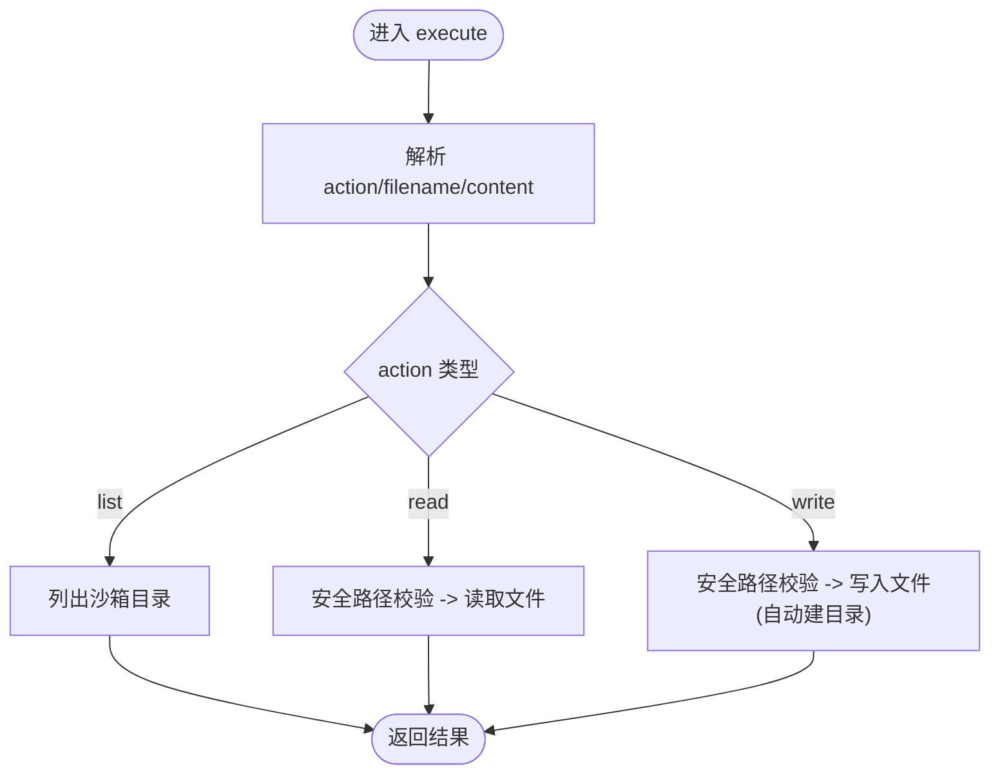
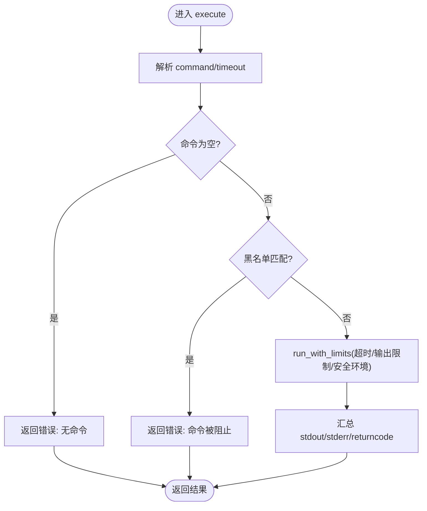
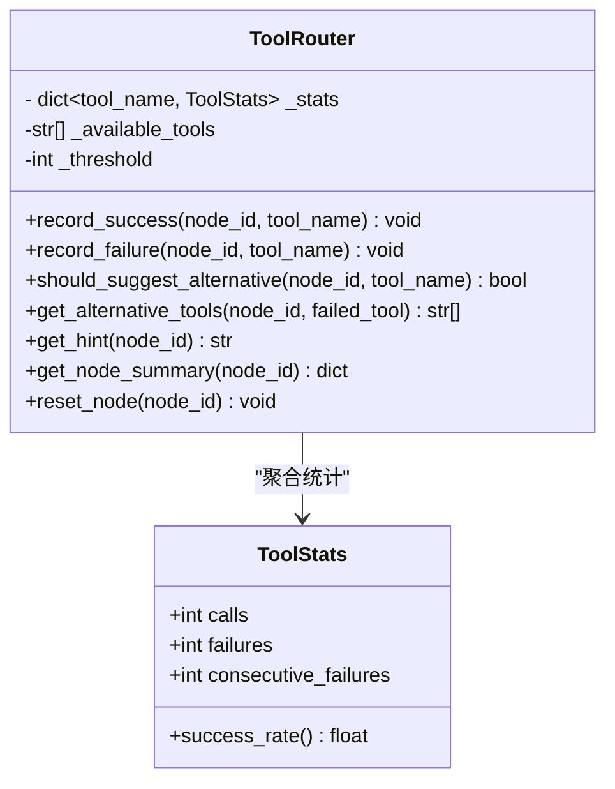
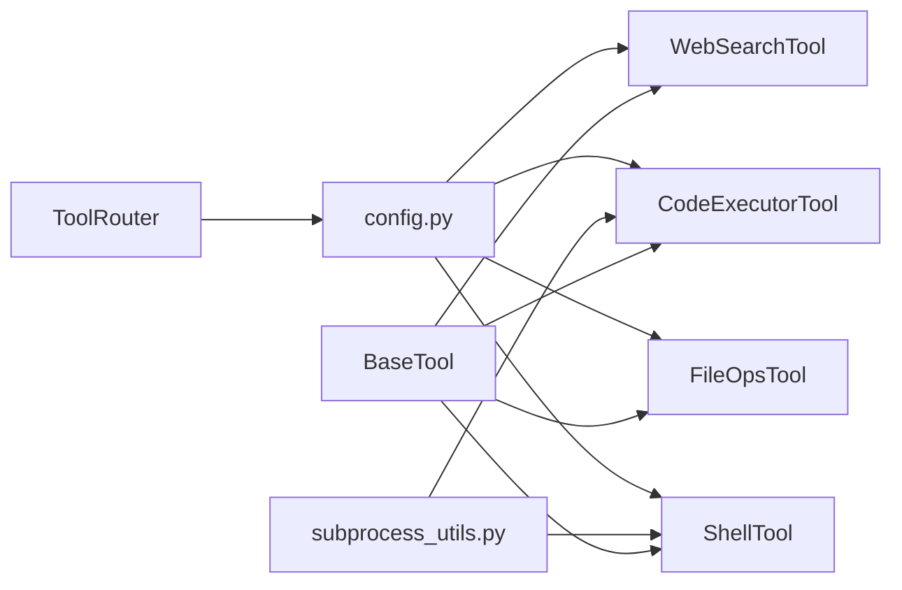

# 内置工具实现

<cite>
**本文引用的文件**
- [tools/base.py](file://tools/base.py)
- [tools/web_search.py](file://tools/web_search.py)
- [tools/code_executor.py](file://tools/code_executor.py)
- [tools/file_ops.py](file://tools/file_ops.py)
- [tools/shell_tool.py](file://tools/shell_tool.py)
- [tools/subprocess_utils.py](file://tools/subprocess_utils.py)
- [tools/router.py](file://tools/router.py)
- [config.py](file://config.py)
- [tests/test_shell_tool.py](file://tests/test_shell_tool.py)
- [README_CN.md](file://README_CN.md)
</cite>

## 目录
1. [简介](#简介)
2. [项目结构](#项目结构)
3. [核心组件](#核心组件)
4. [架构总览](#架构总览)
5. [详细组件分析](#详细组件分析)
6. [依赖分析](#依赖分析)
7. [性能考量](#性能考量)
8. [故障排查指南](#故障排查指南)
9. [结论](#结论)
10. [附录](#附录)

## 简介
本文件系统性梳理 Manus Demo 中的内置工具实现，重点覆盖以下工具：
- WebSearchTool：搜索引擎集成与查询处理机制
- CodeExecutorTool：代码执行沙箱安全机制与结果处理
- FileOpsTool：文件系统操作能力与权限控制
- ShellTool：命令执行与安全限制

同时，文档对比各工具的功能特点、使用场景与性能考虑，提供参数说明、错误处理策略、异常情况处理方法，以及工具间的协作模式与数据传递机制。

## 项目结构
工具层位于 tools/ 目录，包含抽象基类 BaseTool 与四个具体工具实现，另有工具路由工具 router.py 用于失败时的替代建议生成。配置项集中于 config.py，子进程执行与安全环境构建位于 subprocess_utils.py。

图表来源
- [tools/base.py:22-175](file://tools/base.py#L22-L175)
- [tools/web_search.py:56-113](file://tools/web_search.py#L56-L113)
- [tools/code_executor.py:25-102](file://tools/code_executor.py#L25-L102)
- [tools/file_ops.py:23-138](file://tools/file_ops.py#L23-L138)
- [tools/shell_tool.py:25-152](file://tools/shell_tool.py#L25-L152)
- [tools/router.py:47-168](file://tools/router.py#L47-L168)
- [tools/subprocess_utils.py:38-156](file://tools/subprocess_utils.py#L38-L156)
- [config.py:69-77](file://config.py#L69-L77)

章节来源
- [README_CN.md:145-151](file://README_CN.md#L145-L151)
- [tools/__init__.py:1-8](file://tools/__init__.py#L1-L8)

## 核心组件
- BaseTool：定义工具统一接口（name/description/parameters_schema/execute），并提供带追踪的 traced_execute()，支持 OpenAI function calling 格式转换。
- WebSearchTool：提供模拟网络搜索，支持按关键词匹配返回预设结果，可扩展对接真实搜索 API。
- CodeExecutorTool：在沙箱子进程中执行 Python 代码，具备超时、并发限制、输出截断与安全环境构建。
- FileOpsTool：在沙箱目录内进行文件读写与列出，严格路径穿越防护。
- ShellTool：在沙箱子进程中执行 shell 命令，具备黑名单过滤、超时、并发限制、输出截断与安全环境构建。
- ToolRouter：在 ReAct 循环中对工具失败进行统计与替代建议，提升鲁棒性。

章节来源
- [tools/base.py:22-175](file://tools/base.py#L22-L175)
- [tools/web_search.py:56-113](file://tools/web_search.py#L56-L113)
- [tools/code_executor.py:25-102](file://tools/code_executor.py#L25-L102)
- [tools/file_ops.py:23-138](file://tools/file_ops.py#L23-L138)
- [tools/shell_tool.py:25-152](file://tools/shell_tool.py#L25-L152)
- [tools/router.py:47-168](file://tools/router.py#L47-L168)

## 架构总览
工具层通过统一的 BaseTool 接口与 OpenAI function calling schema 与上层 LLM 对接；具体工具通过 subprocess_utils 提供的安全子进程执行能力完成外部系统交互；配置模块集中管理超时、并发、输出限制与沙箱目录等关键参数。

图表来源
- [tools/base.py:60-124](file://tools/base.py#L60-L124)
- [tools/code_executor.py:80-102](file://tools/code_executor.py#L80-L102)
- [tools/shell_tool.py:129-152](file://tools/shell_tool.py#L129-L152)
- [tools/subprocess_utils.py:62-156](file://tools/subprocess_utils.py#L62-L156)

## 详细组件分析

### WebSearchTool（网络搜索）
- 功能概述
  - 提供模拟网络搜索，返回预设结果；支持按关键词匹配返回不同类别结果，否则回退默认结果。
  - 参数 schema 仅要求 query 字段，便于 LLM 直接生成。
- 查询处理机制
  - execute() 从 kwargs 提取 query，记录日志，调用 _mock_search() 获取结果，格式化为人类可读文本。
  - _mock_search() 将查询词小写后匹配 MOCK_RESULTS 的关键字，命中则返回对应结果集，否则返回默认结果集。
- 与真实搜索 API 的对接
  - 通过替换 _mock_search() 方法即可接入真实搜索 API（如 SerpAPI、Tavily、DuckDuckGo），保持 execute() 与 schema 不变。
- 使用场景
  - 需要快速获取外部信息的场景，作为 ReAct 循环的观察环节。
- 错误处理
  - 当 query 缺失时，返回明确错误提示；格式化输出包含标题、摘要与 URL，便于后续处理。
- 性能与安全
  - 本地模拟，无网络开销；若接入真实 API，需关注超时与速率限制。

图表来源
- [tools/web_search.py:87-113](file://tools/web_search.py#L87-L113)

章节来源
- [tools/web_search.py:56-113](file://tools/web_search.py#L56-L113)
- [README_CN.md:80](file://README_CN.md#L80)

### CodeExecutorTool（代码执行）
- 功能概述
  - 在沙箱子进程中执行 Python 代码，支持超时、并发限制、输出截断与安全环境构建。
- 沙箱与安全机制
  - 使用 asyncio 子进程执行，确保超时后强制 kill 并等待，避免孤儿进程。
  - 环境变量经 build_safe_env() 清理敏感键，防止泄露。
  - 输出大小受 SUBPROCESS_MAX_OUTPUT_BYTES 限制，超限截断并附加标记。
- 并发控制
  - 类级信号量限制最大并发数，避免资源争用。
- 结果处理
  - 汇总 stdout/stderr/returncode，若无输出则返回“成功但无输出”提示。
- 使用场景
  - 需要执行 LLM 生成的 Python 代码进行计算、数据处理或脚本自动化。
- 错误处理
  - 超时返回超时错误；异常捕获并返回错误信息；空代码返回明确错误。
- 性能考量
  - 超时与输出限制保障稳定性；并发限制避免 CPU/IO 抖动。

图表来源
- [tools/code_executor.py:64-102](file://tools/code_executor.py#L64-L102)
- [tools/subprocess_utils.py:62-156](file://tools/subprocess_utils.py#L62-L156)

章节来源
- [tools/code_executor.py:25-102](file://tools/code_executor.py#L25-L102)
- [tools/subprocess_utils.py:38-156](file://tools/subprocess_utils.py#L38-L156)
- [config.py:71-77](file://config.py#L71-L77)

### FileOpsTool（文件系统操作）
- 功能概述
  - 在配置的沙箱目录内进行文件读取、写入与列出，严格防止路径穿越。
- 路径与权限控制
  - _safe_path() 使用 realpath 防止 ../..、符号链接逃逸；仅允许在 SANDBOX_DIR 内访问。
  - 写入时自动创建子目录；读取时检查文件存在性。
- 结果处理
  - list 返回文件清单；read 返回内容；write 返回写入字节数。
- 使用场景
  - 需要在受限目录内进行文件读写与清单查看的任务。
- 错误处理
  - 路径逃逸返回“访问被拒绝”；文件不存在返回“未找到”；异常返回错误信息。
- 性能考量
  - 本地文件操作，延迟低；注意磁盘 IO 与目录遍历成本。

图表来源
- [tools/file_ops.py:73-138](file://tools/file_ops.py#L73-L138)

章节来源
- [tools/file_ops.py:23-138](file://tools/file_ops.py#L23-L138)
- [config.py:71](file://config.py#L71)

### ShellTool（命令执行）
- 功能概述
  - 在沙箱子进程中执行 shell 命令，支持超时、并发限制、输出截断与安全环境构建。
- 安全限制
  - 黑名单正则匹配破坏性命令与高危模式（如 rm -rf、sudo、curl|sh、systemctl 等），命中即拦截。
- 并发与超时
  - 类级信号量限制并发；默认超时来自 SHELL_EXEC_TIMEOUT；超时后强制 kill 并等待。
- 结果处理
  - 汇总 stdout/stderr/returncode；无输出返回“成功但无输出”提示。
- 使用场景
  - 需要执行系统命令进行环境探测、文件处理、网络请求等任务。
- 错误处理
  - 空命令返回错误；黑名单命中返回“被阻止”提示；超时返回超时错误；异常返回错误信息。
- 性能考量
  - 黑名单匹配与子进程管理带来额外开销；合理设置超时与并发限制。

图表来源
- [tools/shell_tool.py:99-152](file://tools/shell_tool.py#L99-L152)
- [tools/subprocess_utils.py:62-156](file://tools/subprocess_utils.py#L62-L156)

章节来源
- [tools/shell_tool.py:25-152](file://tools/shell_tool.py#L25-L152)
- [tests/test_shell_tool.py:80-135](file://tests/test_shell_tool.py#L80-L135)
- [config.py:71-77](file://config.py#L71-L77)

### 工具路由（ToolRouter）
- 功能概述
  - 在 ReAct 循环中追踪每个节点的工具使用统计，当连续失败超过阈值时向 LLM 注入替代工具建议，避免工具失败死循环。
- 统计与建议
  - 记录 calls、failures、consecutive_failures；超过阈值时建议可用替代工具集合。
- 使用方式
  - 执行前注入提示；成功后 record_success() 重置连续失败；失败后 record_failure() 累加连续失败；下次 LLM 调用前通过 get_hint() 获取上下文提示。
- 与工具协作
  - 与 BaseTool 的 traced_execute() 协作，记录工具调用结果，从而在 ReAct 循环中自动生效。

图表来源
- [tools/router.py:34-168](file://tools/router.py#L34-L168)

章节来源
- [tools/router.py:47-168](file://tools/router.py#L47-L168)
- [config.py:54](file://config.py#L54)

## 依赖分析
- 工具与配置
  - 所有工具依赖 config.py 中的超时、并发、输出限制与沙箱目录等配置。
- 子进程与安全
  - CodeExecutorTool 与 ShellTool 共享 subprocess_utils 的 run_with_limits 与 build_safe_env，确保一致的安全与性能行为。
- 路由与追踪
  - ToolRouter 与 BaseTool 的 traced_execute() 协作，形成“失败统计 → 建议注入”的闭环。

图表来源
- [config.py:69-77](file://config.py#L69-L77)
- [tools/subprocess_utils.py:38-156](file://tools/subprocess_utils.py#L38-L156)
- [tools/router.py:65-73](file://tools/router.py#L65-L73)
- [tools/base.py:22-58](file://tools/base.py#L22-L58)

章节来源
- [tools/base.py:22-175](file://tools/base.py#L22-L175)
- [tools/subprocess_utils.py:38-156](file://tools/subprocess_utils.py#L38-L156)
- [tools/router.py:47-168](file://tools/router.py#L47-L168)
- [config.py:69-77](file://config.py#L69-L77)

## 性能考量
- 超时与并发
  - CODE_EXEC_TIMEOUT 与 SHELL_EXEC_TIMEOUT 控制单次执行上限；CODE_MAX_CONCURRENT 与 SHELL_MAX_CONCURRENT 控制并发度，避免资源争用。
- 输出限制
  - SUBPROCESS_MAX_OUTPUT_BYTES 防止内存耗尽，超限截断并标记。
- I/O 与路径校验
  - FileOpsTool 的路径解析与目录遍历成本较低，但需避免深层目录导致的性能下降。
- 安全检查
  - ShellTool 的黑名单匹配与子进程管理带来额外开销，建议合理设置超时与并发。

章节来源
- [config.py:71-77](file://config.py#L71-L77)
- [tools/subprocess_utils.py:104-156](file://tools/subprocess_utils.py#L104-L156)
- [tools/shell_tool.py:122-127](file://tools/shell_tool.py#L122-L127)

## 故障排查指南
- WebSearchTool
  - 确认 query 参数是否传入；若返回默认结果，检查关键词是否命中 MOCK_RESULTS 的关键字。
- CodeExecutorTool
  - 检查 CODE_EXEC_TIMEOUT 是否过短；查看 stdout/stderr/returncode；确认 SANDBOX_DIR 是否可写。
- FileOpsTool
  - 检查 filename 是否为相对路径且未包含 ..；确认 SANDBOX_DIR 权限；查看是否存在文件。
- ShellTool
  - 检查命令是否命中黑名单；确认 SHELL_EXEC_TIMEOUT 是否过短；查看输出是否被截断；确认环境变量是否被清理。
- ToolRouter
  - 检查 TOOL_FAILURE_THRESHOLD 设置；确认 record_success()/record_failure() 是否正确调用；查看 get_hint() 返回的提示内容。

章节来源
- [tests/test_shell_tool.py:80-135](file://tests/test_shell_tool.py#L80-L135)
- [tools/code_executor.py:64-78](file://tools/code_executor.py#L64-L78)
- [tools/file_ops.py:108-138](file://tools/file_ops.py#L108-L138)
- [tools/shell_tool.py:99-121](file://tools/shell_tool.py#L99-L121)
- [tools/router.py:82-100](file://tools/router.py#L82-L100)

## 结论
- WebSearchTool 提供简洁的模拟搜索接口，易于扩展至真实搜索 API。
- CodeExecutorTool 与 ShellTool 通过统一的子进程与安全机制，保障执行稳定性与安全性。
- FileOpsTool 严格限制在沙箱目录内，有效防止路径穿越。
- ToolRouter 通过失败统计与替代建议，显著提升 ReAct 循环的鲁棒性。
- 建议结合配置项合理设置超时、并发与输出限制，以获得最佳性能与安全性平衡。

## 附录

### 工具参数与使用示例（路径引用）
- WebSearchTool
  - 参数：query（字符串，必填）
  - 示例：[tools/web_search.py:87-99](file://tools/web_search.py#L87-L99)
- CodeExecutorTool
  - 参数：code（字符串，必填）
  - 示例：[tools/code_executor.py:64-102](file://tools/code_executor.py#L64-L102)
- FileOpsTool
  - 参数：action（枚举："read"|"write"|"list"，必填），filename（字符串，读/写时必填），content（字符串，写时必填）
  - 示例：[tools/file_ops.py:73-86](file://tools/file_ops.py#L73-L86)
- ShellTool
  - 参数：command（字符串，必填），timeout（整数，可选）
  - 示例：[tools/shell_tool.py:99-121](file://tools/shell_tool.py#L99-L121)

### 错误处理与异常情况
- 超时：返回“超时”提示，包含超时秒数。
- 空参数：返回“无参数/无命令”错误。
- 路径逃逸：返回“访问被拒绝”。
- 黑名单命中：返回“命令被阻止”。
- 输出过大：返回“输出被截断”提示。
- 子进程异常：返回“执行错误”并记录异常。

章节来源
- [tools/code_executor.py:74-77](file://tools/code_executor.py#L74-L77)
- [tools/file_ops.py:113-114](file://tools/file_ops.py#L113-L114)
- [tools/shell_tool.py:108-110](file://tools/shell_tool.py#L108-L110)
- [tools/subprocess_utils.py:151-155](file://tools/subprocess_utils.py#L151-L155)