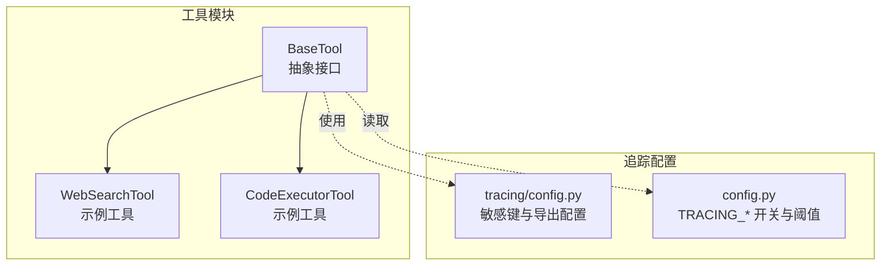
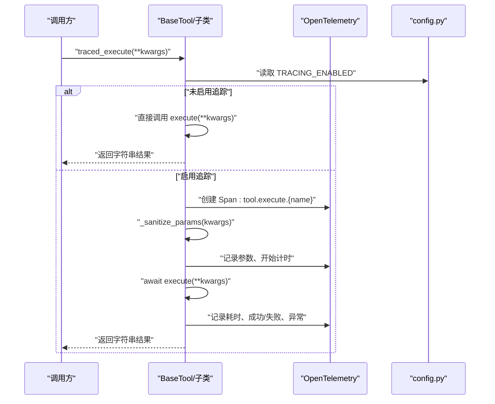
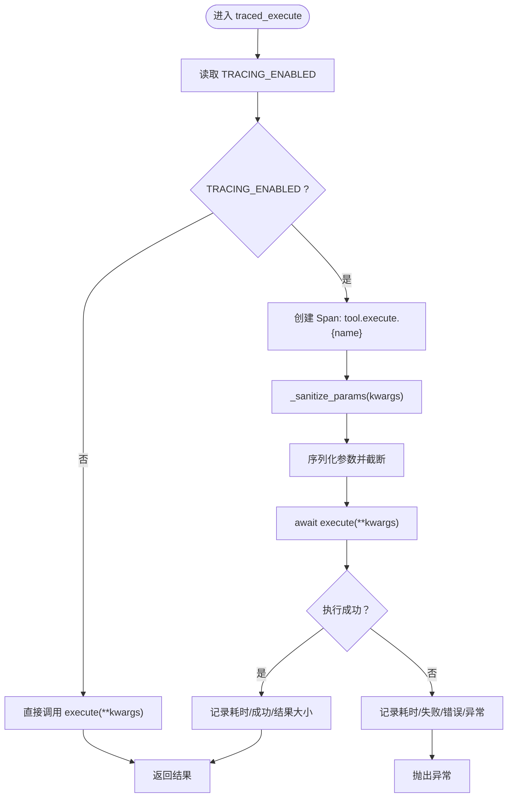
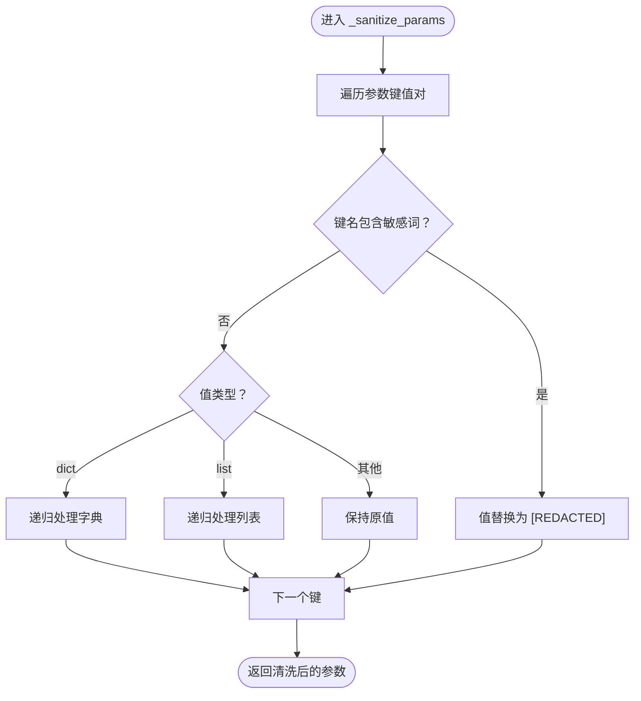
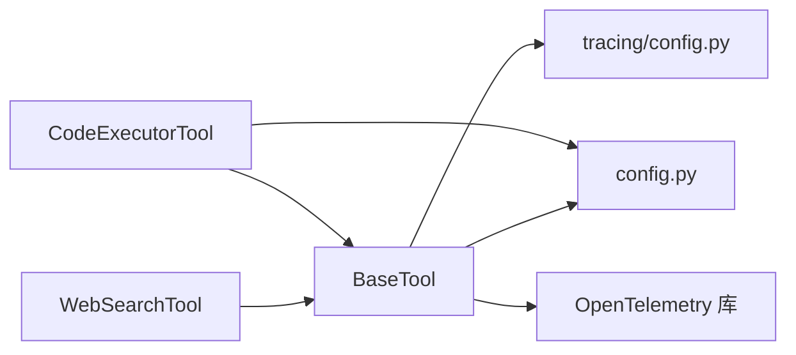

# 工具抽象接口

<cite>
**本文引用的文件**
- [tools/base.py](file://tools/base.py)
- [tracing/config.py](file://tracing/config.py)
- [config.py](file://config.py)
- [tools/web_search.py](file://tools/web_search.py)
- [tools/code_executor.py](file://tools/code_executor.py)
- [tests/test_tracing.py](file://tests/test_tracing.py)
- [tools/__init__.py](file://tools/__init__.py)
</cite>

## 目录
1. [简介](#简介)
2. [项目结构](#项目结构)
3. [核心组件](#核心组件)
4. [架构总览](#架构总览)
5. [详细组件分析](#详细组件分析)
6. [依赖分析](#依赖分析)
7. [性能考量](#性能考量)
8. [故障排查指南](#故障排查指南)
9. [结论](#结论)
10. [附录](#附录)

## 简介
本文件围绕 BaseTool 抽象接口展开，系统性阐述其设计原则、架构决策与实现细节，重点覆盖以下方面：
- 抽象方法定义：name、description、parameters_schema、execute
- 工具参数 Schema 的 JSON 格式要求与验证机制
- traced_execute 的实现原理：OpenTelemetry 追踪集成、性能监控与错误处理
- _sanitize_params 的敏感信息过滤机制
- to_openai_tool 的格式转换说明
- 如何正确继承 BaseTool 实现自定义工具
- 异步执行模型的优势与最佳实践

## 项目结构
BaseTool 位于 tools/base.py，是所有工具类的抽象基类。具体工具如 WebSearchTool、CodeExecutorTool 等均继承自 BaseTool，并通过 parameters_schema 提供 OpenAI 函数调用所需的 JSON Schema，通过 traced_execute 提供带追踪的执行入口。

图表来源
- [tools/base.py:22-175](file://tools/base.py#L22-L175)
- [tracing/config.py:14-79](file://tracing/config.py#L14-L79)
- [config.py:98-109](file://config.py#L98-L109)

章节来源
- [tools/base.py:1-175](file://tools/base.py#L1-L175)
- [tools/__init__.py:1-8](file://tools/__init__.py#L1-L8)

## 核心组件
- 抽象接口 BaseTool：定义工具的统一契约，包括名称、描述、参数 Schema 以及异步执行方法。
- traced_execute：带 OpenTelemetry 追踪的执行入口，支持零开销降级与参数脱敏。
- _sanitize_params：递归脱敏敏感参数，避免在追踪属性中泄露。
- to_openai_tool：将工具转换为 OpenAI function calling 所需的工具描述格式。

章节来源
- [tools/base.py:22-175](file://tools/base.py#L22-L175)

## 架构总览
BaseTool 将“工具行为”与“可观测性”解耦：业务侧仅需实现抽象方法；调用方统一通过 traced_execute 获取自动追踪能力。当 TRACING_ENABLED 关闭时，traced_execute 直接委托 execute，零开销。

图表来源
- [tools/base.py:60-124](file://tools/base.py#L60-L124)
- [config.py:102-109](file://config.py#L102-L109)

## 详细组件分析

### 抽象方法与职责
- name：工具唯一标识，用于函数调用与追踪命名。
- description：人类可读的工具用途说明，帮助 LLM 判断何时调用该工具。
- parameters_schema：JSON Schema，描述工具参数结构，供 LLM 生成合法参数。
- execute：异步执行工具逻辑，返回字符串结果，便于后续处理。

章节来源
- [tools/base.py:29-58](file://tools/base.py#L29-L58)

### traced_execute：追踪执行流程
- 条件分支：根据 TRACING_ENABLED 决定是否创建 Span。
- 参数脱敏与截断：对传入参数进行递归脱敏，并按 TRACING_MAX_ATTRIBUTE_LENGTH 截断，避免属性过长。
- 性能指标：记录执行耗时、结果大小、成功状态；异常时记录错误信息与异常事件。
- 降级策略：当缺少 OpenTelemetry 依赖时，回退到直接执行，保证兼容性。

图表来源
- [tools/base.py:60-124](file://tools/base.py#L60-L124)
- [tracing/config.py:41](file://tracing/config.py#L41)
- [config.py:102-109](file://config.py#L102-L109)

章节来源
- [tools/base.py:60-124](file://tools/base.py#L60-L124)

### _sanitize_params：敏感信息过滤机制
- 敏感键匹配：基于 tracing/config.py 中的 SENSITIVE_KEYS 集合，对参数键名进行模糊匹配（不区分大小写）。
- 递归处理：对嵌套字典与列表进行递归脱敏，确保深层结构也被处理。
- 脱敏输出：命中敏感键的值被替换为占位符，避免泄露。

图表来源
- [tools/base.py:125-146](file://tools/base.py#L125-L146)
- [tracing/config.py:73-78](file://tracing/config.py#L73-L78)

章节来源
- [tools/base.py:125-146](file://tools/base.py#L125-L146)
- [tracing/config.py:73-78](file://tracing/config.py#L73-L78)

### to_openai_tool：OpenAI 工具格式转换
- 目标格式：将工具转换为 OpenAI function calling 所需的工具描述对象，包含 type、function.name、function.description、function.parameters。
- 使用场景：可直接作为 chat completions API 的 tools 参数传入。

章节来源
- [tools/base.py:153-174](file://tools/base.py#L153-L174)

### JSON Schema 参数规范与验证机制
- Schema 结构：parameters_schema 必须返回一个 JSON Schema 对象，描述工具期望的参数结构。
- 字段要求：通常包含 properties 与 required 字段，明确各参数类型与必填项。
- 验证机制：由 LLM 在函数调用时依据 Schema 校验参数合法性；BaseTool 本身不进行二次校验，但 traced_execute 会记录参数（经脱敏与截断）以便审计。

章节来源
- [tools/web_search.py:74-85](file://tools/web_search.py#L74-L85)
- [tools/code_executor.py:51-62](file://tools/code_executor.py#L51-L62)
- [tools/base.py:45-51](file://tools/base.py#L45-L51)

### 异步执行模型：优势与最佳实践
- 优势
  - 并发友好：工具执行采用 async/await，便于在高并发场景下提升吞吐。
  - 资源隔离：结合信号量等并发控制手段，可限制资源占用。
  - 可观测性：traced_execute 统一采集性能与错误指标，便于问题定位。
- 最佳实践
  - 使用 asyncio.Semaphore 控制并发度，避免资源争用。
  - 在工具内部设置合理超时，防止阻塞。
  - 通过 traced_execute 统一入口，确保所有调用具备一致的追踪与日志。

章节来源
- [tools/code_executor.py:31-37](file://tools/code_executor.py#L31-L37)
- [tools/code_executor.py:64-78](file://tools/code_executor.py#L64-L78)
- [tools/base.py:60-124](file://tools/base.py#L60-L124)

### 示例：如何正确继承 BaseTool 并实现自定义工具
- 步骤
  - 继承 BaseTool，实现 name、description、parameters_schema、execute。
  - 在 execute 中处理业务逻辑，返回字符串结果。
  - 若需要 OpenAI 函数调用能力，可直接使用 to_openai_tool 生成工具描述。
  - 推荐通过 traced_execute 调用，以获得统一的追踪与性能指标。
- 参考实现
  - WebSearchTool：演示了最小可用 Schema 与字符串结果格式。
  - CodeExecutorTool：展示了并发控制、超时处理与错误包装。

章节来源
- [tools/web_search.py:56-113](file://tools/web_search.py#L56-L113)
- [tools/code_executor.py:25-102](file://tools/code_executor.py#L25-L102)
- [tools/base.py:153-174](file://tools/base.py#L153-L174)

## 依赖分析
- BaseTool 依赖
  - config.py：读取 TRACING_ENABLED、TRACING_MAX_ATTRIBUTE_LENGTH 等追踪相关配置。
  - tracing/config.py：提供 SENSITIVE_KEYS 用于参数脱敏。
  - OpenTelemetry：在启用追踪时创建 Span 并记录属性。
- 工具类依赖
  - 具体工具类（如 CodeExecutorTool）依赖 config.py 的并发与超时配置，以及 subprocess 工具进行安全执行。

图表来源
- [tools/base.py:74-84](file://tools/base.py#L74-L84)
- [tracing/config.py:17-43](file://tracing/config.py#L17-L43)
- [config.py:102-109](file://config.py#L102-L109)

章节来源
- [tools/base.py:74-84](file://tools/base.py#L74-L84)
- [tracing/config.py:17-43](file://tracing/config.py#L17-L43)
- [config.py:102-109](file://config.py#L102-L109)

## 性能考量
- 零开销降级：当 TRACING_ENABLED 关闭时，traced_execute 直接调用 execute，避免额外开销。
- 参数截断：对参数进行序列化与截断，防止属性过长影响导出性能。
- 并发控制：工具类可使用 asyncio.Semaphore 控制并发，避免资源争用导致的抖动。
- 超时与错误：在工具内部设置合理超时与错误包装，减少长时间阻塞对整体性能的影响。

章节来源
- [tools/base.py:75-76](file://tools/base.py#L75-L76)
- [tools/base.py:97-100](file://tools/base.py#L97-L100)
- [tools/code_executor.py:31-37](file://tools/code_executor.py#L31-L37)
- [tools/code_executor.py:74-77](file://tools/code_executor.py#L74-L77)

## 故障排查指南
- 追踪未生效
  - 检查 TRACING_ENABLED 是否开启；确认 TRACING_BACKEND、TRACING_ENDPOINT 等配置正确。
  - 确认 OpenTelemetry 依赖已安装。
- 参数未记录或被截断
  - 检查 TRACING_MAX_ATTRIBUTE_LENGTH 设置是否过小；确认参数是否包含敏感键被脱敏。
- 工具执行异常
  - 查看 traced_execute 记录的 tool.error 与异常事件；检查工具内部超时与错误包装逻辑。
- 单元测试参考
  - 可参考测试用例对 traced_execute 的行为进行验证。

章节来源
- [tests/test_tracing.py:569-595](file://tests/test_tracing.py#L569-L595)
- [config.py:102-109](file://config.py#L102-L109)
- [tracing/config.py:41](file://tracing/config.py#L41)

## 结论
BaseTool 通过清晰的抽象接口与统一的追踪入口，实现了工具行为与可观测性的解耦。其参数 Schema 设计与 OpenAI 兼容，便于在函数调用场景中使用；traced_execute 提供了完善的性能监控与错误处理能力；_sanitize_params 保障了敏感信息的安全。配合异步执行模型与并发控制，BaseTool 为构建可扩展、可观测、可维护的工具体系提供了坚实基础。

## 附录
- 工具注册与导出
  - tools/__init__.py 暴露 BaseTool 与其他工具类，便于统一导入与使用。

章节来源
- [tools/__init__.py:1-8](file://tools/__init__.py#L1-L8)