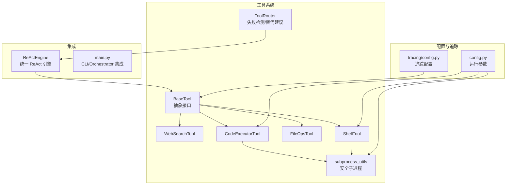
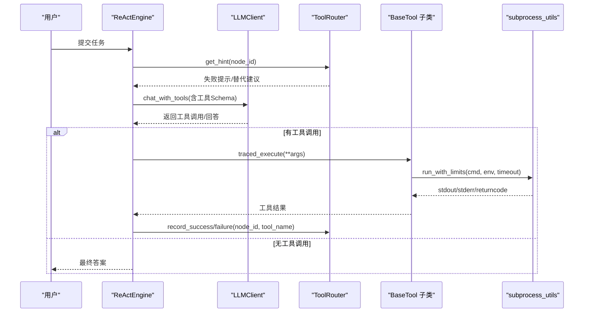
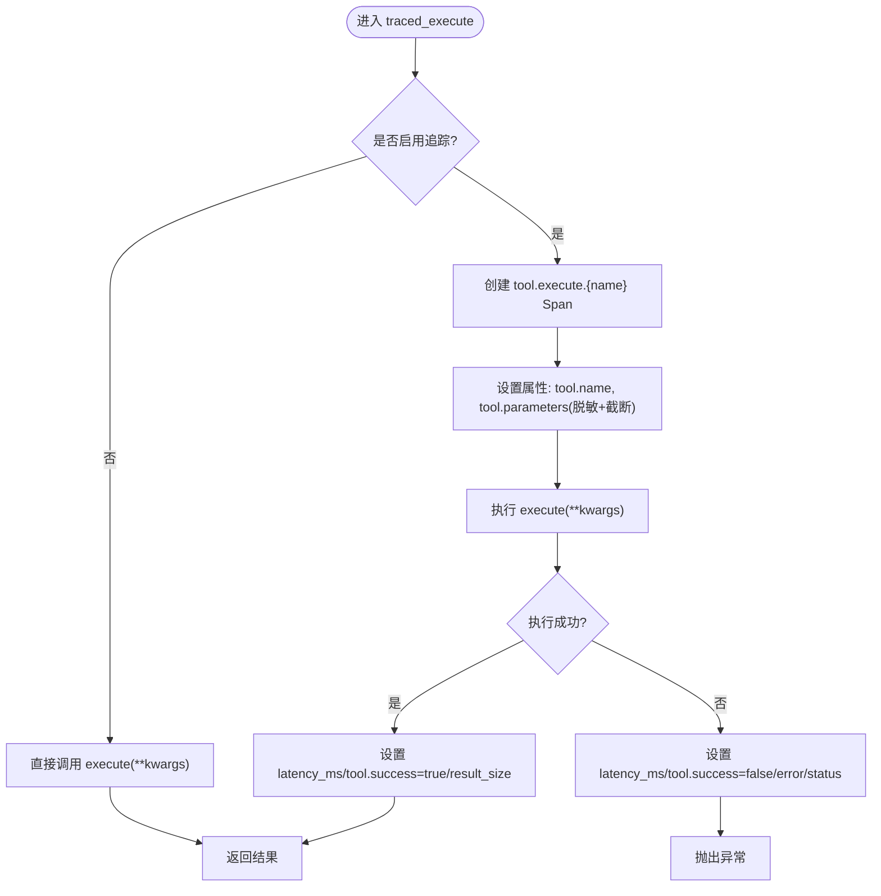
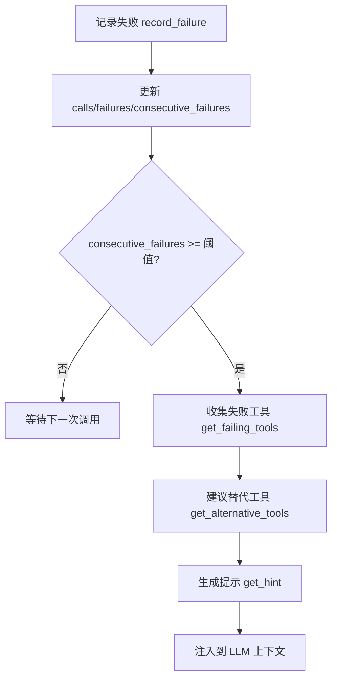
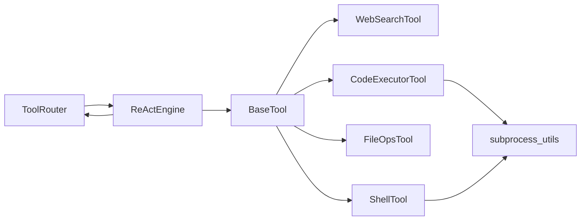

# 工具系统

<cite>
**本文引用的文件**
- [tools/base.py](file://tools/base.py)
- [tools/router.py](file://tools/router.py)
- [tools/web_search.py](file://tools/web_search.py)
- [tools/code_executor.py](file://tools/code_executor.py)
- [tools/file_ops.py](file://tools/file_ops.py)
- [tools/shell_tool.py](file://tools/shell_tool.py)
- [tools/subprocess_utils.py](file://tools/subprocess_utils.py)
- [config.py](file://config.py)
- [tracing/config.py](file://tracing/config.py)
- [main.py](file://main.py)
- [react/engine.py](file://react/engine.py)
- [tests/test_real_tools.py](file://tests/test_real_tools.py)
- [tests/test_shell_tool.py](file://tests/test_shell_tool.py)
- [tests/test_dag_capabilities.py](file://tests/test_dag_capabilities.py)
</cite>

## 目录
1. [简介](#简介)
2. [项目结构](#项目结构)
3. [核心组件](#核心组件)
4. [架构总览](#架构总览)
5. [详细组件分析](#详细组件分析)
6. [依赖分析](#依赖分析)
7. [性能考量](#性能考量)
8. [故障排除指南](#故障排除指南)
9. [结论](#结论)
10. [附录](#附录)

## 简介
本文件系统性梳理 manus_demo 的工具系统，重点围绕以下方面展开：
- BaseTool 抽象接口的设计原则、参数 Schema 与异步执行模型
- 内置工具 WebSearchTool、CodeExecutorTool、FileOpsTool、ShellTool 的功能与使用方法
- 工具路由机制 ToolRouter 的实现与行为（失败检测、阈值触发、替代工具建议）
- 添加新工具的开发指南（规范、Schema 设计、集成测试）
- 安全与沙箱机制（子进程隔离、环境变量脱敏、输出截断、命令黑名单）
- 故障排除与调试技巧

## 项目结构
工具系统位于 tools 目录，核心文件如下：
- 抽象基类：tools/base.py
- 工具路由：tools/router.py
- 内置工具：tools/web_search.py、tools/code_executor.py、tools/file_ops.py、tools/shell_tool.py
- 子进程工具：tools/subprocess_utils.py
- 配置：config.py、tracing/config.py
- 集成入口：main.py、react/engine.py
- 测试：tests/test_real_tools.py、tests/test_shell_tool.py、tests/test_dag_capabilities.py

**图表来源**
- [tools/base.py:22-175](file://tools/base.py#L22-L175)
- [tools/router.py:47-168](file://tools/router.py#L47-L168)
- [tools/web_search.py:56-113](file://tools/web_search.py#L56-L113)
- [tools/code_executor.py:25-102](file://tools/code_executor.py#L25-L102)
- [tools/file_ops.py:23-138](file://tools/file_ops.py#L23-L138)
- [tools/shell_tool.py:25-152](file://tools/shell_tool.py#L25-L152)
- [tools/subprocess_utils.py:38-156](file://tools/subprocess_utils.py#L38-L156)
- [config.py:69-109](file://config.py#L69-L109)
- [tracing/config.py:14-79](file://tracing/config.py#L14-L79)
- [react/engine.py:43-246](file://react/engine.py#L43-L246)
- [main.py:449-455](file://main.py#L449-L455)

**章节来源**
- [tools/base.py:1-175](file://tools/base.py#L1-L175)
- [tools/router.py:1-168](file://tools/router.py#L1-L168)
- [tools/web_search.py:1-113](file://tools/web_search.py#L1-L113)
- [tools/code_executor.py:1-102](file://tools/code_executor.py#L1-L102)
- [tools/file_ops.py:1-138](file://tools/file_ops.py#L1-L138)
- [tools/shell_tool.py:1-152](file://tools/shell_tool.py#L1-L152)
- [tools/subprocess_utils.py:1-156](file://tools/subprocess_utils.py#L1-L156)
- [config.py:1-109](file://config.py#L1-L109)
- [tracing/config.py:1-79](file://tracing/config.py#L1-L79)
- [main.py:449-455](file://main.py#L449-L455)
- [react/engine.py:43-246](file://react/engine.py#L43-L246)

## 核心组件
- BaseTool 抽象接口：定义工具的 name/description/parameters_schema，并提供异步 execute 与带追踪的 traced_execute。traced_execute 在开启追踪时自动记录参数、耗时、结果大小、错误等属性，并对敏感参数进行脱敏。
- ToolRouter 工具路由：维护每个节点的工具使用统计（总调用、失败、连续失败），在连续失败超过阈值时建议替代工具，并生成提示注入到 LLM 的上下文中。
- 内置工具：
  - WebSearchTool：基于预设 mock 结果的网络搜索工具，支持通过替换内部方法接入真实搜索 API。
  - CodeExecutorTool：在沙箱子进程中执行 Python 代码，带超时与并发限制，捕获 stdout/stderr。
  - FileOpsTool：在沙箱目录内进行文件读写与列出，严格路径校验防止越权访问。
  - ShellTool：在沙箱子进程中执行 shell 命令，带命令黑名单、超时与并发限制。
- 子进程工具 subprocess_utils：提供安全的子进程执行，包括环境变量脱敏、输出大小限制、超时与孤儿进程清理。

**章节来源**
- [tools/base.py:22-175](file://tools/base.py#L22-L175)
- [tools/router.py:47-168](file://tools/router.py#L47-L168)
- [tools/web_search.py:56-113](file://tools/web_search.py#L56-L113)
- [tools/code_executor.py:25-102](file://tools/code_executor.py#L25-L102)
- [tools/file_ops.py:23-138](file://tools/file_ops.py#L23-L138)
- [tools/shell_tool.py:25-152](file://tools/shell_tool.py#L25-L152)
- [tools/subprocess_utils.py:38-156](file://tools/subprocess_utils.py#L38-L156)

## 架构总览
工具系统与 ReAct 引擎、配置与追踪紧密协作：
- ReActEngine 通过 LLM 的 function calling 调用工具，使用 ToolRouter 记录工具成败，并在后续迭代中注入失败提示。
- BaseTool 的 traced_execute 在开启追踪时自动打点，记录关键指标与错误。
- 子进程工具统一由 subprocess_utils 提供安全执行能力，确保超时、输出截断与环境脱敏。

**图表来源**
- [react/engine.py:84-241](file://react/engine.py#L84-L241)
- [tools/base.py:60-124](file://tools/base.py#L60-L124)
- [tools/router.py:123-147](file://tools/router.py#L123-L147)
- [tools/subprocess_utils.py:62-156](file://tools/subprocess_utils.py#L62-L156)

**章节来源**
- [react/engine.py:43-246](file://react/engine.py#L43-L246)
- [tools/base.py:22-175](file://tools/base.py#L22-L175)
- [tools/router.py:47-168](file://tools/router.py#L47-L168)
- [tools/subprocess_utils.py:38-156](file://tools/subprocess_utils.py#L38-L156)

## 详细组件分析

### BaseTool 抽象接口
- 设计要点
  - 统一的异步执行模型：所有工具通过 async def execute 返回字符串结果，便于 LLM 处理。
  - OpenAI function calling 兼容：to_openai_tool 将 name/description/parameters_schema 转换为标准工具格式。
  - 追踪增强：traced_execute 在开启追踪时自动创建 Span，记录参数（脱敏与截断）、耗时、结果大小、错误与状态码。
  - 参数脱敏：_sanitize_params 递归清洗敏感键（如 api_key、token 等）。
- 关键流程

**图表来源**
- [tools/base.py:60-124](file://tools/base.py#L60-L124)
- [tracing/config.py:70-79](file://tracing/config.py#L70-L79)

**章节来源**
- [tools/base.py:22-175](file://tools/base.py#L22-L175)
- [tracing/config.py:14-79](file://tracing/config.py#L14-L79)

### WebSearchTool
- 功能概述
  - 基于预设 mock 结果的网络搜索工具，支持按关键词匹配返回不同结果集。
  - 可通过替换内部方法接入真实搜索 API（如 SerpAPI、Tavily、DuckDuckGo）。
- 参数 Schema
  - 必填：query（搜索关键词）
- 执行模型
  - 异步执行，返回格式化的搜索结果文本（标题、摘要、URL）

**章节来源**
- [tools/web_search.py:56-113](file://tools/web_search.py#L56-L113)

### CodeExecutorTool
- 功能概述
  - 在沙箱子进程中执行 Python 代码，支持超时、并发限制、捕获 stdout/stderr。
- 参数 Schema
  - 必填：code（Python 源码）
- 安全与性能
  - 使用 asyncio.Semaphore 控制最大并发
  - 通过 subprocess_utils.run_with_limits 设置超时与输出上限
  - 环境变量脱敏，工作目录为 SANDBOX_DIR
- 错误处理
  - 超时返回超时错误信息
  - 其他异常返回错误信息

**章节来源**
- [tools/code_executor.py:25-102](file://tools/code_executor.py#L25-L102)
- [tools/subprocess_utils.py:62-156](file://tools/subprocess_utils.py#L62-L156)
- [config.py:69-77](file://config.py#L69-L77)

### FileOpsTool
- 功能概述
  - 在沙箱目录内进行文件读取、写入与列出，严格路径校验防止路径穿越。
- 参数 Schema
  - 必填：action（枚举 read/write/list）
  - 读/写：filename（文件名）
  - 写：content（内容）
- 安全与路径校验
  - 使用 os.path.realpath 与 os.path.join 限制在 SANDBOX_DIR 内
  - 对 ../.. 等相对路径与符号链接进行解析，拒绝逃逸路径

**章节来源**
- [tools/file_ops.py:23-138](file://tools/file_ops.py#L23-L138)
- [config.py:69-71](file://config.py#L69-L71)

### ShellTool
- 功能概述
  - 在沙箱子进程中执行 shell 命令，支持超时、并发限制、命令黑名单与环境脱敏。
- 参数 Schema
  - 必填：command（命令）
  - 可选：timeout（秒）
- 安全策略
  - 命令黑名单：rm -rf、mkfs、sudo、curl|sh 管道、systemctl、printenv 等
  - 环境变量脱敏，工作目录为 SANDBOX_DIR
- 错误处理
  - 超时返回超时错误信息
  - 黑名单命中返回“命令被阻止”错误信息

**章节来源**
- [tools/shell_tool.py:25-152](file://tools/shell_tool.py#L25-L152)
- [tools/subprocess_utils.py:38-52](file://tools/subprocess_utils.py#L38-L52)
- [config.py:69-77](file://config.py#L69-L77)

### ToolRouter 工具路由
- 统计维度
  - calls：总调用次数
  - failures：失败次数
  - consecutive_failures：连续失败次数（成功后清零）
- 核心能力
  - should_suggest_alternative：判断是否超过阈值
  - get_failing_tools：返回超过阈值的工具列表
  - get_alternative_tools：建议未失败的替代工具
  - get_hint：生成注入到 LLM 的提示文本
  - get_node_summary：节点工具使用摘要（可观测性）
- 集成方式
  - ReActEngine 在每次工具调用前后记录成功/失败
  - 在每次 LLM 请求前注入失败提示

**图表来源**
- [tools/router.py:91-147](file://tools/router.py#L91-L147)
- [react/engine.py:124-127](file://react/engine.py#L124-L127)

**章节来源**
- [tools/router.py:47-168](file://tools/router.py#L47-L168)
- [react/engine.py:84-241](file://react/engine.py#L84-L241)

## 依赖分析
- 组件耦合
  - BaseTool 是所有工具的共同父类，被 WebSearchTool、CodeExecutorTool、FileOpsTool、ShellTool 继承
  - ToolRouter 仅依赖工具名称集合与配置阈值，与具体工具实现解耦
  - ReActEngine 通过工具字典与 Schema 与工具解耦
- 外部依赖
  - 子进程工具依赖 asyncio、asyncio.subprocess
  - 追踪依赖 OpenTelemetry（可选）
  - 配置依赖环境变量与 .env 文件

**图表来源**
- [tools/base.py:22-175](file://tools/base.py#L22-L175)
- [tools/router.py:47-168](file://tools/router.py#L47-L168)
- [react/engine.py:64-83](file://react/engine.py#L64-L83)
- [tools/subprocess_utils.py:38-156](file://tools/subprocess_utils.py#L38-L156)

**章节来源**
- [tools/base.py:22-175](file://tools/base.py#L22-L175)
- [tools/router.py:47-168](file://tools/router.py#L47-L168)
- [react/engine.py:64-83](file://react/engine.py#L64-L83)
- [tools/subprocess_utils.py:38-156](file://tools/subprocess_utils.py#L38-L156)

## 性能考量
- 并发控制
  - CodeExecutorTool 与 ShellTool 分别使用 asyncio.Semaphore 控制最大并发，避免资源争用
- 超时与输出限制
  - subprocess_utils.run_with_limits 提供超时与输出字节上限，防止内存与 CPU 泄漏
- 追踪开销
  - traced_execute 在追踪关闭时零开销；开启时仅增加少量元数据记录与异常记录
- 日志与可观测性
  - ToolRouter 提供节点级使用摘要，便于定位瓶颈与失败热点

**章节来源**
- [tools/code_executor.py:31-37](file://tools/code_executor.py#L31-L37)
- [tools/shell_tool.py:57-67](file://tools/shell_tool.py#L57-L67)
- [tools/subprocess_utils.py:62-101](file://tools/subprocess_utils.py#L62-L101)
- [tools/base.py:60-124](file://tools/base.py#L60-L124)
- [tools/router.py:149-162](file://tools/router.py#L149-L162)

## 故障排除指南
- 工具调用失败
  - 检查 ToolRouter 的节点摘要，确认是否存在连续失败并触发替代建议
  - 在 ReActEngine 的工具调用日志中查看具体错误文本
- Shell 命令被阻止
  - 检查命令是否命中黑名单；必要时调整命令或使用替代方案
- 代码执行超时
  - 增大 CODE_EXEC_TIMEOUT 或优化代码逻辑
- 文件操作报错
  - 确认文件名未逃逸沙箱；检查路径是否包含 ../.. 或符号链接逃逸
- 追踪未生效
  - 确认 TRACING_ENABLED=true 且安装了 OpenTelemetry；检查后端配置

**章节来源**
- [tools/router.py:149-162](file://tools/router.py#L149-L162)
- [react/engine.py:191-231](file://react/engine.py#L191-L231)
- [tools/shell_tool.py:122-127](file://tools/shell_tool.py#L122-L127)
- [config.py:69-77](file://config.py#L69-L77)
- [tools/file_ops.py:87-96](file://tools/file_ops.py#L87-L96)
- [tracing/config.py:17-43](file://tracing/config.py#L17-L43)

## 结论
工具系统以 BaseTool 为核心抽象，结合 ToolRouter 的失败检测与替代建议、ReActEngine 的统一执行框架，以及 subprocess_utils 的安全子进程能力，形成了高可用、可观测、可扩展的工具生态。通过合理的参数 Schema、并发与超时控制、命令黑名单与路径校验，系统在保证安全性的同时提供了强大的工具调用能力。

## 附录

### 添加新工具开发指南
- 开发步骤
  - 继承 BaseTool，实现 name/description/parameters_schema/execute
  - 如需追踪，使用 traced_execute；否则直接实现 execute
  - 在 tools/__init__.py 中导出新工具
  - 在 main.py 或 ReActEngine 初始化处注册工具
- 参数 Schema 设计
  - 必填字段使用 required 列表声明
  - 对敏感字段（如 API Key）避免在 Schema 中直接暴露
- 集成测试
  - 编写单元测试，覆盖正常路径、错误路径与边界条件
  - 使用真实工具测试脚本验证子进程安全与超时行为
- 安全与沙箱
  - 涉及外部命令或代码执行时，务必使用 subprocess_utils.run_with_limits
  - 对环境变量进行脱敏，避免泄露敏感信息
  - 对文件操作进行路径校验，防止路径穿越

**章节来源**
- [tools/base.py:22-175](file://tools/base.py#L22-L175)
- [tools/subprocess_utils.py:38-156](file://tools/subprocess_utils.py#L38-L156)
- [main.py:449-455](file://main.py#L449-L455)
- [tests/test_real_tools.py:13-105](file://tests/test_real_tools.py#L13-L105)
- [tests/test_shell_tool.py:14-221](file://tests/test_shell_tool.py#L14-L221)

### 配置与环境变量参考
- 工具执行超时与并发
  - CODE_EXEC_TIMEOUT、SHELL_EXEC_TIMEOUT、SHELL_MAX_CONCURRENT、CODE_MAX_CONCURRENT
- 沙箱与输出限制
  - SANDBOX_DIR、SUBPROCESS_MAX_OUTPUT_BYTES
- 工具路由阈值
  - TOOL_FAILURE_THRESHOLD
- 追踪配置
  - TRACING_ENABLED、TRACING_BACKEND、TRACING_ENDPOINT、TRACING_SERVICE_NAME、TRACING_SAMPLE_RATE、TRACING_LOG_PROMPTS、TRACING_MAX_ATTRIBUTE_LENGTH

**章节来源**
- [config.py:69-109](file://config.py#L69-L109)
- [tracing/config.py:14-79](file://tracing/config.py#L14-L79)