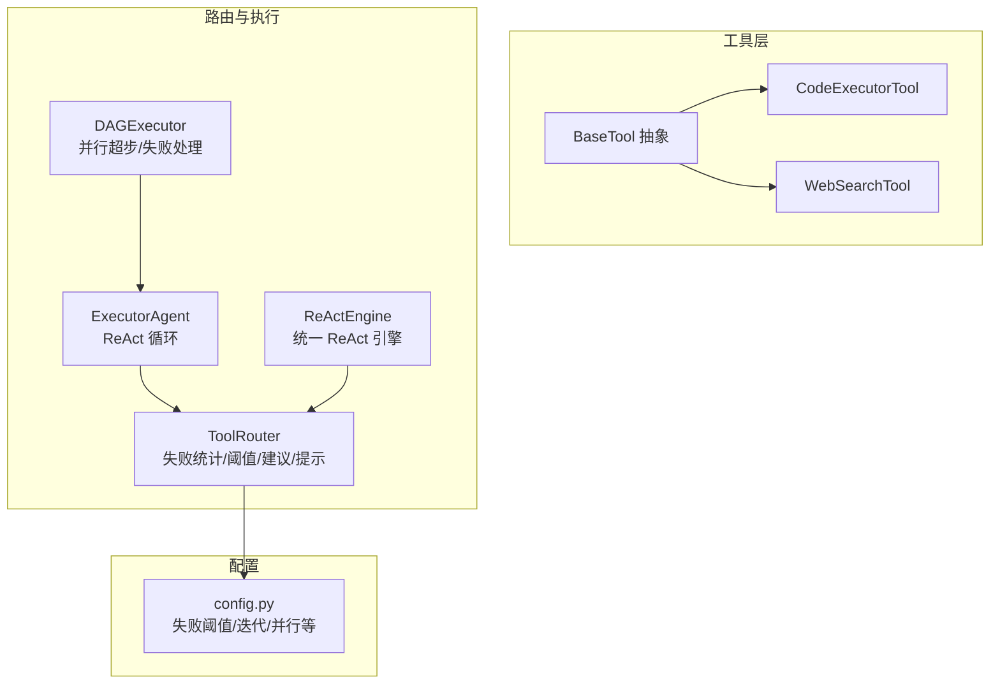
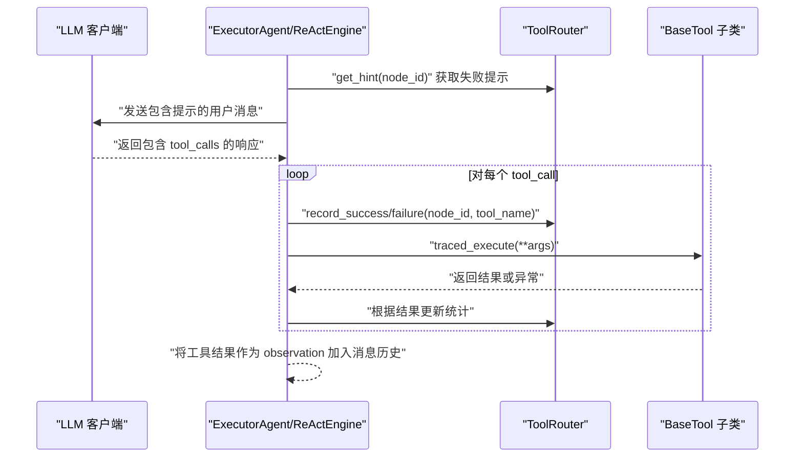
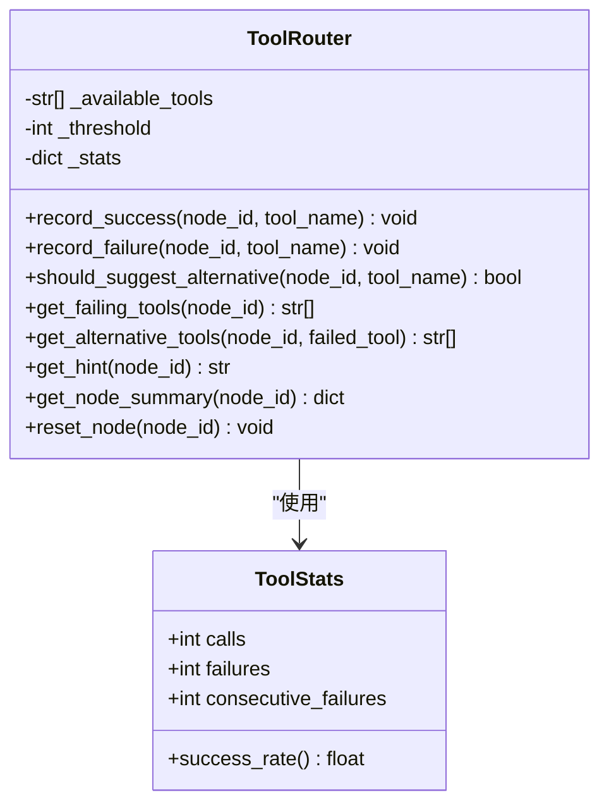
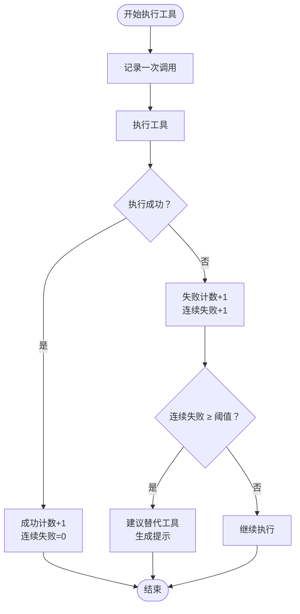
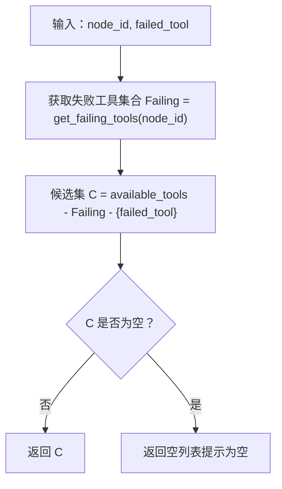
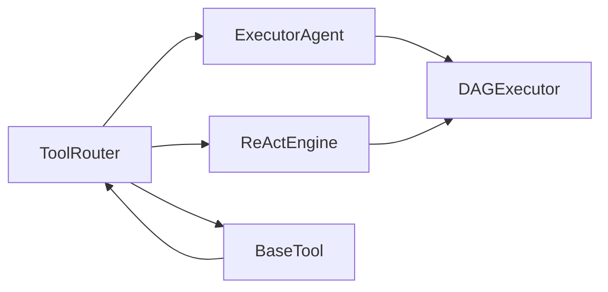
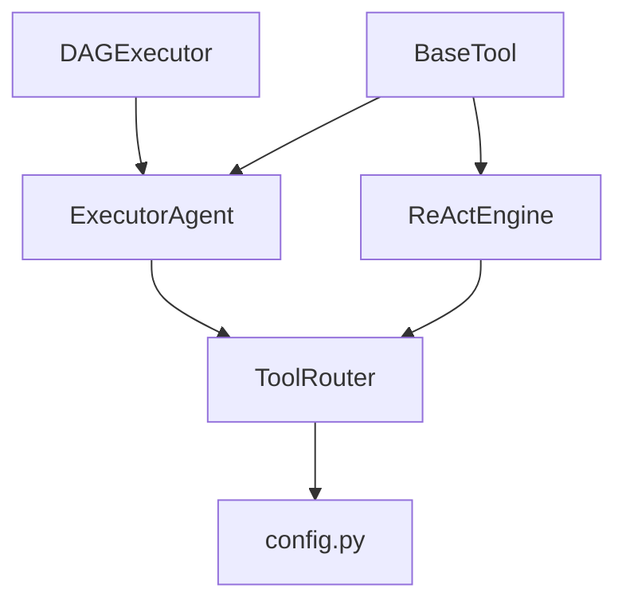

# 工具路由机制

<cite>
**本文引用的文件**
- [tools/router.py](file://tools/router.py)
- [tools/base.py](file://tools/base.py)
- [agents/executor.py](file://agents/executor.py)
- [react/engine.py](file://react/engine.py)
- [dag/executor.py](file://dag/executor.py)
- [config.py](file://config.py)
- [tools/code_executor.py](file://tools/code_executor.py)
- [tools/web_search.py](file://tools/web_search.py)
- [tests/test_dag_capabilities.py](file://tests/test_dag_capabilities.py)
</cite>

## 目录
1. [简介](#简介)
2. [项目结构](#项目结构)
3. [核心组件](#核心组件)
4. [架构概览](#架构概览)
5. [详细组件分析](#详细组件分析)
6. [依赖分析](#依赖分析)
7. [性能考虑](#性能考虑)
8. [故障排查指南](#故障排查指南)
9. [结论](#结论)
10. [附录](#附录)

## 简介
本文件围绕工具路由机制（ToolRouter）展开，系统阐述其设计原理、实现架构与运行机制，重点包括：
- 失败检测算法：阈值触发条件与连续失败计数策略
- 替代工具建议系统：推荐算法与选择策略
- 路由决策的实时性保障与性能优化
- 路由配置的最佳实践与调优建议
- 使用示例：如何配置与使用工具路由
- 在复杂任务执行中的作用与价值
- 与其他组件的集成方式与数据流转

## 项目结构
工具路由机制主要涉及以下模块：
- 工具抽象与实现：BaseTool、具体工具（代码执行、Web 搜索等）
- 工具路由器：ToolRouter（失败统计、阈值判断、替代建议、提示生成）
- 执行器：ExecutorAgent（ReAct 循环）与 ReActEngine（统一执行引擎）
- DAG 执行器：DAGExecutor（并行超步、失败处理、条件边）
- 配置：config.py（失败阈值、迭代上限、并行度等）

**图表来源**
- [tools/base.py:22-175](file://tools/base.py#L22-L175)
- [tools/code_executor.py:25-102](file://tools/code_executor.py#L25-L102)
- [tools/web_search.py:56-113](file://tools/web_search.py#L56-L113)
- [tools/router.py:47-168](file://tools/router.py#L47-L168)
- [agents/executor.py:66-323](file://agents/executor.py#L66-L323)
- [react/engine.py:43-246](file://react/engine.py#L43-L246)
- [dag/executor.py:62-648](file://dag/executor.py#L62-L648)
- [config.py:52-58](file://config.py#L52-L58)

**章节来源**
- [tools/router.py:1-168](file://tools/router.py#L1-L168)
- [agents/executor.py:1-323](file://agents/executor.py#L1-L323)
- [react/engine.py:1-246](file://react/engine.py#L1-L246)
- [dag/executor.py:1-648](file://dag/executor.py#L1-L648)
- [config.py:1-109](file://config.py#L1-L109)

## 核心组件
- ToolRouter：跟踪每个节点的工具使用统计，提供失败计数、连续失败计数、阈值判断、替代工具建议与提示生成。
- ToolStats：封装单工具在单节点内的调用次数、失败次数与连续失败次数，并提供成功率属性。
- ExecutorAgent/ReActEngine：在 ReAct 循环中集成 ToolRouter，将提示注入 LLM，记录成功/失败并更新统计。
- DAGExecutor：在并行超步执行中，结合 ToolRouter 的提示与失败处理策略，提升整体鲁棒性。

**章节来源**
- [tools/router.py:34-168](file://tools/router.py#L34-L168)
- [agents/executor.py:66-323](file://agents/executor.py#L66-L323)
- [react/engine.py:43-246](file://react/engine.py#L43-L246)
- [dag/executor.py:62-648](file://dag/executor.py#L62-L648)

## 架构概览
工具路由机制贯穿“规划-执行-反思”流水线，尤其在 ReAct 循环与 DAG 并行执行中发挥关键作用。其核心流程如下：

**图表来源**
- [agents/executor.py:240-312](file://agents/executor.py#L240-L312)
- [react/engine.py:122-233](file://react/engine.py#L122-L233)
- [tools/router.py:82-105](file://tools/router.py#L82-L105)

## 详细组件分析

### ToolRouter 设计与实现
- 数据结构
  - ToolStats：维护 calls、failures、consecutive_failures 三元组，并提供 success_rate。
  - 统计存储：_stats[node_id][tool_name] -> ToolStats，实现节点级隔离。
- 关键方法
  - record_success：调用+1，连续失败计数清零
  - record_failure：调用+1，失败+1，连续失败+1
  - should_suggest_alternative：判断连续失败是否≥阈值
  - get_failing_tools：返回超过阈值的工具列表
  - get_alternative_tools：排除失败工具与当前工具，返回可用替代
  - get_hint：基于失败模式生成自然语言提示，供 LLM 参考
  - get_node_summary/reset_node：可观测性与重试支持

**图表来源**
- [tools/router.py:34-168](file://tools/router.py#L34-L168)

**章节来源**
- [tools/router.py:34-168](file://tools/router.py#L34-L168)

### 失败检测算法与阈值触发
- 连续失败计数：每次失败+1，成功则清零，避免偶发失败导致误判。
- 阈值触发：当 consecutive_failures ≥ TOOL_FAILURE_THRESHOLD 时，触发替代建议与提示生成。
- 节点隔离：不同 node_id 的统计相互独立，避免跨节点干扰。

**图表来源**
- [tools/router.py:82-105](file://tools/router.py#L82-L105)
- [config.py:52-58](file://config.py#L52-L58)

**章节来源**
- [tools/router.py:82-105](file://tools/router.py#L82-L105)
- [config.py:52-58](file://config.py#L52-L58)

### 替代工具建议系统
- 推荐算法
  - 基于“当前节点失败工具集合”的补集，排除已失败工具与当前工具，返回可用替代。
- 选择策略
  - 优先返回非失败工具；若无替代，提示为空，交由 LLM 自行决策。
- 提示生成
  - get_hint：拼接失败工具名、连续失败次数与可用替代列表，增强 LLM 的上下文理解。

**图表来源**
- [tools/router.py:107-121](file://tools/router.py#L107-L121)

**章节来源**
- [tools/router.py:107-147](file://tools/router.py#L107-L147)

### 路由决策的实时性与性能优化
- 实时性保障
  - 在每次 LLM 请求前注入 get_hint，使提示随失败模式动态更新。
  - 在工具执行后立即 record_success/failure，确保统计与提示同步。
- 性能优化
  - 统计结构为嵌套字典，查找/插入均为平均 O(1)，空间按节点与工具数量线性增长。
  - 提示生成仅在存在失败时触发，避免不必要的字符串拼接。
  - 与 DAGExecutor 并行执行配合，通过超时与异常隔离（return_exceptions=True）提升整体吞吐。

**章节来源**
- [agents/executor.py:240-243](file://agents/executor.py#L240-L243)
- [react/engine.py:122-127](file://react/engine.py#L122-L127)
- [dag/executor.py:177-182](file://dag/executor.py#L177-L182)

### 配置与最佳实践
- 关键配置项
  - TOOL_FAILURE_THRESHOLD：默认 2，建议根据工具稳定性与任务复杂度调整。
  - MAX_REACT_ITERATIONS：ReAct 循环最大迭代次数，避免无限循环。
  - MAX_PARALLEL_NODES：DAG 并行度，平衡吞吐与资源占用。
- 最佳实践
  - 为高风险工具设置较低阈值，快速切换到稳定工具。
  - 在复杂任务中开启 ToolRouter，结合 DAGExecutor 的失败处理与条件边，提升鲁棒性。
  - 使用 get_node_summary 进行可观测性监控，定期清理不再使用的节点统计（reset_node）。

**章节来源**
- [config.py:52-58](file://config.py#L52-L58)
- [config.py:23-25](file://config.py#L23-L25)
- [config.py](file://config.py#L44)

### 使用示例
- 示例一：在 ExecutorAgent 中使用 ToolRouter
  - 初始化：传入工具列表，自动构建可用工具名集合。
  - 执行前：调用 get_hint(node_id) 注入提示。
  - 执行后：根据结果调用 record_success/failure。
  - 重试时：reset_node(node_id) 清空统计。
- 示例二：在 ReActEngine 中使用 ToolRouter
  - 通过统一引擎 execute(prompt, context, node_id) 自动集成 ToolRouter。
  - 事件回调中可读取 get_node_summary(node_id) 进行观测。
- 示例三：在 DAGExecutor 中协同工作
  - 并行执行节点，失败节点触发回滚与子树跳过，同时结合 ToolRouter 提示减少重复失败。

**章节来源**
- [agents/executor.py:108-124](file://agents/executor.py#L108-L124)
- [agents/executor.py:180-188](file://agents/executor.py#L180-L188)
- [react/engine.py:82-82](file://react/engine.py#L82-L82)
- [react/engine.py:122-127](file://react/engine.py#L122-L127)
- [dag/executor.py:177-182](file://dag/executor.py#L177-L182)

### 在复杂任务执行中的作用与价值
- 防止“工具失败死循环”：当某工具连续失败时，主动建议替代工具，避免 LLM 陷入无效尝试。
- 提升执行鲁棒性：与 DAGExecutor 的失败处理、条件边与自适应规划协同，形成多层次容错。
- 增强可观测性：通过 get_node_summary 与日志，定位失败热点与工具性能瓶颈。

**章节来源**
- [tools/router.py:123-162](file://tools/router.py#L123-L162)
- [dag/executor.py:350-400](file://dag/executor.py#L350-L400)

### 与其他组件的集成与数据流
- 与 BaseTool 的集成
  - 所有工具继承 BaseTool，统一通过 traced_execute 记录执行时间、结果大小与错误，便于 ToolRouter 与追踪系统联动。
- 与 ExecutorAgent/ReActEngine 的集成
  - 在 think_with_tools/chat_with_tools 前后注入 ToolRouter 提示，记录工具调用日志。
- 与 DAGExecutor 的集成
  - 并行执行中失败节点触发回滚与跳过，同时 ToolRouter 提示帮助 LLM 更快找到可行路径。

**图表来源**
- [tools/router.py:47-168](file://tools/router.py#L47-L168)
- [agents/executor.py:66-323](file://agents/executor.py#L66-L323)
- [react/engine.py:43-246](file://react/engine.py#L43-L246)
- [dag/executor.py:62-648](file://dag/executor.py#L62-L648)
- [tools/base.py:60-124](file://tools/base.py#L60-L124)

## 依赖分析
- 组件耦合
  - ToolRouter 与 ExecutorAgent/ReActEngine 低耦合：通过接口注入提示与统计更新。
  - 与 BaseTool 解耦：仅依赖工具名称与执行结果字符串约定。
- 外部依赖
  - 配置模块 config.py 提供失败阈值与执行上限等参数。
  - DAGExecutor 通过 asyncio.gather 并行执行，与 ToolRouter 的提示共同提升吞吐。

**图表来源**
- [tools/router.py:65-72](file://tools/router.py#L65-L72)
- [agents/executor.py:108-110](file://agents/executor.py#L108-L110)
- [react/engine.py:64-82](file://react/engine.py#L64-L82)
- [dag/executor.py:87-99](file://dag/executor.py#L87-L99)
- [config.py:52-58](file://config.py#L52-L58)

**章节来源**
- [tools/router.py:65-72](file://tools/router.py#L65-L72)
- [agents/executor.py:108-110](file://agents/executor.py#L108-L110)
- [react/engine.py:64-82](file://react/engine.py#L64-L82)
- [dag/executor.py:87-99](file://dag/executor.py#L87-L99)
- [config.py:52-58](file://config.py#L52-L58)

## 性能考虑
- 时间复杂度
  - 统计更新：record_success/failure 为 O(1)
  - 阈值判断：should_suggest_alternative 为 O(1)
  - 替代建议：get_alternative_tools 为 O(T)（T 为可用工具数）
- 空间复杂度
  - 统计存储：O(N×T)（N 为节点数，T 为工具数）
- 优化建议
  - 合理设置 TOOL_FAILURE_THRESHOLD，避免频繁切换造成抖动
  - 在高并发场景下，结合 DAGExecutor 的 MAX_PARALLEL_NODES 与 NODE_EXECUTION_TIMEOUT 控制资源占用
  - 使用 get_node_summary 进行周期性清理，避免长期运行导致内存膨胀

[本节为通用指导，无需特定文件分析]

## 故障排查指南
- 症状：工具频繁失败但未触发替代建议
  - 检查 TOOL_FAILURE_THRESHOLD 设置是否过高
  - 确认 record_failure 是否被正确调用（工具返回以“Error:”开头会被标记为失败）
- 症状：提示未生效
  - 确认在 LLM 请求前调用了 get_hint(node_id)，并在后续消息中包含提示
  - 检查是否在重试前调用了 reset_node(node_id)
- 症状：DAG 执行卡住
  - 查看 DAGExecutor 的失败处理与条件边评估日志，确认是否存在循环或条件不满足
  - 结合 ToolRouter 提示，确认是否因工具失败导致路径阻塞

**章节来源**
- [agents/executor.py:296-312](file://agents/executor.py#L296-L312)
- [agents/executor.py:240-243](file://agents/executor.py#L240-L243)
- [dag/executor.py:137-141](file://dag/executor.py#L137-L141)
- [tests/test_dag_capabilities.py:674-721](file://tests/test_dag_capabilities.py#L674-L721)

## 结论
工具路由机制通过“失败检测 + 替代建议 + 实时提示”的闭环，显著提升了复杂任务执行的鲁棒性与效率。它与 ReAct 循环、DAG 并行执行及自适应规划形成互补，既能在单节点层面避免失败死循环，又能在全局层面通过可观测性与事件驱动实现持续优化。合理配置阈值与并行度，结合工具的追踪与日志，可进一步提升系统的稳定性与可维护性。

[本节为总结性内容，无需特定文件分析]

## 附录
- 配置项速查
  - TOOL_FAILURE_THRESHOLD：工具失败阈值
  - MAX_REACT_ITERATIONS：ReAct 循环最大迭代次数
  - MAX_PARALLEL_NODES：DAG 并行度
  - NODE_EXECUTION_TIMEOUT：节点执行超时时间
- 相关工具
  - CodeExecutorTool：Python 代码执行工具
  - WebSearchTool：Web 搜索工具（演示用）

**章节来源**
- [config.py:52-76](file://config.py#L52-L76)
- [tools/code_executor.py:25-102](file://tools/code_executor.py#L25-L102)
- [tools/web_search.py:56-113](file://tools/web_search.py#L56-L113)