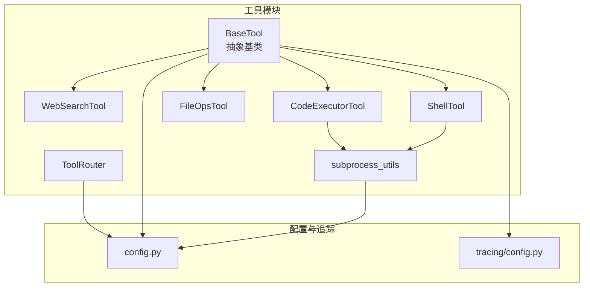
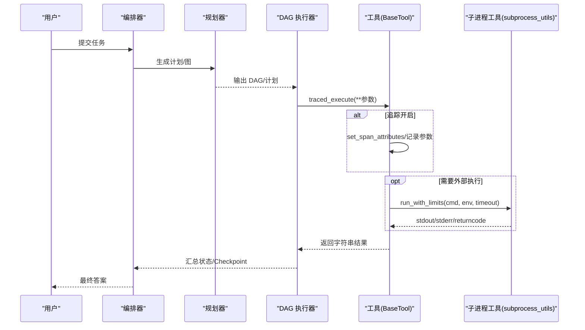
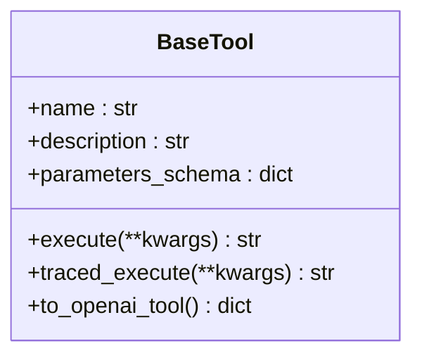
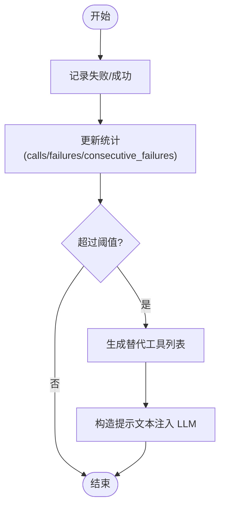
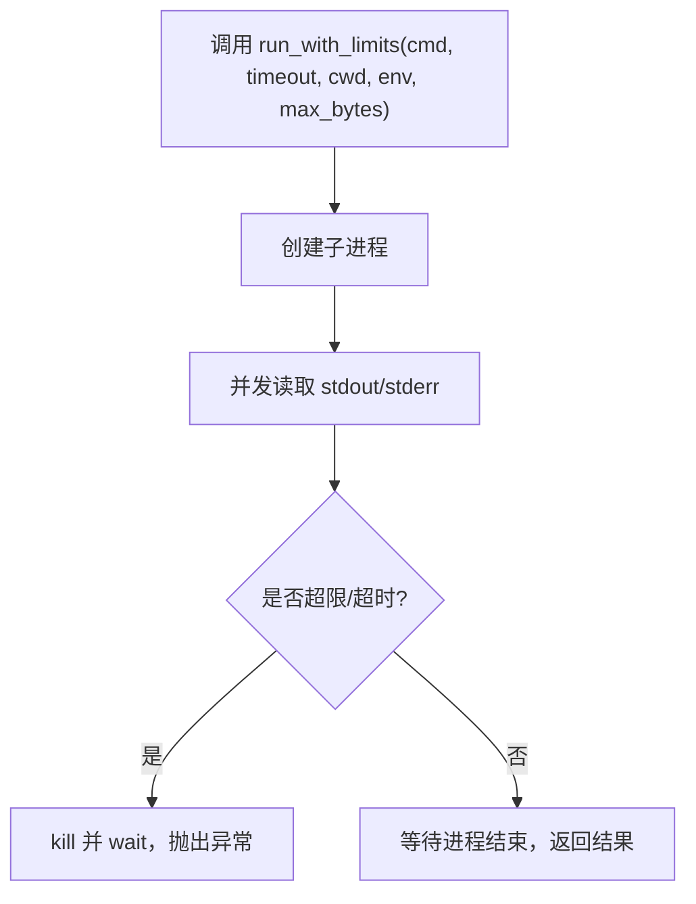
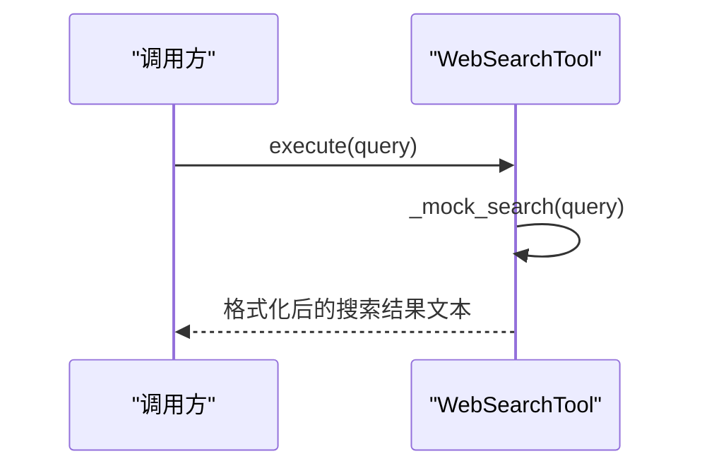
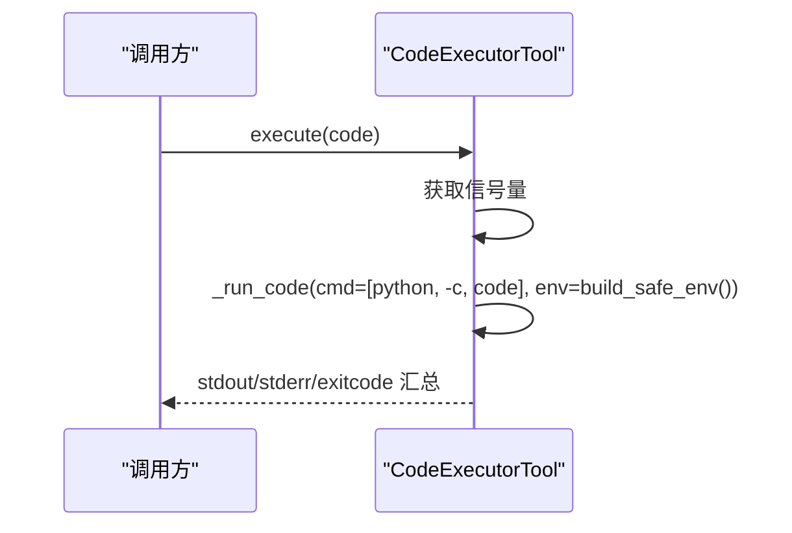
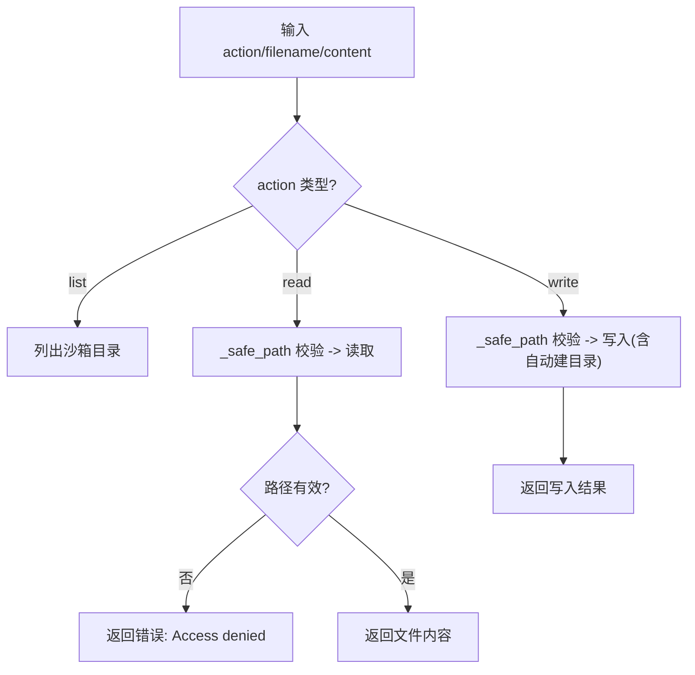
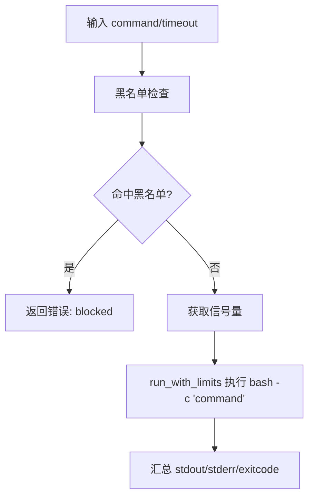
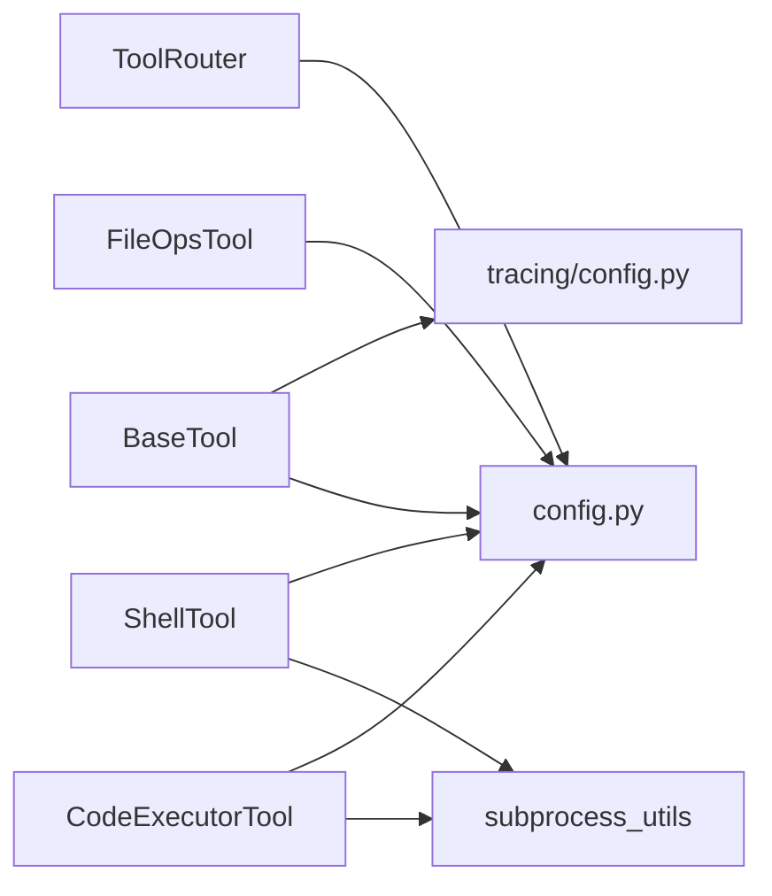

# 自定义工具开发

<cite>
**本文引用的文件**
- [tools/base.py](file://tools/base.py)
- [tools/__init__.py](file://tools/__init__.py)
- [tools/router.py](file://tools/router.py)
- [tools/web_search.py](file://tools/web_search.py)
- [tools/code_executor.py](file://tools/code_executor.py)
- [tools/file_ops.py](file://tools/file_ops.py)
- [tools/shell_tool.py](file://tools/shell_tool.py)
- [tools/subprocess_utils.py](file://tools/subprocess_utils.py)
- [config.py](file://config.py)
- [tracing/config.py](file://tracing/config.py)
- [tests/test_real_tools.py](file://tests/test_real_tools.py)
- [tests/test_shell_tool.py](file://tests/test_shell_tool.py)
- [README.md](file://README.md)
</cite>

## 目录
1. [简介](#简介)
2. [项目结构](#项目结构)
3. [核心组件](#核心组件)
4. [架构总览](#架构总览)
5. [详细组件分析](#详细组件分析)
6. [依赖分析](#依赖分析)
7. [性能考量](#性能考量)
8. [调试与测试指南](#调试与测试指南)
9. [结论](#结论)
10. [附录](#附录)

## 简介
本指南面向希望在本项目中开发“自定义工具”的工程师，提供从需求分析、Schema 设计、实现与继承最佳实践、异步执行模型、安全机制、调试测试、到注册与集成、版本与兼容性、以及故障排除的完整开发流程。文档以仓库现有工具实现为蓝本，结合配置与测试用例，给出可复用的模板与规范。

## 项目结构
本项目的“工具”模块位于 tools/，包含抽象基类、若干内置工具与工具路由器，以及子进程工具库。核心文件如下：
- 抽象基类：tools/base.py
- 工具集合导出：tools/__init__.py
- 工具路由器：tools/router.py
- 内置工具：web_search.py、code_executor.py、file_ops.py、shell_tool.py
- 子进程工具：tools/subprocess_utils.py
- 全局配置：config.py
- 追踪配置：tracing/config.py
- 示例测试：tests/test_real_tools.py、tests/test_shell_tool.py
- 项目说明：README.md

图表来源
- [tools/base.py:1-175](file://tools/base.py#L1-L175)
- [tools/web_search.py:1-113](file://tools/web_search.py#L1-L113)
- [tools/code_executor.py:1-102](file://tools/code_executor.py#L1-L102)
- [tools/file_ops.py:1-138](file://tools/file_ops.py#L1-L138)
- [tools/shell_tool.py:1-152](file://tools/shell_tool.py#L1-L152)
- [tools/router.py:1-168](file://tools/router.py#L1-L168)
- [tools/subprocess_utils.py:1-156](file://tools/subprocess_utils.py#L1-L156)
- [config.py:1-109](file://config.py#L1-L109)
- [tracing/config.py:1-79](file://tracing/config.py#L1-L79)

章节来源
- [README.md:97-154](file://README.md#L97-L154)
- [tools/__init__.py:1-8](file://tools/__init__.py#L1-L8)

## 核心组件
- BaseTool 抽象基类：定义工具的统一接口，包括 name、description、parameters_schema、execute，并提供 traced_execute 与 OpenAI function calling 格式转换。
- 工具路由器 ToolRouter：在 ReAct 循环中对工具失败进行统计与替代建议，提升鲁棒性。
- 子进程工具库 subprocess_utils：提供安全的子进程执行、环境变量脱敏、输出截断与超时保障。
- 配置模块 config：集中管理工具执行相关的超时、并发、沙箱目录、追踪开关等参数。
- 追踪配置 tracing/config：集中管理追踪后端、采样率、敏感键脱敏等。

章节来源
- [tools/base.py:22-175](file://tools/base.py#L22-L175)
- [tools/router.py:47-168](file://tools/router.py#L47-L168)
- [tools/subprocess_utils.py:38-156](file://tools/subprocess_utils.py#L38-L156)
- [config.py:69-109](file://config.py#L69-L109)
- [tracing/config.py:14-79](file://tracing/config.py#L14-L79)

## 架构总览
工具在系统中的位置与交互如下：

图表来源
- [tools/base.py:60-124](file://tools/base.py#L60-L124)
- [tools/subprocess_utils.py:62-101](file://tools/subprocess_utils.py#L62-L101)
- [config.py:69-77](file://config.py#L69-L77)

## 详细组件分析

### 抽象基类 BaseTool
- 角色定位：所有工具的统一抽象，确保工具具备“名称/描述/Scheam/执行”四要素。
- 关键点：
  - name/description/parameters_schema 为 LLM 的 function calling 提供元数据。
  - execute 为异步方法，返回字符串，便于 LLM 接收与后续处理。
  - traced_execute 提供零开销降级与参数脱敏、时延与错误记录、状态码设置等可观测性能力。
  - to_openai_tool 将工具转为 OpenAI tools 格式，直接传入 chat completion 的 tools 参数。

图表来源
- [tools/base.py:22-175](file://tools/base.py#L22-L175)

章节来源
- [tools/base.py:22-175](file://tools/base.py#L22-L175)

### 工具路由器 ToolRouter
- 目标：在 ReAct 循环中，当某个工具在特定节点连续失败超过阈值时，向 LLM 注入替代工具建议，避免死循环。
- 关键点：
  - 统计 per-node 的 calls/failures/consecutive_failures。
  - 提供 record_success/record_failure/get_hint/get_alternative_tools 等接口。
  - 与配置项 TOOL_FAILURE_THRESHOLD 对接，支持 per-node 隔离与重置。

图表来源
- [tools/router.py:82-147](file://tools/router.py#L82-L147)
- [config.py:54](file://config.py#L54)

章节来源
- [tools/router.py:47-168](file://tools/router.py#L47-L168)
- [config.py:52-54](file://config.py#L52-L54)

### 子进程工具库 subprocess_utils
- 目标：为 Shell 与代码执行提供安全、可控的子进程执行能力。
- 关键点：
  - build_safe_env：移除环境变量中的敏感键（API Key、Token、Secret 等）。
  - run_with_limits：基于 asyncio.create_subprocess_exec，支持超时、输出字节上限、保证清理。
  - _read_with_limit：并发读取 stdout/stderr，带预算与截断标记，防止内存耗尽。

图表来源
- [tools/subprocess_utils.py:62-101](file://tools/subprocess_utils.py#L62-L101)
- [tools/subprocess_utils.py:104-156](file://tools/subprocess_utils.py#L104-L156)

章节来源
- [tools/subprocess_utils.py:38-156](file://tools/subprocess_utils.py#L38-L156)

### WebSearchTool（示例：参数 Schema 与执行）
- Schema 设计：最小可用 Schema，包含必填字段 query。
- 执行逻辑：将查询词映射到预设 mock 结果，格式化为人类可读文本。
- 适配扩展：可通过替换内部 _mock_search 方法对接真实搜索 API。

图表来源
- [tools/web_search.py:74-113](file://tools/web_search.py#L74-L113)

章节来源
- [tools/web_search.py:56-113](file://tools/web_search.py#L56-L113)

### CodeExecutorTool（示例：异步执行与并发控制）
- 异步模型：execute 为异步方法，内部使用 asyncio.Semaphore 控制最大并发。
- 安全与限制：通过 subprocess_utils 的 run_with_limits 设置超时、输出上限与环境脱敏。
- 错误处理：捕获超时与异常，返回可读错误信息。

图表来源
- [tools/code_executor.py:64-102](file://tools/code_executor.py#L64-L102)
- [tools/subprocess_utils.py:62-101](file://tools/subprocess_utils.py#L62-L101)

章节来源
- [tools/code_executor.py:25-102](file://tools/code_executor.py#L25-L102)
- [config.py:72-76](file://config.py#L72-L76)

### FileOpsTool（示例：路径穿越防护与沙箱）
- 沙箱策略：所有文件操作限定在 SANDBOX_DIR，使用 realpath 与 starts-with 校验防止路径穿越。
- 操作类型：read/write/list，错误路径返回明确错误信息。
- 安全要点：写入前自动创建子目录，读取前严格校验路径。

图表来源
- [tools/file_ops.py:73-138](file://tools/file_ops.py#L73-L138)

章节来源
- [tools/file_ops.py:23-138](file://tools/file_ops.py#L23-L138)
- [config.py:71](file://config.py#L71)

### ShellTool（示例：命令黑名单与并发控制）
- 黑名单策略：通过正则匹配常见高危命令与模式（rm -rf、sudo、curl|sh 管道、systemctl 等）。
- 并发控制：与 CodeExecutorTool 类似，使用 asyncio.Semaphore 控制最大并发。
- 安全与限制：结合 subprocess_utils 的超时、输出截断与环境脱敏。

图表来源
- [tools/shell_tool.py:99-152](file://tools/shell_tool.py#L99-L152)
- [tools/shell_tool.py:122-127](file://tools/shell_tool.py#L122-L127)

章节来源
- [tools/shell_tool.py:25-152](file://tools/shell_tool.py#L25-L152)
- [config.py:75-76](file://config.py#L75-L76)

## 依赖分析
- 工具对配置的依赖：超时、并发、沙箱目录、追踪开关等均来自 config。
- 工具对子进程工具的依赖：ShellTool 与 CodeExecutorTool 共享 subprocess_utils。
- 工具对追踪配置的依赖：BaseTool.traced_execute 读取 tracing/config 的敏感键与属性长度限制。

图表来源
- [tools/base.py:74-124](file://tools/base.py#L74-L124)
- [tools/code_executor.py:18-20](file://tools/code_executor.py#L18-L20)
- [tools/shell_tool.py:18-20](file://tools/shell_tool.py#L18-L20)
- [tools/file_ops.py:17-18](file://tools/file_ops.py#L17-L18)
- [tools/router.py:29](file://tools/router.py#L29)
- [config.py:69-109](file://config.py#L69-L109)
- [tracing/config.py:14-43](file://tracing/config.py#L14-L43)

章节来源
- [tools/base.py:74-124](file://tools/base.py#L74-L124)
- [tools/code_executor.py:18-20](file://tools/code_executor.py#L18-L20)
- [tools/shell_tool.py:18-20](file://tools/shell_tool.py#L18-L20)
- [tools/file_ops.py:17-18](file://tools/file_ops.py#L17-L18)
- [tools/router.py:29](file://tools/router.py#L29)
- [config.py:69-109](file://config.py#L69-L109)
- [tracing/config.py:14-43](file://tracing/config.py#L14-L43)

## 性能考量
- 异步与并发
  - 工具执行采用 asyncio，避免阻塞事件循环。
  - 通过 asyncio.Semaphore 控制最大并发，避免资源争用与系统过载。
- 超时与输出限制
  - 子进程执行设置超时与最大输出字节数，防止长时间运行与内存膨胀。
- 路由与自适应
  - ToolRouter 在失败阈值触发时建议替代工具，减少无效重试与资源浪费。
- 追踪开销
  - traced_execute 在追踪关闭时为零开销，开启时仅记录必要属性，避免过度采样。

章节来源
- [tools/code_executor.py:31-37](file://tools/code_executor.py#L31-L37)
- [tools/shell_tool.py:57-67](file://tools/shell_tool.py#L57-L67)
- [tools/subprocess_utils.py:62-101](file://tools/subprocess_utils.py#L62-L101)
- [config.py:72-76](file://config.py#L72-L76)
- [tools/router.py:65-71](file://tools/router.py#L65-L71)

## 调试与测试指南
- 单元测试
  - 真实工具调用测试：验证 CodeExecutorTool 与 FileOpsTool 的执行、错误处理与路径穿越防护。
  - Shell 工具测试：覆盖基本命令、管道、黑名单拦截、超时、环境变量脱敏、输出截断、并发限制等。
- 运行方式
  - 使用 pytest 运行测试文件，或直接运行脚本进行异步测试。
- 日志与追踪
  - 通过 config.TRACING_ENABLED 与 tracing/config 的后端设置，启用全链路追踪，辅助定位问题。

章节来源
- [tests/test_real_tools.py:13-110](file://tests/test_real_tools.py#L13-L110)
- [tests/test_shell_tool.py:14-221](file://tests/test_shell_tool.py#L14-L221)
- [config.py:102-109](file://config.py#L102-L109)
- [tracing/config.py:21-43](file://tracing/config.py#L21-L43)

## 结论
本指南基于仓库现有实现，总结了自定义工具开发的完整流程与最佳实践：以 BaseTool 为起点，设计清晰的 JSON Schema，遵循异步与安全约束，利用 ToolRouter 提升鲁棒性，并通过测试与追踪完善质量保障。按照本文档的步骤与模板，即可快速、安全地扩展新的工具能力。

## 附录

### 开发流程清单
- 需求分析：明确工具职责、输入输出、边界条件。
- Schema 设计：参考 WebSearchTool 的最小可用 Schema，逐步完善。
- 继承实现：参考 CodeExecutorTool/FileOpsTool/ShellTool 的实现模式，确保异步执行与错误处理。
- 安全加固：遵循 subprocess_utils 的环境脱敏与输出限制，必要时加入黑名单或路径校验。
- 注册与集成：在 tools/__init__.py 中导出并在主流程中注册使用。
- 测试与调试：编写单元测试，结合追踪与日志定位问题。
- 版本与兼容：通过环境变量与配置模块控制行为差异，确保向后兼容。

章节来源
- [tools/web_search.py:74-85](file://tools/web_search.py#L74-L85)
- [tools/code_executor.py:51-62](file://tools/code_executor.py#L51-L62)
- [tools/file_ops.py:51-71](file://tools/file_ops.py#L51-L71)
- [tools/shell_tool.py:82-97](file://tools/shell_tool.py#L82-L97)
- [tools/__init__.py:1-8](file://tools/__init__.py#L1-L8)
- [README.md:330-364](file://README.md#L330-L364)

### 参数 Schema 设计原则与 JSON Schema 编写规范
- 基本结构
  - type: "object"
  - properties: 定义参数键及其类型、描述
  - required: 必填参数列表
- 描述与可读性
  - 为每个参数提供清晰的 description，便于 LLM 理解参数含义。
- 类型与约束
  - 使用 enum、min/max、pattern 等约束增强健壮性（如 FileOpsTool 的 action 枚举）。
- 与 OpenAI Function Calling 的映射
  - 使用 BaseTool.to_openai_tool 将工具 Schema 转换为 OpenAI tools 格式。

章节来源
- [tools/web_search.py:74-85](file://tools/web_search.py#L74-L85)
- [tools/file_ops.py:51-71](file://tools/file_ops.py#L51-L71)
- [tools/shell_tool.py:82-97](file://tools/shell_tool.py#L82-L97)
- [tools/base.py:153-175](file://tools/base.py#L153-L175)

### 工具类继承最佳实践与代码模板
- 继承 BaseTool，实现以下成员：
  - name：唯一工具名
  - description：对 LLM 友好的用途说明
  - parameters_schema：JSON Schema
  - execute：异步执行，返回字符串
- 可选增强：
  - traced_execute：复用 BaseTool 的追踪能力
  - to_openai_tool：导出 OpenAI 兼容格式
- 参考模板路径
  - [tools/web_search.py:56-113](file://tools/web_search.py#L56-L113)
  - [tools/code_executor.py:25-102](file://tools/code_executor.py#L25-L102)
  - [tools/file_ops.py:23-138](file://tools/file_ops.py#L23-L138)
  - [tools/shell_tool.py:25-152](file://tools/shell_tool.py#L25-L152)

章节来源
- [tools/base.py:22-175](file://tools/base.py#L22-L175)
- [tools/web_search.py:56-113](file://tools/web_search.py#L56-L113)
- [tools/code_executor.py:25-102](file://tools/code_executor.py#L25-L102)
- [tools/file_ops.py:23-138](file://tools/file_ops.py#L23-L138)
- [tools/shell_tool.py:25-152](file://tools/shell_tool.py#L25-L152)

### 异步执行模型实现要点与性能考虑
- 异步执行
  - execute 为 async def，使用 asyncio.wait_for、gather 等原语。
- 并发控制
  - 使用 asyncio.Semaphore 控制最大并发，避免资源争用。
- 超时与清理
  - 子进程执行统一通过 run_with_limits 设置超时与清理，防止孤儿进程。
- 性能建议
  - 合理设置超时与输出上限，避免长尾任务拖累整体吞吐。
  - 在 traced_execute 中避免记录过大属性，必要时截断。

章节来源
- [tools/code_executor.py:31-37](file://tools/code_executor.py#L31-L37)
- [tools/shell_tool.py:57-67](file://tools/shell_tool.py#L57-L67)
- [tools/subprocess_utils.py:62-101](file://tools/subprocess_utils.py#L62-L101)
- [tools/base.py:60-124](file://tools/base.py#L60-L124)

### 安全机制实现要求与防护措施
- 环境变量脱敏
  - 通过 build_safe_env 移除敏感键，避免泄露至子进程。
- 输出截断
  - 限制子进程输出字节数，防止内存耗尽与日志膨胀。
- 路径穿越防护
  - FileOpsTool 使用 realpath 与 starts-with 校验，拒绝逃逸路径。
- 命令黑名单
  - ShellTool 使用正则匹配高危命令与模式，阻止破坏性操作。
- 并发与超时
  - 通过信号量与超时保障系统稳定性。

章节来源
- [tools/subprocess_utils.py:38-52](file://tools/subprocess_utils.py#L38-L52)
- [tools/subprocess_utils.py:104-156](file://tools/subprocess_utils.py#L104-L156)
- [tools/file_ops.py:87-96](file://tools/file_ops.py#L87-L96)
- [tools/shell_tool.py:31-55](file://tools/shell_tool.py#L31-L55)
- [config.py:72-76](file://config.py#L72-L76)

### 调试与测试的方法与工具
- 单元测试
  - 使用 pytest 运行测试用例，覆盖执行、错误处理、安全与并发场景。
- 追踪与日志
  - 通过 config.TRACING_ENABLED 与 tracing/config 的后端设置启用追踪。
- 日志级别
  - 使用 -v 或相应日志配置查看详细执行过程。

章节来源
- [tests/test_real_tools.py:13-110](file://tests/test_real_tools.py#L13-L110)
- [tests/test_shell_tool.py:14-221](file://tests/test_shell_tool.py#L14-L221)
- [config.py:102-109](file://config.py#L102-L109)
- [tracing/config.py:21-43](file://tracing/config.py#L21-L43)

### 完整开发示例：从零开始创建一个自定义工具
- 步骤
  1) 在 tools/ 下新建文件，继承 BaseTool，实现 name/description/parameters_schema/execute。
  2) 如需外部执行，使用 subprocess_utils.run_with_limits 并设置超时与输出上限。
  3) 如需并发控制，使用 asyncio.Semaphore。
  4) 在 tools/__init__.py 中导出工具类。
  5) 在主流程中注册工具，使其可被 LLM 调用。
  6) 编写单元测试，覆盖正常与异常路径。
- 参考实现路径
  - [tools/web_search.py:56-113](file://tools/web_search.py#L56-L113)
  - [tools/code_executor.py:25-102](file://tools/code_executor.py#L25-L102)
  - [tools/file_ops.py:23-138](file://tools/file_ops.py#L23-L138)
  - [tools/shell_tool.py:25-152](file://tools/shell_tool.py#L25-L152)
  - [tools/__init__.py:1-8](file://tools/__init__.py#L1-L8)
  - [README.md:330-364](file://README.md#L330-L364)

章节来源
- [tools/web_search.py:56-113](file://tools/web_search.py#L56-L113)
- [tools/code_executor.py:25-102](file://tools/code_executor.py#L25-L102)
- [tools/file_ops.py:23-138](file://tools/file_ops.py#L23-L138)
- [tools/shell_tool.py:25-152](file://tools/shell_tool.py#L25-L152)
- [tools/__init__.py:1-8](file://tools/__init__.py#L1-L8)
- [README.md:330-364](file://README.md#L330-L364)

### 工具注册与集成流程
- 注册
  - 在 tools/__init__.py 中导出新工具类。
- 集成
  - 在主流程中将工具实例加入可用工具列表，以便 LLM 选择与调用。
- OpenAI Function Calling
  - 使用 BaseTool.to_openai_tool 将工具转换为 OpenAI tools 格式传入 API。

章节来源
- [tools/__init__.py:1-8](file://tools/__init__.py#L1-L8)
- [tools/base.py:153-175](file://tools/base.py#L153-L175)
- [README.md:330-364](file://README.md#L330-L364)

### 版本管理与兼容性考虑
- 配置驱动
  - 通过 config.py 与 .env 控制工具行为（超时、并发、沙箱目录、追踪开关等），便于灰度与回滚。
- 追踪开关
  - TRACING_ENABLED 为 false 时，traced_execute 为零开销，确保向后兼容。
- 版本化配置
  - tracing/config 中包含 SERVICE_VERSION，便于追踪系统识别版本。

章节来源
- [config.py:69-109](file://config.py#L69-L109)
- [tools/base.py:74-76](file://tools/base.py#L74-L76)
- [tracing/config.py:49](file://tracing/config.py#L49)

### 故障排除与问题诊断
- 常见问题
  - 工具执行超时：检查 CODE_EXEC_TIMEOUT/SHELL_EXEC_TIMEOUT 与实际负载。
  - 输出过大：调整 SUBPROCESS_MAX_OUTPUT_BYTES 或查看截断标记。
  - 路径穿越：确认 FileOpsTool 的 _safe_path 校验逻辑。
  - 命令被拦截：检查 ShellTool 的黑名单正则匹配。
  - 并发冲突：调整 SHELL_MAX_CONCURRENT/CODE_MAX_CONCURRENT。
- 诊断手段
  - 启用追踪（TRACING_ENABLED），查看 span 属性与错误信息。
  - 查看日志与测试输出，定位异常路径。

章节来源
- [config.py:72-76](file://config.py#L72-L76)
- [tools/file_ops.py:87-96](file://tools/file_ops.py#L87-L96)
- [tools/shell_tool.py:122-127](file://tools/shell_tool.py#L122-L127)
- [tools/subprocess_utils.py:151-155](file://tools/subprocess_utils.py#L151-L155)
- [config.py:102-109](file://config.py#L102-L109)