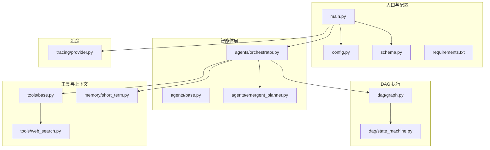
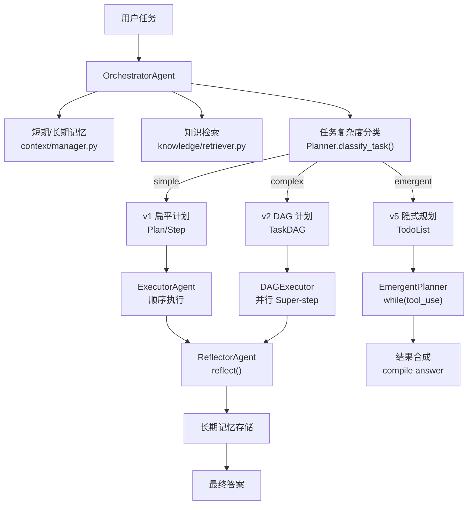
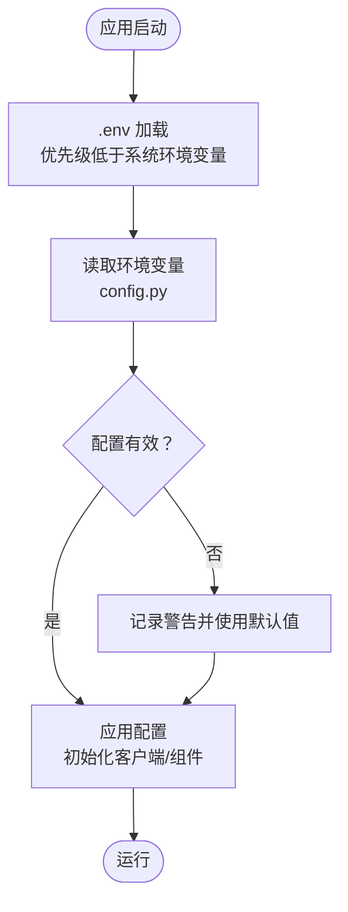
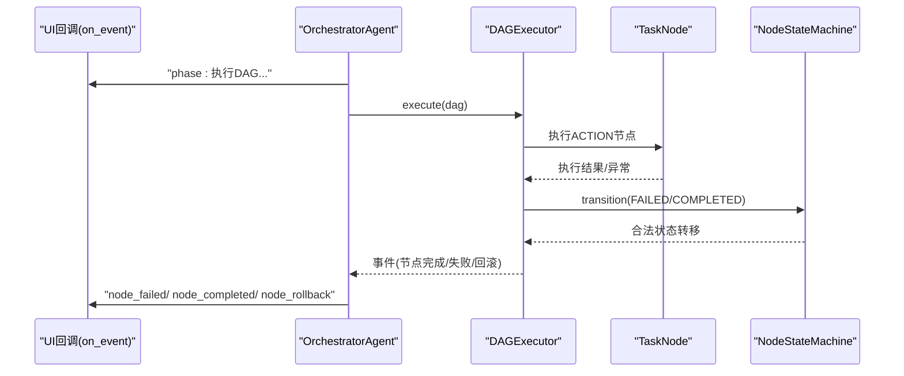
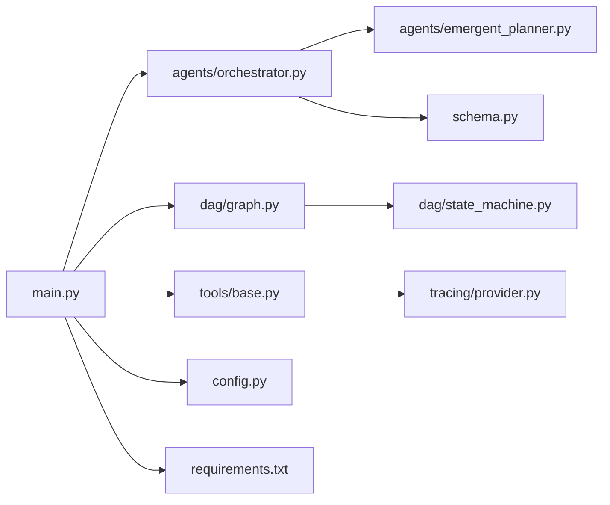

# 开发最佳实践

<cite>
**本文引用的文件**
- [README.md](file://README.md)
- [config.py](file://config.py)
- [main.py](file://main.py)
- [schema.py](file://schema.py)
- [requirements.txt](file://requirements.txt)
- [agents/base.py](file://agents/base.py)
- [agents/orchestrator.py](file://agents/orchestrator.py)
- [agents/emergent_planner.py](file://agents/emergent_planner.py)
- [dag/graph.py](file://dag/graph.py)
- [dag/state_machine.py](file://dag/state_machine.py)
- [tools/base.py](file://tools/base.py)
- [tools/web_search.py](file://tools/web_search.py)
- [memory/short_term.py](file://memory/short_term.py)
- [tracing/provider.py](file://tracing/provider.py)
- [tests/test_dag_capabilities.py](file://tests/test_dag_capabilities.py)
</cite>

## 目录
1. [简介](#简介)
2. [项目结构](#项目结构)
3. [核心组件](#核心组件)
4. [架构总览](#架构总览)
5. [详细组件分析](#详细组件分析)
6. [依赖分析](#依赖分析)
7. [性能考量](#性能考量)
8. [故障排查指南](#故障排查指南)
9. [结论](#结论)
10. [附录](#附录)

## 简介
本项目是一个基于 DAG 的多智能体系统演示，强调“分层规划、DAG 并行执行、工具调用、状态机驱动、自我反思与纠错”。项目提供了清晰的模块化结构、完善的配置体系、可观测性（追踪）与丰富的测试覆盖，适合扩展开发与教学实践。

## 项目结构
项目采用按功能域划分的模块化组织方式，核心目录与职责如下：
- agents：智能体层（Orchestrator、Planner、Executor、Reflector、EmergentPlanner）
- dag：DAG 执行引擎（TaskDAG、NodeStateMachine、DAGExecutor）
- tools：外部工具抽象与实现（BaseTool、WebSearch、CodeExecutor、FileOps、ShellTool、ToolRouter）
- memory：短期/长期记忆
- context：上下文管理（Token 估算与压缩）
- knowledge：知识检索（TF-IDF）
- llm：LLM 客户端封装
- tracing：全链路追踪（OpenTelemetry 集成）
- tests：单元/集成测试
- 配置与入口：config.py、main.py、schema.py、requirements.txt

**图表来源**
- [main.py:1-516](file://main.py#L1-L516)
- [config.py:1-109](file://config.py#L1-L109)
- [schema.py:1-702](file://schema.py#L1-L702)
- [agents/orchestrator.py:1-600](file://agents/orchestrator.py#L1-L600)
- [agents/base.py:1-183](file://agents/base.py#L1-L183)
- [agents/emergent_planner.py:1-685](file://agents/emergent_planner.py#L1-L685)
- [dag/graph.py:1-627](file://dag/graph.py#L1-L627)
- [dag/state_machine.py:1-114](file://dag/state_machine.py#L1-L114)
- [tools/base.py:1-175](file://tools/base.py#L1-L175)
- [tools/web_search.py:1-113](file://tools/web_search.py#L1-L113)
- [memory/short_term.py:1-91](file://memory/short_term.py#L1-L91)
- [tracing/provider.py:1-197](file://tracing/provider.py#L1-L197)

**章节来源**
- [README.md:97-154](file://README.md#L97-L154)
- [requirements.txt:1-19](file://requirements.txt#L1-L19)

## 核心组件
- 配置管理：集中于 config.py，支持 .env 与环境变量优先级，涵盖 LLM、执行限制、记忆、知识、规划路由、DAG 执行、自适应规划、工具参数、追踪等。
- 数据模型：schema.py 定义了 Plan/DAG/Node/Edge、状态机、Token 使用、StepResult、TodoList、Goal-Driven 规划等核心数据结构。
- 入口与 UI：main.py 提供交互式 CLI、Rich 可视化、事件驱动 UI、日志配置与单任务模式。
- 智能体：BaseAgent 提供消息历史与 LLM 交互；Orchestrator 编排混合路由（simple/complex/emergent）；EmergentPlanner 实现 Claude Code 风格 TODO 列表管理。
- DAG 引擎：TaskDAG 管理节点/边/状态；NodeStateMachine 强制合法状态转移；graph.py 提供拓扑排序、就绪节点检测、动态变更等。
- 工具：BaseTool 抽象与 traced_execute 追踪；WebSearchTool 等具体工具。
- 追踪：provider.py 初始化 OpenTelemetry，支持多种导出后端与批处理策略。

**章节来源**
- [config.py:1-109](file://config.py#L1-L109)
- [schema.py:1-702](file://schema.py#L1-L702)
- [main.py:1-516](file://main.py#L1-L516)
- [agents/base.py:1-183](file://agents/base.py#L1-L183)
- [agents/orchestrator.py:1-600](file://agents/orchestrator.py#L1-L600)
- [agents/emergent_planner.py:1-685](file://agents/emergent_planner.py#L1-L685)
- [dag/graph.py:1-627](file://dag/graph.py#L1-L627)
- [dag/state_machine.py:1-114](file://dag/state_machine.py#L1-L114)
- [tools/base.py:1-175](file://tools/base.py#L1-L175)
- [tracing/provider.py:1-197](file://tracing/provider.py#L1-L197)

## 架构总览
系统采用“混合规划路由 + DAG 并行执行 + 隐式规划”的多路径架构，结合状态机与自适应规划，支持条件分支、失败回滚、部分重规划与动态 DAG 变更。

**图表来源**
- [agents/orchestrator.py:60-222](file://agents/orchestrator.py#L60-L222)
- [agents/emergent_planner.py:134-276](file://agents/emergent_planner.py#L134-L276)
- [dag/graph.py:43-81](file://dag/graph.py#L43-L81)
- [README.md:22-76](file://README.md#L22-L76)

## 详细组件分析

### 配置管理最佳实践
- 环境变量与 .env 优先级：优先使用系统环境变量，其次加载项目根目录 .env。
- 分层配置：LLM、执行限制、记忆、知识、规划路由、DAG 执行、自适应规划、工具参数、追踪等分组清晰。
- 动态配置更新：通过读取环境变量实现运行时配置切换（如 PLAN_MODE、EMERGENT_PLANNING_ENABLED、TRACING_ENABLED 等）。
- 配置校验：建议在应用启动时对关键配置（如 LLM_BASE_URL、MAX_*、SANDBOX_DIR 等）进行有效性校验与日志提示。

**图表来源**
- [config.py:11-109](file://config.py#L11-L109)

**章节来源**
- [config.py:1-109](file://config.py#L1-L109)
- [README.md:304-329](file://README.md#L304-L329)

### 错误处理模式
- 事件驱动 UI：main.py 的 on_event 将 Orchestrator/DAGExecutor 的事件统一渲染，便于用户感知执行状态与错误。
- 状态机强制：NodeStateMachine 严格校验状态转移，非法转移抛出异常，防止不一致状态。
- 工具执行追踪：BaseTool.traced_execute 在开启追踪时自动埋点，记录参数、结果、耗时与异常。
- 超时与异常保护：EmergentPlanner 对 TODO 执行设置超时；DAGExecutor 对节点执行设置超时；统一捕获异常并记录日志。
- 日志级别：main.py 支持 -v/--verbose 输出 DEBUG 级别日志，抑制第三方库噪音。

**图表来源**
- [main.py:184-390](file://main.py#L184-L390)
- [agents/orchestrator.py:439-508](file://agents/orchestrator.py#L439-L508)
- [dag/state_machine.py:88-114](file://dag/state_machine.py#L88-L114)

**章节来源**
- [main.py:396-413](file://main.py#L396-L413)
- [dag/state_machine.py:1-114](file://dag/state_machine.py#L1-L114)
- [tools/base.py:60-146](file://tools/base.py#L60-L146)
- [agents/emergent_planner.py:212-237](file://agents/emergent_planner.py#L212-L237)

### 性能优化建议
- 异步编程最佳实践
  - 使用 asyncio.gather 并行执行就绪节点（DAGExecutor）。
  - 工具执行统一走 traced_execute，避免重复开销。
- 内存管理
  - 短期记忆采用滑动窗口（ShortTermMemory），避免上下文无限增长。
  - DAGState 使用字典存储节点结果，避免冲突；checkpoint 限制数量（MAX_CHECKPOINTS）。
- 并发控制策略
  - 通过 MAX_PARALLEL_NODES 控制每轮并行节点数。
  - 工具并发：SHELL_MAX_CONCURRENT、CODE_MAX_CONCURRENT。
  - 超时控制：NODE_EXECUTION_TIMEOUT、CODE_EXEC_TIMEOUT、SHELL_EXEC_TIMEOUT。
- 资源导出
  - OpenTelemetry 使用 BatchSpanProcessor 异步导出，降低主线程开销。

**章节来源**
- [dag/graph.py:521-543](file://dag/graph.py#L521-L543)
- [memory/short_term.py:27-67](file://memory/short_term.py#L27-L67)
- [config.py:44-77](file://config.py#L44-L77)
- [tracing/provider.py:90-107](file://tracing/provider.py#L90-L107)

### 测试方法与覆盖率
- 单元测试
  - tests/test_dag_capabilities.py 覆盖分层规划、并行执行、条件分支/回滚、动态 DAG 变更、工具路由器、自适应规划集成。
- 集成测试
  - 通过 Mock ExecutorAgent/Reflector/Planner，验证 DAG 执行主循环与事件流。
- 端到端测试
  - README 提供 pytest 运行示例，建议补充 E2E 覆盖真实 LLM API 与工具链路。
- 覆盖率建议
  - 建议为关键模块（agents/*、dag/*、tools/*、schema.py）建立最小覆盖率门槛（如 80%），并针对异常路径与边界条件补充用例。

**章节来源**
- [tests/test_dag_capabilities.py:1-800](file://tests/test_dag_capabilities.py#L1-L800)
- [README.md:252-291](file://README.md#L252-L291)

### 调试技巧与工具
- 日志记录
  - main.py 使用 RichHandler 输出结构化日志，支持 -v/--verbose。
  - 各模块使用模块级 logger，便于定位问题。
- 性能分析
  - 使用 OpenTelemetry 追踪（provider.py），支持 console/file/otlp/rich/phoenix 等后端。
  - BaseTool.traced_execute 记录参数、耗时、结果大小与异常。
- 问题诊断
  - DAG.get_blockage_report 与 try_recover_blocked_nodes 辅助定位阻塞节点。
  - NodeStateMachine.can_transition/transition 提供状态合法性校验。
  - Orchestrator._make_multicast 保证 UI 事件不影响主流程。

**章节来源**
- [main.py:396-413](file://main.py#L396-L413)
- [tracing/provider.py:1-197](file://tracing/provider.py#L1-L197)
- [tools/base.py:60-146](file://tools/base.py#L60-L146)
- [dag/graph.py:277-334](file://dag/graph.py#L277-L334)
- [dag/state_machine.py:81-114](file://dag/state_machine.py#L81-L114)
- [agents/orchestrator.py:570-588](file://agents/orchestrator.py#L570-L588)

### 代码审查标准与贡献指南
- 代码组织规范
  - 模块结构：按功能域划分（agents/dag/tools/memory/context/knowledge/llm/tracing/tests）。
  - 命名约定：类名使用 PascalCase，方法/属性使用 snake_case；常量使用 UPPER_SNAKE_CASE。
  - 文件组织：每个模块职责单一，公共抽象放在 base.py。
- 错误处理
  - 明确异常类型与传播路径；UI 事件回调与追踪回调使用 try/except 隔离失败影响。
- 性能与并发
  - 优先使用异步与并发；对资源（工具、子进程、网络）设置合理超时与并发上限。
- 测试
  - 为每个模块编写单元测试；对关键流程补充集成测试；使用 pytest-asyncio 支持异步测试。
- 配置与安全
  - 通过 .env 与环境变量管理密钥与敏感参数；BaseTool._sanitize_params 清洗追踪参数。
- 文档与可维护性
  - README 提供架构图、配置参考与扩展指引；模块内注释与 docstring 保持一致风格。

**章节来源**
- [README.md:330-374](file://README.md#L330-L374)
- [tools/base.py:125-146](file://tools/base.py#L125-L146)

## 依赖分析
- 第三方依赖：openai、pydantic、rich、python-dotenv、opentelemetry-*、pytest、pytest-asyncio、FastAPI/Uvicorn/Jinja2（追踪 Web 查看器）。
- 模块耦合
  - main.py 依赖 agents、dag、tools、llm、schema、tracing。
  - agents/orchestrator.py 依赖 planner、executor、reflector、emergent_planner、memory、knowledge、context。
  - dag/graph.py 依赖 schema、config、state_machine。
  - tools/base.py 依赖 tracing/config（当追踪启用时）。

**图表来源**
- [main.py:34-42](file://main.py#L34-L42)
- [agents/orchestrator.py:42-55](file://agents/orchestrator.py#L42-L55)
- [dag/graph.py:36-38](file://dag/graph.py#L36-L38)
- [tools/base.py:74-124](file://tools/base.py#L74-L124)
- [requirements.txt:1-19](file://requirements.txt#L1-L19)

**章节来源**
- [requirements.txt:1-19](file://requirements.txt#L1-L19)

## 性能考量
- 并行执行
  - DAGExecutor 每轮仅执行就绪节点，通过 MAX_PARALLEL_NODES 控制并发度，避免资源争用。
- 资源导出
  - OTLP/File 后端使用 BatchSpanProcessor，降低主线程阻塞。
- 工具执行
  - 为不同工具设置独立超时与并发上限，避免单点瓶颈。
- 内存占用
  - DAGState 仅存储必要结果；ShortTermMemory 采用滑动窗口；DAG checkpoints 数量受 MAX_CHECKPOINTS 限制。

[本节为通用性能建议，无需特定文件引用]

## 故障排查指南
- DAG 执行停滞
  - 使用 DAG.get_blockage_report 诊断阻塞节点；必要时调用 try_recover_blocked_nodes。
- 状态机异常
  - 检查 NodeStateMachine.can_transition 与 transition 抛出的 InvalidTransitionError。
- 工具失败
  - 通过 ToolRouter 记录连续失败并触发替代建议；在 BaseTool.traced_execute 中查看参数与异常详情。
- 追踪问题
  - 检查 TRACING_ENABLED、TRACING_BACKEND、TRACING_SAMPLE_RATE 等配置；确认导出器可用性。

**章节来源**
- [dag/graph.py:277-334](file://dag/graph.py#L277-L334)
- [dag/state_machine.py:81-114](file://dag/state_machine.py#L81-L114)
- [tools/base.py:60-146](file://tools/base.py#L60-L146)
- [tracing/provider.py:154-197](file://tracing/provider.py#L154-L197)

## 结论
本项目在架构上实现了“混合规划 + DAG 并行 + 隐式规划”的多路径执行模型，配合状态机、自适应规划与动态 DAG 变更，具备良好的扩展性与教学价值。建议在扩展开发中遵循本文的代码组织、错误处理、性能优化、测试与配置管理最佳实践，以确保系统的稳定性与可维护性。

## 附录
- 快速开始与运行模式：README.md 提供交互模式、单任务模式、强制规划路径与详细日志模式说明。
- 配置参考：README.md 的 Configuration Reference 汇总了所有可配置项。
- 扩展指引：README.md 的 Extending the Demo 提供新增工具与知识库文档的步骤。

**章节来源**
- [README.md:156-291](file://README.md#L156-L291)
- [README.md:304-329](file://README.md#L304-L329)
- [README.md:330-374](file://README.md#L330-L374)