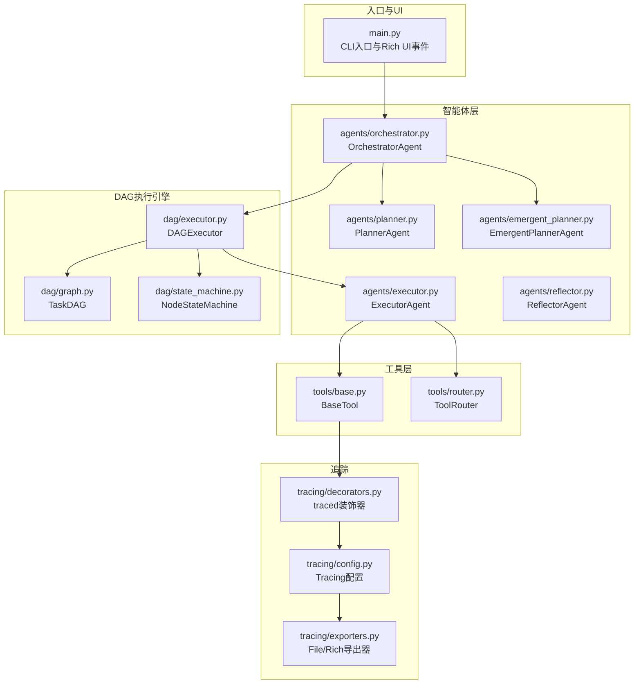
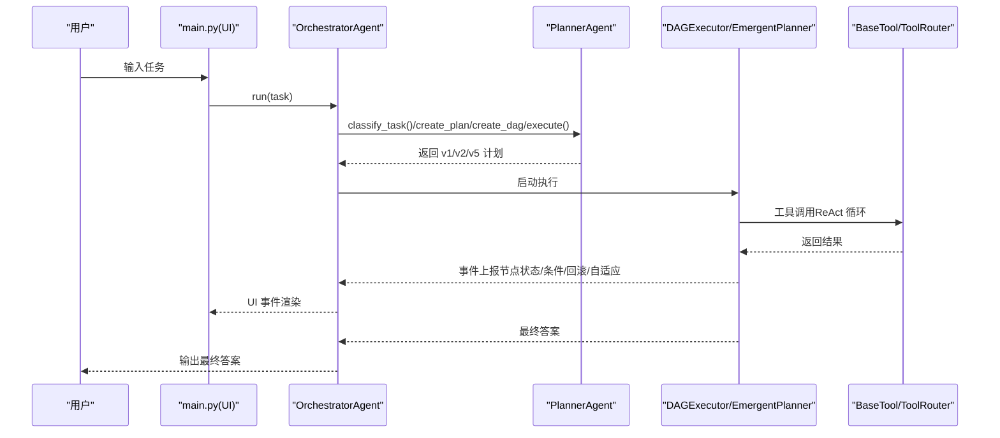
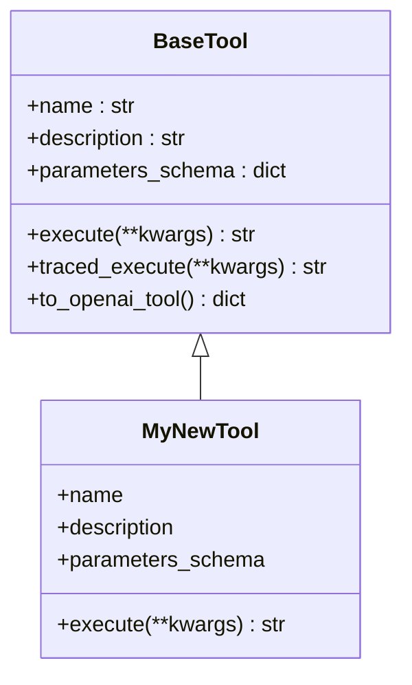
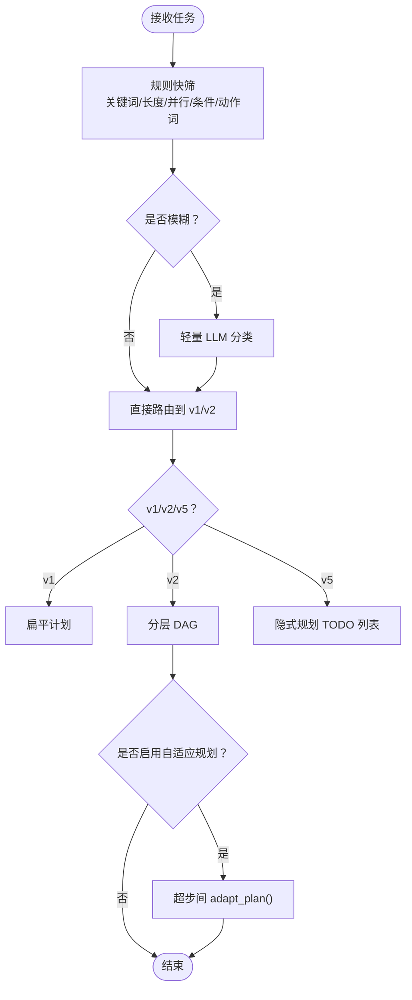
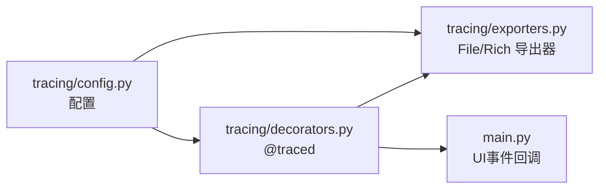
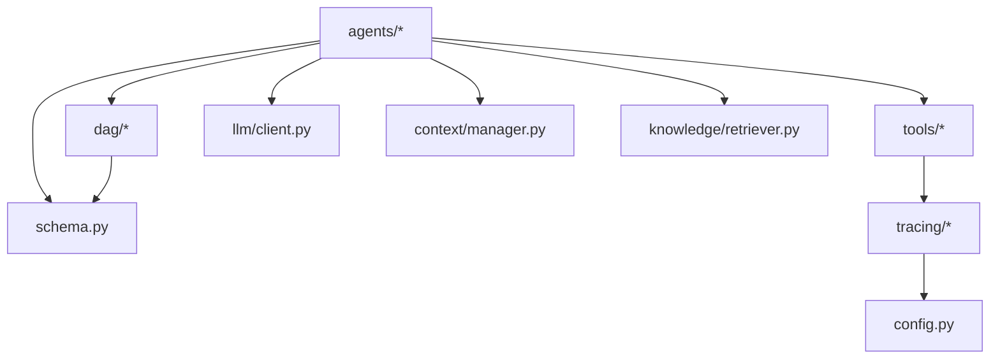

# 扩展开发

<cite>
**本文引用的文件**
- [README.md](file://README.md)
- [main.py](file://main.py)
- [config.py](file://config.py)
- [schema.py](file://schema.py)
- [agents/base.py](file://agents/base.py)
- [agents/planner.py](file://agents/planner.py)
- [agents/emergent_planner.py](file://agents/emergent_planner.py)
- [tools/base.py](file://tools/base.py)
- [tools/router.py](file://tools/router.py)
- [tracing/config.py](file://tracing/config.py)
- [tracing/exporters.py](file://tracing/exporters.py)
- [tracing/decorators.py](file://tracing/decorators.py)
- [tests/test_dag_capabilities.py](file://tests/test_dag_capabilities.py)
- [tests/test_emergent_planning.py](file://tests/test_emergent_planning.py)
</cite>

## 目录
1. [简介](#简介)
2. [项目结构](#项目结构)
3. [核心组件](#核心组件)
4. [架构总览](#架构总览)
5. [详细组件分析](#详细组件分析)
6. [依赖分析](#依赖分析)
7. [性能考虑](#性能考虑)
8. [故障排查指南](#故障排查指南)
9. [结论](#结论)
10. [附录](#附录)

## 简介
本指南面向希望为 manus_demo 扩展开发的工程师，提供从“添加新工具”到“自定义规划器与复杂度分类器”的完整开发流程，涵盖：
- 工具开发规范、参数 Schema 设计与集成测试方法
- 自定义规划器的开发接口与复杂度分类器实现
- 追踪扩展的开发（自定义导出器与 UI 模板定制）
- 代码组织规范与错误处理模式的最佳实践
- 具体开发示例、测试方法与调试技巧
- 扩展点的设计原理与使用注意事项
- 性能优化建议与贡献指南

## 项目结构
manus_demo 是一个基于 DAG 的多智能体系统，支持混合规划路由（v4）、隐式规划（v5）、自适应规划（v3）与目标驱动规划（v8）等特性。核心模块包括：
- agents：智能体层（Orchestrator、Planner、Executor、Reflector、EmergentPlanner）
- dag：DAG 执行引擎（TaskDAG、NodeStateMachine、DAGExecutor）
- tools：工具层（BaseTool、WebSearch、CodeExecutor、FileOps、Shell、ToolRouter）
- memory/context/knowledge：记忆、上下文与知识检索
- llm：LLM 客户端封装
- tracing：全链路追踪（配置、导出器、装饰器）
- tests：单元与集成测试

图表来源
- [main.py:1-516](file://main.py#L1-L516)
- [agents/planner.py:1-934](file://agents/planner.py#L1-L934)
- [agents/emergent_planner.py:1-685](file://agents/emergent_planner.py#L1-L685)
- [dag/graph.py](file://dag/graph.py)
- [dag/state_machine.py](file://dag/state_machine.py)
- [dag/executor.py](file://dag/executor.py)
- [tools/base.py:1-175](file://tools/base.py#L1-L175)
- [tools/router.py:1-168](file://tools/router.py#L1-L168)
- [tracing/config.py:1-79](file://tracing/config.py#L1-L79)
- [tracing/exporters.py:1-304](file://tracing/exporters.py#L1-L304)
- [tracing/decorators.py:1-146](file://tracing/decorators.py#L1-L146)

章节来源
- [README.md:97-154](file://README.md#L97-L154)

## 核心组件
- 配置中心：集中管理 LLM、工具、DAG 执行、自适应规划、追踪等配置项
- 数据模型：Schema 定义了 Plan、TaskDAG、TodoList、TokenUsage 等核心数据结构
- 智能体：Planner（v4 混合分类器 + v3 自适应规划）、Executor（ReAct 循环）、Reflector（质量评估）、EmergentPlanner（v5 隐式规划）
- 工具：BaseTool 抽象 + ToolRouter（v3 工具失败追踪与替代建议）
- 追踪：tracing 模块提供配置、导出器与装饰器，支持文件/控制台/OTLP 等后端

章节来源
- [config.py:1-109](file://config.py#L1-L109)
- [schema.py:1-688](file://schema.py#L1-L688)
- [agents/planner.py:1-934](file://agents/planner.py#L1-L934)
- [agents/emergent_planner.py:1-685](file://agents/emergent_planner.py#L1-L685)
- [tools/base.py:1-175](file://tools/base.py#L1-L175)
- [tools/router.py:1-168](file://tools/router.py#L1-L168)
- [tracing/config.py:1-79](file://tracing/config.py#L1-L79)

## 架构总览
系统采用事件驱动的 UI 与流水线控制，核心流程如下：
- 任务进入后，Orchestrator 根据配置与规划路由选择 v1/v2/v5 路径
- v2/v3 使用 TaskDAG 并行执行，支持条件分支、回滚与自适应规划
- v5 使用 TodoList 的隐式规划，通过 while(tool_use) 主循环动态演化
- 所有工具调用与 LLM 调用均可选开启追踪

图表来源
- [main.py:184-390](file://main.py#L184-L390)
- [agents/planner.py:213-363](file://agents/planner.py#L213-L363)
- [agents/emergent_planner.py:134-276](file://agents/emergent_planner.py#L134-L276)
- [tools/base.py:60-175](file://tools/base.py#L60-L175)
- [tools/router.py:82-167](file://tools/router.py#L82-L167)

## 详细组件分析

### 添加新工具：开发规范、Schema 设计与集成测试
- 继承 BaseTool，实现 name/description/parameters_schema/execute
- 使用 traced_execute 以启用追踪（当 TRACING_ENABLED=true）
- 将工具注册到 Orchestrator 的工具列表中
- 编写单元测试，验证参数 Schema 与执行结果

图表来源
- [tools/base.py:22-175](file://tools/base.py#L22-L175)

开发步骤
- 在 tools/ 下新建 my_tool.py，继承 BaseTool
- 设计 parameters_schema（JSON Schema），确保描述清晰、必填字段明确
- 实现 execute，返回字符串结果（便于 LLM 处理）
- 在 main.py 的工具列表中注册
- 编写测试：验证参数解析、工具调用链路与错误处理

章节来源
- [tools/base.py:22-175](file://tools/base.py#L22-L175)
- [main.py:448-455](file://main.py#L448-L455)
- [tests/test_dag_capabilities.py:214-340](file://tests/test_dag_capabilities.py#L214-L340)

### 自定义规划器：开发接口与复杂度分类器实现
- 自定义规划器需实现与 Orchestrator 的对接接口（路由、计划生成、重规划）
- 复杂度分类器（v4）包含规则快筛与 LLM 兜底两阶段分类
- v3 自适应规划可在超步间评估并动态调整 DAG

图表来源
- [agents/planner.py:213-363](file://agents/planner.py#L213-L363)
- [agents/planner.py:573-673](file://agents/planner.py#L573-L673)

章节来源
- [agents/planner.py:213-363](file://agents/planner.py#L213-L363)
- [agents/planner.py:573-673](file://agents/planner.py#L573-L673)

### 复杂度分类器（v4）实现要点
- 规则快筛：基于任务文本长度、多步/并行/条件/动作词等打分
- LLM 兜底：对模糊区间进行轻量分类（JSON 输出，temperature=0.0）
- 可配置：PLAN_MODE 可强制路由；EMERGENT_PLANNING_ENABLED 控制 v5 开关

章节来源
- [agents/planner.py:213-363](file://agents/planner.py#L213-L363)
- [config.py:38-41](file://config.py#L38-L41)
- [config.py:61-67](file://config.py#L61-L67)

### 自适应规划（v3）与动态 DAG 变更
- adapt_plan() 基于已完成节点结果评估待执行节点，决定 KEEP/MODIFY/REMOVE/ADD
- apply_adaptations() 将调整应用到 DAG，支持运行时增删改节点与边
- DAGExecutor 在超步间触发 adapt_plan()，实现“边执行边优化”

章节来源
- [agents/planner.py:573-723](file://agents/planner.py#L573-L723)
- [tests/test_dag_capabilities.py:540-647](file://tests/test_dag_capabilities.py#L540-L647)

### 隐式规划（v5）与 TODO 列表管理
- TODO 列表扁平结构，动态创建/更新/完成
- 支持停滞检测、失败重试与阻塞标记
- 可选 ReActEngine 集成（v6.0）

章节来源
- [agents/emergent_planner.py:1-685](file://agents/emergent_planner.py#L1-L685)
- [tests/test_emergent_planning.py:171-432](file://tests/test_emergent_planning.py#L171-L432)

### 追踪扩展：自定义导出器与 UI 模板定制
- 配置：TRACING_ENABLED、BACKEND、ENDPOINT、SAMPLE_RATE、LOG_PROMPTS、MAX_ATTRIBUTE_LENGTH
- 导出器：FileSpanExporter（JSON 文件）、RichConsoleExporter（Rich 树）
- 装饰器：@traced 提供方法级埋点，自动截断与敏感字段脱敏
- UI：main.py 的 UI 事件回调可扩展为自定义模板渲染

图表来源
- [tracing/config.py:1-79](file://tracing/config.py#L1-L79)
- [tracing/decorators.py:1-146](file://tracing/decorators.py#L1-L146)
- [tracing/exporters.py:1-304](file://tracing/exporters.py#L1-L304)
- [main.py:184-390](file://main.py#L184-L390)

章节来源
- [tracing/config.py:1-79](file://tracing/config.py#L1-L79)
- [tracing/decorators.py:1-146](file://tracing/decorators.py#L1-L146)
- [tracing/exporters.py:1-304](file://tracing/exporters.py#L1-L304)
- [main.py:184-390](file://main.py#L184-L390)

## 依赖分析
- agents 依赖 schema、dag、tools、llm、context、memory、knowledge
- dag 依赖 schema 与 tools（通过 NodeStateMachine 管理状态）
- tools 依赖 tracing（BaseTool.traced_execute）
- tracing 依赖 config 与 opentelemetry（可选安装）

图表来源
- [agents/base.py:23-25](file://agents/base.py#L23-L25)
- [dag/graph.py](file://dag/graph.py)
- [dag/state_machine.py](file://dag/state_machine.py)
- [dag/executor.py](file://dag/executor.py)
- [tools/base.py:74-124](file://tools/base.py#L74-L124)
- [tracing/config.py:11-12](file://tracing/config.py#L11-L12)

章节来源
- [agents/base.py:23-25](file://agents/base.py#L23-L25)
- [tools/base.py:74-124](file://tools/base.py#L74-L124)
- [tracing/config.py:11-12](file://tracing/config.py#L11-L12)

## 性能考虑
- 并行度控制：MAX_PARALLEL_NODES 限制每轮并行节点数
- 超步间自适应：ADAPTIVE_PLANNING_ENABLED、ADAPT_PLAN_INTERVAL 控制自适应频率
- 工具失败切换：TOOL_FAILURE_THRESHOLD 降低卡死风险
- 追踪采样：SAMPLE_RATE 与 MAX_ATTRIBUTE_LENGTH 控制开销
- 超时与重试：NODE_EXECUTION_TIMEOUT、LLM_RETRY_* 保障稳定性

章节来源
- [config.py:44-67](file://config.py#L44-L67)
- [config.py:102-109](file://config.py#L102-L109)

## 故障排查指南
- 日志级别：-v/--verbose 启用 DEBUG 级别日志
- UI 事件：on_event() 统一渲染，便于定位阶段与错误
- 工具失败：ToolRouter 记录连续失败并提供替代建议
- DAG 状态机：NodeStateMachine 强制合法状态转移，异常时抛出 InvalidTransitionError
- 追踪问题：确认 TRACING_ENABLED 与 BACKEND 设置，检查导出器可用性

章节来源
- [main.py:396-413](file://main.py#L396-L413)
- [main.py:184-390](file://main.py#L184-L390)
- [tools/router.py:82-167](file://tools/router.py#L82-L167)
- [tests/test_dag_capabilities.py:524-527](file://tests/test_dag_capabilities.py#L524-L527)

## 结论
manus_demo 提供了清晰的扩展点与成熟的基础设施：
- 工具层通过 BaseTool 与 JSON Schema 实现即插即用
- 规划层支持 v1/v2/v5 多路径与 v3 自适应规划
- DAG 执行引擎具备条件分支、回滚与动态变更能力
- 追踪模块可无缝接入，支持多后端导出
建议在扩展时遵循“最小改动、强约束（Schema/状态机）、可观测（事件/追踪）”的原则。

## 附录

### 开发示例与测试方法
- 工具开发示例：参见 tools/base.py 的抽象接口与 traced_execute 的追踪实现
- 隐式规划测试：参见 tests/test_emergent_planning.py 的 TODO 列表管理与停滞检测
- DAG 能力测试：参见 tests/test_dag_capabilities.py 的分层规划、并行执行、条件分支/回滚、动态变更与工具路由器

章节来源
- [tools/base.py:60-175](file://tools/base.py#L60-L175)
- [tests/test_emergent_planning.py:171-432](file://tests/test_emergent_planning.py#L171-L432)
- [tests/test_dag_capabilities.py:134-800](file://tests/test_dag_capabilities.py#L134-L800)

### 贡献指南
- Fork 仓库，创建功能分支
- 遵循现有代码风格（命名、注释、模块组织）
- 为新功能补充单元测试与集成测试
- 更新 README.md 或新增文档说明
- 提交 PR 并关联相关 issue

章节来源
- [README.md:1-400](file://README.md#L1-L400)