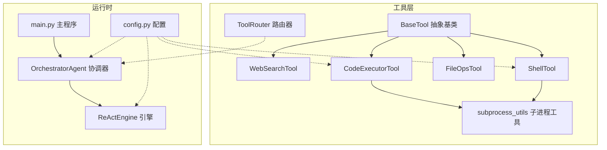
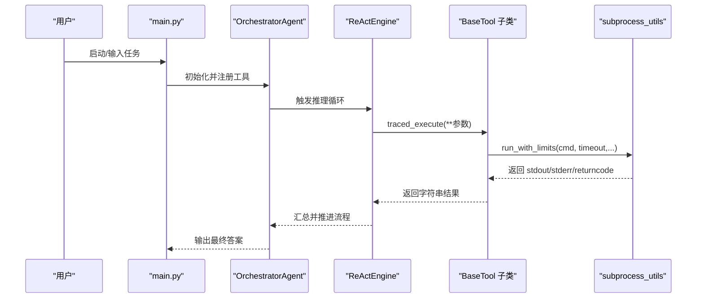
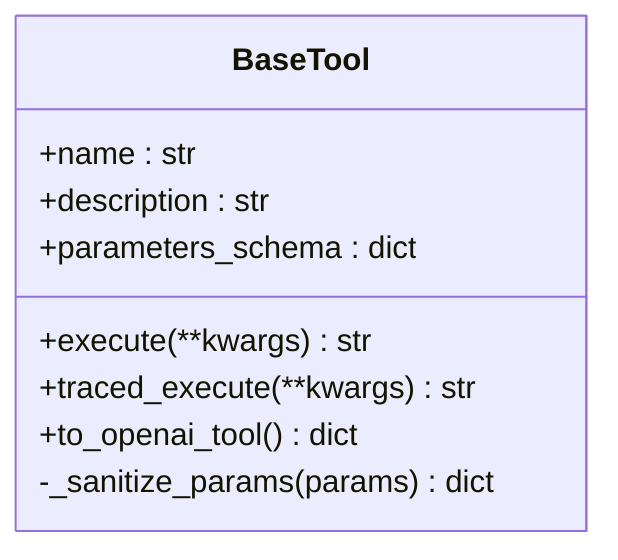
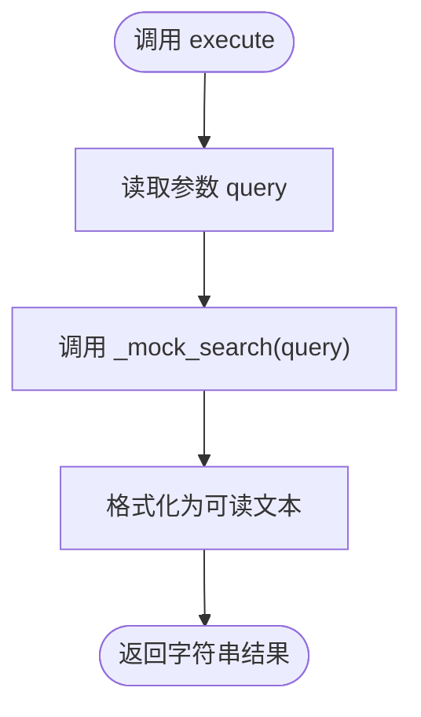
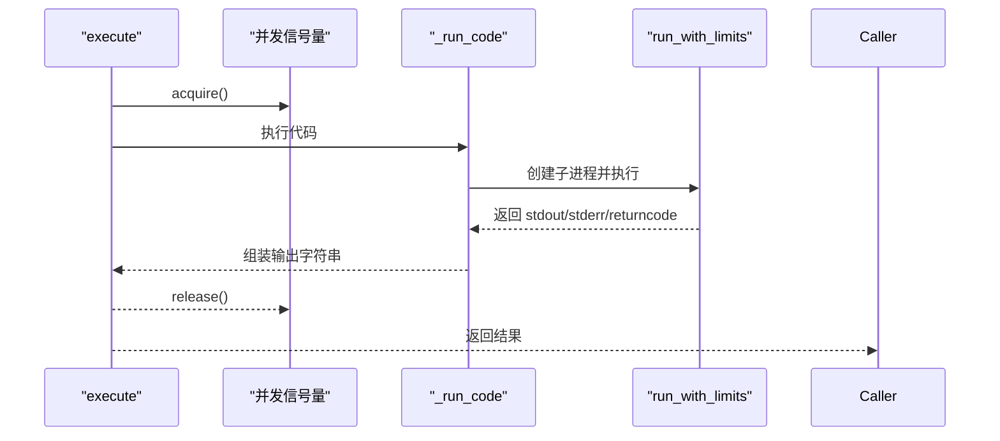
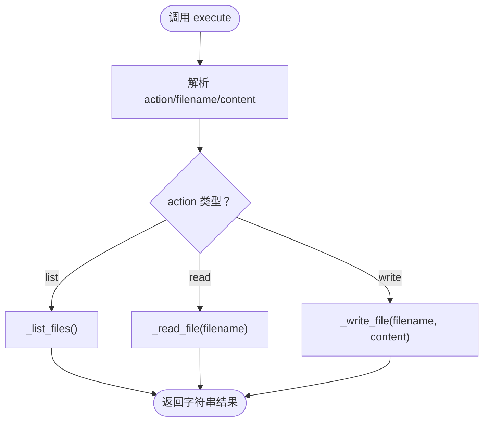
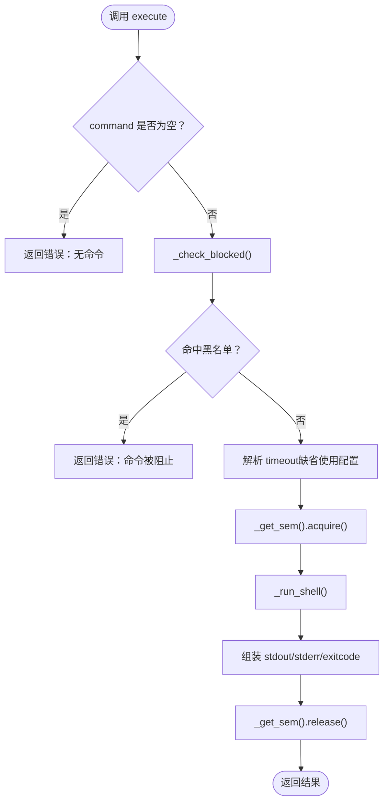
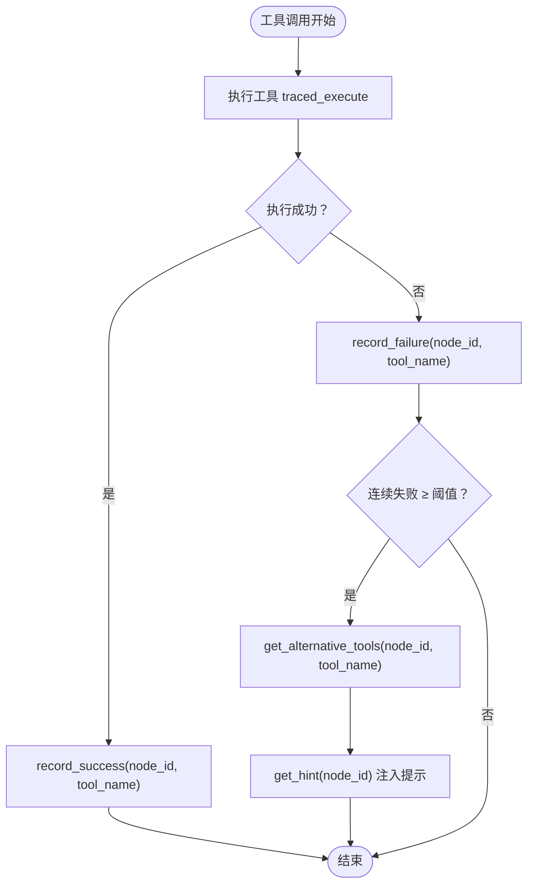
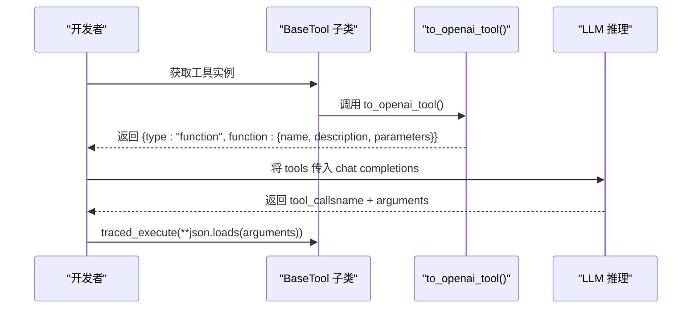
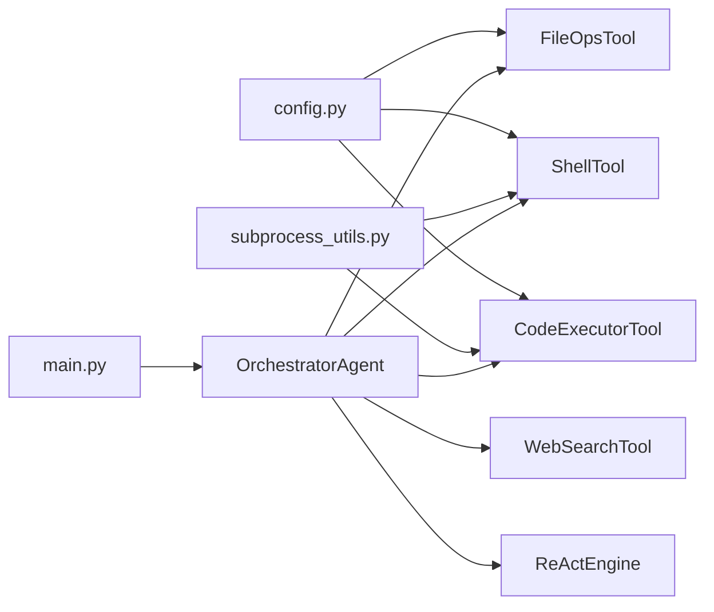

# 添加新工具

<cite>
**本文引用的文件**
- [tools/base.py](file://tools/base.py)
- [tools/web_search.py](file://tools/web_search.py)
- [tools/code_executor.py](file://tools/code_executor.py)
- [tools/file_ops.py](file://tools/file_ops.py)
- [tools/shell_tool.py](file://tools/shell_tool.py)
- [tools/subprocess_utils.py](file://tools/subprocess_utils.py)
- [tools/router.py](file://tools/router.py)
- [tools/__init__.py](file://tools/__init__.py)
- [config.py](file://config.py)
- [main.py](file://main.py)
- [agents/orchestrator.py](file://agents/orchestrator.py)
- [react/engine.py](file://react/engine.py)
- [tests/test_real_tools.py](file://tests/test_real_tools.py)
- [tests/test_shell_tool.py](file://tests/test_shell_tool.py)
</cite>

## 目录
1. [简介](#简介)
2. [项目结构](#项目结构)
3. [核心组件](#核心组件)
4. [架构总览](#架构总览)
5. [详细组件分析](#详细组件分析)
6. [依赖分析](#依赖分析)
7. [性能考量](#性能考量)
8. [故障排查指南](#故障排查指南)
9. [结论](#结论)
10. [附录](#附录)

## 简介
本指南面向希望为系统添加“新工具”的开发者，围绕 BaseTool 抽象基类的设计原理与接口规范展开，提供从继承 BaseTool 到实现具体功能的完整开发流程；详解 JSON Schema 参数设计的最佳实践（含参数验证、默认值与错误处理）；给出 WebSearchTool、CodeExecutorTool 等内置工具的实现模式；解释工具注册与集成过程，以及如何通过 to_openai_tool 方法适配 OpenAI 函数调用格式；最后涵盖工具测试方法、性能优化建议与安全注意事项。

## 项目结构
工具体系位于 tools 目录，核心抽象为 BaseTool，具体工具包括 WebSearchTool、CodeExecutorTool、FileOpsTool、ShellTool，配套有工具路由 ToolRouter、子进程工具 subprocess_utils，以及配置 config.py。主程序 main.py 与 OrchestratorAgent、ReActEngine 等组件共同完成工具的注册、调度与执行。

**图表来源**
- [tools/base.py:22-175](file://tools/base.py#L22-L175)
- [tools/web_search.py:56-113](file://tools/web_search.py#L56-L113)
- [tools/code_executor.py:25-102](file://tools/code_executor.py#L25-L102)
- [tools/file_ops.py:23-138](file://tools/file_ops.py#L23-L138)
- [tools/shell_tool.py:25-152](file://tools/shell_tool.py#L25-L152)
- [tools/router.py:47-168](file://tools/router.py#L47-L168)
- [tools/subprocess_utils.py:38-156](file://tools/subprocess_utils.py#L38-L156)
- [config.py:69-109](file://config.py#L69-L109)
- [main.py:448-455](file://main.py#L448-L455)
- [agents/orchestrator.py:117-121](file://agents/orchestrator.py#L117-L121)
- [react/engine.py:189-215](file://react/engine.py#L189-L215)

**章节来源**
- [tools/base.py:1-175](file://tools/base.py#L1-L175)
- [tools/__init__.py:1-8](file://tools/__init__.py#L1-L8)
- [config.py:69-109](file://config.py#L69-L109)
- [main.py:448-455](file://main.py#L448-L455)
- [agents/orchestrator.py:117-121](file://agents/orchestrator.py#L117-L121)
- [react/engine.py:189-215](file://react/engine.py#L189-L215)

## 核心组件
- BaseTool 抽象基类：定义工具的统一接口，包括 name、description、parameters_schema 与 execute，并提供 traced_execute 的可选追踪执行入口与 to_openai_tool 的 OpenAI 函数调用格式转换。
- 具体工具：WebSearchTool（网络搜索）、CodeExecutorTool（Python 代码执行）、FileOpsTool（文件操作）、ShellTool（Shell 命令执行）。
- 工具路由：ToolRouter 提供失败计数与替代工具建议，提升系统鲁棒性。
- 子进程工具：subprocess_utils 提供安全的子进程执行、环境变量清洗、输出大小限制与超时保障。
- 配置：config.py 提供工具执行超时、并发限制、沙箱目录、追踪开关等全局参数。

**章节来源**
- [tools/base.py:22-175](file://tools/base.py#L22-L175)
- [tools/web_search.py:56-113](file://tools/web_search.py#L56-L113)
- [tools/code_executor.py:25-102](file://tools/code_executor.py#L25-L102)
- [tools/file_ops.py:23-138](file://tools/file_ops.py#L23-L138)
- [tools/shell_tool.py:25-152](file://tools/shell_tool.py#L25-L152)
- [tools/router.py:47-168](file://tools/router.py#L47-L168)
- [tools/subprocess_utils.py:38-156](file://tools/subprocess_utils.py#L38-L156)
- [config.py:69-109](file://config.py#L69-L109)

## 架构总览
工具在系统中的调用链路如下：主程序注册工具，OrchestratorAgent/ReActEngine 在推理过程中选择工具并调用 traced_execute，工具内部通过 subprocess_utils 安全执行外部命令或代码，最终返回字符串结果供 LLM 使用。工具路由在连续失败时提供替代建议，配置模块贯穿影响执行超时、并发与沙箱行为。

**图表来源**
- [main.py:448-455](file://main.py#L448-L455)
- [agents/orchestrator.py:117-121](file://agents/orchestrator.py#L117-L121)
- [react/engine.py:189-215](file://react/engine.py#L189-L215)
- [tools/base.py:60-124](file://tools/base.py#L60-L124)
- [tools/subprocess_utils.py:62-101](file://tools/subprocess_utils.py#L62-L101)

## 详细组件分析

### BaseTool 抽象基类与接口规范
- 接口职责
  - name：工具唯一标识，用于函数调用与追踪。
  - description：人类可读的工具用途描述，帮助 LLM 判断何时调用。
  - parameters_schema：JSON Schema，描述参数类型、必填项与约束，供 LLM 生成正确参数。
  - execute：异步执行工具并返回字符串结果，便于 LLM 处理。
  - traced_execute：带追踪的执行入口，支持 OpenTelemetry 采样与属性记录，零开销降级。
  - to_openai_tool：将工具转换为 OpenAI tools 格式，直接传入 chat completions 的 tools 参数。
- 设计要点
  - 统一返回字符串，简化下游处理。
  - traced_execute 内置敏感参数清洗与长度截断，避免泄露与属性溢出。
  - OpenAI 适配器直接复用 name/description/schema，无需额外封装。

**图表来源**
- [tools/base.py:22-175](file://tools/base.py#L22-L175)

**章节来源**
- [tools/base.py:22-175](file://tools/base.py#L22-L175)

### WebSearchTool（网络搜索）
- 设计模式
  - 继承 BaseTool，实现 name/description/parameters_schema/execute。
  - 参数 Schema 仅包含 query 字段，必填。
  - execute 将结果格式化为易读文本，便于 LLM 消费。
  - 提供 _mock_search 以便扩展真实搜索 API。
- JSON Schema 最佳实践
  - 必填字段 required: ["query"]。
  - 类型与描述清晰，便于 LLM 生成合法参数。
- 安全与错误处理
  - 无外部调用时默认返回预设 mock 结果，避免空返回。
  - 可通过替换 _mock_search 无缝接入真实搜索服务。

**图表来源**
- [tools/web_search.py:87-113](file://tools/web_search.py#L87-L113)

**章节来源**
- [tools/web_search.py:56-113](file://tools/web_search.py#L56-L113)

### CodeExecutorTool（Python 代码执行）
- 设计模式
  - 继承 BaseTool，参数 Schema 包含 code 字段，必填。
  - 通过 asyncio.Semaphore 控制最大并发，避免资源争用。
  - execute 内部捕获超时与异常，返回可读错误信息。
  - _run_code 使用 subprocess_utils.run_with_limits 执行，带超时与输出限制。
- JSON Schema 最佳实践
  - 必填字段 required: ["code"]。
  - 通过 description 明确“使用 print() 生成可捕获输出”。
- 安全与性能
  - 沙箱目录限制工作目录，环境变量清洗，输出截断防止内存膨胀。
  - 超时与并发限制保障稳定性。

**图表来源**
- [tools/code_executor.py:64-102](file://tools/code_executor.py#L64-L102)
- [tools/subprocess_utils.py:62-101](file://tools/subprocess_utils.py#L62-L101)

**章节来源**
- [tools/code_executor.py:25-102](file://tools/code_executor.py#L25-L102)
- [tools/subprocess_utils.py:38-156](file://tools/subprocess_utils.py#L38-L156)
- [config.py:69-77](file://config.py#L69-L77)

### FileOpsTool（文件操作）
- 设计模式
  - 继承 BaseTool，参数 Schema 包含 action（枚举 read/write/list）、filename、content。
  - 通过 _safe_path 防止路径穿越，严格限制在沙箱目录内。
  - execute 根据 action 分派到 _list/_read/_write。
- JSON Schema 最佳实践
  - 使用 enum 约束 action 取值，required 仅包含必要字段。
  - 通过 description 说明各字段用途。
- 安全与错误处理
  - 路径解析使用 realpath，拒绝逃逸沙箱。
  - 对不存在文件、权限问题、IO 异常进行明确错误反馈。

**图表来源**
- [tools/file_ops.py:73-138](file://tools/file_ops.py#L73-L138)

**章节来源**
- [tools/file_ops.py:23-138](file://tools/file_ops.py#L23-L138)
- [config.py:69-77](file://config.py#L69-L77)

### ShellTool（Shell 命令执行）
- 设计模式
  - 继承 BaseTool，参数 Schema 包含 command（必填）与 timeout（可选）。
  - 内置命令黑名单正则匹配，阻断高危命令与模式。
  - 通过 asyncio.Semaphore 控制并发，_run_shell 使用 subprocess_utils.run_with_limits。
- JSON Schema 最佳实践
  - required: ["command"]，timeout 为可选整数。
- 安全与性能
  - 环境变量清洗、输出截断、超时 kill 与进程清理，防止孤儿进程与内存泄漏。
  - 黑名单覆盖破坏性文件系统操作、提权、远程执行、系统服务修改、凭据导出等。

**图表来源**
- [tools/shell_tool.py:99-152](file://tools/shell_tool.py#L99-L152)
- [tools/subprocess_utils.py:62-101](file://tools/subprocess_utils.py#L62-L101)

**章节来源**
- [tools/shell_tool.py:25-152](file://tools/shell_tool.py#L25-L152)
- [tools/subprocess_utils.py:38-156](file://tools/subprocess_utils.py#L38-L156)
- [config.py:69-77](file://config.py#L69-L77)

### 工具路由 ToolRouter（失败切换建议）
- 功能概述
  - 统计每个节点上各工具的调用次数、失败次数与连续失败次数。
  - 当连续失败超过阈值，建议替代工具，避免陷入工具失败循环。
  - 提供提示字符串注入到 LLM 上下文，辅助决策。
- 关键接口
  - record_success/record_failure：更新统计。
  - should_suggest_alternative/get_failing_tools/get_alternative_tools：判定与建议。
  - get_hint/get_node_summary/reset_node：生成提示与可观测性摘要。

**图表来源**
- [tools/router.py:82-148](file://tools/router.py#L82-L148)
- [react/engine.py:189-215](file://react/engine.py#L189-L215)

**章节来源**
- [tools/router.py:47-168](file://tools/router.py#L47-L168)
- [react/engine.py:189-215](file://react/engine.py#L189-L215)

### OpenAI 函数调用适配：to_openai_tool
- 作用
  - 将任意 BaseTool 子类转换为 OpenAI tools 格式，直接传入 chat completions 的 tools 参数。
- 使用场景
  - 在 LLM 推理阶段，通过 tools 参数启用函数调用能力，工具名称与参数由 LLM 生成，再由系统解析并执行。
- 注意事项
  - 确保 name/description/parameters_schema 保持一致且准确，避免 LLM 生成无效参数。

**图表来源**
- [tools/base.py:153-175](file://tools/base.py#L153-L175)

**章节来源**
- [tools/base.py:153-175](file://tools/base.py#L153-L175)

## 依赖分析
- 工具对配置的依赖
  - 超时：CODE_EXEC_TIMEOUT、SHELL_EXEC_TIMEOUT。
  - 并发：CODE_MAX_CONCURRENT、SHELL_MAX_CONCURRENT。
  - 沙箱：SANDBOX_DIR。
  - 追踪：TRACING_ENABLED、TRACING_MAX_ATTRIBUTE_LENGTH 等。
- 工具对子进程工具的依赖
  - CodeExecutorTool 与 ShellTool 均依赖 subprocess_utils 的 run_with_limits 与 build_safe_env。
- 工具注册与集成
  - main.py 中集中注册 WebSearchTool、CodeExecutorTool、FileOpsTool、ShellTool。
  - OrchestratorAgent/ReActEngine 通过工具字典按名称查找并执行。

**图表来源**
- [config.py:69-109](file://config.py#L69-L109)
- [tools/code_executor.py:18-21](file://tools/code_executor.py#L18-L21)
- [tools/shell_tool.py:18-21](file://tools/shell_tool.py#L18-L21)
- [tools/subprocess_utils.py:38-156](file://tools/subprocess_utils.py#L38-L156)
- [main.py:448-455](file://main.py#L448-L455)
- [agents/orchestrator.py:117-121](file://agents/orchestrator.py#L117-L121)
- [react/engine.py:189-215](file://react/engine.py#L189-L215)

**章节来源**
- [config.py:69-109](file://config.py#L69-L109)
- [main.py:448-455](file://main.py#L448-L455)
- [agents/orchestrator.py:117-121](file://agents/orchestrator.py#L117-L121)
- [react/engine.py:189-215](file://react/engine.py#L189-L215)

## 性能考量
- 超时与并发
  - 为代码执行与 Shell 命令设置合理超时，避免长时间占用资源。
  - 通过 asyncio.Semaphore 控制最大并发，防止 CPU/IO 抢占。
- 输出与内存
  - 使用输出大小限制与截断策略，防止内存暴涨。
  - 对长结果进行截断记录，避免追踪属性过长。
- I/O 与路径安全
  - 文件操作严格限制在沙箱目录，避免磁盘扫描与越权访问。
- 追踪开销
  - traced_execute 在追踪关闭时零开销，开启时仅记录必要属性并进行参数清洗。

[本节为通用指导，无需特定文件引用]

## 故障排查指南
- 工具执行错误
  - 检查 execute 内部异常捕获与错误返回格式，确保包含关键信息（如超时、权限、路径非法等）。
  - 使用 traced_execute 查看追踪 Span 的 attributes（如 latency_ms、tool.error）与异常记录。
- Shell 命令被阻断
  - 核对黑名单正则是否命中，调整命令或白名单策略。
  - 确认环境变量已被清洗，避免凭据泄露导致的阻断。
- 并发与超时
  - 调整 CODE_MAX_CONCURRENT/SHELL_MAX_CONCURRENT 与 CODE_EXEC_TIMEOUT/SHELL_EXEC_TIMEOUT。
  - 观察并发信号量是否正确释放，避免死锁。
- 文件操作失败
  - 检查 _safe_path 是否拒绝访问，确认 filename 未逃逸沙箱。
  - 确认工作目录 SANDBOX_DIR 存在且具备读写权限。
- 测试参考
  - 使用 tests/test_real_tools.py 与 tests/test_shell_tool.py 的断言与用例，验证基本功能与边界条件。

**章节来源**
- [tools/code_executor.py:64-102](file://tools/code_executor.py#L64-L102)
- [tools/shell_tool.py:99-152](file://tools/shell_tool.py#L99-L152)
- [tools/file_ops.py:73-138](file://tools/file_ops.py#L73-L138)
- [tools/subprocess_utils.py:62-101](file://tools/subprocess_utils.py#L62-L101)
- [tests/test_real_tools.py:13-105](file://tests/test_real_tools.py#L13-L105)
- [tests/test_shell_tool.py:14-221](file://tests/test_shell_tool.py#L14-L221)

## 结论
通过遵循 BaseTool 的接口规范与 JSON Schema 设计原则，结合安全与性能最佳实践，开发者可以快速、稳定地为系统添加新工具。利用 traced_execute 与 ToolRouter，可在复杂执行环境中提升可靠性与可观测性；借助 to_openai_tool，可无缝适配主流 LLM 的函数调用能力。配合完善的测试与配置管理，新工具将与现有生态自然融合。

[本节为总结性内容，无需特定文件引用]

## 附录

### 开发新工具的完整流程
- 继承 BaseTool，实现以下属性与方法
  - name：工具唯一名称。
  - description：工具用途描述。
  - parameters_schema：JSON Schema，定义参数类型、必填项与约束。
  - execute：异步执行并返回字符串结果。
  - traced_execute：可选，使用内置追踪能力。
  - to_openai_tool：可选，适配 OpenAI 函数调用格式。
- 设计参数 Schema 的最佳实践
  - 明确必填字段 required。
  - 使用 enum 限定取值范围。
  - 为每个字段提供清晰的 description。
  - 如需默认值，可在工具内部解析 kwargs 时提供，但 Schema 中不直接声明默认值。
- 安全与健壮性
  - 对外部命令/代码执行使用 subprocess_utils 的 run_with_limits。
  - 清洗环境变量，限制输出大小，设置超时与并发上限。
  - 文件操作严格限制在沙箱目录，防止路径穿越。
- 注册与集成
  - 在 main.py 中将新工具实例加入工具列表。
  - 在 OrchestratorAgent/ReActEngine 中通过名称查找并调用。
- 测试与验证
  - 编写单元测试，覆盖正常路径、错误路径与边界条件。
  - 使用真实工具测试脚本与 Shell 工具测试脚本作为参考。
- 性能与安全优化
  - 调整 config.py 中的超时与并发参数，观察系统表现。
  - 在 traced_execute 中关注延迟与错误统计，定位瓶颈。

**章节来源**
- [tools/base.py:22-175](file://tools/base.py#L22-L175)
- [tools/web_search.py:74-86](file://tools/web_search.py#L74-L86)
- [tools/code_executor.py:51-63](file://tools/code_executor.py#L51-L63)
- [tools/file_ops.py:51-71](file://tools/file_ops.py#L51-L71)
- [tools/shell_tool.py:82-98](file://tools/shell_tool.py#L82-L98)
- [main.py:448-455](file://main.py#L448-L455)
- [agents/orchestrator.py:117-121](file://agents/orchestrator.py#L117-L121)
- [react/engine.py:189-215](file://react/engine.py#L189-L215)
- [config.py:69-109](file://config.py#L69-L109)
- [tests/test_real_tools.py:13-105](file://tests/test_real_tools.py#L13-L105)
- [tests/test_shell_tool.py:14-221](file://tests/test_shell_tool.py#L14-L221)