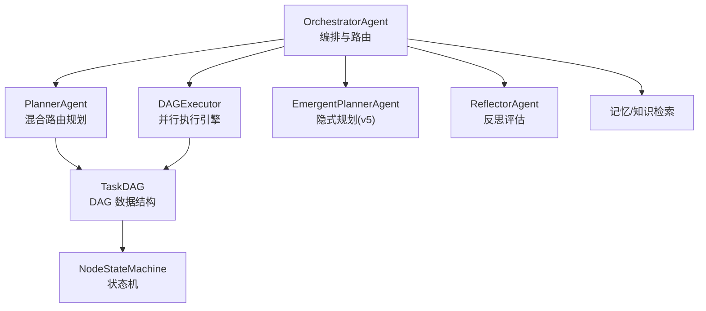
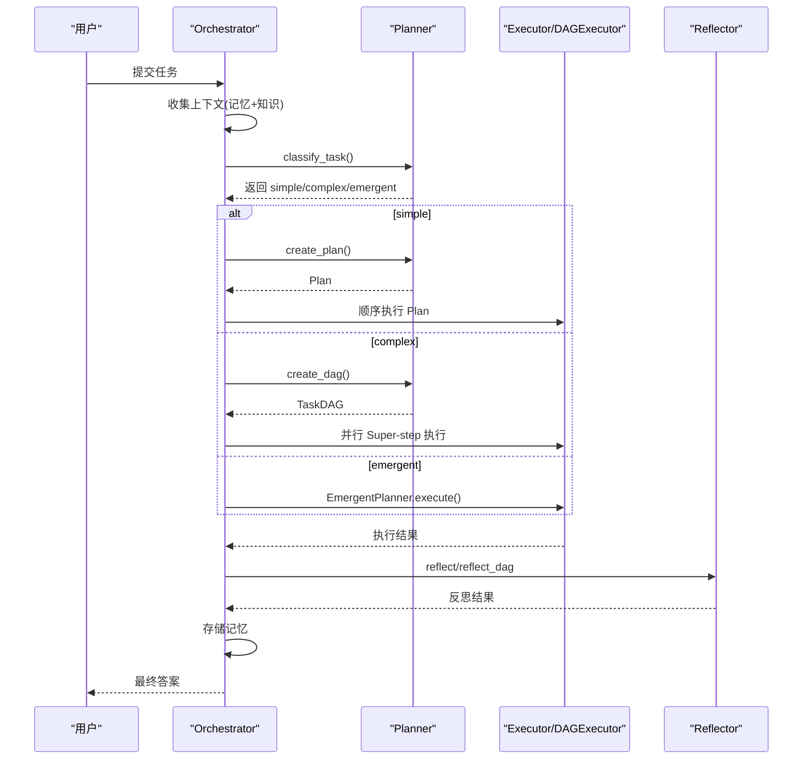
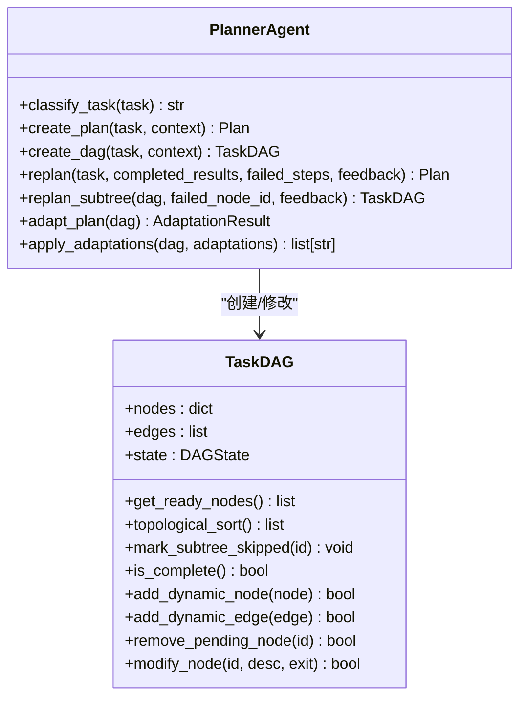
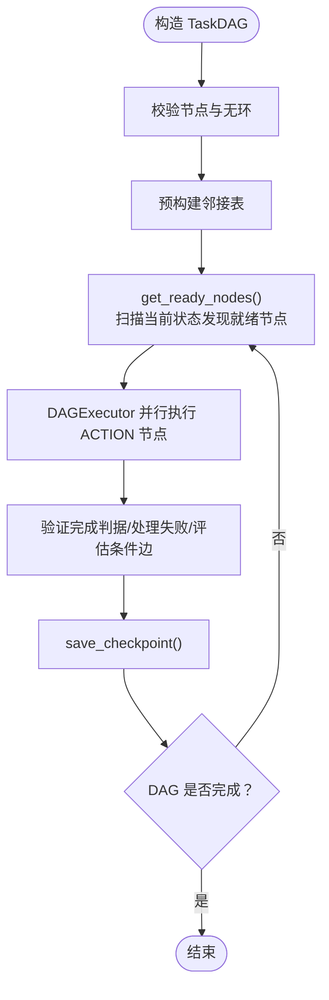
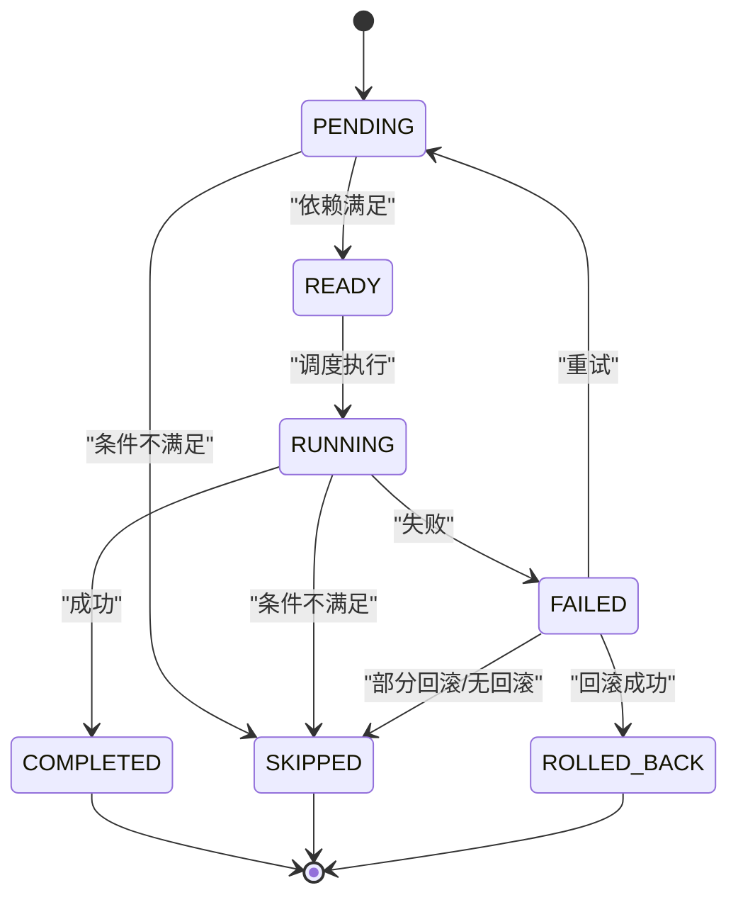
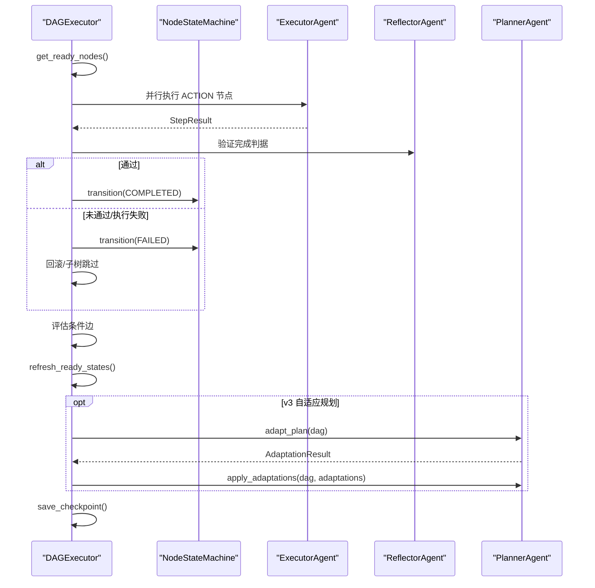
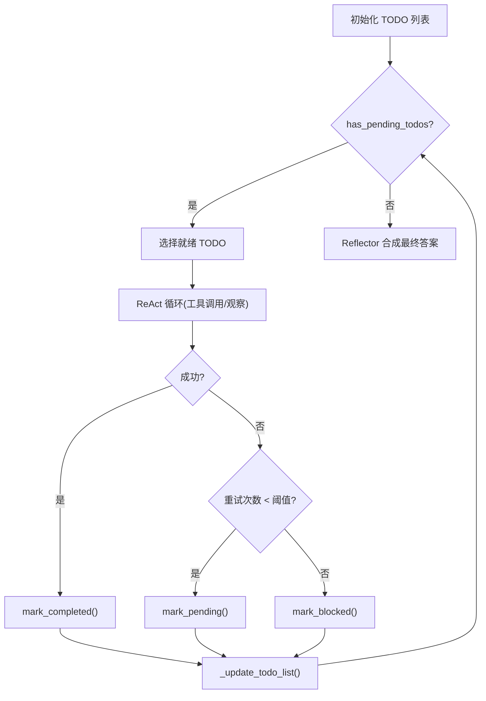
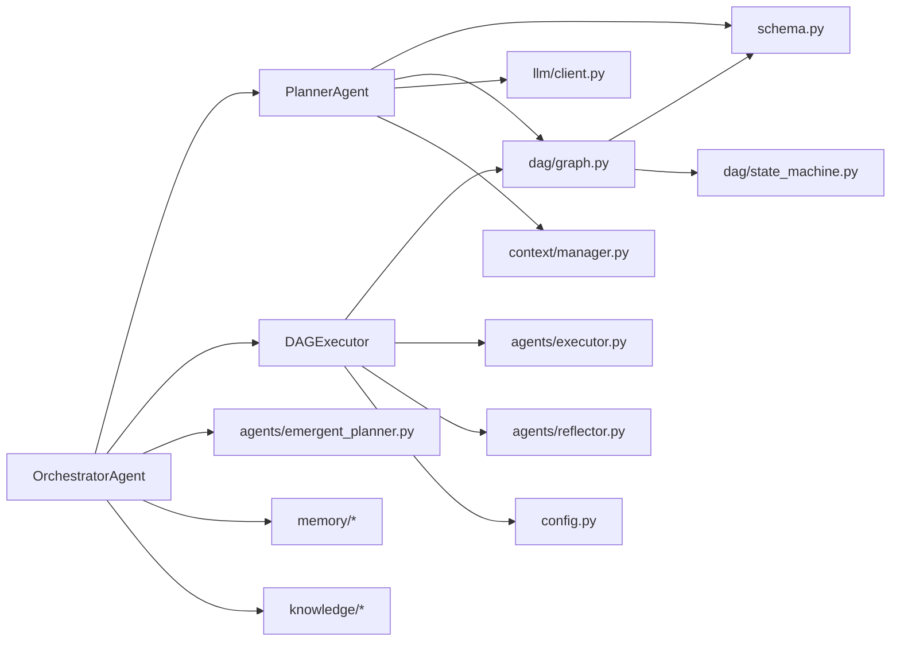

# 自定义规划器

<cite>
**本文引用的文件**
- [agents/planner.py](file://agents/planner.py)
- [agents/emergent_planner.py](file://agents/emergent_planner.py)
- [dag/graph.py](file://dag/graph.py)
- [dag/state_machine.py](file://dag/state_machine.py)
- [dag/executor.py](file://dag/executor.py)
- [agents/orchestrator.py](file://agents/orchestrator.py)
- [schema.py](file://schema.py)
- [config.py](file://config.py)
- [evaluation/metrics.py](file://evaluation/metrics.py)
</cite>

## 目录
1. [简介](#简介)
2. [项目结构](#项目结构)
3. [核心组件](#核心组件)
4. [架构总览](#架构总览)
5. [详细组件分析](#详细组件分析)
6. [依赖分析](#依赖分析)
7. [性能考量](#性能考量)
8. [故障排查指南](#故障排查指南)
9. [结论](#结论)
10. [附录](#附录)

## 简介
本指南面向希望为本项目开发“自定义规划器”的工程师，系统讲解现有规划器架构（v1 扁平规划、v2 DAG 规划、v5 隐式规划）的设计原理与实现差异，给出可扩展的开发接口与扩展点，涵盖：
- 规划算法接口与路由机制
- 复杂度分类器实现思路
- 评估指标设计与质量标准
- TaskDAG 数据结构与状态管理
- 与执行器、反思器的集成方式
- 规划器实现示例与测试方法
- 性能优化策略与调试技巧
- 如何扩展以支持新的任务类型与执行模式

## 项目结构
本项目采用“多智能体 + DAG 执行引擎”的混合架构，核心模块如下：
- Orchestrator：任务生命周期编排，负责上下文收集、复杂度分类、路由到 v1/v2/v5 路径、反思与记忆存储
- Planner：混合路由规划器，支持 v1 扁平计划、v2 DAG 分层计划、v5 隐式规划
- DAGExecutor：基于 Super-step 的并行执行引擎，支持条件边、失败回滚、子树跳过、自适应规划
- TaskDAG：有向无环图数据结构，承载节点、边、集中式状态与检查点
- NodeStateMachine：节点状态机，强制合法状态转移
- EmergentPlanner：隐式规划器（v5），基于 TODO 列表的 Claude Code 风格
- Evaluation：评估框架，定义规划/执行/效率/反思指标与评分

图表来源
- [agents/orchestrator.py:60-92](file://agents/orchestrator.py#L60-L92)
- [agents/planner.py:147-161](file://agents/planner.py#L147-L161)
- [dag/executor.py:62-85](file://dag/executor.py#L62-L85)
- [dag/graph.py:43-55](file://dag/graph.py#L43-L55)
- [dag/state_machine.py:55-69](file://dag/state_machine.py#L55-L69)

章节来源
- [agents/orchestrator.py:60-92](file://agents/orchestrator.py#L60-L92)
- [agents/planner.py:147-161](file://agents/planner.py#L147-L161)
- [dag/graph.py:43-55](file://dag/graph.py#L43-L55)
- [dag/state_machine.py:55-69](file://dag/state_machine.py#L55-L69)
- [dag/executor.py:62-85](file://dag/executor.py#L62-L85)

## 核心组件
- PlannerAgent（混合路由规划器）
  - 两阶段复杂度分类：规则快筛（Stage 1）+ LLM 兜底（Stage 2）
  - 三种规划路径：v1 扁平计划、v2 DAG 分层计划、v5 隐式规划
  - 支持局部重规划与自适应规划（v3）
- TaskDAG（DAG 数据结构）
  - 节点：Goal/SubGoal/Action，边：Dependency/Conditional/Rollback
  - 集中式状态 DAGState，节点结果以 node_id 为键写入
  - 支持动态增删节点/边、拓扑排序、下游子树跳过、检查点
- NodeStateMachine（节点状态机）
  - 强制合法状态转移：PENDING→READY→RUNNING→{COMPLETED, FAILED, SKIPPED}
  - FAILED→{ROLLED_BACK, SKIPPED, PENDING}（重试）
- DAGExecutor（并行执行引擎）
  - Super-step 模型：每轮并行执行 READY/PENDING 节点，合并结果、验证完成判据、处理失败与条件边
  - 支持自适应规划（v3）：定期评估并调整待执行节点
- EmergentPlannerAgent（隐式规划 v5）
  - TODO 列表管理：初始化、动态更新、阻塞检测、停滞检测
  - ReAct 循环：工具调用、结果观察、自我组织
- OrchestratorAgent（编排器）
  - 上下文收集（记忆+知识）→ 复杂度分类 → 路由执行 → 反思评估 → 存储记忆
- Evaluation（评估框架）
  - 定义规划/执行/效率/反思指标与评分函数，支持聚合统计

章节来源
- [agents/planner.py:213-363](file://agents/planner.py#L213-L363)
- [dag/graph.py:43-81](file://dag/graph.py#L43-L81)
- [dag/state_machine.py:55-114](file://dag/state_machine.py#L55-L114)
- [dag/executor.py:62-264](file://dag/executor.py#L62-L264)
- [agents/emergent_planner.py:72-128](file://agents/emergent_planner.py#L72-L128)
- [agents/orchestrator.py:60-92](file://agents/orchestrator.py#L60-L92)
- [evaluation/metrics.py:76-201](file://evaluation/metrics.py#L76-L201)

## 架构总览
混合路由 v4 的核心流程：
- 复杂度分类：规则快筛（零成本）→ LLM 兜底（仅对模糊区间）
- 路由执行：
  - simple → v1 扁平计划（顺序执行）
  - complex → v2 DAG（并行 Super-step 执行）
  - emergent → v5 隐式规划（TODO 列表管理）
- 反思评估：v1 使用 reflect，v2 使用 reflect_dag
- 记忆存储：将任务摘要与学习存入长期记忆

图表来源
- [agents/orchestrator.py:158-222](file://agents/orchestrator.py#L158-L222)
- [agents/planner.py:481-506](file://agents/planner.py#L481-L506)
- [dag/executor.py:110-131](file://dag/executor.py#L110-L131)

章节来源
- [agents/orchestrator.py:158-222](file://agents/orchestrator.py#L158-L222)
- [agents/planner.py:481-506](file://agents/planner.py#L481-L506)
- [dag/executor.py:110-131](file://dag/executor.py#L110-L131)

## 详细组件分析

### PlannerAgent（混合路由规划器）
- 复杂度分类（v4）
  - Stage 1：规则快筛（关键词模式、长度、动作词、条件/并行/探索/不确定性等）
  - Stage 2：轻量 LLM 分类（仅对模糊区间，温度=0.0，确定性输出）
  - 支持 PLAN_MODE 强制覆盖（用于测试/调试），并可降级 emergent 到 complex
- v1 扁平计划
  - 使用轻量提示词生成 2-6 步线性计划
  - 支持 replan（基于已完成/失败步骤重规划）
- v2 DAG 分层计划
  - 生成 Goal→SubGoals→Actions 的嵌套 JSON，解析为 TaskDAG
  - 支持 replan_subtree（仅重建失败子树，保留已完成工作）
  - 支持 adapt_plan（超步间自适应规划）与 apply_adaptations（动态增删改节点）
- v5 隐式规划（通过 Orchestrator 路由）
  - 由 EmergentPlannerAgent 实现（见下一节）

图表来源
- [agents/planner.py:213-363](file://agents/planner.py#L213-L363)
- [agents/planner.py:481-673](file://agents/planner.py#L481-L673)
- [dag/graph.py:43-81](file://dag/graph.py#L43-L81)

章节来源
- [agents/planner.py:213-363](file://agents/planner.py#L213-L363)
- [agents/planner.py:481-673](file://agents/planner.py#L481-L673)
- [dag/graph.py:43-81](file://dag/graph.py#L43-L81)

### TaskDAG 数据结构与状态管理
- 节点与边
  - 节点类型：Goal/SubGoal/Action
  - 边类型：Dependency/Conditional/Rollback
- 集中式状态
  - DAGState：task/context/node_results
  - get_node_context：按依赖节点结果拼接上下文
  - merge_result：覆盖式写入（并行节点各自写入不同 key）
- 运行时查询与算法
  - get_ready_nodes：运行时发现就绪节点（非预定义序列）
  - topological_sort：Kahn 算法，仅考虑 Dependency 边
  - get_downstream/mark_subtree_skipped：失败时级联跳过子树
  - get_blockage_report/try_recover_blocked_nodes：阻塞诊断与恢复
- 动态图变更（v3）
  - add/remove/modify 节点与边，自动环检测与邻接表维护
- 检查点（LangGraph-inspired）
  - save_checkpoint/to_dict/from_dict：内存快照，限制数量

图表来源
- [dag/graph.py:82-95](file://dag/graph.py#L82-L95)
- [dag/graph.py:101-126](file://dag/graph.py#L101-L126)
- [dag/graph.py:219-249](file://dag/graph.py#L219-L249)
- [dag/graph.py:341-399](file://dag/graph.py#L341-L399)
- [dag/graph.py:521-578](file://dag/graph.py#L521-L578)

章节来源
- [dag/graph.py:82-95](file://dag/graph.py#L82-L95)
- [dag/graph.py:101-126](file://dag/graph.py#L101-L126)
- [dag/graph.py:219-249](file://dag/graph.py#L219-L249)
- [dag/graph.py:341-399](file://dag/graph.py#L341-L399)
- [dag/graph.py:521-578](file://dag/graph.py#L521-L578)

### NodeStateMachine（节点状态机）
- 合法转移表：PENDING→READY→RUNNING→{COMPLETED, FAILED, SKIPPED}
- FAILED→{ROLLED_BACK, SKIPPED, PENDING}（重试）
- 终态：COMPLETED/SKIPPED/ROLLED_BACK
- 回调事件：节点状态变化广播，用于 UI 实时更新

图表来源
- [dag/state_machine.py:42-52](file://dag/state_machine.py#L42-L52)
- [dag/state_machine.py:88-114](file://dag/state_machine.py#L88-L114)

章节来源
- [dag/state_machine.py:42-52](file://dag/state_machine.py#L42-L52)
- [dag/state_machine.py:88-114](file://dag/state_machine.py#L88-L114)

### DAGExecutor（并行执行引擎）
- Super-step 模型：每轮并行执行 READY/PENDING ACTION 节点
- 关键流程
  - _run_node_with_timeout：带超时保护
  - _check_exit_criteria：Reflector 验证完成判据
  - _handle_failure：回滚 + 子树跳过
  - _process_conditions：条件边评估（词边界/子串匹配）
  - _complete_structural_nodes：自动完成 GOAL/SUBGOAL
  - _compile_output：拓扑序汇总输出
- 自适应规划（v3）
  - _should_adapt：间隔与完成度检查
  - _adapt_plan：调用 Planner.adapt_plan 并应用变更

图表来源
- [dag/executor.py:110-264](file://dag/executor.py#L110-L264)
- [dag/executor.py:271-310](file://dag/executor.py#L271-L310)
- [dag/executor.py:316-331](file://dag/executor.py#L316-L331)
- [dag/executor.py:350-400](file://dag/executor.py#L350-L400)
- [dag/executor.py:405-473](file://dag/executor.py#L405-L473)
- [dag/executor.py:578-632](file://dag/executor.py#L578-L632)

章节来源
- [dag/executor.py:110-264](file://dag/executor.py#L110-L264)
- [dag/executor.py:271-310](file://dag/executor.py#L271-L310)
- [dag/executor.py:316-331](file://dag/executor.py#L316-L331)
- [dag/executor.py:350-400](file://dag/executor.py#L350-L400)
- [dag/executor.py:405-473](file://dag/executor.py#L405-L473)
- [dag/executor.py:578-632](file://dag/executor.py#L578-L632)

### EmergentPlannerAgent（隐式规划 v5）
- TODO 列表管理
  - 初始化：从任务描述生成 1-3 个初始 TODO
  - 动态更新：根据执行结果新增/修改/阻塞 TODO
  - 阻塞检测与停滞检测（连续多轮无进展）
- ReAct 循环
  - think_with_tools：工具调用与结果观察
  - 统一 ReActEngine（v6.0 可选）
- 结果汇总：Reflector 合成最终答案

图表来源
- [agents/emergent_planner.py:134-276](file://agents/emergent_planner.py#L134-L276)
- [agents/emergent_planner.py:283-459](file://agents/emergent_planner.py#L283-L459)
- [agents/emergent_planner.py:465-581](file://agents/emergent_planner.py#L465-L581)
- [agents/emergent_planner.py:623-674](file://agents/emergent_planner.py#L623-L674)

章节来源
- [agents/emergent_planner.py:134-276](file://agents/emergent_planner.py#L134-L276)
- [agents/emergent_planner.py:283-459](file://agents/emergent_planner.py#L283-L459)
- [agents/emergent_planner.py:465-581](file://agents/emergent_planner.py#L465-L581)
- [agents/emergent_planner.py:623-674](file://agents/emergent_planner.py#L623-L674)

### OrchestratorAgent（编排器）
- 生命周期：上下文收集 → 复杂度分类 → 路由执行 → 反思 → 存储记忆
- v8 目标驱动规划（可选）：与 v5 隐式规划并行，通过配置开关启用
- 事件驱动：多播回调（UI + TracingBridge），保证稳定性

章节来源
- [agents/orchestrator.py:60-92](file://agents/orchestrator.py#L60-L92)
- [agents/orchestrator.py:158-222](file://agents/orchestrator.py#L158-L222)
- [agents/orchestrator.py:370-432](file://agents/orchestrator.py#L370-L432)
- [agents/orchestrator.py:439-508](file://agents/orchestrator.py#L439-L508)

## 依赖分析
- PlannerAgent 依赖
  - schema：Plan/TaskNode/TaskEdge/DAGState/AdaptAction/PlanAdaptation/AdaptationResult
  - dag.graph：TaskDAG
  - llm.client：与 LLM 交互
  - context.manager：上下文压缩
- TaskDAG 依赖
  - schema：NodeStatus/NodeType/EdgeType/ExitCriteria/RiskAssessment
  - dag.state_machine：NodeStateMachine
- DAGExecutor 依赖
  - dag.graph：TaskDAG
  - agents.executor/agents.reflector：执行与反思
  - config：并行度、超时、自适应规划开关
- OrchestratorAgent 依赖
  - agents.planner/executor/reflector/emergent_planner
  - dag.executor：DAG 执行
  - memory/knowledge：上下文收集
  - config：路由与执行参数

图表来源
- [agents/planner.py:34-54](file://agents/planner.py#L34-L54)
- [dag/graph.py:36-38](file://dag/graph.py#L36-L38)
- [dag/state_machine.py:25-26](file://dag/state_machine.py#L25-L26)
- [dag/executor.py:48-57](file://dag/executor.py#L48-L57)
- [agents/orchestrator.py:42-56](file://agents/orchestrator.py#L42-L56)

章节来源
- [agents/planner.py:34-54](file://agents/planner.py#L34-L54)
- [dag/graph.py:36-38](file://dag/graph.py#L36-L38)
- [dag/state_machine.py:25-26](file://dag/state_machine.py#L25-L26)
- [dag/executor.py:48-57](file://dag/executor.py#L48-L57)
- [agents/orchestrator.py:42-56](file://agents/orchestrator.py#L42-L56)

## 性能考量
- 规划阶段
  - Stage 1 规则快筛（零成本）优先，仅对模糊区间触发 Stage 2 LLM 分类
  - v1 轻量提示词，v2 一次性生成嵌套 JSON，减少往返
- 执行阶段
  - DAGExecutor 使用 MAX_PARALLEL_NODES 控制每轮并行度，避免资源争用
  - 节点超时保护（NODE_EXECUTION_TIMEOUT），防止卡死
  - 条件边评估去重（已评估 pair 缓存），避免重复计算
- 状态与存储
  - DAGState 使用 dict 覆盖写入，天然无锁冲突
  - 检查点数量限制（MAX_CHECKPOINTS），防止内存膨胀
- 评估与监控
  - TokenUsage/LLMCallRecord 记录 LLM 调用开销
  - 评估指标包含轨迹效率、工具使用准确率、重规划频率等

章节来源
- [agents/planner.py:213-259](file://agents/planner.py#L213-L259)
- [dag/executor.py:169-182](file://dag/executor.py#L169-L182)
- [dag/executor.py:291-310](file://dag/executor.py#L291-L310)
- [dag/executor.py:405-447](file://dag/executor.py#L405-L447)
- [dag/graph.py:521-542](file://dag/graph.py#L521-L542)
- [evaluation/metrics.py:125-148](file://evaluation/metrics.py#L125-L148)
- [config.py:44-59](file://config.py#L44-L59)

## 故障排查指南
- DAG 执行卡住
  - 检查 get_ready_nodes 是否为空，结合 get_blockage_report 定位阻塞节点
  - 查看 FAILED 节点与条件边是否导致下游子树跳过
- 节点失败与回滚
  - _handle_failure 会执行回滚边并跳过子树；若回滚失败，节点标记为 SKIPPED
- 条件边误判
  - _evaluate_condition 支持 CJK 子串匹配与拉丁词边界匹配，注意大小写与标点
- 超时与异常
  - _run_node_with_timeout 统一捕获超时与异常，避免影响批次
- 重规划与自适应
  - v1：replan 基于已完成/失败步骤重规划
  - v2：replan_subtree 仅重建失败子树，保留已完成工作
  - v3：自适应规划定期评估并调整待执行节点
- 隐式规划停滞
  - 检查 TODO 列表是否无就绪项且连续多轮无进展，必要时触发停滞检测

章节来源
- [dag/graph.py:277-312](file://dag/graph.py#L277-L312)
- [dag/executor.py:134-141](file://dag/executor.py#L134-L141)
- [dag/executor.py:350-400](file://dag/executor.py#L350-L400)
- [dag/executor.py:405-473](file://dag/executor.py#L405-L473)
- [dag/executor.py:291-310](file://dag/executor.py#L291-L310)
- [agents/planner.py:391-431](file://agents/planner.py#L391-L431)
- [agents/planner.py:513-566](file://agents/planner.py#L513-L566)
- [agents/emergent_planner.py:177-190](file://agents/emergent_planner.py#L177-L190)

## 结论
本项目提供了从“规则快筛 + LLM 兜底”的混合路由，到“v1 扁平计划、v2 DAG 并行执行、v5 隐式规划”的完整规划体系。通过 TaskDAG 与 NodeStateMachine 的组合，实现了可演进、可回滚、可自适应的执行闭环；配合 Orchestrator 的事件驱动与 Tracing 集成，便于调试与可视化。评估框架提供了全面的指标体系，可用于持续优化规划质量与执行效率。

## 附录

### 自定义规划器开发接口与扩展点
- 规划算法接口
  - 复杂度分类：实现 classify_task(task) → "simple"/"complex"/"emergent"
  - v1 规划：create_plan(task, context) → Plan
  - v2 规划：create_dag(task, context) → TaskDAG
  - 局部重规划：replan_subtree(dag, failed_node_id, feedback) → TaskDAG
  - 自适应规划：adapt_plan(dag) → AdaptationResult；apply_adaptations(dag, adaptations) → 变更描述列表
- 复杂度分类器实现要点
  - Stage 1：关键词模式（多步、条件、并行、动作词、探索/不确定性）+ 文本长度阈值打分
  - Stage 2：最小化提示词（~60 tokens），temperature=0.0，确定性输出
  - PLAN_MODE 强制覆盖与 emergent 降级策略
- 评估指标设计
  - 规划质量：分类准确率、计划结构有效性、步骤覆盖率、生成耗时
  - 执行质量：任务/步骤成功率、工具使用准确率、ReAct 迭代效率
  - 效率：轨迹效率、Token/时间消耗、重规划频率
  - 反思准确性：反射判定与基准对比、误判率
- TaskDAG 使用与状态管理
  - 动态增删改节点/边：add/remove/modify_node，add/remove/modify_edge
  - 运行时就绪发现：get_ready_nodes，refresh_ready_states
  - 失败处理：mark_subtree_skipped，回滚与子树跳过
  - 拓扑汇总：topological_sort，_compile_output
- 与执行器、反思器集成
  - v1：顺序执行 Plan，执行后 reflect
  - v2：DAGExecutor 并行执行，执行后 reflect_dag
  - v5：EmergentPlanner 通过 TODO 列表管理，最终合成答案
- 规划器实现示例与测试方法
  - 示例：在 PlannerAgent 中新增分类规则或提示词模板，或在 DAGExecutor 中增加自定义条件边评估逻辑
  - 测试：使用 evaluation/metrics.py 的指标与评分函数，构造多难度任务集，对比 simple/complex/emergent 三种模式的综合得分与失败分布
- 性能优化策略
  - 控制 MAX_PARALLEL_NODES、NODE_EXECUTION_TIMEOUT、ADAPT_PLAN_INTERVAL
  - 使用 Stage 1 规则快筛降低 LLM 调用频次
  - 条件边评估去重、邻接表预构建、检查点数量限制
- 调试技巧
  - 启用 TRACING_ENABLED 记录全流程事件
  - 使用 DAG.checkpoints 与 get_blockage_report 定位阻塞
  - 通过 PLAN_MODE 强制路由定位问题模块

章节来源
- [agents/planner.py:213-363](file://agents/planner.py#L213-L363)
- [agents/planner.py:481-673](file://agents/planner.py#L481-L673)
- [dag/graph.py:341-399](file://dag/graph.py#L341-L399)
- [dag/graph.py:521-578](file://dag/graph.py#L521-L578)
- [dag/executor.py:110-264](file://dag/executor.py#L110-L264)
- [agents/emergent_planner.py:134-276](file://agents/emergent_planner.py#L134-L276)
- [evaluation/metrics.py:76-201](file://evaluation/metrics.py#L76-L201)
- [config.py:38-67](file://config.py#L38-L67)