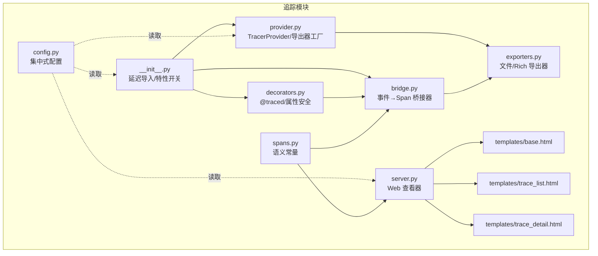
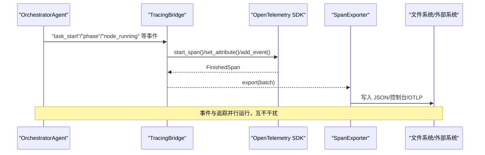
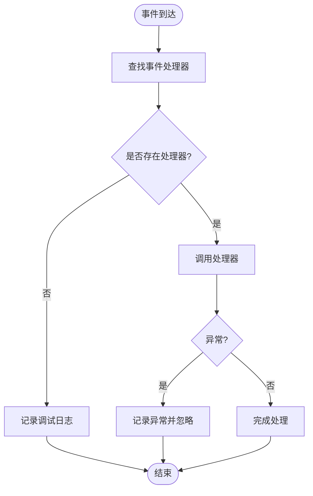
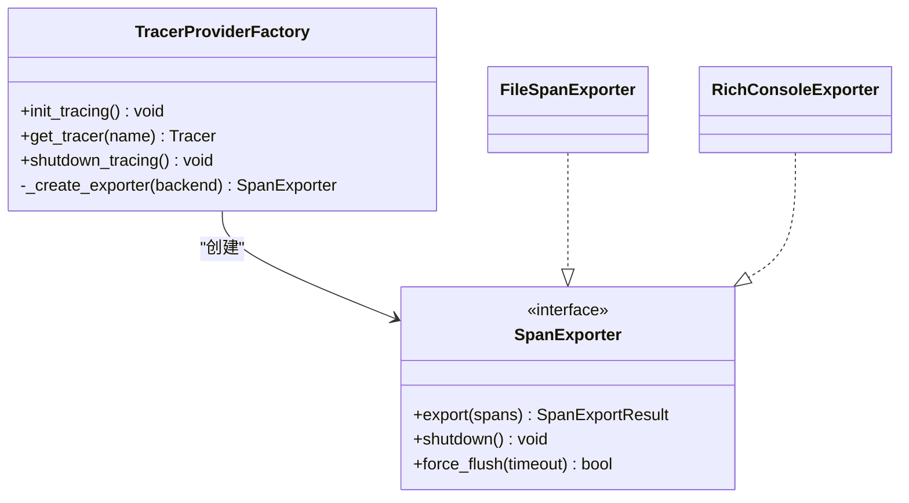
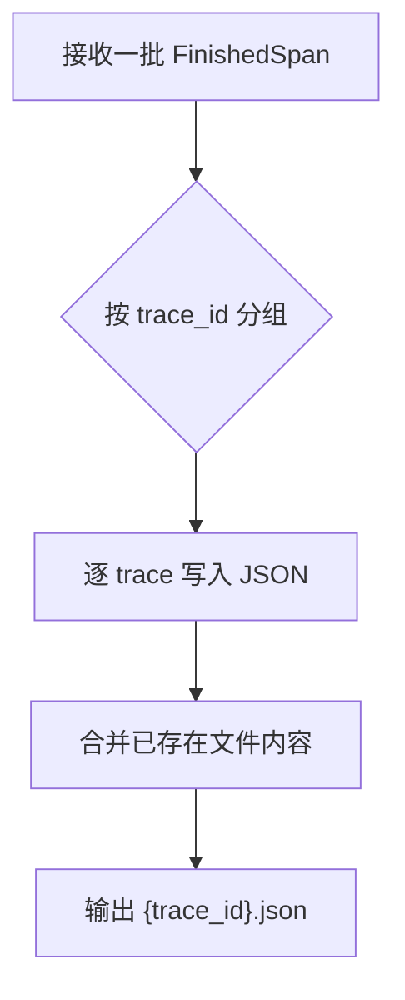
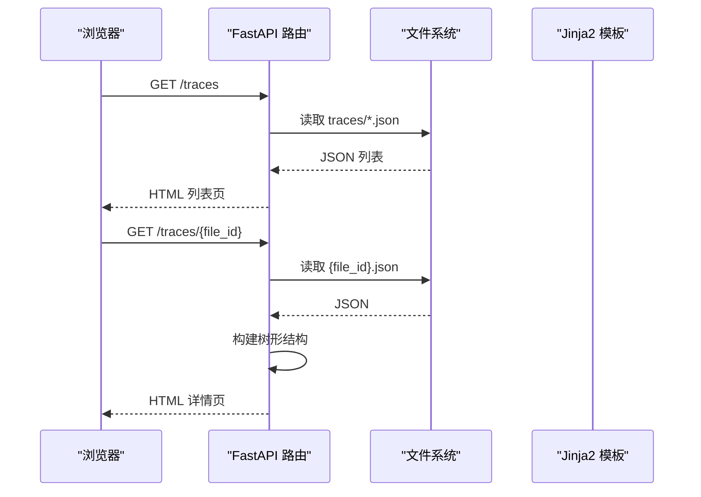
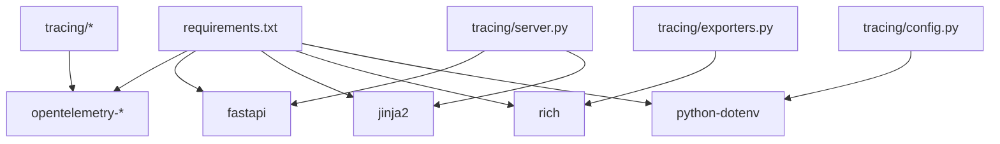

# 追踪扩展开发

<cite>
**本文引用的文件**
- [tracing/__init__.py](file://tracing/__init__.py)
- [tracing/bridge.py](file://tracing/bridge.py)
- [tracing/provider.py](file://tracing/provider.py)
- [tracing/exporters.py](file://tracing/exporters.py)
- [tracing/config.py](file://tracing/config.py)
- [tracing/spans.py](file://tracing/spans.py)
- [tracing/decorators.py](file://tracing/decorators.py)
- [tracing/server.py](file://tracing/server.py)
- [tracing/templates/base.html](file://tracing/templates/base.html)
- [tracing/templates/trace_list.html](file://tracing/templates/trace_list.html)
- [tracing/templates/trace_detail.html](file://tracing/templates/trace_detail.html)
- [config.py](file://config.py)
- [requirements.txt](file://requirements.txt)
- [tests/test_tracing.py](file://tests/test_tracing.py)
- [agents/orchestrator.py](file://agents/orchestrator.py)
</cite>

## 目录
1. [简介](#简介)
2. [项目结构](#项目结构)
3. [核心组件](#核心组件)
4. [架构总览](#架构总览)
5. [详细组件分析](#详细组件分析)
6. [依赖分析](#依赖分析)
7. [性能考虑](#性能考虑)
8. [故障排查指南](#故障排查指南)
9. [结论](#结论)
10. [附录](#附录)

## 简介
本指南面向追踪扩展开发者，围绕 TracingBridge 架构与 OpenTelemetry 集成进行系统化讲解，覆盖以下主题：
- TracingBridge 如何将既有事件系统无缝桥接到 OpenTelemetry，形成统一的全链路追踪。
- OpenTelemetry 初始化、采样策略、导出器选择与批处理机制。
- 自定义导出器的开发方法：接口实现、数据格式转换、输出目标配置。
- UI 模板定制流程：Jinja2 语法、静态资源管理、响应式设计。
- 追踪数据的采集、处理与存储（文件导出、Web 查看器）。
- 具体导出器实现示例思路（自定义日志导出器、数据库导出器等）。
- 追踪配置管理、性能监控与调试方法。
- 如何扩展追踪能力以满足新的可视化与数据分析需求。

## 项目结构
追踪模块位于 tracing 包内，采用“功能域”组织方式：
- tracing/__init__.py：对外暴露统一入口，按配置决定启用/禁用追踪。
- tracing/provider.py：OpenTelemetry TracerProvider 初始化与导出器工厂。
- tracing/bridge.py：事件到 Span 的桥接器，负责父子关系与生命周期管理。
- tracing/exporters.py：内置文件与 Rich 控制台导出器。
- tracing/config.py：集中式追踪配置，读取自根配置模块。
- tracing/spans.py：Span 名称、属性键、事件名与图标映射的语义常量。
- tracing/decorators.py：@traced 装饰器与属性安全处理工具。
- tracing/server.py：FastAPI Web 查看器，提供 Trace 列表与详情页。
- tracing/templates/*：Jinja2 模板与前端样式，支持响应式布局。
- tests/test_tracing.py：覆盖特性开关、事件映射、导出器、装饰器等测试。
- agents/orchestrator.py：与 TracingBridge 多播集成，确保既有事件系统与追踪共存。

图表来源
- [tracing/__init__.py:1-67](file://tracing/__init__.py#L1-L67)
- [tracing/provider.py:1-197](file://tracing/provider.py#L1-L197)
- [tracing/bridge.py:1-765](file://tracing/bridge.py#L1-L765)
- [tracing/exporters.py:1-304](file://tracing/exporters.py#L1-L304)
- [tracing/config.py:1-79](file://tracing/config.py#L1-L79)
- [tracing/spans.py:1-249](file://tracing/spans.py#L1-L249)
- [tracing/decorators.py:1-146](file://tracing/decorators.py#L1-L146)
- [tracing/server.py:1-276](file://tracing/server.py#L1-L276)
- [tracing/templates/base.html:1-229](file://tracing/templates/base.html#L1-L229)
- [tracing/templates/trace_list.html:1-63](file://tracing/templates/trace_list.html#L1-L63)
- [tracing/templates/trace_detail.html:1-644](file://tracing/templates/trace_detail.html#L1-L644)

章节来源
- [tracing/__init__.py:1-67](file://tracing/__init__.py#L1-L67)
- [tracing/provider.py:1-197](file://tracing/provider.py#L1-L197)
- [tracing/bridge.py:1-765](file://tracing/bridge.py#L1-L765)
- [tracing/exporters.py:1-304](file://tracing/exporters.py#L1-L304)
- [tracing/config.py:1-79](file://tracing/config.py#L1-L79)
- [tracing/spans.py:1-249](file://tracing/spans.py#L1-L249)
- [tracing/decorators.py:1-146](file://tracing/decorators.py#L1-L146)
- [tracing/server.py:1-276](file://tracing/server.py#L1-L276)
- [tracing/templates/base.html:1-229](file://tracing/templates/base.html#L1-L229)
- [tracing/templates/trace_list.html:1-63](file://tracing/templates/trace_list.html#L1-L63)
- [tracing/templates/trace_detail.html:1-644](file://tracing/templates/trace_detail.html#L1-L644)

## 核心组件
- TracingBridge：订阅事件系统，将事件映射为 OpenTelemetry Spans，维护父子层级与阶段管理，异常安全且支持并发。
- Provider 工厂：根据配置创建 TracerProvider、采样器与导出器，支持多种后端（控制台、文件、OTLP、Phoenix）。
- 导出器：内置文件导出器（JSON）与 Rich 控制台导出器；可扩展自定义导出器。
- 配置模块：集中读取环境变量，提供服务名、采样率、导出后端、输出目录等。
- 语义常量：标准化 Span 名称、属性键、事件名与图标映射，遵循 OpenTelemetry GenAI 语义规范。
- 装饰器：@traced 装饰器，支持同步/异步函数，自动记录时延、状态与异常。
- Web 查看器：基于 FastAPI/Jinja2 的 Trace 列表与详情页，支持树形视图与属性/事件展示。

章节来源
- [tracing/bridge.py:38-135](file://tracing/bridge.py#L38-L135)
- [tracing/provider.py:45-118](file://tracing/provider.py#L45-L118)
- [tracing/exporters.py:28-97](file://tracing/exporters.py#L28-L97)
- [tracing/config.py:14-79](file://tracing/config.py#L14-L79)
- [tracing/spans.py:14-249](file://tracing/spans.py#L14-L249)
- [tracing/decorators.py:70-146](file://tracing/decorators.py#L70-L146)
- [tracing/server.py:29-276](file://tracing/server.py#L29-L276)

## 架构总览
TracingBridge 作为事件到 Span 的桥接层，与现有事件系统（如 OrchestratorAgent 的 on_event）通过多播模式共存。Provider 工厂负责 OpenTelemetry SDK 初始化与导出器选择，导出器将完成的 Span 写入文件或发送至外部系统。Web 查看器从文件目录读取 JSON，构建树形视图并提供交互式详情面板。

图表来源
- [agents/orchestrator.py:103-114](file://agents/orchestrator.py#L103-L114)
- [tracing/bridge.py:117-143](file://tracing/bridge.py#L117-L143)
- [tracing/provider.py:90-107](file://tracing/provider.py#L90-L107)
- [tracing/exporters.py:46-88](file://tracing/exporters.py#L46-L88)

章节来源
- [agents/orchestrator.py:103-114](file://agents/orchestrator.py#L103-L114)
- [tracing/bridge.py:117-143](file://tracing/bridge.py#L117-L143)
- [tracing/provider.py:90-107](file://tracing/provider.py#L90-L107)
- [tracing/exporters.py:46-88](file://tracing/exporters.py#L46-L88)

## 详细组件分析

### TracingBridge：事件到 Span 的桥接
- 设计要点
  - 维护根 Span、阶段 Span、超步 Span、节点/TODO Span 的栈式管理。
  - 事件到处理器映射表，支持任务生命周期、阶段、计划、DAG 执行、简单路径、反思、自适应、内存、目标驱动等事件。
  - 异常安全：事件处理内部 try/except，避免影响主流程。
  - 并发安全：通过 OpenTelemetry 上下文与 contextvar 保持异步安全。
- 关键流程
  - 任务开始：创建根 Span，附加上下文。
  - 阶段切换：结束上一阶段，创建新阶段 Span，作为根/阶段的子级。
  - DAG/TODO 生命周期：超步与节点/任务项的父子关系清晰，失败时设置错误状态。
  - 任务结束：计算总耗时、标记成功/失败、清理上下文。
- 数据落盘
  - 通过 Provider 工厂选择导出器，文件导出器将同 trace_id 的 Span 合并写入同一 JSON 文件。

图表来源
- [tracing/bridge.py:117-143](file://tracing/bridge.py#L117-L143)
- [tracing/bridge.py:149-196](file://tracing/bridge.py#L149-L196)
- [tracing/bridge.py:202-252](file://tracing/bridge.py#L202-L252)
- [tracing/bridge.py:425-467](file://tracing/bridge.py#L425-L467)
- [tracing/bridge.py:468-535](file://tracing/bridge.py#L468-L535)

章节来源
- [tracing/bridge.py:38-135](file://tracing/bridge.py#L38-L135)
- [tracing/bridge.py:149-196](file://tracing/bridge.py#L149-L196)
- [tracing/bridge.py:202-252](file://tracing/bridge.py#L202-L252)
- [tracing/bridge.py:425-467](file://tracing/bridge.py#L425-L467)
- [tracing/bridge.py:468-535](file://tracing/bridge.py#L468-L535)

### Provider 工厂：初始化与导出器选择
- 资源与采样
  - Resource 包含服务名、版本、环境。
  - 采样策略：采样率 ≥1.0 使用 AlwaysOn，否则使用 TraceIdRatioBased。
- 导出器与处理器
  - 控制台/Rich：SimpleSpanProcessor，立即输出。
  - 文件/OTLP：BatchSpanProcessor，异步批量导出，支持队列大小、批次大小与调度间隔。
  - OTLP/Phoenix：动态导入，缺失依赖回退控制台。
- 全局 TracerProvider 设置与优雅关闭。

图表来源
- [tracing/provider.py:45-118](file://tracing/provider.py#L45-L118)
- [tracing/provider.py:154-197](file://tracing/provider.py#L154-L197)
- [tracing/exporters.py:28-97](file://tracing/exporters.py#L28-L97)
- [tracing/exporters.py:159-304](file://tracing/exporters.py#L159-L304)

章节来源
- [tracing/provider.py:45-118](file://tracing/provider.py#L45-L118)
- [tracing/provider.py:154-197](file://tracing/provider.py#L154-L197)
- [tracing/exporters.py:28-97](file://tracing/exporters.py#L28-L97)
- [tracing/exporters.py:159-304](file://tracing/exporters.py#L159-L304)

### 导出器：文件与 Rich 控制台
- FileSpanExporter
  - 按 trace_id 分组，合并多批次导出，写入 JSON 文件，包含 trace_id、导出时间、Span 数量与完整 Span 列表。
  - 时间戳转换为 ISO 字符串，属性与事件序列化。
- RichConsoleExporter
  - 将 Span 按 trace_id 聚合，重建父子树，按起始时间排序，渲染树形结构，支持 Rich 或回退 print。

图表来源
- [tracing/exporters.py:46-88](file://tracing/exporters.py#L46-L88)
- [tracing/exporters.py:98-157](file://tracing/exporters.py#L98-L157)

章节来源
- [tracing/exporters.py:28-97](file://tracing/exporters.py#L28-L97)
- [tracing/exporters.py:98-157](file://tracing/exporters.py#L98-L157)
- [tracing/exporters.py:159-304](file://tracing/exporters.py#L159-L304)

### 配置管理：集中式追踪设置
- 读取根配置模块中的环境变量，提供服务名、采样率、后端、端点、输出目录、批处理参数与敏感键集合。
- 默认值与边界约束（采样率 0~1）。

章节来源
- [tracing/config.py:14-79](file://tracing/config.py#L14-L79)
- [config.py:98-109](file://config.py#L98-L109)

### 语义常量：Span/属性/事件/图标
- 标准化命名空间：SpanName、AttrKey、EventName。
- 图标映射：基于 Span 名称前缀匹配，统一视觉呈现。
- 遵循 OpenTelemetry GenAI 语义规范的关键属性。

章节来源
- [tracing/spans.py:14-249](file://tracing/spans.py#L14-L249)

### 装饰器：方法级追踪
- @traced：支持同步/异步，自动记录时延、状态、异常与静态属性。
- 属性安全：截断过长值、敏感键脱敏、类型安全设置。

章节来源
- [tracing/decorators.py:70-146](file://tracing/decorators.py#L70-L146)
- [tracing/decorators.py:30-68](file://tracing/decorators.py#L30-L68)

### Web 查看器：模板与交互
- FastAPI 应用，Jinja2 模板渲染。
- Trace 列表页：扫描 traces 目录，解析 JSON，统计状态/时长/大小。
- Trace 详情页：构建树形结构，支持展开/折叠、选中高亮、复制长文本、查看属性与事件。
- 响应式设计：CSS 变量与媒体查询，适配桌面与移动设备。

图表来源
- [tracing/server.py:65-122](file://tracing/server.py#L65-L122)
- [tracing/server.py:124-149](file://tracing/server.py#L124-L149)
- [tracing/server.py:151-207](file://tracing/server.py#L151-L207)
- [tracing/server.py:219-247](file://tracing/server.py#L219-L247)
- [tracing/server.py:253-276](file://tracing/server.py#L253-L276)

章节来源
- [tracing/server.py:29-276](file://tracing/server.py#L29-L276)
- [tracing/templates/base.html:1-229](file://tracing/templates/base.html#L1-L229)
- [tracing/templates/trace_list.html:1-63](file://tracing/templates/trace_list.html#L1-L63)
- [tracing/templates/trace_detail.html:1-644](file://tracing/templates/trace_detail.html#L1-L644)

### 自定义导出器开发指南
- 导出器接口实现
  - 继承 SpanExporter，实现 export、shutdown、force_flush。
  - export 接收 ReadableSpan 序列，按需转换为目标格式。
- 数据格式转换
  - 参考 FileSpanExporter 的 _span_to_dict，提取 span_id、parent_span_id、name、时间戳、属性、事件、状态。
  - 注意时间戳纳秒到毫秒/秒的转换与 ISO 字符串格式。
- 输出目标配置
  - 在 Provider 工厂的 _create_exporter 中注册新后端，或通过环境变量切换。
  - 对于数据库/消息队列等目标，可在 export 中建立连接、批量入库/投递。
- 示例思路
  - 自定义日志导出器：将每个 Span 写入日志文件，支持滚动与压缩。
  - 数据库导出器：将 Span 写入关系型/时序数据库，建立索引（trace_id、span_id、parent_span_id）。
  - OTel Collector 适配器：将 Span 转换为 OTLP 协议，发送至下游 Collector。

章节来源
- [tracing/exporters.py:28-97](file://tracing/exporters.py#L28-L97)
- [tracing/provider.py:154-197](file://tracing/provider.py#L154-L197)

### UI 模板定制流程
- Jinja2 语法
  - 基于 base.html 扩展，使用 block 注入标题、导航与内容。
  - 使用过滤器（如 tojson）安全输出数据，避免 XSS。
- 静态资源管理
  - 使用 CSS 变量与相对路径，确保在不同部署环境下样式一致。
  - 响应式断点与字体栈，提升可读性。
- 响应式设计
  - 表格与树形视图在小屏设备上自动调整布局，保证可用性。
  - 交互细节：点击行高亮、展开/折叠动画、复制按钮反馈。

章节来源
- [tracing/templates/base.html:1-229](file://tracing/templates/base.html#L1-L229)
- [tracing/templates/trace_list.html:1-63](file://tracing/templates/trace_list.html#L1-L63)
- [tracing/templates/trace_detail.html:1-644](file://tracing/templates/trace_detail.html#L1-L644)

### 追踪数据的收集、处理与存储
- 收集：事件系统（如 OrchestratorAgent）发出任务/阶段/节点/反思等事件。
- 处理：TracingBridge 将事件映射为 Span，设置属性与事件，维护父子关系。
- 存储：Provider 工厂选择导出器，文件导出器写入 traces 目录；Web 查看器从文件读取并渲染树形视图。

章节来源
- [agents/orchestrator.py:173-200](file://agents/orchestrator.py#L173-L200)
- [tracing/bridge.py:117-143](file://tracing/bridge.py#L117-L143)
- [tracing/server.py:65-122](file://tracing/server.py#L65-L122)

### 追踪配置管理、性能监控与调试
- 配置管理
  - 通过环境变量控制开关、后端、采样率、端点、输出目录等。
  - 集中式读取与默认值，确保一致性。
- 性能监控
  - 采样率控制开销；批处理参数调节吞吐与延迟。
  - 导出器选择：文件/控制台适合开发调试；OTLP/Phoenix 适合生产观测。
- 调试方法
  - @traced 记录时延与异常；FileSpanExporter 保存完整 JSON 便于离线分析。
  - Web 查看器快速定位根因与错误状态。

章节来源
- [tracing/config.py:14-79](file://tracing/config.py#L14-L79)
- [tracing/provider.py:79-107](file://tracing/provider.py#L79-L107)
- [tracing/decorators.py:70-146](file://tracing/decorators.py#L70-L146)
- [tracing/exporters.py:28-97](file://tracing/exporters.py#L28-L97)
- [tracing/server.py:219-247](file://tracing/server.py#L219-L247)

### 扩展追踪能力：可视化与数据分析
- 可视化增强
  - 在 Web 查看器中增加筛选器（按 Span 名称、状态、时长）、搜索框与标签云。
  - 支持导出 CSV/JSON 供外部 BI 工具分析。
- 数据分析场景
  - 基于属性键（如 gen_ai.usage.*、node.status、reflection.*）构建指标仪表盘。
  - 事件流分析：统计事件频率与时序分布，识别瓶颈与异常模式。
- 新的导出目标
  - 云原生：将 Span 发送至 OpenTelemetry Collector/OTLP 端点。
  - 时序数据库：将属性与事件转存为时序指标，支持历史对比与告警。

章节来源
- [tracing/server.py:253-276](file://tracing/server.py#L253-L276)
- [tracing/spans.py:86-185](file://tracing/spans.py#L86-L185)

## 依赖分析
- OpenTelemetry SDK：提供 TracerProvider、Tracer、Span、导出器接口与批处理器。
- FastAPI/Jinja2：Web 查看器的后端与模板渲染。
- Rich：RichConsoleExporter 的终端渲染依赖。
- python-dotenv：从 .env 加载环境变量。

图表来源
- [requirements.txt:1-19](file://requirements.txt#L1-L19)
- [tracing/provider.py:23-31](file://tracing/provider.py#L23-L31)
- [tracing/server.py:21-24](file://tracing/server.py#L21-L24)
- [tracing/exporters.py:169-174](file://tracing/exporters.py#L169-L174)
- [config.py:8-11](file://config.py#L8-L11)

章节来源
- [requirements.txt:1-19](file://requirements.txt#L1-L19)
- [tracing/provider.py:23-31](file://tracing/provider.py#L23-L31)
- [tracing/server.py:21-24](file://tracing/server.py#L21-L24)
- [tracing/exporters.py:169-174](file://tracing/exporters.py#L169-L174)
- [config.py:8-11](file://config.py#L8-L11)

## 性能考虑
- 采样策略：通过采样率降低全量追踪成本，结合 AlwaysOn/TraceIdRatioBased。
- 批处理：合理设置队列大小、批次大小与调度间隔，平衡延迟与吞吐。
- 导出器选择：开发/调试用控制台/Rich，生产用 OTLP/Phoenix；文件导出适合离线分析。
- 属性与事件：避免记录超长文本与敏感信息；必要时启用脱敏与截断。
- 并发与上下文：确保异步安全，避免阻塞导出器 export。

## 故障排查指南
- 特性开关无效
  - 确认 TRACING_ENABLED 环境变量与 __init__.py 的延迟导入逻辑。
- 导出器不可用
  - OTLP 缺失依赖时回退控制台；检查安装与端点配置。
- Web 查看器空白
  - 检查 traces 目录权限与文件完整性；确认文件名与路径遍历保护。
- 事件未落盘
  - 检查 Provider 初始化与批处理器是否生效；确认导出器后端与输出目录。
- 装饰器异常
  - @traced 已捕获异常并记录，但需关注属性安全与超长值截断。

章节来源
- [tracing/__init__.py:29-57](file://tracing/__init__.py#L29-L57)
- [tracing/provider.py:176-197](file://tracing/provider.py#L176-L197)
- [tracing/server.py:129-149](file://tracing/server.py#L129-L149)
- [tracing/decorators.py:110-116](file://tracing/decorators.py#L110-L116)

## 结论
本指南系统阐述了 TracingBridge 的架构设计与 OpenTelemetry 集成原理，提供了自定义导出器开发、UI 模板定制、数据采集与存储、配置管理、性能监控与调试的实践路径。通过这些能力，开发者可以灵活扩展追踪系统，满足多样化的可视化与数据分析需求。

## 附录
- 快速启动
  - 设置 TRACING_ENABLED=true、TRACING_BACKEND=file、TRACING_SERVICE_NAME=your-service。
  - 运行应用生成 traces/*.json，使用 uvicorn 启动 Web 查看器。
- 测试参考
  - 使用 tests/test_tracing.py 的测试用例验证事件映射、导出器输出、装饰器行为与配置加载。

章节来源
- [config.py:102-109](file://config.py#L102-L109)
- [tests/test_tracing.py:191-301](file://tests/test_tracing.py#L191-L301)
- [tests/test_tracing.py:308-384](file://tests/test_tracing.py#L308-L384)
- [tests/test_tracing.py:391-465](file://tests/test_tracing.py#L391-L465)
- [tests/test_tracing.py:620-647](file://tests/test_tracing.py#L620-L647)