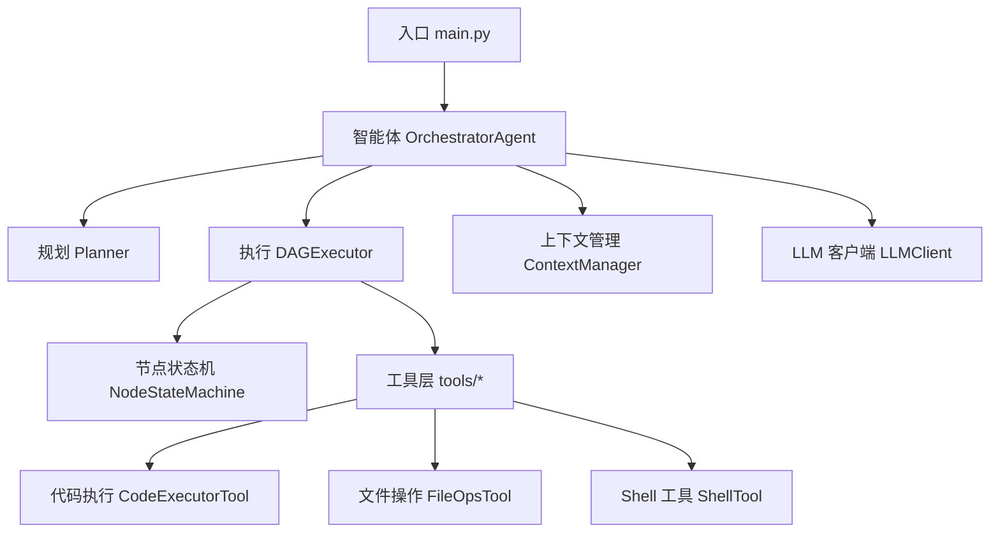
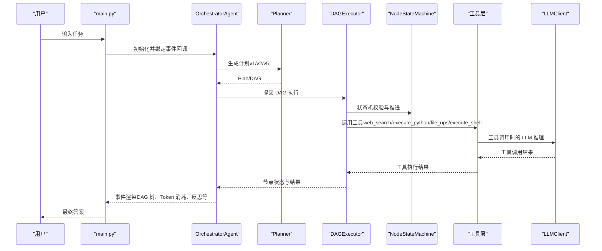
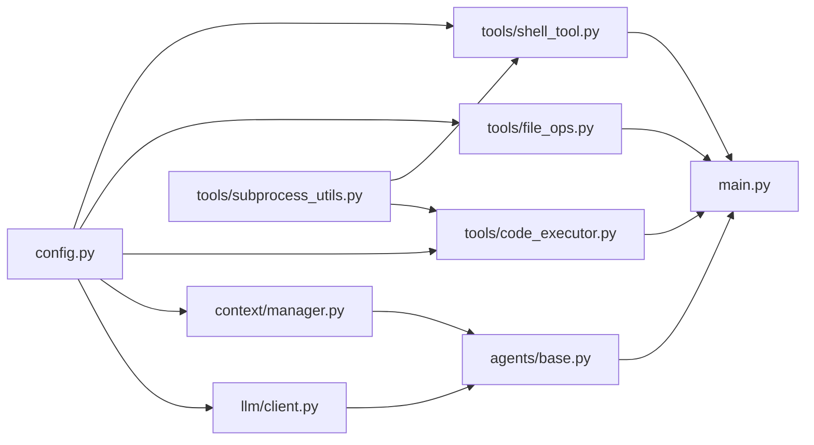

# 常见问题

<cite>
**本文引用的文件**
- [README_CN.md](file://README_CN.md)
- [README.md](file://README.md)
- [requirements.txt](file://requirements.txt)
- [config.py](file://config.py)
- [main.py](file://main.py)
- [llm/client.py](file://llm/client.py)
- [agents/base.py](file://agents/base.py)
- [context/manager.py](file://context/manager.py)
- [tools/code_executor.py](file://tools/code_executor.py)
- [tools/file_ops.py](file://tools/file_ops.py)
- [tools/shell_tool.py](file://tools/shell_tool.py)
- [tools/subprocess_utils.py](file://tools/subprocess_utils.py)
- [tests/test_dag_capabilities.py](file://tests/test_dag_capabilities.py)
- [sxw_aicoding/docs/llm-integration.md](file://sxw_aicoding/docs/llm-integration.md)
</cite>

## 目录
1. [简介](#简介)
2. [项目结构](#项目结构)
3. [核心组件](#核心组件)
4. [架构总览](#架构总览)
5. [详细组件分析](#详细组件分析)
6. [依赖分析](#依赖分析)
7. [性能考虑](#性能考虑)
8. [故障排查指南](#故障排查指南)
9. [结论](#结论)
10. [附录](#附录)

## 简介
本常见问题解答面向 manus_demo 用户，聚焦在使用过程中最常遇到的问题与解决方案，覆盖 LLM API 配置错误、工具执行失败、内存不足、超时、环境配置与网络连接、工具使用限制等。文档同时提供错误代码对照表、预防性措施与最佳实践，帮助您快速定位并解决问题。

## 项目结构
manus_demo 是一个基于 DAG 的多智能体系统，支持混合规划路由（v4）、隐式规划（v5）、ReAct 循环、工具路由与自适应规划等能力。核心模块包括：
- 入口与 UI：main.py
- 配置中心：config.py
- LLM 客户端：llm/client.py
- 智能体基类：agents/base.py
- 上下文管理：context/manager.py
- 工具层：tools/*（web_search、code_executor、file_ops、shell_tool、router）
- DAG 执行：dag/graph.py、dag/state_machine.py、dag/executor.py
- 记忆与知识：memory、knowledge
- 测试：tests/test_dag_capabilities.py

图表来源
- [main.py:34-41](file://main.py#L34-L41)
- [agents/base.py:29-54](file://agents/base.py#L29-L54)
- [context/manager.py:22-47](file://context/manager.py#L22-L47)
- [llm/client.py:32-59](file://llm/client.py#L32-L59)
- [tools/code_executor.py:25-38](file://tools/code_executor.py#L25-L38)
- [tools/file_ops.py:23-32](file://tools/file_ops.py#L23-L32)
- [tools/shell_tool.py:25-62](file://tools/shell_tool.py#L25-L62)

章节来源
- [README_CN.md:122-174](file://README_CN.md#L122-L174)
- [README.md:97-154](file://README.md#L97-L154)

## 核心组件
- 配置中心 config.py：统一加载 .env 或环境变量，提供 LLM API、执行限制、工具参数、追踪开关等配置项。
- LLM 客户端 llm/client.py：封装 OpenAI 兼容 API，支持可选重试（指数退避）、Token 使用追踪、可选全链路追踪。
- 智能体基类 agents/base.py：提供消息历史、上下文压缩、think/think_json/think_with_tools 等通用交互方法。
- 上下文管理 context/manager.py：基于粗略 Token 估算与 LLM 摘要压缩，维持对话上下文长度。
- 工具层：
  - CodeExecutorTool：Python 代码执行（沙箱、超时、并发限制、输出截断）。
  - FileOpsTool：沙箱目录内的文件读写与列出（路径穿越防护）。
  - ShellTool：Shell 命令执行（黑名单、沙箱、超时、并发限制、输出截断）。
  - subprocess_utils：统一子进程执行（超时、输出限制、安全环境变量）。

章节来源
- [config.py:1-109](file://config.py#L1-L109)
- [llm/client.py:32-420](file://llm/client.py#L32-L420)
- [agents/base.py:29-183](file://agents/base.py#L29-L183)
- [context/manager.py:22-187](file://context/manager.py#L22-L187)
- [tools/code_executor.py:25-102](file://tools/code_executor.py#L25-L102)
- [tools/file_ops.py:23-138](file://tools/file_ops.py#L23-L138)
- [tools/shell_tool.py:25-152](file://tools/shell_tool.py#L25-L152)
- [tools/subprocess_utils.py:38-156](file://tools/subprocess_utils.py#L38-L156)

## 架构总览
下图展示了从用户输入到最终答案的关键流程，以及关键错误易发点与防护机制：

图表来源
- [main.py:448-493](file://main.py#L448-L493)
- [llm/client.py:125-177](file://llm/client.py#L125-L177)
- [tools/code_executor.py:64-102](file://tools/code_executor.py#L64-L102)
- [tools/file_ops.py:73-138](file://tools/file_ops.py#L73-L138)
- [tools/shell_tool.py:99-152](file://tools/shell_tool.py#L99-L152)

## 详细组件分析

### LLM API 配置与错误处理
- 配置来源：优先加载 .env 或系统环境变量，支持 LLM_BASE_URL、LLM_API_KEY、LLM_MODEL、重试开关与退避参数等。
- 可重试错误：速率限制、请求超时、通用 API 错误；不可重试错误包括认证、参数、权限、配额等。
- 建议：生产环境开启 LLM_RETRY_ENABLED，合理设置 LLM_RETRY_MAX_ATTEMPTS 与 LLM_RETRY_BACKOFF_FACTOR；关注 Token 消耗追踪与上下文压缩。

章节来源
- [config.py:17-86](file://config.py#L17-L86)
- [llm/client.py:29-118](file://llm/client.py#L29-L118)
- [sxw_aicoding/docs/llm-integration.md:661-712](file://sxw_aicoding/docs/llm-integration.md#L661-L712)

### 工具执行失败（代码执行/文件操作/Shell）
- 代码执行（execute_python）：超时、异常、输出过大、沙箱目录权限、并发限制。
- 文件操作（file_ops）：路径逃逸、文件不存在、写入失败、沙箱目录权限。
- Shell（execute_shell）：命令黑名单命中、超时、输出过大、并发限制、工作目录。

章节来源
- [tools/code_executor.py:64-102](file://tools/code_executor.py#L64-L102)
- [tools/file_ops.py:73-138](file://tools/file_ops.py#L73-L138)
- [tools/shell_tool.py:99-152](file://tools/shell_tool.py#L99-L152)
- [tools/subprocess_utils.py:62-156](file://tools/subprocess_utils.py#L62-L156)

### 内存与输出限制
- 子进程输出限制：SUBPROCESS_MAX_OUTPUT_BYTES，超限截断并附加截断标记。
- 代码/Shell 执行超时：CODE_EXEC_TIMEOUT、SHELL_EXEC_TIMEOUT。
- 并发限制：CODE_MAX_CONCURRENT、SHELL_MAX_CONCURRENT。
- 上下文压缩：ContextManager 基于粗略 Token 估算与 LLM 摘要压缩，避免上下文溢出。

章节来源
- [config.py:71-77](file://config.py#L71-L77)
- [context/manager.py:82-136](file://context/manager.py#L82-L136)
- [tools/subprocess_utils.py:62-101](file://tools/subprocess_utils.py#L62-L101)

### 网络连接与代理
- LLM_BASE_URL 为 OpenAI 兼容接口地址，可指向任意兼容服务（含本地 Ollama）。
- 如需代理，请确保系统环境变量生效（HTTP_PROXY/HTTPS_PROXY），或在服务端配置网络策略。
- 若出现“无法连接”或“超时”，请检查网络连通性、DNS 解析与防火墙策略。

章节来源
- [README_CN.md:205-236](file://README_CN.md#L205-L236)
- [README.md:180-208](file://README.md#L180-L208)

### 环境与依赖
- Python 版本：3.11+。
- 依赖安装：pip install -r requirements.txt；运行测试需 pytest 与 pytest-asyncio。
- 虚拟环境：建议使用 venv 并激活后再安装依赖。

章节来源
- [README_CN.md:180-203](file://README_CN.md#L180-L203)
- [README.md:158-179](file://README.md#L158-L179)
- [requirements.txt:1-19](file://requirements.txt#L1-L19)

## 依赖分析
- LLM 客户端依赖 openai 异步客户端，支持重试与追踪。
- 工具层依赖 subprocess_utils 提供统一的子进程执行能力。
- 上下文管理依赖 LLMClient 进行摘要压缩。
- main.py 注册工具并绑定事件回调，驱动 UI 渲染。

图表来源
- [config.py:1-109](file://config.py#L1-L109)
- [llm/client.py:32-59](file://llm/client.py#L32-L59)
- [context/manager.py:22-47](file://context/manager.py#L22-L47)
- [tools/code_executor.py:18-21](file://tools/code_executor.py#L18-L21)
- [tools/shell_tool.py:18-21](file://tools/shell_tool.py#L18-L21)
- [agents/base.py:23-26](file://agents/base.py#L23-L26)
- [main.py:34-41](file://main.py#L34-L41)

章节来源
- [requirements.txt:1-19](file://requirements.txt#L1-L19)

## 性能考虑
- 并行执行：MAX_PARALLEL_NODES 控制 Super-step 并行节点数，提升吞吐但占用更多资源。
- 上下文压缩：合理设置 MAX_CONTEXT_TOKENS，避免频繁压缩导致信息丢失。
- 工具并发：CODE_MAX_CONCURRENT、SHELL_MAX_CONCURRENT 限制并发，防止资源争用。
- 超时与输出：CODE_EXEC_TIMEOUT、SHELL_EXEC_TIMEOUT、SUBPROCESS_MAX_OUTPUT_BYTES 平衡稳定性与可观测性。
- Token 追踪：开启 TOKEN_TRACKING_ENABLED 以便优化 prompt 与上下文长度。

章节来源
- [config.py:44-77](file://config.py#L44-L77)
- [context/manager.py:40-47](file://context/manager.py#L40-L47)
- [llm/client.py:273-311](file://llm/client.py#L273-L311)

## 故障排查指南

### 一、环境与依赖问题
- 症状：运行时报 ModuleNotFoundError 或找不到模块
  - 可能原因：未激活虚拟环境或依赖未安装
  - 解决步骤：
    1) 激活虚拟环境并安装依赖：pip install -r requirements.txt
    2) 确认 Python 版本为 3.11+
    3) 如需测试，安装 pytest 与 pytest-asyncio
- 症状：导入 config 时配置值异常
  - 可能原因：.env 未正确放置或环境变量覆盖顺序
  - 解决步骤：检查 .env 与系统环境变量优先级，确认 LLM_BASE_URL、LLM_API_KEY、LLM_MODEL 设置

章节来源
- [README_CN.md:180-203](file://README_CN.md#L180-L203)
- [README.md:158-179](file://README.md#L158-L179)
- [config.py:11-19](file://config.py#L11-L19)

### 二、LLM API 配置错误
- 症状：认证失败、速率限制、超时、配额不足
  - 可能原因：API Key 无效、网络不稳定、服务端限流
  - 解决步骤：
    1) 校验 LLM_API_KEY 与 LLM_BASE_URL 正确性
    2) 生产环境开启 LLM_RETRY_ENABLED，设置合理重试次数与退避因子
    3) 调整超时与上下文长度，避免频繁压缩
- 症状：返回 JSON 解析失败
  - 可能原因：模型不支持 response_format 或输出格式不规范
  - 解决步骤：使用 chat_json 的降级逻辑，或调整模型/温度参数

章节来源
- [config.py:82-86](file://config.py#L82-L86)
- [llm/client.py:204-228](file://llm/client.py#L204-L228)
- [sxw_aicoding/docs/llm-integration.md:661-712](file://sxw_aicoding/docs/llm-integration.md#L661-L712)

### 三、工具执行失败
- 代码执行（execute_python）
  - 症状：超时、异常、无输出、输出过大
  - 可能原因：代码执行时间过长、抛出异常、输出超过限制
  - 解决步骤：提高 CODE_EXEC_TIMEOUT、缩小输出、拆分子任务、检查沙箱目录权限
- 文件操作（file_ops）
  - 症状：路径逃逸、文件不存在、写入失败
  - 可能原因：路径穿越、权限不足、沙箱目录未创建
  - 解决步骤：确认 SANDBOX_DIR 存在且可写；避免使用相对路径或 ..；检查文件名与权限
- Shell（execute_shell）
  - 症状：命令被拦截、超时、输出过大
  - 可能原因：黑名单命中、并发过多、工作目录受限
  - 解决步骤：检查命令是否在黑名单中；降低并发；增大 SHELL_EXEC_TIMEOUT；确认工作目录

章节来源
- [tools/code_executor.py:64-102](file://tools/code_executor.py#L64-L102)
- [tools/file_ops.py:73-138](file://tools/file_ops.py#L73-L138)
- [tools/shell_tool.py:99-152](file://tools/shell_tool.py#L99-L152)
- [tools/subprocess_utils.py:62-156](file://tools/subprocess_utils.py#L62-L156)

### 四、内存不足与输出过大
- 症状：子进程输出被截断、内存占用飙升
- 可能原因：单次输出超过 SUBPROCESS_MAX_OUTPUT_BYTES
- 解决步骤：降低输出体量、拆分任务、提高输出限制（谨慎）、检查日志与中间产物清理

章节来源
- [config.py:74-74](file://config.py#L74-L74)
- [tools/subprocess_utils.py:104-156](file://tools/subprocess_utils.py#L104-L156)

### 五、超时问题
- 症状：节点执行超时、工具调用超时
- 可能原因：任务复杂度高、网络延迟、并发过高
- 解决步骤：提高 CODE_EXEC_TIMEOUT/SHELL_EXEC_TIMEOUT；降低并发；优化任务结构；启用重试

章节来源
- [config.py:72-76](file://config.py#L72-L76)
- [llm/client.py:93-115](file://llm/client.py#L93-L115)

### 六、网络连接问题
- 症状：无法连接 LLM 服务、代理设置无效
- 可能原因：防火墙阻断、DNS 解析失败、代理未生效
- 解决步骤：检查 LLM_BASE_URL 与网络连通性；配置系统代理；确保服务端放行

章节来源
- [README_CN.md:205-236](file://README_CN.md#L205-L236)
- [README.md:180-208](file://README.md#L180-L208)

### 七、工具使用问题（权限与沙箱）
- 症状：文件读写失败、Shell 命令被拦截
- 可能原因：沙箱目录权限不足、命令黑名单
- 解决步骤：确保沙箱目录存在且可读写；避免危险命令；必要时调整黑名单策略

章节来源
- [tools/file_ops.py:29-32](file://tools/file_ops.py#L29-L32)
- [tools/shell_tool.py:31-55](file://tools/shell_tool.py#L31-L55)

### 八、错误代码对照表
- LLM 可重试错误
  - RateLimitError：速率限制，等待后可恢复
  - APITimeoutError：请求超时，网络或服务端问题
  - APIError：通用 API 错误，包含临时故障
- LLM 不可重试错误
  - 认证错误：API Key 无效或过期
  - 参数错误：请求参数格式不正确
  - 权限错误：无权访问指定资源
  - 配额超限：账户余额不足或配额用尽

章节来源
- [sxw_aicoding/docs/llm-integration.md:661-712](file://sxw_aicoding/docs/llm-integration.md#L661-L712)

### 九、预防性措施与最佳实践
- 配置层面
  - 使用 .env 管理敏感配置，生产环境通过环境变量覆盖
  - 启用 LLM 重试与指数退避，合理设置最大重试次数与退避因子
  - 开启 Token 追踪与上下文压缩，避免上下文溢出
- 执行层面
  - 控制并行度与超时，避免资源争用与超时
  - 使用沙箱目录与命令黑名单，降低安全风险
  - 对输出进行截断与归档，避免内存压力
- 监控与日志
  - 使用详细日志模式（-v）定位问题
  - 结合 UI 事件流观察节点状态与工具调用详情

章节来源
- [config.py:82-109](file://config.py#L82-L109)
- [main.py:396-413](file://main.py#L396-L413)
- [context/manager.py:82-136](file://context/manager.py#L82-L136)
- [README_CN.md:271-277](file://README_CN.md#L271-L277)

## 结论
通过合理的配置、严格的沙箱与并发控制、完善的重试与超时策略，以及对上下文与输出的精细化管理，manus_demo 能够稳定地完成复杂任务的规划与执行。遇到问题时，建议按“环境与依赖 → LLM 配置 → 工具执行 → 超时与内存 → 网络连接”的顺序排查，并结合 UI 事件与日志进行定位。

## 附录

### A. 常见问题速查清单
- 环境问题：Python 版本不符、依赖缺失、虚拟环境未激活
- API 问题：Key 无效、URL 错误、服务限流、超时、配额不足
- 工具问题：超时、异常、输出过大、路径逃逸、命令被拦截
- 性能问题：上下文过长、并发过高、输出未截断
- 网络问题：代理未生效、DNS 不通、防火墙阻断

章节来源
- [README_CN.md:489-514](file://README_CN.md#L489-L514)
- [README.md:158-208](file://README.md#L158-L208)